# 分布式计算知识图谱

> 🕸️ 可视化主题关系 | 知识依赖图 | 学习导航

---

## 📊 核心知识关系图

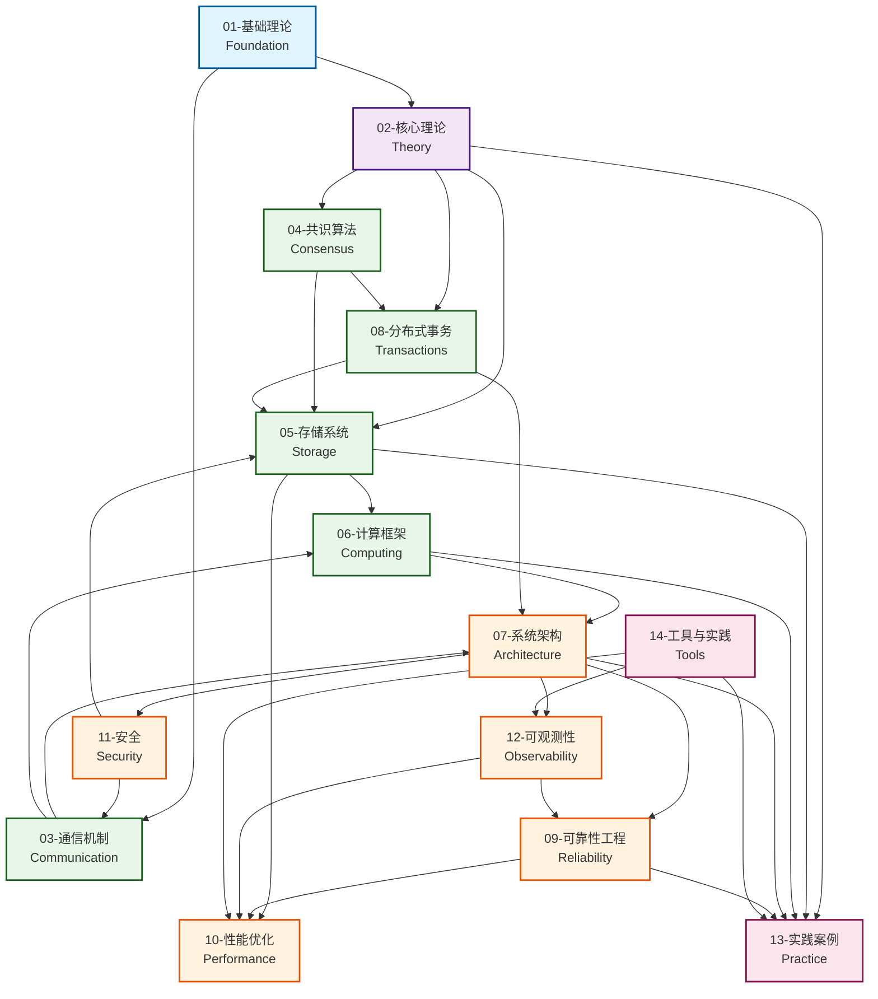

---

## 🎯 15大主题域详解

### 01 - 基础理论 (Foundation)

**核心概念**: MapReduce论文、形式化验证、Safety/Liveness

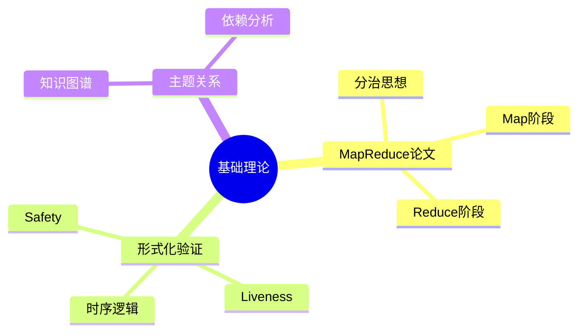

**前置知识**: 无
**下游依赖**: 全部主题域

---

### 02 - 核心理论 (Theory)

**核心概念**: CAP定理、FLP不可能性、一致性模型、共识算法、形式化方法

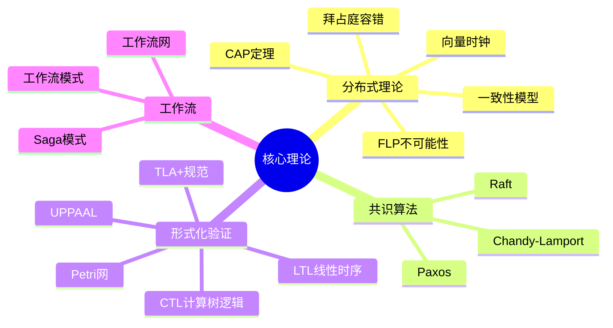

**前置知识**: 基础理论
**下游依赖**: 共识算法、存储系统、事务处理

---

### 03 - 通信机制 (Communication)

**核心概念**: RPC、消息队列、序列化、服务发现、网络协议

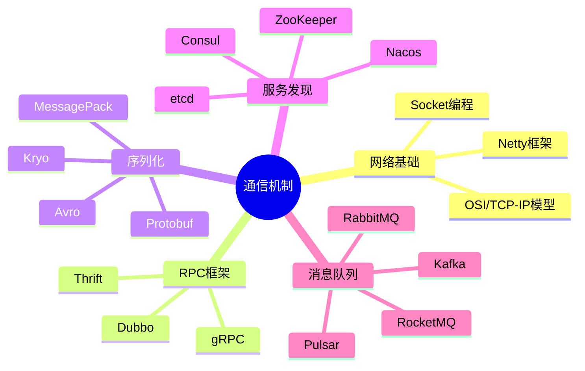

**前置知识**: 网络基础
**下游依赖**: 系统架构、计算框架

---

### 04 - 共识算法 (Consensus)

**核心概念**: Paxos、Raft、BFT、区块链共识

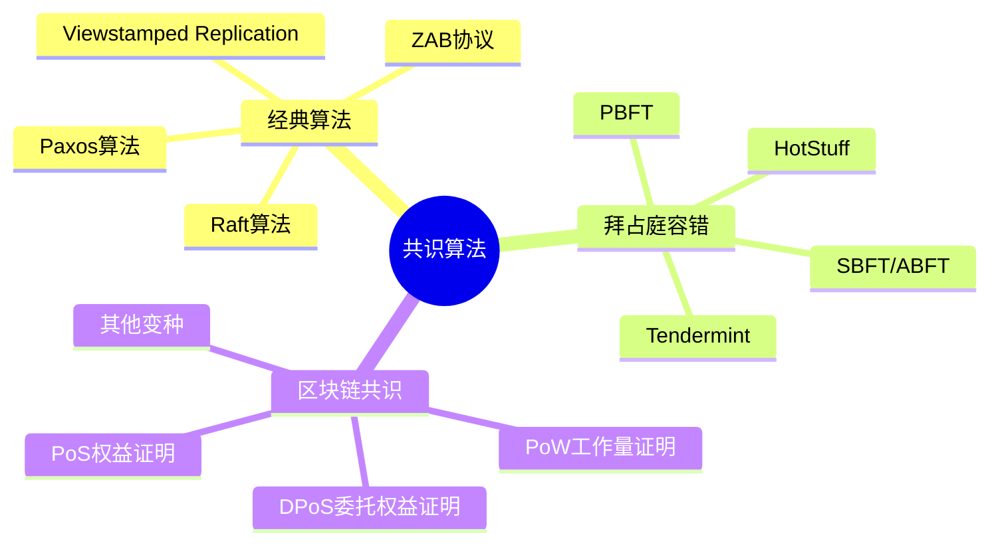

**前置知识**: 核心理论
**下游依赖**: 存储系统、分布式事务

---

### 05 - 存储系统 (Storage)

**核心概念**: 存储引擎、NoSQL、NewSQL、分布式文件系统、复制与分片

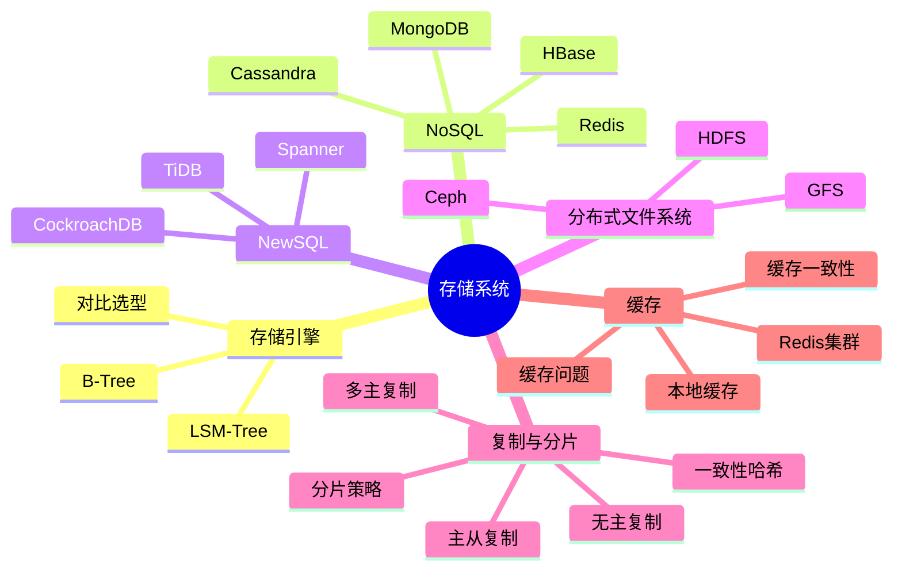

**前置知识**: 共识算法、核心理论
**下游依赖**: 计算框架、性能优化

---

### 06 - 计算框架 (Computing)

**核心概念**: 批处理、流处理、机器学习、资源调度、查询引擎

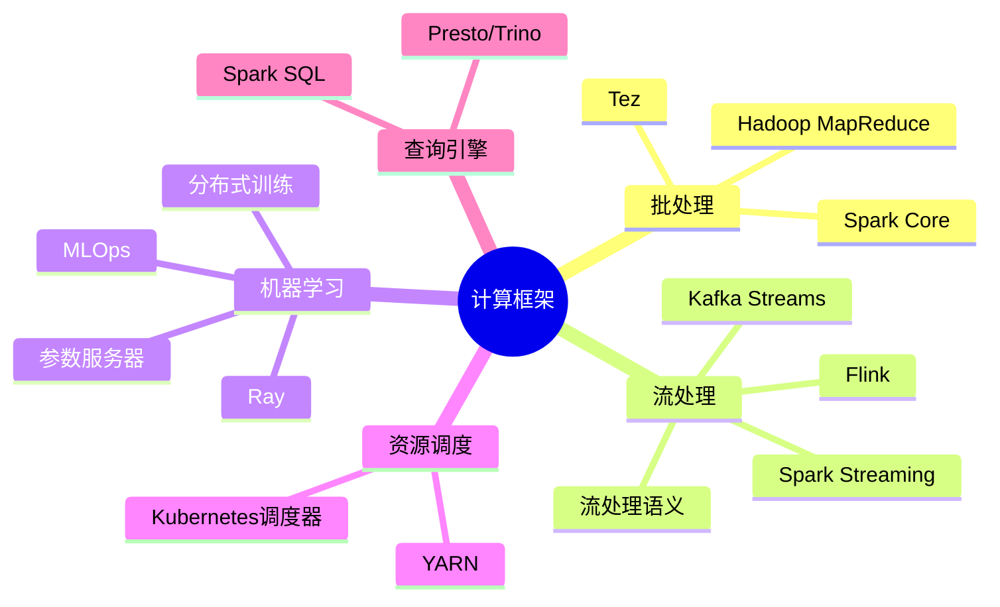

**前置知识**: 存储系统、通信机制
**下游依赖**: 系统架构

---

### 07 - 系统架构 (Architecture)

**核心概念**: 微服务、云原生、容器技术、K8s生态

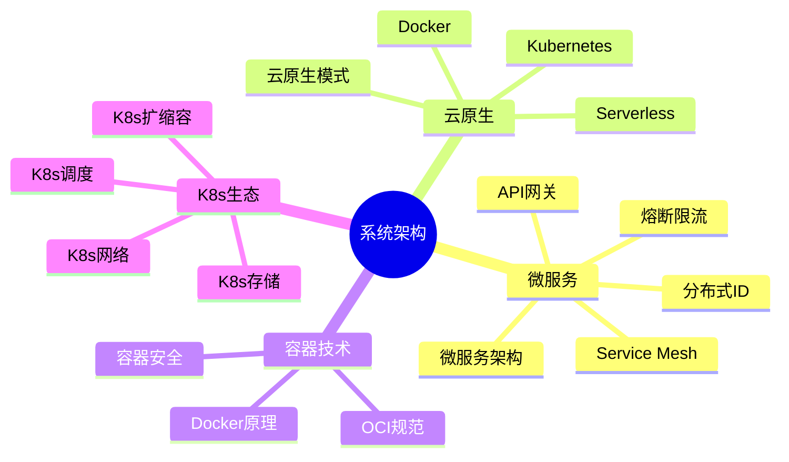

**前置知识**: 通信机制、计算框架
**下游依赖**: 可靠性、安全、可观测性

---

### 08 - 分布式事务 (Transactions)

**核心概念**: ACID/BASE、2PC/3PC、Saga、TCC、MVCC

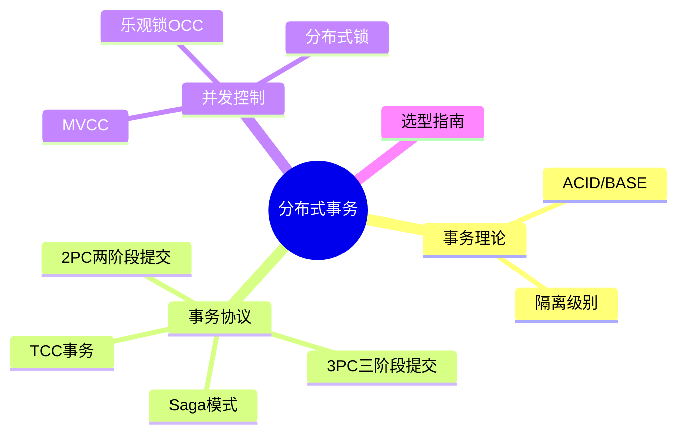

**前置知识**: 核心理论、共识算法
**下游依赖**: 存储系统、系统架构

---

### 09 - 可靠性工程 (Reliability)

**核心概念**: 容错设计、故障检测、故障恢复、灾备、混沌工程

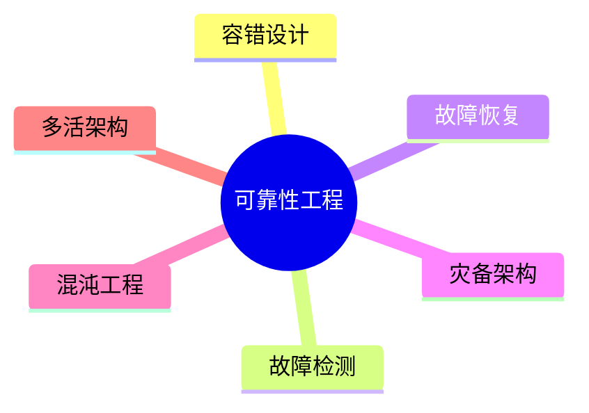

**前置知识**: 系统架构
**下游依赖**: 性能优化、可观测性

---

### 10 - 性能优化 (Performance)

**核心概念**: 性能指标、延迟优化、吞吐量优化、JVM调优

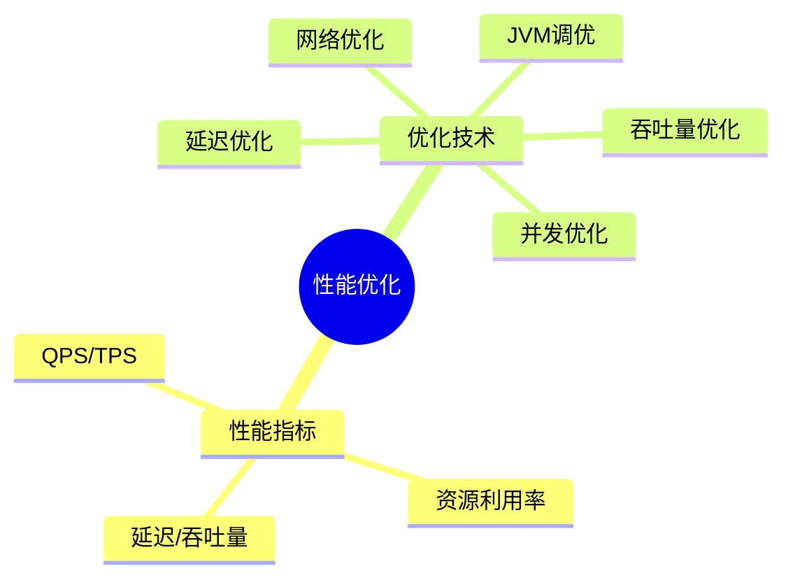

**前置知识**: 存储系统、计算框架
**下游依赖**: 可观测性

---

### 11 - 安全 (Security)

**核心概念**: TLS/SSL、OAuth、JWT、零信任

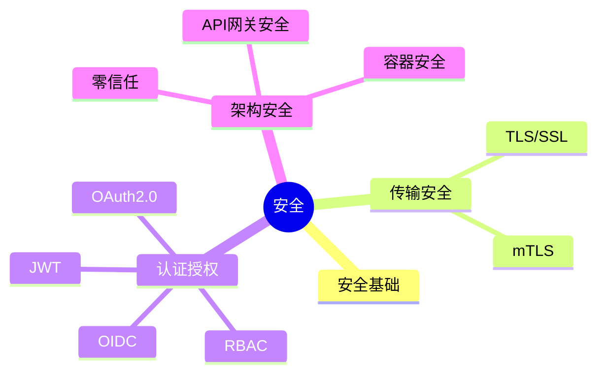

**前置知识**: 通信机制、系统架构
**下游依赖**: 无（横向支撑）

---

### 12 - 可观测性 (Observability)

**核心概念**: Metrics、Logs、Traces、SRE

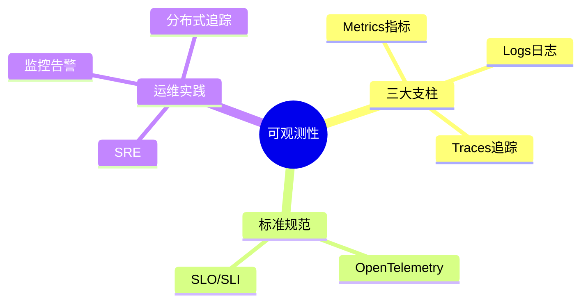

**前置知识**: 系统架构
**下游依赖**: 可靠性工程

---

### 13 - 实践案例 (Practice)

**核心概念**: 架构案例、面试题、设计指南

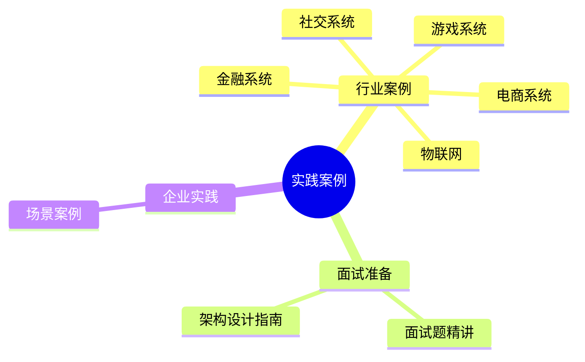

**前置知识**: 全部主题域
**下游依赖**: 无（最终应用）

---

### 14 - 工具与实践 (Tools)

**核心概念**: 压测工具、监控工具链、CI/CD

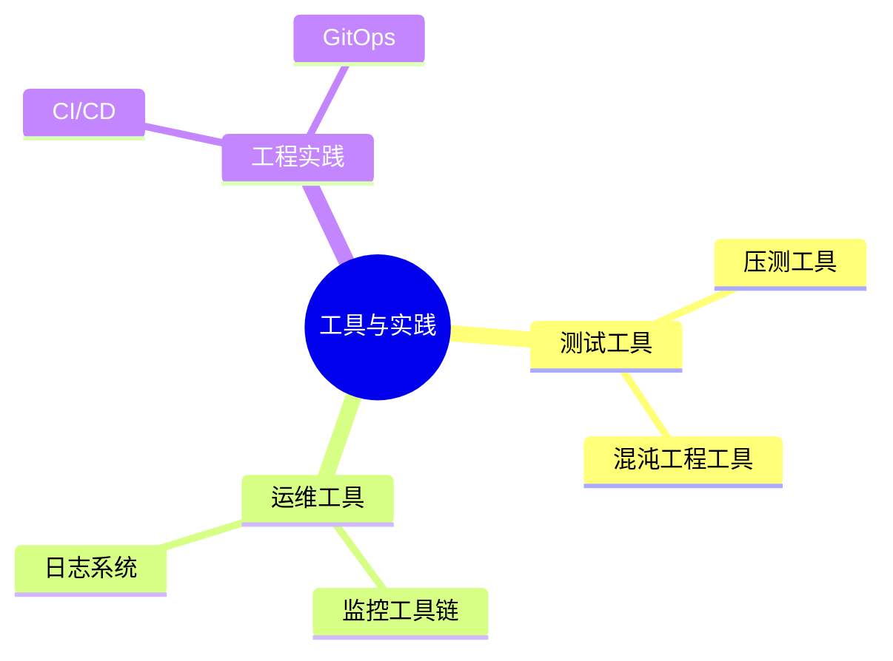

**前置知识**: 可观测性、性能优化
**下游依赖**: 实践案例

---

## 🔄 知识依赖关系

### 学习路径依赖图

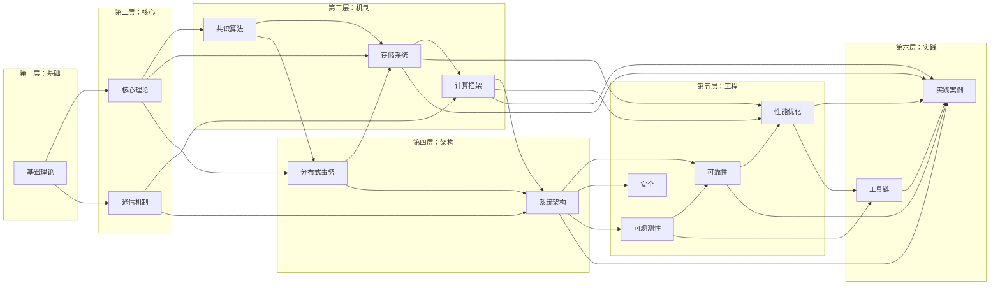

---

## 📈 主题域关联热力图

| 主题域 | 01 | 02 | 03 | 04 | 05 | 06 | 07 | 08 | 09 | 10 | 11 | 12 | 13 | 14 |
|:---:|:---:|:---:|:---:|:---:|:---:|:---:|:---:|:---:|:---:|:---:|:---:|:---:|:---:|:---:|
| **01-基础** | ● | ◐ | ○ | ○ | ○ | ○ | ○ | ○ | ○ | ○ | ○ | ○ | ○ | ○ |
| **02-理论** | ◐ | ● | ◐ | ◐ | ◐ | ○ | ○ | ◐ | ○ | ○ | ○ | ○ | ◐ | ○ |
| **03-通信** | ○ | ◐ | ● | ○ | ◐ | ◐ | ◐ | ○ | ○ | ○ | ◐ | ○ | ○ | ○ |
| **04-共识** | ○ | ◐ | ○ | ● | ◐ | ○ | ○ | ◐ | ○ | ○ | ○ | ○ | ○ | ○ |
| **05-存储** | ○ | ◐ | ◐ | ◐ | ● | ◐ | ○ | ◐ | ○ | ◐ | ◐ | ○ | ◐ | ○ |
| **06-计算** | ○ | ○ | ◐ | ○ | ◐ | ● | ◐ | ○ | ○ | ◐ | ○ | ○ | ◐ | ○ |
| **07-架构** | ○ | ○ | ◐ | ○ | ○ | ◐ | ● | ◐ | ◐ | ○ | ◐ | ◐ | ◐ | ○ |
| **08-事务** | ○ | ◐ | ○ | ◐ | ◐ | ○ | ◐ | ● | ○ | ○ | ○ | ○ | ○ | ○ |
| **09-可靠** | ○ | ○ | ○ | ○ | ○ | ○ | ◐ | ○ | ● | ◐ | ○ | ◐ | ◐ | ○ |
| **10-性能** | ○ | ○ | ○ | ○ | ◐ | ◐ | ○ | ○ | ◐ | ● | ○ | ◐ | ◐ | ◐ |
| **11-安全** | ○ | ○ | ◐ | ○ | ◐ | ○ | ◐ | ○ | ○ | ○ | ● | ○ | ○ | ○ |
| **12-观测** | ○ | ○ | ○ | ○ | ○ | ○ | ◐ | ○ | ◐ | ◐ | ○ | ● | ○ | ◐ |
| **13-实践** | ○ | ◐ | ○ | ○ | ◐ | ◐ | ◐ | ○ | ◐ | ◐ | ○ | ○ | ● | ◐ |
| **14-工具** | ○ | ○ | ○ | ○ | ○ | ○ | ○ | ○ | ○ | ◐ | ○ | ◐ | ◐ | ● |

**图例**: ● 核心关联 | ◐ 强关联 | ○ 弱关联

---

## 🔗 跨域知识连接点

### 关键连接主题

| 连接点 | 涉及主题域 | 说明 |
|:---|:---|:---|
| **一致性** | 02-理论, 04-共识, 05-存储, 08-事务 | 从CAP到具体实现 |
| **容错** | 02-理论, 04-共识, 09-可靠性 | 理论基础到工程实践 |
| **分布式协调** | 03-通信, 04-共识, 07-架构 | ZooKeeper/etcd应用 |
| **高性能存储** | 05-存储, 06-计算, 10-性能 | 存储计算分离与优化 |
| **云原生架构** | 03-通信, 06-计算, 07-架构, 12-可观测性 | 完整技术栈 |
| **数据一致性** | 04-共识, 05-存储, 08-事务 | 强一致与最终一致 |
| **安全通信** | 03-通信, 07-架构, 11-安全 | 端到端安全 |

---

**最后更新**: 2026-04-04 | **维护者**: 分布式计算知识库团队
