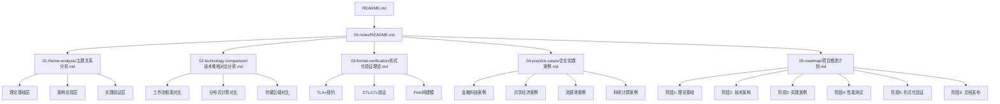

# 项目结构总览

## 一、项目目录结构

```text
DistributedComputing-WorkFlow/
├── README.md                    # 项目主README
├── LICENSE                      # 许可证文件
├── ai_prompt.md                 # 原始分析文档
│
├── docs/                        # 文档目录
│   ├── 00-index/               # 索引和概览
│   │   ├── README.md           # 文档索引
│   │   └── 项目结构总览.md     # 本文档
│   │
│   ├── 01-theme-analysis/      # 主题关系分析
│   │   └── 主题关系分析.md     # 主题和子主题关系梳理
│   │
│   ├── 02-technology-comparison/  # 技术堆栈对比
│   │   └── 技术堆栈对比分析.md   # 框架对比分析
│   │
│   ├── 03-formal-verification/   # 形式化验证理论
│   │   └── 形式化验证理论.md     # TLA+、CTL/LTL等
│   │
│   ├── 04-practice-cases/        # 企业实践案例
│   │   └── 企业实践案例.md       # 深度案例分析
│   │
│   ├── 05-roadmap/              # 项目推进计划
│   │   └── 项目推进计划.md       # 32周详细计划
│   │
│   ├── 06-benchmarks/           # 性能基准测试
│   │   └── 性能基准测试.md       # 详细性能测试报告
│   │
│   ├── 07-international-benchmark/  # 国际对标分析
│   │   └── 国际对标分析.md         # 国际对标报告
│   │
│   └── 08-summary/              # 综合评估报告
│       └── 综合评估报告.md       # 综合评估和结论
│
├── analysis/                    # 分析目录（待扩展）
│   ├── benchmarks/             # 性能基准测试
│   ├── formal-proofs/          # 形式化证明
│   └── case-studies/           # 案例研究
│
├── tools/                       # 工具目录（待扩展）
│   ├── verification/           # 验证工具
│   ├── benchmarking/           # 基准测试工具
│   └── visualization/          # 可视化工具
│
└── references/                  # 参考文献（待扩展）
    ├── papers/                 # 学术论文
    ├── standards/              # 标准文档
    └── courses/                # 课程资料
```

## 二、文档关系图



## 三、核心主题体系

### 3.1 理论层（Theoretical Layer）

- **形式化语义模型**：TLA+、CTL/LTL、Petri网、π-calculus
- **时序逻辑验证**：CTL、LTL、时间自动机、ATL
- **国际学术支撑**：MIT、Stanford、CMU、USTC课程

### 3.2 架构层（Architecture Layer）

- **核心引擎**：Durable Execution、事件溯源、MVCC、Saga
- **存储后端**：PostgreSQL、Cassandra、TimescaleDB、FoundationDB
- **语言绑定**：Go、Java、TypeScript、Python
- **树形架构模式**：工作流编排树、微服务调用树、事件溯源树、数据存储树（新增）

### 3.3 实践层（Practice Layer）

- **金融科技**：Coinbase、Stripe、Robinhood
- **共享经济**：Uber、Airbnb、Lyft
- **流媒体**：Netflix、Spotify、Datadog
- **科研计算**：CERN/LHC、NIH、SpaceX

### 3.4 验证层（Verification Layer）

- **构建时验证**：TLA+、Petri网、CTL/LTL
- **运行时验证**：TVS策略、性能监控
- **工具链**：TLA+ Toolbox、UPPAAL、SPIN

## 四、文档阅读路径

### 路径1：快速了解（30分钟）

1. README.md - 项目概览
2. docs/00-index/README.md - 文档索引
3. docs/02-technology-comparison/技术堆栈对比分析.md - 技术选型

### 路径2：深入学习（2-3小时）

1. docs/01-theme-analysis/主题关系分析.md - 理解整体架构
2. docs/02-technology-comparison/技术堆栈对比分析.md - 技术对比
3. docs/04-practice-cases/企业实践案例.md - 实践案例
4. docs/03-formal-verification/形式化验证理论.md - 理论基础

### 路径3：全面研究（1-2天）

1. 按顺序阅读所有文档
2. 参考原始文档 ai_prompt.md
3. 深入研究形式化验证理论
4. 分析企业实践案例细节

### 路径4：项目推进（按计划）

1. docs/05-roadmap/项目推进计划.md - 了解推进计划
2. 按阶段执行任务
3. 参考相关文档支持工作

## 五、关键文档说明

### 5.1 主题关系分析

**位置**：`docs/01-theme-analysis/主题关系分析.md`

**内容**：

- 核心主题体系
- 主题依赖关系图
- 主题优先级矩阵
- 主题演进路径

**适用场景**：

- 理解项目整体架构
- 确定研究方向
- 制定学习计划

### 5.2 技术堆栈对比

**位置**：`docs/02-technology-comparison/技术堆栈对比分析.md`

**内容**：

- 工作流框架对比矩阵
- 分布式计算框架对比
- 存储后端详细对比
- 选型决策树

**适用场景**：

- 技术选型决策
- 性能对比分析
- 成本效益评估

### 5.3 形式化验证理论

**位置**：`docs/03-formal-verification/形式化验证理论.md`

**内容**：

- 形式化语义模型
- 时序逻辑验证框架
- 容错边界证明
- TLA+规约示例

**适用场景**：

- 系统正确性验证
- 性质证明
- 死锁检测

### 5.4 企业实践案例

**位置**：`docs/04-practice-cases/企业实践案例.md`

**内容**：

- 金融科技案例（Coinbase、Stripe）
- 共享经济案例（Uber、Airbnb）
- 流媒体案例（Netflix、Spotify）
- 科研计算案例（CERN、NIH）

**适用场景**：

- 学习最佳实践
- 性能优化参考
- 架构设计参考

### 5.5 项目推进计划

**位置**：`docs/05-roadmap/项目推进计划.md`

**内容**：

- 6个阶段详细计划
- 32周时间表
- 资源需求
- 风险管控

**适用场景**：

- 项目规划
- 进度管理
- 资源分配

## 六、扩展计划

### 6.1 短期扩展（1-3个月）

- [ ] 补充性能基准测试数据
- [ ] 添加更多企业案例
- [ ] 完善形式化验证工具链
- [ ] 开发可视化工具

### 6.2 中期扩展（3-6个月）

- [ ] 建立测试环境
- [ ] 执行性能基准测试
- [ ] 开发验证工具
- [ ] 组织技术分享

### 6.3 长期扩展（6-12个月）

- [ ] 贡献开源社区
- [ ] 发表学术论文
- [ ] 建立咨询业务
- [ ] 开发培训课程

## 七、贡献指南

### 7.1 文档贡献

1. Fork项目
2. 创建功能分支
3. 提交更改
4. 发起Pull Request

### 7.2 内容贡献

- 补充企业案例
- 完善技术对比
- 添加形式化证明
- 优化文档质量

### 7.3 工具贡献

- 开发验证工具
- 创建基准测试工具
- 开发可视化工具

## 八、联系方式

- **项目地址**：GitHub Repository
- **问题反馈**：GitHub Issues
- **讨论交流**：GitHub Discussions

---

## 九、相关文档

### 9.1 项目内部文档

#### 索引和导航文档

- **[README](README.md)** - 文档索引，项目文档总览
- **[文档导航图](文档导航图.md)** - 完整的文档导航和阅读路径

#### 核心文档

- **[主题关系分析](../01-theme-analysis/主题关系分析.md)** - 主题关系分析，项目主题结构
- **[技术堆栈对比分析](../02-technology-comparison/技术堆栈对比分析.md)** - 技术堆栈对比分析，技术选型依据
- **[形式化验证理论](../03-formal-verification/形式化验证理论.md)** - 形式化验证理论，理论基础

#### 项目管理文档

- **[项目推进计划](../05-roadmap/项目推进计划.md)** - 项目推进计划，项目路线图
- **[综合评估报告](../08-summary/综合评估报告.md)** - 综合评估报告，项目整体评估

### 9.2 外部资源链接

#### Wikipedia资源

- [Software architecture](https://en.wikipedia.org/wiki/Software_architecture) - 软件架构
- [Project structure](https://en.wikipedia.org/wiki/Project_structure) - 项目结构
- [Documentation](https://en.wikipedia.org/wiki/Documentation) - 文档

### 9.3 项目管理文档

- **[Wikipedia资源对标](../../structure_control/Wikipedia资源对标.md)** - Wikipedia资源对标
- **[概念关联网络](../../structure_control/概念关联网络.md)** - 项目结构总览在概念关联网络中的位置

---

**文档版本**：1.1

**最后更新**：2025年11月28日

**维护者**：项目团队
