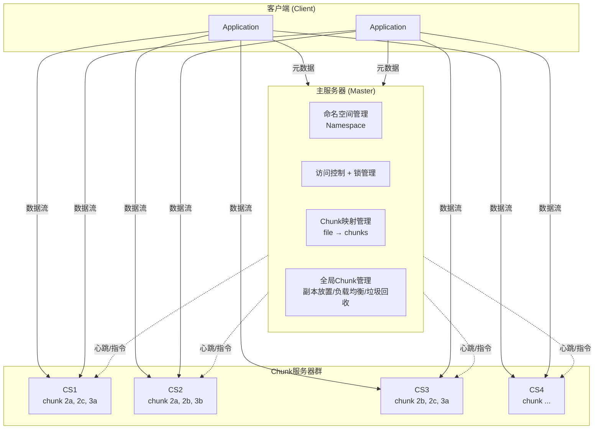
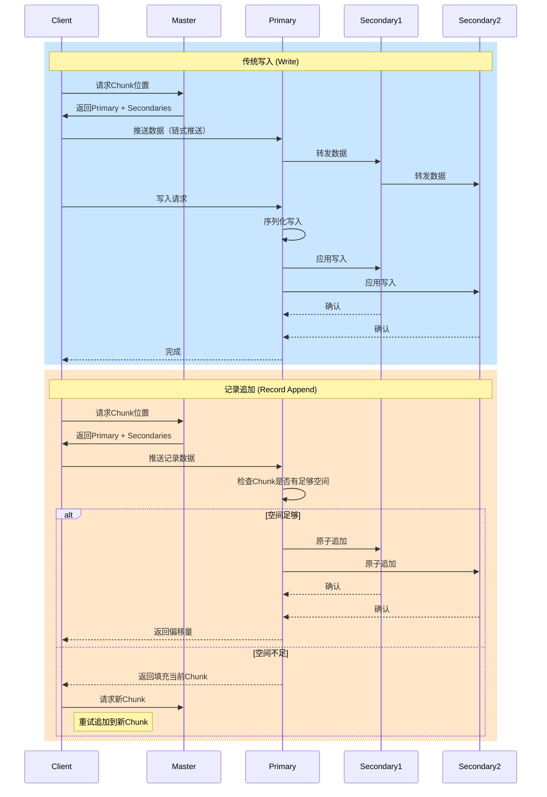
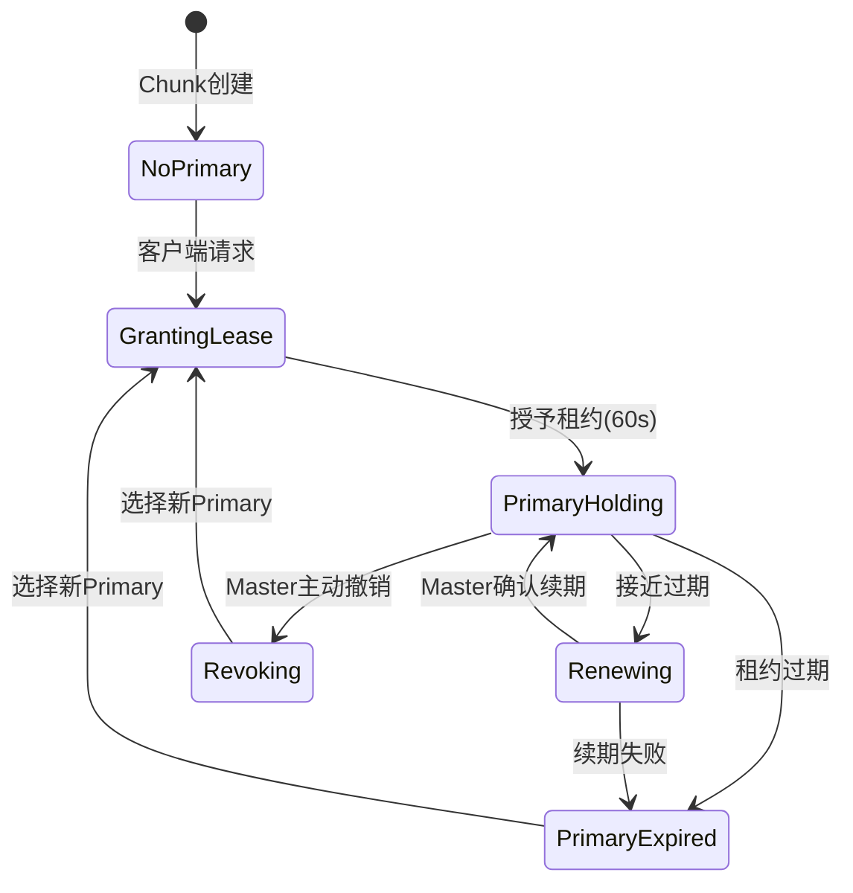
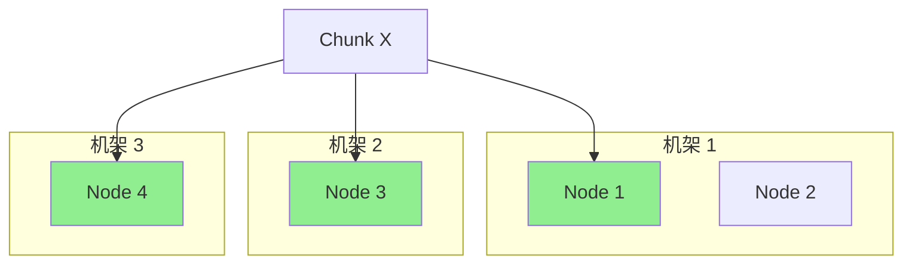
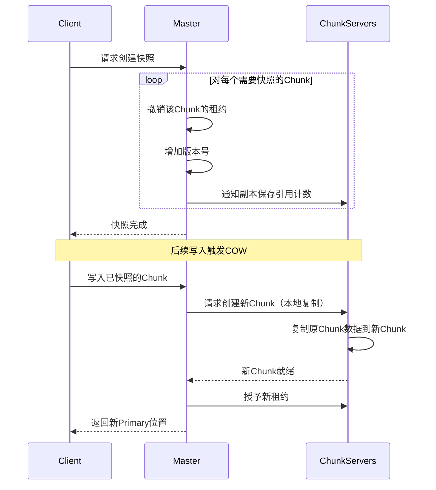

# GFS论文精读

> **原始论文**: Ghemawat, S., Gobioff, H., & Leung, S. T. (2003). The Google File System. *SOSP'03*.
>
> **MIT 6.824** 核心阅读材料，Lab 2 (Raft) 的前置知识

## 一、设计背景与动机

### 1.1 传统分布式文件系统的局限

| 特性 | 传统DFS (如NFS) | Google需求 |
|-----|----------------|-----------|
| 节点故障 | 罕见 | 常态（数千节点） |
| 文件大小 | 主要小文件 | 主要大文件（GB级） |
| 修改模式 | 随机读写 | 追加为主，极少随机写 |
| 一致性要求 | 强一致性 | 宽松一致性可接受 |
| 吞吐量 vs 延迟 | 平衡 | 优先高吞吐 |

### 1.2 GFS设计假设

1. **组件故障是常态**：随时可能发生故障，需要持续监控和恢复
2. **文件巨大**：数GB的文件很常见，需要高效管理大文件
3. **修改主要是追加**：随机写几乎不存在，追加是主要模式
4. **同时读和追加**：需要高效支持多个客户端并发追加
5. **高吞吐优先于低延迟**：批处理应用优先考虑带宽

## 二、系统架构

### 2.1 整体架构



### 2.2 Chunk设计

```
┌─────────────────────────────────────────────────────────┐
│                      大文件 (如: 10GB)                    │
├─────────┬─────────┬─────────┬─────────┬─────────────────┤
│ Chunk 0 │ Chunk 1 │ Chunk 2 │ Chunk 3 │ ... Chunk N     │
│ 64MB    │ 64MB    │ 64MB    │ 64MB    │                 │
└─────────┴─────────┴─────────┴─────────┴─────────────────┘
         ↓
┌─────────┐  ┌─────────┐  ┌─────────┐
│Chunk 0a │  │Chunk 0b │  │Chunk 0c │  ← 3个副本 (默认)
│CS1      │  │CS2      │  │CS3      │
└─────────┘  └─────────┘  └─────────┘
```

**Chunk大小选择：64MB**

| 优势 | 说明 |
|-----|------|
| 减少Master内存占用 | 大文件只需较少Chunk记录 |
| 减少客户端-Master交互 | 大块减少元数据请求频率 |
| 减少网络开销 | 长连接TCP减少建立开销 |
| 减少元数据大小 | Master只需管理少量Chunk元数据 |

| 劣势 | 解决方案 |
|-----|---------|
| 小文件浪费空间 | 延迟分配，压缩元数据 |
| 热点Chunk | 增加副本数，缓存 |

## 三、Master元数据管理

### 3.1 元数据结构

```go
// Master内存中的核心数据结构
type Master struct {
    // 1. 命名空间树 (文件和目录)
    namespace map[string]*INode  // 路径 → INode

    // 2. 文件到Chunk的映射
    fileToChunks map[string][]ChunkHandle  // 文件名 → Chunk句柄列表

    // 3. Chunk元数据
    chunkTable map[ChunkHandle]*ChunkInfo
}

type ChunkInfo struct {
    handle    ChunkHandle   // 全局唯一ID
    version   int64         // 版本号，检测过期副本
    primary   *ChunkServer  // 主副本（租约持有者）
    replicas  []*ChunkServer // 所有副本位置
    leaseExpiration time.Time // 租约过期时间
}
```

### 3.2 元数据持久化


```go
// 操作日志 (Operation Log) - 关键设计
type LogEntry struct {
    Timestamp int64
    Operation string      // CREATE, DELETE, RENAME, etc.
    Args      []byte      // 序列化的操作参数
}

// 持久化流程
func (m *Master) persistMutation(op Operation) {
    // 1. 序列化操作
    entry := LogEntry{
        Timestamp: time.Now().Unix(),
        Operation: op.Type,
        Args:      serialize(op),
    }

    // 2. 追加到日志文件
    m.logFile.Write(serialize(entry))

    // 3. 强制刷盘 (fsync) - 关键！
    m.logFile.Sync()

    // 4. 应用到内存状态
    m.applyToMemory(op)
}
```

**为什么使用操作日志而非直接写数据库？**

- 追加写性能远高于随机写
- 易于恢复：重放日志即可
- 支持Checkpoint定期压缩

### 3.3 恢复流程

```
启动恢复流程:
1. 加载最新Checkpoint
2. 重放Checkpoint之后的操作日志
3. 向所有ChunkServer查询Chunk位置信息
4. 恢复完成，开始服务
```

## 四、一致性模型

### 4.1 文件状态定义

```
┌─────────────────────────────────────────────────────────────┐
│                        文件区域状态                           │
├─────────────┬───────────────────────────────────────────────┤
│   consistent│ 所有客户端看到相同的数据（无论哪个副本）         │
├─────────────┼───────────────────────────────────────────────┤
│   defined   │ 一致 + 所有客户端看到完整的写入结果              │
├─────────────┼───────────────────────────────────────────────┤
│   inconsistent│ 不同副本数据不同（故障导致）                  │
├─────────────┼───────────────────────────────────────────────┤
│   undefined │ 并发写入导致的数据混合（非原子性）              │
└─────────────┴───────────────────────────────────────────────┘
```

### 4.2 写入与记录追加



### 4.3 一致性保证对比

| 操作 | 成功结果 | 失败结果 | 应用责任 |
|-----|---------|---------|---------|
| 顺序写入 | defined | inconsistent | 重试或处理 |
| 并发写入 | undefined | inconsistent | 使用记录追加 |
| 记录追加 | defined (at least once) | inconsistent | 去重处理 |

**关键设计决策**：GFS放宽一致性保证以换取简单性和性能

## 五、租约机制（Lease Mechanism）

### 5.1 租约设计目标

解决多副本写入的协调问题：

- 避免Master成为瓶颈
- 保证写入顺序一致性
- 处理Primary故障

### 5.2 租约流程



```go
// 租约管理
type LeaseManager struct {
    leases map[ChunkHandle]*Lease
}

type Lease struct {
    chunk     ChunkHandle
    primary   *ChunkServer
    grantTime time.Time
    duration  time.Duration  // 通常60秒
}

func (lm *LeaseManager) grantLease(chunk ChunkHandle) (*Lease, error) {
    // 1. 选择最优副本作为主副本
    candidates := lm.getReplicas(chunk)
    primary := lm.selectBestReplica(candidates)

    // 2. 增加Chunk版本号
    lm.incrementVersion(chunk)

    // 3. 通知被选中的Primary
    primary.becomePrimary(chunk, lm.getVersion(chunk))

    // 4. 通知所有副本新Primary身份
    for _, replica := range candidates {
        replica.updatePrimary(chunk, primary)
    }

    lease := &Lease{
        chunk:     chunk,
        primary:   primary,
        grantTime: time.Now(),
        duration:  60 * time.Second,
    }
    lm.leases[chunk] = lease
    return lease, nil
}
```

### 5.3 写入控制流

```
客户端写入数据流程:

1. 询问Master: "我想写入文件X的偏移Y"
   Master返回: [Primary: CS3, Secondaries: [CS1, CS5], 租约到期时间]

2. 推送数据到所有副本（不写入文件，先缓存）
   Client → CS3 → CS1 → CS5 (链式推送优化)

3. 发送写入命令给Primary
   Primary决定写入顺序，应用到本地，转发给Secondaries

4. Secondaries应用写入并回复Primary

5. Primary回复客户端
   - 全部成功 → 成功
   - 部分失败 → 客户端重试
```

## 六、容错与复制管理

### 6.1 副本放置策略



**放置目标**：

1. 跨机架分布（防机架故障）
2. 跨机器分布（防单点故障）
3. 考虑网络拓扑和负载

### 6.2 副本管理流程

```go
// 副本再复制 (Re-replication)
func (m *Master) manageReplicas() {
    for _, chunk := range m.chunkTable {
        healthyReplicas := m.countHealthyReplicas(chunk)

        if healthyReplicas < targetReplicas {
            // 副本不足，启动再复制
            source := m.selectBestSource(chunk)
            targets := m.selectReplicationTargets(chunk)

            for _, target := range targets {
                m.cloneChunk(source, target, chunk)
            }
        }
    }
}

// 负载均衡 (Rebalancing)
func (m *Master) rebalance() {
    // 1. 识别过载服务器
    overloaded := m.findOverloadedServers()

    // 2. 迁移Chunk平衡负载
    for _, server := range overloaded {
        chunks := m.selectMigratableChunks(server)
        for _, chunk := range chunks {
            target := m.selectMigrationTarget(chunk)
            m.migrateChunk(chunk, server, target)
        }
    }
}
```

### 6.3 垃圾回收

```go
// 延迟删除机制
type GarbageCollector struct {
    // 隐藏文件（标记删除但未物理删除）
    hiddenFiles map[string]time.Time
}

func (gc *GarbageCollector) deleteFile(filename string) {
    // 1. 重命名为隐藏文件名
    hiddenName := "/hidden/" + filename + "." + timestamp
    rename(filename, hiddenName)
    gc.hiddenFiles[hiddenName] = time.Now()
}

func (gc *GarbageCollector) periodicCleanup() {
    for hiddenFile, deleteTime := range gc.hiddenFiles {
        if time.Since(deleteTime) > 3*24*time.Hour {
            // 3天后物理删除
            gc.physicallyDelete(hiddenFile)
            delete(gc.hiddenFiles, hiddenFile)
        }
    }
}
```

**延迟删除的优势**：

- 防止误删除恢复
- 隐藏删除操作的延迟
- 与快照功能集成

## 七、快照（Snapshot）实现

### 7.1 写时复制（Copy-on-Write）



## 八、性能数据与经验

### 8.1 生产环境规模（2003年）

| 指标 | 数值 |
|-----|------|
| 集群数量 | 数百个 |
| 节点数/集群 | 数千个 |
| 存储容量/集群 | 数百PB |
| 持续读取吞吐 | 数GB/s |
| 持续写入吞吐 | 数GB/s |
| 文件总数 | 数千万 |
| Chunk总数 | 数亿 |

### 8.2 读性能瓶颈分析

```
读操作延迟分解 (典型值):
- Master查询: ~1ms
- 与ChunkServer建立连接: ~1ms
- 传输64KB数据: ~10ms (10MB/s有效吞吐)
```

主要瓶颈：

1. 客户端实现（非GFS本身）
2. 网络栈开销
3. 磁盘IO

## 九、与MIT 6.824的关联

### 9.1 核心概念延续

| GFS概念 | 6.824 Lab对应 |
|--------|--------------|
| Master-Worker架构 | Lab 2 (Raft) 领导者选举 |
| 租约机制 | Raft的Leader Lease优化 |
| 操作日志 | Raft日志复制 |
| 版本号 | 线性一致性实现 |
| 两阶段写入 | 分布式事务基础 |

### 9.2 学习建议

1. 深入理解**放松一致性**的设计权衡
2. 掌握**租约机制**在分布式协调中的应用
3. 学习**操作日志**模式的持久化设计

## 十、总结

GFS的核心设计哲学：

1. **故障是常态**：从设计之初就假设组件会失败
2. **简化一致性**：用宽松一致性换取性能和简单性
3. **中心化元数据**：Master管理元数据，数据流分散
4. **大粒度优化**：针对大文件、顺序访问优化

## 参考资源

- [原始论文 PDF](https://research.google/pubs/the-google-file-system/)
- [MIT 6.824 GFS FAQ](https://pdos.csail.mit.edu/6.824/papers/gfs-faq.txt)
- [HDFS: GFS的开源实现](https://hadoop.apache.org/docs/stable/hadoop-project-dist/hadoop-hdfs/HdfsDesign.html)
