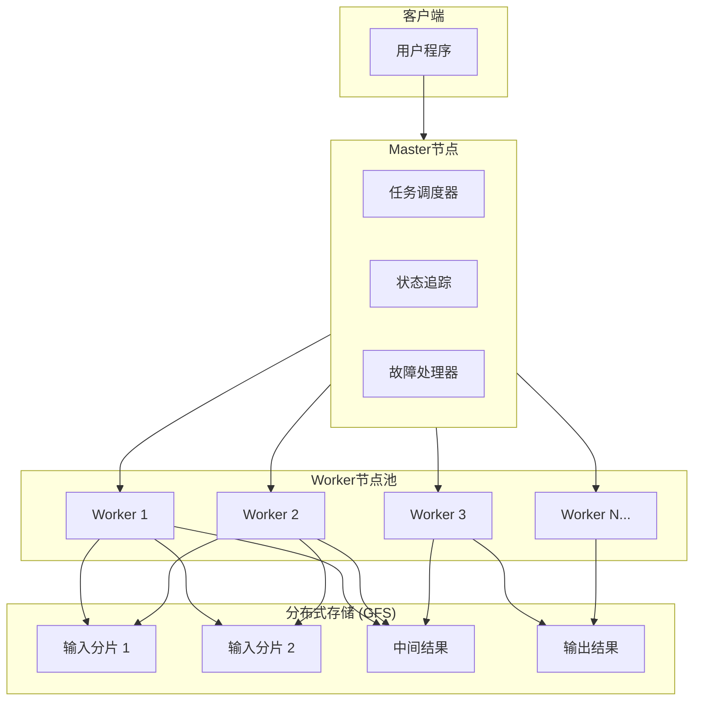
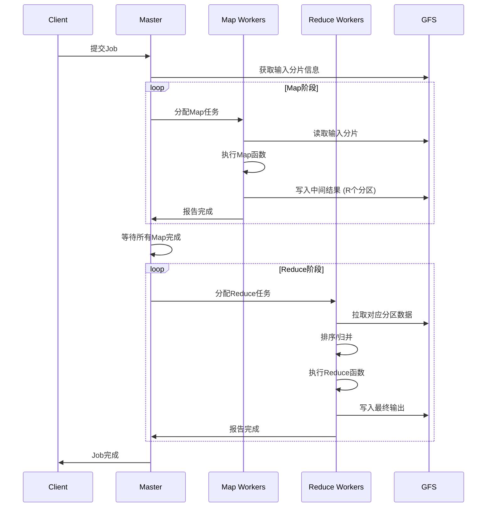
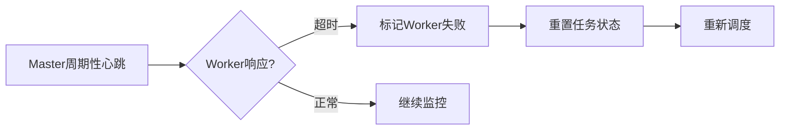
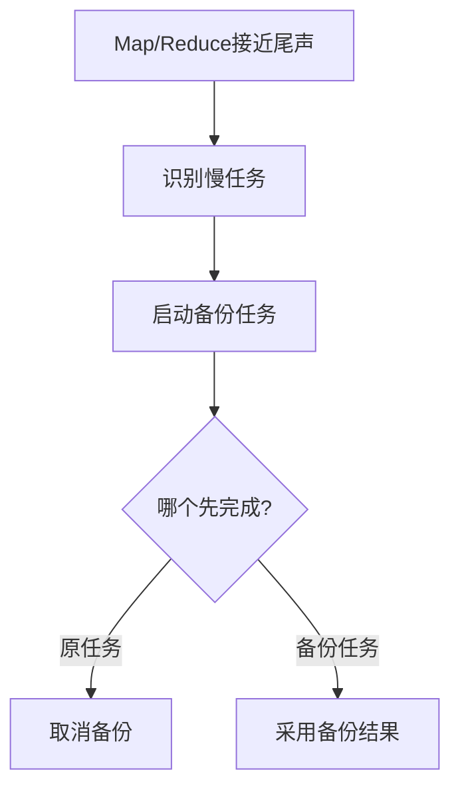
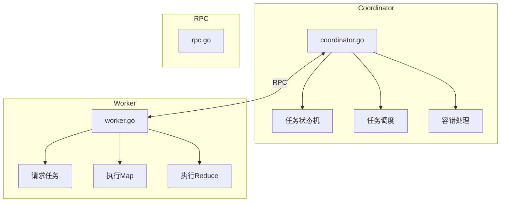

# MapReduce论文精读

> **原始论文**: Dean, J., & Ghemawat, S. (2004). MapReduce: Simplified Data Processing on Large Clusters. *OSDI'04*.
>
> **MIT 6.824 Lab 1** 基于此论文设计

## 一、论文背景与动机

### 1.1 问题场景

2004年的Google面临着海量数据处理需求：

- 每天处理超过20PB的原始数据
- 需要构建网页索引、分析网络日志、生成报告
- 工程师花费大量时间处理分布式计算的复杂性（并行化、容错、数据分布、负载均衡）

### 1.2 设计目标

MapReduce的核心设计目标：

1. **简化编程模型**：程序员只需关注业务逻辑
2. **自动并行化**：系统自动处理分布执行
3. **容错透明**：故障恢复对程序员不可见
4. **可扩展性**：水平扩展到数千台机器

## 二、编程模型

### 2.1 核心抽象

```
Map:    (k1, v1) → list(k2, v2)
Reduce: (k2, list(v2)) → list(v2)
```

### 2.2 词频统计示例（Word Count）

```go
// Map函数：将文档拆分为单词，输出 <word, 1>
func Map(filename string, contents string) []KeyValue {
    var kvs []KeyValue
    words := strings.FieldsFunc(contents, func(r rune) bool {
        return !unicode.IsLetter(r)
    })
    for _, word := range words {
        kvs = append(kvs, KeyValue{word, "1"})
    }
    return kvs
}

// Reduce函数：汇总相同单词的计数
func Reduce(key string, values []string) string {
    count := 0
    for _, v := range values {
        n, _ := strconv.Atoi(v)
        count += n
    }
    return strconv.Itoa(count)
}
```

### 2.3 类型系统

```
map     (k1,v1)       → list(k2,v2)
        ↓
[框架自动排序/分组]
        ↓
reduce  (k2,list(v2)) → list(v2)
```

## 三、系统架构与实现

### 3.1 整体架构



### 3.2 执行流程



### 3.3 关键实现细节

#### 3.3.1 任务粒度

```go
// 任务拆分策略
type JobConfig struct {
    // M个Map任务 >> Worker数量（通常16-64MB/分片）
    M int // 例如：M = 2000, Workers = 200

    // R个Reduce任务（通常由用户指定或启发式确定）
    R int // 例如：R = 100
}
```

**细粒度任务的优势**：

- 负载均衡：快速节点可以处理更多任务
- 故障恢复：小任务重新执行成本低
- 流水线：Map和Reduce可部分重叠

#### 3.3.2 中间数据传输

```go
// Map输出分区策略
func partition(key string, numReduces int) int {
    // 使用哈希确定Reduce分区
    hash := hashCode(key)
    return hash % numReduces
}

// 输出文件命名
// map_task_id-reduce_partition_id
// 例如：map_003-005 表示第3个Map任务的第5个分区输出
```

#### 3.3.3 Master数据结构

```go
type Master struct {
    // Map任务状态
    mapTasks []TaskState

    // Reduce任务状态
    reduceTasks []TaskState

    // Worker状态
    workers map[string]WorkerInfo

    // 已完成Map的位置 (task_id -> []locations)
    completedMaps map[int][]Location
}

type TaskState struct {
    Status    TaskStatus // Idle, InProgress, Completed
    WorkerID  string
    StartTime time.Time  // 用于超时检测
}
```

## 四、容错机制

### 4.1 Worker故障检测



```go
// 故障检测逻辑
func (m *Master) checkWorkerHealth() {
    for workerID, info := range m.workers {
        if time.Since(info.lastHeartbeat) > heartbeatTimeout {
            m.handleWorkerFailure(workerID)
        }
    }
}

func (m *Master) handleWorkerFailure(workerID string) {
    // 1. 找出该Worker上运行的所有任务
    for taskID, task := range m.mapTasks {
        if task.WorkerID == workerID && task.Status == InProgress {
            // 2. 重置为Idle状态，重新调度
            m.mapTasks[taskID].Status = Idle
            m.mapTasks[taskID].WorkerID = ""
        }
    }
    // 同理处理Reduce任务...
    delete(m.workers, workerID)
}
```

### 4.2 任务幂等性保证

```
关键洞察：Map和Reduce函数必须是确定性的纯函数

确定性保证：
- 相同输入 → 相同输出
- 允许任务被安全地重新执行
- 简化容错设计

原子提交：
- 任务输出先写入临时文件
- 完成后原子重命名为最终文件名
- 防止部分写入导致的数据损坏
```

### 4.3 慢节点优化（Backup Tasks）



论文数据：Backup机制将大型Sort作业完成时间从1283秒减少到931秒（提升27%）

## 五、性能优化

### 5.1 局部性优化

```go
// 调度策略：优先选择数据本地化的Worker
func (m *Master) scheduleMapTask(task MapTask) {
    // 输入分片的GFS副本位置
    locations := task.InputLocations

    // 尝试在同一机器或同一机架调度
    for _, loc := range locations {
        if worker, ok := m.findLocalWorker(loc); ok {
            m.assignToWorker(task, worker)
            return
        }
    }

    // 回退到任意可用Worker
    m.assignToAnyWorker(task)
}
```

### 5.2 Combiner优化

```go
// 在Map端本地聚合，减少网络传输
func MapWithCombiner(filename string, contents string) []KeyValue {
    localCount := make(map[string]int)

    // 本地计数
    for _, word := range extractWords(contents) {
        localCount[word]++
    }

    // 输出聚合结果
    var result []KeyValue
    for word, count := range localCount {
        result = append(result, KeyValue{word, strconv.Itoa(count)})
    }
    return result
}

// 适用条件：Reduce函数满足结合律和交换律
// 例如：sum、count、max/min
```

### 5.3 性能数据

| 集群规模 | 输入数据 | 执行时间 | 传输速率 |
|---------|---------|---------|---------|
| 1800 machines | 1TB | 209s | 3.3GB/s |
| 1800 machines | 1TB (gzip) | 639s | 1.1GB/s |
| 4000 machines | 1PB Sort | 177s | - |

## 六、MIT 6.824 Lab 1 实现指南

### 6.1 实验架构



### 6.2 关键实现要点

```go
// Coordinator核心结构
type Coordinator struct {
    files []string    // 输入文件
    nReduce int       // Reduce任务数

    mapTasks []Task   // Map任务队列
    reduceTasks []Task // Reduce任务队列

    mapDone bool
    reduceDone bool

    mu sync.Mutex     // 保护共享状态
}

// Worker执行流程
func Worker(mapf func(string, string) []KeyValue,
           reducef func(string, []string) string) {
    for {
        // 1. 向Coordinator请求任务
        task := callGetTask()

        switch task.Phase {
        case MapPhase:
            // 2a. 执行Map任务
            executeMap(task, mapf)

        case ReducePhase:
            // 2b. 执行Reduce任务
            executeReduce(task, reducef)

        case DonePhase:
            // 3. 所有任务完成
            return
        }

        // 报告任务完成
        callTaskDone(task)
    }
}
```

### 6.3 容错处理要点

1. **任务超时检测**：使用goroutine定期检查任务状态
2. **幂等性保证**：使用临时文件+原子重命名
3. **崩溃恢复**：Worker崩溃后任务重新分配

## 七、局限性与演进

### 7.1 MapReduce的局限性

| 局限性 | 说明 |
|-------|------|
| 批处理延迟 | 不适合实时/流处理 |
| 迭代计算低效 | 多轮MapReduce间需读写磁盘 |
| 复杂DAG支持弱 | 需手动编排多阶段Job |
| 无索引支持 | 全表扫描模式 |

### 7.2 后续演进

```
MapReduce (2004)
    ↓
Apache Hadoop (2006) - 开源实现
    ↓
Apache Spark (2014) - 内存计算，支持迭代
    ↓
DataFlow/Beam (2016) - 统一批流处理
```

## 八、核心结论

1. **简单抽象的力量**：Map/Reduce两个函数抽象解决了大规模数据处理的复杂性
2. **容错是核心**：细粒度任务+确定性计算=简单高效的容错
3. **局部性至关重要**：数据本地化处理是性能关键
4. **确定性约束**：限制计算模型换取系统简化

## 参考资源

- [原始论文 PDF](https://research.google/pubs/mapreduce-simplified-data-processing-on-large-clusters/)
- [MIT 6.824 Lab 1](https://pdos.csail.mit.edu/6.824/labs/lab-mr.html)
- [Hadoop MapReduce](https://hadoop.apache.org/docs/stable/hadoop-mapreduce-client/hadoop-mapreduce-client-core/MapReduceTutorial.html)

---

## 相关主题

- [Hadoop-MapReduce详解](../06-computing/batch-processing/Hadoop-MapReduce详解.md) - Hadoop实现详解
- [Spark-Core详解](../06-computing/batch-processing/Spark-Core详解.md) - 下一代内存计算框架
- [形式化验证理论](./形式化验证理论.md) - 工作流形式化验证
- [GFS深度分析](../05-storage/dfs/GFS深度分析.md) - 配套存储系统

## 参考资源

- [Google MapReduce论文](https://research.google/pubs/mapreduce-simplified-data-processing-on-large-clusters/)
- [Apache Hadoop官方文档](https://hadoop.apache.org/)
- [MIT 6.824 分布式系统课程](https://pdos.csail.mit.edu/6.824/)
