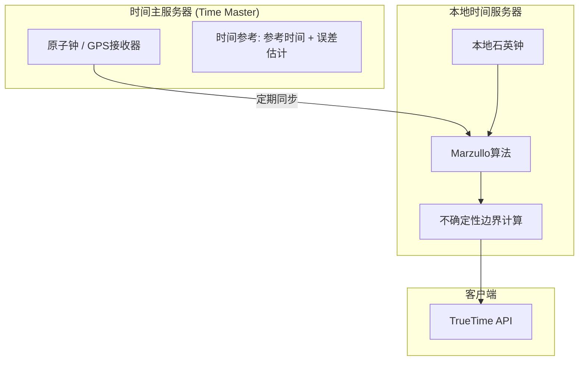
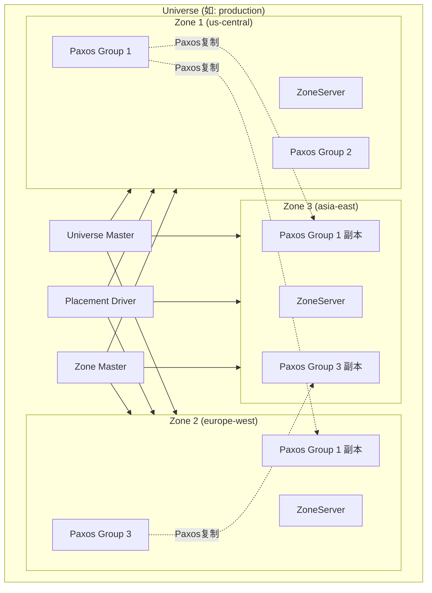
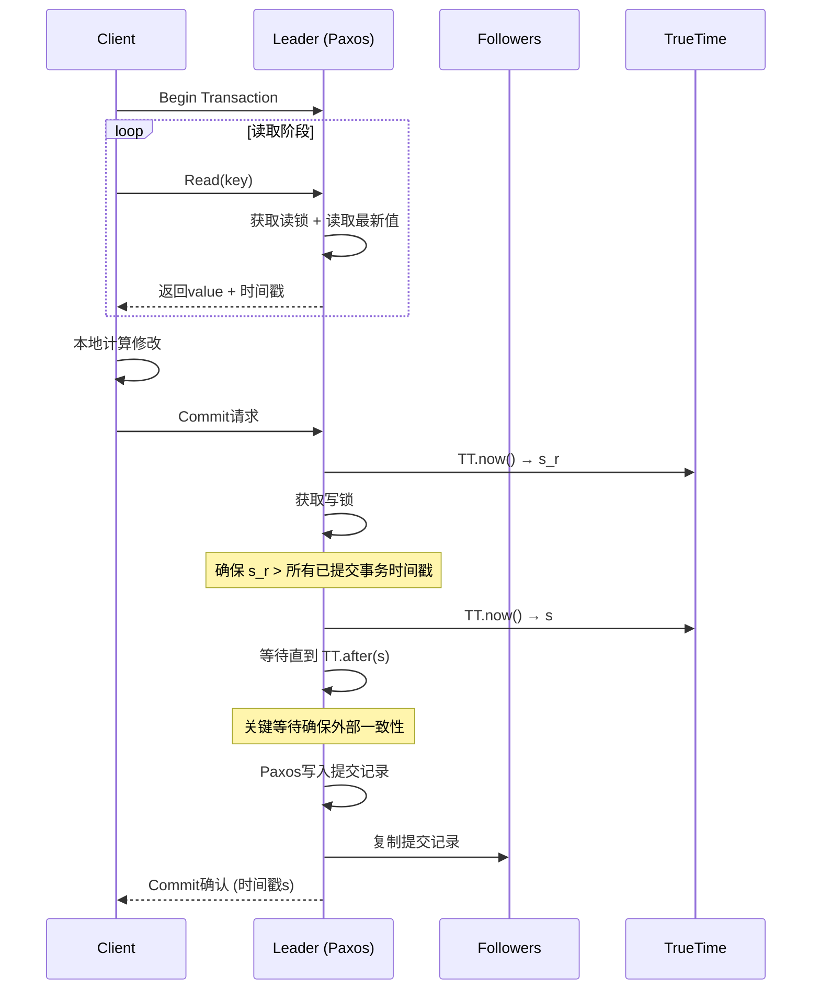

# Spanner与TrueTime

> **原始论文**: Corbett, J. C., et al. (2013). Spanner: Google's Globally-Distributed Database. *OSDI'12*.
>
> **核心创新**: TrueTime API - 首次实现全球分布式数据库的外部一致性

## 一、设计背景与目标

### 1.1 传统分布式数据库的局限

```
┌─────────────────────────────────────────────────────────────┐
│               现有方案的能力对比                              │
├──────────────┬──────────────┬──────────────┬────────────────┤
│    系统       │   全局分布    │   强一致性    │   高可用写    │
├──────────────┼──────────────┼──────────────┼────────────────┤
│ 传统关系型    │      ✗       │      ✓       │       ✓        │
│ (MySQL等)    │             │             │               │
├──────────────┼──────────────┼──────────────┼────────────────┤
│ NoSQL        │      ✓       │      ✗       │       ✓        │
│ (Dynamo等)   │  (最终一致)  │             │               │
├──────────────┼──────────────┼──────────────┼────────────────┤
│ Spanner      │      ✓       │      ✓       │       ✓        │
│              │  (外部一致)  │  (TrueTime)  │  (Paxos复制)   │
└──────────────┴──────────────┴──────────────┴────────────────┘
```

### 1.2 Spanner的设计目标

| 目标 | 说明 |
|-----|------|
| 外部一致性 | 如果事务T1在T2开始前提交，则T1的时间戳小于T2 |
| 全球分布 | 数据可复制到全球多个数据中心 |
| 自动分片 | 透明地水平扩展 |
| 细粒度复制 | 可以按行/列族控制复制配置 |

## 二、TrueTime API

### 2.1 核心抽象

```go
// TrueTime返回一个时间区间，而非单点时间
type TTinterval struct {
    earliest time.Time  // 最早可能时间
    latest   time.Time  // 最晚可能时间
}

// 区间宽度 = 不确定性边界 (ε)
func (tt *TTinterval) Uncertainty() time.Duration {
    return tt.latest.Sub(tt.earliest)
}

// TT.now() - 返回当前时间区间
// TT.after(t) - 如果 t 肯定已过去，返回true
// TT.before(t) - 如果 t 肯定还未到，返回true
```

### 2.2 参考实现



### 2.3 时间同步协议

```go
// 参考版算法（简化）
type TrueTimeServer struct {
    timeMasters []TimeMasterReference
    localClock  Clock
    epsilon     time.Duration
}

func (tts *TrueTimeServer) Now() TTinterval {
    // 1. 查询多个时间源
    var intervals []TTinterval
    for _, master := range tts.timeMasters {
        // 网络往返时间(RTT)测量
        start := tts.localClock.Now()
        remoteTime := master.QueryTime()
        rtt := tts.localClock.Now().Sub(start)

        // 时间区间 = [remoteTime - rtt/2, remoteTime + rtt/2]
        intervals = append(intervals, TTinterval{
            earliest: remoteTime.Add(-rtt / 2),
            latest:   remoteTime.Add(rtt / 2),
        })
    }

    // 2. 使用本地时钟
    localNow := tts.localClock.Now()
    intervals = append(intervals, TTinterval{
        earliest: localNow.Add(-tts.clockDriftBound),
        latest:   localNow.Add(tts.clockDriftBound),
    })

    // 3. Marzullo算法找出最大交集
    return marzulloAlgorithm(intervals)
}

// Marzullo算法：找出最多区间重叠的时间段
func marzulloAlgorithm(intervals []TTinterval) TTinterval {
    // 实现细节略，返回最大重叠区间
}
```

### 2.4 不确定性边界

```
典型的不确定性边界 (ε):

┌─────────────────┬─────────────────────┐
│     场景         │     ε 范围          │
├─────────────────┼─────────────────────┤
│ 本地查询         │  1-7 毫秒          │
│ (从本地守护进程) │                    │
├─────────────────┼─────────────────────┤
│ 跨数据中心       │  1-100 毫秒        │
│ (全球分布)      │  取决于网络延迟      │
├─────────────────┼─────────────────────┤
│ 网络拥塞时       │  可达数秒           │
│ (降级模式)      │                    │
└─────────────────┴─────────────────────┘

Spanner的设计假设: ε 通常为 1-7ms，偶尔更高
```

## 三、Spanner架构

### 3.1 整体架构



### 3.2 核心组件

| 组件 | 职责 |
|-----|------|
| Universe Master | 监控所有Zone的状态，用于调试 |
| Placement Driver | 自动数据再分片、负载均衡 |
| Zone Master | 管理Zone内的数据放置 |
| SpanServer | 服务数据，管理Paxos组 |
| Location Proxy | 定位数据所在的SpanServer |

### 3.3 数据模型

```go
// 目录 (Directory) - 数据放置的最小单元
type Directory struct {
    keyRange     KeyRange     // 键范围
    replicas     []Replica    // 复制配置
    paxosGroup   PaxosGroupID // 所属Paxos组
}

// 数据库层级结构
// Universe
//   └── Database
//         └── Table
//               └── Directory (分片单元)
//                     └── Row

// 示例: 用户数据表
type UserTable struct {
    UserID     int64     // PRIMARY KEY
    Name       string
    Email      string
    CreatedAt  TTtimestamp
}

// Spanner支持: 关系型表、事务、SQL查询、外部一致性
```

## 四、事务与一致性

### 4.1 时间戳分配

```go
// Spanner使用TrueTime保证全局单调递增的时间戳

type TransactionCoordinator struct {
    tt *TrueTime
}

func (tc *TransactionCoordinator) Commit(txn *Transaction) error {
    // 两阶段提交 + 外部一致性时间戳

    // 阶段1: 准备 (Prepare)
    prepareTime := tc.tt.Now()
    for _, participant := range txn.participants {
        if err := participant.Prepare(prepareTime); err != nil {
            return tc.abort(txn)
        }
    }

    // 关键: 等待直到 prepareTime.latest + ε 确保不会与其他事务冲突
    tc.waitUntil(prepareTime.latest.Add(epsilon))

    // 阶段2: 提交
    commitTime := tc.tt.Now()
    for _, participant := range txn.participants {
        participant.Commit(commitTime)
    }

    return nil
}
```

### 4.2 读写事务（Read-Write Transaction）



### 4.3 只读事务（Read-Only Transaction）

```go
// 只读事务可以在任意副本执行，无需锁

func (s *SpanServer) ReadOnlyTransaction(keys []Key) ([]Value, error) {
    // 1. 获取读时间戳 (可以是TT.now().latest，或指定过去的时间戳)
    readTimestamp := s.tt.Now().latest

    // 2. 选择最近的副本
    replica := s.selectNearestReplica(keys)

    // 3. 等待副本数据到达 readTimestamp
    if err := replica.waitForSafe(readTimestamp); err != nil {
        // 回退到Leader读取
        replica = s.leader
    }

    // 4. 读取数据 (无需锁)
    return replica.readAtTimestamp(keys, readTimestamp)
}
```

### 4.4 快照读（Snapshot Read）

```go
// 指定过去的时间戳读取，实现时间旅行查询

func (c *Client) SnapshotRead(table string, keys []Key, timestamp time.Time) ([]Row, error) {
    // 无需事务协调
    // 直接路由到最近的副本

    spanServer := c.locateKeys(keys)

    // 确保副本有足够新的数据
    safeTime := spanServer.getSafeTime()
    if safeTime.Before(timestamp) {
        // 需要等待或选择其他副本
        spanServer = c.findUpToDateReplica(keys, timestamp)
    }

    return spanServer.readAtExactTimestamp(table, keys, timestamp)
}

// 应用场景:
// 1. 历史数据分析
// 2. 合规审计
// 3. 备份一致性读取
```

## 五、外部一致性证明

### 5.1 外部一致性定义

```
外部一致性 (External Consistency):

如果事务 T1 提交后，事务 T2 才开始执行，
则 commit(T1) < commit(T2)

等价于: 全局线性化 (Linearizability) 的事务提交顺序
```

### 5.2 Spanner如何保证

```
关键机制:

1. 提交时间戳选择
   commit_ts = max(
       TT.now().latest,           // 当前时间
       prepare_ts + ε,            // 准备阶段时间 + 不确定性
       last_commit_ts + 1         // 单调递增保证
   )

2. 等待机制
   在提交前等待: sleep(commit_ts - TT.now().earliest)
   确保: 当提交完成时，所有服务器的TT.now().earliest > commit_ts

3. 因果序保证
   如果事务T2读取了T1写入的数据，
   则 commit(T1) < start(T2) ≤ commit(T2)
```

### 5.3 正确性证明概要

```
定理: Spanner提供外部一致性

证明:

假设 T1 提交后 T2 开始，需证: commit_ts(T1) < commit_ts(T2)

情况1: T1和T2不冲突
- T2的start_ts取自TT.now()
- 由于T1已提交，所有服务器TT.now().earliest > commit_ts(T1)
- T2的commit_ts ≥ start_ts > commit_ts(T1)

情况2: T2读取了T1写入的数据
- T2观察到T1的写入，故T2.start_ts > T1.commit_ts
- T2.commit_ts ≥ T2.start_ts > T1.commit_ts

情况3: T1和T2冲突（写写冲突）
- 锁机制保证串行化
- 后获取锁的事务等待先提交的事务
- 时间戳分配保证顺序

∎
```

## 六、性能优化

### 6.1 读写分离

```
┌─────────────────────────────────────────────────────────────┐
│                    请求路由策略                              │
├─────────────────┬───────────────────────────────────────────┤
│   请求类型       │              路由目标                      │
├─────────────────┼───────────────────────────────────────────┤
│ 读写事务         │  Leader (需要写操作)                      │
├─────────────────┼───────────────────────────────────────────┤
│ 快照读 (指定时间)│  最近副本 (利用TrueTime的读时间戳)          │
├─────────────────┼───────────────────────────────────────────┤
│ 只读事务         │  最近副本 (当前读)                        │
├─────────────────┼───────────────────────────────────────────┤
│ 强读             │  Leader 或多数副本确认                     │
└─────────────────┴───────────────────────────────────────────┘
```

### 6.2 分片与负载均衡

```go
// 目录作为移动单元
type DirectoryMover struct {
    pd *PlacementDriver
}

func (dm *DirectoryMover) rebalance() {
    // 1. 收集负载信息
    loads := dm.collectLoadMetrics()

    // 2. 识别热点
    hotspots := dm.identifyHotspots(loads)

    // 3. 计划迁移
    for _, dir := range hotspots {
        if dm.shouldSplit(dir) {
            // 分片
            dm.splitDirectory(dir)
        } else {
            // 迁移到负载较低的Paxos组
            target := dm.findCoolZone(dir)
            dm.moveDirectory(dir, target)
        }
    }
}
```

### 6.3 TrueTime优化

```go
// 减少等待时间的策略

func (tc *TransactionCoordinator) fastCommit() {
    // 策略1: 流水线提交
    // 当前事务准备时，预分配下一个时间戳范围

    // 策略2: 乐观提交
    // 假设ε较小，提交后立即返回
    // 后台验证并处理冲突（极少发生）

    // 策略3: 批处理
    // 多个小事务合并为一个Paxos写入
}
```

## 七、生产数据与经验

### 7.1 部署规模（2012年数据）

| 指标 | 数值 |
|-----|------|
| 数据中心数量 | 全球数十个 |
| 数据总量 | 数十PB |
| 每秒读取 | 数千万次 |
| 每秒写入 | 数百万次 |
| 平均读取延迟 | < 10ms (本地) |
| 平均写入延迟 | 5-20ms |

### 7.2 TrueTime实际表现

```
时间不确定性边界 (ε) 分布:

  1ms  ████████████████████████  70%
  2ms  ████████                  20%
  5ms  ██                        7%
 10ms+ █                         3%

关键观察:
- 大部分时间在1-2ms
- 偶尔因网络抖动达到5-10ms
- 极端情况(秒级)会阻塞事务
```

## 八、与MIT 6.824的关联

### 8.1 核心概念映射

| Spanner概念 | 6.824 Lab对应 |
|------------|--------------|
| Paxos组 | Lab 3 (KV Raft) |
| 两阶段提交 | Lab 4 (分片KV) |
| TrueTime | 补充阅读（超越课程内容） |
| 外部一致性 | 线性化概念扩展 |

### 8.2 实现启示

```go
// 简化版外部一致性实现思路

// 使用物理时钟 + 时钟同步误差
func simplifiedExternalConsistency() {
    // 1. 假设时钟同步误差 ε = 10ms
    epsilon := 10 * time.Millisecond

    // 2. 提交时等待
    commitTimestamp := time.Now().Add(epsilon)
    time.Sleep(epsilon)

    // 3. 此时可以确信所有服务器的时钟都已超过commitTimestamp
    persist(commitTimestamp)
}
```

## 九、局限性与演进

### 9.1 Spanner的局限

| 局限 | 说明 |
|-----|------|
| 写延迟 | 需等待TrueTime，跨全球延迟高 |
| 单点Leader | 每个分片只有一个Leader处理写 |
| 时钟依赖 | 强依赖原子钟/GPS，部署成本高 |
| 读时间戳选择 | 需要仔细选择以避免等待 |

### 9.2 后续发展

```
Spanner (2012)
    ↓
Spanner: Becoming a SQL System (2017)
    - 完整SQL支持
    - 查询优化
    - 二级索引

    ↓
Cloud Spanner (Google Cloud)
    - 托管服务
    - 全球自动扩展

    ↓
CockroachDB / TiDB / YugabyteDB
    - 开源实现
    - 使用混合逻辑时钟(HLC)替代TrueTime
```

## 十、总结

TrueTime的核心创新：

1. **时间区间抽象**：承认时钟不确定性，而非试图消除它
2. **等待承诺**：通过短暂等待换取强一致性保证
3. **硬件支持**：原子钟/GPS提供可靠的时间参考

Spanner的设计哲学：

- 用TrueTime将分布式共识问题简化为单点问题
- 外部一致性不再是理论目标，而是工程现实

## 参考资源

- [Spanner原始论文](https://research.google/pubs/spanner-googles-globally-distributed-database/)
- [Spanner: Becoming a SQL System](https://research.google/pubs/spanner-becoming-a-sql-system/)
- [TrueTime介绍](https://cloud.google.com/spanner/docs/true-time-external-consistency)
- [CockroachDB的HLC实现](https://www.cockroachlabs.com/blog/living-without-atomic-clocks/)
