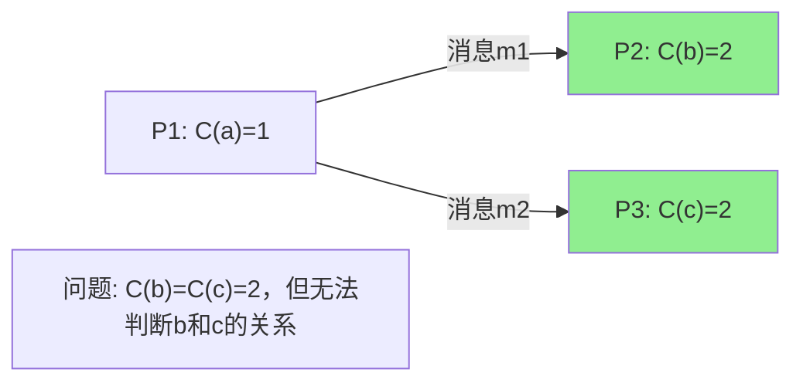
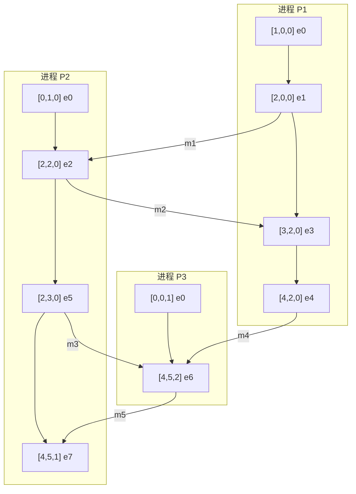
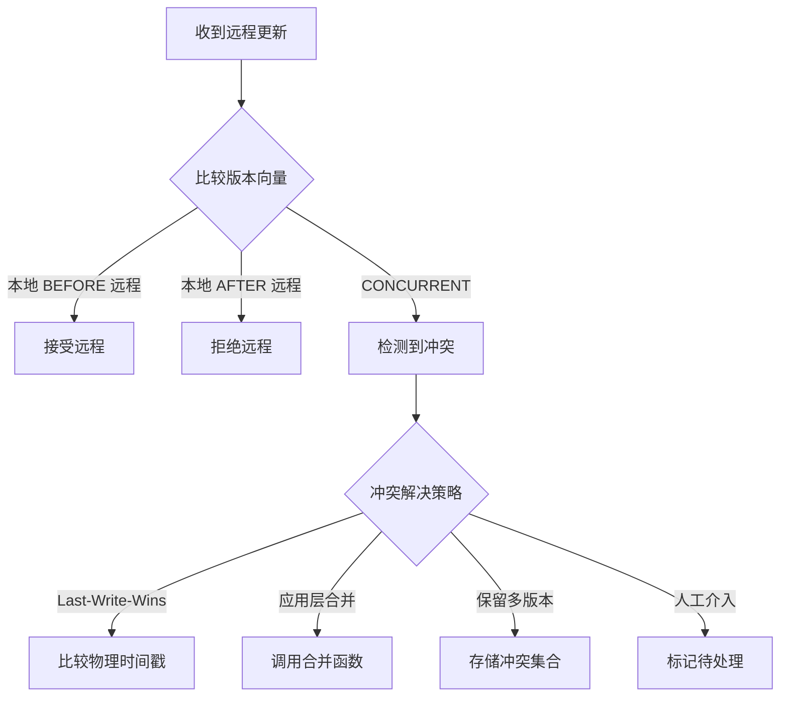

# 向量时钟与因果关系

> **理论基础**: Leslie Lamport, "Time, Clocks, and the Ordering of Events in a Distributed System" (1978)
>
> **扩展阅读**: Mattern, F. (1988). "Virtual Time and Global States of Distributed Systems"

## 一、分布式系统中的时间困境

### 1.1 为什么需要逻辑时钟

在分布式系统中，物理时钟同步面临根本性挑战：

```
┌─────────────────────────────────────────────────────────────┐
│                    物理时钟的问题                             │
├─────────────────────────────────────────────────────────────┤
│ 1. 时钟漂移: 石英晶振频率差异导致时钟走速不同                   │
│    - 典型漂移率: 10^-6 (每天差86ms)                          │
│                                                             │
│ 2. 网络延迟不确定性: NTP同步无法保证精度                        │
│    - 广域网延迟: 10-100ms                                   │
│    - 延迟不对称性导致无法精确计算时钟偏移                       │
│                                                             │
│ 3. 相对论效应: 在极端分布式系统中需要考虑                      │
└─────────────────────────────────────────────────────────────┘
```

### 1.2 "Happens-Before"关系

Lamport定义了分布式事件间的偏序关系，记作 `→`：

```
定义 (Happens-Before):

1. 同一进程内: 若事件a在b之前执行，则 a → b
   P:  [a]──→[b]

2. 进程间通信: 若a是发送消息，b是接收同一消息，则 a → b
   P1: [send m]──→...
                    ↓
   P2: ...──→[recv m]

3. 传递性: 若 a → b 且 b → c，则 a → c

4. 并发性: 若 a ↛ b 且 b ↛ a，则 a ∥ b (a与b并发)
```

### 1.3 逻辑时钟的局限



**Lamport标量时钟的局限**：

- `C(a) < C(b)` 可推出 `a → b`
- 但 `C(a) < C(b)` **不能** 推出 `a → b`（可能是并发）

## 二、向量时钟原理

### 2.1 向量时钟定义

向量时钟为每个进程维护一个时间戳向量：

```
VC_i = [t1, t2, t3, ..., tn]

其中:
- n = 系统中进程数量
- tj = 进程i所知的进程j的最新事件计数
- VC_i[i] = 进程i自己的事件计数
```

### 2.2 更新规则

```go
// 向量时钟结构
type VectorClock struct {
    timestamps []int  // 每个进程的时间戳
    processID  int    // 当前进程ID
}

// 本地事件发生
func (vc *VectorClock) increment() {
    vc.timestamps[vc.processID]++
}

// 发送消息前
func (vc *VectorClock) sendMessage() []int {
    vc.increment()
    // 复制当前向量作为消息时间戳
    return append([]int{}, vc.timestamps...)
}

// 接收消息时
func (vc *VectorClock) receiveMessage(msgTimestamp []int) {
    vc.increment()
    // 逐元素取最大值
    for i := 0; i < len(vc.timestamps); i++ {
        if msgTimestamp[i] > vc.timestamps[i] {
            vc.timestamps[i] = msgTimestamp[i]
        }
    }
}
```

### 2.3 向量时钟示例



### 2.4 比较算法

```go
// 向量时钟比较
func compareVC(vc1, vc2 []int) Relation {
    allLessOrEqual := true
    allGreaterOrEqual := true

    for i := 0; i < len(vc1); i++ {
        if vc1[i] > vc2[i] {
            allLessOrEqual = false
        }
        if vc1[i] < vc2[i] {
            allGreaterOrEqual = false
        }
    }

    if allLessOrEqual && !allGreaterOrEqual {
        return BEFORE       // vc1 → vc2
    } else if allGreaterOrEqual && !allLessOrEqual {
        return AFTER        // vc2 → vc1
    } else if allLessOrEqual && allGreaterOrEqual {
        return EQUAL        // vc1 == vc2
    } else {
        return CONCURRENT   // vc1 ∥ vc2
    }
}

// 使用示例
func ExampleComparison() {
    // e1: [2,0,0], e2: [2,2,0]
    e1 := []int{2, 0, 0}
    e2 := []int{2, 2, 0}

    result := compareVC(e1, e2)
    // result = BEFORE，表示 e1 → e2

    // e3: [4,2,0], e4: [4,5,1]
    e3 := []int{4, 2, 0}
    e4 := []int{4, 5, 1}

    result = compareVC(e3, e4)
    // result = CONCURRENT，表示 e3 ∥ e4
}
```

### 2.5 因果关系的判定

```
定理: 对于任意两个事件e和f，其向量时钟分别为VC(e)和VC(f)

VC(e) < VC(f) ⇔ e → f

即: 向量时钟的偏序关系精确对应 Happens-Before 关系
```

## 三、Version Vectors（版本向量）

### 3.1 与Vector Clocks的区别

| 特性 | Vector Clocks | Version Vectors |
|-----|---------------|-----------------|
| 用途 | 事件排序 | 数据版本追踪 |
| 更新时机 | 每个事件 | 数据修改操作 |
| 典型应用 | 调试、因果日志 | 乐观复制、冲突检测 |
| 长度 | 固定（进程数） | 动态（副本数） |

### 3.2 Version Vectors实现

```go
// 版本向量用于副本数据版本追踪
type VersionVector struct {
    versions map[string]int64  // replicaID -> version
}

type VersionedData struct {
    value    []byte
    vv       VersionVector
    deleted  bool
}

type ReplicaStore struct {
    id       string
    data     map[string]VersionedData
    vv       VersionVector
}

// 写操作
func (rs *ReplicaStore) Put(key string, value []byte) {
    // 增加本地版本
    rs.vv.versions[rs.id]++

    rs.data[key] = VersionedData{
        value: value,
        vv:    rs.vv.clone(),
    }
}

// 合并远程更新
func (rs *ReplicaStore) MergeRemote(key string, remote VersionedData) {
    local, exists := rs.data[key]

    if !exists {
        // 本地无此数据，直接采用远程
        rs.data[key] = remote
        rs.vv.merge(remote.vv)
        return
    }

    relation := compareVV(local.vv, remote.vv)

    switch relation {
    case BEFORE:
        // 本地是旧版本，采用远程
        rs.data[key] = remote
        rs.vv.merge(remote.vv)
    case AFTER:
        // 本地更新，忽略远程
    case CONCURRENT:
        // 冲突！需要冲突解决
        rs.resolveConflict(key, local, remote)
    }
}
```

### 3.3 冲突检测与解决



```go
// 冲突解决策略示例
type ConflictResolver interface {
    Resolve(local, remote VersionedData) VersionedData
}

// 1. Last-Write-Wins
func (lww *LWWResolver) Resolve(local, remote VersionedData) VersionedData {
    if local.timestamp > remote.timestamp {
        return local
    }
    return remote
}

// 2. 应用层合并 (以购物车为例)
func (cr *CartMergeResolver) Resolve(local, remote VersionedData) VersionedData {
    localCart := deserializeCart(local.value)
    remoteCart := deserializeCart(remote.value)

    // 合并两个购物车：并集操作
    merged := mergeCarts(localCart, remoteCart)

    return VersionedData{
        value: serializeCart(merged),
        vv:    mergeVV(local.vv, remote.vv),
    }
}
```

## 四、Dotted Version Vectors

### 4.1 传统VV的问题

```
问题场景:
- 客户端连续快速修改同一数据
- 每次修改都增加版本号
- 版本向量膨胀，历史信息丢失

P1: [5,0,0] ─修改─> [6,0,0] ─修改─> [7,0,0]

如果只保留最新版本，无法追踪中间状态
```

### 4.2 Dotted Version Vectors

```go
// DVV = (VersionVector, Dot)
// Dot = (replicaID, counter) 标识单个事件

type Dot struct {
    replicaID string
    counter   int64
}

type DVV struct {
    vv   VersionVector  // 基础版本
    dots []Dot          // 增量修改点
}

// 示例
// 初始: vv={}, dots=[]
// P1修改1次: vv={P1:1}, dots=[(P1,1)]
// P1再修改: vv={P1:1}, dots=[(P1,1), (P1,2)]
// 压缩后:   vv={P1:2}, dots=[]
```

### 4.3 优势

1. **精确追踪**：保留每次修改的独立标识
2. **增量同步**：只需同步dots部分
3. **垃圾回收**：可安全清理已知的dots

## 五、实践应用

### 5.1 在Riak中的应用

```erlang
%% Riak中的DVV实现
-record(dvv, {
    vector,     % 版本向量
    values,     % 值列表 ( siblings )
    deleted=false
}).

%% 读取时处理 siblings
get(Key) ->
    {ok, Object} = riak_kv_get_fsm:get(Key),
    case Object#dvv.values of
        [SingleValue] -> {ok, SingleValue};  % 无冲突
        MultipleValues -> {conflict, MultipleValues}  % 需解决
    end.
```

### 5.2 在DynamoDB中的应用

```go
// Dynamo风格的向量时钟
type DynamoVC struct {
    // (node, counter, timestamp) 三元组
    entries []VCEntry
}

type VCEntry struct {
    node      string
    counter   int64
    timestamp int64  // 用于LWW和垃圾回收
}

// 修剪策略：删除过期的低计数器条目
func (vc *DynamoVC) prune(threshold int64) {
    // 保留最新的N个条目
    // 或保留时间戳在窗口内的条目
}
```

### 5.3 因果一致性实现

```go
// COPS: Causality-Preserving Replicated Data Store

type CausalContext struct {
    // 依赖集合：此操作依赖的所有前序操作
    deps map[string]int64  // key -> version
}

type COPSOperation struct {
    key     string
    value   []byte
    version int64
    deps    CausalContext
}

// 写操作
func (cops *COPS) Put(key string, value []byte, deps CausalContext) {
    newVersion := cops.nextVersion()

    op := COPSOperation{
        key:     key,
        value:   value,
        version: newVersion,
        deps:    deps,
    }

    // 确保所有依赖已满足（因果一致性）
    cops.waitForDeps(deps)

    cops.store[key] = op
    cops.updateContext(key, newVersion)
}

// 读操作
func (cops *COPS) Get(key string) (Value, CausalContext) {
    op := cops.store[key]
    // 返回值的因果上下文
    ctx := CausalContext{
        deps: map[string]int64{key: op.version},
    }
    return op.value, ctx
}
```

## 六、优化与变体

### 6.1 向量时钟压缩

```go
// 问题: N个进程的向量时钟需要O(N)空间

// 方案1: 时钟剪枝
func (vc *VectorClock) prune(threshold int) {
    // 只保留最近的k个非零条目
    // 或基于时间戳剪枝
}

// 方案2: 稀疏表示
type SparseVC struct {
    entries map[int]int  // 只存储非零条目
}

// 方案3: 概要向量时钟 (Probabilistic VC)
// 使用布隆过滤器等概率数据结构近似表示
```

### 6.2 区间树时钟 (Interval Tree Clocks)

```go
// ITC: 支持动态进程加入/退出的向量时钟

type ITC struct {
    id    Interval  // 进程标识区间
    event Tree      // 事件树
}

type Interval struct {
    start, end int64
}

// 新进程fork时分裂区间
func (itc *ITC) Fork() *ITC {
    mid := (itc.id.start + itc.id.end) / 2

    return &ITC{
        id:    Interval{mid, itc.id.end},
        event: itc.event.clone(),
    }
}

// 进程退出时合并区间
func (itc *ITC) Join(other *ITC) {
    itc.id.end = other.id.end
    itc.event = itc.event.merge(other.event)
}
```

## 七、总结对比

| 机制 | 空间复杂度 | 精度 | 适用场景 |
|-----|-----------|------|---------|
| Lamport Clock | O(1) | 偏序 | 简单互斥、基本排序 |
| Vector Clock | O(N) | 全因果 | 调试、因果追踪 |
| Version Vector | O(M) | 版本因果 | 乐观复制、冲突检测 |
| DVV | O(M+K) | 增量因果 | 高频更新场景 |
| ITC | O(log N) | 动态因果 | 动态成员关系 |

**选择指南**：

- 仅需事件排序 → Lamport Clock
- 需要精确因果关系 → Vector Clock
- 数据版本控制 → Version Vector
- 高频写入场景 → DVV

## 参考资源

- [Lamport原始论文](https://amturing.acm.org/p558-lamport.pdf)
- [Version Vectors Are Not Vector Clocks](https://haslab.wordpress.com/2011/07/08/version-vectors-are-not-vector-clocks/)
- [Dotted Version Vectors](https://github.com/ricardobcl/Dotted-Version-Vectors)
- [Riak DVV Implementation](https://docs.riak.com/riak/kv/2.2.3/learn/concepts/causal-context/index.html)
