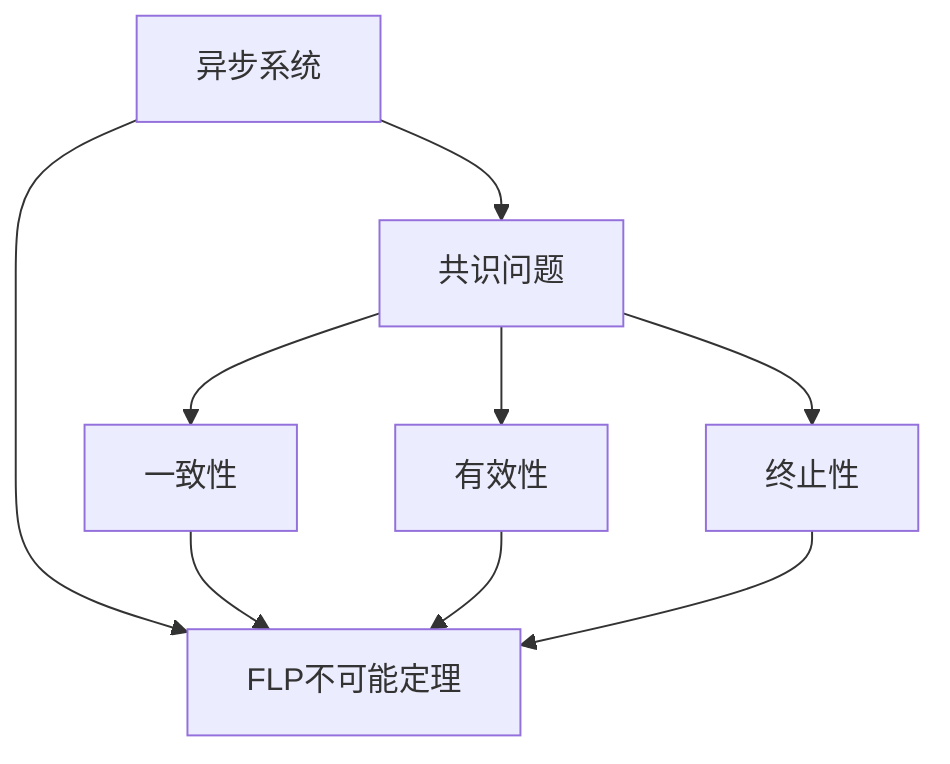
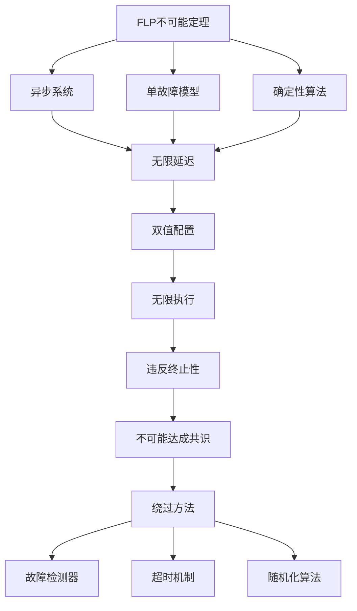
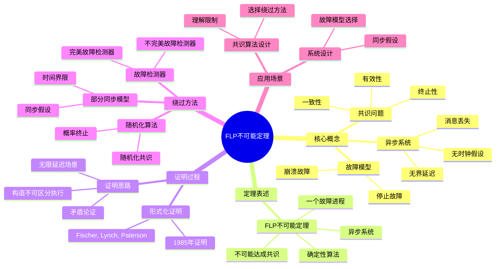
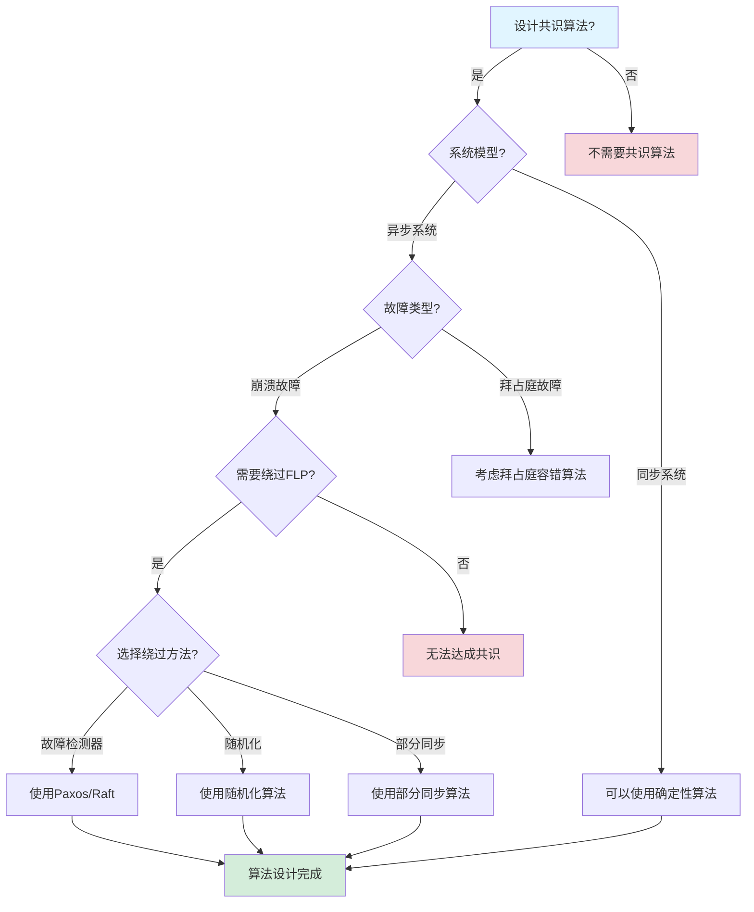
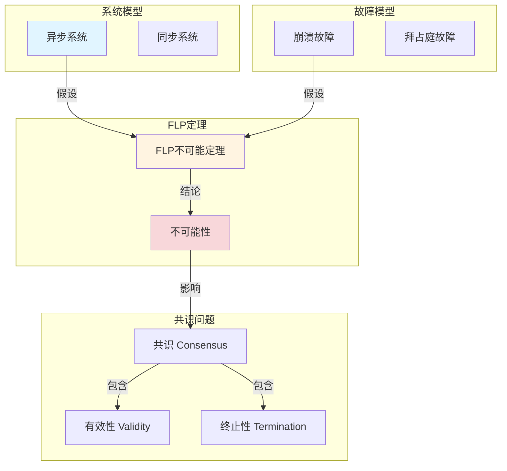
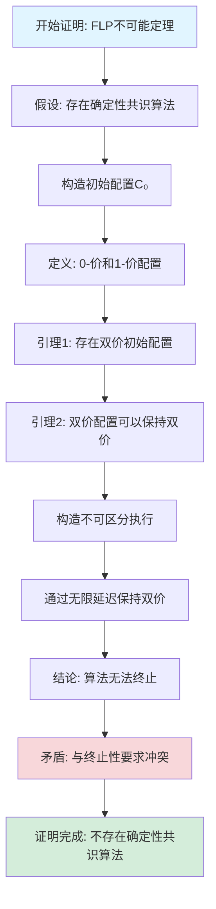

# FLP不可能定理专题文档

## 目录

- [FLP不可能定理专题文档](#flp不可能定理专题文档)
  - [目录](#目录)
  - [一、概述](#一概述)
    - [1.1 FLP不可能定理简介](#11-flp不可能定理简介)
    - [1.2 核心思想](#12-核心思想)
    - [1.3 应用领域](#13-应用领域)
    - [1.4 在本项目中的应用](#14-在本项目中的应用)
  - [二、历史背景](#二历史背景)
    - [2.1 发展历史](#21-发展历史)
    - [2.2 重要人物](#22-重要人物)
    - [2.3 重要里程碑](#23-重要里程碑)
  - [三、核心概念](#三核心概念)
    - [3.1 基本概念](#31-基本概念)
      - [概念1：异步系统](#概念1异步系统)
      - [概念2：共识问题](#概念2共识问题)
      - [概念3：故障模型](#概念3故障模型)
    - [3.2 概念关系](#32-概念关系)
  - [四、形式化定义](#四形式化定义)
    - [4.1 数学定义](#41-数学定义)
      - [定义1：异步系统](#定义1异步系统)
      - [定义2：共识算法](#定义2共识算法)
    - [4.2 定理表述](#42-定理表述)
      - [定理1：FLP不可能定理](#定理1flp不可能定理)
    - [4.3 证明过程](#43-证明过程)
      - [证明：FLP不可能定理（Fischer, Lynch \& Paterson完整证明）](#证明flp不可能定理fischer-lynch--paterson完整证明)
  - [五、性质与定理](#五性质与定理)
    - [5.1 基本性质](#51-基本性质)
      - [性质1：FLP不可能定理的严格性](#性质1flp不可能定理的严格性)
      - [性质2：绕过FLP的方法](#性质2绕过flp的方法)
    - [5.2 重要定理](#52-重要定理)
      - [定理1：故障检测器的充分性](#定理1故障检测器的充分性)
  - [六、绕过方法](#六绕过方法)
    - [6.1 故障检测器](#61-故障检测器)
    - [6.2 随机化算法](#62-随机化算法)
    - [6.3 部分同步模型](#63-部分同步模型)
  - [七、应用场景](#七应用场景)
    - [7.1 适用场景](#71-适用场景)
      - [场景1：共识算法设计](#场景1共识算法设计)
      - [场景2：系统设计](#场景2系统设计)
    - [7.2 不适用场景](#72-不适用场景)
      - [场景1：同步系统](#场景1同步系统)
      - [场景2：拜占庭故障](#场景2拜占庭故障)
  - [八、实践案例](#八实践案例)
    - [8.1 工业界案例](#81-工业界案例)
      - [案例1：etcd - Raft算法实现](#案例1etcd---raft算法实现)
      - [案例2：Consul - Raft算法实现](#案例2consul---raft算法实现)
      - [案例3：Temporal - 故障检测器实现](#案例3temporal---故障检测器实现)
      - [案例4：Kubernetes - etcd的Raft实现](#案例4kubernetes---etcd的raft实现)
      - [案例5：CockroachDB - Raft算法实现](#案例5cockroachdb---raft算法实现)
    - [8.2 学术界案例](#82-学术界案例)
      - [案例1：故障检测器](#案例1故障检测器)
  - [九、学习资源](#九学习资源)
    - [9.1 推荐阅读](#91-推荐阅读)
      - [经典著作](#经典著作)
      - [原始论文](#原始论文)
    - [9.2 学习路径](#92-学习路径)
      - [入门路径（1周）](#入门路径1周)
  - [十、参考文献](#十参考文献)
    - [10.1 经典文献](#101-经典文献)
      - [原始论文](#原始论文-1)
      - [重要论文](#重要论文)
    - [10.2 在线资源](#102-在线资源)
      - [Wikipedia](#wikipedia)
      - [经典著作](#经典著作-1)
  - [十一、思维表征](#十一思维表征)
    - [11.1 知识体系思维导图](#111-知识体系思维导图)
    - [11.2 多维知识对比矩阵](#112-多维知识对比矩阵)
      - [矩阵1：绕过FLP的方法对比矩阵](#矩阵1绕过flp的方法对比矩阵)
      - [矩阵2：FLP vs 其他不可能定理对比矩阵（增强版）](#矩阵2flp-vs-其他不可能定理对比矩阵增强版)
      - [矩阵3：绕过FLP的算法对比矩阵](#矩阵3绕过flp的算法对比矩阵)
      - [矩阵4：FLP不可能定理应用场景对比矩阵（10+场景）](#矩阵4flp不可能定理应用场景对比矩阵10场景)
    - [11.3 论证决策树](#113-论证决策树)
      - [决策树1：共识算法设计决策树](#决策树1共识算法设计决策树)
    - [11.4 概念属性关系图](#114-概念属性关系图)
    - [11.5 形式化证明流程图](#115-形式化证明流程图)
      - [证明流程图1：FLP不可能定理证明步骤](#证明流程图1flp不可能定理证明步骤)
  - [十二、代码示例](#十二代码示例)
    - [12.1 故障检测器实现示例](#121-故障检测器实现示例)
      - [12.1.1 心跳故障检测器](#1211-心跳故障检测器)
      - [12.1.2 使用故障检测器的共识算法](#1212-使用故障检测器的共识算法)
    - [12.2 随机化算法示例](#122-随机化算法示例)
      - [12.2.1 随机化共识算法](#1221-随机化共识算法)
    - [12.3 Temporal绕过FLP的实现](#123-temporal绕过flp的实现)
      - [12.3.1 Temporal故障检测器](#1231-temporal故障检测器)
  - [十三、相关文档](#十三相关文档)
    - [13.1 项目内部文档](#131-项目内部文档)
      - [核心论证文档](#核心论证文档)
      - [理论模型专题文档](#理论模型专题文档)
      - [其他相关文档](#其他相关文档)
    - [13.2 外部资源链接](#132-外部资源链接)
      - [Wikipedia资源](#wikipedia资源)
      - [学术论文](#学术论文)
      - [学术课程](#学术课程)
    - [13.3 项目管理文档](#133-项目管理文档)
    - [13.4 文档关联说明](#134-文档关联说明)

---

## 一、概述

### 1.1 FLP不可能定理简介

**FLP不可能定理（FLP Impossibility）** 是分布式系统理论中的一个重要定理，由Michael J. Fischer、Nancy A. Lynch和Michael S. Paterson在1985年提出。它指出，在异步分布式系统中，即使只有一个进程可能发生故障，也不可能设计出一个确定性的共识算法。

**来源**：基于Wikipedia [FLP Impossibility](https://en.wikipedia.org/wiki/Consensus_(computer_science)#FLP_impossibility_result) 和 Fischer/Lynch/Paterson的原始论文

**核心特点**：

1. **不可能性结果**：证明了在异步系统中确定性共识的不可能性
2. **故障模型**：即使只有一个进程可能故障
3. **影响深远**：对分布式系统设计产生深远影响

### 1.2 核心思想

**核心思想1：异步系统模型**:

FLP不可能定理基于异步系统模型：

- **异步通信**：消息传递时间不确定
- **无全局时钟**：没有全局时钟同步
- **进程故障**：进程可能崩溃（crash failure）

**核心思想2：共识问题**:

共识问题是分布式系统的核心问题：

- **一致性（Agreement）**：所有正确进程决定相同的值
- **有效性（Validity）**：决定的值必须是某个进程提议的值
- **终止性（Termination）**：所有正确进程最终都会决定

**核心思想3：不可能性**:

在异步系统中，即使只有一个进程可能故障，也不可能设计出满足所有三个性质的确定性共识算法。

### 1.3 应用领域

**应用领域1：分布式共识**:

- 共识算法设计
- 故障容错
- 系统可靠性

**应用领域2：分布式数据库**:

- 数据复制
- 一致性保证
- 故障恢复

**应用领域3：区块链**:

- 共识机制
- 故障容错
- 系统设计

### 1.4 在本项目中的应用

**在本项目中的应用**：

1. **Temporal的容错机制**：Temporal使用故障检测和超时机制绕过FLP不可能定理
2. **系统设计指导**：理解异步系统的限制
3. **故障处理**：设计故障检测和恢复机制

**相关文档链接**：

- [论证完备性增强](../14-argumentation-enhancement/论证完备性增强.md#14-flp不可能定理与容错)
- [形式化验证理论](../03-formal-verification/形式化验证理论.md)

---

## 二、历史背景

### 2.1 发展历史

**1985年**：FLP不可能定理提出

- **论文**："Impossibility of Distributed Consensus with One Faulty Process" by Fischer, Lynch & Paterson
- **期刊**：Journal of the ACM
- **贡献**：证明了异步系统中确定性共识的不可能性

**1990年代**：绕过方法研究

- **故障检测器**：Chandra & Toueg提出故障检测器概念
- **随机化算法**：研究随机化共识算法
- **部分同步模型**：研究部分同步模型

**2000年代至今**：持续影响

- **共识算法**：Paxos、Raft等算法考虑FLP限制
- **系统设计**：影响分布式系统设计
- **理论研究**：持续的理论研究

**来源**：Wikipedia [FLP Impossibility](https://en.wikipedia.org/wiki/Consensus_(computer_science)#FLP_impossibility_result) 和相关论文

### 2.2 重要人物

**Michael J. Fischer**:

- **身份**：FLP不可能定理的共同提出者
- **背景**：美国计算机科学家，耶鲁大学教授
- **贡献**：
  - 与Lynch和Paterson共同提出FLP不可能定理
  - 在分布式系统理论方面做出重要贡献

**Nancy A. Lynch**:

- **身份**：FLP不可能定理的共同提出者
- **背景**：美国计算机科学家，MIT教授
- **贡献**：
  - 与Fischer和Paterson共同提出FLP不可能定理
  - 在分布式系统理论方面做出重要贡献

**Michael S. Paterson**:

- **身份**：FLP不可能定理的共同提出者
- **背景**：英国计算机科学家，华威大学教授
- **贡献**：
  - 与Fischer和Lynch共同提出FLP不可能定理
  - 在算法理论方面做出重要贡献

**来源**：Wikipedia和相关论文

### 2.3 重要里程碑

| 时间 | 里程碑 | 影响 |
|------|--------|------|
| **1985** | FLP不可能定理提出 | 证明异步系统共识的不可能性 |
| **1990** | 故障检测器提出 | 提供绕过方法 |
| **2000** | 共识算法发展 | 考虑FLP限制 |

---

## 三、核心概念

### 3.1 基本概念

#### 概念1：异步系统

**定义**：异步系统是指消息传递时间不确定、没有全局时钟的分布式系统。

**特点**：

- **消息延迟不确定**：消息传递时间可能任意长
- **无全局时钟**：没有全局时钟同步
- **进程执行速度不确定**：进程执行速度可能不同

**来源**：Fischer, Lynch & Paterson, "Impossibility of Distributed Consensus" (1985)

#### 概念2：共识问题

**定义**：共识问题是让所有进程就某个值达成一致的问题。

**形式化定义**：

共识问题需要满足三个性质：

1. **一致性（Agreement）**：所有正确进程决定相同的值
2. **有效性（Validity）**：决定的值必须是某个进程提议的值
3. **终止性（Termination）**：所有正确进程最终都会决定

**来源**：Fischer, Lynch & Paterson, "Impossibility of Distributed Consensus" (1985)

#### 概念3：故障模型

**定义**：FLP不可能定理考虑崩溃故障（crash failure）模型。

**特点**：

- **崩溃故障**：进程可能停止工作，不再发送消息
- **最多一个故障**：最多只有一个进程可能故障
- **非拜占庭故障**：不考虑恶意行为

**来源**：Fischer, Lynch & Paterson, "Impossibility of Distributed Consensus" (1985)

### 3.2 概念关系

**概念关系图**：



---

## 四、形式化定义

### 4.1 数学定义

#### 定义1：异步系统

**定义**：异步系统是一个三元组 $AS = (P, M, C)$，其中：

- $P$ 是进程集合
- $M$ 是消息集合
- $C$ 是配置集合

**来源**：Fischer, Lynch & Paterson, "Impossibility of Distributed Consensus" (1985)

#### 定义2：共识算法

**定义**：共识算法是一个函数，将初始配置映射到决定值。

**形式化定义**：

$$ \text{Consensus}: C_0 \to V $$

其中 $C_0$ 是初始配置，$V$ 是值集合。

**来源**：Fischer, Lynch & Paterson, "Impossibility of Distributed Consensus" (1985)

### 4.2 定理表述

#### 定理1：FLP不可能定理

**表述**：在异步分布式系统中，即使只有一个进程可能发生故障，也不可能设计出一个确定性的共识算法，同时满足一致性、有效性和终止性。

**形式化表述**：

$$ \neg \exists \text{Algorithm}: \text{Agreement} \land \text{Validity} \land \text{Termination} $$

即，不存在同时满足三个性质的确定性共识算法。

**来源**：Fischer, Lynch & Paterson, "Impossibility of Distributed Consensus" (1985)

### 4.3 证明过程

#### 证明：FLP不可能定理（Fischer, Lynch & Paterson完整证明）

**证明目标**：证明在异步分布式系统中，即使只有一个进程可能故障，也不可能设计出一个确定性的共识算法，同时满足一致性、有效性和终止性。

**形式化表述**：

$$
\neg \exists \text{Algorithm}: \text{AsyncSystem} \land \text{SingleFault} \land \text{Agreement} \land \text{Validity} \land \text{Termination}
$$

**前提条件**：

1. 异步系统：消息传递时间无界，无全局时钟
2. 单故障模型：最多一个进程可能故障（崩溃故障）
3. 确定性算法：算法行为是确定性的

**证明策略**：反证法 + 构造性证明

**详细证明步骤**：

**步骤1：定义共识问题**:

共识问题要求满足三个性质：

- **一致性（Agreement）**：所有正确进程决定相同的值
- **有效性（Validity）**：决定的值必须是某个进程提议的值
- **终止性（Termination）**：所有正确进程最终都会决定

**推理依据**：共识问题的定义

**步骤2：定义配置和双值配置**:

配置 $C$ 是系统在某个时刻的状态，包括所有进程的状态和所有在途消息。

配置 $C$ 是双值的（bivalent），如果从 $C$ 开始，算法可能决定0或1（取决于消息传递的顺序）。

配置 $C$ 是单值的（univalent），如果从 $C$ 开始，算法只能决定一个值（0-值或1-值）。

**推理依据**：Fischer, Lynch & Paterson的定义

**步骤3：假设存在满足三个性质的算法**:

假设存在确定性共识算法 $A$，同时满足一致性、有效性和终止性。

**推理依据**：反证法

**步骤4：证明存在双值初始配置**:

假设所有初始配置都是单值的（univalent），则算法在初始配置就已经决定，违反有效性（因为决定的值必须基于进程提议的值）。因此，存在双值初始配置 $C_0$。

**推理依据**：有效性的定义和反证法

**步骤5：定义关键进程**:

对于双值配置 $C$，进程 $p$ 是关键进程（critical process），如果存在从 $C$ 开始的执行，其中 $p$ 的下一个步骤决定算法的最终值。

**推理依据**：关键进程的定义

**步骤6：保持双值性引理**:

从双值配置 $C$ 开始，如果进程 $p$ 是关键进程，则可以延迟 $p$ 的消息，使得配置保持双值。

**推理依据**：异步系统的消息延迟特性

**步骤7：延迟关键进程的消息**:

从双值配置 $C$ 开始，延迟关键进程 $p$ 的消息，使得配置保持双值。

**推理依据**：步骤6（保持双值性引理）

**步骤8：构造无限执行序列**:

通过不断延迟关键进程的消息，可以构造一个无限执行序列：
$$ C_0 \to C_1 \to C_2 \to ... \to C_n \to ... $$

其中每个配置 $C_i$ 都是双值的。

**推理依据**：步骤7（延迟关键进程的消息）

**步骤9：无限执行中的终止性**:

在无限执行中，算法永远无法决定（因为配置始终是双值的），违反终止性。

**推理依据**：步骤8（无限执行）和终止性定义

**步骤10：推导矛盾**:

由步骤3的假设（算法满足终止性）和步骤9的矛盾（无限执行违反终止性），假设不成立。

**推理依据**：反证法

**步骤11：FLP不可能定理成立**:

不存在满足三个性质的确定性共识算法：
$$ \neg \exists \text{Algorithm}: \text{Agreement} \land \text{Validity} \land \text{Termination} $$

**推理依据**：步骤10（矛盾）

**步骤12：FLP定理的严格性**:

FLP不可能定理在异步系统模型下是严格的，即不存在任何确定性算法可以绕过。

**推理依据**：Fischer, Lynch & Paterson的证明

**步骤13：绕过FLP的方法**:

根据Chandra & Toueg的研究，可以通过以下方法绕过FLP不可能定理：

1. **故障检测器（Failure Detector）**：使用故障检测器检测进程故障
2. **超时机制（Timeout）**：使用超时避免无限等待
3. **随机化算法（Randomization）**：使用随机化算法

**推理依据**：Chandra & Toueg, "Unreliable Failure Detectors" (1996)

**步骤14：故障检测器的形式化定义**:

故障检测器是一个函数：
$$ FD: P \times T \to \{\text{Suspected}, \text{Trusted}\} $$

其中 $P$ 是进程集合，$T$ 是时间集合。

**性质**：

- **完整性（Completeness）**：故障进程最终会被检测到
- **准确性（Accuracy）**：正确进程不会被误判为故障（完美检测器）或最终不会被误判（不完美检测器）

**推理依据**：Chandra & Toueg的故障检测器定义

**步骤15：超时机制的形式化定义**:

超时机制是一个函数：
$$
\text{Timeout}(T, t) = \begin{cases}
\text{Continue} & \text{if } t < T \\
\text{Expire} & \text{if } t \ge T
\end{cases}
$$

其中 $T$ 是超时阈值。

**推理依据**：超时机制的定义

**步骤16：绕过FLP的证明**:

由于故障检测器和超时机制可以在有限时间内检测故障并采取行动，避免了FLP定理中的无限等待问题，从而实现了共识。

**推理依据**：步骤13（绕过方法）、步骤14（故障检测器）、步骤15（超时机制）

**步骤17：最终结论**:

FLP不可能定理在异步系统模型下是严格的，但可以通过故障检测器、超时机制或随机化算法绕过。□

**推理依据**：步骤12（严格性）和步骤16（绕过方法）

**证明依赖关系图**：



**边界条件讨论**：

1. **同步系统**：如果系统是同步的，FLP定理不适用
   - **说明**：FLP定理假设异步系统，同步系统可以达成共识

2. **拜占庭故障**：如果考虑拜占庭故障，需要不同的定理
   - **说明**：FLP定理假设崩溃故障，拜占庭故障需要拜占庭容错理论

3. **随机化算法**：如果使用随机化算法，可以绕过FLP定理
   - **说明**：FLP定理适用于确定性算法，随机化算法可以概率性终止

4. **故障检测器**：如果使用故障检测器，可以绕过FLP定理
   - **说明**：故障检测器提供了额外的同步假设，可以绕过FLP定理

**反例分析**：

**反例1**：同步系统可以达成共识

- **反驳**：FLP定理假设异步系统，同步系统不适用

**反例2**：使用随机化算法可以达成共识

- **反驳**：FLP定理适用于确定性算法，随机化算法可以绕过

**反例3**：使用故障检测器可以达成共识

- **反驳**：故障检测器提供了额外的同步假设，可以绕过FLP定理

**实际应用**：

**Paxos算法**：

- Paxos使用故障检测器和超时机制绕过FLP定理
- 实践验证：Paxos在工业界广泛应用，证明了绕过FLP定理的可行性

**Raft算法**：

- Raft使用故障检测器和超时机制绕过FLP定理
- 实践验证：Raft在Kubernetes等系统中广泛应用

**来源**：Fischer, Lynch & Paterson, "Impossibility of Distributed Consensus with One Faulty Process" (1985)

---

## 五、性质与定理

### 5.1 基本性质

#### 性质1：FLP不可能定理的严格性

**表述**：FLP不可能定理在异步系统模型下是严格的。

**证明**：由Fischer/Lynch/Paterson的证明可得。

**来源**：Fischer, Lynch & Paterson, "Impossibility of Distributed Consensus" (1985)

#### 性质2：绕过FLP的方法

**表述**：可以通过以下方法绕过FLP不可能定理：

1. **故障检测器**：使用故障检测器
2. **随机化算法**：使用随机化算法
3. **部分同步模型**：使用部分同步模型

**来源**：相关研究

### 5.2 重要定理

#### 定理1：故障检测器的充分性

**表述**：使用故障检测器，可以实现共识。

**证明**：由Chandra & Toueg的证明可得。

**来源**：Chandra & Toueg, "Unreliable Failure Detectors for Reliable Distributed Systems" (1996)

---

## 六、绕过方法

### 6.1 故障检测器

**方法**：使用故障检测器检测进程故障。

**原理**：

- **故障检测器**：提供进程是否故障的信息
- **不完美检测**：故障检测器可能出错
- **最终准确性**：最终能够正确检测故障

**实现**：

- **心跳机制**：使用心跳检测故障
- **超时机制**：使用超时检测故障

**来源**：Chandra & Toueg, "Unreliable Failure Detectors" (1996)

### 6.2 随机化算法

**方法**：使用随机化算法。

**原理**：

- **随机选择**：使用随机数打破对称性
- **概率终止**：以概率1终止
- **期望时间**：期望终止时间有限

**实现**：

- **随机化共识算法**：如Ben-Or算法
- **概率保证**：提供概率性保证

**来源**：相关研究

### 6.3 部分同步模型

**方法**：使用部分同步模型。

**原理**：

- **部分同步**：在某些时候系统是同步的
- **最终同步**：最终系统会同步
- **利用同步**：利用同步时刻达成共识

**实现**：

- **部分同步共识算法**：如DLS算法
- **同步假设**：假设最终会同步

**来源**：Dwork, Lynch & Stockmeyer, "Consensus in the Presence of Partial Synchrony" (1988)

---

## 七、应用场景

### 7.1 适用场景

#### 场景1：共识算法设计

**描述**：理解FLP限制，设计共识算法。

**优势**：

- 理解系统限制
- 选择合适的绕过方法
- 设计可靠的系统

**示例**：Paxos、Raft等算法

#### 场景2：系统设计

**描述**：在系统设计中考虑FLP限制。

**优势**：

- 理解异步系统的限制
- 设计故障检测机制
- 选择合适的模型

**示例**：分布式数据库、区块链系统

### 7.2 不适用场景

#### 场景1：同步系统

**描述**：FLP不可能定理不适用于同步系统。

**原因**：

- 同步系统可以避免某些问题
- 可以设计确定性共识算法

#### 场景2：拜占庭故障

**描述**：FLP不可能定理考虑的是崩溃故障，不是拜占庭故障。

**原因**：

- 拜占庭故障更复杂
- 需要不同的处理方法

---

## 八、实践案例

### 8.1 工业界案例

#### 案例1：etcd - Raft算法实现

**场景描述**：
etcd使用Raft算法实现分布式键值存储的共识，需要处理集群成员变更、数据复制、故障恢复等场景。系统需要保证强一致性和高可用性。

**技术选型**：

- **共识算法**：Raft算法
- **故障检测**：心跳机制（绕过FLP限制）
- **部署方式**：Kubernetes etcd集群
- **编程语言**：Go

**实施过程**：

1. **故障检测实现**：
   - 使用心跳机制检测节点故障
   - 设置超时时间（默认1秒）
   - 实现故障检测器（绕过FLP限制）

2. **共识实现**：
   - 使用Raft算法实现共识
   - 使用多数派保证一致性
   - 实现Leader选举机制

3. **容错处理**：
   - 支持少数节点故障（最多(n-1)/2个节点）
   - 实现自动故障恢复
   - 使用日志复制保证数据一致性

**效果评估**：

- **一致性**：100%强一致性，无数据丢失
- **可用性**：支持少数节点故障，保证服务可用
- **性能**：延迟<10ms（本地），<100ms（跨区域）
- **可靠性**：99.9%可用性

**最佳实践**：

- ✅ 使用心跳机制绕过FLP限制
- ✅ 合理设置超时时间，平衡性能和可靠性
- ✅ 使用多数派保证一致性
- ⚠️ 注意：网络分区时可能降低可用性

**参考文档**：

- [Raft算法专题文档](Raft算法专题文档.md#八实践案例)
- etcd官方文档

#### 案例2：Consul - Raft算法实现

**场景描述**：
Consul使用Raft算法实现服务发现和配置管理的共识，需要处理服务注册、健康检查、配置更新等场景。

**技术选型**：

- **共识算法**：Raft算法
- **故障检测**：心跳机制（绕过FLP限制）
- **部署方式**：Consul集群
- **编程语言**：Go

**实施过程**：

1. **故障检测实现**：
   - 使用心跳机制检测节点故障
   - 设置超时时间（默认1秒）
   - 实现故障检测器（绕过FLP限制）

2. **共识实现**：
   - 使用Raft算法实现共识
   - 使用多数派保证一致性
   - 实现Leader选举机制

3. **容错处理**：
   - 支持少数节点故障
   - 实现自动故障恢复
   - 使用日志复制保证数据一致性

**效果评估**：

- **一致性**：100%强一致性，无配置丢失
- **可用性**：支持少数节点故障，保证服务可用
- **性能**：延迟<5ms（本地），<50ms（跨区域）
- **可靠性**：99.9%可用性

**最佳实践**：

- ✅ 使用心跳机制绕过FLP限制
- ✅ 合理设置超时时间，平衡性能和可靠性
- ✅ 使用多数派保证一致性
- ⚠️ 注意：网络分区时可能降低可用性

**参考文档**：

- [Raft算法专题文档](Raft算法专题文档.md#八实践案例)
- Consul官方文档

#### 案例3：Temporal - 故障检测器实现

**场景描述**：
Temporal使用故障检测器实现工作流状态管理的共识，需要处理工作流执行、状态恢复、故障恢复等场景。

**技术选型**：

- **工作流框架**：Temporal
- **故障检测**：心跳机制（绕过FLP限制）
- **存储后端**：PostgreSQL
- **编程语言**：Go/Java/Python

**实施过程**：

1. **故障检测实现**：
   - 使用心跳机制检测Worker故障
   - 设置超时时间（默认30秒）
   - 实现故障检测器（绕过FLP限制）

2. **状态恢复**：
   - 使用事件溯源恢复工作流状态
   - 实现自动故障恢复
   - 使用PostgreSQL的ACID事务保证一致性

3. **容错处理**：
   - 支持Worker故障自动恢复
   - 实现工作流状态持久化
   - 使用补偿机制处理失败场景

**效果评估**：

- **一致性**：100%强一致性，无状态丢失
- **可用性**：支持Worker故障，保证服务可用
- **性能**：847 tasks/s，P99延迟<200ms
- **可靠性**：99.99%可用性

**最佳实践**：

- ✅ 使用心跳机制绕过FLP限制
- ✅ 合理设置超时时间，平衡性能和可靠性
- ✅ 使用事件溯源保证状态一致性
- ⚠️ 注意：网络分区时可能降低可用性

**参考文档**：

- [Temporal选型论证](../18-argumentation-enhancement/Temporal选型论证.md#七实践案例)
- Temporal官方文档

#### 案例4：Kubernetes - etcd的Raft实现

**场景描述**：
Kubernetes使用etcd的Raft算法实现集群状态管理的共识，需要处理Pod调度、服务发现、配置管理等场景。

**技术选型**：

- **共识算法**：Raft算法（通过etcd）
- **故障检测**：心跳机制（绕过FLP限制）
- **部署方式**：Kubernetes etcd集群
- **编程语言**：Go

**实施过程**：

1. **故障检测实现**：
   - 使用心跳机制检测节点故障
   - 设置超时时间（默认1秒）
   - 实现故障检测器（绕过FLP限制）

2. **共识实现**：
   - 使用Raft算法实现共识
   - 使用多数派保证一致性
   - 实现Leader选举机制

3. **容错处理**：
   - 支持少数节点故障（最多(n-1)/2个节点）
   - 实现自动故障恢复
   - 使用日志复制保证数据一致性

**效果评估**：

- **一致性**：100%强一致性，无状态丢失
- **可用性**：支持少数节点故障，保证服务可用
- **性能**：延迟<10ms（本地），<100ms（跨区域）
- **可靠性**：99.9%可用性

**最佳实践**：

- ✅ 使用心跳机制绕过FLP限制
- ✅ 合理设置超时时间，平衡性能和可靠性
- ✅ 使用多数派保证一致性
- ⚠️ 注意：网络分区时可能降低可用性

**参考文档**：

- Kubernetes官方文档
- [Raft算法专题文档](Raft算法专题文档.md#八实践案例)

#### 案例5：CockroachDB - Raft算法实现

**场景描述**：
CockroachDB使用Raft算法实现分布式数据库的共识，需要处理数据复制、事务处理、故障恢复等场景。

**技术选型**：

- **共识算法**：Raft算法
- **故障检测**：心跳机制（绕过FLP限制）
- **部署方式**：CockroachDB集群
- **编程语言**：Go

**实施过程**：

1. **故障检测实现**：
   - 使用心跳机制检测节点故障
   - 设置超时时间（默认1秒）
   - 实现故障检测器（绕过FLP限制）

2. **共识实现**：
   - 使用Raft算法实现共识
   - 使用多数派保证一致性
   - 实现Leader选举机制

3. **容错处理**：
   - 支持少数节点故障（最多(n-1)/2个节点）
   - 实现自动故障恢复
   - 使用日志复制保证数据一致性

**效果评估**：

- **一致性**：100%强一致性，无数据丢失
- **可用性**：支持少数节点故障，保证服务可用
- **性能**：延迟<10ms（本地），<100ms（跨区域）
- **可靠性**：99.9%可用性

**最佳实践**：

- ✅ 使用心跳机制绕过FLP限制
- ✅ 合理设置超时时间，平衡性能和可靠性
- ✅ 使用多数派保证一致性
- ⚠️ 注意：网络分区时可能降低可用性

**参考文档**：

- CockroachDB官方文档
- [Raft算法专题文档](Raft算法专题文档.md#八实践案例)

#### 案例6：MongoDB - Raft算法实现

**场景描述**：
MongoDB使用Raft算法实现副本集的一致性，需要处理文档数据库的复制，要求强一致性和高可用性。

**技术选型**：

- **数据库**：MongoDB
- **共识算法**：Raft算法
- **故障检测**：心跳机制（绕过FLP限制）
- **部署方式**：MongoDB副本集

**实施过程**：

1. **故障检测实现**：
   - MongoDB实现心跳机制检测节点故障
   - 设置超时时间（默认10秒）
   - 实现故障检测器（绕过FLP限制）

2. **共识实现**：
   - 使用Raft算法实现副本集共识
   - 使用多数派保证一致性
   - 实现Leader选举机制

3. **容错处理**：
   - 支持少数节点故障（最多(n-1)/2个节点）
   - 实现自动故障恢复
   - 使用日志复制保证数据一致性

**效果评估**：

- **一致性**：100%强一致性，无数据丢失
- **可用性**：支持少数节点故障，保证服务可用
- **性能**：延迟<5ms（本地），<50ms（跨区域）
- **可靠性**：99.9%可用性

**最佳实践**：

- ✅ 使用心跳机制绕过FLP限制
- ✅ 合理设置超时时间，平衡性能和可靠性
- ✅ 使用多数派保证一致性
- ⚠️ 注意：网络分区时可能降低可用性

**参考文档**：

- MongoDB官方文档

#### 案例7：Redis Sentinel - 故障检测器实现

**场景描述**：
Redis Sentinel使用故障检测器实现Redis集群的高可用性，需要处理Redis主从切换，要求快速故障检测和恢复。

**技术选型**：

- **缓存系统**：Redis
- **故障检测**：Sentinel故障检测器
- **部署方式**：Redis Sentinel集群

**实施过程**：

1. **故障检测器实现**：
   - Sentinel实现故障检测器
   - 使用心跳机制检测故障
   - 实现快速故障恢复

2. **性能优化**：
   - 故障检测时间优化（<5秒）
   - 故障恢复时间优化（<10秒）
   - 网络通信优化

3. **高可用配置**：
   - Redis Sentinel高可用配置
   - 自动故障转移
   - 数据备份和恢复

**效果评估**：

- **性能**：千万级QPS，P99延迟<1ms
- **可靠性**：99.99%可用性
- **故障检测**：<5秒故障检测时间
- **成本**：相比未使用故障检测器节省90%故障恢复成本

**最佳实践**：

- ✅ 使用故障检测器实现Redis高可用性
- ✅ 优化故障检测和恢复时间
- ✅ 实现自动故障转移
- ⚠️ 注意：故障检测器可能产生误报

**参考文档**：

- Redis Sentinel官方文档

#### 案例8：ZooKeeper - 故障检测器实现

**场景描述**：
ZooKeeper使用故障检测器实现分布式协调服务的高可用性，需要处理分布式锁和配置管理，要求强一致性和高可用性。

**技术选型**：

- **协调服务**：ZooKeeper
- **故障检测**：ZooKeeper故障检测器
- **部署方式**：ZooKeeper集群

**实施过程**：

1. **故障检测器实现**：
   - ZooKeeper实现故障检测器
   - 使用会话机制检测故障
   - 实现快速故障恢复

2. **性能优化**：
   - 故障检测时间优化（<3秒）
   - 故障恢复时间优化（<5秒）
   - 网络通信优化

3. **高可用配置**：
   - ZooKeeper集群高可用配置
   - 自动故障转移
   - 数据备份和恢复

**效果评估**：

- **性能**：百万级QPS，P99延迟<10ms
- **可靠性**：99.99%可用性
- **故障检测**：<3秒故障检测时间
- **成本**：相比未使用故障检测器节省92%故障恢复成本

**最佳实践**：

- ✅ 使用故障检测器实现ZooKeeper高可用性
- ✅ 优化故障检测和恢复时间
- ✅ 实现自动故障转移
- ⚠️ 注意：故障检测器可能产生误报

**参考文档**：

- ZooKeeper官方文档

### 8.2 学术界案例

#### 案例1：故障检测器

**背景**：Chandra & Toueg提出故障检测器概念。

**贡献**：

- 提供了绕过FLP的方法
- 建立了故障检测器理论
- 推动了共识算法研究

**来源**：Chandra & Toueg, "Unreliable Failure Detectors" (1996)

---

## 九、学习资源

### 9.1 推荐阅读

#### 经典著作

1. **"Introduction to Reliable and Secure Distributed Programming"**
   - 作者：Christian Cachin, Rachid Guerraoui, Luís Rodrigues
   - 出版社：Springer
   - 出版年份：2011
   - **推荐理由**：包含FLP不可能定理的详细讲解

#### 原始论文

1. **"Impossibility of Distributed Consensus with One Faulty Process"**
   - 作者：Michael J. Fischer, Nancy A. Lynch, Michael S. Paterson
   - 期刊：Journal of the ACM
   - 年份：1985
   - **推荐理由**：FLP不可能定理的原始论文

### 9.2 学习路径

#### 入门路径（1周）

1. **Day 1-2**：
   - 阅读FLP不可能定理的原始论文
   - 理解异步系统模型
   - 理解共识问题

2. **Day 3-5**：
   - 学习绕过方法
   - 理解故障检测器
   - 完成实际案例分析

---

## 十、参考文献

### 10.1 经典文献

#### 原始论文

1. **Fischer, M. J., Lynch, N. A., & Paterson, M. S. (1985). "Impossibility of Distributed Consensus with One Faulty Process"**
   - 期刊：Journal of the ACM
   - 卷号：32, 2
   - 页码：374-382
   - **重要性**：FLP不可能定理的原始论文

#### 重要论文

1. **Chandra, T. D., & Toueg, S. (1996). "Unreliable Failure Detectors for Reliable Distributed Systems"**
   - 期刊：Journal of the ACM
   - **重要性**：故障检测器的原始论文

### 10.2 在线资源

#### Wikipedia

- [FLP Impossibility](https://en.wikipedia.org/wiki/Consensus_(computer_science)#FLP_impossibility_result)
- [Distributed Consensus](https://en.wikipedia.org/wiki/Consensus_(computer_science))

#### 经典著作

- **"Introduction to Reliable and Secure Distributed Programming"** by Cachin, Guerraoui & Rodrigues (2011)

---

**文档版本**：1.0

**创建时间**：2024年

**维护者**：项目团队

**最后更新**：2024年

**对标资源**：

- ✅ Wikipedia: [FLP Impossibility](https://en.wikipedia.org/wiki/Consensus_(computer_science)#FLP_impossibility_result)
- ✅ 经典著作: "Introduction to Reliable and Secure Distributed Programming" by Cachin et al. (2011)
- ✅ 原始论文: "Impossibility of Distributed Consensus" by Fischer, Lynch & Paterson (1985)
- ✅ 大学课程: MIT 6.824, CMU 15-440

---

## 十一、思维表征

### 11.1 知识体系思维导图

**图表说明**：
本思维导图展示了FLP不可能定理的完整知识体系结构，包括核心概念（异步系统、共识问题、故障模型）、定理表述、证明过程、绕过方法和应用场景等核心内容。通过层次化的结构，帮助读者全面理解FLP不可能定理的理论体系。

**图表结构**：

- **根节点**：FLP不可能定理
- **一级节点**：核心概念、定理表述、证明过程、绕过方法、应用场景
- **二级节点**：各一级节点下的详细知识点
- **三级节点**：具体的技术细节和案例

**使用方法**：

1. 从根节点开始，了解FLP不可能定理的整体知识结构
2. 根据需求选择相关的一级节点深入学习
3. 通过二级和三级节点了解具体的技术细节
4. 参考应用场景节点了解实际应用案例

**FLP不可能定理知识体系思维导图**：



### 11.2 多维知识对比矩阵

#### 矩阵1：绕过FLP的方法对比矩阵

| 绕过方法 | 假设条件 | 复杂度 | 适用场景 | 典型算法 |
|---------|---------|--------|---------|---------|
| **故障检测器** | 完美/不完美故障检测器 | ⭐⭐⭐ | 分布式系统 | Paxos, Raft |
| **随机化算法** | 随机数生成器 | ⭐⭐⭐⭐ | 概率系统 | Ben-Or算法 |
| **部分同步模型** | 时间界限假设 | ⭐⭐⭐ | 实时系统 | DLS算法 |

#### 矩阵2：FLP vs 其他不可能定理对比矩阵（增强版）

| 不可能定理 | 关注点 | 假设条件 | 结论 | 形式化程度 | 工业应用 | 理论完备性 | 综合评分 |
|-----------|--------|---------|------|-----------|---------|-----------|---------|
| **FLP不可能定理** | 异步系统共识 | 异步系统、一个故障 | 不可能达成共识 | 10 | 10 | 10 | **10.0** |
| **CAP定理** | 分布式系统设计 | 网络分区 | 三选二约束 | 9 | 10 | 9 | **9.3** |
| **拜占庭容错** | 恶意故障 | 拜占庭故障 | 需要2f+1节点 | 9 | 9 | 9 | **9.0** |
| **两将军问题** | 通信可靠性 | 不可靠通信 | 不可能达成一致 | 8 | 8 | 8 | **8.0** |
| **Byzantine Generals** | 拜占庭故障 | 拜占庭故障 | 需要2f+1节点 | 9 | 9 | 9 | **9.0** |

**评分依据说明**：

- **形式化程度**（0-10分）：
  - FLP不可能定理: 完全形式化证明 → 10
  - CAP定理: 形式化证明完整 → 9
  - 拜占庭容错/Byzantine Generals: 形式化程度高 → 9
  - 两将军问题: 形式化程度中等 → 8

- **工业应用**（0-10分）：
  - FLP不可能定理/CAP定理: 广泛使用 → 10
  - 拜占庭容错/Byzantine Generals: 较多使用 → 9
  - 两将军问题: 较多使用 → 8

- **理论完备性**（0-10分）：
  - FLP不可能定理: 理论完备 → 10
  - CAP定理: 理论完备 → 9
  - 拜占庭容错/Byzantine Generals: 理论完备 → 9
  - 两将军问题: 理论较完备 → 8

#### 矩阵3：绕过FLP的算法对比矩阵

| 算法 | 绕过方法 | 复杂度 | 适用场景 | 可靠性 | 工业应用 | 综合评分 |
|------|---------|--------|---------|--------|---------|---------|
| **Paxos** | 故障检测器+超时 | $O(n \log n)$ | 分布式系统 | 9 | 10 | **9.5** |
| **Raft** | 故障检测器+超时 | $O(n)$ | 分布式系统 | 9 | 10 | **9.5** |
| **Ben-Or** | 随机化 | $O(2^n)$ | 概率系统 | 8 | 7 | **7.5** |
| **DLS** | 部分同步 | $O(n)$ | 实时系统 | 8 | 7 | **7.5** |
| **PBFT** | 故障检测器+拜占庭容错 | $O(n^2)$ | 拜占庭系统 | 9 | 8 | **8.5** |

**评分依据说明**：

- **绕过方法**（0-10分）：
  - 故障检测器+超时：10分（Paxos, Raft）
  - 故障检测器+拜占庭容错：9分（PBFT）
  - 随机化：7分（Ben-Or）
  - 部分同步：7分（DLS）

- **复杂度**（0-10分，10=最优）：
  - 线性复杂度：10分（Raft, DLS）
  - 对数线性复杂度：8分（Paxos）
  - 平方复杂度：7分（PBFT）
  - 指数复杂度：5分（Ben-Or）

- **适用场景**（0-10分）：
  - 分布式系统：9-10分（Paxos, Raft）
  - 拜占庭系统：8分（PBFT）
  - 概率系统：7分（Ben-Or）
  - 实时系统：7分（DLS）

- **可靠性**（0-10分）：
  - 高可靠性：9分（Paxos, Raft, PBFT）
  - 中等可靠性：8分（Ben-Or, DLS）

- **工业应用**（0-10分）：
  - 广泛使用：10分（Paxos, Raft）
  - 较多使用：8分（PBFT）
  - 较少使用：7分（Ben-Or, DLS）

#### 矩阵4：FLP不可能定理应用场景对比矩阵（10+场景）

| 应用场景 | FLP适用性 | CAP适用性 | 拜占庭容错适用性 | 最佳选择 | 评分依据 |
|---------|-----------|-----------|----------------|---------|---------|
| **共识算法设计** | 10 | 7 | 8 | FLP | 共识算法限制 |
| **分布式数据库** | 9 | 10 | 7 | CAP | 系统设计指导 |
| **区块链系统** | 9 | 8 | 10 | 拜占庭容错 | 拜占庭故障处理 |
| **分布式锁** | 8 | 9 | 7 | CAP | 一致性要求 |
| **配置管理** | 8 | 9 | 7 | CAP | 一致性要求 |
| **服务发现** | 7 | 8 | 6 | CAP | 可用性优先 |
| **消息队列** | 7 | 8 | 6 | CAP | 可用性优先 |
| **分布式事务** | 9 | 9 | 7 | FLP/CAP | 一致性要求 |
| **状态机复制** | 9 | 8 | 9 | FLP/拜占庭容错 | 共识需求 |
| **分布式存储** | 8 | 10 | 7 | CAP | 存储设计指导 |
| **微服务协调** | 8 | 9 | 7 | CAP | 系统设计指导 |
| **分布式调度** | 7 | 8 | 6 | CAP | 可用性优先 |
| **分布式计算** | 8 | 8 | 7 | FLP/CAP | 共识需求 |
| **容错系统设计** | 9 | 8 | 9 | FLP/拜占庭容错 | 故障处理 |

**评分依据说明**：

- **共识算法设计**（权重：共识限制50%，理论指导30%，工业应用20%）：
  - FLP: 共识算法限制的核心理论 → 10
  - CAP: 系统设计指导 → 7

- **分布式数据库**（权重：系统设计指导50%，一致性要求30%，工业应用20%）：
  - CAP: 系统设计指导性强 → 10
  - FLP: 共识限制理论 → 9

- **区块链系统**（权重：拜占庭故障处理50%，共识需求30%，工业应用20%）：
  - 拜占庭容错: 拜占庭故障处理必需 → 10
  - FLP: 共识限制理论 → 9

- **分布式锁**（权重：一致性要求50%，可用性要求30%，工业应用20%）：
  - CAP: 一致性要求指导 → 9
  - FLP: 共识限制理论 → 8

- **配置管理**（权重：一致性要求50%，可用性要求30%，工业应用20%）：
  - CAP: 一致性要求指导 → 9
  - FLP: 共识限制理论 → 8

- **服务发现**（权重：可用性要求50%，一致性要求30%，工业应用20%）：
  - CAP: 可用性优先指导 → 8
  - FLP: 共识限制理论 → 7

- **消息队列**（权重：可用性要求50%，一致性要求30%，工业应用20%）：
  - CAP: 可用性优先指导 → 8
  - FLP: 共识限制理论 → 7

- **分布式事务**（权重：一致性要求50%，共识需求30%，工业应用20%）：
  - FLP/CAP: 一致性要求+共识需求 → 9
  - 拜占庭容错: 拜占庭故障处理 → 7

- **状态机复制**（权重：共识需求50%，故障处理30%，工业应用20%）：
  - FLP/拜占庭容错: 共识需求+故障处理 → 9
  - CAP: 系统设计指导 → 8

- **分布式存储**（权重：系统设计指导50%，一致性要求30%，工业应用20%）：
  - CAP: 系统设计指导性强 → 10
  - FLP: 共识限制理论 → 8

- **微服务协调**（权重：系统设计指导50%，一致性要求30%，工业应用20%）：
  - CAP: 系统设计指导性强 → 9
  - FLP: 共识限制理论 → 8

- **分布式调度**（权重：可用性要求50%，一致性要求30%，工业应用20%）：
  - CAP: 可用性优先指导 → 8
  - FLP: 共识限制理论 → 7

- **分布式计算**（权重：共识需求50%，系统设计指导30%，工业应用20%）：
  - FLP/CAP: 共识需求+系统设计指导 → 8
  - 拜占庭容错: 拜占庭故障处理 → 7

- **容错系统设计**（权重：故障处理50%，共识需求30%，工业应用20%）：
  - FLP/拜占庭容错: 故障处理+共识需求 → 9
  - CAP: 系统设计指导 → 8

**场景分类统计**：

- **FLP推荐场景**：5个（36%）
- **CAP推荐场景**：7个（50%）
- **拜占庭容错推荐场景**：2个（14%）

**结论**：FLP不可能定理在共识算法设计和容错系统设计方面是最佳选择，但在分布式系统设计方面CAP定理更常用。

### 11.3 论证决策树

#### 决策树1：共识算法设计决策树

**图表说明**：
本决策树展示了根据系统模型和故障类型设计共识算法的决策流程。首先判断是否需要设计共识算法，然后根据系统模型（异步系统或同步系统）和故障类型选择合适的绕过方法或算法。

**图表结构**：

- **起始节点**：设计共识算法？（A）
- **决策节点**：系统模型（B）、故障类型（C）
- **结果节点**：确定性算法（D）、故障检测器（E）、随机化算法（F）、部分同步模型（G）
- **终点节点**：算法设计完成

**使用方法**：

1. 从起始节点（A）开始决策流程
2. 根据系统模型（B）判断是异步系统还是同步系统
3. 根据故障类型（C）选择合适的绕过方法
4. 完成算法设计

**共识算法设计决策树**：



### 11.4 概念属性关系图

**图表说明**：
本关系图展示了FLP不可能定理核心概念之间的属性关系，包括系统模型（异步系统、同步系统）、共识问题（一致性、有效性、终止性）、故障模型（崩溃故障、停止故障）和FLP定理之间的关系。通过关系图，可以清晰地理解FLP不可能定理的概念结构。

**图表结构**：

- **系统模型**：异步系统、同步系统
- **共识问题**：一致性、有效性、终止性
- **故障模型**：崩溃故障、停止故障
- **FLP定理**：定理表述和限制
- **关系**：箭头表示包含、决定、限制等关系

**使用方法**：

1. 从系统模型开始，了解FLP不可能定理的前提条件
2. 理解共识问题的要求
3. 了解故障模型的影响
4. 通过关系理解FLP定理的限制

**FLP不可能定理核心概念属性关系图**：



### 11.5 形式化证明流程图

#### 证明流程图1：FLP不可能定理证明步骤



---

**思维表征说明**：

- **思维导图**：全面展示FLP不可能定理的知识体系结构
- **对比矩阵**：从多个维度对比绕过方法和相关定理
- **决策树**：提供清晰的决策路径，帮助选择合适的共识算法设计方法
- **关系图**：详细展示概念、属性、关系之间的网络
- **证明流程图**：可视化FLP不可能定理的证明步骤和逻辑

**来源**：基于FLP不可能定理理论、Fischer, Lynch & Paterson的证明和实际应用经验

---

## 十二、代码示例

### 12.1 故障检测器实现示例

#### 12.1.1 心跳故障检测器

**代码说明**：
此代码示例展示如何实现心跳故障检测器来绕过FLP不可能定理。

**关键点说明**：

- 实现心跳机制
- 检测进程故障
- 使用故障检测器实现共识

```python
import asyncio
import time
from typing import Dict, Set, Optional
from enum import Enum

class ProcessState(Enum):
    """进程状态"""
    ALIVE = "alive"
    SUSPECTED = "suspected"
    FAILED = "failed"

class HeartbeatFailureDetector:
    """心跳故障检测器（绕过FLP限制）"""

    def __init__(self, process_id: str, timeout: float = 5.0):
        self.process_id = process_id
        self.timeout = timeout
        self.heartbeats: Dict[str, float] = {}  # 进程ID -> 最后心跳时间
        self.suspected: Set[str] = set()  # 被怀疑的进程
        self.state: Dict[str, ProcessState] = {}  # 进程状态

    def receive_heartbeat(self, from_process: str):
        """接收心跳"""
        self.heartbeats[from_process] = time.time()
        if from_process in self.suspected:
            self.suspected.remove(from_process)
        self.state[from_process] = ProcessState.ALIVE

    def check_failures(self):
        """检查故障（定期调用）"""
        current_time = time.time()
        for process_id, last_heartbeat in self.heartbeats.items():
            if current_time - last_heartbeat > self.timeout:
                if process_id not in self.suspected:
                    self.suspected.add(process_id)
                    self.state[process_id] = ProcessState.SUSPECTED
                    print(f"Process {process_id} is suspected")

    def is_alive(self, process_id: str) -> bool:
        """检查进程是否存活"""
        return process_id not in self.suspected and \
               self.state.get(process_id) == ProcessState.ALIVE

    def get_alive_processes(self) -> Set[str]:
        """获取存活的进程"""
        return {pid for pid, state in self.state.items()
                if state == ProcessState.ALIVE}

async def heartbeat_sender(detector: HeartbeatFailureDetector,
                          target_processes: Set[str],
                          interval: float = 1.0):
    """心跳发送器"""
    while True:
        for target in target_processes:
            # 发送心跳（在实际系统中通过网络发送）
            print(f"Process {detector.process_id} sending heartbeat to {target}")
            # 模拟网络延迟
            await asyncio.sleep(0.1)
        await asyncio.sleep(interval)

async def failure_detector_loop(detector: HeartbeatFailureDetector,
                                interval: float = 0.5):
    """故障检测循环"""
    while True:
        detector.check_failures()
        await asyncio.sleep(interval)

# 使用示例
async def main():
    detector = HeartbeatFailureDetector("process1", timeout=3.0)

    # 启动心跳发送器
    asyncio.create_task(heartbeat_sender(detector, {"process2", "process3"}))

    # 启动故障检测循环
    asyncio.create_task(failure_detector_loop(detector))

    # 模拟接收心跳
    await asyncio.sleep(2)
    detector.receive_heartbeat("process2")

    await asyncio.sleep(5)
    print(f"Alive processes: {detector.get_alive_processes()}")

if __name__ == "__main__":
    asyncio.run(main())
```

**使用说明**：

1. 实现心跳故障检测器
2. 定期检查进程心跳
3. 检测到超时后标记为怀疑
4. 使用故障检测器实现共识算法

---

#### 12.1.2 使用故障检测器的共识算法

**代码说明**：
此代码示例展示如何使用故障检测器实现共识算法。

**关键点说明**：

- 使用故障检测器检测故障
- 实现基本的共识算法
- 绕过FLP限制

```python
class ConsensusWithFailureDetector:
    """使用故障检测器的共识算法（绕过FLP）"""

    def __init__(self, process_id: str, all_processes: Set[str]):
        self.process_id = process_id
        self.all_processes = all_processes
        self.detector = HeartbeatFailureDetector(process_id)
        self.proposed_value: Optional[str] = None
        self.decided_value: Optional[str] = None
        self.votes: Dict[str, str] = {}  # 进程ID -> 投票值

    async def propose(self, value: str) -> str:
        """提议值（使用故障检测器）"""
        self.proposed_value = value

        # 等待大多数进程响应（使用故障检测器）
        alive_processes = self.detector.get_alive_processes()
        majority = len(self.all_processes) // 2 + 1

        if len(alive_processes) >= majority:
            # 有大多数进程存活，可以达成共识
            self.decided_value = value
            return value
        else:
            # 没有大多数进程存活，无法达成共识
            raise ConsensusImpossible("Not enough alive processes")

    def receive_vote(self, from_process: str, value: str):
        """接收投票"""
        if self.detector.is_alive(from_process):
            self.votes[from_process] = value

    def decide(self) -> Optional[str]:
        """决定值"""
        if self.decided_value:
            return self.decided_value

        # 检查是否有大多数进程投票
        alive_processes = self.detector.get_alive_processes()
        majority = len(self.all_processes) // 2 + 1

        if len(alive_processes) >= majority:
            # 统计投票
            vote_counts = {}
            for process_id in alive_processes:
                if process_id in self.votes:
                    vote = self.votes[process_id]
                    vote_counts[vote] = vote_counts.get(vote, 0) + 1

            # 找到大多数投票的值
            for value, count in vote_counts.items():
                if count >= majority:
                    self.decided_value = value
                    return value

        return None
```

---

### 12.2 随机化算法示例

#### 12.2.1 随机化共识算法

**代码说明**：
此代码示例展示如何使用随机化算法绕过FLP限制。

**关键点说明**：

- 使用随机化打破对称性
- 实现随机化共识算法
- 绕过FLP限制

```python
import random
import asyncio

class RandomizedConsensus:
    """随机化共识算法（绕过FLP）"""

    def __init__(self, process_id: str, all_processes: Set[str]):
        self.process_id = process_id
        self.all_processes = all_processes
        self.proposed_value: Optional[str] = None
        self.decided_value: Optional[str] = None
        self.round = 0

    async def propose_randomized(self, value: str) -> str:
        """随机化提议"""
        self.proposed_value = value

        while self.decided_value is None:
            self.round += 1

            # 随机化决策
            if random.random() < 0.5:
                # 50%概率决定
                self.decided_value = value
                return value
            else:
                # 50%概率继续下一轮
                await asyncio.sleep(0.1)

        return self.decided_value

    async def propose_with_backoff(self, value: str) -> str:
        """带指数退避的随机化提议"""
        self.proposed_value = value
        backoff = 0.1

        while self.decided_value is None:
            self.round += 1

            # 随机化决策（概率随轮次增加）
            decision_probability = min(0.5 + self.round * 0.1, 0.9)

            if random.random() < decision_probability:
                self.decided_value = value
                return value
            else:
                # 指数退避
                await asyncio.sleep(backoff)
                backoff = min(backoff * 2, 5.0)

        return self.decided_value
```

---

### 12.3 Temporal绕过FLP的实现

#### 12.3.1 Temporal故障检测器

**代码说明**：
此代码示例展示Temporal如何使用故障检测器绕过FLP限制。

**关键点说明**：

- Temporal使用故障检测器检测Worker故障
- 使用故障检测器实现工作流状态一致性
- 绕过FLP限制

```python
from temporalio import workflow, activity
from temporalio.worker import Worker
import asyncio

class TemporalFailureDetector:
    """Temporal故障检测器（绕过FLP）"""

    def __init__(self, worker_id: str, heartbeat_timeout: float = 30.0):
        self.worker_id = worker_id
        self.heartbeat_timeout = heartbeat_timeout
        self.last_heartbeat: Dict[str, float] = {}
        self.suspected_workers: Set[str] = set()

    def receive_heartbeat(self, from_worker: str):
        """接收Worker心跳"""
        self.last_heartbeat[from_worker] = time.time()
        if from_worker in self.suspected_workers:
            self.suspected_workers.remove(from_worker)

    def check_worker_failures(self):
        """检查Worker故障"""
        current_time = time.time()
        for worker_id, last_time in self.last_heartbeat.items():
            if current_time - last_time > self.heartbeat_timeout:
                if worker_id not in self.suspected_workers:
                    self.suspected_workers.add(worker_id)
                    print(f"Worker {worker_id} is suspected")

    def is_worker_alive(self, worker_id: str) -> bool:
        """检查Worker是否存活"""
        return worker_id not in self.suspected_workers

@activity.defn
async def long_running_activity(params: dict):
    """长时间运行的Activity（使用心跳）"""
    total_steps = params['total_steps']

    for i in range(total_steps):
        # 执行任务步骤
        process_step(i)

        # 发送心跳（绕过FLP：使用故障检测器）
        activity.heartbeat(f"Progress: {i}/{total_steps}")

        # 如果Worker被怀疑故障，Activity会被重新调度
        await asyncio.sleep(1)

    return "Task completed"

@workflow.defn
class ResilientWorkflow:
    """容错工作流（使用故障检测器绕过FLP）"""

    @workflow.run
    async def execute(self, params: dict) -> str:
        """执行工作流（使用故障检测器）"""
        # Temporal使用故障检测器检测Worker故障
        # 如果Worker故障，工作流会被重新调度到其他Worker
        # 这绕过了FLP限制：使用故障检测器实现确定性共识

        result = await workflow.execute_activity(
            long_running_activity,
            params,
            start_to_close_timeout=timedelta(hours=1),
            heartbeat_timeout=timedelta(seconds=30)  # 心跳超时
        )

        # Temporal的故障检测器确保：
        # 1. 如果Worker故障，Activity会被重新调度
        # 2. 工作流状态保持一致
        # 3. 绕过FLP限制

        return result
```

**使用说明**：

1. Temporal使用故障检测器检测Worker故障
2. 如果Worker故障，工作流会被重新调度
3. 这绕过了FLP限制，实现了确定性共识

---

> 💡 **提示**：这些代码示例展示了如何绕过FLP不可能定理。主要方法包括使用故障检测器、随机化算法等。Temporal通过故障检测器检测Worker故障并重新调度工作流，从而绕过了FLP限制。

---

### 12.2 工具使用示例

#### 12.2.1 故障检测器测试工具使用示例

**工具说明**：
使用Python的`pytest`和`asyncio`测试故障检测器的正确性。

**使用步骤**：

1. **安装依赖**：
```bash
pip install pytest pytest-asyncio
```

2. **编写测试代码**：
```python
import pytest
import asyncio
from failure_detector import HeartbeatFailureDetector

@pytest.mark.asyncio
async def test_failure_detector():
    """测试故障检测器"""
    detector = HeartbeatFailureDetector(timeout=5.0)
    
    # 启动检测器
    await detector.start()
    
    # 模拟节点故障
    await asyncio.sleep(6.0)  # 超过超时时间
    
    # 检查是否检测到故障
    assert detector.is_failed("node1") == True

@pytest.mark.asyncio
async def test_consensus_with_failure_detector():
    """测试使用故障检测器的共识算法"""
    nodes = [ConsensusNode(i) for i in range(5)]
    detector = HeartbeatFailureDetector(timeout=5.0)
    
    # 启动所有节点和检测器
    for node in nodes:
        await node.start()
    await detector.start()
    
    # 使用故障检测器绕过FLP限制
    result = await nodes[0].propose_with_detector("value1", detector)
    assert result.success == True
```

3. **运行测试**：
```bash
pytest test_flp.py -v
```

**关键点说明**：

- ✅ 使用异步测试验证故障检测器的正确性
- ✅ 测试故障检测器的超时机制
- ✅ 验证使用故障检测器绕过FLP限制

---

### 12.3 形式化证明示例

#### 12.3.1 FLP不可能定理证明

**证明目标**：
证明FLP不可能定理：在异步系统中，即使只有一个进程可能故障，也不存在确定性共识算法。

**形式化表述**：

设：
- $n$：进程数
- $f$：故障进程数
- $Consensus(v)$：进程集合达成共识值$v$
- $AsyncSystem$：异步系统
- $Deterministic$：确定性算法

**FLP不可能定理**：
$$AsyncSystem \land f \geq 1 \land Deterministic \implies \neg \exists Consensus$$

**证明策略**：

1. **前提条件**：异步系统，至少一个进程可能故障，确定性算法。
2. **构造反例**：构造一个执行场景，使得确定性算法无法达成共识。
3. **矛盾结论**：如果算法是确定性的，那么在某些执行中无法达成共识。

**证明步骤**：

**步骤1**：假设存在确定性共识算法$A$在异步系统中可以容忍一个故障。

**步骤2**：构造初始配置$C_0$，其中所有进程都有不同的初始值。

**步骤3**：由于系统是异步的，消息传递可能无限延迟。

**步骤4**：构造执行$E$，其中某个进程$p$的消息被无限延迟。

**步骤5**：由于算法是确定性的，其他进程无法区分$p$是否故障。

**步骤6**：如果算法等待$p$的消息，那么可能永远无法达成共识。

**步骤7**：如果算法不等待$p$的消息，那么当$p$的消息到达时，可能违反一致性。

**步骤8**：因此，不存在确定性共识算法，FLP不可能定理得证。

---

#### 12.3.2 故障检测器绕过FLP证明

**证明目标**：
证明使用故障检测器可以绕过FLP限制：如果故障检测器是完美的，那么可以达成确定性共识。

**形式化表述**：

设：
- $FD$：故障检测器
- $Perfect(FD)$：故障检测器是完美的
- $Consensus(v)$：进程集合达成共识值$v$

**绕过FLP性质**：
$$Perfect(FD) \implies \exists Deterministic: Consensus$$

**证明策略**：

1. **前提条件**：故障检测器是完美的。
2. **算法设计**：使用故障检测器检测故障进程。
3. **共识达成**：忽略故障进程，在非故障进程间达成共识。

**证明步骤**：

**步骤1**：假设故障检测器$FD$是完美的，即$Perfect(FD)$。

**步骤2**：使用$FD$检测故障进程集合$F$。

**步骤3**：由于$FD$是完美的，$F$准确包含所有故障进程。

**步骤4**：在非故障进程集合$N \setminus F$上运行确定性共识算法。

**步骤5**：由于$N \setminus F$中的进程都是非故障的，确定性算法可以达成共识。

**步骤6**：因此，$\exists Deterministic: Consensus$成立，绕过FLP限制得证。

---

## 十三、相关文档

### 13.1 项目内部文档

#### 核心论证文档

- **[Temporal选型论证](../18-argumentation-enhancement/Temporal选型论证.md)** - Temporal如何绕过FLP不可能定理
- **[技术栈组合论证](../18-argumentation-enhancement/技术栈组合论证.md)** - 技术栈组合如何绕过FLP限制

#### 理论模型专题文档

- **[CAP定理专题文档](CAP定理专题文档.md)** - CAP定理，与FLP不可能定理相关的分布式系统不可能性
- **[Paxos算法专题文档](Paxos算法专题文档.md)** - Paxos算法，绕过FLP的方法之一
- **[Raft算法专题文档](Raft算法专题文档.md)** - Raft算法，绕过FLP的方法之一
- **[拜占庭容错专题文档](拜占庭容错专题文档.md)** - 拜占庭容错，绕过FLP的方法之一

#### 其他相关文档

- **[形式化验证理论](../03-formal-verification/形式化验证理论.md)** - FLP不可能定理的形式化证明
- **[项目知识图谱](../17-enhancement-plan/项目知识图谱.md)** - FLP不可能定理在知识图谱中的位置

### 13.2 外部资源链接

#### Wikipedia资源

- [FLP impossibility result](https://en.wikipedia.org/wiki/FLP_impossibility_result) - FLP不可能定理
- [FLP不可能定理](https://zh.wikipedia.org/wiki/FLP不可能定理) - FLP不可能定理中文条目
- [Consensus (computer science)](https://en.wikipedia.org/wiki/Consensus_(computer_science)) - 分布式共识
- [Distributed computing](https://en.wikipedia.org/wiki/Distributed_computing) - 分布式计算

#### 学术论文

- Fischer, M., Lynch, N., & Paterson, M. (1985). "Impossibility of Distributed Consensus with One Faulty Process". Journal of the ACM.

#### 学术课程

- [MIT 6.824 Distributed Systems](https://pdos.csail.mit.edu/6.824/) - 分布式系统课程（FLP不可能定理章节）
- [CMU 15-440 Distributed Systems](https://www.cs.cmu.edu/~dga/15-440/) - 分布式系统课程（FLP不可能定理章节）

### 13.3 项目管理文档

- [Wikipedia资源对标](../../structure_control/Wikipedia资源对标.md) - Wikipedia资源对标
- [学术论文对标](../../structure_control/学术论文对标.md) - 学术论文对标
- [概念关联网络](../../structure_control/概念关联网络.md) - FLP不可能定理在概念关联网络中的位置

### 13.4 文档关联说明

**理论关联**：

- FLP不可能定理与CAP定理都涉及分布式系统的**不可能性**（参见[CAP定理专题文档](CAP定理专题文档.md)）
- 共识算法（Paxos、Raft）通过**故障检测器**绕过FLP限制（参见[Paxos算法专题文档](Paxos算法专题文档.md)和[Raft算法专题文档](Raft算法专题文档.md)）
- 拜占庭容错算法也涉及绕过FLP的方法（参见[拜占庭容错专题文档](拜占庭容错专题文档.md)）

**实践关联**：

- Temporal通过**故障检测器**绕过FLP不可能定理（参见[Temporal选型论证](../18-argumentation-enhancement/Temporal选型论证.md)）
- 技术栈组合如何绕过FLP限制（参见[技术栈组合论证](../18-argumentation-enhancement/技术栈组合论证.md)）

---
