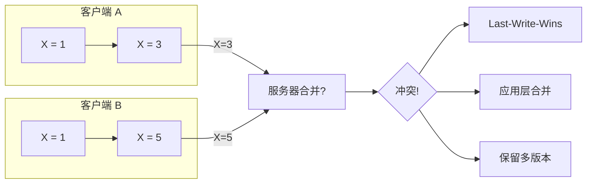
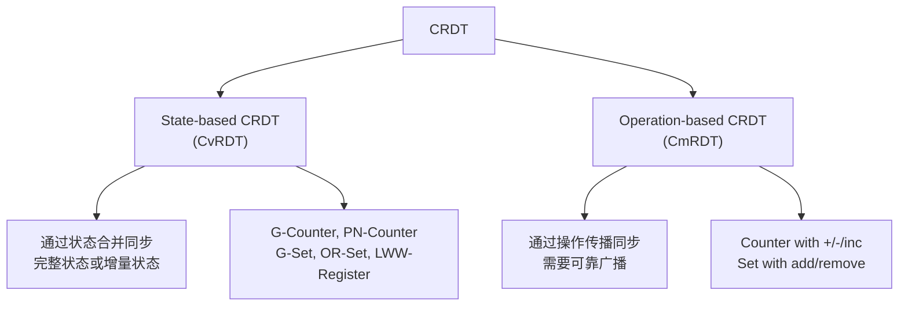
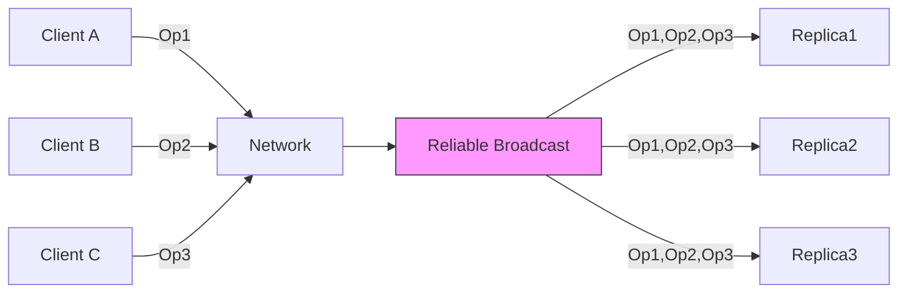
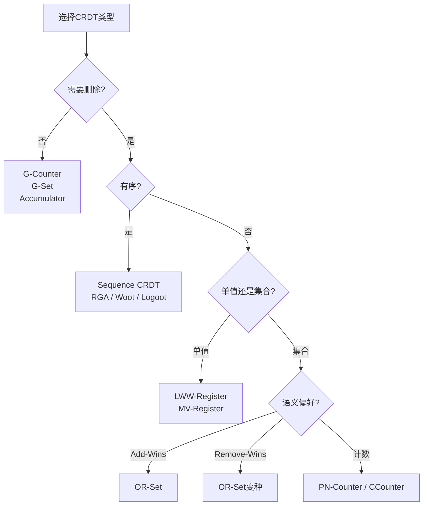

# CRDT：无冲突复制数据类型

> **理论基础**: Shapiro, M., Preguiça, N., Baquero, C., & Zawirski, M. (2011). Conflict-free Replicated Data Types. *SSS'11*.
>
> **扩展阅读**: Shapiro et al. (2011). A comprehensive study of Convergent and Commutative Replicated Data Types.

## 一、背景：最终一致性的挑战

### 1.1 分布式系统的复制模型

```
┌─────────────────────────────────────────────────────────────┐
│                    数据复制策略对比                           │
├─────────────────┬─────────────────┬─────────────────────────┤
│     策略         │     一致性       │       可用性            │
├─────────────────┼─────────────────┼─────────────────────────┤
│ 强同步复制       │      强         │   低（网络分区不可用）    │
│ (2PC/Paxos)    │                 │                        │
├─────────────────┼─────────────────┼─────────────────────────┤
│ 异步复制         │   最终一致       │   高（始终可写）          │
│ (主从/多主)     │   (需冲突解决)   │                        │
├─────────────────┼─────────────────┼─────────────────────────┤
│ CRDT复制        │   强最终一致      │   高 + 无冲突解决开销      │
│                 │   (自动收敛)     │                        │
└─────────────────┴─────────────────┴─────────────────────────┘
```

### 1.2 冲突问题示例



**传统方案的问题**：

- 冲突检测需要元数据（向量时钟）
- 冲突解决需要应用层介入
- 数据可能丢失（LWW）或复杂（多版本）

### 1.3 CRDT的核心思想

```
CRDT设计哲学:

┌─────────────────────────────────────────────────────────────┐
│  如果操作天然可交换、可幂等、可结合，则永远不会产生冲突        │
│                                                             │
│  数据类型设计原则：                                          │
│  1. 所有更新操作都是本地的（无需协调）                         │
│  2. 所有副本保证最终收敛到相同状态                            │
│  3. 无需冲突解决机制                                          │
└─────────────────────────────────────────────────────────────┘
```

## 二、CRDT理论基础

### 2.1 状态合并的数学基础

```go
// CRDT必须满足的数学性质

// 1. 交换律 (Commutativity)
//    merge(A, B) == merge(B, A)

// 2. 结合律 (Associativity)
//    merge(merge(A, B), C) == merge(A, merge(B, C))

// 3. 幂等律 (Idempotence)
//    merge(A, A) == A

// 这三个性质共同构成一个半格 (Join-Semilattice)
// 合并操作即半格的 Join 操作
```

### 2.2 CRDT分类



## 三、State-based CRDT (CvRDT)

### 3.1 核心机制

```go
// State-based CRDT 接口
type StateCRDT interface {
    // 本地更新
    Update(operation Op)

    // 查询当前状态
    Query() Value

    // 合并其他副本状态
    Merge(other StateCRDT) StateCRDT
}

// 同步流程
type Replica struct {
    id    string
    state StateCRDT
}

func (r *Replica) syncWith(other *Replica) {
    // 简单地合并对方状态
    r.state = r.state.Merge(other.state)
}
```

### 3.2 G-Counter（增长计数器）

```go
// G-Counter: 只能递增的计数器
// 每个副本维护自己的计数，合并取最大值

type GCounter struct {
    // 每个副本ID对应一个计数
    counts map[string]int64
}

// 本地递增
func (gc *GCounter) Increment(replicaID string) {
    gc.counts[replicaID]++
}

// 查询总值
func (gc *GCounter) Value() int64 {
    var sum int64
    for _, v := range gc.counts {
        sum += v
    }
    return sum
}

// 合并其他G-Counter
func (gc *GCounter) Merge(other *GCounter) *GCounter {
    merged := &GCounter{counts: make(map[string]int64)}

    // 对所有副本ID取最大值
    allIDs := union(keys(gc.counts), keys(other.counts))
    for _, id := range allIDs {
        v1 := gc.counts[id]
        v2 := other.counts[id]
        merged.counts[id] = max(v1, v2)
    }

    return merged
}
```

**正确性验证**：

```
交换律: merge(A, B) 对每个元素取max，与顺序无关 ✓
结合律: merge(merge(A,B), C) 三层max操作，满足结合律 ✓
幂等律: merge(A, A) 取max结果仍为A ✓
```

### 3.3 PN-Counter（可增可减计数器）

```go
// PN-Counter: 支持递增和递减
// 内部维护两个G-Counter: P(递增) 和 N(递减)

type PNCounter struct {
    p GCounter  // 递增计数
    n GCounter  // 递减计数
}

func (pnc *PNCounter) Increment(replicaID string) {
    pnc.p.Increment(replicaID)
}

func (pnc *PNCounter) Decrement(replicaID string) {
    pnc.n.Increment(replicaID)  // 注意：递减计数器也是递增
}

func (pnc *PNCounter) Value() int64 {
    return pnc.p.Value() - pnc.n.Value()
}

func (pnc *PNCounter) Merge(other *PNCounter) *PNCounter {
    return &PNCounter{
        p: pnc.p.Merge(&other.p),
        n: pnc.n.Merge(&other.n),
    }
}
```

**限制**：实际值不能为负时，需要额外约束

### 3.4 G-Set（增长集合）

```go
// G-Set: 只能添加元素的集合

type GSet struct {
    elements map[interface{}]struct{}
}

func (gs *GSet) Add(element interface{}) {
    gs.elements[element] = struct{}{}
}

func (gs *GSet) Contains(element interface{}) bool {
    _, ok := gs.elements[element]
    return ok
}

func (gs *GSet) Merge(other *GSet) *GSet {
    merged := &GSet{elements: make(map[interface{}]struct{})}

    // 并集操作
    for elem := range gs.elements {
        merged.elements[elem] = struct{}{}
    }
    for elem := range other.elements {
        merged.elements[elem] = struct{}{}
    }

    return merged
}
```

### 3.5 OR-Set（观察移除集合）

```go
// OR-Set: 支持添加和删除的集合
// 核心思想: 为每个元素分配唯一标签，删除只移除特定标签

type Tag string  // 唯一标识符 (如 UUID)

type ORSet struct {
    // 元素 -> 标签集合的映射
    elements map[interface{}]map[Tag]struct{}
}

func (ors *ORSet) Add(element interface{}, tag Tag) {
    if ors.elements[element] == nil {
        ors.elements[element] = make(map[Tag]struct{})
    }
    ors.elements[element][tag] = struct{}{}
}

func (ors *ORSet) Remove(element interface{}) {
    // 删除: 移除该元素的所有当前标签
    delete(ors.elements, element)
}

func (ors *ORSet) Contains(element interface{}) bool {
    tags, ok := ors.elements[element]
    return ok && len(tags) > 0
}

func (ors *ORSet) Merge(other *ORSet) *ORSet {
    merged := &ORSet{elements: make(map[interface{}]map[Tag]struct{})}

    allElements := union(keys(ors.elements), keys(other.elements))

    for _, elem := range allElements {
        tags1 := ors.elements[elem]
        tags2 := other.elements[elem]

        // 标签集合取并集
        mergedTags := unionTags(tags1, tags2)
        if len(mergedTags) > 0 {
            merged.elements[elem] = mergedTags
        }
    }

    return merged
}
```

**OR-Set的语义**：

```
场景: 并发添加和删除
- A副本: Add(X)
- B副本: Remove(X) (在收到Add之前)

传统方案: 冲突!
OR-Set:
  - Add(X) 创建标签 T1
  - Remove(X) 移除当时可见的所有标签（可能为空）
  - 合并后: X仍然存在（因为T1被添加）

这实现了 "Add-Wins" 语义
```

### 3.6 LWW-Register（最后写入胜寄存器）

```go
// LWW-Register: 存储单个值，基于时间戳解决并发写入

type LWWRegister struct {
    value     interface{}
    timestamp int64  // 逻辑时钟或物理时间戳
}

func (lww *LWWRegister) Write(value interface{}, ts int64) {
    if ts > lww.timestamp {
        lww.value = value
        lww.timestamp = ts
    }
}

func (lww *LWWRegister) Read() interface{} {
    return lww.value
}

func (lww *LWWRegister) Merge(other *LWWRegister) *LWWRegister {
    if lww.timestamp >= other.timestamp {
        return &LWWRegister{
            value:     lww.value,
            timestamp: lww.timestamp,
        }
    }
    return &LWWRegister{
        value:     other.value,
        timestamp: other.timestamp,
    }
}
```

**时间戳冲突处理**：

```go
// 如果 timestamp 相同，使用 replicaID 打破平局
func (lww *LWWRegister) WriteWithTieBreaker(value interface{}, ts int64, replicaID string) {
    if ts > lww.timestamp ||
       (ts == lww.timestamp && replicaID > lww.replicaID) {
        lww.value = value
        lww.timestamp = ts
        lww.replicaID = replicaID
    }
}
```

## 四、Operation-based CRDT (CmRDT)

### 4.1 核心机制

```go
// Operation-based CRDT 接口
type OpCRDT interface {
    // 本地执行操作，生成操作事件
    Execute(operation Op) Event

    // 应用远程操作事件
    Apply(event Event)

    // 查询状态
    Query() Value
}

// 要求: 操作必须可交换
// 即: Apply(A); Apply(B) == Apply(B); Apply(A)
```

### 4.2 CmRDT Counter

```go
type CmCounter struct {
    value int64
}

// 可交换的操作类型
type IncOp struct{ delta int64 }
type DecOp struct{ delta int64 }

func (c *CmCounter) Execute(op interface{}) interface{} {
    switch o := op.(type) {
    case IncOp:
        c.value += o.delta
        return o  // 广播此操作
    case DecOp:
        c.value -= o.delta
        return o
    }
    return nil
}

func (c *CmCounter) Apply(event interface{}) {
    // 直接应用操作（与本地执行相同）
    switch o := event.(type) {
    case IncOp:
        c.value += o.delta
    case DecOp:
        c.value -= o.delta
    }
}

// 操作天然可交换: 加减法满足交换律
// A: +3, B: -2 无论顺序如何，结果相同
```

### 4.3 CmRDT Set

```go
// Add-Wins Set (CmRDT版本)

type CmSet struct {
    elements map[interface{}]struct{}
}

type AddOp struct {
    element interface{}
    tag     Tag  // 唯一标签
}

type RemoveOp struct {
    element   interface{}
    removeTags []Tag  // 要移除的标签集合
}

func (cs *CmSet) ApplyAdd(op AddOp) {
    cs.elements[op.element] = struct{}{}
    // 存储标签用于后续删除
}

func (cs *CmSet) ApplyRemove(op RemoveOp) {
    // 只删除当时可见的标签
    // 后续添加的标签不受影响
    if shouldRemove(cs.getTags(op.element), op.removeTags) {
        delete(cs.elements, op.element)
    }
}

// 操作可交换性保证
// Add(X, T1) 和 Remove(X, []) 无论顺序，
// 只要有 Add 操作，X 最终存在
```

### 4.4 可靠广播要求



**CmRDT需要**: 可靠因果广播 (Reliable Causal Broadcast)

- 可靠性: 所有正确进程都传递消息
- 因果性: 如果发送m在发送m'之前，则传递m在传递m'之前

## 五、高级CRDT类型

### 5.1 MV-Register（多值寄存器）

```go
// MV-Register: 并发写入时保留所有值

type MVRegister struct {
    values []TimestampedValue  // 保留所有并发值
}

type TimestampedValue struct {
    value     interface{}
    timestamp VectorClock  // 使用向量时钟
}

func (mv *MVRegister) Write(value interface{}, vc VectorClock) {
    // 移除所有被新值覆盖的旧值
    var newValues []TimestampedValue
    for _, tv := range mv.values {
        if !lessThan(tv.timestamp, vc) {
            // 旧值与新值并发或更晚
            newValues = append(newValues, tv)
        }
    }

    newValues = append(newValues, TimestampedValue{value, vc})
    mv.values = newValues
}

func (mv *MVRegister) Read() []interface{} {
    // 返回所有并发值 (siblings)
    var result []interface{}
    for _, tv := range mv.values {
        result = append(result, tv.value)
    }
    return result
}
```

### 5.2 RGA（Replicated Growable Array）

```go
// RGA: 支持插入和删除的有序列表 (如协同编辑)

type RGA struct {
    nodes map[NodeID]*RGANode
    head  NodeID  // 虚拟头节点
}

type RGANode struct {
    id       NodeID
    parent   NodeID      // 插入位置的前驱
    value    interface{}
    deleted  bool        // 逻辑删除标记
    timestamp VectorClock
}

// 在指定位置插入
func (rga *RGA) Insert(after NodeID, value interface{}, ts VectorClock) NodeID {
    newID := generateUniqueID()
    node := &RGANode{
        id:        newID,
        parent:    after,
        value:     value,
        timestamp: ts,
    }
    rga.nodes[newID] = node
    return newID
}

// 逻辑删除
func (rga *RGA) Delete(id NodeID) {
    if node, ok := rga.nodes[id]; ok {
        node.deleted = true
    }
}

// 读取有序列表（按timestamp拓扑排序）
func (rga *RGA) Read() []interface{} {
    // 构建有序序列，跳过deleted节点
    // 使用偏序关系确保所有副本顺序一致
}
```

### 5.3 CRDT Map

```go
// Map with CRDT values

type CRDTMap struct {
    entries map[string]CRDT  // key -> CRDT value
}

func (cm *CRDTMap) Update(key string, op Op) {
    if cm.entries[key] == nil {
        cm.entries[key] = createDefaultCRDT()
    }
    cm.entries[key].Apply(op)
}

func (cm *CRDTMap) Remove(key string) {
    // 对于嵌套CRDT，通常是递归清空
    delete(cm.entries, key)
}

func (cm *CRDTMap) Merge(other *CRDTMap) *CRDTMap {
    merged := &CRDTMap{entries: make(map[string]CRDT)}

    allKeys := union(keys(cm.entries), keys(other.entries))

    for _, key := range allKeys {
        v1, ok1 := cm.entries[key]
        v2, ok2 := other.entries[key]

        if ok1 && ok2 {
            // 两者都有，合并值
            merged.entries[key] = v1.Merge(v2)
        } else if ok1 {
            merged.entries[key] = v1
        } else {
            merged.entries[key] = v2
        }
    }

    return merged
}
```

## 六、CRDT应用实践

### 6.1 协同编辑（如Google Docs）

```go
// 使用RGA或Woot算法实现协同文本编辑

type CollaborativeEditor struct {
    document *RGA  // 将文档建模为字符序列
}

func (ce *CollaborativeEditor) LocalInsert(pos int, char rune) {
    // 1. 找到插入位置的节点ID
    afterID := ce.document.findNodeAt(pos)

    // 2. 生成新节点（本地操作）
    newID := ce.document.Insert(afterID, char, ce.localClock)

    // 3. 广播操作（如果是CmRDT）或同步状态（如果是CvRDT）
    ce.broadcast(Operation{Type: Insert, After: afterID, Char: char, ID: newID})
}

func (ce *CollaborativeEditor) RemoteInsert(op Operation) {
    // 应用远程操作，自动保持一致性
    ce.document.Insert(op.After, op.Char, op.Timestamp)
}

// 冲突处理: 由于RGA的数学性质，无需显式冲突解决
```

### 6.2 购物车实现（Riak示例）

```go
// 购物车使用OR-Set实现

type ShoppingCart struct {
    items *ORSet  // 商品ID集合
}

func (sc *ShoppingCart) AddItem(itemID string) {
    tag := generateUUID()
    sc.items.Add(itemID, tag)
}

func (sc *ShoppingCart) RemoveItem(itemID string) {
    sc.items.Remove(itemID)  // 逻辑删除
}

func (sc *ShoppingCart) GetItems() []string {
    var items []string
    for item := range sc.items.elements {
        items = append(items, item.(string))
    }
    return items
}

// 场景: 用户在网络分区时添加和删除商品
// - A数据中心: 添加 iPhone
// - B数据中心: 删除 iPhone（基于旧状态）
// - 网络恢复后合并: iPhone 仍然存在（Add-Wins）
// 这正是电商需要的语义！
```

### 6.3 分布式计数器服务

```go
type DistributedCounterService struct {
    localCounters map[string]*GCounter  // 每个指标的本地计数器
}

func (dcs *DistributedCounterService) Increment(metric string) {
    counter := dcs.getOrCreateCounter(metric)
    counter.Increment(dcs.replicaID)
}

func (dcs *DistributedCounterService) GetCount(metric string) int64 {
    counter := dcs.localCounters[metric]
    return counter.Value()
}

func (dcs *DistributedCounterService) Sync(peer *DistributedCounterService) {
    // 定期同步所有计数器
    for metric, local := range dcs.localCounters {
        if remote, ok := peer.localCounters[metric]; ok {
            local.Merge(remote)
        }
    }
}
```

## 七、CRDT选型指南

### 7.1 决策树



### 7.2 CvRDT vs CmRDT 选择

| 特性 | CvRDT (State-based) | CmRDT (Op-based) |
|-----|---------------------|------------------|
| 网络使用 | 传输整个状态（或delta） | 只传输操作 |
| 状态大小 | 可能很大 | 较小 |
| 广播要求 | 不可靠广播即可 | 需要可靠因果广播 |
| 实现复杂度 | 简单（只需Merge） | 较复杂（需保证投递顺序） |
| 适合场景 | 低更新频率、高查询频率 | 高更新频率、大状态 |

## 八、Delta-State CRDT

### 8.1 增量状态同步

```go
// Delta-State CRDT: 只传输变化的部分

type DeltaCRDT interface {
    StateCRDT

    // 生成自上次同步以来的delta
    Delta() StateCRDT

    // 合并delta（而非完整状态）
    MergeDelta(delta StateCRDT)
}

// G-Counter的Delta版本
type DeltaGCounter struct {
    GCounter
    delta map[string]int64  // 上次同步后的变化
}

func (dgc *DeltaGCounter) Increment(replicaID string) {
    dgc.GCounter.Increment(replicaID)
    dgc.delta[replicaID]++
}

func (dgc *DeltaGCounter) Delta() *GCounter {
    // 只返回变化的部分
    return &GCounter{counts: dgc.delta}
}

func (dgc *DeltaGCounter) MergeDelta(delta *GCounter) {
    dgc.GCounter.Merge(delta)
    // 重置本地delta
    dgc.delta = make(map[string]int64)
}
```

## 九、总结

### 9.1 CRDT设计原则

1. **选择合适的语义**：Add-Wins、Remove-Wins、LWW等
2. **利用半格结构**：确保Merge操作满足交换律、结合律、幂等律
3. **考虑实际约束**：如PN-Counter的实际值不能为负
4. **优化传输大小**：使用Delta-State减少网络开销

### 9.2 局限性与注意事项

| 局限 | 说明 |
|-----|------|
| 只能实现特定语义 | 不是所有业务逻辑都有CRDT解 |
| 状态可能无限增长 | 需要垃圾回收机制 |
| 垃圾回收复杂 | 删除操作只是逻辑删除 |
| 查询可能较复杂 | 需要遍历内部结构 |

### 9.3 生产系统应用

- **Riak**: 内置CRDT支持（计数器、集合、Map）
- **Redis**: Redis-CRDT模块
- **Akka**: Akka Distributed Data
- **Automerge**: JavaScript CRDT库（Notion使用）

## 参考资源

- [CRDT原始论文](https://hal.inria.fr/hal-00932836/)
- [CRDT.tech](https://crdt.tech/) - CRDT资源汇总
- [Riak Data Types](https://docs.riak.com/riak/kv/2.2.3/developing/data-types/index.html)
- [Automerge](https://automerge.org/)
- [A comprehensive study of CRDTs](https://hal.inria.fr/file/index/docid/555588/filename/techreport.pdf)
