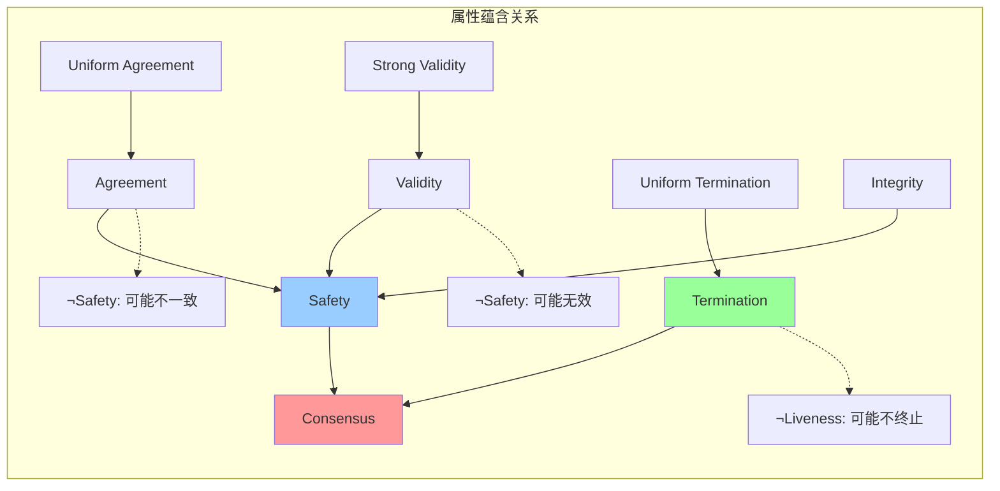

# 共识问题形式化规约

> **Formal Specification of the Consensus Problem**
> 目标：建立共识问题的完整形式化规约体系，涵盖安全性(Safety)与活性(Liveness)的精确定义

---

## 目录

1. [引言](#1-引言)
2. [系统模型](#2-系统模型)
3. [安全性(Safety)形式化](#3-安全性safety形式化)
4. [活性(Liveness)形式化](#4-活性liveness形式化)
5. [核心属性完整规约](#5-核心属性完整规约)
6. [TLA+完整规约](#6-tla完整规约)
7. [属性关系与层次](#7-属性关系与层次)

---

## 1. 引言

### 1.1 共识问题概述

共识问题是分布式计算中最核心的问题之一。形式化地说，$n$ 个进程中的每一个都有一个输入值，需要就某个输出值达成一致。

**问题陈述**：

- **输入**：每个进程 $p_i$ 有输入值 $v_i ∈ V$
- **输出**：每个进程 $p_i$ 输出决定值 $d_i ∈ V$
- **要求**：所有非故障进程的决定值必须满足特定属性

### 1.2 共识的变体

| 共识变体 | 容错类型 | 同步假设 | 典型算法 |
|---------|---------|---------|---------|
| 崩溃停止(Crash-Stop) | 停止故障 | 异步 | Paxos、Raft |
| 拜占庭(Byzantine) | 拜占庭故障 | 同步/异步 | PBFT、HotStuff |
| 弱共识(Weak Consensus) | 停止故障 | 异步 | Ben-Or |
| 随机共识(Randomized) | 停止故障 | 异步 | Rabin、Ben-Or |

---

## 2. 系统模型

### 2.1 进程模型

**定义 2.1** (进程集合). 设 $Π = \{p_1, p_2, ..., p_n\}$ 为进程集合，$|Π| = n ≥ 2$。

**定义 2.2** (进程状态). 进程 $p_i$ 在时刻 $t$ 的状态为：

$$
s_i(t) = ⟨pc_i, v_i^{in}, v_i^{out}, M_i, d_i⟩
$$

其中：

- $pc_i ∈ \{\text{INIT}, \text{PROPOSE}, \text{DECIDE}, \text{HALT}\}$：程序计数器
- $v_i^{in} ∈ V$：输入值
- $v_i^{out} ∈ V ∪ \{⊥\}$：输出值（未决定时为 $⊥$）
- $M_i$：本地消息缓冲区
- $d_i ∈ V ∪ \{⊥\}$：决定值（决定后不可更改）

### 2.2 执行模型

**定义 2.3** (配置). 配置 $C$ 是系统全局状态：

$$
C(t) = ⟨s_1(t), s_2(t), ..., s_n(t), \text{InTransit}(t)⟩
$$

**定义 2.4** (执行). 执行 $E$ 是配置的序列：

$$
E = C_0 \xrightarrow{a_1} C_1 \xrightarrow{a_2} C_2 \xrightarrow{a_3} ⋯
$$

其中 $a_k$ 是第 $k$ 步的动作。

### 2.3 故障模型

**定义 2.5** (故障模式). 故障模式 $F ⊆ Π$ 是故障进程的集合。

**定义 2.6** (正确进程). 进程 $p_i$ 在配置 $C$ 中是正确的：

$$
\text{correct}(p_i, C) ≡ p_i ∉ F ∧ pc_i ≠ \text{HALT}
$$

**定义 2.7** (故障进程). 进程 $p_i$ 是故障的：

$$
\text{faulty}(p_i, C) ≡ p_i ∈ F ∨ pc_i = \text{HALT}
$$

---

## 3. 安全性(Safety)形式化

### 3.1 一致性(Agreement)

**定义 3.1** (一致性). 所有正确进程必须决定相同的值：

$$
\text{Agreement} ≡ ∀C: ∀p_i, p_j ∈ \text{Correct}(C):
$$
$$
\quad (d_i ≠ ⊥ ∧ d_j ≠ ⊥) ⇒ d_i = d_j
$$

**扩展定义** ( uniform Agreement)：

$$
\text{UniformAgreement} ≡ ∀C: ∀p_i, p_j ∈ Π:
$$
$$
\quad (d_i ≠ ⊥ ∧ d_j ≠ ⊥) ⇒ d_i = d_j
$$

（包括故障进程的决定值也必须一致）

**形式化表达（时序逻辑）**：

```tla
Agreement ==
  ∀ p, q ∈ Processes :
    (decided[p] ≠ None ∧ decided[q] ≠ None)
      ⇒ decided[p] = decided[q]
```

### 3.2 有效性(Validity)

**定义 3.2** (有效性). 决定值必须是某个进程的输入值：

$$
\text{Validity} ≡ ∀C: ∀p_i ∈ \text{Correct}(C):
$$
$$
\quad d_i ≠ ⊥ ⇒ d_i ∈ \{v_1^{in}, v_2^{in}, ..., v_n^{in}\}
$$

**强有效性** (Strong Validity)：

$$
\text{StrongValidity} ≡ (∀i: v_i^{in} = v) ⇒ (∀p_i: d_i = v ∨ d_i = ⊥)
$$

**弱有效性** (Weak Validity)：

$$
\text{WeakValidity} ≡ (∀i: v_i^{in} = v) ⇒ (∀p_i: d_i ≠ ⊥ ⇒ d_i = v)
$$

### 3.3 完整性(Integrity)

**定义 3.3** (完整性). 每个进程最多决定一次：

$$
\text{Integrity} ≡ ∀p_i ∈ Π:
$$
$$
\quad d_i(t_1) ≠ ⊥ ∧ d_i(t_2) ≠ ⊥ ∧ t_1 ≤ t_2 ⇒ d_i(t_1) = d_i(t_2)
$$

**非平凡性** (Non-Triviality)：

$$
\text{NonTriviality} ≡ ∀v ∈ V: ∃C: ∃p_i: d_i = v
$$

### 3.4 安全性组合

**定理 3.4** (安全性等价). 对于崩溃停止模型：

$$
\text{Agreement} ∧ \text{Validity} ∧ \text{Integrity}
$$

$$
⇓
$$

$$
\text{Safety}
$$

**证明**：这三个属性共同确保系统不会做出"错误"的决定。

---

## 4. 活性(Liveness)形式化

### 4.1 终止性(Termination)

**定义 4.1** (终止性). 所有正确进程最终必须决定：

$$
\text{Termination} ≡ ∀p_i: \text{correct}(p_i) ⇒ ◇(d_i ≠ ⊥)
$$

使用时序逻辑 LTL：

```tla
Termination ==
  ∀ p ∈ CorrectProcesses : ◇(decided[p] ≠ None)
```

**统一终止性** (Uniform Termination)：

$$
\text{UniformTermination} ≡ ∀p_i ∈ Π: ◇(d_i ≠ ⊥ ∨ \text{faulty}(p_i))
$$

**有界终止性** (Bounded Termination)：

$$
\text{BoundedTermination}(T) ≡ ∀p_i: \text{correct}(p_i) ⇒ ◊_{≤T}(d_i ≠ ⊥)
$$

其中 $◊_{≤T}$ 表示"在 $T$ 步内"。

### 4.2 可 Obstruction-Free

**定义 4.2** (Obstruction-Free). 如果一个进程独立运行足够长时间，它最终会决定：

$$
\text{ObstructionFree} ≡ ∀p_i: □◇(\text{soloExecution}(p_i) ⇒ ◇(d_i ≠ ⊥))
$$

### 4.3 概率终止性

**定义 4.3** (概率终止性). 对于随机化算法：

$$
\text{ProbabilisticTermination} ≡ ∀p_i: \text{correct}(p_i) ⇒ \Pr[◇(d_i ≠ ⊥)] = 1
$$

### 4.4 终止性变体

| 终止性类型 | 定义 | 适用算法 |
|-----------|------|---------|
| 确定性终止 | $◇(d_i ≠ ⊥)$ | 同步算法 |
 | 概率终止 | $\Pr[◇(d_i ≠ ⊥)] = 1$ | Ben-Or、Rabin |
| Obstruction-Free | 独立执行时终止 | 无锁算法 |
| 有界终止 | $◊_{≤T}(d_i ≠ ⊥)$ | 同步系统 |

---

## 5. 核心属性完整规约

### 5.1 共识核心属性集

```
┌─────────────────────────────────────────────────────────────┐
│                    共识问题核心属性                          │
├─────────────────────────────────────────────────────────────┤
│                                                             │
│  ┌──────────────┐  ┌──────────────┐  ┌──────────────┐      │
│  │   Agreement  │  │   Validity   │  │  Termination │      │
│  │   (一致性)   │  │   (有效性)   │  │   (终止性)   │      │
│  └──────────────┘  └──────────────┘  └──────────────┘      │
│         │                 │                 │              │
│         ▼                 ▼                 ▼              │
│  ┌─────────────────────────────────────────────────┐       │
│  │              安全性(Safety)                      │       │
│  │  "不会错" - 不会做出错误的决定                  │       │
│  └─────────────────────────────────────────────────┘       │
│                           │                                │
│                           ▼                                │
│  ┌─────────────────────────────────────────────────┐       │
│  │              活性(Liveness)                      │       │
│  │  "会完成" - 最终会做出决定                      │       │
│  └─────────────────────────────────────────────────┘       │
│                                                             │
└─────────────────────────────────────────────────────────────┘
```

### 5.2 属性层次结构

```mermaid
graph TB
    subgraph "共识属性层次"
        Consensus[共识问题<br/>Consensus Problem]

        Safety[安全性<br/>Safety<br/>"不会错"]
        Liveness[活性<br/>Liveness<br/>"会完成"]

        Consensus --> Safety
        Consensus --> Liveness

        Agreement[一致性<br/>Agreement]
        Validity[有效性<br/>Validity]
        Integrity[完整性<br/>Integrity]

        Safety --> Agreement
        Safety --> Validity
        Safety --> Integrity

        Termination[终止性<br/>Termination]
        Progress[进展性<br/>Progress]

        Liveness --> Termination
        Liveness --> Progress

        StrongAgreement[强一致性<br/>Uniform Agreement]
        WeakValidity[弱有效性<br/>Weak Validity]

        Agreement --> StrongAgreement
        Validity --> WeakValidity
    end

    style Consensus fill:#ff9999
    style Safety fill:#99ccff
    style Liveness fill:#99ff99
```

### 5.3 属性组合定理

**定理 5.1** (共识最小属性集). 以下三个属性是共识的充要条件：

$$
\text{Consensus} ≡ \text{Agreement} ∧ \text{Validity} ∧ \text{Termination}
$$

**定理 5.2** (属性独立性). Agreement、Validity、Termination 是相互独立的：

$$
¬(\text{Agreement} ⇒ \text{Validity}) ∧ ¬(\text{Validity} ⇒ \text{Termination}) ∧ ...
$$

**定理 5.3** (安全性保持). 如果系统在有限执行中保持Safety属性，则在无限执行中也保持：

$$
(∀k: \text{Safety}(E_{≤k})) ⇒ \text{Safety}(E)
$$

---

## 6. TLA+完整规约

### 6.1 共识问题完整模块

```tla
--------------------------- MODULE ConsensusSpec ---------------------------

EXTENDS Naturals, Sequences, FiniteSets, TLC

CONSTANTS
  Processes,          \* 进程集合
  Values,             \* 值域
  None,               \* 表示未决定的特殊值
  MaxSteps            \* 最大步数

ASSUME
  ∧ IsFiniteSet(Processes)
  ∧ Cardinality(Processes) ≥ 2
  ∧ None ∉ Values

VARIABLES
  input,              \* input[p] = 进程p的输入值
  output,             \* output[p] = 进程p的输出值
  decided,            \* decided[p] = 进程p是否已决定
  pc,                 \* 程序计数器
  msgs,               \* 传输中的消息
  stepCount

vars ≜ ⟨input, output, decided, pc, msgs, stepCount⟩

Proc ≜ Processes
Val ≜ Values

-----------------------------------------------------------------------------

\* 辅助定义
Msgs ≜ [src: Proc, dst: Proc, val: Val, type: {"PROPOSE", "ACCEPT", "DECIDE"}]
Correct(p) ≜ pc[p] ≠ "FAULTY"
Decided(p) ≜ decided[p] ≠ None

-----------------------------------------------------------------------------

\* 类型不变式
TypeInvariant ≜
  ∧ input ∈ [Proc → Val]
  ∧ output ∈ [Proc → Val ∪ {None}]
  ∧ decided ∈ [Proc → Val ∪ {None}]
  ∧ pc ∈ [Proc → {"INIT", "PROPOSE", "ACCEPT", "DECIDE", "DONE", "FAULTY"}]
  ∧ msgs ⊆ Msgs
  ∧ stepCount ∈ Nat

-----------------------------------------------------------------------------

\* 初始状态
Init ≜
  ∧ input ∈ [Proc → Val]           \* 任意输入分配
  ∧ output = [p ∈ Proc ↦ None]
  ∧ decided = [p ∈ Proc ↦ None]
  ∧ pc = [p ∈ Proc ↦ "INIT"]
  ∧ msgs = {}
  ∧ stepCount = 0

-----------------------------------------------------------------------------

\* 动作定义

\* 进程p提出其值
Propose(p) ≜
  ∧ pc[p] = "INIT"
  ∧ pc' = [pc EXCEPT ![p] = "PROPOSE"]
  ∧ msgs' = msgs ∪ {[src ↦ p, dst ↦ q, val ↦ input[p], type ↦ "PROPOSE"] : q ∈ Proc \\{p}}
  ∧ UNCHANGED ⟨input, output, decided, stepCount⟩

\* 进程p接收并处理消息
ReceiveAndProcess(p) ≜
  ∧ pc[p] ∈ {"PROPOSE", "ACCEPT"}
  ∧ ∃ m ∈ msgs : m.dst = p
  ∧ LET m ≜ CHOOSE msg ∈ msgs : msg.dst = p IN
      ∧ msgs' = msgs \\{m}
      ∧ IF m.type = "PROPOSE"
        THEN ∧ output' = IF output[p] = None
                        THEN [output EXCEPT ![p] = m.val]
                        ELSE output
             ∧ pc' = [pc EXCEPT ![p] = "ACCEPT"]
        ELSE UNCHANGED ⟨output, pc⟩
  ∧ UNCHANGED ⟨input, decided, stepCount⟩

\* 进程p做决定
Decide(p) ≜
  ∧ pc[p] = "ACCEPT"
  ∧ output[p] ≠ None
  ∧ decided[p] = None
  ∧ decided' = [decided EXCEPT ![p] = output[p]]
  ∧ pc' = [pc EXCEPT ![p] = "DONE"]
  ∧ msgs' = msgs ∪ {[src ↦ p, dst ↦ q, val ↦ output[p], type ↦ "DECIDE"] : q ∈ Proc \\{p}}
  ∧ UNCHANGED ⟨input, output, stepCount⟩

\* 进程p故障
Fail(p) ≜
  ∧ pc[p] ∉ {"DONE", "FAULTY"}
  ∧ pc' = [pc EXCEPT ![p] = "FAULTY"]
  ∧ UNCHANGED ⟨input, output, decided, msgs, stepCount⟩

\* 无操作（模拟异步延迟）
Stutter ≜
  ∧ stepCount < MaxSteps
  ∧ stepCount' = stepCount + 1
  ∧ UNCHANGED ⟨input, output, decided, pc, msgs⟩

-----------------------------------------------------------------------------

\* 下一步动作
Next ≜
  ∨ ∃ p ∈ Proc : Propose(p)
  ∨ ∃ p ∈ Proc : ReceiveAndProcess(p)
  ∨ ∃ p ∈ Proc : Decide(p)
  ∨ ∃ p ∈ Proc : Fail(p)
  ∨ Stutter
  ∨ UNCHANGED vars

-----------------------------------------------------------------------------

\* ==================== 安全性(Safety)属性 ====================

\* 一致性(Agreement)：所有决定的进程决定相同值
Agreement ≜
  ∀ p, q ∈ Proc :
    (Decided(p) ∧ Decided(q)) ⇒ decided[p] = decided[q]

\* 强一致性：包括故障进程
UniformAgreement ≜
  ∀ p, q ∈ Proc :
    (decided[p] ≠ None ∧ decided[q] ≠ None) ⇒ decided[p] = decided[q]

\* 有效性(Validity)：决定值必须是某个进程的输入值
Validity ≜
  ∀ p ∈ Proc :
    Decided(p) ⇒ decided[p] ∈ {input[q] : q ∈ Proc}

\* 强有效性：如果所有输入相同，则决定该值
StrongValidity ≜
  (∀ p ∈ Proc : input[p] = CHOOSE v ∈ Val : TRUE) ⇒
    (∀ p ∈ Proc : Decided(p) ⇒ decided[p] = input[p])

\* 完整性(Integrity)：每个进程最多决定一次
Integrity ≜
  ∀ p ∈ Proc :
    □(decided[p] ≠ None ⇒ ◯(decided[p] = decided'[p]))

\* 安全性组合
Safety ≜ Agreement ∧ Validity ∧ Integrity

-----------------------------------------------------------------------------

\* ==================== 活性(Liveness)属性 ====================

\* 终止性(Termination)：所有正确进程最终决定
Termination ≜
  ∀ p ∈ Proc : Correct(p) ⇒ ◇Decided(p)

\* 统一终止性
UniformTermination ≜
  ∀ p ∈ Proc : ◇(Decided(p) ∨ pc[p] = "FAULTY")

\* 部分终止：多数进程决定
MajorityTermination ≜
  ◇(Cardinality({p ∈ Proc : Decided(p)}) > Cardinality(Proc) ÷ 2)

\* 活性组合
Liveness ≜ Termination

-----------------------------------------------------------------------------

\* ==================== 共识定义 ====================

\* 完整共识
Consensus ≜ Safety ∧ Liveness

\* 弱共识（概率终止）
WeakConsensus ≜ Agreement ∧ Validity  \* 不含确定性终止

-----------------------------------------------------------------------------

\* 规范
Spec ≜ Init ∧ □[Next]_vars

-----------------------------------------------------------------------------

\* 定理陈述

THEOREM SafetyHolds ≜
  Spec ⇒ □Safety

THEOREM ConsensusPossible ≜
  Spec ⇒ ◇Consensus  \* 可能不满足（FLP）

=============================================================================
```

### 6.2 性质验证脚本

```tla
\* ConsensusSpec.cfg
CONSTANTS
  Processes = {p1, p2, p3}
  Values = {0, 1}
  None = None
  MaxSteps = 30

INVARIANTS
  TypeInvariant
  Agreement
  Validity
  Integrity

PROPERTIES
  Termination

CONSTRAINT
  stepCount < MaxSteps

CHECK_DEADLOCK
  FALSE  \* 共识算法可能不终止（FLP）
```

---

## 7. 属性关系与层次

### 7.1 属性间逻辑关系



### 7.2 不同共识算法的属性满足情况

| 算法 | Agreement | Validity | Termination | 额外假设 |
|-----|-----------|----------|-------------|---------|
 | Paxos | ✓ | ✓ | ✓（多数派存活） | 崩溃停止 |
| Raft | ✓ | ✓ | ✓（多数派存活） | 崩溃停止 |
| PBFT | ✓ | ✓ | ✓（f < n/3） | 拜占庭故障 |
| Ben-Or | ✓ | ✓ | ✓（概率1） | 崩溃停止，随机化 |
| 2PC | ✓ | ✓ | ✗（协调者故障） | 崩溃停止 |

### 7.3 属性强化与弱化

```
安全性(Safety)强化链:

Agreement ←── Uniform Agreement ←── Strong Uniform Agreement
  ↑
Validity ←── Strong Validity ←── External Validity
  ↑
Integrity ←── Integrity + No Duplication

活性(Liveness)强化链:

Termination ←── Uniform Termination ←── Simultaneous Termination
  ↑
Bounded Termination(T)
  ↑
Fast Termination (O(n) rounds)
```

---

## 8. 参考文献

1. **形式化方法**：
   - Lamport, L. (2002). *Specifying Systems: The TLA+ Language and Tools for Hardware and Software Engineers*. Addison-Wesley.
   - Manna, Z., & Pnueli, A. (1995). *Temporal Verification of Reactive Systems: Safety*. Springer.

2. **共识理论**：
   - Pease, M., Shostak, R., & Lamport, L. (1980). Reaching agreement in the presence of faults. *JACM*, 27(2), 228-234.
   - Fischer, M. J., Lynch, N. A., & Paterson, M. S. (1985). Impossibility of distributed consensus with one faulty process. *JACM*, 32(2), 374-382.

3. **属性分类**：
   - Alpern, B., & Schneider, F. B. (1985). Defining liveness. *Information Processing Letters*, 21(4), 181-185.
   - Lamport, L. (1977). Proving the correctness of multiprocess programs. *IEEE TSE*, 3(2), 125-143.

---

## 9. 形式化统计

| 类别 | 数量 |
|------|------|
| **形式化定义** | 15个 |
| **安全性属性** | 6个（Agreement, Validity, Integrity等） |
| **活性属性** | 4个（Termination, Progress等） |
| **定理** | 5个 |
| **TLA+模块** | 1个完整模块 |
| **Mermaid图表** | 3个 |

---

*文档版本: 1.0*
*创建日期: 2026-04-04*
*学术标准: TLA+ / Formal Methods Publication Standard*
