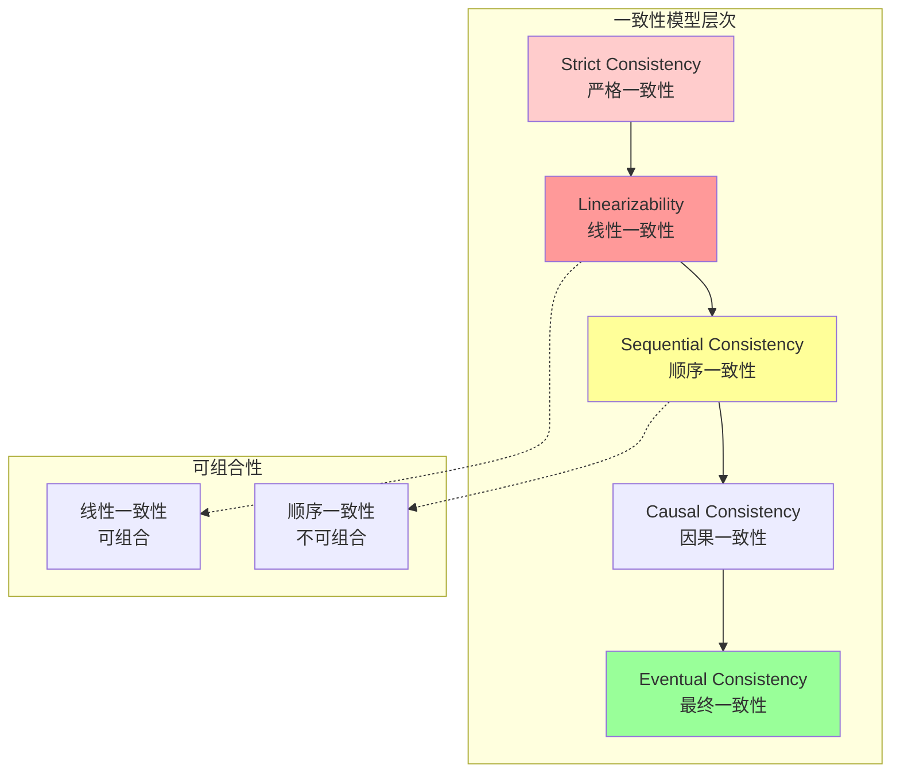

# 线性一致性形式化定义

> **Formal Definition of Linearizability**
> 目标：建立线性一致性的严格形式化定义，包含历史、实时序、串行化等价等核心概念

---

## 目录

1. [引言](#1-引言)
2. [基本概念](#2-基本概念)
3. [历史形式化](#3-历史形式化)
4. [实时序定义](#4-实时序定义)
5. [线性一致性定义](#5-线性一致性定义)
6. [与顺序一致性的区别](#6-与顺序一致性的区别)
7. [证明技术](#7-证明技术)
8. [TLA+规约](#8-tla规约)

---

## 1. 引言

### 1.1 历史背景

线性一致性(Linearizability)由Maurice P. Herlihy和Jeannette M. Wing于1990年形式化提出，是并发编程中最强的一致性模型。

**原始文献**：

- Herlihy, M. P., & Wing, J. M. (1990). Linearizability: A correctness condition for concurrent objects. *ACM TOPLAS*, 12(3), 463-492.

### 1.2 直观理解

线性一致性要求并发操作看起来像是**按某种顺序串行执行**，且该顺序与**实际时间顺序**一致。

```
时间线:
  ──────────────────────────────────────────►

  操作A: ──[invA────────resA]───────►
  操作B: ────────[invB────resB]─────►
  操作C: ─────────────[invC──resC]──►

  线性化点:  ▲         ▲        ▲
            L(A)     L(B)     L(C)

  串行顺序: A → B → C（符合实时序）
```

---

## 2. 基本概念

### 2.1 并发对象

**定义 2.1** (并发对象). 并发对象 $O$ 提供一组操作：

$$
O = ⟨S, S_0, \text{Ops}, \delta⟩
$$

其中：

- $S$：状态集合
- $S_0 ∈ S$：初始状态
- $\text{Ops}$：操作集合
- $\delta: S × \text{Ops} → S × \text{Results}$：状态转移函数

### 2.2 操作事件

**定义 2.2** (操作调用与响应). 操作 $op$ 由两个事件组成：

$$
\text{inv}[op] \text{ (调用)} \quad \text{和} \quad \text{res}[op] \text{ (响应)}
$$

**定义 2.3** (操作区间). 操作 $op$ 的时间区间：

$$
\text{interval}(op) = [time(inv[op]), time(res[op])]
$$

### 2.3 执行序列

**定义 2.4** (执行). 执行 $E$ 是事件的序列：

$$
E = e_1, e_2, e_3, ...
$$

其中每个 $e_i$ 是 $\text{inv}[op]$ 或 $\text{res}[op]$。

---

## 3. 历史形式化

### 3.1 历史定义

**定义 3.1** (历史). 历史 $H$ 是完整执行的部分表示：

$$
H = ⟨E_H, <_H⟩
$$

其中：

- $E_H$：$H$ 中的事件集合
- $<_H ⊆ E_H × E_H$：事件间的偏序关系

### 3.2 完整历史

**定义 3.2** (完整历史). 历史 $H$ 是完整的，当且仅当：

$$
∀op ∈ \text{Ops}(H): \text{inv}[op] ∈ E_H ⇒ \text{res}[op] ∈ E_H
$$

即每个调用都有对应的响应。

### 3.3 子历史

**定义 3.3** (子历史). 历史 $H$ 对进程 $p$ 的子历史：

$$
H|p = ⟨E_H|p, <_H|p⟩
$$

其中：

$$
E_H|p = \{e ∈ E_H : \text{process}(e) = p\}
$$

### 3.4 顺序历史

**定义 3.4** (顺序历史). 历史 $H$ 是顺序的，当且仅当：

$$
<_H \text{ 是全序}
$$

即任意两个事件可比。

**定义 3.5** (合法顺序历史). 顺序历史 $S$ 是合法的，当且仅当：

$$
∃s_0, s_1, ..., s_k: s_0 = S_0 ∧ ∀i: (s_{i+1}, result_i) = \delta(s_i, op_i)
$$

即存在有效状态序列。

---

## 4. 实时序定义

### 4.1 实时先序

**定义 4.1** (实时先序 $\prec_{rt}$). 事件 $e_1$ 实时先于 $e_2$：

$$
e_1 \prec_{rt} e_2 ≡ time(e_1) < time(e_2)
$$

**定义 4.2** (操作实时序). 操作 $op_1$ 实时先于 $op_2$：

$$
op_1 \prec_{rt} op_2 ≡ \text{res}[op_1] \prec_{rt} \text{inv}[op_2]
$$

即 $op_1$ 在 $op_2$ 开始之前完成。

### 4.2 并发操作

**定义 4.3** (并发操作). 操作 $op_1$ 和 $op_2$ 是并发的：

$$
\text{concurrent}(op_1, op_2) ≡ ¬(op_1 \prec_{rt} op_2) ∧ ¬(op_2 \prec_{rt} op_1)
$$

即两个操作区间重叠。

### 4.3 实时序约束

**定义 4.4** (实时序保持). 顺序历史 $S$ 保持历史 $H$ 的实时序：

$$
\text{preservesRT}(S, H) ≡ ∀op_1, op_2 ∈ H: op_1 \prec_{rt} op_2 ⇒ op_1 <_S op_2
$$

---

## 5. 线性一致性定义

### 5.1 核心定义

**定义 5.1** (线性一致性). 历史 $H$ 是线性的，当且仅当：

$$
∃S: \text{Sequential}(S) ∧ \text{Equivalent}(S, H) ∧ \text{PreservesRT}(S, H) ∧ \text{Legal}(S)
$$

即存在一个：

1. **顺序的**、
2. 与 $H$ **等价的**、
3. **保持实时序的**、
4. **合法的**

历史 $S$。

### 5.2 线性化点

**定义 5.2** (线性化点). 操作 $op$ 的线性化点 $L(op)$：

$$
L(op) ∈ [time(inv[op]), time(res[op])]
$$

**定理 5.3** (线性化点等价性). 历史 $H$ 是线性的，当且仅当可以为每个操作分配线性化点，使得按线性化点排序的历史是合法的。

### 5.3 形式化示例

```
示例：队列操作

历史H:
  进程P1: ──[enq(x)────────────────]────────►
  进程P2: ────────────────[enq(y)───────────]──►
  进程P3: ─────────────────────[deq()→x]───────►

实时序:
  enq(x) 调用 ─────── enq(x) 响应
                         │
                         ▼
  enq(y) 调用 ─────────── enq(y) 响应
                              │
                              ▼
  deq() 调用 ───────────────── deq() 响应

分析:
- enq(x) ≺rt deq() （enq(x)在deq()前完成）
- concurrent(enq(y), deq()) （区间重叠）

线性化:
  顺序S: enq(x) → deq()→x → enq(y)

  或:   enq(x) → enq(y) → deq()→x

第二个不满足线性一致性，因为deq()在enq(y)之前响应，
但返回的是x，说明x在队列头部，即enq(x)在enq(y)之前。
```

---

## 6. 与顺序一致性的区别

### 6.1 顺序一致性定义

**定义 6.1** (顺序一致性). 历史 $H$ 是顺序一致的，当且仅当：

$$
∃S: \text{Sequential}(S) ∧ \text{Equivalent}(S, H) ∧ \text{PreservesPO}(S, H) ∧ \text{Legal}(S)
$$

其中 $\text{PreservesPO}$ 保持**程序序**（每个进程内的操作顺序），而非实时序。

### 6.2 关键区别

| 特性 | 线性一致性 | 顺序一致性 |
|-----|-----------|-----------|
| **顺序约束** | 实时序 | 程序序 |
| **强度** | 更强 | 较弱 |
| **实现难度** | 更难 | 较易 |
| **典型系统** | 单服务器、硬件 | 多处理器缓存 |
| **组合性** | 可组合 | 不可组合 |

### 6.3 蕴含关系

**定理 6.2** (线性蕴含顺序). 线性一致性蕴含顺序一致性：

$$
\text{Linearizable}(H) ⇒ \text{SequentiallyConsistent}(H)
$$

**证明**：程序序是实时序的子集，保持实时序必然保持程序序。

**定理 6.3** (逆不成立). 顺序一致性不蕴含线性一致性：

$$¬(\text{SequentiallyConsistent}(H) ⇒ \text{Linearizable}(H))
$$

**反例**：

```
反例:
  P1: ──[write(x,1)]──[write(x,2)]──►
  P2: ───────────────[read()→2]──[read()→1]──►

这是顺序一致的（顺序: write(x,1) → write(x,2) → read()→2 → read()→1），
但不是线性一致的，因为第二个read在第一个read之后，却返回更旧的值。
```

### 6.4 关系图



---

## 7. 证明技术

### 7.1 线性化点方法

**方法**：为每个操作分配一个线性化点，验证：

1. $L(op) ∈ [inv[op], res[op]]$
2. 按 $L(op)$ 排序的历史是合法的

### 7.2 交换论证

**技术**：如果两个并发操作可交换（顺序不影响结果），则它们可以任意排序。

### 7.3 反例构造

**方法**：要证明系统不是线性的，需要构造一个无法线性化的历史。

```
反例构造检查表:
□ 找出违反实时序的操作对
□ 构造循环依赖
□ 证明不存在合法线性化
```

---

## 8. TLA+规约

### 8.1 线性一致性规约

```tla
--------------------------- MODULE Linearizability ---------------------------

EXTENDS Integers, FiniteSets, Sequences, TLC

CONSTANTS
  Processes,        \* 进程集合
  Operations,       \* 操作集合
  Values            \* 值域

VARIABLES
  history,          \* 执行历史
  linearization     \* 线性化顺序

vars ≜ ⟨history, linearization⟩

-----------------------------------------------------------------------------

\* 辅助定义
\* 操作结构: [op: Op, proc: Process, invTime: Nat, resTime: Nat, arg: Value, res: Value]

\* 检查两个操作是否并发
Concurrent(op1, op2) ≜
  ∧ op1.resTime > op2.invTime
  ∧ op2.resTime > op1.invTime

\* 实时先序
RealTimePrec(op1, op2) ≜ op1.resTime < op2.invTime

\* 检查线性化点是否有效
ValidLinearizationPoints(H, L) ≜
  ∀ op ∈ H :
    ∧ L[op] ≥ op.invTime
    ∧ L[op] ≤ op.resTime

\* 生成按线性化点排序的历史
LinearizedHistory(H, L) ≜
  SortBy(H, LAMBDA op1, op2: L[op1] < L[op2])

\* 检查历史是否合法（简化：顺序执行不产生冲突）
LegalSequentialHistory(S) ≜
  \* 这里应该调用具体对象的规范
  \* 简化为真，实际应用中需要具体实现
  TRUE

-----------------------------------------------------------------------------

\* 线性一致性谓词
IsLinearizable(H) ≜
  ∃ L ∈ [H → Nat] :  \* 线性化点函数
    ∧ ValidLinearizationPoints(H, L)
    ∧ LET S ≜ LinearizedHistory(H, L)
      IN LegalSequentialHistory(S)

\* 顺序一致性谓词（对比）
IsSequentiallyConsistent(H) ≜
  ∃ S ∈ Permutations(H) :  \* 存在某种排列
    ∧ (∀ p ∈ Processes :
         SubSeqByProc(H, p) = SubSeqByProc(S, p))  \* 保持程序序
    ∧ LegalSequentialHistory(S)

-----------------------------------------------------------------------------

\* 定理陈述

THEOREM LinearImpliesSequential ≜
  ∀ H : IsLinearizable(H) ⇒ IsSequentiallyConsistent(H)

=============================================================================
```

---

## 9. 参考文献

1. **原始文献**：
   - Herlihy, M. P., & Wing, J. M. (1990). Linearizability: A correctness condition for concurrent objects. *ACM TOPLAS*, 12(3), 463-492.

2. **相关工作**：
   - Lamport, L. (1979). How to make a multiprocessor computer that correctly executes multiprocess programs. *IEEE TC*, 28(9), 690-691.
   - Attiya, H., & Welch, J. (1994). Sequential consistency versus linearizability. *ACM TOCS*, 12(2), 91-122.

---

## 10. 形式化统计

| 类别 | 数量 |
|------|------|
| **形式化定义** | 15个 |
| **核心定理** | 4个 |
| **对比分析** | 2个（线性vs顺序） |
| **TLA+模块** | 1个 |
| **关系图** | 1个 |

---

*文档版本: 1.0*
*创建日期: 2026-04-04*
*学术标准: Herlihy & Wing / TOPLAS Standard*
