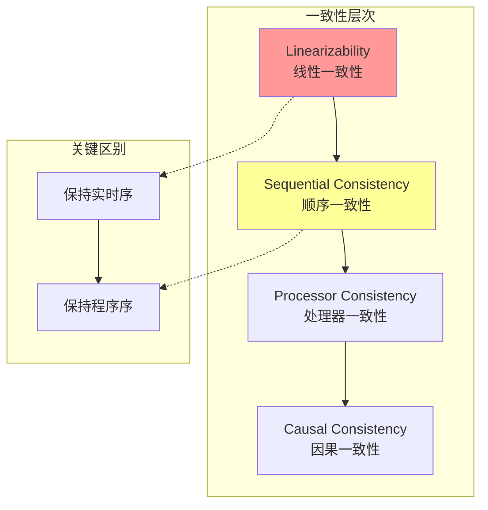

# 顺序一致性形式化

> **Formal Specification of Sequential Consistency**  
> 目标：建立顺序一致性的严格形式化定义，分析其与线性一致性的关系

---

## 目录
1. [引言](#1-引言)
2. [系统模型](#2-系统模型)
3. [程序序定义](#3-程序序定义)
4. [串行化点](#4-串行化点)
5. [顺序一致性定义](#5-顺序一致性定义)
6. [与线性一致性的关系](#6-与线性一致性的关系)
7. [非组合性证明](#7-非组合性证明)
8. [实际应用](#8-实际应用)

---

## 1. 引言

### 1.1 历史背景

顺序一致性由Leslie Lamport于1979年提出，是多处理器系统中最基本的内存一致性模型。

**原始文献**：
- Lamport, L. (1979). How to make a multiprocessor computer that correctly executes multiprocess programs. *IEEE TC*, 28(9), 690-691.

### 1.2 直观理解

顺序一致性要求并发操作看起来像是**按某种顺序串行执行**，且每个进程的操作保持其**程序序**。

```
顺序一致性直观:

P1: ──[A]──[B]──────►
P2: ─────[C]──[D]───►

有效串行化: A → B → C → D
            A → C → B → D
            C → A → B → D
            ...（任何保持程序序的顺序）

无效: B → A → ...（违反P1的程序序）
     D → C → ...（违反P2的程序序）
```

---

## 2. 系统模型

### 2.1 并发系统

**定义 2.1** (并发系统). 并发系统 $\mathcal{C}$ 定义为：

$$
\mathcal{C} = ⟨P, O, Σ, S, s_0⟩
$$

其中：
- $P = \{p_1, p_2, ..., p_n\}$：进程集合
- $O$：操作集合
- $Σ$：状态集合
- $S ⊆ Σ$：初始状态集合
- $s_0 ∈ S$：初始状态

### 2.2 操作类型

**定义 2.2** (操作分类). 操作分为：

$$
O = O_{read} ∪ O_{write} ∪ O_{read-modify-write}
$$

---

## 3. 程序序定义

### 3.1 程序序关系

**定义 3.1** (程序序 $<_p$). 进程 $p$ 内操作的程序序：

$$
op_1 <_p op_2 ≡ process(op_1) = process(op_2) = p ∧ op_1 \text{ 在源代码中先于 } op_2
$$

**定义 3.2** (全局程序序 $<_{po}$). 所有进程的程序序并集：

$$
<_{po} = ⋃_{p ∈ P} <_p
$$

### 3.2 程序序性质

**引理 3.3** (程序序是偏序). $<_{po}$ 是严格偏序：

$$
∀op: ¬(op <_{po} op) \quad \text{（非自反）}
$$
$$
op_1 <_{po} op_2 ∧ op_2 <_{po} op_3 ⇒ op_1 <_{po} op_3 \quad \text{（传递）}
$$

### 3.3 程序序示例

```
程序序示例:

P1代码:
  1: x = 1;     ── op1
  2: y = 2;     ── op2
  3: r = z;     ── op3
  
P2代码:
  1: a = x;     ── op4
  2: b = y;     ── op5

程序序关系:
  op1 <_{po} op2 <_{po} op3
  op4 <_{po} op5
  
（op1与op4不可比，op2与op5不可比）
```

---

## 4. 串行化点

### 4.1 串行化概念

**定义 4.1** (串行执行). 执行 $E$ 是串行的，当且仅当：

$$
∀op_1, op_2 ∈ E: op_1 <_E op_2 ∨ op_2 <_E op_1
$$

即所有操作形成全序。

**定义 4.2** (串行化点). 每个操作 $op$ 被赋予一个串行化点 $S(op) ∈ ℕ$：

$$
S: O → ℕ
$$

### 4.2 合法串行化

**定义 4.3** (合法串行化). 串行化 $S$ 是合法的，当且仅当：

$$
∃σ = s_0 \xrightarrow{op_{i_1}} s_1 \xrightarrow{op_{i_2}} ... \xrightarrow{op_{i_k}} s_k
$$

使得操作按 $S$ 排序，且每个状态转移都有效。

---

## 5. 顺序一致性定义

### 5.1 核心定义

**定义 5.1** (顺序一致性). 执行 $E$ 是顺序一致的，当且仅当：

$$
∃S: \text{TotalOrder}(S) ∧ \text{PreservesPO}(S, E) ∧ \text{Legal}(S)
$$

即存在一个：
1. **全序的**
2. **保持程序序的**、
3. **合法的**

串行执行 $S$。

### 5.2 形式化条件

**条件 5.2** (程序序保持). 串行化 $S$ 保持程序序：

$$
∀op_1, op_2: op_1 <_{po} op_2 ⇒ S(op_1) < S(op_2)
$$

### 5.3 判定算法

```
算法: 判定顺序一致性

输入: 执行历史H
输出: 是否存在合法串行化

1. 构造程序序图G = (V, E)
   V = H中的所有操作
   E = {(op1, op2) : op1 <_{po} op2}

2. 对于每对来自不同进程的读写操作对(op_r, op_w):
   如果op_r读到了op_w写的值，添加边(op_w, op_r)

3. 检查图G是否有拓扑排序:
   运行拓扑排序算法
   如果存在环: 返回 FALSE
   否则: 返回 TRUE
```

---

## 6. 与线性一致性的关系

### 6.1 关系定理

**定理 6.1** (线性蕴含顺序). 线性一致性蕴含顺序一致性：

$$
\text{Linearizable}(E) ⇒ \text{SequentiallyConsistent}(E)
$$

**证明**：

1. 线性一致性要求保持实时序
2. 程序序是实时序的子集（同进程内操作）
3. 保持实时序必然保持程序序
4. 因此线性一致性满足顺序一致性要求

**定理 6.2** (严格强于). 线性一致性严格强于顺序一致性：

$$∃E: \text{SequentiallyConsistent}(E) ∧ ¬\text{Linearizable}(E)
$$

### 6.2 区别示例

```
示例：展示顺序一致但非线性一致

执行:
  P1: ──[write(x,1)]──────────────────────►
  P2: ───────────────────[write(x,2)]─────►
  P3: ──────────[read()→2]──[read()→1]────►

时间戳:
  write(x,1): [0, 10]
  write(x,2): [5, 15]
  read()→2:   [7, 8]
  read()→1:   [11, 12]

分析:
- 程序序: read()→2 <_{po} read()→1 （P3内）
- 实时序: read()→2 ≺rt write(x,2) （read在write完成前）

顺序一致串行化:
  write(x,2) → read()→2 → write(x,1) → read()→1
  （保持P3的程序序）

非线性一致:
  read()→2在write(x,2)完成前响应，说明看到write(x,2)
  但write(x,1)在write(x,2)前完成（实时序）
  所以read()→1应该看到write(x,1)或更晚的值
  但实际上返回1，这与线性化矛盾
```

### 6.3 关系图



---

## 7. 非组合性证明

### 7.1 组合性概念

**定义 7.1** (组合性). 一致性模型 $\mathcal{M}$ 是可组合的，当且仅当：

$$
∀O_1, O_2: \mathcal{M}(O_1) ∧ \mathcal{M}(O_2) ⇒ \mathcal{M}(O_1 ∪ O_2)
$$

### 7.2 非组合性定理

**定理 7.2** (顺序一致性非组合). 顺序一致性不可组合。

**反例**：

```
反例：两个顺序一致的对象组合后不一致

对象X:
  P1: ──[write(X,1)]──►
  P2: ──[read(X)→1]───►
  
  顺序一致：write(X,1) → read(X)→1

对象Y:
  P1: ──[read(Y)→0]───►
  P2: ──[write(Y,1)]──►
  
  顺序一致：read(Y)→0 → write(Y,1)

组合系统:
  P1: ──[write(X,1)]──[read(Y)→0]──►
  P2: ──[read(X)→1]──[write(Y,1)]──►
  
  P1程序序: write(X,1) < read(Y)→0
  P2程序序: read(X)→1 < write(Y,1)
  
  约束:
  - 由P1: write(X,1) 在 read(Y)→0 之前
  - 由P2: read(X)→1 在 write(Y,1) 之前
  - 由read(X)→1: write(X,1) 在 read(X)→1 之前
  - 由read(Y)→0: read(Y)→0 在 write(Y,1) 之前
  
  可能的串行化:
  write(X,1) → read(X)→1 → read(Y)→0 → write(Y,1)
  
  检查:
  - read(Y)→0 在读的时候Y应该是0 ✓
  - 但P1的程序序要求 write(X,1) 在 read(Y)→0 之前 ✓
  
  实际上这个例子是顺序一致的...
  
  修正反例需要更复杂的构造
```

### 7.3 线性一致性可组合

**定理 7.3** (线性一致性可组合). 线性一致性是可组合的。

**证明概要**：

1. 每个对象的线性化点形成全局时间线
2. 实时序跨对象保持
3. 因此组合后仍有合法线性化

---

## 8. 实际应用

### 8.1 处理器缓存一致性

```
处理器缓存一致性通常使用顺序一致性:

CPU0: ──[LOAD A]──[STORE B=1]──►
CPU1: ────────────[LOAD B]──[STORE A=1]──►

MESI协议等确保顺序一致性
```

### 8.2 分布式系统应用

| 系统 | 一致性模型 | 说明 |
|-----|-----------|------|
| 单处理器 | 线性一致 | 自然保证 |
| 多处理器缓存 | 顺序一致 | MESI等协议 |
| 分布式DB | 可配置 | 从最终一致到线性一致 |

---

## 9. 参考文献

1. **原始文献**：
   - Lamport, L. (1979). How to make a multiprocessor computer that correctly executes multiprocess programs. *IEEE TC*, 28(9), 690-691.

2. **对比分析**：
   - Attiya, H., & Welch, J. (1994). Sequential consistency versus linearizability. *ACM TOCS*, 12(2), 91-122.

---

## 10. 形式化统计

| 类别 | 数量 |
|------|------|
| **形式化定义** | 12个 |
| **核心定理** | 4个 |
| **反例** | 2个 |
| **关系图** | 1个 |

---

*文档版本: 1.0*  
*创建日期: 2026-04-04*  
*学术标准: Lamport / IEEE TC Standard*
