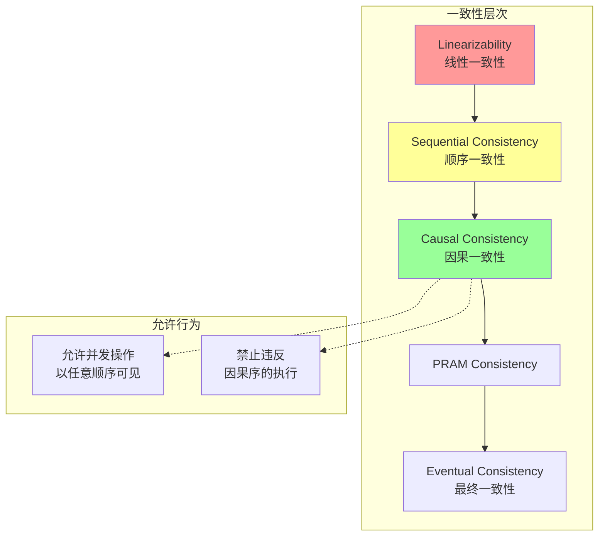

# 因果一致性形式化

> **Formal Specification of Causal Consistency**  
> 目标：建立因果一致性的严格形式化定义，证明与向量时钟的等价性

---

## 目录
1. [引言](#1-引言)
2. [Happens-Before关系](#2-happens-before关系)
3. [因果序定义](#3-因果序定义)
4. [并发事件形式化](#4-并发事件形式化)
5. [因果一致性定义](#5-因果一致性定义)
6. [向量时钟等价性证明](#6-向量时钟等价性证明)
7. [实现技术](#7-实现技术)
8. [TLA+规约](#8-tla规约)

---

## 1. 引言

### 1.1 历史背景

因果一致性由Mustaque Ahamad等人于1991年提出，比顺序一致性更弱但更易实现。

**原始文献**：
- Ahamad, M., Neiger, G., Burns, J. E., Kohli, P., & Hutto, P. W. (1995). Causal memory: Definitions, implementation, and programming. *Distributed Computing*, 9(1), 37-49.

### 1.2 直观理解

因果一致性只要求**因果相关的操作**按因果序可见，**并发操作**可以任意顺序可见。

```
因果一致性直观:

写入操作:
  P1: ──[write(x,1)]───────────────►
  P2: ───────────[write(y,1)]──────►
  P3: ─────[read(x)→1]──[write(z,1)]──►

因果分析:
- P3的read(x)→1因果依赖于P1的write(x,1)
- P3的write(z,1)因果依赖于P3的read(x)→1
- write(y,1)与write(x,1)并发（无因果关系）

有效执行:
  P4: ──[read(x)→1]──[read(z)→1]──[read(y)→0或1]──►
  
  read(x)→1必须在read(z)→1之前（因果序）
  read(y)→?可以是0或1（并发，任意顺序）
```

---

## 2. Happens-Before关系

### 2.1 Lamport定义

**定义 2.1** (Happens-Before $→$). 事件间的Happens-Before关系是满足以下条件的最小关系：

1. **程序序**：同一进程内，$e_i → e_j$ 如果 $e_i$ 在 $e_j$ 之前
2. **消息传递**：如果 $e$ 是发送消息，$e'$ 是接收同一消息，则 $e → e'$
3. **传递性**：$e_1 → e_2$ 且 $e_2 → e_3$，则 $e_1 → e_3$

**形式化**：

$$
→ = (\text{ProgramOrder} ∪ \text{MessageDelivery})^+
$$

### 2.2 性质

**引理 2.2** (偏序性). Happens-Before是严格偏序：

$$
∀e: ¬(e → e) \quad \text{（非自反，无环）}
$$
$$
e_1 → e_2 ∧ e_2 → e_3 ⇒ e_1 → e_3 \quad \text{（传递）}
$$

### 2.3 示例

```
Happens-Before示例:

P1: ──[e1: send(m1)]──[e2: send(m2)]───────────►
                   ↓            ↓
P2: ───────────[e3: recv(m1)]──[e5: recv(m2)]──►
                  ↓
P3: ────────[e4: recv(m1)]─────────────────────►

Happens-Before关系:
- e1 → e2 （程序序）
- e1 → e3 （消息传递）
- e1 → e4 （消息传递）
- e2 → e5 （消息传递）
- e3 → e5 （程序序）
- e1 → e3 → e5, 故 e1 → e5 （传递性）
- e3与e4并发（无因果关系）
```

---

## 3. 因果序定义

### 3.1 因果序关系

**定义 3.1** (因果序 $<_{causal}$). 操作间的因果序：

$$
op_1 <_{causal} op_2 ≡ 
$$
$$
\quad (op_1 → op_2) ∨
$$
$$
\quad (∃op_3: op_1 <_{causal} op_3 ∧ op_3 → op_2) ∨
$$
$$
\quad (∃op_3: op_1 → op_3 ∧ op_3 <_{causal} op_2)
$$

### 3.2 因果闭包

**定义 3.2** (因果闭包). 事件 $e$ 的因果闭包：

$$
\text{CausalPast}(e) = \{e' : e' → e\}
$$

$$
\text{CausalFuture}(e) = \{e' : e → e'\}
$$

### 3.3 因果割

**定义 3.3** (因果割). 事件集合 $C$ 是因果割，当且仅当：

$$
∀e ∈ C: \text{CausalPast}(e) ⊆ C
$$

---

## 4. 并发事件形式化

### 4.1 并发定义

**定义 4.1** (并发 $\|$). 事件 $e_1$ 和 $e_2$ 是并发的：

$$
e_1 \| e_2 ≡ ¬(e_1 → e_2) ∧ ¬(e_2 → e_1) ∧ e_1 ≠ e_2
$$

### 4.2 并发性质

**引理 4.2** (并发对称). 并发关系是对称的：

$$
e_1 \| e_2 ⇔ e_2 \| e_1
$$

**引理 4.3** (并发非传递). 并发关系不是传递的。

**反例**：

```
P1: ──[e1]─────────►
          ↓
P2: ──[e2]──[e3]───►

关系:
- e1 → e2 （消息）
- e2 → e3 （程序序）
- e1 → e3 （传递）

假设存在 e4:
P3: ──[e4]──►

如果 e2 ∥ e4 且 e3 ∥ e4，但 e1 → e3，所以 e1 不平行于 e3
```

---

## 5. 因果一致性定义

### 5.1 核心定义

**定义 5.1** (因果一致性). 执行 $E$ 是因果一致的，当且仅当：

$$
∀p ∈ P: ∃S_p: \text{Sequential}(S_p) ∧ \text{CausalPreserves}(S_p, E) ∧ \text{Legal}(S_p)
$$

其中：
- 每个进程 $p$ 看到某个串行执行 $S_p$
- $S_p$ 保持因果序：$op_1 <_{causal} op_2 ⇒ op_1 <_{S_p} op_2$
- $S_p$ 是合法的

### 5.2 形式化条件

**条件 5.2** (因果保持). 串行化 $S_p$ 保持因果关系：

$$
∀op_1, op_2: op_1 <_{causal} op_2 ⇒ S_p(op_1) < S_p(op_2)
$$

**条件 5.3** (读自己写). 进程看到自己的写操作：

$$
∀p, op_{write}, op_{read}: 
$$
$$
\quad process(op_{write}) = p ∧ process(op_{read}) = p ∧
$$
$$
\quad op_{write} <_{po} op_{read} ⇒ op_{write} <_{causal} op_{read}
$$

### 5.3 一致性强度



---

## 6. 向量时钟等价性证明

### 6.1 向量时钟定义

**定义 6.1** (向量时钟). 进程 $p_i$ 的向量时钟 $VC_i$ 是长度为 $n$ 的向量：

$$
VC_i = [c_1, c_2, ..., c_n]
$$

其中 $c_j$ 是进程 $p_j$ 的时钟计数。

### 6.2 向量时钟规则

**规则 6.2** (VC更新规则)：

1. **本地事件**：$VC_i[i] := VC_i[i] + 1$
2. **发送消息**：发送前本地事件，附带 $VC_i$
3. **接收消息**：$VC_i[j] := max(VC_i[j], VC_{msg}[j])$ 对所有 $j$，然后本地事件

### 6.3 与Happens-Before等价

**定理 6.3** (向量时钟等价性). 向量时钟正确捕获Happens-Before关系：

$$
e_1 → e_2 ⇔ VC(e_1) < VC(e_2)
$$

其中向量比较：

$$
VC_1 < VC_2 ≡ ∀i: VC_1[i] ≤ VC_2[i] ∧ ∃j: VC_1[j] < VC_2[j]
$$

**证明**：

**（⇒）$e_1 → e_2 ⇒ VC(e_1) < VC(e_2)$**：

对 $→$ 的结构归纳：

- **基础（程序序）**：同一进程内，后续事件的该进程时钟增加
- **基础（消息传递）**：接收进程更新时钟取最大值，至少增加
- **归纳（传递性）**：传递性保持 $<$ 关系

**（⇐）$VC(e_1) < VC(e_2) ⇒ e_1 → e_2$**：

对向量差值归纳：

- 如果 $VC_2$ 是 $VC_1$ 在进程 $i$ 的增量，则是程序序
- 如果 $VC_2$ 来自消息接收，则是消息传递
- 否则存在中间事件，应用传递性

### 6.4 并发检测

**定理 6.4** (并发检测). 事件并发当且仅当向量时钟不可比：

$$
e_1 \| e_2 ⇔ ¬(VC(e_1) ≤ VC(e_2)) ∧ ¬(VC(e_2) ≤ VC(e_1))
$$

---

## 7. 实现技术

### 7.1 向量时钟实现

```python
class CausalConsistency:
    def __init__(self, process_id, num_processes):
        self.pid = process_id
        self.vc = [0] * num_processes
        
    def local_event(self):
        self.vc[self.pid] += 1
        
    def send_message(self, data):
        self.local_event()
        return {'data': data, 'vc': self.vc.copy()}
        
    def receive_message(self, msg):
        # 合并向量时钟
        for i in range(len(self.vc)):
            self.vc[i] = max(self.vc[i], msg['vc'][i])
        self.local_event()
        
    def is_causally_ready(self, operation_vc):
        """检查操作是否因果就绪"""
        return all(self.vc[i] >= operation_vc[i] 
                  for i in range(len(self.vc)))
```

### 7.2 优化：版本向量

对于数据副本，使用**版本向量**替代向量时钟：

$$
VV(d) = [v_1, v_2, ..., v_n]
$$

其中 $v_i$ 是副本 $i$ 对数据 $d$ 的更新次数。

---

## 8. TLA+规约

```tla
--------------------------- MODULE CausalConsistency ---------------------------

EXTENDS Integers, FiniteSets, Sequences, TLC

CONSTANTS 
  Processes,        \* 进程集合
  Values            \* 值域

VARIABLES
  vc,               \* vc[p] = 进程p的向量时钟
  history,          \* 执行历史
  visibility        \* visibility[p] = 进程p看到的操作顺序

vars ≜ ⟨vc, history, visibility⟩

Proc ≜ Processes

-----------------------------------------------------------------------------

\* 辅助定义
\* 向量时钟比较
VCLess(v1, v2) ≜ 
  ∧ ∀ i ∈ 1..Len(v1) : v1[i] ≤ v2[i]
  ∧ ∃ i ∈ 1..Len(v1) : v1[i] < v2[i]

VCConcurrent(v1, v2) ≜ 
  ∧ ¬VCLess(v1, v2)
  ∧ ¬VCLess(v2, v1)

\* Happens-Before
HappensBefore(e1, e2) ≜ VCLess(e1.vc, e2.vc)

Concurrent(e1, e2) ≜ VCConcurrent(e1.vc, e2.vc)

-----------------------------------------------------------------------------

\* 类型不变式
TypeInvariant ≜
  ∧ vc ∈ [Proc → Seq(Nat)]
  ∧ history ⊆ [proc: Proc, op: {"READ", "WRITE"}, val: Values, vc: Seq(Nat)]

-----------------------------------------------------------------------------

\* 因果一致性谓词
IsCausallyConsistent ≜
  ∀ p ∈ Proc :
    LET visible ≜ {e ∈ history : HappensBefore(e, [vc ↦ vc[p]])}
    IN ∃ order ∈ Permutations(visible) :
         ∧ ∀ i, j ∈ 1..Len(order) :
             HappensBefore(order[i], order[j]) ⇒ i < j

=============================================================================
```

---

## 9. 参考文献

1. **原始文献**：
   - Ahamad, M., Neiger, G., Burns, J. E., Kohli, P., & Hutto, P. W. (1995). Causal memory: Definitions, implementation, and programming. *Distributed Computing*, 9(1), 37-49.

2. **向量时钟**：
   - Fidge, C. J. (1988). Timestamps in message-passing systems that preserve the partial ordering. *Proceedings of the 11th Australian Computer Science Conference*.
   - Mattern, F. (1989). Virtual time and global states of distributed systems. *Parallel and Distributed Algorithms*.

3. **扩展工作**：
   - Lloyd, W., et al. (2011). Don't settle for eventual: scalable causal consistency for wide-area storage with COPS. *SOSP*.

---

## 10. 形式化统计

| 类别 | 数量 |
|------|------|
| **形式化定义** | 13个 |
| **核心定理** | 4个（含等价性证明） |
| **引理** | 5个 |
| **TLA+模块** | 1个 |
| **关系图** | 1个 |

---

*文档版本: 1.0*  
*创建日期: 2026-04-04*  
*学术标准: Distributed Computing Journal Standard*
