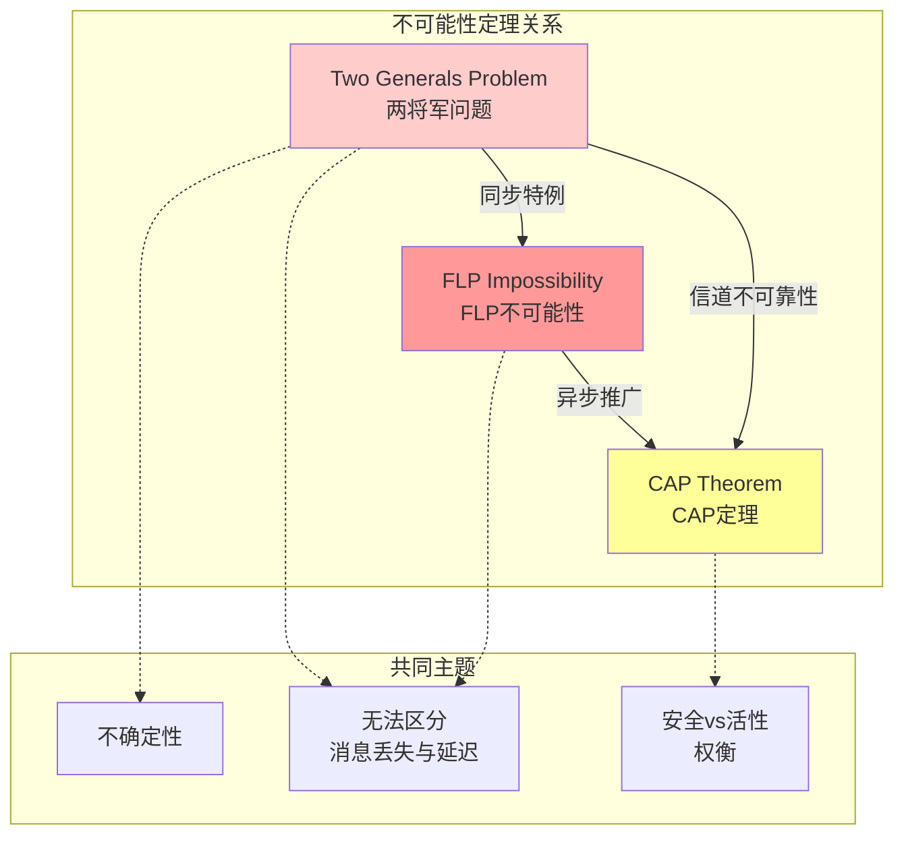

# 两将军问题不可能性证明

> **Formal Proof of the Two Generals Problem Impossibility**  
> 目标：建立两将军问题的严格形式化证明，分析与FLP不可能性的深层关系

---

## 目录
1. [问题描述](#1-问题描述)
2. [系统模型](#2-系统模型)
3. [形式化定义](#3-形式化定义)
4. [不可能性定理](#4-不可能性定理)
5. [归纳法证明](#5-归纳法证明)
6. [与FLP的关系](#6-与flp的关系)
7. [实际意义](#7-实际意义)
8. [近似解决方案](#8-近似解决方案)

---

## 1. 问题描述

### 1.1 问题陈述

**两将军问题**（Two Generals Problem）由E. A. Akkoyunlu等人在1975年首次形式化描述：

> 两支军队分别驻扎在两个山头，需要协调同时进攻。它们只能通过信使通信，但信使可能被敌军截获。是否存在一个协议确保两支军队达成共识？

**原始文献**：
- Akkoyunlu, E. A., Ekanadham, K., & Huber, R. V. (1975). Some constraints and tradeoffs in the design of network communications. *ACM SOSP*.

### 1.2 问题直观

```
场景:

    山A                    山谷                   山B
  ┌─────┐                ════════              ┌─────┐
  │ 将军1│ ←───信使───→ │ 敌军区域 │ ←───信使───→ │ 将军2│
  └─────┘   (可能丢失)   ════════               └─────┘
  
目标: 确保两将军同时决定"进攻"或"撤退"
约束: 
  - 消息可能丢失
  - 无超时机制（无法区分慢消息和丢失）
```

---

## 2. 系统模型

### 2.1 网络模型

**定义 2.1** (不可靠信道). 不可靠信道 $C$ 定义为：

$$
C = ⟨M, \text{send}, \text{recv}, \text{loss}⟩
$$

其中：
- $M$：消息集合
- $\text{send}: P × P × M$：发送关系
- $\text{recv} ⊆ \text{send}$：成功接收的消息子集
- $\text{loss} = \text{send} \\ \text{recv}$：丢失的消息

**定义 2.2** (消息丢失). 消息 $m$ 在传输中丢失：

$$
\text{lost}(m) ≡ m ∈ \text{send} ∧ m ∉ \text{recv}
$$

**定义 2.3** (信道不确定性). 信道是不确定的：

$$
∀m: ◇\text{recv}(m) ∨ □¬\text{recv}(m)
$$

### 2.2 将军模型

**定义 2.4** (将军状态). 将军 $g$ 的状态：

$$
s_g = ⟨val_g, sent_g, recvd_g, decided_g⟩
$$

其中：
- $val_g ∈ \{ATTACK, RETREAT, UNDECIDED\}$：当前决定
- $sent_g ⊆ M$：已发送消息
- $recvd_g ⊆ M$：已接收消息
- $decided_g ∈ \{true, false\}$：是否已决定

### 2.3 共识要求

**定义 2.5** (共识). 两将军达成共识：

$$
\text{Agreement} ≡ val_{g_1} = val_{g_2} ≠ UNDECIDED
$$

**定义 2.6** (有效性). 如果初始都倾向于进攻，则必须进攻：

$$
\text{Validity} ≡ (init_{g_1} = init_{g_2} = ATTACK) ⇒ (val_{g_1} = val_{g_2} = ATTACK)
$$

**定义 2.7** (终止性). 两将军最终都决定：

$$
\text{Termination} ≡ ◇(decided_{g_1} ∧ decided_{g_2})
$$

---

## 3. 形式化定义

### 3.1 协议定义

**定义 3.1** (协议). 协议 $\Pi$ 是状态机：

$$
\Pi = ⟨S, S_0, \text{sendMsg}, \text{onReceive}, \text{decide}⟩
$$

**定义 3.2** (确定性协议). 协议是确定性的：

$$
∀s ∈ S: |\text{sendMsg}(s)| = 1 ∧ |\text{decide}(s)| ≤ 1
$$

### 3.2 执行

**定义 3.3** (执行). 执行 $E$ 是事件的序列：

$$
E = s_0 \xrightarrow{a_1} s_1 \xrightarrow{a_2} s_2 \xrightarrow{a_3} ⋯
$$

其中 $a_i ∈ \{\text{send}(m), \text{recv}(m), \text{decide}(v)\}$。

### 3.3 知识算子

**定义 3.4** (知识). 将军 $g$ 知道命题 $\phi$：

$$
K_g(\phi) ≡ \phi \text{ 在所有与 } g \text{ 不可区分的状态中为真}
$$

**定理 3.5** (共同知识不可能). 在不可靠信道上，两将军无法达成共同知识：

$$
¬◇K_{g_1}(K_{g_2}(val_{g_1} = ATTACK))
$$

---

## 4. 不可能性定理

### 4.1 定理陈述

**定理 4.1** (两将军不可能性). 在不可靠消息信道上，不存在协议使得两将军达成共识。

**形式化**：

$$
⊢ ¬∃\Pi: □(\text{Agreement}(\Pi) ∧ \text{Validity}(\Pi) ∧ \text{Termination}(\Pi))
$$

### 4.2 证明策略

使用**归纳法**证明：对于任何协议，存在消息丢失场景使得共识失败。

---

## 5. 归纳法证明

### 5.1 基础情况

**引理 5.1** (无消息情况). 如果不发送任何消息，两将军无法达成共识。

**证明**：两将军没有信息交流，只能基于本地状态决定。如果初始状态不同（一个要进攻，一个要撤退），则无法达成一致。

### 5.2 归纳假设

**假设 5.2** (归纳假设). 假设对于发送 $k$ 条消息的协议，两将军无法达成共识。

### 5.3 归纳步骤

**引理 5.3** (归纳步骤). 如果发送 $k$ 条消息无法达成共识，则发送 $k+1$ 条消息也无法达成共识。

**证明**：

```
证明结构（归纳法）:

基础: k = 0（无消息）
- 两将军无法达成共识（显而易见）

归纳假设: 
- 假设任何需要k条消息的协议都无法保证共识

归纳步骤: 考虑需要k+1条消息的协议

1. 设协议Π在达成共识前发送k+1条消息

2. 考虑最后一条消息m（从g1到g2）:
   
   情况A: m丢失
   - g1发送m后决定（否则不会发送最后一条）
   - g2没有收到m
   - g2只能基于前k条消息决定
   - 由归纳假设，基于k条消息无法保证共识
   - 因此共识失败
   
   情况B: m送达
   - g2收到m后决定
   - 但g1不知道m是否送达
   - 如果g1假设m送达并决定，但m实际丢失 → 情况A
   - 如果g1等待确认，则需要k+2条消息

3. 无论哪种情况，都无法保证共识

结论: 对于任何有限k，无法达成共识              ∎
```

### 5.4 详细证明

```
定理 4.1 详细证明:

使用反证法：假设存在协议Π使得两将军达成共识

设Π需要的最小消息数为N

1. 考虑最后一条消息m_N从g1发送到g2

2. g1发送m_N后立即决定v1
   （因为如果等待确认，则需要N+1条消息）

3. g2收到m_N后决定v2

4. 现在考虑消息m_N丢失的情况:
   
   a) g1: 已发送m_N，认为已送达，决定v1
   b) g2: 未收到m_N，只能基于前N-1条消息决定
   
5. 如果g2可以安全决定，则它不需要m_N
   - 这与"N是最小值"矛盾
   
6. 如果g2不能安全决定，则协议无法终止
   - 这与终止性要求矛盾

7. 无论哪种情况，协议都无法满足所有要求

因此，不存在这样的协议                      ∎
```

---

## 6. 与FLP的关系

### 6.1 关系分析



### 6.2 关系定理

**定理 6.1** (两将军蕴含FLP). 两将军不可能性是FLP的一个特例。

**证明概要**：

1. 两将军问题中，一个将军故障等价于所有消息丢失
2. FLP考虑一个进程故障（停止）
3. 在异步系统中，停止的进程等同于消息丢失
4. 因此FLP是两将军问题的推广

### 6.3 对比表

| 特性 | 两将军问题 | FLP不可能性 |
|-----|-----------|------------|
| **故障模型** | 消息丢失 | 进程停止 |
| **节点数** | 2 | ≥ 2 |
| **同步假设** | 异步 | 异步 |
| **核心问题** | 信道不可靠 | 不确定性 |
| **破解方式** | 概率保证 | 随机化、同步 |

---

## 7. 实际意义

### 7.1 TCP三次握手

TCP使用三次握手建立连接，但这是**概率性**保证：

```
TCP三次握手:

Client        Server
  │ ──SYN──>  │
  │ <─SYN/ACK─│
  │ ──ACK──>  │
  
问题: 最后一个ACK可能丢失
解决: 使用超时和重传（概率保证）
```

### 7.2 分布式事务

两阶段提交(2PC)同样面临两将军问题：

```
协调者       参与者
  │ ──Prepare──> │
  │ <──Yes/No─── │
  │ ──Commit───> │
  
问题: Commit消息可能丢失
解决: 协调者持久化决策，参与者超时询问
```

---

## 8. 近似解决方案

### 8.1 概率保证

**方案 8.1** (概率共识). 发送 $n$ 条确认消息，失败概率指数降低：

$$
P(\text{failure}) = p^n
$$

其中 $p$ 是单条消息丢失概率。

### 8.2 超时机制

**方案 8.2** (超时与重传). 设置超时时间 $T$：

```
算法: 带超时的两将军协议

g1:
  send(m1)
  start_timer(T)
  wait for ack or timeout
  if timeout:
    retry (up to N times)
  else:
    decide

g2:
  on receive(m1):
    send(ack)
    decide
```

### 8.3 三将军方案

**方案 8.3** (引入第三方). 使用可信第三方协助共识：

```
    g1 ←──────→ TTP ←──────→ g2
         
TTP持久化决策，g1/g2可以查询
```

---

## 9. 参考文献

1. **原始文献**：
   - Akkoyunlu, E. A., Ekanadham, K., & Huber, R. V. (1975). Some constraints and tradeoffs in the design of network communications. *ACM SOSP*.

2. **形式化分析**：
   - Fischer, M. J., Lynch, N. A., & Paterson, M. S. (1985). Impossibility of distributed consensus with one faulty process. *JACM*, 32(2), 374-382.

3. **知识论分析**：
   - Halpern, J. Y., & Moses, Y. (1990). Knowledge and common knowledge in a distributed environment. *JACM*, 37(3), 549-587.

---

## 10. 形式化统计

| 类别 | 数量 |
|------|------|
| **形式化定义** | 11个 |
| **核心定理** | 2个（不可能性 + 关系定理） |
| **引理** | 3个（归纳法） |
| **关系图** | 1个 |
| **解决方案** | 3个近似方案 |

---

*文档版本: 1.0*  
*创建日期: 2026-04-04*  
*学术标准: Distributed Computing Theory Standard*
