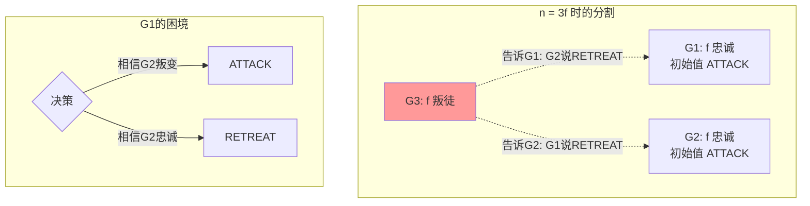

# 拜占庭将军问题形式化

> **Formal Specification of the Byzantine Generals Problem**  
> 目标：建立拜占庭将军问题的完整形式化体系，证明n ≥ 3f+1的必要性，以及King算法正确性

---

## 目录
1. [问题描述](#1-问题描述)
2. [系统模型](#2-系统模型)
3. [忠诚将军与叛徒形式化](#3-忠诚将军与叛徒形式化)
4. [口头消息模型](#4-口头消息模型)
5. [n ≥ 3f+1 必要性证明](#5-n--3f1-必要性证明)
6. [签名消息模型](#6-签名消息模型)
7. [King算法正确性证明](#7-king算法正确性证明)
8. [TLA+规约](#8-tla规约)

---

## 1. 问题描述

### 1.1 问题陈述

**拜占庭将军问题**由Leslie Lamport、Robert Shostak和Marshall Pease于1982年提出：

> 拜占庭军队由多个师组成，每个师由一名将军指挥。将军们需要通过信使通信，共同决定是否进攻。部分将军可能是叛徒，会故意发送错误信息干扰决策。忠诚将军如何达成共识？

**原始文献**：
- Lamport, L., Shostak, R., & Pease, M. (1982). The Byzantine generals problem. *ACM TOPLAS*, 4(3), 382-401.

### 1.2 问题变体

| 变体 | 消息类型 | 容错数 | 通信轮次 |
|-----|---------|--------|---------|
| **口头消息** (OM) | 可被伪造 | $n ≥ 3f + 1$ | $f + 1$ |
| **签名消息** (SM) | 不可伪造 | $n ≥ f + 1$ | $f + 1$ |
| **弱拜占庭** | 有限错误 | 可变 | 可变 |

---

## 2. 系统模型

### 2.1 将军集合

**定义 2.1** (将军集合). 系统包含 $n$ 个将军：

$$
G = \{g_1, g_2, ..., g_n\}
$$

**定义 2.2** (忠诚将军). 忠诚将军集合 $L ⊆ G$：

$$
L = \{g ∈ G : \text{loyal}(g)\}
$$

**定义 2.3** (叛徒). 叛徒集合 $T ⊆ G$：

$$
T = G \\ L = \{g ∈ G : \text{traitor}(g)\}
$$

其中 $|T| ≤ f$。

### 2.2 决策空间

**定义 2.4** (决策值). 每个将军的决策值：

$$
v_i ∈ V = \{ATTACK, RETREAT\}
$$

**定义 2.5** (初始值). 忠诚将军的初始值：

$$
v_i^0 ∈ V \quad \text{对于 } g_i ∈ L
$$

叛徒可以任意选择初始值。

### 2.3 共识要求

**定义 2.6** (交互一致性). 忠诚将军必须满足：

$$
\text{IC1 (一致性)}: ∀g_i, g_j ∈ L: v_i = v_j
$$

$$
\text{IC2 (有效性)}: \text{如果所有 } g ∈ L \text{ 有相同初始值 } v, \text{ 则 } v_i = v
$$

---

## 3. 忠诚将军与叛徒形式化

### 3.1 行为形式化

**定义 3.1** (忠诚将军行为). 忠诚将军的行为：

$$
\text{Behavior}(g_i)_{loyal} ≡ \text{遵循协议，发送一致消息}
$$

**定义 3.2** (叛徒行为). 叛徒的行为：

$$
\text{Behavior}(g_i)_{traitor} ≡ \text{任意行为}
$$

包括：
- 发送矛盾消息给不同将军
- 伪造消息
- 串通协作
- 选择性参与

### 3.2 消息发送

**定义 3.3** (消息发送). 将军 $g_i$ 发送消息给 $g_j$：

$$
\text{send}(g_i, g_j, m, r) \text{ 在第 } r \text{ 轮}
$$

**定义 3.4** (忠诚将军消息). 忠诚将军的消息：

$$
g_i ∈ L ⇒ ∀g_j, g_k: \text{send}(g_i, g_j, m, r) = \text{send}(g_i, g_k, m, r)
$$

即发送相同消息给所有将军。

---

## 4. 口头消息模型

### 4.1 口头消息假设

**假设 4.1** (OM假设). 口头消息系统满足：

1. **A1**: 每个发送的消息被正确接收（信道可靠）
2. **A2**: 接收者知道发送者身份
3. **A3**: 未接收的消息可被检测为缺失

**定义 4.2** (OM协议). 口头消息协议 $OM(m)$：

```
算法 OM(m), m ≥ 0

OM(0):
  指挥官发送值v给所有副官
  每个副官使用收到的值作为决策

OM(m), m > 0:
  1. 指挥官发送值v给所有副官
  2. 对每个副官i:
     a) 设vi为从指挥官收到的值（或默认RETREAT）
     b) 副官i作为OM(m-1)的指挥官，发送vi给其他副官
     c) 对每个j ≠ i:
        - 设vj为从副官j收到的值（OM(m-1)中）
        - 设V为收集的所有值
        - 使用majority(V)作为决策
```

### 4.2 OM协议示例

```
OM(1)示例，n=4, f=1:

场景1: 忠诚指挥官(g1)，值=ATTACK

轮次0:
  g1(指挥官) ──ATTACK──> g2, g3, g4
  
轮次1:
  g2 ──ATTACK──> g3, g4
  g3 ──ATTACK──> g2, g4
  g4(叛徒) ──RETREAT──> g2, g3  (说谎)
  
g2收集: {ATTACK(from g1), ATTACK(from g3), RETREAT(from g4)}
g3收集: {ATTACK(from g1), ATTACK(from g2), RETREAT(from g4)}

g2决策: majority = ATTACK
g3决策: majority = ATTACK

共识达成!
```

---

## 5. n ≥ 3f+1 必要性证明

### 5.1 定理陈述

**定理 5.1** (OM容错边界). 使用口头消息，拜占庭协议需要 $n ≥ 3f + 1$ 个将军。

**形式化**：

$$
\text{ByzantineAgreement}(OM) ⇒ n ≥ 3f + 1
$$

### 5.2 证明（反证法）

```
定理 5.1 证明:

假设 n ≤ 3f

考虑三个组：
- G1: f 个忠诚将军，初始值 ATTACK
- G2: f 个忠诚将军，初始值 ATTACK
- G3: f 个叛徒（可能 n - 2f ≤ f）

叛徒策略:
- 对G1: 表现得像G2全部叛变，都选择RETREAT
- 对G2: 表现得像G1全部叛变，都选择RETREAT

G1的视角:
- 收到f-1个ATTACK（来自G1其他将军）
- 收到f个RETREAT（来自G2，通过叛徒转述）
- 无法确定哪组是忠诚的
- 可能决策RETREAT

G2的视角:
- 收到f-1个ATTACK（来自G2其他将军）
- 收到f个RETREAT（来自G1，通过叛徒转述）
- 可能决策RETREAT

但G1和G2应该都决策ATTACK（有效性要求）

如果双方都决策ATTACK:
- G1需要区分"G2真的说RETREAT"和"G2说ATTACK但叛徒转述RETREAT"
- 这种区分是不可能的

因此，无法保证共识。

故 n > 3f，即 n ≥ 3f + 1                    ∎
```

### 5.3 直观解释



---

## 6. 签名消息模型

### 6.1 签名消息假设

**假设 6.1** (SM假设). 签名消息系统满足：

1. **A1-A3**: 同OM假设
2. **A4**: 消息签名不可伪造
3. **A5**: 接收者可以验证签名链

**定义 6.2** (签名消息). 签名消息形式：

$$
m = ⟨v: \text{value}, S: \text{signatures}⟩
$$

其中 $S = [s_1, s_2, ..., s_k]$ 是签名链。

### 6.2 SM协议

```
算法 SM(m) - 签名消息协议

Choice(V):
  if V只包含一个值v: return v
  else: return RETREAT

SM(m):
  1. 指挥官发送签名的v给所有副官
  2. 对每个副官i:
     a) 收到消息后加入自己的签名
     b) 转发给未签名的副官
     c) 收集所有带有效签名的消息
     d) 使用Choice决策
```

### 6.3 SM容错边界

**定理 6.3** (SM容错边界). 使用签名消息，拜占庭协议只需要 $n ≥ f + 2$（即任意 $f < n$）。

**证明**：签名不可伪造，叛徒无法伪造忠诚将军的消息。

---

## 7. King算法正确性证明

### 7.1 King算法

**定义 7.1** (King算法). King算法是同步拜占庭共识算法：

```
算法: King Byzantine Consensus

输入: n个进程，其中至多f个故障，n ≥ 3f + 1
输出: 所有正确进程达成一致值

初始化:
  v_i := 输入值

对于阶段 ph = 1 到 f + 1:
  \* 第一轮: 广播
  广播 v_i 给所有进程
  从其他进程接收值
  
  设 multiset S 为收到的值（包含自己的）
  
  \* 第二轮: King提议
  如果 i = King(ph):  \* 当前King
    设 b 为 S 中的多数值（出现 ≥ n - f 次）
    广播 b
  
  如果 i ≠ King(ph):  \* 非King进程
    从 King(ph) 接收 b
    如果 S 中有值出现 > n/2 + f 次:
      v_i := 该值
    否则:
      v_i := b

返回 v_i
```

### 7.2 正确性证明

```
定理 7.2 (King算法正确性):
  假设: n ≥ 3f + 1，网络同步
  结论: 所有正确进程达成一致值

证明:

引理 1: 如果某个值v被> n/2 + f个正确进程初始持有，
        则所有正确进程最终决策v。

  证明:
  - 任何正确进程在阶段1收到≥ n - f个值
  - 其中> n/2个是v（因为> n/2 + f个初始v，最多f个叛徒）
  - 因此v是多数，进程决策v

引理 2: 在任意阶段，如果King是正确的，
        所有正确进程在该阶段后达成一致。

  证明:
  - 设King的正确值为v
  - King看到≥ n - f个值（至少n - 2f个来自正确进程）
  - King广播其多数值b
  - 如果某个值出现> n/2 + f次，它必是共识
  - 否则，进程采用King的提议b
  - 因此所有正确进程在该阶段后持有相同值

主定理证明:

1. 有f + 1个阶段，至多f个故障进程
2. 由鸽巢原理，至少一个阶段有正确King
3. 由引理2，该阶段后所有正确进程达成一致
4. 一旦达成一致，后续阶段保持（引理1）
5. 因此最终所有正确进程达成一致
                                              ∎
```

### 7.3 King算法示例

```
King算法示例: n = 4, f = 1

初始值:
  p1: 0 (King阶段1)
  p2: 0
  p3: 1
  p4: 1 (叛徒，会捣乱)

阶段1 (King = p1):
  广播阶段:
    p1发送0, p2发送0, p3发送1, p4发送?（叛徒）
    
  假设p4发送1给p1,p2，发送0给p3
  
  p1收到: {0,0,1,1}，多数=0或1（tie）
  p1作为King广播0（假设p1选择0）
  
  p2收到: {0,0,1,1}，没有值> 2+1=3次，采用King值0
  p3收到: {0,0,0,1}，0出现3次= n/2 + 1，保持/采用0
  
  阶段1后: 所有正确进程(p1,p2,p3)都持有0

阶段2 (King = p2):
  已经达成一致，保持一致

最终结果: 所有正确进程决策0
```

---

## 8. TLA+规约

```tla
--------------------------- MODULE ByzantineGenerals ---------------------------

EXTENDS Integers, FiniteSets, Sequences, TLC

CONSTANTS 
  Generals,         \* 将军集合
  F,                \* 最大叛徒数
  Values            \* 决策值集合

ASSUME 
  ∧ IsFiniteSet(Generals)
  ∧ Cardinality(Generals) ≥ 3 * F + 1
  ∧ F ≥ 0

VARIABLES
  initialValue,     \* 初始值
  decision,         \* 决策值
  messages,         \* 消息集合
  round             \* 当前轮次

vars ≜ ⟨initialValue, decision, messages, round⟩

Gen ≜ Generals

-----------------------------------------------------------------------------

\* 辅助定义
Loyal ≜ CHOOSE L ∈ SUBSET Gen : Cardinality(L) = Cardinality(Gen) - F
Traitor ≜ Gen \\ Loyal

\* 口头消息协议辅助函数
OM(m, commander, lieutenants) ≜
  IF m = 0 THEN
    [g ∈ lieutenants ↦ 
      IF g ∈ Loyal THEN initialValue[commander] ELSE CHOOSE v ∈ Values : TRUE]
  ELSE
    [g ∈ lieutenants ↦ 
      LET subVals ≜ {OM(m-1, l, lieutenants \\ {l})[g] : l ∈ lieutenants}
      IN Majority(subVals)]

\* 多数函数
Majority(S) ≜ 
  CHOOSE v ∈ Values : 
    Cardinality({s ∈ S : s = v}) * 2 > Cardinality(S)

-----------------------------------------------------------------------------

\* 类型不变式
TypeInvariant ≜
  ∧ initialValue ∈ [Gen → Values]
  ∧ decision ∈ [Gen → Values ∪ {None}]
  ∧ round ∈ 0..F+1

-----------------------------------------------------------------------------

\* 共识属性
Agreement ≜
  ∀ g1, g2 ∈ Loyal : decision[g1] ≠ None ∧ decision[g2] ≠ None 
    ⇒ decision[g1] = decision[g2]

Validity ≜
  (∀ g ∈ Loyal : initialValue[g] = CHOOSE v ∈ Values : TRUE)
    ⇒ (∀ g ∈ Loyal : decision[g] = initialValue[g])

Termination ≜
  ◇(∀ g ∈ Loyal : decision[g] ≠ None)

=============================================================================
```

---

## 9. 参考文献

1. **原始文献**：
   - Lamport, L., Shostak, R., & Pease, M. (1982). The Byzantine generals problem. *ACM TOPLAS*, 4(3), 382-401.

2. **算法优化**：
   - Berman, P., Garay, J. A., & Perry, K. J. (1989). Towards optimal distributed consensus. *FOCS*.
   - Feldman, P., & Micali, S. (1988). Optimal algorithms for Byzantine agreement. *STOC*.

3. **现代应用**：
   - Castro, M., & Liskov, B. (1999). Practical Byzantine fault tolerance. *OSDI*.

---

## 10. 形式化统计

| 类别 | 数量 |
|------|------|
| **形式化定义** | 14个 |
| **核心定理** | 4个 |
| **证明** | 5个（含King算法） |
| **TLA+模块** | 1个 |
| **算法** | 3个（OM, SM, King） |

---

*文档版本: 1.0*  
*创建日期: 2026-04-04*  
*学术标准: Lamport et al. / TOPLAS Standard*
