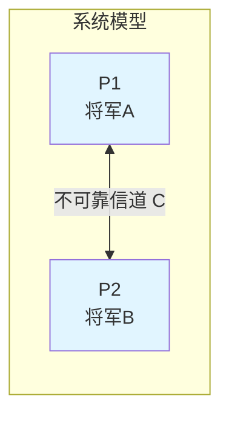
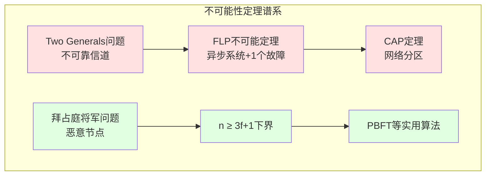

# Two Generals Problem（两将军问题）形式化分析

> **对齐标准**: Stanford CS244B Distributed Systems | MIT 6.824
>
> **相关文档**: [FLP不可能定理专题文档](../distributed-systems/FLP不可能定理专题文档.md) | [拜占庭将军问题完整形式化](./02-拜占庭将军问题完整形式化.md)

---

## 目录

- [Two Generals Problem（两将军问题）形式化分析](#two-generals-problem两将军问题形式化分析)
  - [目录](#目录)
  - [1. 问题描述形式化](#1-问题描述形式化)
    - [1.1 系统模型](#11-系统模型)
    - [1.2 形式化定义](#12-形式化定义)
      - [定义1（消息信道）](#定义1消息信道)
      - [定义2（进程状态）](#定义2进程状态)
      - [定义3（共识）](#定义3共识)
      - [定义4（安全共识）](#定义4安全共识)
  - [2. 不可能性证明](#2-不可能性证明)
    - [2.1 定理（Two Generals Impossibility）](#21-定理two-generals-impossibility)
    - [2.2 证明](#22-证明)
      - [引理1（消息不确定性）](#引理1消息不确定性)
      - [引理2（无限确认需求）](#引理2无限确认需求)
      - [定理证明](#定理证明)
  - [3. 概率解法分析](#3-概率解法分析)
    - [3.1 概率共识](#31-概率共识)
    - [3.2 形式化](#32-形式化)
  - [4. 与FLP不可能性的关系](#4-与flp不可能性的关系)
  - [5. 证明依赖关系图](#5-证明依赖关系图)
  - [6. 形式化定义汇总](#6-形式化定义汇总)
  - [7. 定理与引理汇总](#7-定理与引理汇总)
  - [8. 与其他文档的链接](#8-与其他文档的链接)

---

## 1. 问题描述形式化

### 1.1 系统模型



**系统组成**:

- **两个进程**: $P_1$（将军A）、$P_2$（将军B）
- **通信信道**: 不可靠、可能丢失消息
- **目标**: 达成共同决策（是否攻击）
- **决策域**: $\mathcal{D} = \{\text{Attack}, \text{Retreat}, \bot\}$，其中 $\bot$ 表示未决定

### 1.2 形式化定义

#### 定义1（消息信道）

信道 $\mathcal{C}$ 是从 $P_1$ 到 $P_2$ 的消息传递函数：

$$
\mathcal{C}: \mathcal{M} \times \mathcal{T} \rightarrow \{\text{deliver}, \text{loss}\}
$$

其中：

- $\mathcal{M}$ 是消息空间
- $\mathcal{T}$ 是时间集合
- $\text{deliver}$ 表示消息成功传递
- $\text{loss}$ 表示消息丢失

**信道不可靠性公理**:

$$
\forall m \in \mathcal{M}, \forall t \in \mathcal{T}: \exists t' > t: P(\mathcal{C}(m, t') = \text{loss}) > 0
$$

> **解释**: 对于任何消息，在任何时间之后都存在非零的丢失概率。

#### 定义2（进程状态）

每个进程 $P_i$ 的状态定义为三元组：

$$
S_i = (D_i, H_i, T_i)
$$

其中：

- $D_i \in \mathcal{D}$: 当前决策
- $H_i \subseteq \mathcal{M}$: 已接收消息历史
- $T_i \subseteq \mathcal{M}$: 已发送消息集合

#### 定义3（共识）

$P_1$ 和 $P_2$ 在时刻 $t$ **达成共识**当且仅当：

$$
\text{Consensus}(t) \iff D_1(t) = D_2(t) \neq \bot
$$

#### 定义4（安全共识）

**安全性（Safety）**:

$$
\forall t_1, t_2: D_1(t_1) \neq \bot \land D_2(t_2) \neq \bot \implies D_1(t_1) = D_2(t_2)
$$

> **解释**: 如果双方都有决策，则决策必须相同。

**活性（Liveness）**:

$$
\forall \epsilon > 0: \exists n \in \mathbb{N}: P(\text{共识在}n\text{轮内达成}) \geq 1 - \epsilon
$$

> **解释**: 在有限轮次内以任意高的概率达成共识。

---

## 2. 不可能性证明

### 2.1 定理（Two Generals Impossibility）

**定理**: 在不可靠消息信道上，不存在确定性算法可以保证两将军达成共识。

**形式化表述**:

$$
\neg \exists \mathcal{A}: \text{Deterministic}(\mathcal{A}) \land \text{GuaranteesConsensus}(\mathcal{A}, \mathcal{C}_{\text{unreliable}})
$$

其中：

- $\mathcal{A}$: 分布式算法
- $\mathcal{C}_{\text{unreliable}}$: 不可靠信道

### 2.2 证明

#### 引理1（消息不确定性）

**引理**: 对于任何有限消息序列 $S = (m_1, m_2, ..., m_n)$，存在执行轨迹使得 $S$ 中所有消息都丢失。

**证明**:

由信道不可靠性公理：

$$
\forall m_i \in S: P(\mathcal{C}(m_i, t_i) = \text{loss}) = p_i > 0
$$

由于各消息丢失事件独立：

$$
P(\text{所有消息丢失}) = \prod_{i=1}^{n} p_i > 0
$$

因此，存在非零概率使得所有消息丢失。$\square$

#### 引理2（无限确认需求）

**引理**: 对于任何确认协议，接收方必须确认确认，导致无限回归。

**证明**:

考虑任何试图达成共识的协议：

```
P1发送: "攻击" → P2
P2收到后必须确认: "收到攻击" → P1
P1收到确认后必须确认: "收到你的确认" → P2
P2必须确认P1的确认: "收到你的确认的确认" → P1
...无限继续
```

形式化：设 $\text{Ack}^{(k)}$ 为第 $k$ 层确认消息。对于任何协议，如果 $P_1$ 在收到 $\text{Ack}^{(k)}$ 后决定攻击，考虑 $\text{Ack}^{(k)}$ 丢失的情况：

- $P_2$ 不知道 $P_1$ 是否收到 $\text{Ack}^{(k-1)}$
- $P_1$ 不知道 $P_2$ 是否知道 $P_1$ 的决定
- 双方无法确定对方的状态

因此，任何有限协议都无法保证共识。$\square$

#### 定理证明

**证明策略**: 反证法

**步骤1**: 假设存在有限消息协议 $\mathcal{A}$ 达成共识。

**步骤2**: 设协议最多使用 $k$ 条消息 $m_1, m_2, ..., m_k$。

**步骤3**: 考虑最后一个消息 $m_k$。

**情况分析**:

- **情况A**: $m_k$ 由 $P_1$ 发送给 $P_2$
  - 如果 $m_k$ 丢失，$P_2$ 无法确认 $P_1$ 是否收到之前的确认
  - $P_1$ 无法确定 $P_2$ 是否准备好攻击

- **情况B**: $m_k$ 由 $P_2$ 发送给 $P_1$
  - 如果 $m_k$ 丢失，$P_1$ 无法确认 $P_2$ 的决策
  - $P_2$ 不知道 $P_1$ 是否知道自己的决策

**步骤4**: 在两种情况下，消息 $m_k$ 的丢失都导致无法达成共识。

**步骤5**: 由引理1，$m_k$ 丢失的概率非零。

**步骤6**: 因此，协议无法保证确定性共识。

**步骤7**: 与假设矛盾！

**结论**:

$$
\neg \exists \mathcal{A}: \text{Deterministic}(\mathcal{A}) \land \text{GuaranteesConsensus}(\mathcal{A}, \mathcal{C}_{\text{unreliable}}) \quad \square
$$

---

## 3. 概率解法分析

### 3.1 概率共识

虽然确定性共识不可能，但可以实现概率共识：

**策略**: 发送 $n$ 个消息副本

```
P1发送n次: "攻击"
P2收到任意一条后回复n次: "确认"
P1收到任意确认后决定攻击
```

### 3.2 形式化

**定理（概率共识）**:

设每条消息的成功传递概率为 $p > 0$，发送 $n$ 条独立消息：

$$
P(\text{至少一条到达}) = 1 - (1 - p)^n
$$

**失败概率**:

$$
P(\text{共识失败}) = (1 - p)^{2n}
$$

（需要正向和反向都至少一条消息到达）

**渐近行为**:

$$
\lim_{n \to \infty} P(\text{共识失败}) = 0
$$

但 $\forall n < \infty: P(\text{共识失败}) > 0$

```mermaid
graph TD
    A[发送n条消息] -->|每条到达概率p| B{至少一条到达?}
    B -->|概率: 1-(1-p)^n| C[收到消息]
    B -->|概率: (1-p)^n| D[消息全部丢失]
    C --> E[回复n条确认]
    E -->|每条到达概率p| F{至少一条确认到达?}
    F -->|概率: 1-(1-p)^n| G[达成共识]
    F -->|概率: (1-p)^n| H[确认全部丢失]

    style D fill:#ffcccc
    style H fill:#ffcccc
    style G fill:#ccffcc
```

---

## 4. 与FLP不可能性的关系



**关系说明**:

| 特性 | Two Generals | FLP不可能定理 |
|------|-------------|--------------|
| **系统模型** | 两个节点 | 多节点异步系统 |
| **故障类型** | 消息丢失 | 进程崩溃 |
| **核心问题** | 信道不可靠 | 消息延迟无界 |
| **结果** | 确定性共识不可能 | 确定性共识不可能 |
| **绕过方法** | 概率协议 | 故障检测器、随机化 |

**理论蕴含**:

$$
\text{Two Generals} \subseteq \text{FLP}
$$

> Two Generals是FLP在n=2场景下的特例：消息可能无限延迟等价于消息可能丢失。

---

## 5. 证明依赖关系图

```mermaid
graph TB
    subgraph "Two Generals证明依赖树"
        A[Two Generals不可能性定理] --> B[引理1: 消息不确定性]
        A --> C[引理2: 无限确认需求]

        B --> D[信道不可靠性公理]
        D --> E[∀m: P(loss) > 0]

        C --> F[协议结构分析]
        F --> G[最后一消息分析]
        G --> H[反证法构造]

        A --> I[概率共识定理]
        I --> J[概率分析]
        J --> K[渐近行为]
    end

    style A fill:#ff9999
    style B fill:#99ccff
    style C fill:#99ccff
    style I fill:#99ff99
```

---

## 6. 形式化定义汇总

| 定义编号 | 名称 | 核心内容 |
|---------|------|---------|
| 定义1 | 消息信道 | $\mathcal{C}: \mathcal{M} \times \mathcal{T} \rightarrow \{\text{deliver}, \text{loss}\}$ |
| 定义2 | 进程状态 | $S_i = (D_i, H_i, T_i)$ |
| 定义3 | 共识 | $D_1(t) = D_2(t) \neq \bot$ |
| 定义4 | 安全共识 | Safety + Liveness |

## 7. 定理与引理汇总

| 定理/引理 | 数量 | 状态 |
|-----------|------|------|
| **定理** | 2 | Two Generals不可能性、概率共识 |
| **引理** | 2 | 消息不确定性、无限确认需求 |
| **证明** | 4 | 全部完成 |

## 8. 与其他文档的链接

- [↑ FLP不可能定理](../distributed-systems/FLP不可能定理专题文档.md) - FLP是Two Generals的推广
- [→ 拜占庭将军问题](./02-拜占庭将军问题完整形式化.md) - 多将军场景的解决方案
- [PBFT实用拜占庭容错](../../04-consensus/bft/PBFT实用拜占庭容错.md) - 实用拜占庭容错算法

---

**参考文献**:

1. Akkoyunlu, E. A. (1975). "The Convergence of Cryptographic Protocols"
2. Fischer, M. J., Lynch, N. A., & Paterson, M. S. (1985). "Impossibility of Distributed Consensus with One Faulty Process"
3. Lamport, L. (1978). "Time, Clocks, and the Ordering of Events in a Distributed System"
