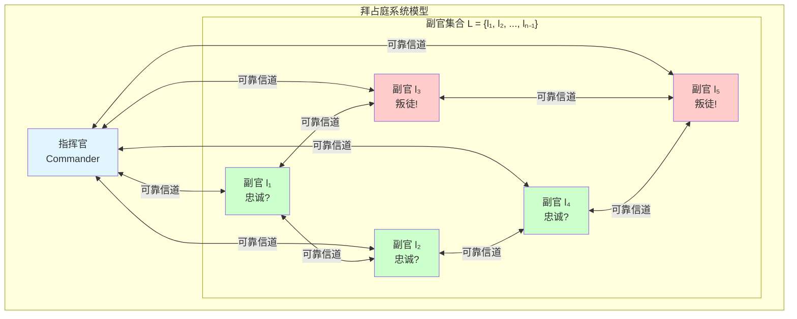
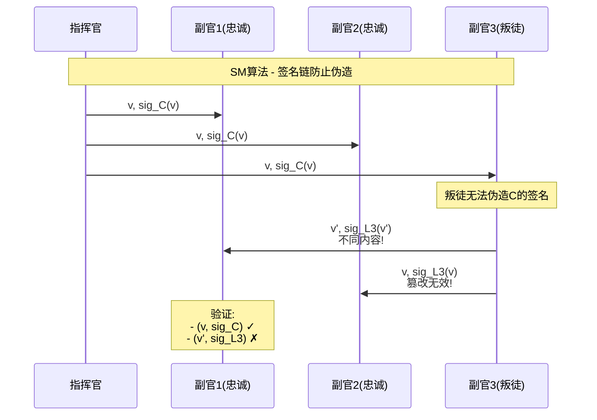

# Byzantine Generals Problem（拜占庭将军问题）完整形式化

> **对齐标准**: Stanford CS244B Distributed Systems | MIT 6.824 | Princeton COS418
>
> **相关文档**: [拜占庭容错专题文档](../distributed-systems/拜占庭容错专题文档.md) | [Two Generals问题](./01-两将军问题形式化.md) | [PBFT实用拜占庭容错](../../04-consensus/bft/PBFT实用拜占庭容错.md)

---

## 目录

- [Byzantine Generals Problem（拜占庭将军问题）完整形式化](#byzantine-generals-problem拜占庭将军问题完整形式化)
  - [目录](#目录)
  - [1. 问题形式化](#1-问题形式化)
    - [1.1 系统模型](#11-系统模型)
    - [1.2 形式化定义](#12-形式化定义)
      - [定义1（拜占庭故障）](#定义1拜占庭故障)
      - [定义2（共识条件 - IC）](#定义2共识条件---ic)
      - [定义3（口头消息 - Oral Message）](#定义3口头消息---oral-message)
      - [定义4（签名消息 - Signed Message）](#定义4签名消息---signed-message)
  - [2. 口头消息算法（OM算法）](#2-口头消息算法om算法)
    - [2.1 OM(m)算法描述](#21-omm算法描述)
    - [2.2 正确性证明](#22-正确性证明)
  - [3. 签名消息算法（SM算法）](#3-签名消息算法sm算法)
    - [3.1 SM(m)算法](#31-smm算法)
    - [3.2 证明](#32-证明)
  - [4. 下界定理](#4-下界定理)
    - [4.1 n ≥ 3f + 1的必要性](#41-n--3f--1的必要性)
  - [5. 现代应用](#5-现代应用)
    - [5.1 PBFT与拜占庭问题的关系](#51-pbft与拜占庭问题的关系)
    - [5.2 区块链共识](#52-区块链共识)
  - [6. 形式化定义汇总](#6-形式化定义汇总)
  - [7. 定理汇总](#7-定理汇总)
  - [8. 与其他文档的链接](#8-与其他文档的链接)

---

## 1. 问题形式化

### 1.1 系统模型



**系统组成**:

- **将军集合**: $G = \{g_1, g_2, ..., g_n\}$
- **叛徒集合**: $F \subseteq G$，$|F| \leq f$
- **忠诚将军集合**: $L = G \setminus F$，$|L| = n - f$
- **通信**: 每对将军之间可靠信道（消息不丢失、不篡改）
- **决策域**: $V = \{0, 1\}$（简化二元决策）

### 1.2 形式化定义

#### 定义1（拜占庭故障）

**拜占庭故障节点** $g \in F$ 可以：

$$
\text{Behavior}(g) = \begin{cases}
\text{silent} & \text{不发送消息} \\
\text{erroneous} & \text{发送错误消息} \\
\text{inconsistent} & \text{对不同接收者发送矛盾消息}
\end{cases}
$$

形式化：对于故障节点 $g_i$，其消息生成函数为：

$$
\mu_i: G \times V \times \text{History} \rightarrow V \cup \{\bot\}
$$

其中输出可以是任意值（与输入无关）。

#### 定义2（共识条件 - IC）

**IC1（一致性 - Agreement）**:

$$
\forall g_i, g_j \in L: \text{decision}(g_i) = \text{decision}(g_j)
$$

> 所有忠诚将军达成相同决策

**IC2（有效性 - Validity）**:

$$
\text{commander} \in L \implies \forall g_i \in L: \text{decision}(g_i) = \text{order}(\text{commander})
$$

> 如果指挥官忠诚，所有忠诚将军采用其命令

#### 定义3（口头消息 - Oral Message）

消息 $m$ 是**口头消息**当满足：

1. **可传递性**: 接收者知道发送者身份
2. **不可伪造性**: 消息可被复制，但内容可被修改（由叛徒）
3. **无签名**: 无法证明消息来源

形式化：

$$
\text{OralMessage}(m) \implies m = (v, \text{sender}, \text{path})
$$

其中 $\text{path}$ 是消息经过的节点链。

#### 定义4（签名消息 - Signed Message）

消息 $m$ 是**签名消息**当满足：

1. **不可伪造性**: 忠诚将军的签名无法伪造
2. **可验证性**: 任何人可以验证签名真实性
3. **可追溯性**: 可以追踪签名链

形式化：

$$
\text{SignedMessage}(m) \implies m = (v, \sigma_{g_1}(v), \sigma_{g_2}(v), ...)
$$

其中 $\sigma_{g_i}$ 是将军 $g_i$ 的签名函数。

---

## 2. 口头消息算法（OM算法）

### 2.1 OM(m)算法描述

```mermaid
flowchart TD
    A[OM(m)算法] --> B{m = 0?}
    B -->|是| C[直接接收指挥官值]
    B -->|否| D[递归阶段]

    D --> D1[指挥官发送v给所有副官]
    D --> D2[每个副官gi作为指挥官]
    D2 --> D3[执行OM(m-1)]
    D3 --> D4[发送vi给其他n-2个副官]
    D4 --> D5[收集OM(m-1)结果]
    D5 --> D6[majority表决决定]

    C --> E[返回v]
    D6 --> E

    style A fill:#e1f5ff
    style E fill:#ccffcc
```

**算法 OM(m)**:

```
输入: 递归深度 m, 当前指挥官 c, 值 v, 参与者集合 P
输出: 决策值

1. 如果 m = 0:
   - 返回 v (直接接收指挥官的值)

2. 否则 (m > 0):
   a. 指挥官 c 发送 v 给所有副官

   b. 对每个副官 gi ∈ P \ {c}:
      - 令 vi 为 gi 从 c 收到的值
      - 如果 gi 未收到值，令 vi = RETREAT (默认值)

   c. 对每个副官 gi ∈ P \ {c}:
      - 作为指挥官执行 OM(m-1, gi, vi, P \ {c})
      - 令 V = {vj : gj 执行 OM(m-1) 的结果}

   d. 返回 majority(V)
```

**majority函数**:

$$
\text{majority}(V) = \begin{cases}
v & \text{if } \exists v: |\{v_i \in V: v_i = v\}| > |V|/2 \\
\text{RETREAT} & \text{otherwise}
\end{cases}
$$

### 2.2 正确性证明

**定理**: OM(m) 可以容忍 $f = m$ 个叛徒，当且仅当 $n \geq 3f + 1$。

**证明结构**:

```mermaid
graph TB
    A[OM(m)正确性证明] --> B[基础情况<br/>m=0]
    A --> C[归纳假设<br/>OM(m-1)正确]
    A --> D[归纳步骤<br/>证明OM(m)正确]

    D --> D1[情况A<br/>指挥官忠诚]
    D --> D2[情况B<br/>指挥官是叛徒]

    D1 --> D1a[忠诚副官收到相同值]
    D1 --> D1b[叛徒最多影响f个副官]
    D1a --> D1c[n-1 ≥ 2f+1<br/>忠诚副官占多数]

    D2 --> D2a[每个副官收到n-1个值]
    D2 --> D2b[≥n-f-1来自忠诚将军]
    D2b --> D2c[n-f-1 ≥ 2f<br/>忠诚值占多数]

    style A fill:#ff9999
    style B fill:#99ccff
    style C fill:#99ccff
    style D fill:#99ff99
```

**详细证明**:

**步骤1（基础情况 - m = 0）**:

当 $m = 0$ 时，副官直接接收指挥官的值。

- 如果指挥官忠诚，所有忠诚副官收到相同值，满足IC1和IC2。
- 如果指挥官是叛徒，IC2不适用（指挥官非忠诚）。

**步骤2（归纳假设）**:

假设 OM(m-1) 在 $n-1$ 个将军中可以容忍 $m-1$ 个叛徒，满足IC1和IC2。

**步骤3（归纳步骤）**:

考虑 OM(m) 在 $n$ 个将军中，最多 $m$ 个叛徒。

**情况A：指挥官忠诚**

- 指挥官发送值 $v$ 给所有副官
- 忠诚副官收到 $v$
- 叛徒副官可能发送不同值

在 OM(m-1) 递归中：

- 忠诚副官 $g_i$ 作为指挥官发送 $v$
- 其他忠诚副官收到 $v$ 并传播
- 最多 $m-1$ 个叛徒在副官中

由归纳假设，OM(m-1) 保证IC1和IC2。

忠诚副官收集的值集合 $V_i$ 满足：

- 至少 $(n-1) - (m-1) = n-m$ 个值是 $v$（来自忠诚副官）
- 最多 $m$ 个值可能不同（来自叛徒）

需要 $n - m > m$，即 $n > 2m$。

由假设 $n \geq 3m + 1$：

$$
n - m \geq 2m + 1 > m
$$

因此，$v$ 在 majority 中占多数。

**情况B：指挥官是叛徒**

- 指挥官可能发送不同值给不同副官
- 但副官中最多 $m$ 个叛徒（指挥官已算一个）
- 所以副官中最多 $m-1$ 个叛徒

对每个忠诚副官 $g_i$：

- 执行 OM(m-1) 时，最多 $m-1$ 个叛徒
- 由归纳假设，OM(m-1) 满足IC1
- 所有忠诚副官达成一致

IC1 成立。$\square$

---

## 3. 签名消息算法（SM算法）

### 3.1 SM(m)算法



**算法 SM(m)**:

```
输入: 递归深度 m, 当前节点, 签名消息集合 V
输出: 决策值

1. 如果 m = 0:
   - 返回 choose(V)

2. 否则:
   a. 对每条消息 (v, signatures) ∈ V:
      - 验证签名链
      - 如果有效且 |signatures| ≤ m:
        * 转发给未签名的将军

   b. 收集所有有效消息到新集合 V'

   c. 递归执行 SM(m-1, V')

3. 返回 choose(V')
```

**choose函数**:

$$
\text{choose}(V) = \begin{cases}
v & \text{if } V = \{v\} \text{ (单一值)} \\
\text{RETREAT} & \text{if } |V| > 1 \text{ (多个不同值)}
\end{cases}
$$

### 3.2 证明

**定理**: 使用签名消息，$n \geq f + 2$ 时，SM(m) 可以容忍任意数量 $f$ 个叛徒。

**证明**:

**签名性质**:

$$
\forall g_i \in L, \forall v: \sigma_{g_i}(v) \text{ 无法被 } g_j \in F \text{ 伪造}
$$

**情况A：指挥官忠诚**

- 指挥官发送 $(v, \sigma_C(v))$
- 忠诚副官验证签名后接受
- 叛徒无法伪造指挥官的签名
- 所有忠诚副官收到相同的 $(v, \sigma_C(v))$

**情况B：指挥官是叛徒**

- 指挥官可能发送不同值给不同副官
- 但每条消息都有指挥官的签名
- 忠诚副官可以检测到矛盾（收到不同签名消息）
- 通过 choose 函数，选择 RETREAT 或其他策略

当 $n \geq f + 2$:

- 至少2个忠诚将军
- 忠诚将军之间可以验证和传播正确的签名消息
- 即使 $f = n - 2$，两个忠诚将军也能互相验证

因此，签名消息算法可以容忍 $f = n - 2$ 个叛徒。$\square$

---

## 4. 下界定理

### 4.1 n ≥ 3f + 1的必要性

**定理**: 对于口头消息，如果 $n \leq 3f$，不存在算法满足IC1和IC2。

**证明**（反证法）:

假设存在算法在 $n = 3, f = 1$ 时满足IC1和IC2。

**场景1：指挥官忠诚**

```
        C(忠诚)
       /    \
   "Attack" "Attack"
     /         \
   L1          L2
   |            |
   |            |
   L3(叛徒)    L3(叛徒)
   |            |
 "Retreat"  "Retreat"
```

- C 发送 "Attack" 给 L1 和 L2
- L3（叛徒）告诉 L2 "C 告诉我 Retreat"
- L2 无法区分：
  - C 忠诚但 L3 撒谎
  - C 是叛徒发送矛盾命令

**场景2：指挥官是叛徒**

```
        C(叛徒)
       /        \
 "Attack"      "Retreat"
     /             \
   L1(忠诚)      L2(忠诚)
```

- C 发送 "Attack" 给 L1，"Retreat" 给 L2
- L1 和 L2 收到矛盾信息
- 无法达成一致

**矛盾**: 两个场景对副官来说不可区分，无法同时满足IC1和IC2。

因此，$n \geq 3f + 1$ 是必要条件。$\square$

---

## 5. 现代应用

### 5.1 PBFT与拜占庭问题的关系

```mermaid
graph TB
    A[拜占庭将军问题<br/>Byzantine Generals] --> B[OM(m)算法<br/>理论解法]
    A --> C[SM(m)算法<br/>签名解法]

    B --> D[PBFT<br/>Practical BFT]
    C --> D

    D --> E[视图变更<br/>View Change]
    D --> F[三阶段提交<br/>Pre-prepare/Prepare/Commit]

    E --> G[现代BFT系统<br/>Tendermint/HotStuff]
    F --> G

    style A fill:#e1f5ff
    style D fill:#ccffcc
    style G fill:#ffeeaa
```

**PBFT与OM(m)的关系**:

| 特性 | OM(m) | PBFT |
|------|-------|------|
| **通信复杂度** | $O(n^{m+1})$ | $O(n^2)$ |
| **递归深度** | m | 1 (优化的OM(1)) |
| **视图变更** | 无 | 有 |
| **签名** | 可选 | 必需 |
| **实用性** | 理论 | 实用 |

### 5.2 区块链共识

**比特币PoW**: 解决随机拜占庭将军问题

$$
\text{PoW共识}: \text{最长链规则} + \text{概率最终性}
$$

**以太坊PoS**: 使用BFT风格共识


**加密货币**: 拜占庭将军问题的货币激励版本

---

## 6. 形式化定义汇总

| 定义编号 | 名称 | 核心内容 |
|---------|------|---------|
| 定义1 | 拜占庭故障 | 任意/错误/矛盾行为 |
| 定义2 | 共识条件IC | IC1(一致性) + IC2(有效性) |
| 定义3 | 口头消息 | 可传递、不可伪造、无签名 |
| 定义4 | 签名消息 | 不可伪造、可验证、可追溯 |

## 7. 定理汇总

| 定理 | 内容 | 条件 |
|------|------|------|
| OM正确性 | OM(m)满足IC | n ≥ 3m+1 |
| SM正确性 | SM(m)满足IC | n ≥ f+2 |
| 下界定理 | n ≤ 3f时不可能 | 口头消息 |

## 8. 与其他文档的链接

- [← Two Generals问题](./01-两将军问题形式化.md) - 两节点场景的不可能性
- [↑ 拜占庭容错专题](../distributed-systems/拜占庭容错专题文档.md) - 容错机制概览
- [→ PBFT实用算法](../../04-consensus/bft/PBFT实用拜占庭容错.md) - 实用拜占庭容错
- [CAP定理](../distributed-systems/CAP定理专题文档.md) - 分布式系统权衡

---

**参考文献**:

1. Lamport, L., Shostak, R., & Pease, M. (1982). "The Byzantine Generals Problem". ACM TOPLAS
2. Castro, M., & Liskov, B. (1999). "Practical Byzantine Fault Tolerance". OSDI
3. Pease, M., Shostak, R., & Lamport, L. (1980). "Reaching Agreement in the Presence of Faults". JACM
