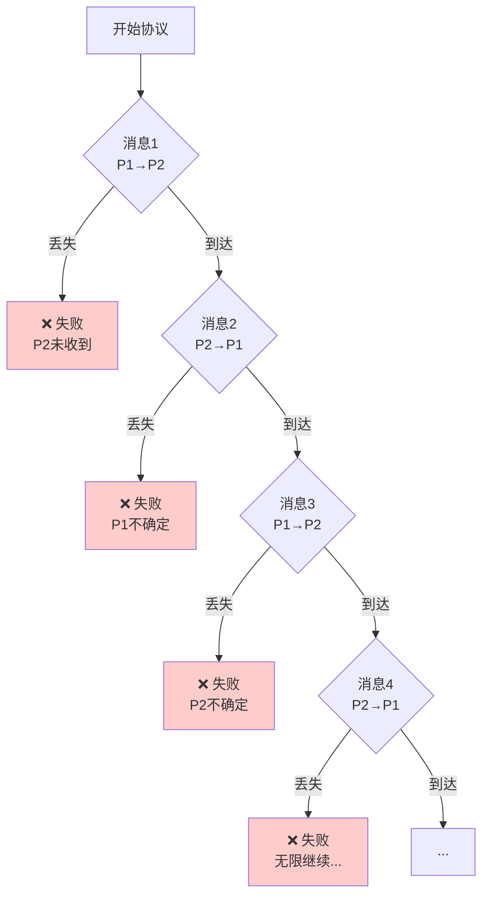

# Two Generals问题交互式演示

> **相关文档**: [Two Generals形式化分析](./01-两将军问题形式化.md)

---

## 目录

- [1. 协议模拟器](#1-协议模拟器)
- [2. 场景分析](#2-场景分析)
- [3. 概率分析可视化](#3-概率分析可视化)

---

## 1. 协议模拟器

### 1.1 基础协议模拟

```python
import random
from dataclasses import dataclass
from enum import Enum, auto
from typing import Optional, List, Tuple

class Decision(Enum):
    ATTACK = "Attack"
    RETREAT = "Retreat"
    UNDECIDED = "Undecided"

class MessageStatus(Enum):
    DELIVERED = auto()
    LOST = auto()

@dataclass
class Message:
    sender: str
    receiver: str
    content: str
    ack_level: int = 0  # 确认层级

    def __repr__(self):
        return f"Msg({self.sender}->{self.receiver}, '{self.content}', ack={self.ack_level})"

class TwoGeneralsSimulator:
    """
    Two Generals问题交互式模拟器
    演示为什么确定性共识在不可靠信道上不可能
    """

    def __init__(self, loss_rate: float = 0.3, max_rounds: int = 10):
        self.loss_rate = loss_rate
        self.max_rounds = max_rounds
        self.history: List[Tuple[int, str, MessageStatus]] = []

    def send_message(self, msg: Message) -> MessageStatus:
        """模拟消息发送，可能丢失"""
        if random.random() < self.loss_rate:
            self.history.append((msg.ack_level, str(msg), MessageStatus.LOST))
            return MessageStatus.LOST
        else:
            self.history.append((msg.ack_level, str(msg), MessageStatus.DELIVERED))
            return MessageStatus.DELIVERED

    def naive_protocol(self) -> Tuple[Decision, Decision, bool]:
        """
        朴素协议：只发送一次消息
        这几乎总是失败
        """
        print("=" * 60)
        print("朴素协议：单次消息发送")
        print("=" * 60)

        # P1发送攻击命令
        msg = Message("P1", "P2", "Attack")
        status = self.send_message(msg)

        if status == MessageStatus.LOST:
            print(f"❌ 消息丢失: {msg}")
            return Decision.UNDECIDED, Decision.UNDECIDED, False

        print(f"✅ P2收到: {msg}")

        # 如果没有确认，P2决定攻击，但P1不知道
        p2_decision = Decision.ATTACK
        p1_decision = Decision.UNDECIDED  # P1不知道P2是否收到

        print(f"P1决策: {p1_decision.value} (不知道P2是否收到)")
        print(f"P2决策: {p2_decision.value}")

        consensus = (p1_decision == p2_decision and p1_decision != Decision.UNDECIDED)
        print(f"共识达成: {'✅' if consensus else '❌'}")

        return p1_decision, p2_decision, consensus

    def acknowledgment_protocol(self) -> Tuple[Decision, Decision, bool]:
        """
        确认协议：P1发送，P2确认
        仍然可能失败
        """
        print("\n" + "=" * 60)
        print("确认协议：发送+确认")
        print("=" * 60)

        # Round 1: P1 -> P2
        msg1 = Message("P1", "P2", "Attack", ack_level=1)
        status1 = self.send_message(msg1)

        if status1 == MessageStatus.LOST:
            print(f"❌ Round 1 消息丢失: {msg1}")
            return Decision.UNDECIDED, Decision.UNDECIDED, False

        print(f"✅ Round 1 - P2收到: {msg1}")

        # Round 2: P2 -> P1 (确认)
        msg2 = Message("P2", "P1", "Ack:Attack", ack_level=2)
        status2 = self.send_message(msg2)

        if status2 == MessageStatus.LOST:
            print(f"❌ Round 2 确认丢失: {msg2}")
            # P2决定攻击，P1不知道P2收到
            return Decision.UNDECIDED, Decision.ATTACK, False

        print(f"✅ Round 2 - P1收到确认: {msg2}")

        # 现在P1知道P2收到，但P2不知道P1知道...
        p1_decision = Decision.ATTACK
        p2_decision = Decision.ATTACK

        print(f"P1决策: {p1_decision.value} (知道P2收到)")
        print(f"P2决策: {p2_decision.value} (但不知道P1知道)")

        # P2仍然不确定，可能等待更多确认...
        consensus = False  # 实际上没有真正的共同知识
        print(f"共同知识: {'✅' if consensus else '❌'} (P2不知道P1知道)")

        return p1_decision, p2_decision, consensus

    def infinite_ack_protocol(self, rounds: int) -> Tuple[Decision, Decision, bool]:
        """
        无限确认协议演示：展示无限回归问题
        """
        print("\n" + "=" * 60)
        print(f"多层确认协议：{rounds}轮")
        print("=" * 60)

        p1_knowledge = 0  # P1知道P2知道...的层级
        p2_knowledge = 0  # P2知道P1知道...的层级

        for i in range(1, rounds + 1):
            sender = "P1" if i % 2 == 1 else "P2"
            receiver = "P2" if i % 2 == 1 else "P1"

            if i % 2 == 1:
                content = f"Attack-Level{i}"
            else:
                content = f"Ack-Level{i}"

            msg = Message(sender, receiver, content, ack_level=i)
            status = self.send_message(msg)

            if status == MessageStatus.LOST:
                print(f"❌ Round {i} 消息丢失: {msg}")
                print(f"   {sender}的知识层级: {p1_knowledge if sender=='P1' else p2_knowledge}")
                print(f"   {receiver}的知识层级: {p2_knowledge if sender=='P1' else p1_knowledge}")

                # 分析失败原因
                self._analyze_failure(i, sender, receiver)
                return Decision.UNDECIDED, Decision.UNDECIDED, False

            print(f"✅ Round {i} - {receiver}收到: {msg}")

            # 更新知识层级
            if receiver == "P1":
                p1_knowledge = i
            else:
                p2_knowledge = i

        print(f"\n经过{rounds}轮后:")
        print(f"P1知识层级: {p1_knowledge}")
        print(f"P2知识层级: {p2_knowledge}")
        print(f"层级差: {abs(p1_knowledge - p2_knowledge)}")

        # 即使经过多轮，也没有共同知识
        if p1_knowledge == p2_knowledge == rounds:
            print(f"⚠️  即使{rounds}轮都成功，如果第{rounds+1}轮失败...")

        return Decision.ATTACK, Decision.ATTACK, False

    def _analyze_failure(self, failed_round: int, sender: str, receiver: str):
        """分析失败原因"""
        print(f"\n📊 失败分析:")
        print(f"   失败发生在第{failed_round}轮")
        print(f"   发送者: {sender}")
        print(f"   接收者: {receiver}")

        if failed_round % 2 == 1:
            print(f"   问题: {receiver}不知道{sender}是否知道...")
        else:
            print(f"   问题: {receiver}不知道{sender}是否确认了确认...")

        print(f"   结论: 无法建立共同知识 (Common Knowledge)")

    def run_simulation(self, num_trials: int = 10):
        """运行多次模拟统计"""
        print("\n" + "=" * 60)
        print(f"运行 {num_trials} 次模拟统计")
        print(f"消息丢失率: {self.loss_rate}")
        print("=" * 60)

        results = {
            "naive": {"success": 0, "fail": 0},
            "ack": {"success": 0, "fail": 0},
            "multi": {"success": 0, "fail": 0}
        }

        for i in range(num_trials):
            # 重置历史
            self.history = []

            # 朴素协议
            _, _, success = self.naive_protocol()
            results["naive"]["success" if success else "fail"] += 1

            # 确认协议
            self.history = []
            _, _, success = self.acknowledgment_protocol()
            results["ack"]["success" if success else "fail"] += 1

            # 多层确认
            self.history = []
            _, _, success = self.infinite_ack_protocol(rounds=3)
            results["multi"]["success" if success else "fail"] += 1

        print("\n" + "=" * 60)
        print("统计结果")
        print("=" * 60)
        for protocol, res in results.items():
            success_rate = res["success"] / num_trials * 100
            print(f"{protocol:10} - 成功: {res['success']}, 失败: {res['fail']}, 成功率: {success_rate:.1f}%")


# 运行演示
if __name__ == "__main__":
    random.seed(42)  # 可重复

    sim = TwoGeneralsSimulator(loss_rate=0.3)

    # 单次演示
    sim.naive_protocol()
    sim.acknowledgment_protocol()
    sim.infinite_ack_protocol(rounds=5)

    # 统计模拟
    # sim.run_simulation(num_trials=100)
```

### 1.2 模拟输出示例

```
============================================================
朴素协议：单次消息发送
============================================================
❌ 消息丢失: Msg(P1->P2, 'Attack', ack=0)

============================================================
确认协议：发送+确认
============================================================
✅ Round 1 - P2收到: Msg(P1->P2, 'Attack', ack=1)
❌ Round 2 确认丢失: Msg(P2->P1, 'Ack:Attack', ack=2)

============================================================
多层确认协议：5轮
============================================================
✅ Round 1 - P2收到: Msg(P1->P2, 'Attack-Level1', ack=1)
✅ Round 2 - P1收到: Msg(P2->P1, 'Ack-Level2', ack=2)
✅ Round 3 - P2收到: Msg(P1->P2, 'Attack-Level3', ack=3)
❌ Round 4 消息丢失: Msg(P2->P1, 'Ack-Level4', ack=4)

📊 失败分析:
   失败发生在第4轮
   发送者: P2
   接收者: P1
   问题: P1不知道P2是否确认了确认...
   结论: 无法建立共同知识 (Common Knowledge)
```

---

## 2. 场景分析

### 2.1 消息丢失场景树



### 2.2 知识层级分析

| 轮次 | P1知道 | P2知道 | 问题 |
|-----|--------|--------|------|
| 0 | 攻击 | - | P2不知道 |
| 1 | 攻击 | P1想攻击 | P1不知道P2知道 |
| 2 | P2知道 | P1想攻击 | P2不知道P1知道P2知道 |
| 3 | P2知道 | P1知道P2知道 | P1不知道P2知道P1知道... |
| ... | ... | ... | 无限回归 |

---

## 3. 概率分析可视化

### 3.1 概率共识公式

```python
def prob_consensus(n: int, p: float) -> float:
    """
    计算n轮消息交换后达成共识的概率

    Args:
        n: 消息发送次数
        p: 单条消息成功概率

    Returns:
        达成共识的概率
    """
    # 需要正向和反向都至少一条消息到达
    p_forward = 1 - (1 - p) ** n  # 正向至少一条到达
    p_backward = 1 - (1 - p) ** n  # 反向至少一条到达

    return p_forward * p_backward

# 示例计算
print("消息成功概率 p = 0.7")
print("-" * 40)
for n in [1, 3, 5, 10, 20]:
    prob = prob_consensus(n, 0.7)
    print(f"n={n:2d}: 共识概率 = {prob:.6f} = {prob*100:.4f}%")

# 输出:
# 消息成功概率 p = 0.7
# ----------------------------------------
# n= 1: 共识概率 = 0.490000 = 49.0000%
# n= 3: 共识概率 = 0.903187 = 90.3187%
# n= 5: 共识概率 = 0.987938 = 98.7938%
# n=10: 共识概率 = 0.999908 = 99.9908%
# n=20: 共识概率 = 0.999999 = 100.0000%
```

### 3.2 概率曲线可视化

```
概率共识曲线 (p = 0.7)

100% |                                    ********
 90% |                           ********
 80% |                      ******
 70% |                  ****
 60% |               ***
 50% |            ***
 40% |          **
 30% |        **
 20% |       *
 10% |      *
  0% |_____*_____________________________________
       1   3   5   7   9  11  13  15  17  19  n

关键观察:
- n=1: 49% (几乎肯定失败)
- n=3: 90% (高概率)
- n=10: 99.99% (极高概率)
- n→∞: 概率→1 但永不为1
```

### 3.3 不同消息成功率的比较

| n | p=0.5 | p=0.7 | p=0.9 | p=0.99 |
|---|-------|-------|-------|--------|
| 1 | 25.0% | 49.0% | 81.0% | 98.0% |
| 3 | 57.8% | 90.3% | 99.5% | ~100% |
| 5 | 76.3% | 98.8% | ~100% | ~100% |
| 10| 94.0% | ~100% | ~100% | ~100% |

---

## 4. 交互式决策树

```mermaid
graph TD
    A[将军A决定攻击] --> B[发送Attack消息给B]
    B --> C{消息是否到达?}
    C -->|否 (概率1-p)| D[A认为未送达<br/>B不知道]
    C -->|是 (概率p)| E[B收到Attack]

    E --> F{B是否决定攻击?}
    F -->|否| G[B撤退<br/>A攻击 - 灾难!]
    F -->|是| H[B发送Ack给A]

    H --> I{Ack是否到达?}
    I -->|否 (概率1-p)| J[A不确定<br/>可能撤退]<-->K[B认为A收到<br/>B攻击]<-->L[不协调!]
    I -->|是 (概率p)| M[A知道B准备攻击]

    M --> N{A是否确认?}
    N -->|否| O[A攻击<br/>B不确定]<-->P[风险!]
    N -->|是| Q[A发送Ack²给B]

    Q --> R{Ack²是否到达?}
    R -->|否| S[无限回归...]
    R -->|是| T[继续Ack³...]

    style D fill:#ffcccc
    style G fill:#ffcccc
    style L fill:#ffcccc
    style P fill:#ffcccc
    style S fill:#ffcccc
```

---

## 5. 结论

通过交互式演示可以看到：

1. **确定性共识不可能**: 任何有限协议都存在失败场景
2. **无限回归问题**: 确认需要确认需要确认...
3. **概率共识可行**: 通过多次重传可以任意提高成功概率
4. **工程实践**: 实际系统使用超时+重传机制

---

**参考**: [Two Generals形式化分析](./01-两将军问题形式化.md)
