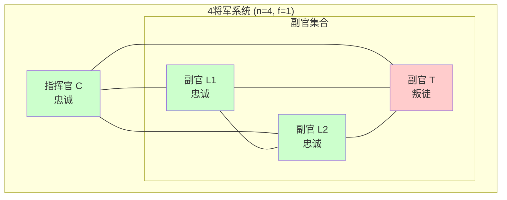
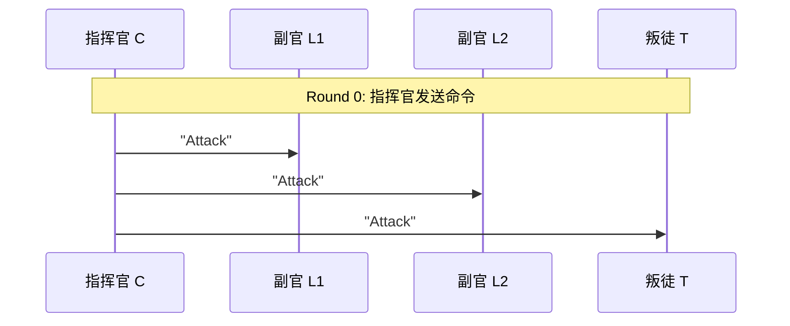
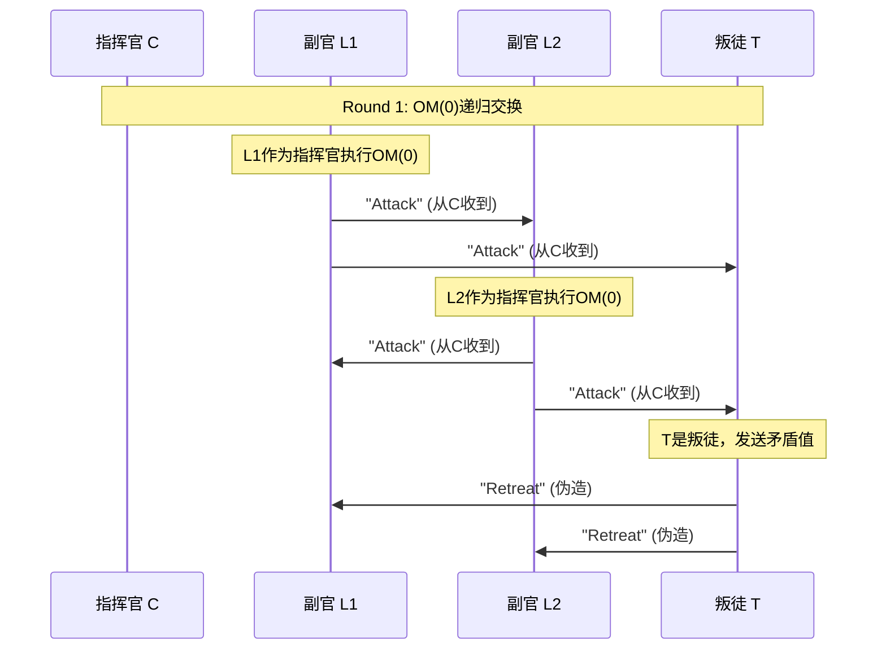
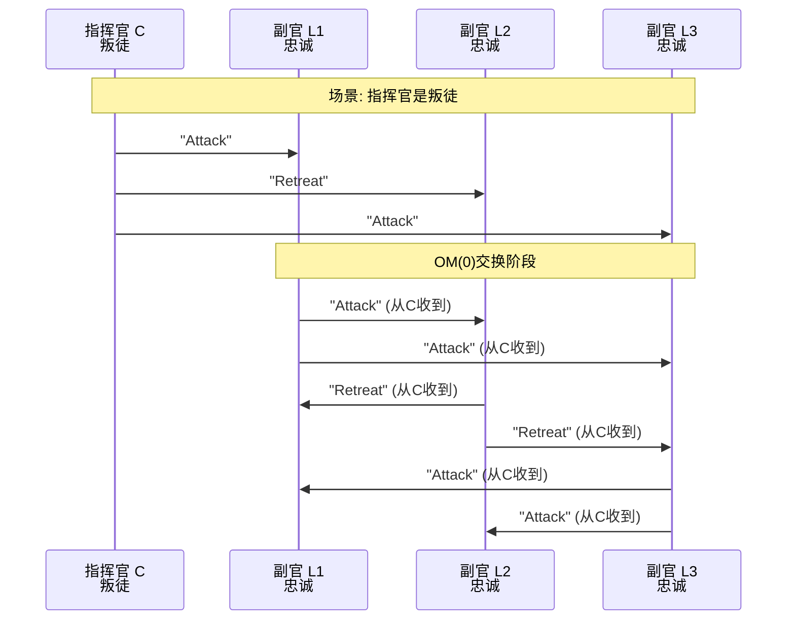
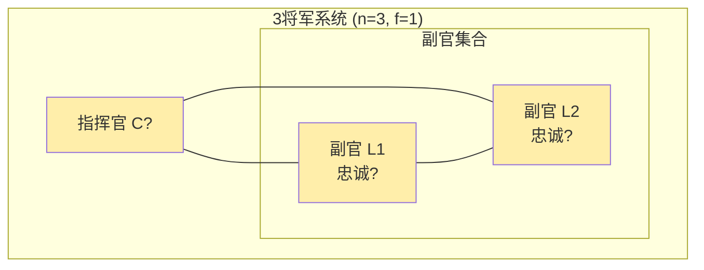
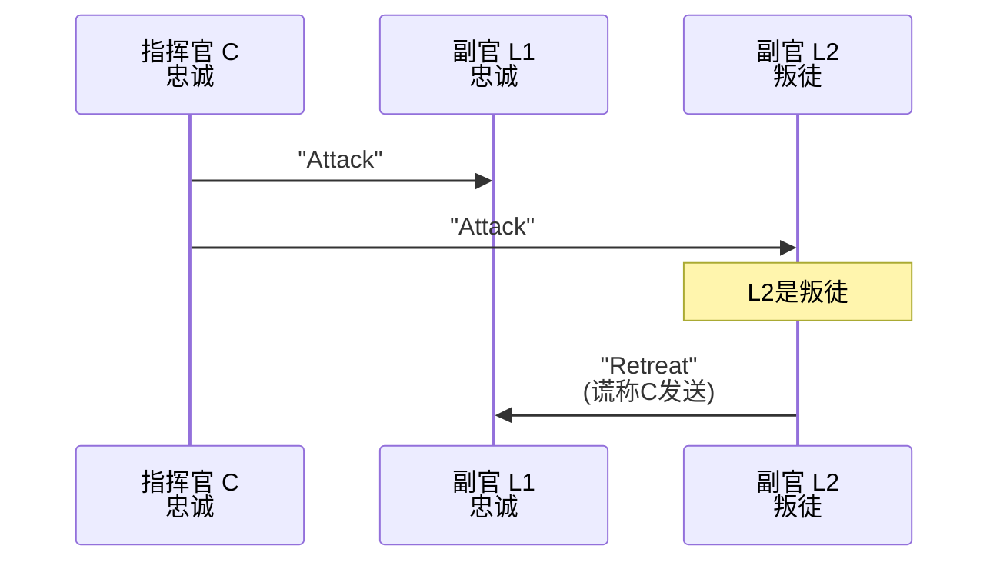
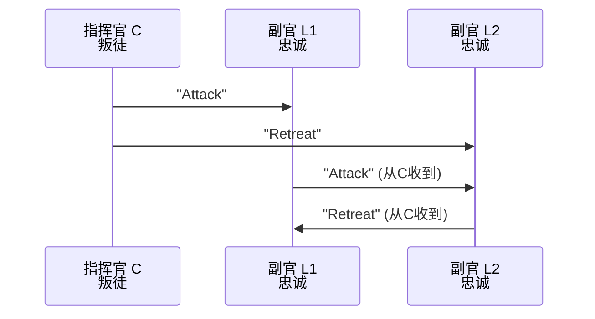
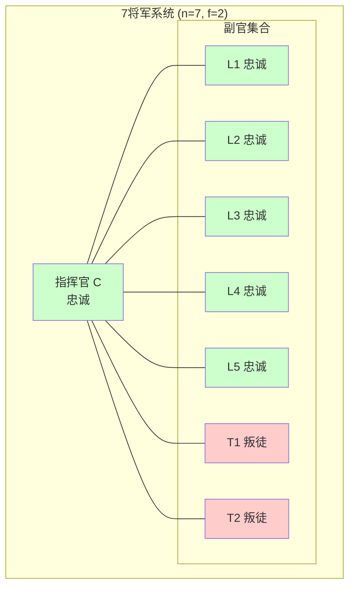
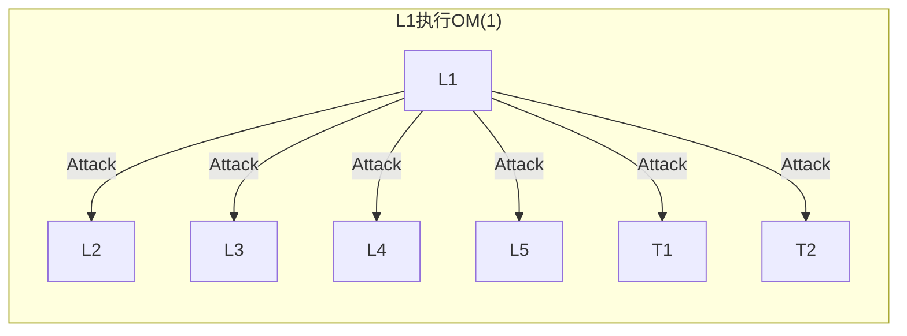

# 拜占庭将军问题场景分析

> **相关文档**: [拜占庭将军问题完整形式化](./02-拜占庭将军问题完整形式化.md) | [PBFT实用拜占庭容错](../../04-consensus/bft/PBFT实用拜占庭容错.md)

---

## 目录

- [场景1: 4将军1叛徒（可解）](#场景1-4将军1叛徒可解)
- [场景2: 3将军1叛徒（不可解）](#场景2-3将军1叛徒不可解)
- [场景3: 7将军2叛徒（OM算法执行过程）](#场景3-7将军2叛徒om算法执行过程)

---

## 场景1: 4将军1叛徒（可解）

### 1.1 系统配置



**系统参数**:

- $n = 4$ (将军总数)
- $f = 1$ (叛徒数)
- $n \geq 3f + 1$: $4 \geq 3 \times 1 + 1 = 4$ ✓ 满足条件

### 1.2 OM(1)执行过程

#### Step 1: 指挥官发送 (Round 0)



**各节点接收**:

| 节点 | 从C收到 | 状态 |
|-----|---------|-----|
| L1 | Attack | 等待递归OM(0) |
| L2 | Attack | 等待递归OM(0) |
| T | Attack | 可能发送虚假信息 |

#### Step 2: OM(0)递归交换 (Round 1)



**各节点接收矩阵**:

| 接收者\发送者 | C | L1 | L2 | T |
|-------------|---|---|---|---|
| **L1** | Attack | - | Attack | Retreat |
| **L2** | Attack | Attack | - | Retreat |
| **T** | Attack | Attack | Attack | - |

#### Step 3: 决策阶段

**副官L1的决策**:

接收到的值集合: $\{Attack, Attack, Retreat\}$

$$
\text{majority}(Attack, Attack, Retreat) = Attack
$$

**副官L2的决策**:

接收到的值集合: $\{Attack, Attack, Retreat\}$

$$
\text{majority}(Attack, Attack, Retreat) = Attack
$$

**结果**:

| 节点 | 决策 | 说明 |
|-----|------|-----|
| L1 | Attack | ✓ 与指挥官一致 |
| L2 | Attack | ✓ 与指挥官一致 |
| T | ? | 叛徒行为无关 |

**IC1（一致性）**: ✓ 忠诚将军达成一致
**IC2（有效性）**: ✓ 采用指挥官命令

### 1.3 叛徒指挥官场景

如果**指挥官是叛徒**:



**接收矩阵**:

| 接收者\发送者 | C | L1 | L2 | L3 |
|-------------|---|---|---|---|
| **L1** | Attack | - | Retreat | Attack |
| **L2** | Retreat | Attack | - | Attack |
| **L3** | Attack | Attack | Retreat | - |

**决策计算**:

对于每个忠诚副官：

- 收到的值中，2个来自其他忠诚副官
- $n - f - 1 = 4 - 1 - 1 = 2$ 个忠诚值
- 多数表决结果: Attack

**所有忠诚副官达成一致** (虽然可能不是最优决策，但满足IC1)

---

## 场景2: 3将军1叛徒（不可解）

### 2.1 系统配置



**系统参数**:

- $n = 3$ (将军总数)
- $f = 1$ (叛徒数)
- $n \geq 3f + 1$: $3 \geq 3 \times 1 + 1 = 4$ ✗ **不满足**

### 2.2 不可能性证明

#### 场景A: 指挥官忠诚，L2是叛徒



**L1的困境**:

- 从C收到: "Attack"
- 从L2收到: "Retreat" (声称C发送)

L1无法区分:

- **情况1**: C忠诚，L2是叛徒撒谎
- **情况2**: C是叛徒，发送矛盾命令

#### 场景B: 指挥官是叛徒



**结果**:

- L1 收到: Attack (来自C), Retreat (来自L2)
- L2 收到: Retreat (来自C), Attack (来自L1)

L1 无法确定 C 还是 L2 是叛徒，同理 L2。

**无法达成一致**!

### 2.3 形式化分析

**必要条件分析**:

对于忠诚副官 $g_i$ 做出正确决策，需要:

$$
\text{忠诚消息数} > \text{叛徒可能发送的消息数}
$$

在OM(0)阶段:

- 每个忠诚副官收到 $n-1$ 条消息
- 其中最多 $f$ 条来自叛徒
- 需要: $(n-1) - f > f$
- 即: $n - 1 > 2f$
- 即: $n > 2f + 1$

对于 $f=1$: $n > 3$，即 $n \geq 4$

因此，$n=3, f=1$ 时无法满足条件。

---

## 场景3: 7将军2叛徒（OM算法执行过程）

### 3.1 系统配置



**系统参数**:

- $n = 7$ (将军总数)
- $f = 2$ (叛徒数)
- $n \geq 3f + 1$: $7 \geq 3 \times 2 + 1 = 7$ ✓ 满足条件
- 使用 OM(2) 算法

### 3.2 OM(2)执行过程

#### Step 1: 指挥官发送 (Round 0)

```
指挥官 C 发送 "Attack" 给所有副官
```

**各节点状态**:

| 节点 | 类型 | 收到值 | 下一步 |
|-----|------|-------|-------|
| L1 | 忠诚 | Attack | 执行OM(1) |
| L2 | 忠诚 | Attack | 执行OM(1) |
| L3 | 忠诚 | Attack | 执行OM(1) |
| L4 | 忠诚 | Attack | 执行OM(1) |
| L5 | 忠诚 | Attack | 执行OM(1) |
| T1 | 叛徒 | Attack | 可能发送虚假信息 |
| T2 | 叛徒 | Attack | 可能发送虚假信息 |

#### Step 2: OM(1)递归 (Round 1)

每个副官作为指挥官，执行OM(1):



**叛徒行为** (T1, T2):

```
T1 发送矛盾信息:
- 给 L1: "Retreat"
- 给 L2: "Attack"
- 给 L3: "Retreat"
- ...

T2 发送矛盾信息:
- 给 L1: "Attack"
- 给 L2: "Retreat"
- ...
```

#### Step 3: OM(0)递归 (Round 2)

在OM(1)中，每个副官再次递归执行OM(0):

**以L1为例**:

L1从其他6个副官接收:

- 从L2: "Attack" (L2从C收到)
- 从L3: "Attack" (L3从C收到)
- 从L4: "Attack" (L4从C收到)
- 从L5: "Attack" (L5从C收到)
- 从T1: "Retreat" (伪造)
- 从T2: "Attack" (可能正确或伪造)

#### Step 4: 决策计算

**对于L1**:

OM(1)阶段收集的值 (从其他副官):

| 来源 | 声称C的值 | OM(0)验证 |
|-----|----------|----------|
| L2 | Attack | 多数忠诚报告Attack |
| L3 | Attack | 多数忠诚报告Attack |
| L4 | Attack | 多数忠诚报告Attack |
| L5 | Attack | 多数忠诚报告Attack |
| T1 | Retreat | 少数报告 |
| T2 | ? | 可能矛盾 |

**OM(0)验证每个副官的报告**:

对于L2的报告，L1询问其他副官:

- L3说: L2报告Attack
- L4说: L2报告Attack
- L5说: L2报告Attack
- T1说: L2报告Retreat
- T2说: L2报告Attack

多数 (4/6) 说 L2 报告 Attack ✓

**最终majority计算**:

L1收集的值:

- 直接从C: Attack
- 从OM(1)递归: [Attack, Attack, Attack, Attack, ?, ?]

忠诚副官报告: 4个Attack (来自L2-L5)
叛徒报告: 可能不一致

$$
\text{majority} = Attack
$$

**所有5个忠诚副官都得到 Attack** ✓

### 3.3 算法复杂度分析

| 阶段 | 消息数 | 说明 |
|-----|-------|-----|
| OM(2) - Round 0 | 6 | C发送给6个副官 |
| OM(1) - Round 1 | $6 \times 5 = 30$ | 每个副官发送给5个其他副官 |
| OM(0) - Round 2 | $30 \times 4 = 120$ | 每个OM(1)发送给4个其他副官 |
| **总计** | **156** | $O(n^{m+1}) = O(7^3)$ |

**验证下界条件**:

在每一层，忠诚副官占多数:

- 总副官: 6个
- 忠诚: 4个
- 叛徒: 2个

对于majority: 需要 $4 > 6/2 = 3$ ✓

---

## 场景对比总结

```mermaid
graph TB
    subgraph "三种场景对比"
        A[n=4, f=1<br/>✓ 可解] --> A1[OM(1)足够]<br/>消息数: 12
        B[n=3, f=1<br/>✗ 不可解] --> B1[无法区分场景]<br/>IC1/IC2不可同时满足
        C[n=7, f=2<br/>✓ 可解] --> C1[需要OM(2)]<br/>消息数: 156
    end

    style A fill:#ccffcc
    style B fill:#ffcccc
    style C fill:#ccffcc
```

| 场景 | n | f | n≥3f+1 | 结果 | 算法 | 消息复杂度 |
|-----|---|---|-------|-----|-----|----------|
| 4将军1叛徒 | 4 | 1 | 4≥4 ✓ | ✅ 可解 | OM(1) | $O(n^2)$ |
| 3将军1叛徒 | 3 | 1 | 3≥4 ✗ | ❌ 不可解 | - | - |
| 7将军2叛徒 | 7 | 2 | 7≥7 ✓ | ✅ 可解 | OM(2) | $O(n^3)$ |

---

**参考**: [拜占庭将军问题完整形式化](./02-拜占庭将军问题完整形式化.md)
