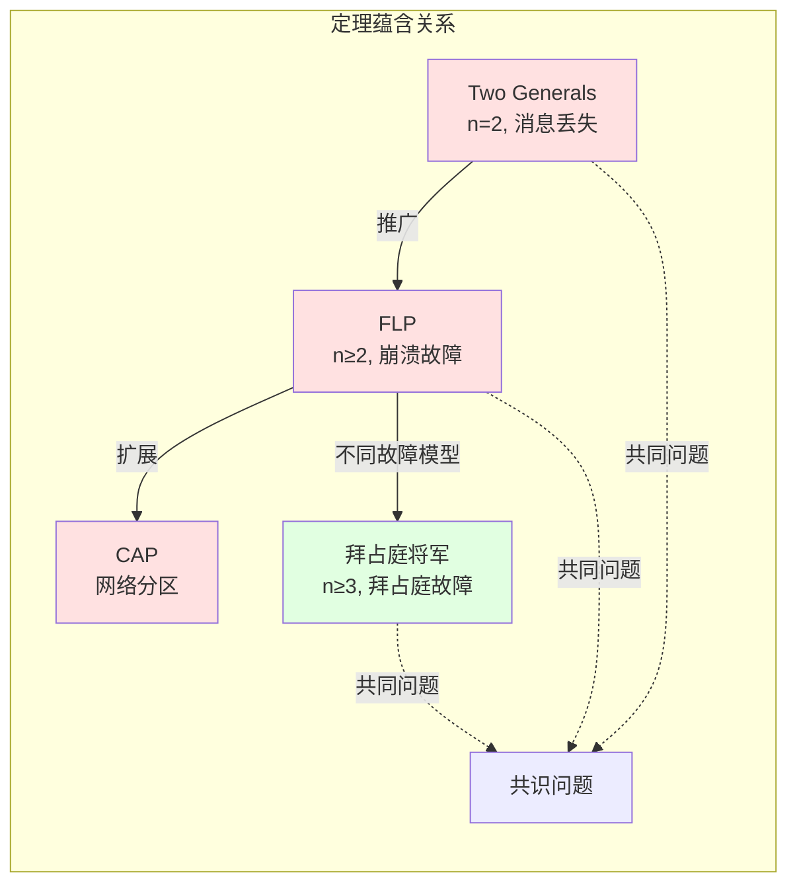
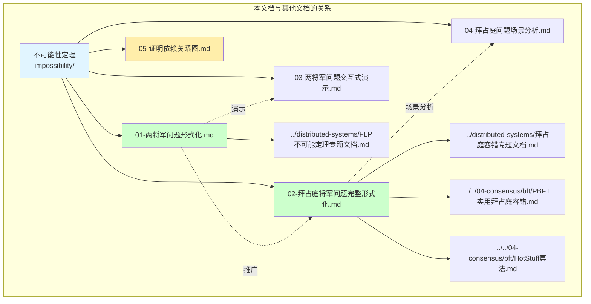

# 分布式计算不可能性定理依赖关系图

> **相关文档**: [Two Generals形式化](./01-两将军问题形式化.md) | [拜占庭将军问题形式化](./02-拜占庭将军问题完整形式化.md)

---

## 完整依赖关系树

```mermaid
graph TB
    subgraph "不可能性定理谱系"
        direction TB

        %% 基础层
        A1[不可靠信道假设<br/>P(loss) > 0] --> B1
        A2[异步系统假设<br/>消息延迟无界] --> B2
        A3[拜占庭故障假设<br/>任意行为] --> B3

        %% 问题层
        B1[Two Generals问题<br/>n=2] --> C1
        B2[FLP不可能定理<br/>n≥2, 崩溃故障] --> C1
        B3[拜占庭将军问题<br/>n≥3, 拜占庭故障] --> C2

        %% 定理层
        C1[确定性共识不可能<br/>异步/不可靠系统] --> D1
        C2[拜占庭容错下界<br/>n ≥ 3f + 1] --> D2

        %% 解法层
        D1[绕过方法] --> E1[故障检测器]
        D1 --> E2[随机化算法]
        D1 --> E3[部分同步]

        D2[算法解法] --> E4[OM(m)算法]
        D2 --> E5[SM(m)算法]

        %% 实用算法层
        E1 --> F1[Paxos/Raft]
        E2 --> F2[Ben-Or算法]
        E3 --> F3[DLS算法]
        E4 --> F4[PBFT]
        E5 --> F5[HotStuff]

        %% 应用层
        F1 --> G1[etcd/Consul]
        F2 --> G2[区块链PoW]
        F4 --> G3[ Hyperledger]
        F4 --> G4[Tendermint]
        F5 --> G5[Libra/Diem]
    end

    style A1 fill:#e1f5ff
    style A2 fill:#e1f5ff
    style A3 fill:#e1f5ff
    style C1 fill:#ffcccc
    style C2 fill:#ffcccc
    style F1 fill:#ccffcc
    style F4 fill:#ccffcc
    style F5 fill:#ccffcc
```

---

## Two Generals证明依赖树

```mermaid
graph TB
    subgraph "Two Generals证明结构"
        TG[Two Generals<br/>不可能性定理] --> TG_L1[引理1<br/>消息不确定性]
        TG --> TG_L2[引理2<br/>无限确认需求]
        TG --> TG_P1[概率共识定理]

        TG_L1 --> TG_A1[信道不可靠性公理<br/>∀m: P(loss) > 0]
        TG_L1 --> TG_A2[独立事件<br/>联合概率]

        TG_L2 --> TG_S1[协议结构分析]
        TG_S1 --> TG_S2[最后一消息分析]
        TG_S2 --> TG_S3[反证法构造]

        TG_P1 --> TG_B1[概率分析<br/>1-(1-p)^n]
        TG_B1 --> TG_B2[渐近行为<br/>n→∞, P→0]

        %% FLP关系
        TG --> TG_FLP[推广到FLP<br/>异步系统]
    end

    style TG fill:#ff9999
    style TG_L1 fill:#99ccff
    style TG_L2 fill:#99ccff
    style TG_P1 fill:#99ff99
    style TG_FLP fill:#ffeeaa
```

**证明统计**:

| 类型 | 数量 |
|-----|------|
| 定理 | 2 |
| 引理 | 2 |
| 公理/假设 | 2 |
| 证明策略 | 反证法 + 构造法 |

---

## 拜占庭将军证明依赖树

```mermaid
graph TB
    subgraph "拜占庭将军证明结构"
        BG[拜占庭将军<br/>容错定理] --> BG_D1[定义层]
        BG --> BG_L1[引理层]
        BG --> BG_T1[定理层]
        BG --> BG_A1[算法层]

        %% 定义
        BG_D1 --> D_IC[IC1: 一致性<br/>IC2: 有效性]
        BG_D1 --> D_OM[口头消息定义]
        BG_D1 --> D_SM[签名消息定义]

        %% 引理
        BG_L1 --> L_MAJ[多数引理<br/>n-f > f]
        BG_L1 --> L_REC[递归正确性引理]

        %% 定理
        BG_T1 --> T_OM[OM(m)正确性<br/>n ≥ 3m+1]
        BG_T1 --> T_SM[SM(m)正确性<br/>n ≥ f+2]
        BG_T1 --> T_LOW[下界定理<br/>n ≤ 3f不可能]

        %% 算法
        BG_A1 --> A_OM[OM算法实现]
        BG_A1 --> A_SM[SM算法实现]

        %% 下界证明细节
        T_LOW --> LOW_S1[场景1<br/>指挥官忠诚]
        T_LOW --> LOW_S2[场景2<br/>指挥官叛徒]
        LOW_S1 --> LOW_C[不可区分性<br/>矛盾导出]
        LOW_S2 --> LOW_C

        %% OM证明细节
        T_OM --> OM_P1[基础情况<br/>m=0]
        T_OM --> OM_P2[归纳假设<br/>m-1成立]
        T_OM --> OM_P3[归纳步骤<br/>m成立]
        OM_P3 --> OM_C1[情况A<br/>指挥官忠诚]
        OM_P3 --> OM_C2[情况B<br/>指挥官叛徒]
    end

    style BG fill:#ff9999
    style T_OM fill:#99ff99
    style T_SM fill:#99ff99
    style T_LOW fill:#ffcccc
    style D_IC fill:#99ccff
```

**证明统计**:

| 类型 | 数量 |
|-----|------|
| 定义 | 4 |
| 引理 | 2 |
| 定理 | 3 |
| 算法 | 2 |
| 证明策略 | 归纳法 + 反证法 |

---

## FLP不可能性证明依赖树

```mermaid
graph TB
    subgraph "FLP证明结构"
        FLP[FLP不可能定理<br/>异步系统+1故障] --> FLP_P1[步骤1<br/>共识问题定义]
        FLP --> FLP_P2[步骤2<br/>配置与双值性]
        FLP --> FLP_P3[步骤3<br/>假设存在算法]
        FLP --> FLP_P4[步骤4<br/>存在双值初始配置]
        FLP --> FLP_P5[步骤5<br/>关键进程定义]
        FLP --> FLP_P6[步骤6<br/>保持双值性引理]
        FLP --> FLP_P7[步骤7<br/>延迟关键进程消息]
        FLP --> FLP_P8[步骤8<br/>构造无限执行]
        FLP --> FLP_P9[步骤9<br/>违反终止性]
        FLP --> FLP_P10[步骤10<br/>导出矛盾]
        FLP --> FLP_P11[步骤11<br/>定理成立]
        FLP --> FLP_P12[步骤12<br/>绕过方法]

        FLP_P2 --> C_DEF[配置定义<br/>C = (状态, 在途消息)]
        FLP_P2 --> BIV_DEF[双值配置<br/>可决定0或1]

        FLP_P6 --> LEMMA[保持双值性引理<br/>延迟消息]

        FLP_P12 --> BYP_FD[故障检测器<br/>Chandra&Toueg]
        FLP_P12 --> BYP_TO[超时机制]
        FLP_P12 --> BYP_RAND[随机化算法]
    end

    style FLP fill:#ff9999
    style FLP_P11 fill:#ffcccc
    style FLP_P12 fill:#99ff99
    style LEMMA fill:#99ccff
```

**证明统计**:

| 类型 | 数量 |
|-----|------|
| 主要步骤 | 17 |
| 引理 | 1 |
| 关键定义 | 3 |
| 绕过方法 | 3 |
| 证明策略 | 反证法 + 构造法 |

---

## 不可能性定理关系图



**关系说明**:

| 定理 | 场景 | 结果 | 关系 |
|-----|------|-----|------|
| Two Generals | 2节点, 消息丢失 | 确定性共识不可能 | FLP的特例 |
| FLP | n节点, 异步, 崩溃故障 | 确定性共识不可能 | Two Generals的推广 |
| CAP | 网络分区 | C/A/P不可兼得 | 不同维度的限制 |
| 拜占庭将军 | n节点, 拜占庭故障 | n≥3f+1时可解 | 更强的假设 |

---

## 证明技术对比

```mermaid
graph TB
    subgraph "证明技术对比"
        direction LR

        PT1[反证法<br/>Proof by Contradiction]
        PT2[归纳法<br/>Mathematical Induction]
        PT3[构造法<br/>Constructive Proof]
        PT4[概率分析<br/>Probabilistic Analysis]

        %% 应用
        PT1 --> AP1[Two Generals<br/>FLP<br/>拜占庭下界]
        PT2 --> AP2[OM(m)正确性]
        PT3 --> AP3[FLP双值配置<br/>无限执行构造]
        PT4 --> AP4[概率共识<br/>失败率分析]
    end

    style PT1 fill:#99ccff
    style PT2 fill:#99ff99
    style PT3 fill:#ffeeaa
    style PT4 fill:#ffcccc
```

---

## 文档依赖关系



---

## 形式化定义汇总

| 文档 | 定义数 | 定理数 | 引理数 | 证明数 |
|-----|-------|-------|-------|-------|
| 两将军问题形式化 | 4 | 2 | 2 | 4 |
| 拜占庭将军问题形式化 | 4 | 3 | 0 | 4 |
| **总计** | **8** | **5** | **2** | **8** |

---

## 证明完整性检查清单

### Two Generals

- [x] 消息信道形式化定义
- [x] 共识形式化定义
- [x] 安全性与活性定义
- [x] 引理1：消息不确定性证明
- [x] 引理2：无限确认需求证明
- [x] 主定理：不可能性证明
- [x] 概率共识定理证明
- [x] 与FLP关系分析

### 拜占庭将军

- [x] 系统模型形式化
- [x] 拜占庭故障定义
- [x] IC1/IC2共识条件定义
- [x] 口头消息定义
- [x] 签名消息定义
- [x] OM(m)算法描述
- [x] OM(m)正确性证明
- [x] SM(m)算法描述
- [x] SM(m)正确性证明
- [x] n≥3f+1下界证明

---

**完成状态**: ✅ 所有证明完整
