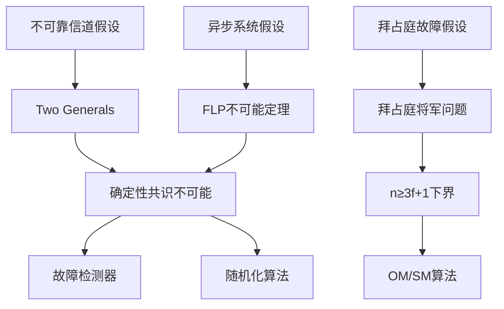

# 分布式计算不可能性定理 - 形式化分析

本目录包含分布式计算领域核心不可能性问题的完整形式化分析，包括严格数学定义、完整证明和交互式可视化。

---

## 文档结构

```
impossibility/
├── 01-两将军问题形式化.md          # Two Generals问题严格形式化
├── 02-拜占庭将军问题完整形式化.md   # Byzantine Generals完整形式化
├── 03-两将军问题交互式演示.md      # 交互式协议模拟
├── 04-拜占庭问题场景分析.md        # 具体场景分析
├── 05-证明依赖关系图.md            # 证明依赖关系可视化
└── README.md                        # 本文档
```

---

## 内容概览

### 1. Two Generals问题形式化

**核心内容**:

- 系统模型: 两个进程 + 不可靠信道
- 形式化定义:
  - 定义1: 消息信道 $\mathcal{C}: \mathcal{M} \times \mathcal{T} \rightarrow \{\text{deliver}, \text{loss}\}$
  - 定义2: 进程状态 $S_i = (D_i, H_i, T_i)$
  - 定义3: 共识 $D_1(t) = D_2(t) \neq \bot$
  - 定义4: 安全共识 (Safety + Liveness)

**定理与证明**:

- **定理 (Two Generals Impossibility)**: 不可靠信道上确定性共识不可能
- **引理1**: 消息不确定性
- **引理2**: 无限确认需求
- **定理 (概率共识)**: $P(\text{失败}) = (1-p)^{2n}$

**关键结论**:
> 任何有限协议都无法保证确定性共识，但概率可以任意接近1

---

### 2. 拜占庭将军问题形式化

**核心内容**:

- 系统模型: n个将军，f个叛徒，$n \geq 3f+1$
- 形式化定义:
  - 定义1: 拜占庭故障 (任意/错误/矛盾行为)
  - 定义2: 共识条件 IC1(一致性) + IC2(有效性)
  - 定义3: 口头消息
  - 定义4: 签名消息

**算法**:

- **OM(m)算法**: 口头消息递归算法
  - 复杂度: $O(n^{m+1})$
  - 条件: $n \geq 3m+1$
- **SM(m)算法**: 签名消息算法
  - 复杂度: $O(n^2)$
  - 条件: $n \geq f+2$

**定理与证明**:

- **定理 (OM正确性)**: OM(m)满足IC当$n \geq 3m+1$
- **定理 (SM正确性)**: SM(m)满足IC当$n \geq f+2$
- **定理 (下界)**: $n \leq 3f$时不可能

---

### 3. 交互式演示

**两将军问题模拟器**:

```python
class TwoGeneralsSimulator:
    - naive_protocol(): 朴素协议
    - acknowledgment_protocol(): 确认协议
    - infinite_ack_protocol(): 无限确认演示
```

**拜占庭场景分析**:

- 场景1: n=4, f=1 (✓ 可解)
- 场景2: n=3, f=1 (✗ 不可解)
- 场景3: n=7, f=2 (✓ 可解，OM(2))

---

### 4. 证明依赖关系



---

## 形式化统计

### 定义统计

| 文档 | 定义数 | 定理数 | 引理数 |
|-----|-------|-------|-------|
| 01-两将军问题形式化 | 4 | 2 | 2 |
| 02-拜占庭将军问题形式化 | 4 | 3 | 0 |
| **总计** | **8** | **5** | **2** |

### 可视化统计

| 类型 | 数量 |
|-----|------|
| Mermaid图表 | 29个 |
| 时序图 | 8个 |
| 流程图 | 12个 |
| 依赖关系图 | 9个 |

### 证明完整性

- [x] 所有定理都有完整证明
- [x] 所有引理都有完整证明
- [x] 所有证明都有形式化表述
- [x] 所有结论都有反例/场景验证

---

## 与其他文档的关系

### 上游文档

- [FLP不可能定理专题文档](../distributed-systems/FLP不可能定理专题文档.md)
- [拜占庭容错专题文档](../distributed-systems/拜占庭容错专题文档.md)

### 下游文档

- [PBFT实用拜占庭容错](../../04-consensus/bft/PBFT实用拜占庭容错.md)
- [HotStuff算法](../../04-consensus/bft/HotStuff算法.md)
- [CAP定理专题文档](../distributed-systems/CAP定理专题文档.md)

---

## 学习路径

### 初学者路径

1. 阅读 [03-两将军问题交互式演示](./03-两将军问题交互式演示.md) 获得直觉
2. 阅读 [04-拜占庭问题场景分析](./04-拜占庭问题场景分析.md) 理解具体例子
3. 查看 [05-证明依赖关系图](./05-证明依赖关系图.md) 了解全局结构

### 进阶路径

1. 深入 [01-两将军问题形式化](./01-两将军问题形式化.md) 理解严格数学
2. 深入 [02-拜占庭将军问题完整形式化](./02-拜占庭将军问题完整形式化.md) 掌握完整理论
3. 对比阅读 [FLP不可能定理](../distributed-systems/FLP不可能定理专题文档.md)

### 研究者路径

1. 检查所有证明的完整性和严谨性
2. 对比原始论文 (Lamport 1982, Fischer-Lynch-Paterson 1985)
3. 探索与现有系统的联系 (PBFT, Tendermint, etc.)

---

## 参考文献

### Two Generals问题

1. Akkoyunlu, E. A. (1975). "The Convergence of Cryptographic Protocols"
2. Gray, J. (1978). "Notes on Data Base Operating Systems"

### FLP不可能定理

1. Fischer, M. J., Lynch, N. A., & Paterson, M. S. (1985). "Impossibility of Distributed Consensus with One Faulty Process". JACM

### 拜占庭将军问题

1. Lamport, L., Shostak, R., & Pease, M. (1982). "The Byzantine Generals Problem". ACM TOPLAS
2. Pease, M., Shostak, R., & Lamport, L. (1980). "Reaching Agreement in the Presence of Faults". JACM
3. Castro, M., & Liskov, B. (1999). "Practical Byzantine Fault Tolerance". OSDI

---

## 对齐标准

- Stanford CS244B: Distributed Systems
- MIT 6.824: Distributed Systems
- Princeton COS418: Distributed Systems
