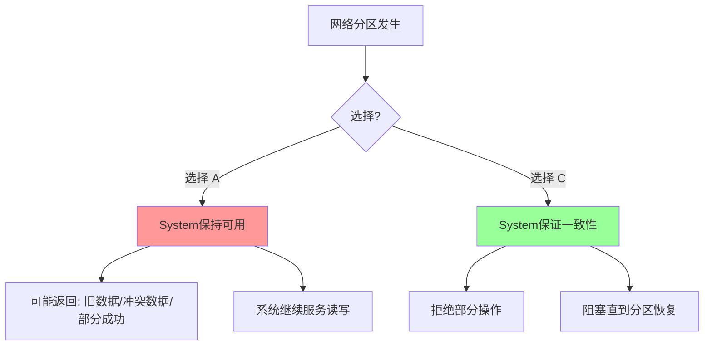
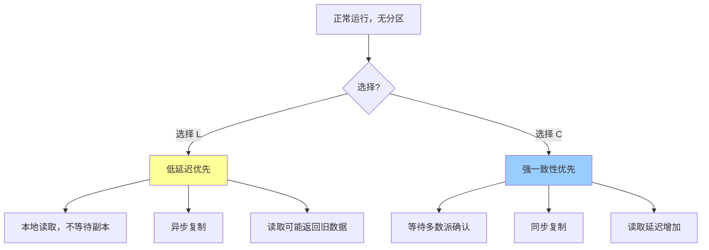
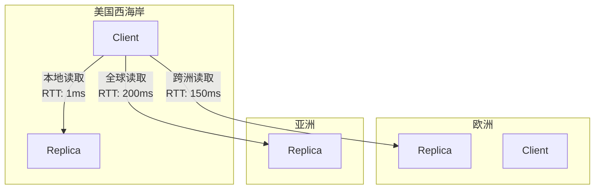

# PACELC定理

> **原始论文**: Abadi, D. J. (2012). Consistency tradeoffs in modern distributed database system design: CAP is only part of the story. *IEEE Computer*, 45(2), 37-42.
>
> **核心贡献**: 扩展CAP定理，量化延迟与一致性的权衡

## 一、从CAP到PACELC

### 1.1 CAP定理回顾

```
CAP定理 (Brewer, 2000):

┌─────────────────────────────────────────────────────────────┐
│                                                             │
│   分布式系统最多同时满足以下两项：                            │
│                                                             │
│   C - Consistency (一致性)                                  │
│       所有节点看到相同的数据                                 │
│                                                             │
│   A - Availability (可用性)                                 │
│       每个请求都能收到响应                                   │
│                                                             │
│   P - Partition Tolerance (分区容错性)                       │
│       系统在网络分区时仍能运行                               │
│                                                             │
└─────────────────────────────────────────────────────────────┘

关键洞察: 在存在网络分区时，必须在C和A之间选择
```

### 1.2 CAP的局限性

```
CAP定理的不足:

1. 只考虑网络分区场景
   - 实际系统大部分时间在正常网络环境下运行
   - 没有分区时是否就没有权衡?

2. 二元选择过于简化
   - 一致性和可用性都有不同程度的级别
   - 实际系统通常是连续谱而非二选一

3. 忽略了延迟因素
   - 现代系统设计中延迟与一致性密切相关
```

### 1.3 PACELC定理引入

```
PACELC定理:

┌─────────────────────────────────────────────────────────────┐
│                                                             │
│   如果有分区 (Partition)，系统必须在可用性 (Availability)    │
│   和一致性 (Consistency) 之间选择:                           │
│                      P => A 或 C                            │
│                                                             │
│  否则 (Else，即没有分区)，系统必须在延迟 (Latency)            │
│   和一致性 (Consistency) 之间选择:                           │
│                      E => L 或 C                            │
│                                                             │
└─────────────────────────────────────────────────────────────┘

完整的PACELC表述: P => (A 或 C), E => (L 或 C)
```

## 二、PACELC详解

### 2.1 分区场景下的权衡 (P => A 或 C)



**CP系统示例**:

- MongoDB (默认配置)
- Redis Cluster
- 任何使用多数派复制的系统

**AP系统示例**:

- Cassandra (可调一致性)
- DynamoDB
- CouchDB

### 2.2 正常场景下的权衡 (E => L 或 C)



**关键洞察**：即使没有分区，一致性和延迟也存在根本性权衡

### 2.3 系统分类矩阵

```
┌─────────────────────────────────────────────────────────────┐
│                    PACELC系统分类                            │
├───────────────┬─────────────────┬───────────────────────────┤
│    分类        │   分区时选择    │   正常时选择              │
├───────────────┼─────────────────┼───────────────────────────┤
│     PC/EC     │   一致性 (C)    │   一致性 (C)              │
│               │                 │   (如: Spanner, Bigtable) │
├───────────────┼─────────────────┼───────────────────────────┤
│     PA/EL     │   可用性 (A)    │   延迟 (L)                │
│               │                 │   (如: Cassandra, Dynamo) │
├───────────────┼─────────────────┼───────────────────────────┤
│     PA/EC     │   可用性 (A)    │   一致性 (C)              │
│               │                 │   (罕见，通常不必要)       │
├───────────────┼─────────────────┼───────────────────────────┤
│     PC/EL     │   一致性 (C)    │   延迟 (L)                │
│               │                 │   (罕见，逻辑矛盾)         │
└───────────────┴─────────────────┴───────────────────────────┘

注: PC/EC 和 PA/EL 是主流设计选择
```

## 三、具体系统分析

### 3.1 Spanner: PC/EC

```go
// Spanner设计: 始终选择一致，即使牺牲延迟

type SpannerConfig struct {
    // 无论是否有分区，都保证外部一致性
    consistencyLevel string // "external"

    // TrueTime等待导致的延迟
    commitWait time.Duration // 通常 5-10ms

    // 读取需要等待多数派
    readQuorum int // majority
}

// 即使无分区，Spanner也会等待以确保外部一致性
func (s *Spanner) Commit(txn *Transaction) {
    commitTS := s.tt.Now()

    // 关键: 等待直到 TT.after(commitTS)
    // 即使没有分区，这也增加了延迟
    s.waitUntilSafe(commitTS)

    s.persistTransaction(txn, commitTS)
}
```

**Spanner的PACELC特征**:

- P → C: 分区时拒绝写操作（需要多数派）
- E → C: 正常时也要等待TrueTime，牺牲延迟换取一致性

### 3.2 Dynamo/Cassandra: PA/EL

```go
// Dynamo设计: 可用性和延迟优先

type DynamoConfig struct {
    replicationFactor int  // N
    readConsistency   int  // R
    writeConsistency  int  // W
}

// 默认配置: R=1, W=1 (最终一致)
func (d *Dynamo) defaultConfig() DynamoConfig {
    return DynamoConfig{
        replicationFactor: 3,
        readConsistency:   1,  // 从1个副本读取
        writeConsistency:  1,  // 写入1个副本即返回成功
    }
}

// 低延迟读取
func (d *Dynamo) Get(key string) (Value, error) {
    // 只读取第一个响应的副本
    replica := d.selectNearestReplica(key)
    return replica.read(key)
    // 不等待其他副本，可能有旧数据
}
```

**Dynamo的PACELC特征**:

- P → A: 分区时继续服务，使用本地副本
- E → L: 正常时优先低延迟，异步复制

### 3.3 MongoDB: 可调一致性

```go
// MongoDB支持运行时一致性级别调整

type MongoDBConsistency int

const (
    ReadUncommitted MongoDBConsistency = iota
    ReadMajority
    Linearizable

    WriteUnacknowledged
    WriteAcknowledged
    WriteMajority
)

func (m *MongoDB) ReadWithConsistency(key string, level MongoDBConsistency) Value {
    switch level {
    case ReadUncommitted:
        // E → L: 本地读取，最低延迟
        return m.localRead(key)

    case ReadMajority:
        // E → C: 等待多数派，更高一致性
        return m.majorityRead(key)

    case Linearizable:
        // 总是 C: 最强一致性，最高延迟
        return m.linearizableRead(key)
    }
}
```

**MongoDB的PACELC特征**:

- 可配置为 PC/EC 或 PA/EL
- 默认: 分区时等待主节点恢复（偏向C）
- 可配置为: 读取从节点（偏向A和L）

### 3.4 其他系统分类

| 系统 | 分类 | 说明 |
|-----|------|------|
| Spanner | PC/EC | TrueTime保证外部一致性 |
| CockroachDB | PC/EC | 类似Spanner的HLC |
| Google Bigtable | PC/EC | 强一致性，单点写入 |
| Cassandra | PA/EL | 可调一致性，默认EL |
| DynamoDB | PA/EL | 最终一致，可配置强一致 |
| Riak | PA/EL | 默认 eventual consistency |
| MongoDB | 可调 | 可配置为PC/EC或PA/EL |
| Redis Cluster | PC/EC | 主从复制，偏向强一致 |
| PostgreSQL-XL | PC/EC | 分布式事务保证一致性 |
| CouchDB | PA/EL | MVCC，最终一致 |

## 四、延迟与一致性的数学关系

### 4.1  quorum系统的延迟分析

```
复制因子 N = 3 (典型配置)
读取副本数 R
写入副本数 W
约束: R + W > N (保证读写重叠)

延迟分析:
┌────────────────────────────────────────────────────────────┐
│ 配置        │  读延迟  │  写延迟  │  一致性                │
├────────────────────────────────────────────────────────────┤
│ R=1, W=1   │   1RTT   │   1RTT   │  最终一致               │
│ R=1, W=3   │   1RTT   │   3RTT   │  写后读一致             │
│ R=2, W=2   │   2RTT   │   2RTT   │  读已提交               │
│ R=3, W=3   │   3RTT   │   3RTT   │  线性化                 │
└────────────────────────────────────────────────────────────┘

RTT = Round Trip Time (往返时间)
```

### 4.2 地理分布的影响



```go
// 地理分布下的延迟计算
func calculateReadLatency(replicas []Replica, consistencyLevel int) time.Duration {
    // 按延迟排序副本
    sorted := sortByLatency(replicas)

    // 选择最快的 R 个副本
    selected := sorted[:consistencyLevel]

    // 读延迟 = 最快R个中的最大延迟（并行读取）
    maxLatency := max(latencies(selected))

    return maxLatency
}

// 示例延迟 (毫秒)
// 本地DC: 1ms
// 同洲际: 50ms
// 跨洲际: 150ms

// R=1: 1ms (本地)
// R=2: max(1ms, 50ms) = 50ms (同洲)
// R=3: max(1ms, 50ms, 150ms) = 150ms (全球)
```

## 五、PACELC在系统设计中的应用

### 5.1 一致性级别选择框架

```go
// 一致性级别选择器
type ConsistencySelector struct {
    // 业务需求权重
    latencyWeight    float64  // 延迟重要性 (0-1)
    consistencyWeight float64 // 一致性重要性 (0-1)
    availabilityWeight float64 // 可用性重要性 (0-1)
}

func (cs *ConsistencySelector) RecommendConfig(workload WorkloadProfile) Config {
    // 分析工作负载特征
    readWriteRatio := workload.readOps / workload.writeOps
    geographicSpread := workload.maxReplicaDistance
    conflictRate := workload.updateConflictRate

    // 决策逻辑
    if cs.latencyWeight > 0.7 && geographicSpread > 100 {
        // 高延迟敏感 + 地理分布广
        return Config{
            readConsistency:  1,  // 本地读取
            writeConsistency: 1,  // 异步写入
            replication:      "async",
        }
    }

    if cs.consistencyWeight > 0.8 || conflictRate > 0.1 {
        // 高一致性要求 或 高冲突率
        return Config{
            readConsistency:  majority(),
            writeConsistency: majority(),
            replication:      "sync",
        }
    }

    // 默认平衡配置
    return Config{
        readConsistency:  1,
        writeConsistency: 2,  // 大多数系统 (N=3)
        replication:      "async",
    }
}
```

### 5.2 自适应一致性

```go
// 根据运行时条件动态调整一致性

type AdaptiveStorage struct {
    currentConfig Config
    metrics       Metrics
}

func (as *AdaptiveStorage) adapt() {
    // 监控指标
    conflictRate := as.metrics.getConflictRate()
    avgLatency := as.metrics.getAverageLatency()
    partitionDetected := as.metrics.isPartitionDetected()

    if partitionDetected {
        // 分区场景: 优先可用性
        as.currentConfig = Config{
            mode:         "AP",
            readLocal:    true,
            queueWrites:  true,
        }
    } else if conflictRate > threshold {
        // 高冲突: 提升一致性
        as.currentConfig = Config{
            mode:        "PC/EC",
            readQuorum:  majority(),
            writeQuorum: majority(),
        }
    } else if avgLatency > latencySLA {
        // 延迟超标: 降低一致性要求
        as.currentConfig = Config{
            mode:        "PA/EL",
            readLocal:   true,
            writeAsync:  true,
        }
    }
}
```

### 5.3 混合模式设计

```go
// 同一系统中不同数据使用不同一致性

type HybridStorage struct {
    userProfiles  *PA_EL_Store  // 最终一致，低延迟
    accountData   *PC_EC_Store  // 强一致，高可靠
    analytics     *PA_EL_Store  // 最终一致，批量写入
    transactions  *PC_EC_Store  // 强一致，事务保证
}

func (hs *HybridStorage) GetUserProfile(userID string) Profile {
    // 使用最终一致存储，快速响应
    return hs.userProfiles.fastGet(userID)
}

func (hs *HybridStorage) TransferFunds(from, to string, amount Money) error {
    // 使用强一致存储，确保正确性
    return hs.transactions.executeTransaction(Txn{
        debit:  from,
        credit: to,
        amount: amount,
    })
}
```

## 六、PACELC的扩展与批评

### 6.1 Fine-grained CAP

```
PACELC的进一步细化:

1. 不是整个系统统一选择
   - 可以按数据中心选择
   - 可以按数据分区选择
   - 可以按操作类型选择

2. 一致性的连续谱
   - 不是只有 C 或 A
   - 存在: 因果一致、会话一致、单调读等

3. 延迟的多样性
   - 读延迟 vs 写延迟
   - 本地延迟 vs 远程延迟
   - 平均延迟 vs P99延迟
```

### 6.2 Harvest与Yield扩展

```
来自FOX & Brewer (1999) 的扩展:

┌─────────────────────────────────────────────────────────────┐
│                    Harvest 和 Yield                          │
├─────────────────────────────────────────────────────────────┤
│                                                             │
│  Yield: 请求成功完成的概率                                    │
│         - 受可用性和分区影响                                  │
│                                                             │
│  Harvest: 响应中数据的完整性/正确性                          │
│          - 在降级模式下可以返回部分结果                       │
│                                                             │
│  组合:                                                      │
│  - 高Yield + 高Harvest = 完全成功                           │
│  - 高Yield + 低Harvest = 返回部分/旧数据 (可用)              │
│  - 低Yield + 高Harvest = 拒绝请求 (一致)                    │
│  - 低Yield + 低Harvest = 系统故障                           │
│                                                             │
└─────────────────────────────────────────────────────────────┘
```

## 七、与MIT 6.824的关联

### 7.1 课程实验中的PACELC

```go
// Lab 3 (KV Raft): PC/EC系统
// - 使用Raft保证一致性
// - 分区时Leader不可用（直到选举新Leader）

type RaftKV struct {
    // P => C: 分区时无法保证可用性
    // E => C: 正常时也需要多数派确认
}

// Lab 4 (分片KV): 可调一致性
// - 使用配置决定每个分片的复制因子和quorum

type ShardedKV struct {
    shards []ShardConfig
}

type ShardConfig struct {
    gid        int
    replicas   []string
    consistency ConsistencyLevel  // 可配置
}
```

### 7.2 设计决策指导

```
MIT 6.824设计决策检查清单:

1. 你的系统需要支持网络分区吗?
   - 是 → 明确选择 P => A 或 P => C
   - 否 → 考虑简化设计

2. 分区场景下:
   - 选择 P => C: 需要共识协议 (Raft/Paxos)
   - 选择 P => A: 需要冲突解决机制

3. 正常场景下:
   - 选择 E => L: 设计本地优先的操作
   - 选择 E => C: 设计同步复制机制

4. 混合策略:
   - 支持运行时调整一致性级别?
   - 不同数据类型不同策略?
```

## 八、总结

### 8.1 核心要点

1. **PACELC扩展了CAP**：不仅考虑分区场景，也考虑正常场景
2. **延迟与一致性权衡**：即使没有分区，也存在根本性权衡
3. **系统设计空间**：PC/EC 和 PA/EL 是主流选择
4. **可调一致性**：现代系统通常支持运行时调整

### 8.2 设计原则

| 场景 | 推荐策略 | 典型系统 |
|-----|---------|---------|
| 金融交易 | PC/EC | Spanner, CockroachDB |
| 社交网络 | PA/EL | Cassandra, Dynamo |
| 内容缓存 | PA/EL | Redis, Memcached |
| 配置管理 | PC/EC | etcd, ZooKeeper |
| 日志分析 | PA/EL | Elasticsearch |
| 协作编辑 | 专用CRDT | Automerge |

## 参考资源

- [PACELC原始论文](https://sites.fas.harvard.edu/~cs161/papers/pacelc.pdf)
- [CAP Twelve Years Later](https://sites.cs.ucsb.edu/~rich/class/cs293b-cloud/papers/brewer-cap.pdf)
- [Perspectives on the CAP Theorem](https://www.microsoft.com/en-us/research/publication/perspectives-on-the-cap-theorem/)
- [Eventually Consistent - Revisited](https://www.allthingsdistributed.com/2008/12/eventually_consistent.html)
