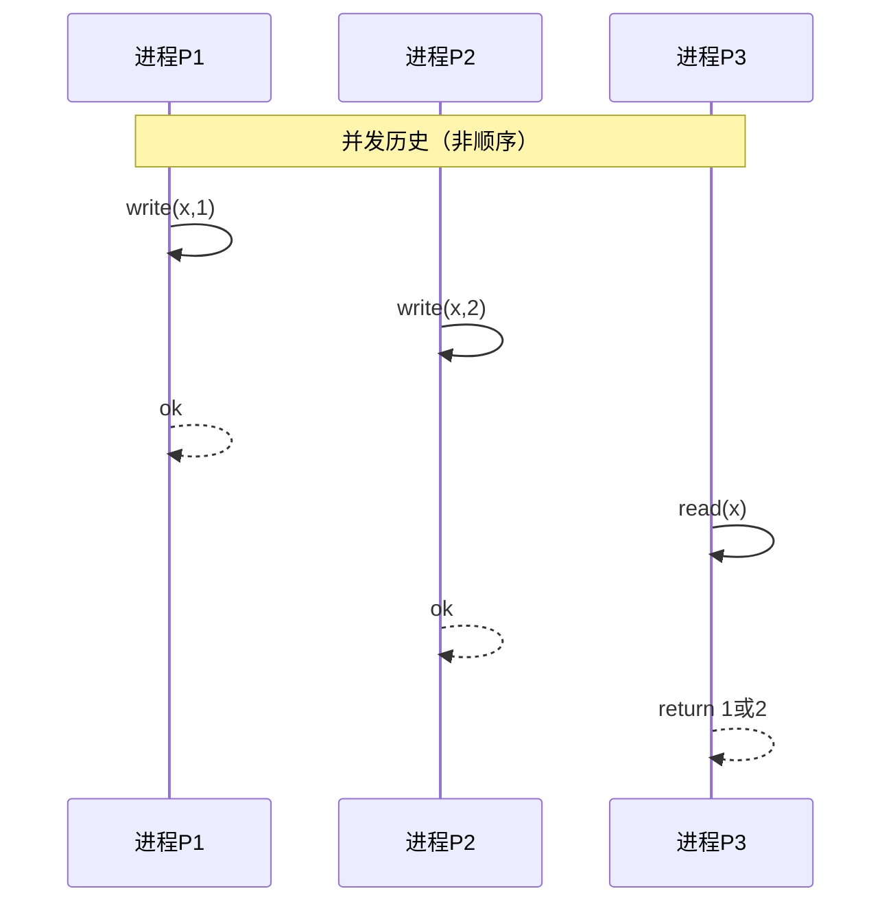
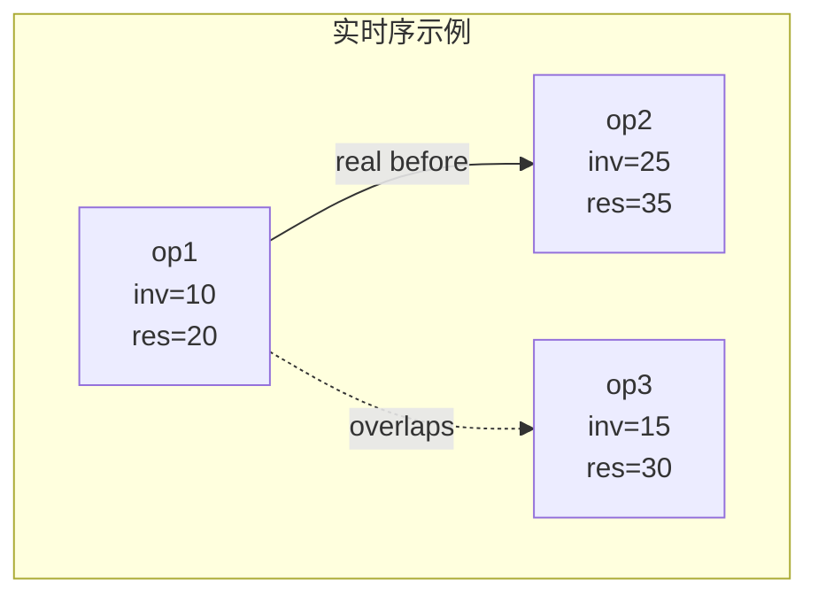
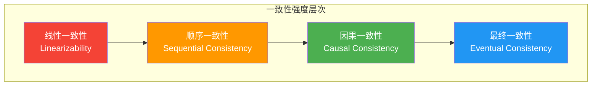
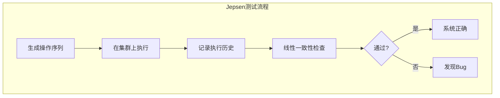

# 线性一致性形式化

> 最强一致性模型的数学基础与判定方法

---

## 📋 目录

- [1. 历史的形式化定义](#1-历史的形式化定义)
- [2. 实时序与线性化点](#2-实时序与线性化点)
- [3. 线性一致性判定](#3-线性一致性判定)
- [4. 一致性模型对比](#4-一致性模型对比)
- [5. 线性一致性检测](#5-线性一致性检测)

---

## 1. 历史的形式化定义

### 1.1 执行历史

**定义 1.1**（历史）：历史 $H$ 是分布式执行中所有操作事件的集合：

$$
H = \langle E, \to_H \rangle
$$

其中 $E$ 是事件集合，$\to_H$ 是事件间的happens-before关系。

**定义 1.2**（事件类型）：每个事件 $e$ 是以下之一：
- **调用事件**（Invocation）：$inv_i(op, arg)$，进程 $i$ 调用操作 $op$ 并传入参数 $arg$
- **响应事件**（Response）：$res_i(op, ret)$，进程 $i$ 的操作 $op$ 返回结果 $ret$

**定义 1.3**（操作）：操作 $op$ 是调用-响应对：

$$
op = (inv_i(op, arg), res_i(op, ret))
$$

操作的时间间隔：$inv(op) \leq t \leq res(op)$

### 1.2 顺序历史

**定义 1.4**（顺序历史）：历史 $H$ 是顺序的，如果它不包含重叠的操作：

$$
\forall op_1, op_2 \in H: res(op_1) < inv(op_2) \lor res(op_2) < inv(op_1)
$$



### 1.3 良构历史

**定义 1.5**（良构历史）：历史 $H$ 是良构的，如果：
1. 每个进程的操作序列是顺序的
2. 每个调用都有对应的响应（完整历史）
3. 没有进程有未完成的调用（完整历史）

---

## 2. 实时序与线性化点

### 2.1 实时序

**定义 2.1**（实时序）：设 $t(e)$ 为事件 $e$ 的实际发生时间戳，则实时序 $<_{real}$ 定义为：

$$
e_1 <_{real} e_2 \iff t(e_1) < t(e_2)
$$

**定义 2.2**（实时序约束）：对于操作 $op_1$ 和 $op_2$：

$$
op_1 <_{real} op_2 \iff res(op_1) <_{real} inv(op_2)
$$

即 $op_1$ 完全在 $op_2$ 开始之前完成。



### 2.2 线性化点

**定义 2.3**（线性化点）：操作 $op$ 的线性化点 $lin(op)$ 是一个时间点，满足：

$$
inv(op) \leq lin(op) \leq res(op)
$$

且在该点，操作对系统状态的修改瞬间生效。

**定义 2.4**（顺序历史等价）：两个历史 $H$ 和 $S$ 等价，如果它们对每个进程的投影相同：

$$
H \equiv S \iff \forall i: H|_i = S|_i
$$

其中 $H|_i$ 是历史 $H$ 中进程 $i$ 的操作子序列。

---

## 3. 线性一致性判定

### 3.1 线性一致性定义

**定义 3.1**（线性一致性）：历史 $H$ 是线性一致的，如果存在：
1. 一个顺序历史 $S$，使得 $H \equiv S$
2. 一个线性化函数 $lin: ops(H) \to \mathbb{R}^+$，为每个操作分配线性化点

使得：
- 对于所有操作 $op$：$inv(op) \leq lin(op) \leq res(op)$
- $S$ 中操作的顺序与线性化点一致：$lin(op_1) < lin(op_2) \iff op_1 <_S op_2$
- $S$ 是合法的顺序规范历史（符合对象语义）

**定理 3.1**（线性一致性组合）：如果每个对象的历史都是线性一致的，则组合历史也是线性一致的。

### 3.2 判定算法

```python
from typing import List, Dict, Set, Tuple, Optional
from dataclasses import dataclass
from enum import Enum

class OpType(Enum):
    WRITE = "write"
    READ = "read"

@dataclass
class Operation:
    process_id: str
    op_type: OpType
    key: str
    value: Optional[int] = None
    start_time: float = 0.0
    end_time: float = 0.0
    result: Optional[int] = None

class LinearizabilityChecker:
    """线性一致性检查器"""
    
    def __init__(self):
        self.history: List[Operation] = []
        
    def add_operation(self, op: Operation):
        self.history.append(op)
    
    def check_linearizability(self) -> Tuple[bool, Optional[List[Operation]]]:
        """
        检查历史是否线性一致
        返回: (是否线性一致, 线性化顺序或None)
        """
        # 按key分组
        by_key: Dict[str, List[Operation]] = {}
        for op in self.history:
            by_key.setdefault(op.key, []).append(op)
        
        # 对每个key检查线性一致性
        for key, ops in by_key.items():
            is_linear, ordering = self._check_key_linearizability(ops)
            if not is_linear:
                return False, None
        
        # 构建全局线性化顺序
        global_order = self._find_global_order(by_key)
        return True, global_order
    
    def _check_key_linearizability(self, ops: List[Operation]) -> Tuple[bool, List[Operation]]:
        """检查单个key的操作历史是否线性一致"""
        # 按开始时间排序
        ops_sorted = sorted(ops, key=lambda x: x.start_time)
        
        # 尝试找到线性化顺序
        # 使用回溯法尝试所有可能的线性化点分配
        n = len(ops)
        
        def try_linearize(assigned: List[Tuple[Operation, float]], 
                         remaining: List[Operation]) -> Optional[List[Operation]]:
            if not remaining:
                # 所有操作都已分配，检查是否合法
                if self._is_valid_linearization(assigned):
                    return [op for op, _ in assigned]
                return None
            
            # 尝试为下一个操作分配线性化点
            next_op = remaining[0]
            remaining = remaining[1:]
            
            # 线性化点必须在[start_time, end_time]之间
            # 且需要满足已经分配的线性化顺序约束
            
            # 获取当前可以分配的范围
            min_lin = next_op.start_time
            max_lin = next_op.end_time
            
            # 确保不违反已经分配的线性化点
            for op, lin_time in assigned:
                if lin_time > max_lin:
                    # 已经分配的操作必须在新操作之前或之后
                    if self._must_precede(op, next_op):
                        return None
            
            # 尝试不同的线性化点位置
            # 简化：尝试放在开始、中间、结束
            for lin_time in [min_lin, (min_lin + max_lin) / 2, max_lin]:
                new_assigned = assigned + [(next_op, lin_time)]
                result = try_linearize(new_assigned, remaining)
                if result is not None:
                    return result
            
            return None
        
        return (False, []) if try_linearize([], ops_sorted) is None else (True, ops_sorted)
    
    def _is_valid_linearization(self, assigned: List[Tuple[Operation, float]]) -> bool:
        """检查线性化是否合法（符合寄存器语义）"""
        # 按线性化点排序
        sorted_ops = sorted(assigned, key=lambda x: x[1])
        
        # 模拟执行，检查read返回的值是否正确
        current_value = None
        
        for op, _ in sorted_ops:
            if op.op_type == OpType.WRITE:
                current_value = op.value
            elif op.op_type == OpType.READ:
                # read必须返回最近的write值
                if op.result is not None and op.result != current_value:
                    return False
        
        return True
    
    def _must_precede(self, op1: Operation, op2: Operation) -> bool:
        """检查op1是否必须在op2之前（基于实时序）"""
        return op1.end_time < op2.start_time
    
    def _find_global_order(self, by_key: Dict[str, List[Operation]]) -> List[Operation]:
        """构建全局线性化顺序"""
        all_ops = []
        for ops in by_key.values():
            all_ops.extend(ops)
        return sorted(all_ops, key=lambda x: x.start_time)

# 使用示例
def demo():
    checker = LinearizabilityChecker()
    
    # 线性一致的历史
    # P1: write(x,1) at [0,2]
    # P2: read(x) at [1,3], returns 1
    checker.add_operation(Operation("P1", OpType.WRITE, "x", 1, 0, 2))
    checker.add_operation(Operation("P2", OpType.READ, "x", None, 1, 3, 1))
    
    is_linear, order = checker.check_linearizability()
    print(f"线性一致: {is_linear}")
    if order:
        print(f"线性化顺序: {[f'{op.process_id}:{op.op_type.value}' for op in order]}")

if __name__ == "__main__":
    demo()
```

---

## 4. 一致性模型对比

### 4.1 一致性层次



### 4.2 形式化对比

| 一致性模型 | 核心约束 | 允许的行为 | 典型系统 |
|:---|:---|:---|:---|
| **线性一致性** | 操作在某个点原子生效，尊重实时序 | 无 | ZooKeeper, etcd |
| **顺序一致性** | 所有进程看到相同的操作顺序 | 不尊重实时序 | 某些CPU内存模型 |
| **因果一致性** | 因果相关的操作按因果序可见 | 并发操作可能乱序 | COPS, AntidoteDB |
| **最终一致性** | 无更新时最终达到一致 | 临时不一致 | Dynamo, Cassandra |

### 4.3 关键区别

**线性一致性 vs 顺序一致性**：

```
场景: P1和P2并发写入x，P3读取

实时序:
  P1: write(x,1) at [0,5]
  P2: write(x,2) at [2,7]
  P3: read(x) at [6,8], 返回1

线性一致性分析:
  - 如果P3看到1，则write(x,1)的线性化点在read之前
  - 但write(x,1)在实时序中先于write(x,2)完成
  - P3在write(x,1)完成后、write(x,2)进行中读取
  - 如果线性化点为write(x,1)=3, write(x,2)=4，则read应该看到2
  - 但read返回1，违反实时序约束！
  
  结论: 不是线性一致的

顺序一致性分析:
  - 可以构造顺序: write(x,1) -> read -> write(x,2)
  - 满足每个进程的顺序
  - 结论: 可以是顺序一致的
```

---

## 5. 线性一致性检测

### 5.1 Jepsen原理

Jepsen是分布式系统一致性测试框架，其核心思想：

1. **操作生成**：生成并发读写操作序列
2. **执行记录**：记录每个操作的开始时间、结束时间和结果
3. **一致性检查**：使用模型检查验证历史是否满足线性一致性



### 5.2 检查算法优化

```python
class OptimizedLinearizabilityChecker:
    """优化的线性一致性检查器（基于Wing-Gong算法）"""
    
    def __init__(self, specification):
        """
        specification: 对象规范，定义合法的状态转换
        """
        self.spec = specification
        self.memo = {}  # 记忆化
    
    def check(self, history: List[Operation]) -> bool:
        """
        使用状态空间剪枝检查线性一致性
        """
        # 按结束时间排序操作
        sorted_ops = sorted(history, key=lambda x: x.end_time)
        
        # 使用BFS/DFS探索可能的线性化顺序
        initial_state = self.spec.initial_state()
        
        return self._search(set(), initial_state, sorted_ops, 0)
    
    def _search(self, linearized: Set[int], 
                current_state, 
                operations: List[Operation],
                index: int) -> bool:
        """
        递归搜索线性化顺序
        
        linearized: 已线性化的操作索引集合
        current_state: 当前状态
        operations: 所有操作
        index: 当前处理位置
        """
        # 记忆化检查
        state_key = (frozenset(linearized), current_state)
        if state_key in self.memo:
            return self.memo[state_key]
        
        # 所有操作都已线性化
        if len(linearized) == len(operations):
            return True
        
        # 尝试线性化一个待处理的操作
        for i, op in enumerate(operations):
            if i in linearized:
                continue
            
            # 检查是否可以线性化（尊重实时序约束）
            if not self._can_linearize(op, operations, linearized):
                continue
            
            # 检查操作在当前状态下是否合法
            if not self._is_valid_operation(op, current_state):
                continue
            
            # 执行操作，获得新状态
            new_state = self._apply_operation(op, current_state)
            
            # 递归检查
            new_linearized = linearized | {i}
            if self._search(new_linearized, new_state, operations, index + 1):
                self.memo[state_key] = True
                return True
        
        self.memo[state_key] = False
        return False
    
    def _can_linearize(self, op: Operation, 
                      operations: List[Operation],
                      linearized: Set[int]) -> bool:
        """检查操作是否可以被线性化"""
        # 操作的线性化点必须在[start_time, end_time]内
        # 且所有在实时序中先于op完成的操作必须已经线性化
        
        for i, other in enumerate(operations):
            if i in linearized and other.end_time < op.start_time:
                # 这个操作必须在op之前
                pass  # 已经满足
            elif other.end_time < op.start_time and i not in linearized:
                # 实时序先于op的操作还未线性化
                return False
        
        return True
    
    def _is_valid_operation(self, op: Operation, state) -> bool:
        """检查操作在状态下是否合法"""
        return self.spec.is_valid(op, state)
    
    def _apply_operation(self, op: Operation, state):
        """执行操作，返回新状态"""
        return self.spec.apply(op, state)
```

---

## 总结

| 概念 | 定义要点 |
|:---|:---|
| **历史** | 操作事件的集合与happens-before关系 |
| **线性化点** | 操作原子生效的时间点，在调用和响应之间 |
| **实时序** | 基于物理时间的操作排序 |
| **线性一致性** | 存在等价的顺序历史，尊重实时序 |
| **判定复杂度** | NP完全问题，需要状态空间搜索 |

---

## 参考资料

1. Herlihy, M. P., & Wing, J. M. (1990). "Linearizability: A correctness condition for concurrent objects". ACM TOPLAS.
2. Gilbert, S., & Lynch, N. (2002). "Brewer's conjecture and the feasibility of consistent, available, partition-tolerant web services". ACM SIGACT News.
3. Kingsbury, K. (2014). "Jepsen: Distributed Systems Safety Analysis". jepsen.io.

## 相关主题

- [一致性模型专题文档](./distributed-systems/一致性模型专题文档.md)
- [CAP定理专题文档](./distributed-systems/CAP定理专题文档.md)
- [向量时钟专题文档](./distributed-systems/向量时钟专题文档.md)

---

**文档版本**：v1.0  
**最后更新**：2026-04-04  
**作者**：分布式计算知识库团队
