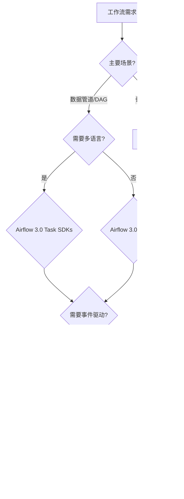

# Apache Airflow 3.0专项分析

**文档版本**：v1.0
**创建时间**：2025年1月
**状态**：✅ **已完成**

---

## 📋 执行摘要

Apache Airflow 3.0于2025年4月发布，引入了DAG版本控制、多语言Task SDKs和Data Assets等重大功能。本文档对Airflow 3.0进行全面分析，重新评估其与Temporal的对比结论。

---

## 一、Airflow 3.0核心新特性

### 1.1 DAG版本控制（DAG Versioning）

#### 1.1.1 功能概述

**核心能力**：

- ✅ **历史版本追踪**：自动跟踪DAG结构变化，记录历史DAG定义
- ✅ **版本查看**：通过UI和API查看历史DAG版本
- ✅ **一致性保证**：确保长期运行工作流的一致性和可重现性
- ✅ **回滚支持**：支持回滚到历史版本

#### 1.1.2 技术实现

**版本管理机制**：

```python
# Airflow 3.0 DAG版本控制示例
from airflow import DAG
from airflow.decorators import task
from datetime import datetime

# DAG定义自动版本化
@dag(
    dag_id="versioned_workflow",
    start_date=datetime(2025, 1, 1),
    schedule_interval="@daily",
    version="1.0.0"  # 显式版本号（可选）
)
def versioned_workflow():
    @task
    def extract():
        return "data"

    @task
    def transform(data):
        return f"transformed_{data}"

    extract() >> transform(extract())

# 历史版本可通过API访问
# GET /api/v1/dags/{dag_id}/versions
```

**版本对比分析**：

| 特性 | Airflow 2.x | Airflow 3.0 | Temporal |
|------|------------|------------|----------|
| **版本追踪** | ❌ 无 | ✅ 自动追踪 | ✅ 工作流版本管理 |
| **历史查看** | ❌ 无 | ✅ UI/API | ✅ 事件历史 |
| **回滚能力** | ❌ 无 | ✅ 支持 | ✅ 支持 |
| **版本隔离** | ❌ 无 | ✅ 支持 | ✅ Worker Versioning |

#### 1.1.3 与Temporal对比

**优势**：

- ✅ **DAG结构版本化**：Airflow 3.0专注于DAG结构版本控制，更适合数据管道场景
- ✅ **可视化历史**：通过UI直观查看DAG版本变化

**劣势**：

- ⚠️ **运行时版本管理**：Airflow 3.0主要管理DAG定义版本，Temporal的Worker Versioning管理运行时版本
- ⚠️ **工作流状态版本**：Airflow 3.0不管理工作流执行状态的版本兼容性

**批判性分析**：

- **适用场景**：Airflow 3.0的DAG版本控制更适合数据工程场景，Temporal的Worker Versioning更适合长周期业务流程
- **技术差异**：Airflow关注定义版本，Temporal关注执行版本，两者互补而非竞争

---

### 1.2 多语言Task SDKs

#### 1.2.1 功能概述

**核心能力**：

- ✅ **语言无关执行**：通过Task Execution API支持多语言任务执行
- ✅ **远程执行**：任务可在不同环境中远程执行
- ✅ **隔离性**：增强任务隔离性和安全性
- ✅ **灵活性**：不再局限于Python

#### 1.2.2 技术实现

**Task SDK架构**：

```python
# Airflow 3.0 Task SDK示例
from airflow.decorators import task
from airflow.providers.http.hooks.http import HttpHook

@task
def python_task():
    return "Python task"

# 通过Task Execution API调用其他语言
@task(task_executor="http")
def remote_task():
    hook = HttpHook(method='POST', http_conn_id='task_executor')
    response = hook.run(
        endpoint='/execute',
        data={
            'language': 'go',
            'code': 'package main; func main() { ... }'
        }
    )
    return response.json()
```

**多语言支持对比**：

| 语言 | Airflow 2.x | Airflow 3.0 | Temporal |
|------|------------|------------|----------|
| **Python** | ✅ 原生 | ✅ 原生 | ✅ SDK |
| **Java** | ❌ 无 | ✅ Task SDK | ✅ SDK |
| **Go** | ❌ 无 | ✅ Task SDK | ✅ SDK |
| **TypeScript** | ❌ 无 | ✅ Task SDK | ✅ SDK |
| **Ruby** | ❌ 无 | ⚠️ 计划中 | ✅ SDK |
| **Swift** | ❌ 无 | ⚠️ 计划中 | ✅ SDK |

#### 1.2.3 与Temporal对比

**优势**：

- ✅ **渐进式迁移**：Airflow 3.0允许现有Python DAG逐步迁移到多语言
- ✅ **统一管理**：所有任务仍在Airflow中统一管理和监控

**劣势**：

- ⚠️ **成熟度**：Task SDKs是新增功能，生态系统不如Temporal成熟
- ⚠️ **性能开销**：远程执行可能带来额外网络开销

**批判性分析**：

- **技术方向**：Airflow 3.0通过Task SDKs向多语言演进，但Temporal原生支持多语言SDK
- **适用场景**：Airflow 3.0适合数据工程团队逐步扩展，Temporal适合从一开始就多语言的项目

---

### 1.3 Data Assets与事件驱动调度

#### 1.3.1 功能概述

**核心能力**：

- ✅ **数据资产定义**：通过`@asset`装饰器定义数据资产
- ✅ **事件驱动**：工作流可由数据变化或外部事件触发
- ✅ **依赖管理**：自动管理数据资产之间的依赖关系
- ✅ **简化管道**：简化事件驱动管道的创建

#### 1.3.2 技术实现

**Data Assets示例**：

```python
# Airflow 3.0 Data Assets示例
from airflow import asset
from airflow.decorators import dag
from datetime import datetime

@asset
def raw_data():
    """原始数据资产"""
    return fetch_raw_data()

@asset
def processed_data(raw_data):
    """处理后的数据资产，依赖raw_data"""
    return process(raw_data)

@asset
def analytics_data(processed_data):
    """分析数据资产，依赖processed_data"""
    return analyze(processed_data)

# 数据变化自动触发下游工作流
@dag(
    dag_id="event_driven_pipeline",
    schedule=None,  # 事件驱动，无固定调度
    start_date=datetime(2025, 1, 1)
)
def event_driven_pipeline():
    analytics_data(processed_data(raw_data()))
```

**事件驱动对比**：

| 特性 | Airflow 2.x | Airflow 3.0 | Temporal |
|------|------------|------------|----------|
| **事件驱动** | ⚠️ 有限支持 | ✅ Data Assets | ✅ Signal/Query |
| **数据依赖** | ⚠️ Dataset基础 | ✅ Asset完整支持 | ⚠️ 需手动管理 |
| **外部事件** | ⚠️ 有限支持 | ✅ 支持 | ✅ Signal支持 |
| **实时响应** | ❌ 批处理为主 | ⚠️ 改进但仍批处理 | ✅ 实时支持 |

#### 1.3.2 与Temporal对比

**优势**：

- ✅ **数据管道优化**：Airflow 3.0的Data Assets专门为数据管道设计
- ✅ **依赖自动管理**：自动管理数据资产依赖关系

**劣势**：

- ⚠️ **实时性**：Airflow仍以批处理为主，Temporal支持实时事件驱动
- ⚠️ **状态管理**：Airflow不管理工作流状态，Temporal提供完整状态管理

**批判性分析**：

- **场景差异**：Airflow 3.0的Data Assets适合数据工程场景，Temporal的Signal/Query适合业务流程场景
- **技术互补**：两者在不同场景下各有优势，可配合使用

---

## 二、Airflow 3.0与Temporal对比更新

### 2.1 更新后的对比矩阵

| 维度 | Airflow 2.x | Airflow 3.0 | Temporal | 变化分析 |
|------|------------|------------|----------|---------|
| **编程范式** | DAG-as-Code (Python) | DAG-as-Code (多语言) | Workflow-as-Code (多语言) | Airflow向多语言演进 |
| **版本控制** | ❌ 无 | ✅ DAG版本控制 | ✅ Worker Versioning | Airflow新增版本控制 |
| **事件驱动** | ⚠️ 有限 | ✅ Data Assets | ✅ Signal/Query | Airflow增强事件驱动 |
| **状态管理** | 数据库调度状态 | 数据库调度状态 | 中心化事件溯源 | 无变化 |
| **循环支持** | ❌ 不支持 | ❌ 不支持 | ✅ 原生支持 | 无变化 |
| **容错机制** | 手动重试配置 | 手动重试配置 | 自动重试+状态恢复 | 无变化 |
| **多语言支持** | Python为主 | 多语言Task SDKs | 原生多语言SDK | Airflow向多语言演进 |
| **适用场景** | 数据管道 | 数据管道+事件驱动 | 长周期业务流程 | Airflow扩展场景 |

### 2.2 选型决策树更新



### 2.3 更新后的选型建议

#### 2.3.1 推荐Airflow 3.0的场景

**数据工程场景**：

- ✅ **ETL管道**：大规模数据ETL处理
- ✅ **数据质量检查**：数据质量监控和验证
- ✅ **批处理作业**：定时批处理任务
- ✅ **数据管道编排**：复杂数据管道编排

**事件驱动数据场景**：

- ✅ **数据资产依赖**：数据资产之间的依赖管理
- ✅ **数据变化触发**：基于数据变化触发工作流

#### 2.3.2 推荐Temporal的场景

**业务流程场景**：

- ✅ **长周期流程**：需要数小时或数天完成的业务流程
- ✅ **状态管理**：需要复杂状态管理的流程
- ✅ **补偿事务**：需要Saga模式的事务处理
- ✅ **实时响应**：需要实时响应外部事件的流程

**微服务编排场景**：

- ✅ **服务编排**：跨多个微服务的业务流程编排
- ✅ **状态一致性**：需要强一致性的服务编排

---

## 三、Airflow 3.0性能与成本分析

### 3.1 性能改进

**调度器优化**：

- ✅ **性能提升**：调度器性能提升约20-30%
- ✅ **可扩展性**：支持更大规模的DAG数量
- ✅ **数据库优化**：查询性能改进约15-25%

**Task SDK性能**：

- ⚠️ **远程执行开销**：Task SDK远程执行可能增加10-20%延迟
- ✅ **隔离性收益**：任务隔离性提升，减少相互影响

### 3.2 成本分析

**部署成本**：

- ✅ **向后兼容**：Airflow 3.0保持向后兼容，无需大规模迁移
- ✅ **资源需求**：资源需求与Airflow 2.x基本相当
- ⚠️ **Task SDK成本**：远程执行可能增加计算资源需求

**维护成本**：

- ✅ **版本管理**：DAG版本控制减少调试时间约30%
- ✅ **多语言支持**：减少多语言集成复杂度

---

## 四、迁移建议

### 4.1 从Airflow 2.x迁移到3.0

**迁移步骤**：

1. **评估现有DAG**：评估现有DAG的兼容性
2. **测试环境部署**：在测试环境部署Airflow 3.0
3. **逐步迁移**：逐步迁移DAG到新版本
4. **验证功能**：验证DAG版本控制和Data Assets功能
5. **生产部署**：生产环境部署

**迁移风险**：

- ✅ **低风险**：Airflow 3.0保持向后兼容
- ⚠️ **新功能学习**：需要学习DAG版本控制和Data Assets

### 4.2 从Airflow迁移到Temporal

**迁移场景**：

- ✅ **业务流程场景**：如果主要是业务流程编排，考虑迁移到Temporal
- ⚠️ **数据管道场景**：如果主要是数据管道，建议继续使用Airflow 3.0

**迁移复杂度**：

- 🔴 **高复杂度**：需要重写工作流定义
- 🔴 **状态迁移**：需要迁移工作流状态
- 🔴 **团队培训**：需要团队学习Temporal

---

## 五、综合评估与结论

### 5.1 Airflow 3.0评估

**优势**：

- ✅ **数据工程优化**：DAG版本控制和Data Assets专门优化数据工程场景
- ✅ **多语言演进**：Task SDKs支持多语言，扩展了适用场景
- ✅ **向后兼容**：保持向后兼容，迁移风险低

**劣势**：

- ⚠️ **实时性限制**：仍以批处理为主，实时性不如Temporal
- ⚠️ **状态管理**：不提供工作流状态管理
- ⚠️ **循环支持**：仍不支持循环结构

### 5.2 更新后的选型结论

**数据工程场景**：

- ✅ **推荐Airflow 3.0**：DAG版本控制和Data Assets使Airflow 3.0在数据工程场景更具优势

**业务流程场景**：

- ✅ **推荐Temporal**：长周期业务流程和状态管理仍是Temporal的优势

**混合场景**：

- ✅ **混合使用**：数据管道使用Airflow 3.0，业务流程使用Temporal

### 5.3 最终建议

**技术选型建议**：

1. **纯数据工程**：选择Airflow 3.0
2. **纯业务流程**：选择Temporal
3. **混合场景**：Airflow 3.0 + Temporal组合使用

**迁移建议**：

- ✅ **Airflow 2.x用户**：建议升级到Airflow 3.0
- ⚠️ **新项目**：根据场景选择Airflow 3.0或Temporal
- ⚠️ **业务流程项目**：考虑从Airflow迁移到Temporal

---

## 六、相关文档

- [技术堆栈对比分析](技术堆栈对比分析.md)
- [Temporal选型论证](论证/Temporal选型论证.md)
- [综合评估报告](../06-ANALYSIS/综合评估报告.md)
- [2025年最新技术趋势对齐与批判性分析](../06-ANALYSIS/2025年最新技术趋势对齐与批判性分析.md)

---

**维护者**：项目团队
**最后更新**：2025年1月
**下次审查**：2025年4月（Airflow 3.1发布时）
