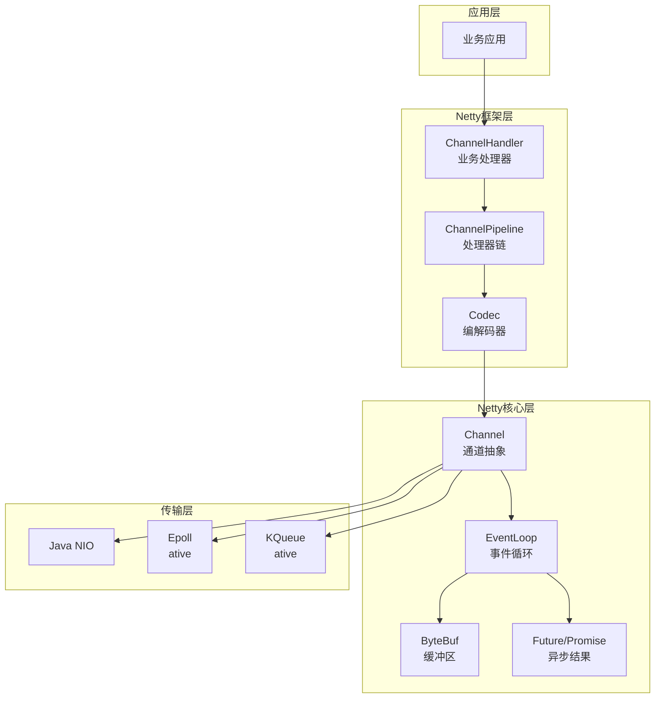
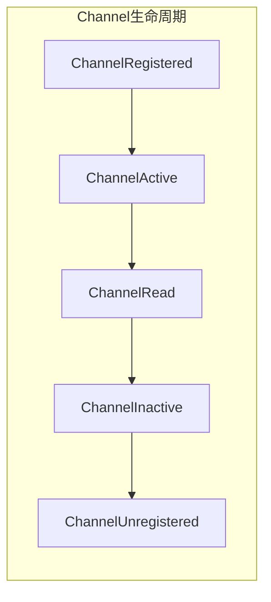
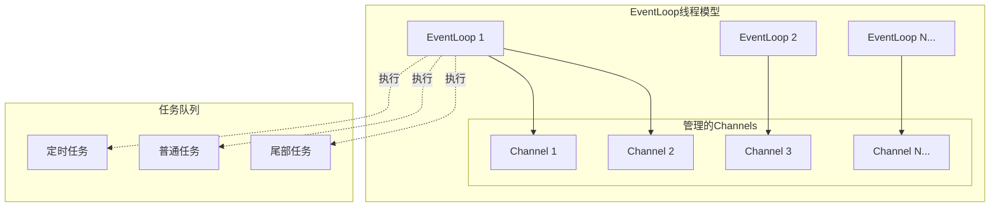
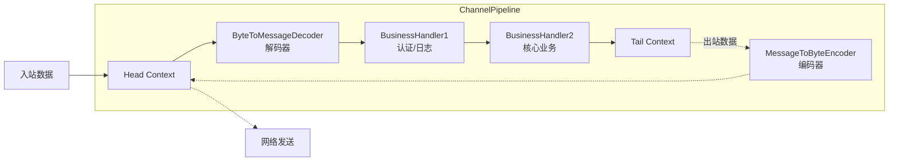
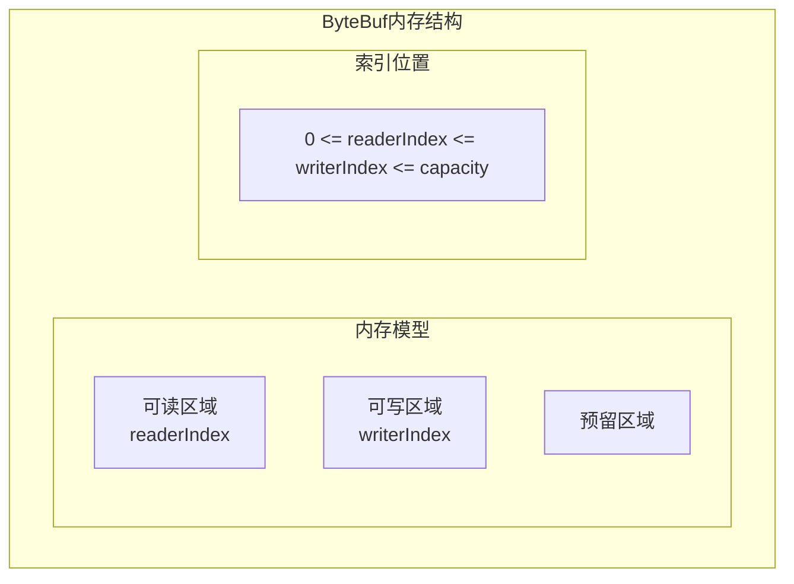
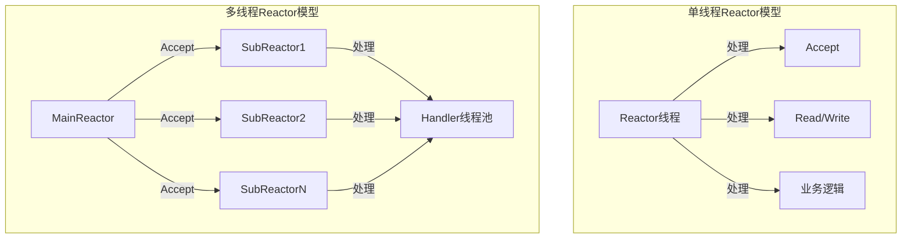

# Netty高性能网络框架

## 概述与核心概念

Netty是一个基于Java NIO的异步事件驱动网络应用框架，专为快速开发可维护的高性能协议服务器和客户端而设计。它极大地简化了TCP和UDP套接字服务器等网络编程，被广泛应用于互联网、大数据、游戏、通信等领域。

Netty由JBoss开发，现已成为最流行的Java网络编程框架之一。Facebook、Twitter、阿里巴巴、腾讯等众多大型互联网公司的核心系统都基于Netty构建。



### 核心设计哲学

| 设计原则 | 说明 |
|---------|-----|
| 异步非阻塞 | 基于Reactor模式，单线程处理海量连接 |
| 事件驱动 | 通过事件回调机制解耦I/O与业务逻辑 |
| 统一API | 屏蔽底层传输差异，OIO/NIO/AIO统一接口 |
| 零拷贝 | 支持内存映射和直接缓冲区，减少数据复制 |
| 可扩展性 | 灵活的处理器链和组件化设计 |

## 核心组件架构

### 1. Channel - 通道抽象

Channel是Netty中对网络连接的抽象，封装了Socket的I/O操作。



**主要类型：**

| Channel类型 | 说明 | 适用场景 |
|------------|-----|---------|
| NioSocketChannel | NIO客户端TCP连接 | 客户端通信 |
| NioServerSocketChannel | NIO服务端TCP监听 | 服务端监听 |
| NioDatagramChannel | NIO UDP通道 | 无连接通信 |
| EpollSocketChannel | Linux Epoll客户端 | Linux高性能场景 |
| OioSocketChannel | 阻塞IO通道 | 兼容旧系统 |

### 2. EventLoop - 事件循环

EventLoop是Netty的核心调度器，负责处理I/O事件和执行任务。



**EventLoopGroup类型：**

- **NioEventLoopGroup**：基于Java NIO，跨平台
- **EpollEventLoopGroup**：基于Linux Epoll，性能更优
- **OioEventLoopGroup**：基于阻塞IO

### 3. ChannelPipeline - 处理器链

ChannelPipeline是ChannelHandler的容器，管理处理器链的执行顺序。



### 4. ByteBuf - 增强缓冲区

Netty对Java NIO ByteBuffer的增强实现，提供更灵活的内存管理。



**ByteBuf类型对比：**

| 类型 | 存储位置 | 创建成本 | 访问速度 | 适用场景 |
|-----|---------|---------|---------|---------|
| Heap ByteBuf | JVM堆内存 | 低 | 中等 | 需要数组访问的场景 |
| Direct ByteBuf | 堆外内存 | 高 | 快 | Socket I/O传输 |
| Composite ByteBuf | 组合多个Buf | 低 | 快 | 协议拼接 |

## 工作原理

### Reactor模式实现

Netty实现了Reactor模式，支持多种线程模型：



**线程模型选择：**

| 模型 | Boss线程数 | Worker线程数 | 适用场景 |
|-----|-----------|-------------|---------|
| 单线程 | 1 | 0 | 连接数极少 |
| 多线程 | 1 | N | 一般服务端 |
| 主从多线程 | M | N | 高并发服务端 |

## 代码示例

### 基础Echo服务器

```java
import io.netty.bootstrap.ServerBootstrap;
import io.netty.buffer.ByteBuf;
import io.netty.channel.*;
import io.netty.channel.nio.NioEventLoopGroup;
import io.netty.channel.socket.SocketChannel;
import io.netty.channel.socket.nio.NioServerSocketChannel;
import io.netty.util.CharsetUtil;

/**
 * Netty Echo服务器示例
 */
public class NettyEchoServer {

    private final int port;

    public NettyEchoServer(int port) {
        this.port = port;
    }

    public void start() throws InterruptedException {
        // 创建EventLoopGroup
        EventLoopGroup bossGroup = new NioEventLoopGroup(1);  // 接收连接
        EventLoopGroup workerGroup = new NioEventLoopGroup(); // 处理I/O

        try {
            ServerBootstrap bootstrap = new ServerBootstrap();
            bootstrap.group(bossGroup, workerGroup)
                .channel(NioServerSocketChannel.class)
                .option(ChannelOption.SO_BACKLOG, 1024)
                .childOption(ChannelOption.SO_KEEPALIVE, true)
                .childOption(ChannelOption.TCP_NODELAY, true)
                .childHandler(new ChannelInitializer<SocketChannel>() {
                    @Override
                    protected void initChannel(SocketChannel ch) {
                        ChannelPipeline pipeline = ch.pipeline();
                        pipeline.addLast(new EchoServerHandler());
                    }
                });

            // 绑定端口并同步等待
            ChannelFuture future = bootstrap.bind(port).sync();
            System.out.println("Echo Server started on port " + port);

            // 等待服务器socket关闭
            future.channel().closeFuture().sync();

        } finally {
            bossGroup.shutdownGracefully();
            workerGroup.shutdownGracefully();
        }
    }

    /**
     * Echo处理器
     */
    @ChannelHandler.Sharable
    static class EchoServerHandler extends ChannelInboundHandlerAdapter {

        @Override
        public void channelRead(ChannelHandlerContext ctx, Object msg) {
            ByteBuf in = (ByteBuf) msg;
            System.out.println("Server received: " + in.toString(CharsetUtil.UTF_8));

            // 写回客户端
            ctx.write(in);
        }

        @Override
        public void channelReadComplete(ChannelHandlerContext ctx) {
            // 刷新并发送之前写入的消息
            ctx.writeAndFlush(Unpooled.EMPTY_BUFFER)
                .addListener(ChannelFutureListener.CLOSE_ON_FAILURE);
        }

        @Override
        public void exceptionCaught(ChannelHandlerContext ctx, Throwable cause) {
            cause.printStackTrace();
            ctx.close();
        }
    }

    public static void main(String[] args) throws InterruptedException {
        new NettyEchoServer(8080).start();
    }
}
```

### HTTP服务器实现

```java
import io.netty.bootstrap.ServerBootstrap;
import io.netty.buffer.Unpooled;
import io.netty.channel.*;
import io.netty.channel.nio.NioEventLoopGroup;
import io.netty.channel.socket.SocketChannel;
import io.netty.channel.socket.nio.NioServerSocketChannel;
import io.netty.handler.codec.http.*;
import io.netty.handler.logging.LogLevel;
import io.netty.handler.logging.LoggingHandler;
import io.netty.util.AsciiString;

import static io.netty.handler.codec.http.HttpResponseStatus.OK;
import static io.netty.handler.codec.http.HttpVersion.HTTP_1_1;

/**
 * Netty HTTP服务器 - 支持REST API
 */
public class NettyHttpServer {

    private final int port;

    public NettyHttpServer(int port) {
        this.port = port;
    }

    public void start() throws InterruptedException {
        EventLoopGroup bossGroup = new NioEventLoopGroup(1);
        EventLoopGroup workerGroup = new NioEventLoopGroup();

        try {
            ServerBootstrap b = new ServerBootstrap();
            b.group(bossGroup, workerGroup)
                .channel(NioServerSocketChannel.class)
                .handler(new LoggingHandler(LogLevel.INFO))
                .childHandler(new HttpServerInitializer());

            Channel ch = b.bind(port).sync().channel();
            System.out.println("HTTP Server started on http://localhost:" + port);
            ch.closeFuture().sync();

        } finally {
            bossGroup.shutdownGracefully();
            workerGroup.shutdownGracefully();
        }
    }

    static class HttpServerInitializer extends ChannelInitializer<SocketChannel> {
        @Override
        protected void initChannel(SocketChannel ch) {
            ChannelPipeline p = ch.pipeline();

            // HTTP编解码器
            p.addLast(new HttpServerCodec());
            // HTTP消息聚合器
            p.addLast(new HttpObjectAggregator(65536));
            // 支持HTTP压缩
            p.addLast(new HttpContentCompressor());
            // 业务处理器
            p.addLast(new HttpRequestHandler());
        }
    }

    static class HttpRequestHandler extends SimpleChannelInboundHandler<FullHttpRequest> {

        private static final AsciiString CONTENT_TYPE = AsciiString.cached("Content-Type");
        private static final AsciiString CONTENT_LENGTH = AsciiString.cached("Content-Length");

        @Override
        protected void channelRead0(ChannelHandlerContext ctx, FullHttpRequest req) {
            // 处理100 Continue
            if (HttpUtil.is100ContinueExpected(req)) {
                ctx.write(new DefaultFullHttpResponse(HTTP_1_1, HttpResponseStatus.CONTINUE));
            }

            // 路由处理
            String uri = req.uri();
            HttpMethod method = req.method();

            String responseContent;

            if (uri.equals("/health")) {
                responseContent = "{\"status\":\"UP\"}";
            } else if (uri.equals("/api/hello")) {
                responseContent = "{\"message\":\"Hello, Netty!\"}";
            } else if (uri.startsWith("/api/users/") && method == HttpMethod.GET) {
                String userId = uri.substring("/api/users/".length());
                responseContent = String.format("{\"id\":\"%s\",\"name\":\"User%s\"}", userId, userId);
            } else {
                responseContent = "{\"error\":\"Not Found\"}";
            }

            // 构建响应
            FullHttpResponse response = new DefaultFullHttpResponse(
                HTTP_1_1, OK,
                Unpooled.wrappedBuffer(responseContent.getBytes())
            );

            response.headers()
                .set(CONTENT_TYPE, "application/json; charset=UTF-8")
                .setInt(CONTENT_LENGTH, response.content().readableBytes());

            // 保持连接或关闭
            if (!HttpUtil.isKeepAlive(req)) {
                ctx.write(response).addListener(ChannelFutureListener.CLOSE);
            } else {
                response.headers().set(HttpHeaderNames.CONNECTION, HttpHeaderValues.KEEP_ALIVE);
                ctx.write(response);
            }
        }

        @Override
        public void channelReadComplete(ChannelHandlerContext ctx) {
            ctx.flush();
        }

        @Override
        public void exceptionCaught(ChannelHandlerContext ctx, Throwable cause) {
            cause.printStackTrace();
            ctx.close();
        }
    }

    public static void main(String[] args) throws InterruptedException {
        new NettyHttpServer(8080).start();
    }
}
```

### 协议编解码器实现

```java
import io.netty.buffer.ByteBuf;
import io.netty.channel.ChannelHandlerContext;
import io.netty.handler.codec.ByteToMessageDecoder;
import io.netty.handler.codec.MessageToByteEncoder;

import java.nio.charset.StandardCharsets;
import java.util.List;

/**
 * 自定义协议实现 - 长度字段+消息类型+内容
 *
 * 协议格式：
 * | 长度(4字节) | 消息类型(1字节) | 内容(N字节) |
 */
public class CustomProtocol {

    // 消息类型
    public static final byte TYPE_HEARTBEAT = 0x01;
    public static final byte TYPE_DATA = 0x02;
    public static final byte TYPE_COMMAND = 0x03;

    /**
     * 协议消息
     */
    public static class ProtocolMessage {
        private byte type;
        private String content;

        public ProtocolMessage(byte type, String content) {
            this.type = type;
            this.content = content;
        }

        public byte getType() { return type; }
        public String getContent() { return content; }
    }

    /**
     * 解码器
     */
    public static class ProtocolDecoder extends ByteToMessageDecoder {

        @Override
        protected void decode(ChannelHandlerContext ctx, ByteBuf in, List<Object> out) {
            // 至少需要有4字节长度信息
            if (in.readableBytes() < 4) {
                return;
            }

            in.markReaderIndex();
            int length = in.readInt();

            // 数据不完整，等待更多数据
            if (in.readableBytes() < length) {
                in.resetReaderIndex();
                return;
            }

            // 读取消息类型
            byte type = in.readByte();
            // 读取内容
            byte[] contentBytes = new byte[length - 1];
            in.readBytes(contentBytes);
            String content = new String(contentBytes, StandardCharsets.UTF_8);

            out.add(new ProtocolMessage(type, content));
        }
    }

    /**
     * 编码器
     */
    public static class ProtocolEncoder extends MessageToByteEncoder<ProtocolMessage> {

        @Override
        protected void encode(ChannelHandlerContext ctx, ProtocolMessage msg, ByteBuf out) {
            byte[] contentBytes = msg.getContent().getBytes(StandardCharsets.UTF_8);
            int length = 1 + contentBytes.length; // 类型(1) + 内容(N)

            out.writeInt(length);
            out.writeByte(msg.getType());
            out.writeBytes(contentBytes);
        }
    }
}
```

### 完整RPC服务器示例

```java
import io.netty.bootstrap.ServerBootstrap;
import io.netty.channel.*;
import io.netty.channel.nio.NioEventLoopGroup;
import io.netty.channel.socket.SocketChannel;
import io.netty.channel.socket.nio.NioServerSocketChannel;
import io.netty.handler.codec.LengthFieldBasedFrameDecoder;
import io.netty.handler.codec.LengthFieldPrepender;
import io.netty.handler.timeout.IdleStateEvent;
import io.netty.handler.timeout.IdleStateHandler;

import java.util.concurrent.ConcurrentHashMap;
import java.util.concurrent.TimeUnit;

/**
 * Netty RPC服务器完整实现
 */
public class NettyRPCServer {

    private final int port;
    private final ServiceRegistry registry;

    public NettyRPCServer(int port) {
        this.port = port;
        this.registry = new ServiceRegistry();
    }

    public <T> void registerService(Class<T> interfaceClass, T implementation) {
        registry.register(interfaceClass.getName(), implementation);
    }

    public void start() throws InterruptedException {
        EventLoopGroup bossGroup = new NioEventLoopGroup(1);
        EventLoopGroup workerGroup = new NioEventLoopGroup();

        try {
            ServerBootstrap bootstrap = new ServerBootstrap();
            bootstrap.group(bossGroup, workerGroup)
                .channel(NioServerSocketChannel.class)
                .childHandler(new ChannelInitializer<SocketChannel>() {
                    @Override
                    protected void initChannel(SocketChannel ch) {
                        ChannelPipeline pipeline = ch.pipeline();

                        // 心跳检测 - 60秒无读事件则触发
                        pipeline.addLast(new IdleStateHandler(
                            60, 0, 0, TimeUnit.SECONDS));

                        // 解决粘包/拆包问题 - 长度字段编解码
                        pipeline.addLast(new LengthFieldBasedFrameDecoder(
                            65536, 0, 4, 0, 4));
                        pipeline.addLast(new LengthFieldPrepender(4));

                        // 自定义协议编解码（使用前面的Protocol类）
                        pipeline.addLast(new CustomProtocol.ProtocolDecoder());
                        pipeline.addLast(new CustomProtocol.ProtocolEncoder());

                        // 业务处理器
                        pipeline.addLast(new RPCServerHandler(registry));
                    }
                });

            ChannelFuture future = bootstrap.bind(port).sync();
            System.out.println("RPC Server started on port " + port);
            future.channel().closeFuture().sync();

        } finally {
            bossGroup.shutdownGracefully();
            workerGroup.shutdownGracefully();
        }
    }

    /**
     * 服务注册表
     */
    static class ServiceRegistry {
        private final ConcurrentHashMap<String, Object> services = new ConcurrentHashMap<>();

        public void register(String name, Object service) {
            services.put(name, service);
        }

        public Object get(String name) {
            return services.get(name);
        }
    }

    /**
     * RPC请求处理器
     */
    static class RPCServerHandler extends SimpleChannelInboundHandler<CustomProtocol.ProtocolMessage> {

        private final ServiceRegistry registry;

        public RPCServerHandler(ServiceRegistry registry) {
            this.registry = registry;
        }

        @Override
        protected void channelRead0(ChannelHandlerContext ctx, CustomProtocol.ProtocolMessage msg) {
            // 处理心跳
            if (msg.getType() == CustomProtocol.TYPE_HEARTBEAT) {
                ctx.writeAndFlush(new CustomProtocol.ProtocolMessage(
                    CustomProtocol.TYPE_HEARTBEAT, "PONG"
                ));
                return;
            }

            // 处理RPC请求
            if (msg.getType() == CustomProtocol.TYPE_DATA) {
                String response = processRequest(msg.getContent());
                ctx.writeAndFlush(new CustomProtocol.ProtocolMessage(
                    CustomProtocol.TYPE_DATA, response
                ));
            }
        }

        private String processRequest(String request) {
            // 简化的RPC处理逻辑
            // 实际实现需要解析请求、调用服务、序列化响应
            return "Response: " + request;
        }

        @Override
        public void userEventTriggered(ChannelHandlerContext ctx, Object evt) throws Exception {
            if (evt instanceof IdleStateEvent) {
                IdleStateEvent event = (IdleStateEvent) evt;
                if (event.state() == IdleStateEvent.READER_IDLE_STATE_EVENT.state()) {
                    System.out.println("Client idle, closing connection: " + ctx.channel());
                    ctx.close();
                }
            } else {
                super.userEventTriggered(ctx, evt);
            }
        }

        @Override
        public void exceptionCaught(ChannelHandlerContext ctx, Throwable cause) {
            cause.printStackTrace();
            ctx.close();
        }
    }
}
```

## 配置优化指南

### 服务器端优化配置

```java
ServerBootstrap bootstrap = new ServerBootstrap();
bootstrap.group(bossGroup, workerGroup)
    // 连接队列大小
    .option(ChannelOption.SO_BACKLOG, 1024)
    // 允许端口复用
    .option(ChannelOption.SO_REUSEADDR, true)
    // 保持连接
    .childOption(ChannelOption.SO_KEEPALIVE, true)
    // 禁用Nagle算法，降低延迟
    .childOption(ChannelOption.TCP_NODELAY, true)
    // 发送缓冲区大小
    .childOption(ChannelOption.SO_SNDBUF, 65536)
    // 接收缓冲区大小
    .childOption(ChannelOption.SO_RCVBUF, 65536)
    // 使用堆外内存
    .childOption(ChannelOption.ALLOCATOR, PooledByteBufAllocator.DEFAULT);
```

### EventLoopGroup线程数配置

```java
// CPU核心数
int cpuCores = Runtime.getRuntime().availableProcessors();

// Boss线程：1个足够，只处理连接建立
EventLoopGroup bossGroup = new NioEventLoopGroup(1);

// Worker线程：默认2*CPU核心数，I/O密集型可调整
EventLoopGroup workerGroup = new NioEventLoopGroup(cpuCores * 2);
```

## 优缺点分析

| 特性 | 优势 | 劣势 |
|-----|-----|-----|
| 性能 | 单线程可处理10万+并发连接 | 学习曲线陡峭 |
| 内存 | 零拷贝减少GC压力 | 内存管理需要谨慎 |
| 扩展性 | 灵活的处理器链机制 | 调试相对复杂 |
| 兼容性 | 统一API支持多种传输 | 仅支持Java生态 |
| 成熟度 | 经过大规模生产验证 | 需要理解NIO原理 |

## 应用场景

1. **RPC框架**：Dubbo、gRPC的Java实现都基于Netty
2. **消息队列**：RocketMQ、ActiveMQ的网络层
3. **游戏服务器**：实时多人游戏的通信层
4. **API网关**：Spring Cloud Gateway、Zuul
5. **大数据传输**：Flink、Spark的网络通信
6. **数据库中间件**：ShardingSphere、MyCAT

## 总结

Netty通过精心设计的异步事件驱动架构，为Java开发者提供了构建高性能网络应用的能力。其核心优势在于：

- **高性能**：单线程处理海量连接，内存池减少GC
- **易用性**：封装NIO复杂性，提供流畅的API
- **灵活性**：可插拔的处理器链，支持各种协议
- **生产验证**：被众多大厂核心系统采用

对于需要构建高并发、低延迟网络服务的场景，Netty是Java生态的首选框架。掌握Netty不仅能提升开发效率，更能深入理解高性能网络编程的核心原理。
