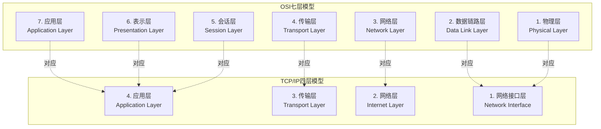
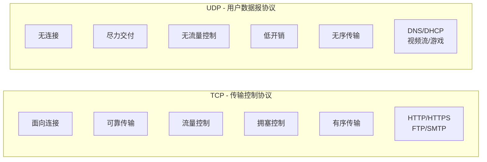
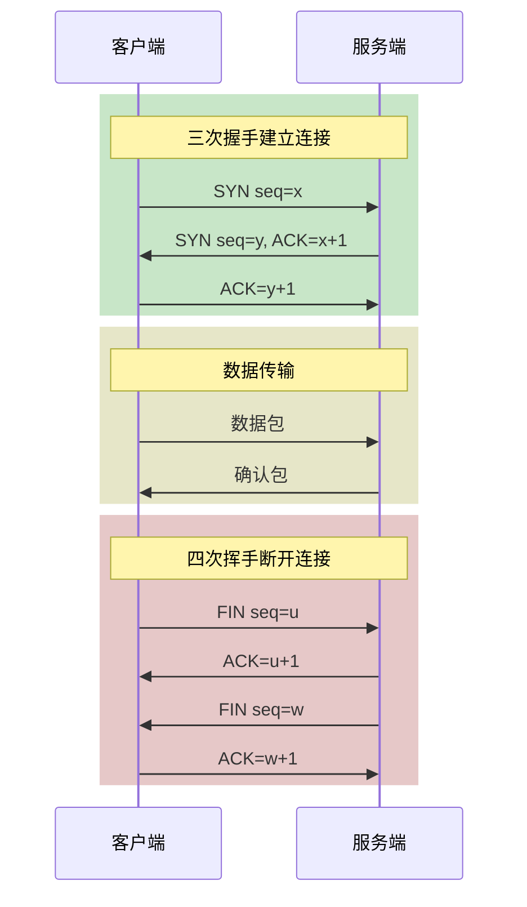
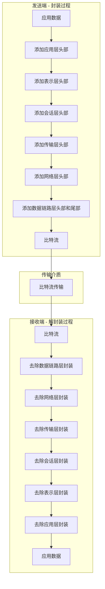

# OSI与TCP-IP模型

## 概述与核心概念

计算机网络通信模型是理解分布式系统中节点间如何交换数据的基础。OSI（Open Systems Interconnection，开放系统互连）七层模型和TCP/IP四层模型是两种最经典的网络架构参考模型，它们为网络协议的设计、实现和故障排查提供了理论框架。

### OSI七层模型

OSI模型由国际标准化组织（ISO）于1984年提出，将网络通信过程划分为七个抽象层次，每一层负责特定的功能，层与层之间通过定义良好的接口进行交互。



### TCP/IP四层模型

TCP/IP模型起源于ARPANET项目，是互联网实际采用的网络架构。相比OSI模型，TCP/IP更加简洁实用，将七层压缩为四层，直接对应实际的网络协议实现。

## 各层详解

### 1. 物理层（Physical Layer）

物理层是OSI模型的最底层，负责在物理介质上传输原始比特流。它定义了电气特性、机械特性、功能特性和规程特性。

**核心功能：**

- 比特编码与解码
- 时钟同步
- 物理拓扑结构定义
- 传输模式（单工、半双工、全双工）

**典型设备：** 网线、光纤、集线器、中继器、调制解调器

**传输介质对比：**

| 介质类型 | 传输速率 | 传输距离 | 抗干扰性 | 成本 |
|---------|---------|---------|---------|-----|
| 双绞线 | 1Gbps-10Gbps | 100m | 中等 | 低 |
| 同轴电缆 | 10Mbps-1Gbps | 500m | 较好 | 中等 |
| 光纤（单模） | 10Gbps-100Gbps | 数十公里 | 极佳 | 高 |
| 光纤（多模） | 1Gbps-10Gbps | 2km | 良好 | 中等 |

### 2. 数据链路层（Data Link Layer）

数据链路层在物理层提供的比特流传输服务基础上，建立节点间的数据链路，将比特组织成帧进行传输。

**核心功能：**

- 帧封装与解封装
- MAC地址寻址
- 差错检测（CRC校验）
- 流量控制
- 介质访问控制

**子层划分：**

```
┌─────────────────────────────────────┐
│         LLC子层（逻辑链路控制）      │
│    - 提供统一的接口给网络层         │
│    - 差错控制、流量控制             │
├─────────────────────────────────────┤
│         MAC子层（介质访问控制）      │
│    - MAC地址管理                    │
│    - 介质访问协议（CSMA/CD等）      │
└─────────────────────────────────────┘
```

**典型协议：** Ethernet、PPP、HDLC、帧中继

**MAC地址格式：**

```
示例：00:1A:2B:3C:4D:5E

┌──────────────────┬─────────────────────┐
│   OUI (3字节)     │   设备标识 (3字节)   │
│  厂商唯一标识     │  厂商分配的设备编号  │
└──────────────────┴─────────────────────┘
```

### 3. 网络层（Network Layer）

网络层负责将数据从源主机传输到目的主机，处理跨网络的路由选择和逻辑寻址。

**核心功能：**

- 逻辑寻址（IP地址）
- 路由选择与分组转发
- 拥塞控制
- 异构网络互联

**IP地址分类（IPv4）：**

| 类别 | 地址范围 | 默认掩码 | 网络数量 | 主机数量 |
|-----|---------|---------|---------|---------|
| A类 | 1.0.0.0 - 126.255.255.255 | 255.0.0.0 | 126 | 16,777,214 |
| B类 | 128.0.0.0 - 191.255.255.255 | 255.255.0.0 | 16,384 | 65,534 |
| C类 | 192.0.0.0 - 223.255.255.255 | 255.255.255.0 | 2,097,152 | 254 |
| D类 | 224.0.0.0 - 239.255.255.255 | 组播地址 | - | - |
| E类 | 240.0.0.0 - 255.255.255.255 | 保留地址 | - | - |

**路由协议对比：**

| 协议类型 | 代表协议 | 特点 | 适用场景 |
|---------|---------|-----|---------|
| 距离向量 | RIP | 简单易配置，收敛慢 | 小型网络 |
| 链路状态 | OSPF | 快速收敛，支持大规模 | 企业网络 |
| 路径向量 | BGP | 支持策略路由，用于自治系统间 | 互联网骨干 |

### 4. 传输层（Transport Layer）

传输层为应用进程提供端到端的通信服务，是OSI模型中最关键的一层，直接影响应用性能和可靠性。

**核心功能：**

- 端口寻址（区分不同应用进程）
- 可靠传输与不可靠传输
- 流量控制与拥塞控制
- 分段与重组

**TCP vs UDP对比：**



| 特性 | TCP | UDP |
|-----|-----|-----|
| 连接方式 | 面向连接 | 无连接 |
| 可靠性 | 可靠（确认、重传） | 不可靠 |
| 有序性 | 保证顺序 | 不保证 |
| 拥塞控制 | 有 | 无 |
| 头部开销 | 20字节 | 8字节 |
| 传输效率 | 较低 | 高 |
| 应用场景 | 文件传输、网页浏览 | 实时音视频、DNS |

**TCP三次握手与四次挥手：**



### 5. 会话层（Session Layer）

会话层负责建立、管理和终止会话（session），协调不同主机上应用程序之间的对话。

**核心功能：**

- 会话建立与终止
- 会话同步（检查点）
- 对话控制（单工/半双工/全双工）
- 活动管理

**典型协议：** NetBIOS、RPC、SQL会话

### 6. 表示层（Presentation Layer）

表示层处理数据表示格式的转换，确保不同系统能够正确理解交换的数据。

**核心功能：**

- 数据格式转换
- 加密与解密
- 压缩与解压缩
- 字符编码转换

**典型标准：**

- 加密：SSL/TLS、AES、RSA
- 编码：ASCII、Unicode、Base64
- 压缩：gzip、deflate

### 7. 应用层（Application Layer）

应用层是OSI模型的最高层，直接为用户应用程序提供网络服务接口。

**核心功能：**

- 提供网络服务接口
- 实现特定应用协议
- 用户认证与授权

**常见应用层协议：**

| 协议 | 端口 | 功能 | 传输层协议 |
|-----|-----|-----|----------|
| HTTP | 80 | 超文本传输 | TCP |
| HTTPS | 443 | 安全HTTP | TCP |
| FTP | 20/21 | 文件传输 | TCP |
| SSH | 22 | 安全Shell | TCP |
| DNS | 53 | 域名解析 | UDP/TCP |
| SMTP | 25 | 邮件发送 | TCP |
| DHCP | 67/68 | 动态IP分配 | UDP |

## 数据封装过程

数据在发送端自上而下逐层封装，在接收端自下而上逐层解封装：



## 代码示例

### Python Socket编程示例

```python
import socket
import threading

# TCP服务器
class TCPServer:
    def __init__(self, host='0.0.0.0', port=8080):
        self.host = host
        self.port = port
        self.server_socket = socket.socket(socket.AF_INET, socket.SOCK_STREAM)
        self.server_socket.setsockopt(socket.SOL_SOCKET, socket.SO_REUSEADDR, 1)

    def start(self):
        self.server_socket.bind((self.host, self.port))
        self.server_socket.listen(5)
        print(f"TCP Server listening on {self.host}:{self.port}")

        while True:
            client_socket, addr = self.server_socket.accept()
            print(f"Connection from {addr}")
            client_thread = threading.Thread(
                target=self.handle_client,
                args=(client_socket, addr)
            )
            client_thread.start()

    def handle_client(self, client_socket, addr):
        try:
            while True:
                data = client_socket.recv(1024)
                if not data:
                    break
                print(f"Received from {addr}: {data.decode()}")
                response = f"Echo: {data.decode()}".encode()
                client_socket.send(response)
        except Exception as e:
            print(f"Error handling client {addr}: {e}")
        finally:
            client_socket.close()

# TCP客户端
def tcp_client():
    client = socket.socket(socket.AF_INET, socket.SOCK_STREAM)
    client.connect(('localhost', 8080))

    message = "Hello, TCP/IP!"
    client.send(message.encode())

    response = client.recv(1024)
    print(f"Server response: {response.decode()}")

    client.close()

# UDP服务器
def udp_server():
    server = socket.socket(socket.AF_INET, socket.SOCK_DGRAM)
    server.bind(('0.0.0.0', 8081))
    print("UDP Server listening on port 8081")

    while True:
        data, addr = server.recvfrom(1024)
        print(f"Received from {addr}: {data.decode()}")
        server.sendto(f"Echo: {data.decode()}".encode(), addr)

# UDP客户端
def udp_client():
    client = socket.socket(socket.AF_INET, socket.SOCK_DGRAM)
    client.sendto("Hello, UDP!".encode(), ('localhost', 8081))

    data, server = client.recvfrom(1024)
    print(f"Server response: {data.decode()}")
    client.close()
```

### Go Socket编程示例

```go
package main

import (
    "bufio"
    "fmt"
    "net"
    "strings"
)

// TCPServer 创建TCP服务器
func TCPServer() {
    listener, err := net.Listen("tcp", ":8080")
    if err != nil {
        panic(err)
    }
    defer listener.Close()

    fmt.Println("TCP Server listening on :8080")

    for {
        conn, err := listener.Accept()
        if err != nil {
            continue
        }
        go handleConnection(conn)
    }
}

func handleConnection(conn net.Conn) {
    defer conn.Close()
    reader := bufio.NewReader(conn)

    for {
        message, err := reader.ReadString('\n')
        if err != nil {
            return
        }

        message = strings.TrimSpace(message)
        fmt.Printf("Received: %s\n", message)

        response := fmt.Sprintf("Echo: %s\n", message)
        conn.Write([]byte(response))
    }
}

// TCPClient TCP客户端
func TCPClient() {
    conn, err := net.Dial("tcp", "localhost:8080")
    if err != nil {
        panic(err)
    }
    defer conn.Close()

    message := "Hello, TCP/IP!\n"
    conn.Write([]byte(message))

    buffer := make([]byte, 1024)
    n, _ := conn.Read(buffer)
    fmt.Printf("Server: %s", string(buffer[:n]))
}
```

## OSI与TCP/IP模型对比

| 对比维度 | OSI七层模型 | TCP/IP四层模型 |
|---------|------------|---------------|
| 设计哲学 | 理论先行，通用性强 | 实践驱动，实用性强 |
| 层数 | 7层 | 4层 |
| 协议独立性 | 独立于协议 | 与协议紧密绑定 |
| 实际应用 | 主要作为教学参考 | 互联网实际标准 |
| 网络层 | 支持多种协议 | 仅IP协议 |
| 传输层 | 支持多种协议 | 仅TCP和UDP |
| 通用性 | 更通用 | 针对互联网优化 |

## 分布式系统中的应用

在分布式计算环境中，理解网络模型至关重要：

1. **服务通信**：微服务间通过应用层协议（HTTP/gRPC）通信
2. **负载均衡**：在传输层（L4）或应用层（L7）进行流量分发
3. **网络分区**：网络层故障可能导致CAP理论中的分区容错
4. **性能优化**：理解各层开销，优化传输效率
5. **安全设计**：在表示层实现加密，网络层实现访问控制

## 总结

OSI七层模型和TCP/IP四层模型为理解网络通信提供了理论基础。在分布式系统开发中，开发者需要：

- 掌握传输层TCP/UDP的选择原则
- 理解网络层路由和IP地址规划
- 熟悉应用层常用协议的工作机制
- 根据应用场景选择合适的网络技术栈

通过对网络模型的深入理解，可以更好地设计、实现和优化分布式系统中的通信组件。
