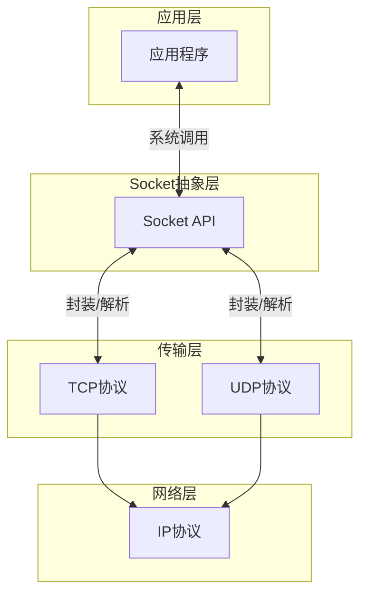
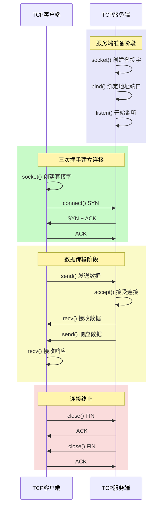
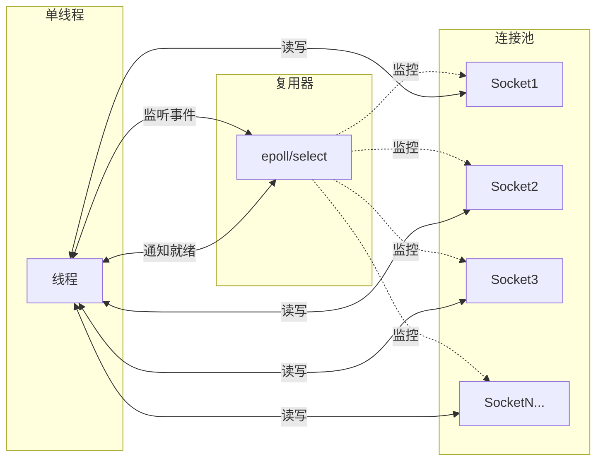
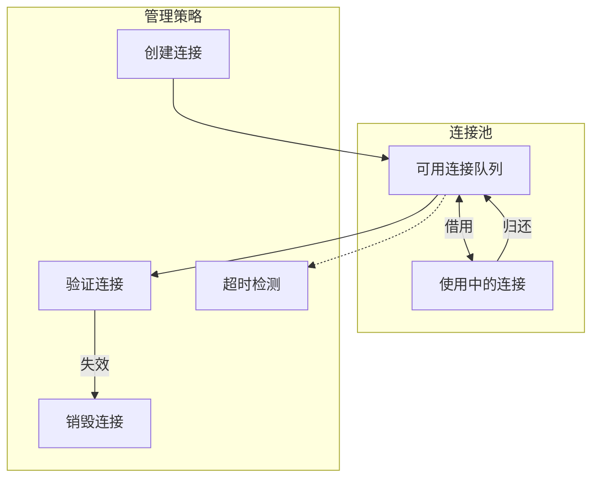

# Socket编程详解

## 概述与核心概念

Socket（套接字）是网络通信的端点抽象，是应用层与TCP/IP协议族通信的中间软件抽象层。Socket提供了一组API，使得应用程序能够通过网络发送和接收数据，是构建网络应用程序的基础。

Socket一词源自英语"插座"，形象地表达了其作为通信端点的角色——就像电源插座连接电器与电网一样，Socket连接应用程序与网络协议栈。



### Socket类型

根据传输层协议的不同，Socket主要分为两种类型：

| Socket类型 | 协议 | 特点 | 适用场景 |
|-----------|-----|-----|---------|
| 流式Socket (SOCK_STREAM) | TCP | 面向连接、可靠、有序 | 文件传输、HTTP、数据库连接 |
| 数据报Socket (SOCK_DGRAM) | UDP | 无连接、不可靠、高效 | 视频流、DNS、实时游戏 |

此外，还有原始Socket（SOCK_RAW），允许直接访问底层协议，用于开发ping、traceroute等网络工具。

## Socket通信模型

### TCP Socket通信流程



### Socket核心API详解

#### 1. socket() - 创建套接字

```c
int socket(int domain, int type, int protocol);
```

**参数说明：**

- `domain`：协议族（AF_INET for IPv4, AF_INET6 for IPv6, AF_UNIX for 本地通信）
- `type`：Socket类型（SOCK_STREAM, SOCK_DGRAM, SOCK_RAW）
- `protocol`：具体协议（通常设为0，自动选择）

**返回值：** 非负描述符表示成功，-1表示失败

#### 2. bind() - 绑定地址

```c
int bind(int sockfd, const struct sockaddr *addr, socklen_t addrlen);
```

将套接字与特定的IP地址和端口号绑定，使客户端能够定位到该服务。

#### 3. listen() - 监听连接

```c
int listen(int sockfd, int backlog);
```

将套接字置于被动监听模式，`backlog`指定连接请求队列的最大长度。

#### 4. accept() - 接受连接

```c
int accept(int sockfd, struct sockaddr *addr, socklen_t *addrlen);
```

从已完成连接队列中取出一个连接，创建新的套接字用于与客户端通信。

#### 5. connect() - 发起连接

```c
int connect(int sockfd, const struct sockaddr *addr, socklen_t addrlen);
```

客户端使用此函数向服务端发起连接请求。

#### 6. send()/recv() - 数据收发

```c
ssize_t send(int sockfd, const void *buf, size_t len, int flags);
ssize_t recv(int sockfd, void *buf, size_t len, int flags);
```

#### 7. close() - 关闭套接字

```c
int close(int sockfd);
```

关闭套接字，释放资源，终止连接。

## 代码示例

### Java NIO Socket示例

```java
import java.io.IOException;
import java.net.InetSocketAddress;
import java.nio.ByteBuffer;
import java.nio.channels.*;
import java.util.Iterator;
import java.util.Set;

/**
 * Java NIO Socket服务器 - 支持多路复用
 */
public class NIOSocketServer {
    private Selector selector;
    private ServerSocketChannel serverChannel;
    private ByteBuffer buffer = ByteBuffer.allocate(1024);

    public void start(int port) throws IOException {
        // 创建Selector
        selector = Selector.open();

        // 创建ServerSocketChannel
        serverChannel = ServerSocketChannel.open();
        serverChannel.bind(new InetSocketAddress(port));
        serverChannel.configureBlocking(false);

        // 注册到Selector，监听ACCEPT事件
        serverChannel.register(selector, SelectionKey.OP_ACCEPT);

        System.out.println("NIO Server started on port " + port);

        while (true) {
            // 阻塞等待就绪事件
            selector.select();

            Set<SelectionKey> selectedKeys = selector.selectedKeys();
            Iterator<SelectionKey> iter = selectedKeys.iterator();

            while (iter.hasNext()) {
                SelectionKey key = iter.next();

                if (key.isAcceptable()) {
                    handleAccept(key);
                } else if (key.isReadable()) {
                    handleRead(key);
                } else if (key.isWritable()) {
                    handleWrite(key);
                }

                iter.remove();
            }
        }
    }

    private void handleAccept(SelectionKey key) throws IOException {
        ServerSocketChannel server = (ServerSocketChannel) key.channel();
        SocketChannel client = server.accept();
        client.configureBlocking(false);

        // 注册读事件
        client.register(selector, SelectionKey.OP_READ);
        System.out.println("Client connected: " + client.getRemoteAddress());
    }

    private void handleRead(SelectionKey key) throws IOException {
        SocketChannel client = (SocketChannel) key.channel();
        buffer.clear();

        int bytesRead = client.read(buffer);
        if (bytesRead == -1) {
            // 连接关闭
            key.cancel();
            client.close();
            return;
        }

        buffer.flip();
        byte[] data = new byte[buffer.remaining()];
        buffer.get(data);
        String message = new String(data);
        System.out.println("Received: " + message);

        // 准备响应
        buffer.clear();
        buffer.put(("Echo: " + message).getBytes());
        buffer.flip();

        // 切换为写模式
        key.interestOps(SelectionKey.OP_WRITE);
        key.attach(buffer);
    }

    private void handleWrite(SelectionKey key) throws IOException {
        SocketChannel client = (SocketChannel) key.channel();
        ByteBuffer buf = (ByteBuffer) key.attachment();

        client.write(buf);

        if (!buf.hasRemaining()) {
            // 写完成，切回读模式
            key.interestOps(SelectionKey.OP_READ);
            key.attach(null);
        }
    }

    public static void main(String[] args) throws IOException {
        new NIOSocketServer().start(8080);
    }
}
```

### Go Socket编程示例

```go
package main

import (
    "bufio"
    "fmt"
    "net"
    "strings"
    "sync"
    "time"
)

// ConnectionPool 连接池管理
type ConnectionPool struct {
    mu          sync.RWMutex
    connections map[string]net.Conn
    maxSize     int
}

func NewConnectionPool(maxSize int) *ConnectionPool {
    return &ConnectionPool{
        connections: make(map[string]net.Conn),
        maxSize:     maxSize,
    }
}

func (p *ConnectionPool) Add(key string, conn net.Conn) bool {
    p.mu.Lock()
    defer p.mu.Unlock()

    if len(p.connections) >= p.maxSize {
        return false
    }

    p.connections[key] = conn
    return true
}

func (p *ConnectionPool) Get(key string) (net.Conn, bool) {
    p.mu.RLock()
    defer p.mu.RUnlock()

    conn, exists := p.connections[key]
    return conn, exists
}

func (p *ConnectionPool) Remove(key string) {
    p.mu.Lock()
    defer p.mu.Unlock()

    if conn, exists := p.connections[key]; exists {
        conn.Close()
        delete(p.connections, key)
    }
}

// TCPServer TCP服务器实现
type TCPServer struct {
    address string
    pool    *ConnectionPool
}

func NewTCPServer(address string) *TCPServer {
    return &TCPServer{
        address: address,
        pool:    NewConnectionPool(1000),
    }
}

func (s *TCPServer) Start() error {
    listener, err := net.Listen("tcp", s.address)
    if err != nil {
        return fmt.Errorf("failed to listen: %v", err)
    }
    defer listener.Close()

    fmt.Printf("TCP Server listening on %s\n", s.address)

    for {
        conn, err := listener.Accept()
        if err != nil {
            fmt.Printf("Accept error: %v\n", err)
            continue
        }

        go s.handleConnection(conn)
    }
}

func (s *TCPServer) handleConnection(conn net.Conn) {
    defer conn.Close()

    remoteAddr := conn.RemoteAddr().String()
    fmt.Printf("New connection from: %s\n", remoteAddr)

    // 设置超时
    conn.SetReadDeadline(time.Now().Add(30 * time.Second))

    scanner := bufio.NewScanner(conn)
    for scanner.Scan() {
        message := scanner.Text()
        fmt.Printf("Received from %s: %s\n", remoteAddr, message)

        // 处理消息
        response := s.processMessage(message)

        // 发送响应
        _, err := conn.Write([]byte(response + "\n"))
        if err != nil {
            fmt.Printf("Write error: %v\n", err)
            return
        }

        // 重置读取超时
        conn.SetReadDeadline(time.Now().Add(30 * time.Second))
    }

    if err := scanner.Err(); err != nil {
        fmt.Printf("Read error from %s: %v\n", remoteAddr, err)
    }

    fmt.Printf("Connection closed: %s\n", remoteAddr)
}

func (s *TCPServer) processMessage(message string) string {
    // 简单的消息处理逻辑
    message = strings.TrimSpace(message)

    switch strings.ToUpper(message) {
    case "PING":
        return "PONG"
    case "TIME":
        return time.Now().Format(time.RFC3339)
    case "QUIT":
        return "BYE"
    default:
        return fmt.Sprintf("Echo: %s", message)
    }
}

// TCPClient TCP客户端实现
type TCPClient struct {
    address string
    conn    net.Conn
    reader  *bufio.Reader
    writer  *bufio.Writer
}

func NewTCPClient(address string) *TCPClient {
    return &TCPClient{
        address: address,
    }
}

func (c *TCPClient) Connect() error {
    conn, err := net.Dial("tcp", c.address)
    if err != nil {
        return err
    }

    c.conn = conn
    c.reader = bufio.NewReader(conn)
    c.writer = bufio.NewWriter(conn)

    return nil
}

func (c *TCPClient) Send(message string) (string, error) {
    // 发送消息
    _, err := c.writer.WriteString(message + "\n")
    if err != nil {
        return "", err
    }
    err = c.writer.Flush()
    if err != nil {
        return "", err
    }

    // 读取响应
    response, err := c.reader.ReadString('\n')
    if err != nil {
        return "", err
    }

    return strings.TrimSpace(response), nil
}

func (c *TCPClient) Close() {
    if c.conn != nil {
        c.conn.Close()
    }
}

// UDP实现
func UDPServer(address string) {
    addr, _ := net.ResolveUDPAddr("udp", address)
    conn, err := net.ListenUDP("udp", addr)
    if err != nil {
        panic(err)
    }
    defer conn.Close()

    fmt.Printf("UDP Server listening on %s\n", address)

    buffer := make([]byte, 1024)
    for {
        n, clientAddr, err := conn.ReadFromUDP(buffer)
        if err != nil {
            continue
        }

        message := string(buffer[:n])
        fmt.Printf("Received from %s: %s\n", clientAddr, message)

        response := fmt.Sprintf("UDP Echo: %s", message)
        conn.WriteToUDP([]byte(response), clientAddr)
    }
}
```

### Python高级Socket示例

```python
import socket
import select
import threading
import queue
from typing import Callable, Optional
import json

class AsyncSocketServer:
    """
    异步Socket服务器 - 使用select实现I/O多路复用
    """

    def __init__(self, host='0.0.0.0', port=8080):
        self.host = host
        self.port = port
        self.server_socket = None
        self.inputs = []  # 可读socket列表
        self.outputs = []  # 可写socket列表
        self.message_queues = {}  # 每个socket的消息队列
        self.running = False
        self.handlers: dict[str, Callable] = {}

    def register_handler(self, command: str, handler: Callable):
        """注册命令处理器"""
        self.handlers[command] = handler

    def start(self):
        """启动服务器"""
        self.server_socket = socket.socket(socket.AF_INET, socket.SOCK_STREAM)
        self.server_socket.setsockopt(socket.SOL_SOCKET, socket.SO_REUSEADDR, 1)
        self.server_socket.setblocking(False)

        self.server_socket.bind((self.host, self.port))
        self.server_socket.listen(100)

        self.inputs.append(self.server_socket)
        self.running = True

        print(f"Async Server started on {self.host}:{self.port}")

        try:
            self._event_loop()
        except KeyboardInterrupt:
            self.stop()

    def _event_loop(self):
        """事件循环"""
        while self.running:
            # 使用select监听socket事件
            readable, writable, exceptional = select.select(
                self.inputs, self.outputs, self.inputs, 1.0
            )

            # 处理可读socket
            for sock in readable:
                if sock is self.server_socket:
                    # 新连接
                    client_socket, address = sock.accept()
                    client_socket.setblocking(False)
                    self.inputs.append(client_socket)
                    self.message_queues[client_socket] = queue.Queue()
                    print(f"New connection from {address}")
                else:
                    # 接收数据
                    data = sock.recv(4096)
                    if data:
                        self._handle_data(sock, data)
                    else:
                        # 连接关闭
                        self._close_connection(sock)

            # 处理可写socket
            for sock in writable:
                try:
                    msg_queue = self.message_queues[sock]
                    if not msg_queue.empty():
                        message = msg_queue.get_nowait()
                        sock.send(message)
                    else:
                        self.outputs.remove(sock)
                except queue.Empty:
                    self.outputs.remove(sock)

            # 处理异常socket
            for sock in exceptional:
                self._close_connection(sock)

    def _handle_data(self, sock: socket.socket, data: bytes):
        """处理接收到的数据"""
        try:
            message = json.loads(data.decode('utf-8'))
            command = message.get('command')
            params = message.get('params', {})

            if command in self.handlers:
                response = self.handlers[command](params)
            else:
                response = {'status': 'error', 'message': 'Unknown command'}

            # 放入发送队列
            response_data = json.dumps(response).encode('utf-8')
            self.message_queues[sock].put(response_data)

            if sock not in self.outputs:
                self.outputs.append(sock)

        except json.JSONDecodeError:
            error_response = json.dumps({
                'status': 'error',
                'message': 'Invalid JSON'
            }).encode('utf-8')
            self.message_queues[sock].put(error_response)
            if sock not in self.outputs:
                self.outputs.append(sock)

    def _close_connection(self, sock: socket.socket):
        """关闭连接"""
        print(f"Closing connection: {sock.getpeername()}")
        if sock in self.inputs:
            self.inputs.remove(sock)
        if sock in self.outputs:
            self.outputs.remove(sock)
        sock.close()
        del self.message_queues[sock]

    def stop(self):
        """停止服务器"""
        self.running = False
        for sock in self.inputs:
            sock.close()
        print("Server stopped")


class SocketClient:
    """
    高级Socket客户端 - 支持重连和心跳
    """

    def __init__(self, host='localhost', port=8080):
        self.host = host
        self.port = port
        self.socket: Optional[socket.socket] = None
        self.connected = False
        self.reconnect_interval = 5
        self.max_retries = 3
        self.heartbeat_interval = 30
        self._stop_event = threading.Event()

    def connect(self) -> bool:
        """建立连接"""
        retries = 0
        while retries < self.max_retries and not self._stop_event.is_set():
            try:
                self.socket = socket.socket(socket.AF_INET, socket.SOCK_STREAM)
                self.socket.connect((self.host, self.port))
                self.socket.settimeout(10)
                self.connected = True

                # 启动心跳线程
                self._start_heartbeat()

                print(f"Connected to {self.host}:{self.port}")
                return True

            except socket.error as e:
                retries += 1
                print(f"Connection attempt {retries} failed: {e}")
                time.sleep(self.reconnect_interval)

        return False

    def _start_heartbeat(self):
        """启动心跳机制"""
        def heartbeat():
            while not self._stop_event.is_set() and self.connected:
                try:
                    self.send_command('ping')
                    time.sleep(self.heartbeat_interval)
                except:
                    self.connected = False
                    break

        thread = threading.Thread(target=heartbeat, daemon=True)
        thread.start()

    def send_command(self, command: str, params: dict = None) -> dict:
        """发送命令并接收响应"""
        if not self.connected:
            raise ConnectionError("Not connected")

        message = {
            'command': command,
            'params': params or {}
        }

        data = json.dumps(message).encode('utf-8')

        # 发送长度前缀 + 数据
        length = len(data)
        self.socket.sendall(length.to_bytes(4, 'big'))
        self.socket.sendall(data)

        # 接收响应
        response_length = int.from_bytes(
            self._recv_all(4), 'big'
        )
        response_data = self._recv_all(response_length)

        return json.loads(response_data.decode('utf-8'))

    def _recv_all(self, n: int) -> bytes:
        """接收指定字节数的数据"""
        data = b''
        while len(data) < n:
            packet = self.socket.recv(n - len(data))
            if not packet:
                raise ConnectionError("Connection closed")
            data += packet
        return data

    def close(self):
        """关闭连接"""
        self._stop_event.set()
        self.connected = False
        if self.socket:
            self.socket.close()


# 使用示例
if __name__ == '__main__':
    # 定义命令处理器
    def handle_echo(params):
        return {'status': 'ok', 'echo': params.get('message', '')}

    def handle_time(params):
        from datetime import datetime
        return {'status': 'ok', 'time': datetime.now().isoformat()}

    # 启动服务器
    server = AsyncSocketServer(port=8080)
    server.register_handler('echo', handle_echo)
    server.register_handler('time', handle_time)

    server_thread = threading.Thread(target=server.start)
    server_thread.daemon = True
    server_thread.start()
```

## Socket编程模式

### 1. 阻塞I/O（Blocking I/O）

最简单的Socket编程模式，每个操作都会阻塞直到完成。

**优点：**

- 编程模型简单直观
- 易于理解和调试

**缺点：**

- 一个连接需要一个线程
- 高并发时线程开销大
- 线程切换成本高

### 2. 非阻塞I/O（Non-blocking I/O）

Socket操作立即返回，通过轮询检查操作是否完成。

**优点：**

- 不阻塞线程
- 单线程可处理多个连接

**缺点：**

- 需要轮询，CPU消耗高
- 编程复杂度高

### 3. I/O多路复用（I/O Multiplexing）

使用select/poll/epoll同时监控多个Socket的状态。



**优点：**

- 单线程处理数万连接
- 效率高，资源消耗低

**缺点：**

- 编程复杂
- 需要处理边缘触发等细节

### 4. 异步I/O（Asynchronous I/O）

操作系统完成I/O操作后通知应用程序。

**优点：**

- 真正的异步，不占用线程
- 最高性能

**缺点：**

- 操作系统支持有限
- 编程最复杂

## 性能优化策略

### 1. 连接池管理



### 2. 零拷贝技术

通过sendfile等系统调用，避免数据在内核空间和用户空间之间复制。

### 3. 缓冲区优化

- 调整TCP缓冲区大小
- 使用环形缓冲区
- 批量处理数据

## 优缺点分析

| 特性 | Socket原生编程 | 高级框架（Netty等） |
|-----|---------------|------------------|
| 学习曲线 | 陡峭，需深入理解网络协议 | 平缓，封装完善 |
| 灵活性 | 极高，完全可控 | 受限，按框架设计 |
| 开发效率 | 低，需处理大量细节 | 高，开箱即用 |
| 性能优化 | 手动优化，上限高 | 已优化，可直接使用 |
| 代码维护 | 困难 | 容易 |
| 适用场景 | 底层开发、极致性能 | 业务开发、快速迭代 |

## 应用场景

1. **游戏服务器**：实时通信，高并发连接
2. **即时通讯**：WebSocket、长连接管理
3. **物联网**：海量设备接入，低功耗通信
4. **金融交易**：低延迟，高可靠性
5. **文件传输**：大文件分片传输，断点续传

## 总结

Socket编程是网络应用开发的基石。在分布式系统中，掌握Socket编程能够帮助开发者：

- 深入理解网络通信原理
- 优化系统性能和资源使用
- 排查复杂的网络问题
- 在必要时实现定制化通信方案

对于大多数业务场景，推荐使用高级网络框架（如Netty、Go的net/http等），但在性能敏感或需要深度定制的场景，原生Socket编程仍是不可替代的选择。
