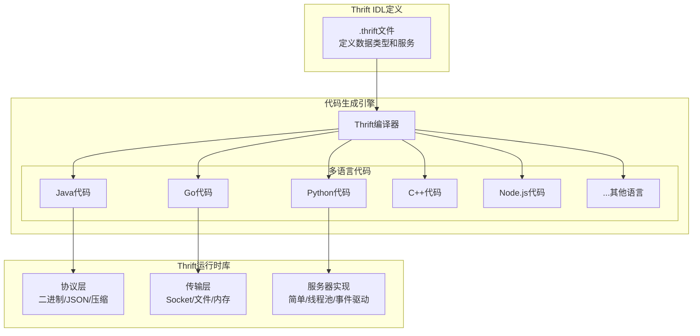
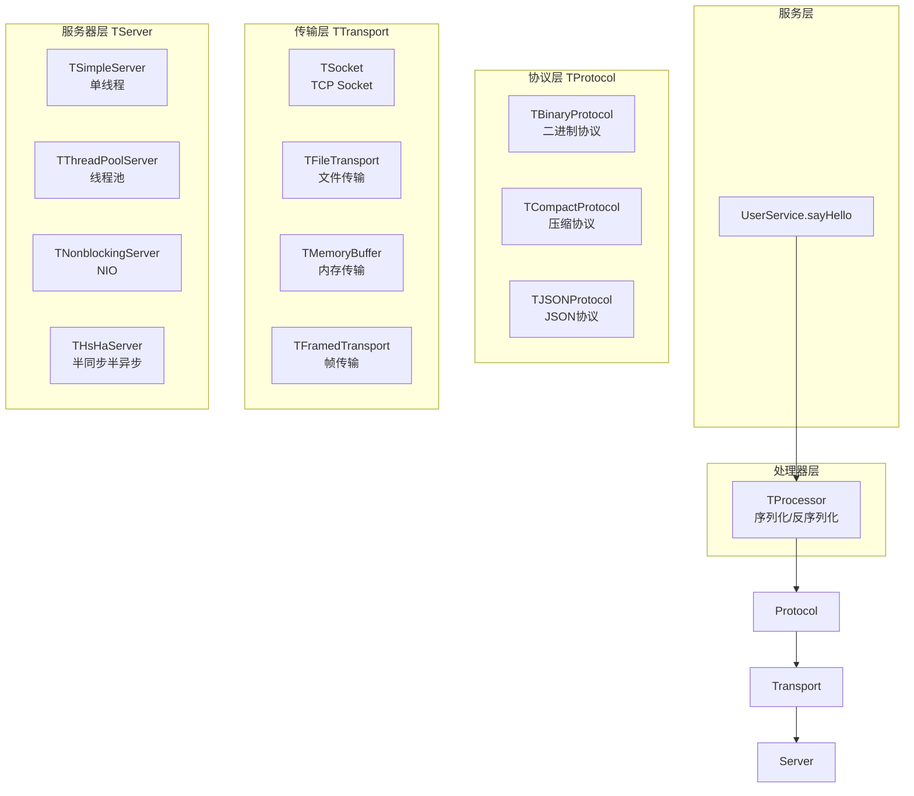

# Thrift跨语言RPC

## 概述与核心概念

Apache Thrift是Facebook于2007年开发、2008年开源的跨语言服务开发框架，现已成为Apache顶级项目。它结合了强大的软件堆栈和代码生成引擎，允许开发者定义数据类型和服务接口，然后生成在多种编程语言之间进行RPC通信所需的全部代码。

Thrift的设计目标是在各编程语言之间实现高效、可靠的通信，特别适合需要支持多种客户端语言的大型分布式系统。



### Thrift与gRPC对比

| 特性 | Apache Thrift | gRPC |
|-----|--------------|------|
| 开发方 | Apache/Facebook | Google |
| 传输协议 | 自定义/HTTP | HTTP/2 |
| 序列化 | Thrift Binary/JSON/Compact | Protocol Buffers |
| 支持语言 | 28+种 | 11+种 |
| 语言支持广度 | ★★★★★ | ★★★☆☆ |
| 性能 | 优秀 | 优秀 |
| 流式支持 | 有限 | 原生支持 |
| 浏览器支持 | Thrift-Web | gRPC-Web |
| 社区生态 | 成熟稳定 | 云原生热门 |

## 架构设计

### Thrift分层架构



### 支持的传输协议

| 协议 | 说明 | 适用场景 |
|-----|-----|---------|
| TBinaryProtocol | 二进制编码，默认协议 | 通用场景 |
| TCompactProtocol | 变长编码，更紧凑 | 带宽敏感场景 |
| TJSONProtocol | JSON文本格式 | 调试、可读性要求 |
| TSimpleJSONProtocol | 简化JSON | 仅输出，不支持解析 |
| TDebugProtocol | 调试协议 | 开发调试 |

### 服务器类型

| 服务器类型 | 特点 | 适用场景 |
|-----------|-----|---------|
| TSimpleServer | 单线程，阻塞 | 测试开发 |
| TThreadPoolServer | 线程池，阻塞 | 并发量适中 |
| TNonblockingServer | 单线程NIO | 高并发连接 |
| THsHaServer | 半同步半异步 | 生产推荐 |
| TThreadedSelectorServer | 多线程NIO | 最高性能 |

## IDL语法详解

### 基础类型定义

```thrift
// 基础数据类型
namespace java com.example.thrift
namespace go example
namespace py example

// 基本类型
typedef i32 int
typedef i64 long
typedef string str
typedef bool boolean

// 枚举
enum Status {
    ACTIVE = 1,
    INACTIVE = 2,
    SUSPENDED = 3,
    DELETED = 4
}

// 结构体
struct Address {
    1: required string street,
    2: optional string city,
    3: optional string country = "China",
    4: optional string zipCode
}

struct User {
    1: required i64 userId,
    2: required string username,
    3: optional string email,
    4: optional i32 age,
    5: optional Address address,
    6: optional list<string> tags,
    7: optional map<string, string> metadata,
    8: optional Status status = Status.ACTIVE,
    9: optional i64 createdAt
}

// 异常定义
exception UserNotFoundException {
    1: required i32 code,
    2: optional string message
}

exception InvalidParamException {
    1: required string field,
    2: required string reason
}

// 服务定义
service UserService {

    // 基础CRUD
    User getUser(1: i64 userId) throws (1: UserNotFoundException e),

    list<User> listUsers(1: i32 page, 2: i32 pageSize),

    User createUser(1: string username, 2: string email)
        throws (1: InvalidParamException e),

    void updateUser(1: i64 userId, 2: User user)
        throws (1: UserNotFoundException e),

    void deleteUser(1: i64 userId)
        throws (1: UserNotFoundException e),

    // 搜索功能
    list<User> searchUsers(1: string keyword, 2: i32 limit),

    // 批量操作
    map<i64, User> getUsersByIds(1: list<i64> userIds),

    // 统计
    i64 countUsers(1: optional Status status),

    // 流式响应（部分语言支持）
    oneway void ping()
}

// 复杂示例：电商订单服务
service OrderService {

    // 创建订单
    Order createOrder(1: CreateOrderRequest request)
        throws (1: InsufficientStockException stockEx,
                2: InvalidParamException paramEx),

    // 获取订单详情
    Order getOrder(1: string orderId)
        throws (1: OrderNotFoundException e),

    // 取消订单
    void cancelOrder(1: string orderId, 2: string reason)
        throws (1: OrderNotFoundException e,
                2: OrderStatusException statusEx),

    // 查询用户订单列表
    OrderListResult listUserOrders(
        1: i64 userId,
        2: i32 page,
        3: i32 pageSize,
        4: optional list<OrderStatus> statuses
    ),

    // 批量获取订单
    map<string, Order> batchGetOrders(1: list<string> orderIds),

    // 订单统计
    OrderStatistics getOrderStatistics(
        1: i64 startTime,
        2: i64 endTime
    )
}

struct Order {
    1: required string orderId,
    2: required i64 userId,
    3: required list<OrderItem> items,
    4: required Money totalAmount,
    5: required OrderStatus status,
    6: required Address shippingAddress,
    7: optional string remark,
    8: required i64 createdAt,
    9: optional i64 paidAt,
    10: optional i64 shippedAt,
    11: optional i64 completedAt
}

struct OrderItem {
    1: required string skuId,
    2: required string productName,
    3: required i32 quantity,
    4: required Money unitPrice,
    5: optional string specification
}

struct Money {
    1: required string currency = "CNY",
    2: required i64 amount,  // 单位为分
    3: optional i32 decimals = 2
}

enum OrderStatus {
    PENDING_PAYMENT = 1,
    PAID = 2,
    PROCESSING = 3,
    SHIPPED = 4,
    DELIVERED = 5,
    COMPLETED = 6,
    CANCELLED = 7,
    REFUNDED = 8
}

struct CreateOrderRequest {
    1: required i64 userId,
    2: required list<CreateOrderItem> items,
    3: required Address shippingAddress,
    4: optional string remark,
    5: optional string couponCode
}

struct CreateOrderItem {
    1: required string skuId,
    2: required i32 quantity
}

struct OrderListResult {
    1: required list<Order> orders,
    2: required i32 total,
    3: required i32 page,
    4: required i32 pageSize
}

struct OrderStatistics {
    1: required i32 totalOrders,
    2: required i32 pendingOrders,
    3: required i32 completedOrders,
    4: required Money totalAmount,
    5: required Money refundedAmount
}

exception InsufficientStockException {
    1: required string skuId,
    2: required i32 requested,
    3: required i32 available
}

exception OrderNotFoundException {
    1: required string orderId
}

exception OrderStatusException {
    1: required string orderId,
    2: required OrderStatus currentStatus,
    3: required string operation
}
```

## 代码示例

### Java Thrift实现

#### 1. Maven依赖

```xml
<dependencies>
    <dependency>
        <groupId>org.apache.thrift</groupId>
        <artifactId>libthrift</artifactId>
        <version>0.19.0</version>
    </dependency>
    <dependency>
        <groupId>org.slf4j</groupId>
        <artifactId>slf4j-simple</artifactId>
        <version>2.0.9</version>
    </dependency>
</dependencies>

<build>
    <plugins>
        <plugin>
            <groupId>org.apache.thrift.tools</groupId>
            <artifactId>maven-thrift-plugin</artifactId>
            <version>0.1.11</version>
            <configuration>
                <thriftExecutable>thrift</thriftExecutable>
            </configuration>
            <executions>
                <execution>
                    <id>thrift-sources</id>
                    <phase>generate-sources</phase>
                    <goals>
                        <goal>compile</goal>
                    </goals>
                </execution>
            </executions>
        </plugin>
    </plugins>
</build>
```

#### 2. 服务端实现

```java
import org.apache.thrift.*;
import org.apache.thrift.server.*;
import org.apache.thrift.transport.*;
import org.apache.thrift.protocol.*;

import java.util.*;
import java.util.concurrent.*;

/**
 * Thrift服务端实现
 */
public class UserServer {

    public static void main(String[] args) {
        try {
            // 创建处理器
            UserService.Processor<UserServiceImpl> processor =
                new UserService.Processor<>(new UserServiceImpl());

            // TSimpleServer - 单线程阻塞（仅测试使用）
            // TServerTransport serverTransport = new TServerSocket(9090);
            // TServer server = new TSimpleServer(new TServer.Args(serverTransport).processor(processor));

            // TThreadPoolServer - 线程池阻塞（中等并发）
            // TServerTransport serverTransport = new TServerSocket(9090);
            // TServer server = new TThreadPoolServer(
            //     new TThreadPoolServer.Args(serverTransport)
            //         .processor(processor)
            //         .minWorkerThreads(10)
            //         .maxWorkerThreads(100)
            // );

            // THsHaServer - 半同步半异步（生产推荐）
            TNonblockingServerSocket socket = new TNonblockingServerSocket(9090);
            THsHaServer.Args arg = new THsHaServer.Args(socket)
                .processor(processor)
                .protocolFactory(new TCompactProtocol.Factory())  // 紧凑二进制协议
                .transportFactory(new TFramedTransport.Factory()) // 帧传输
                .minWorkerThreads(10)
                .maxWorkerThreads(100);
            TServer server = new THsHaServer(arg);

            // TThreadedSelectorServer - 最高性能（大量连接）
            // TNonblockingServerSocket socket = new TNonblockingServerSocket(9090);
            // TThreadedSelectorServer.Args arg = new TThreadedSelectorServer.Args(socket)
            //     .processor(processor)
            //     .protocolFactory(new TCompactProtocol.Factory())
            //     .transportFactory(new TFramedTransport.Factory())
            //     .workerThreads(100);
            // TServer server = new TThreadedSelectorServer(arg);

            System.out.println("Starting Thrift server on port 9090...");
            server.serve();

        } catch (Exception e) {
            e.printStackTrace();
        }
    }

    /**
     * 服务实现
     */
    static class UserServiceImpl implements UserService.Iface {

        // 模拟数据库
        private final Map<Long, User> userDb = new ConcurrentHashMap<>();
        private final AtomicLong idGenerator = new AtomicLong(1);

        @Override
        public User getUser(long userId) throws UserNotFoundException, TException {
            User user = userDb.get(userId);
            if (user == null) {
                throw new UserNotFoundException(404, "User not found: " + userId);
            }
            return user;
        }

        @Override
        public List<User> listUsers(int page, int pageSize) throws TException {
            List<User> allUsers = new ArrayList<>(userDb.values());
            int start = (page - 1) * pageSize;
            int end = Math.min(start + pageSize, allUsers.size());

            if (start >= allUsers.size()) {
                return new ArrayList<>();
            }
            return allUsers.subList(start, end);
        }

        @Override
        public User createUser(String username, String email)
                throws InvalidParamException, TException {

            if (username == null || username.isEmpty()) {
                throw new InvalidParamException("username", "cannot be empty");
            }

            long userId = idGenerator.getAndIncrement();
            User user = new User();
            user.setUserId(userId);
            user.setUsername(username);
            user.setEmail(email);
            user.setStatus(Status.ACTIVE);
            user.setCreatedAt(System.currentTimeMillis());

            userDb.put(userId, user);
            return user;
        }

        @Override
        public void updateUser(long userId, User user)
                throws UserNotFoundException, TException {
            if (!userDb.containsKey(userId)) {
                throw new UserNotFoundException(404, "User not found: " + userId);
            }
            userDb.put(userId, user);
        }

        @Override
        public void deleteUser(long userId) throws UserNotFoundException, TException {
            if (!userDb.containsKey(userId)) {
                throw new UserNotFoundException(404, "User not found: " + userId);
            }
            userDb.remove(userId);
        }

        @Override
        public List<User> searchUsers(String keyword, int limit) throws TException {
            List<User> results = new ArrayList<>();
            String lowerKeyword = keyword.toLowerCase();

            for (User user : userDb.values()) {
                if (user.getUsername().toLowerCase().contains(lowerKeyword) ||
                    (user.getEmail() != null && user.getEmail().toLowerCase().contains(lowerKeyword))) {
                    results.add(user);
                    if (results.size() >= limit) {
                        break;
                    }
                }
            }
            return results;
        }

        @Override
        public Map<Long, User> getUsersByIds(List<Long> userIds) throws TException {
            Map<Long, User> results = new HashMap<>();
            for (Long id : userIds) {
                User user = userDb.get(id);
                if (user != null) {
                    results.put(id, user);
                }
            }
            return results;
        }

        @Override
        public long countUsers(Status status) throws TException {
            if (status == null) {
                return userDb.size();
            }
            return userDb.values().stream()
                .filter(u -> u.getStatus() == status)
                .count();
        }

        @Override
        public void ping() throws TException {
            // oneway方法，无需返回
            System.out.println("Received ping");
        }
    }
}
```

#### 3. 客户端实现

```java
import org.apache.thrift.*;
import org.apache.thrift.transport.*;
import org.apache.thrift.protocol.*;

import java.util.*;

/**
 * Thrift客户端实现
 */
public class UserClient {

    private TTransport transport;
    private UserService.Client client;

    public void connect(String host, int port) throws TException {
        // 创建传输层
        transport = new TFramedTransport(new TSocket(host, port, 5000));

        // 创建协议层 - 需与服务端一致
        TProtocol protocol = new TCompactProtocol(transport);

        // 创建客户端
        client = new UserService.Client(protocol);

        // 打开连接
        transport.open();
    }

    public void close() {
        if (transport != null && transport.isOpen()) {
            transport.close();
        }
    }

    public User getUser(long userId) throws TException {
        return client.getUser(userId);
    }

    public User createUser(String username, String email) throws TException {
        return client.createUser(username, email);
    }

    public List<User> listUsers(int page, int pageSize) throws TException {
        return client.listUsers(page, pageSize);
    }

    public void ping() throws TException {
        client.ping();
    }

    // 带重试的调用
    public User getUserWithRetry(long userId, int maxRetries) {
        for (int i = 0; i < maxRetries; i++) {
            try {
                return client.getUser(userId);
            } catch (TTransportException e) {
                System.err.println("Transport error, retrying... (" + (i+1) + "/" + maxRetries + ")");
                try {
                    Thread.sleep(1000);
                    // 尝试重新连接
                    if (!transport.isOpen()) {
                        transport.open();
                    }
                } catch (InterruptedException | TException ignored) {}
            } catch (TException e) {
                throw new RuntimeException(e);
            }
        }
        throw new RuntimeException("Max retries exceeded");
    }

    public static void main(String[] args) {
        UserClient client = new UserClient();

        try {
            client.connect("localhost", 9090);

            // 创建用户
            User user = client.createUser("张三", "zhangsan@example.com");
            System.out.println("Created user: " + user.getUserId());

            // 获取用户
            User retrieved = client.getUser(user.getUserId());
            System.out.println("Retrieved: " + retrieved.getUsername());

            // 列表查询
            List<User> users = client.listUsers(1, 10);
            System.out.println("Total users in page: " + users.size());

            // ping
            client.ping();

        } catch (Exception e) {
            e.printStackTrace();
        } finally {
            client.close();
        }
    }
}
```

### Go Thrift实现

```go
package main

import (
    "context"
    "fmt"
    "log"
    "net"
    "time"

    "github.com/apache/thrift/lib/go/thrift"
    "example/gen-go/example"
)

// UserHandler 服务实现
type UserHandler struct {
    users map[int64]*example.User
}

func NewUserHandler() *UserHandler {
    return &UserHandler{
        users: make(map[int64]*example.User),
    }
}

func (h *UserHandler) GetUser(ctx context.Context, userId int64) (*example.User, error) {
    user, exists := h.users[userId]
    if !exists {
        return nil, &example.UserNotFoundException{
            Code:    404,
            Message: fmt.Sprintf("User not found: %d", userId),
        }
    }
    return user, nil
}

func (h *UserHandler) ListUsers(ctx context.Context, page int32, pageSize int32) ([]*example.User, error) {
    var result []*example.User
    idx := 0
    start := (page - 1) * pageSize

    for _, user := range h.users {
        if idx >= int(start) && idx < int(start+pageSize) {
            result = append(result, user)
        }
        idx++
    }
    return result, nil
}

func (h *UserHandler) CreateUser(ctx context.Context, username string, email string) (*example.User, error) {
    if username == "" {
        return nil, &example.InvalidParamException{
            Field:  "username",
            Reason: "cannot be empty",
        }
    }

    userId := int64(len(h.users) + 1)
    user := &example.User{
        UserId:    userId,
        Username:  username,
        Email:     email,
        Status:    example.Status_ACTIVE,
        CreatedAt: time.Now().Unix(),
    }

    h.users[userId] = user
    return user, nil
}

func (h *UserHandler) UpdateUser(ctx context.Context, userId int64, user *example.User) error {
    if _, exists := h.users[userId]; !exists {
        return &example.UserNotFoundException{
            Code:    404,
            Message: fmt.Sprintf("User not found: %d", userId),
        }
    }
    h.users[userId] = user
    return nil
}

func (h *UserHandler) DeleteUser(ctx context.Context, userId int64) error {
    if _, exists := h.users[userId]; !exists {
        return &example.UserNotFoundException{
            Code:    404,
            Message: fmt.Sprintf("User not found: %d", userId),
        }
    }
    delete(h.users, userId)
    return nil
}

func (h *UserHandler) SearchUsers(ctx context.Context, keyword string, limit int32) ([]*example.User, error) {
    var result []*example.User
    for _, user := range h.users {
        // 简化搜索逻辑
        result = append(result, user)
        if len(result) >= int(limit) {
            break
        }
    }
    return result, nil
}

func (h *UserHandler) GetUsersByIds(ctx context.Context, userIds []int64) (map[int64]*example.User, error) {
    result := make(map[int64]*example.User)
    for _, id := range userIds {
        if user, exists := h.users[id]; exists {
            result[id] = user
        }
    }
    return result, nil
}

func (h *UserHandler) CountUsers(ctx context.Context, status *example.Status) (int64, error) {
    if status == nil {
        return int64(len(h.users)), nil
    }
    var count int64
    for _, user := range h.users {
        if user.Status == *status {
            count++
        }
    }
    return count, nil
}

func (h *UserHandler) Ping(ctx context.Context) error {
    log.Println("Received ping")
    return nil
}

func main() {
    // 创建处理器
    handler := NewUserHandler()
    processor := example.NewUserServiceProcessor(handler)

    // 创建服务器传输
    transport, err := thrift.NewTServerSocket(":9090")
    if err != nil {
        log.Fatal("Error creating transport:", err)
    }

    // 配置协议和传输工厂
    protocolFactory := thrift.NewTCompactProtocolFactory()
    transportFactory := thrift.NewTFramedTransportFactory(thrift.NewTTransportFactory())

    // 创建简单服务器
    server := thrift.NewTSimpleServer4(processor, transport, transportFactory, protocolFactory)

    // 或使用多线程服务器
    // server := thrift.NewTThreadPoolServer4(processor, transport, transportFactory, protocolFactory)

    log.Println("Starting Thrift server on port 9090...")
    if err := server.Serve(); err != nil {
        log.Fatal("Error starting server:", err)
    }
}
```

## 优缺点分析

| 优势 | 劣势 |
|-----|-----|
| 语言支持最广（28+种） | 流式支持不如gRPC完善 |
| 协议选择灵活（Binary/Compact/JSON） | 浏览器支持较弱 |
| 成熟稳定，历史悠久 | 云原生生态不如gRPC |
| 性能优秀，资源占用低 | 社区活跃度下降 |
| 无额外依赖（如HTTP/2） | 新特性更新较慢 |

## 应用场景

1. **多语言微服务**：Java/Python/C++/Go混合系统
2. **遗留系统整合**：需要支持多种老技术栈
3. **高性能内网通信**：二进制协议效率高
4. **嵌入式系统**：C++实现资源占用低
5. **大数据生态**：Hive、HBase等使用Thrift

## 总结

Apache Thrift作为老牌RPC框架，以其卓越的多语言支持能力和灵活的设计，在分布式系统中占据重要地位。其优势在于：

- **语言覆盖最广**：适合异构技术栈团队
- **协议灵活**：可根据场景选择不同协议
- **成熟稳定**：经过多年生产验证

在选型时，如果需要支持大量编程语言或已有Thrift基础设施，Thrift是理想选择；如果面向云原生环境且需要流式通信，gRPC可能更合适。
