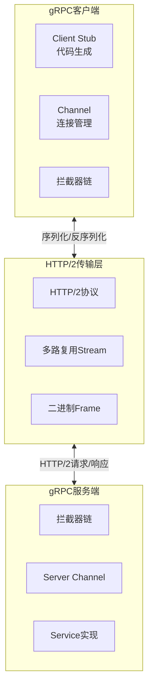
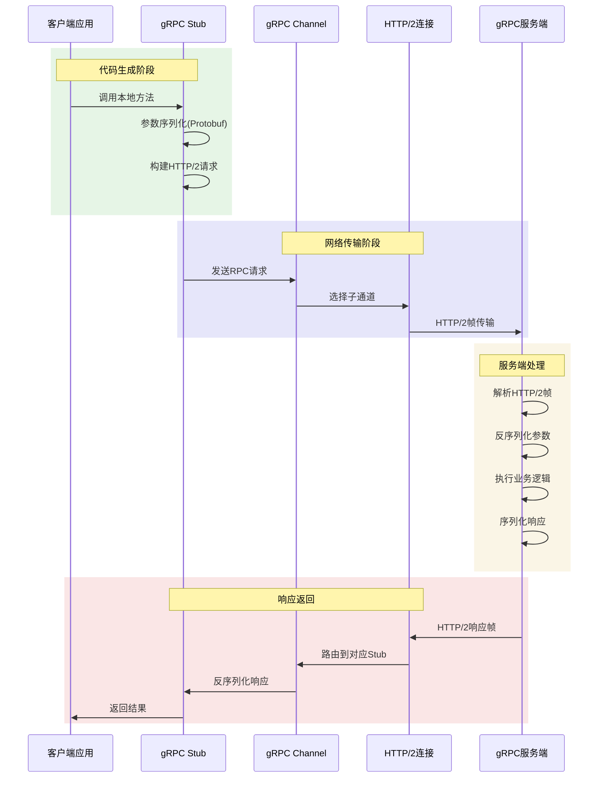
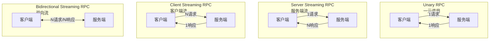
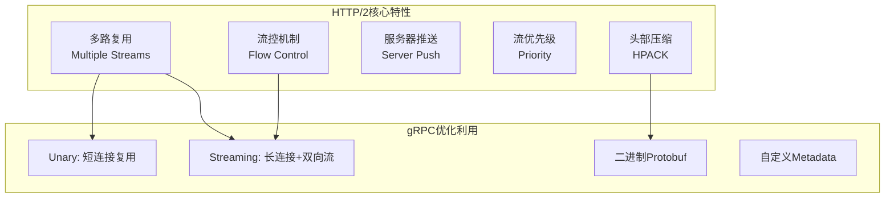

# gRPC框架详解

## 概述与核心概念

gRPC是Google开源的高性能、通用的RPC（Remote Procedure Call，远程过程调用）框架，基于HTTP/2协议传输，使用Protocol Buffers作为接口定义语言和序列化工具。自2015年开源以来，gRPC已成为云原生时代微服务通信的首选方案之一。

gRPC的设计目标是让客户端应用像调用本地方法一样调用远程服务器上的方法，屏蔽了网络通信的复杂性，同时提供了高效的二进制传输、流式通信和多语言支持。



### 核心特性

| 特性 | 说明 | 优势 |
|-----|-----|-----|
| HTTP/2 | 基于HTTP/2传输 | 多路复用、头部压缩、流控 |
| Protocol Buffers | 二进制序列化 | 高效、紧凑、强类型 |
| 多语言支持 | 11+种官方语言 | 跨语言服务调用 |
| 流式通信 | 支持双向流 | 实时数据推送、大文件传输 |
| 拦截器 | AOP风格的扩展点 | 认证、监控、日志统一处理 |
| 负载均衡 | 内置客户端负载均衡 | 与Service Mesh集成 |

## 架构与工作原理

### gRPC服务调用流程



### 四种服务类型

gRPC支持四种服务调用模式，适应不同场景：



| 调用类型 | 请求数 | 响应数 | 适用场景 |
|---------|-------|-------|---------|
| Unary | 1 | 1 | 简单请求-响应，如获取用户信息 |
| Server Streaming | 1 | N | 服务端推送，如股票行情推送 |
| Client Streaming | N | 1 | 客户端批量上传，如日志收集 |
| Bidirectional Streaming | N | N | 双向实时通信，如在线游戏、聊天 |

## Protocol Buffers定义

### 基础语法示例

```protobuf
syntax = "proto3";

package example;
option go_package = "github.com/example/api";
option java_package = "com.example.api";
option java_multiple_files = true;

// 定义服务
service UserService {
    // Unary RPC
    rpc GetUser(GetUserRequest) returns (User);

    // Server Streaming RPC
    rpc ListUsers(ListUsersRequest) returns (stream User);

    // Client Streaming RPC
    rpc CreateUsers(stream CreateUserRequest) returns (UsersSummary);

    // Bidirectional Streaming RPC
    rpc Chat(stream ChatMessage) returns (stream ChatMessage);
}

// 消息定义
message GetUserRequest {
    string user_id = 1;
}

message User {
    string user_id = 1;
    string username = 2;
    string email = 3;
    int32 age = 4;
    Address address = 5;
    repeated string tags = 6;
    google.protobuf.Timestamp created_at = 7;
}

message Address {
    string street = 1;
    string city = 2;
    string country = 3;
    string zip_code = 4;
}

message ListUsersRequest {
    int32 page = 1;
    int32 page_size = 2;
}

message CreateUserRequest {
    string username = 1;
    string email = 2;
}

message UsersSummary {
    int32 created_count = 1;
    repeated string user_ids = 2;
}

message ChatMessage {
    string from_user = 1;
    string to_user = 2;
    string content = 3;
    int64 timestamp = 4;
}
```

### Protobuf数据类型映射

| Protobuf类型 | Go类型 | Java类型 | Python类型 | C++类型 |
|-------------|-------|---------|-----------|--------|
| double | float64 | double | float | double |
| float | float32 | float | float | float |
| int32 | int32 | int | int | int32 |
| int64 | int64 | long | int/long | int64 |
| uint32 | uint32 | int | int/long | uint32 |
| uint64 | uint64 | long | int/long | uint64 |
| bool | bool | boolean | bool | bool |
| string | string | String | str | string |
| bytes | []byte | ByteString | bytes | string |

## 代码示例

### Java gRPC实现

#### 1. Maven依赖配置

```xml
<dependencies>
    <!-- gRPC核心库 -->
    <dependency>
        <groupId>io.grpc</groupId>
        <artifactId>grpc-netty-shaded</artifactId>
        <version>1.58.0</version>
    </dependency>
    <dependency>
        <groupId>io.grpc</groupId>
        <artifactId>grpc-protobuf</artifactId>
        <version>1.58.0</version>
    </dependency>
    <dependency>
        <groupId>io.grpc</groupId>
        <artifactId>grpc-stub</artifactId>
        <version>1.58.0</version>
    </dependency>
</dependencies>

<build>
    <extensions>
        <extension>
            <groupId>kr.motd.maven</groupId>
            <artifactId>os-maven-plugin</artifactId>
            <version>1.7.1</version>
        </extension>
    </extensions>
    <plugins>
        <plugin>
            <groupId>org.xolstice.maven.plugins</groupId>
            <artifactId>protobuf-maven-plugin</artifactId>
            <version>0.6.1</version>
            <configuration>
                <protocArtifact>com.google.protobuf:protoc:3.24.0:exe:${os.detected.classifier}</protocArtifact>
                <pluginId>grpc-java</pluginId>
                <pluginArtifact>io.grpc:protoc-gen-grpc-java:1.58.0:exe:${os.detected.classifier}</pluginArtifact>
            </configuration>
            <executions>
                <execution>
                    <goals>
                        <goal>compile</goal>
                        <goal>compile-custom</goal>
                    </goals>
                </execution>
            </executions>
        </plugin>
    </plugins>
</build>
```

#### 2. 服务端实现

```java
import io.grpc.*;
import io.grpc.stub.StreamObserver;

import java.io.IOException;
import java.util.ArrayList;
import java.util.List;
import java.util.concurrent.TimeUnit;
import java.util.logging.Logger;

/**
 * gRPC服务端实现
 */
public class UserServer {
    private static final Logger logger = Logger.getLogger(UserServer.class.getName());
    private Server server;
    private final int port;

    public UserServer(int port) {
        this.port = port;
    }

    public void start() throws IOException {
        server = ServerBuilder.forPort(port)
            .addService(ServerInterceptors.intercept(
                new UserServiceImpl(),
                new AuthInterceptor(),
                new LoggingInterceptor()
            ))
            .maxConcurrentCallsPerConnection(100)
            .keepAliveTime(60, TimeUnit.SECONDS)
            .keepAliveTimeout(20, TimeUnit.SECONDS)
            .permitKeepAliveTime(10, TimeUnit.SECONDS)
            .build()
            .start();

        logger.info("Server started, listening on " + port);

        Runtime.getRuntime().addShutdownHook(new Thread(() -> {
            logger.info("Shutting down gRPC server");
            UserServer.this.stop();
        }));
    }

    private void stop() {
        if (server != null) {
            server.shutdown();
        }
    }

    public void blockUntilShutdown() throws InterruptedException {
        if (server != null) {
            server.awaitTermination();
        }
    }

    /**
     * 服务实现
     */
    static class UserServiceImpl extends UserServiceGrpc.UserServiceImplBase {

        // 模拟数据库
        private final java.util.Map<String, User> userDb = new java.util.concurrent.ConcurrentHashMap<>();

        @Override
        public void getUser(GetUserRequest request, StreamObserver<User> responseObserver) {
            String userId = request.getUserId();
            User user = userDb.get(userId);

            if (user == null) {
                responseObserver.onError(Status.NOT_FOUND
                    .withDescription("User not found: " + userId)
                    .asRuntimeException());
                return;
            }

            responseObserver.onNext(user);
            responseObserver.onCompleted();
        }

        @Override
        public void listUsers(ListUsersRequest request, StreamObserver<User> responseObserver) {
            int page = request.getPage();
            int pageSize = request.getPageSize();

            // 模拟分页查询
            List<User> users = new ArrayList<>(userDb.values());
            int start = (page - 1) * pageSize;
            int end = Math.min(start + pageSize, users.size());

            for (int i = start; i < end; i++) {
                responseObserver.onNext(users.get(i));
            }

            responseObserver.onCompleted();
        }

        @Override
        public StreamObserver<CreateUserRequest> createUsers(
                StreamObserver<UsersSummary> responseObserver) {

            return new StreamObserver<CreateUserRequest>() {
                private final List<String> createdUserIds = new ArrayList<>();

                @Override
                public void onNext(CreateUserRequest request) {
                    String userId = java.util.UUID.randomUUID().toString();
                    User user = User.newBuilder()
                        .setUserId(userId)
                        .setUsername(request.getUsername())
                        .setEmail(request.getEmail())
                        .build();

                    userDb.put(userId, user);
                    createdUserIds.add(userId);
                }

                @Override
                public void onError(Throwable t) {
                    logger.warning("CreateUsers error: " + t.getMessage());
                }

                @Override
                public void onCompleted() {
                    UsersSummary summary = UsersSummary.newBuilder()
                        .setCreatedCount(createdUserIds.size())
                        .addAllUserIds(createdUserIds)
                        .build();

                    responseObserver.onNext(summary);
                    responseObserver.onCompleted();
                }
            };
        }

        @Override
        public StreamObserver<ChatMessage> chat(StreamObserver<ChatMessage> responseObserver) {
            return new StreamObserver<ChatMessage>() {
                @Override
                public void onNext(ChatMessage message) {
                    // 转发消息给目标用户（简化示例，实际需维护连接映射）
                    ChatMessage response = ChatMessage.newBuilder()
                        .setFromUser("Server")
                        .setToUser(message.getFromUser())
                        .setContent("Received: " + message.getContent())
                        .setTimestamp(System.currentTimeMillis())
                        .build();

                    responseObserver.onNext(response);
                }

                @Override
                public void onError(Throwable t) {
                    logger.warning("Chat error: " + t.getMessage());
                }

                @Override
                public void onCompleted() {
                    responseObserver.onCompleted();
                }
            };
        }
    }

    /**
     * 认证拦截器
     */
    static class AuthInterceptor implements ServerInterceptor {
        @Override
        public <ReqT, RespT> ServerCall.Listener<ReqT> interceptCall(
                ServerCall<ReqT, RespT> call,
                Metadata headers,
                ServerCallHandler<ReqT, RespT> next) {

            String authToken = headers.get(Metadata.Key.of("authorization", Metadata.ASCII_STRING_MARSHALLER));

            if (authToken == null || !authToken.startsWith("Bearer ")) {
                call.close(Status.UNAUTHENTICATED.withDescription("Missing or invalid token"), headers);
                return new ServerCall.Listener<ReqT>() {};
            }

            // 验证token逻辑...

            return next.startCall(call, headers);
        }
    }

    /**
     * 日志拦截器
     */
    static class LoggingInterceptor implements ServerInterceptor {
        @Override
        public <ReqT, RespT> ServerCall.Listener<ReqT> interceptCall(
                ServerCall<ReqT, RespT> call,
                Metadata headers,
                ServerCallHandler<ReqT, RespT> next) {

            logger.info("Method: " + call.getMethodDescriptor().getFullMethodName());

            return next.startCall(call, headers);
        }
    }

    public static void main(String[] args) throws IOException, InterruptedException {
        UserServer server = new UserServer(50051);
        server.start();
        server.blockUntilShutdown();
    }
}
```

#### 3. 客户端实现

```java
import io.grpc.*;
import io.grpc.stub.StreamObserver;

import java.util.Iterator;
import java.util.concurrent.*;
import java.util.logging.Level;
import java.util.logging.Logger;

/**
 * gRPC客户端实现
 */
public class UserClient {
    private static final Logger logger = Logger.getLogger(UserClient.class.getName());

    private final UserServiceGrpc.UserServiceBlockingStub blockingStub;
    private final UserServiceGrpc.UserServiceStub asyncStub;
    private final ManagedChannel channel;

    public UserClient(String host, int port) {
        this.channel = ManagedChannelBuilder.forAddress(host, port)
            .usePlaintext()  // 生产环境使用TLS
            .maxRetryAttempts(3)
            .defaultLoadBalancingPolicy("round_robin")
            .enableRetry()
            .build();

        // 添加拦截器
        Channel interceptedChannel = ClientInterceptors.intercept(channel,
            new HeaderInterceptor());

        this.blockingStub = UserServiceGrpc.newBlockingStub(interceptedChannel);
        this.asyncStub = UserServiceGrpc.newStub(interceptedChannel);
    }

    /**
     * Unary调用 - 同步阻塞
     */
    public void getUser(String userId) {
        logger.info("Getting user: " + userId);

        GetUserRequest request = GetUserRequest.newBuilder()
            .setUserId(userId)
            .build();

        try {
            User user = blockingStub.getUser(request);
            logger.info("Got user: " + user.getUsername());
        } catch (StatusRuntimeException e) {
            logger.log(Level.WARNING, "RPC failed: {0}", e.getStatus());
        }
    }

    /**
     * Server Streaming - 同步阻塞接收流
     */
    public void listUsers(int page, int pageSize) {
        ListUsersRequest request = ListUsersRequest.newBuilder()
            .setPage(page)
            .setPageSize(pageSize)
            .build();

        try {
            Iterator<User> users = blockingStub.listUsers(request);
            while (users.hasNext()) {
                User user = users.next();
                logger.info("User: " + user.getUsername());
            }
        } catch (StatusRuntimeException e) {
            logger.log(Level.WARNING, "RPC failed: {0}", e.getStatus());
        }
    }

    /**
     * Client Streaming - 异步发送流
     */
    public void createUsers(List<CreateUserRequest> requests)
            throws InterruptedException {

        final CountDownLatch finishLatch = new CountDownLatch(1);
        final UsersSummary[] summaryHolder = new UsersSummary[1];

        StreamObserver<CreateUserRequest> requestObserver =
            asyncStub.createUsers(new StreamObserver<UsersSummary>() {
                @Override
                public void onNext(UsersSummary summary) {
                    summaryHolder[0] = summary;
                    logger.info("Created " + summary.getCreatedCount() + " users");
                }

                @Override
                public void onError(Throwable t) {
                    logger.log(Level.WARNING, "CreateUsers failed: {0}", t.getMessage());
                    finishLatch.countDown();
                }

                @Override
                public void onCompleted() {
                    finishLatch.countDown();
                }
            });

        try {
            for (CreateUserRequest request : requests) {
                requestObserver.onNext(request);
            }
        } catch (RuntimeException e) {
            requestObserver.onError(e);
            throw e;
        }

        requestObserver.onCompleted();
        finishLatch.await(1, TimeUnit.MINUTES);
    }

    /**
     * Bidirectional Streaming - 双向流
     */
    public void chat() throws InterruptedException {
        final CountDownLatch finishLatch = new CountDownLatch(1);

        StreamObserver<ChatMessage> requestObserver =
            asyncStub.chat(new StreamObserver<ChatMessage>() {
                @Override
                public void onNext(ChatMessage message) {
                    logger.info("Received: " + message.getContent());
                }

                @Override
                public void onError(Throwable t) {
                    finishLatch.countDown();
                }

                @Override
                public void onCompleted() {
                    finishLatch.countDown();
                }
            });

        // 发送消息
        String[] messages = {"Hello", "How are you?", "Goodbye"};
        for (String msg : messages) {
            ChatMessage message = ChatMessage.newBuilder()
                .setFromUser("Client1")
                .setToUser("Server")
                .setContent(msg)
                .setTimestamp(System.currentTimeMillis())
                .build();

            requestObserver.onNext(message);
        }

        requestObserver.onCompleted();
        finishLatch.await(1, TimeUnit.MINUTES);
    }

    /**
     * 带超时的调用
     */
    public void getUserWithTimeout(String userId) {
        GetUserRequest request = GetUserRequest.newBuilder()
            .setUserId(userId)
            .build();

        try {
            User user = blockingStub
                .withDeadlineAfter(5, TimeUnit.SECONDS)
                .getUser(request);
            logger.info("Got user: " + user.getUsername());
        } catch (StatusRuntimeException e) {
            if (e.getStatus().getCode() == Status.Code.DEADLINE_EXCEEDED) {
                logger.warning("Request timeout");
            }
        }
    }

    /**
     * 客户端拦截器 - 添加认证头
     */
    static class HeaderInterceptor implements ClientInterceptor {
        @Override
        public <ReqT, RespT> ClientCall<ReqT, RespT> interceptCall(
                MethodDescriptor<ReqT, RespT> method,
                CallOptions callOptions,
                Channel next) {

            return new ForwardingClientCall.SimpleForwardingClientCall<
                    ReqT, RespT>(next.newCall(method, callOptions)) {

                @Override
                public void start(Listener<RespT> responseListener, Metadata headers) {
                    headers.put(Metadata.Key.of("authorization",
                        Metadata.ASCII_STRING_MARSHALLER), "Bearer token123");
                    super.start(responseListener, headers);
                }
            };
        }
    }

    public void shutdown() throws InterruptedException {
        channel.shutdown().awaitTermination(5, TimeUnit.SECONDS);
    }

    public static void main(String[] args) throws Exception {
        UserClient client = new UserClient("localhost", 50051);

        try {
            // Unary调用
            client.getUser("user-1");

            // Server Streaming
            client.listUsers(1, 10);

            // Client Streaming
            List<CreateUserRequest> requests = new ArrayList<>();
            for (int i = 0; i < 5; i++) {
                requests.add(CreateUserRequest.newBuilder()
                    .setUsername("user" + i)
                    .setEmail("user" + i + "@example.com")
                    .build());
            }
            client.createUsers(requests);

        } finally {
            client.shutdown();
        }
    }
}
```

### Go gRPC实现

```go
package main

import (
    "context"
    "fmt"
    "io"
    "log"
    "net"
    "time"

    "google.golang.org/grpc"
    "google.golang.org/grpc/codes"
    "google.golang.org/grpc/credentials"
    "google.golang.org/grpc/metadata"
    "google.golang.org/grpc/status"
    pb "github.com/example/api"
)

// UserServer 服务端实现
type UserServer struct {
    pb.UnimplementedUserServiceServer
    users map[string]*pb.User
}

func NewUserServer() *UserServer {
    return &UserServer{
        users: make(map[string]*pb.User),
    }
}

// GetUser Unary RPC实现
func (s *UserServer) GetUser(ctx context.Context, req *pb.GetUserRequest) (*pb.User, error) {
    user, exists := s.users[req.UserId]
    if !exists {
        return nil, status.Errorf(codes.NotFound, "user not found: %s", req.UserId)
    }
    return user, nil
}

// ListUsers Server Streaming RPC实现
func (s *UserServer) ListUsers(req *pb.ListUsersRequest, stream pb.UserService_ListUsersServer) error {
    page := req.Page
    pageSize := req.PageSize

    // 简化的分页实现
    idx := 0
    start := (page - 1) * pageSize

    for _, user := range s.users {
        if idx >= int(start) && idx < int(start+pageSize) {
            if err := stream.Send(user); err != nil {
                return err
            }
        }
        idx++
    }

    return nil
}

// CreateUsers Client Streaming RPC实现
func (s *UserServer) CreateUsers(stream pb.UserService_CreateUsersServer) error {
    var createdCount int32
    var userIds []string

    for {
        req, err := stream.Recv()
        if err == io.EOF {
            // 客户端发送完成
            return stream.SendAndClose(&pb.UsersSummary{
                CreatedCount: createdCount,
                UserIds:      userIds,
            })
        }
        if err != nil {
            return err
        }

        // 创建用户
        userId := generateUserID()
        user := &pb.User{
            UserId:   userId,
            Username: req.Username,
            Email:    req.Email,
        }

        s.users[userId] = user
        createdCount++
        userIds = append(userIds, userId)
    }
}

// Chat Bidirectional Streaming RPC实现
func (s *UserServer) Chat(stream pb.UserService_ChatServer) error {
    for {
        msg, err := stream.Recv()
        if err == io.EOF {
            return nil
        }
        if err != nil {
            return err
        }

        // 处理消息并响应
        response := &pb.ChatMessage{
            FromUser:  "Server",
            ToUser:    msg.FromUser,
            Content:   "Echo: " + msg.Content,
            Timestamp: time.Now().Unix(),
        }

        if err := stream.Send(response); err != nil {
            return err
        }
    }
}

func generateUserID() string {
    return fmt.Sprintf("user-%d", time.Now().UnixNano())
}

// 拦截器实现
func authInterceptor(ctx context.Context, req interface{}, info *grpc.UnaryServerInfo, handler grpc.UnaryHandler) (interface{}, error) {
    md, ok := metadata.FromIncomingContext(ctx)
    if !ok {
        return nil, status.Errorf(codes.Unauthenticated, "missing metadata")
    }

    authHeader := md.Get("authorization")
    if len(authHeader) == 0 {
        return nil, status.Errorf(codes.Unauthenticated, "missing authorization")
    }

    // 验证token...

    return handler(ctx, req)
}

func loggingInterceptor(ctx context.Context, req interface{}, info *grpc.UnaryServerInfo, handler grpc.UnaryHandler) (interface{}, error) {
    start := time.Now()
    resp, err := handler(ctx, req)
    log.Printf("Method: %s, Duration: %v, Error: %v", info.FullMethod, time.Since(start), err)
    return resp, err
}

func main() {
    // 创建gRPC服务器
    opts := []grpc.ServerOption{
        grpc.ChainUnaryInterceptor(loggingInterceptor, authInterceptor),
        grpc.MaxConcurrentStreams(100),
        grpc.ConnectionTimeout(10 * time.Second),
    }

    // TLS配置（生产环境）
    // creds, err := credentials.NewServerTLSFromFile("server.crt", "server.key")
    // if err != nil {
    //     log.Fatalf("Failed to load TLS: %v", err)
    // }
    // opts = append(opts, grpc.Creds(creds))

    server := grpc.NewServer(opts...)
    pb.RegisterUserServiceServer(server, NewUserServer())

    lis, err := net.Listen("tcp", ":50051")
    if err != nil {
        log.Fatalf("Failed to listen: %v", err)
    }

    log.Printf("Server listening on %v", lis.Addr())
    if err := server.Serve(lis); err != nil {
        log.Fatalf("Failed to serve: %v", err)
    }
}
```

## 与HTTP/2的深度集成

gRPC充分利用HTTP/2特性实现高性能通信：



## 优缺点分析

| 优势 | 劣势 |
|-----|-----|
| 高性能二进制传输 | 浏览器支持有限（需gRPC-Web） |
| 强类型接口定义 | 相比REST学习成本高 |
| 多语言支持 | 调试不如HTTP直观 |
| 双向流式通信 | 需要Protobuf编译步骤 |
| 内置负载均衡、重试 | 生态系统不如REST成熟 |
| 与Service Mesh集成好 | 对老旧系统兼容性差 |

## 应用场景

1. **微服务间通信**：内部服务高吞吐调用
2. **多语言系统**：Java-Go-Python混合架构
3. **实时数据流**：日志收集、监控数据推送
4. **移动应用**：高效的后端API调用
5. **物联网**：低带宽环境下的设备通信

## 总结

gRPC作为新一代RPC框架，通过HTTP/2和Protocol Buffers的结合，实现了高性能、强类型的服务间通信。其特性特别适合：

- 微服务架构中的内部通信
- 需要实时双向流的场景
- 多语言混合的技术栈
- 对性能有严格要求的系统

在采用gRPC时，需要权衡其带来的性能提升与学习成本，并考虑与现有系统的兼容性问题。对于面向公网的API，建议结合gRPC-Gateway提供RESTful接口。
