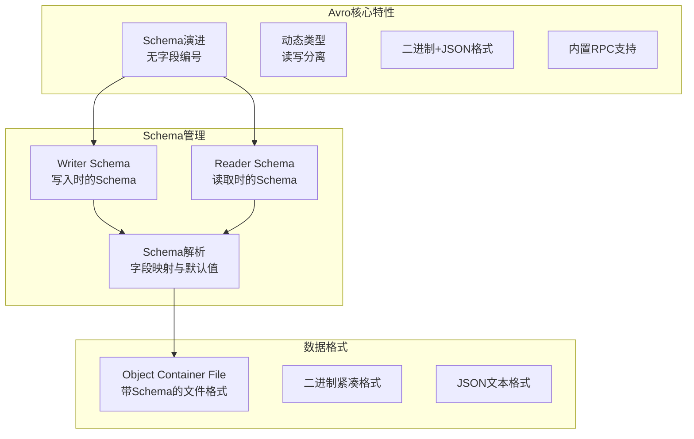
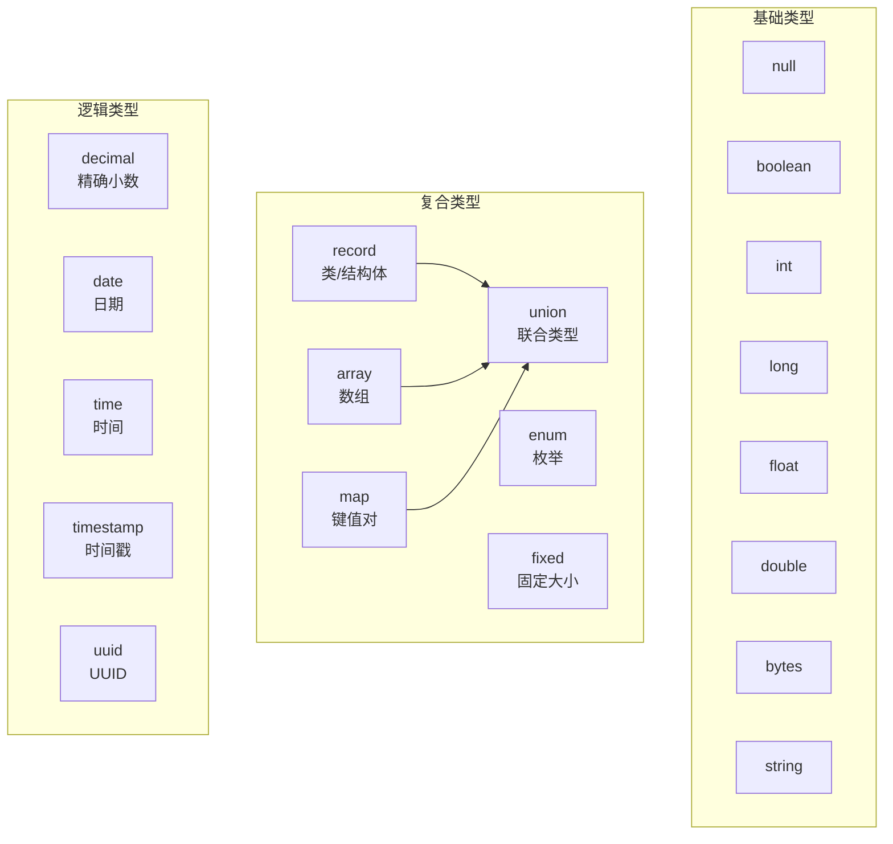
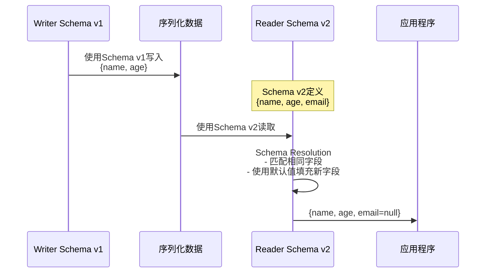
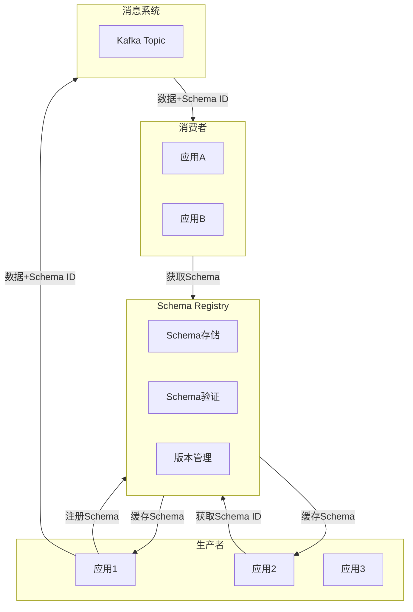

# Avro序列化

## 概述与核心概念

Apache Avro是一个数据序列化系统，最初由Doug Cutting（Hadoop创始人）创建，旨在为Hadoop生态系统提供一种快速、紧凑、丰富的数据结构。Avro的设计重点是大数据处理场景中的数据交换和持久化。

与其他序列化方案不同，Avro的核心特点是**将Schema与数据一起存储或传输**，使得异构系统之间能够无需事先共享Schema即可交换数据。这种自描述的特性使Avro特别适合动态类型语言和大规模数据处理场景。



### Avro与Protobuf/Thrift对比

| 特性 | Avro | Protobuf | Thrift |
|-----|------|----------|--------|
| Schema位置 | 与数据一起 | 代码生成 | 代码生成 |
| Schema演进 | 优秀（无需字段编号） | 优秀（需字段编号） | 一般 |
| 动态类型支持 | 原生支持 | 有限 | 有限 |
| 代码生成 | 可选 | 必需 | 必需 |
| JSON支持 | 内置 | 工具转换 | 有限 |
| Hadoop集成 | 原生支持 | 需适配 | 需适配 |
| RPC支持 | 有 | gRPC | 原生 |
| Schema大小 | 较大（与数据一起） | 小（代码中） | 小（代码中） |

## 架构与工作原理

### Avro数据模型



### Schema解析机制

Avro使用Schema解析器（Schema Resolution）实现不同版本Schema之间的兼容：



## Avro Schema定义

### JSON Schema语法

```json
{
    "type": "record",
    "name": "User",
    "namespace": "com.example.avro",
    "doc": "用户信息记录",
    "fields": [
        {
            "name": "userId",
            "type": "long",
            "doc": "用户唯一标识"
        },
        {
            "name": "username",
            "type": "string"
        },
        {
            "name": "email",
            "type": ["null", "string"],
            "default": null
        },
        {
            "name": "age",
            "type": ["null", "int"],
            "default": null
        },
        {
            "name": "address",
            "type": ["null", {
                "type": "record",
                "name": "Address",
                "fields": [
                    {"name": "street", "type": "string"},
                    {"name": "city", "type": "string"},
                    {"name": "country", "type": "string", "default": "China"}
                ]
            }],
            "default": null
        },
        {
            "name": "phoneNumbers",
            "type": {
                "type": "array",
                "items": {
                    "type": "record",
                    "name": "PhoneNumber",
                    "fields": [
                        {"name": "number", "type": "string"},
                        {"name": "type", "type": {
                            "type": "enum",
                            "name": "PhoneType",
                            "symbols": ["MOBILE", "HOME", "WORK"]
                        }}
                    ]
                }
            },
            "default": []
        },
        {
            "name": "metadata",
            "type": {
                "type": "map",
                "values": "string"
            },
            "default": {}
        },
        {
            "name": "status",
            "type": {
                "type": "enum",
                "name": "Status",
                "symbols": ["ACTIVE", "INACTIVE", "SUSPENDED"]
            },
            "default": "ACTIVE"
        },
        {
            "name": "createdAt",
            "type": "long",
            "logicalType": "timestamp-millis"
        }
    ]
}
```

### Schema演进示例

**V1版本：**
```json
{
    "type": "record",
    "name": "User",
    "fields": [
        {"name": "userId", "type": "long"},
        {"name": "username", "type": "string"}
    ]
}
```

**V2版本（向后兼容）：**
```json
{
    "type": "record",
    "name": "User",
    "fields": [
        {"name": "userId", "type": "long"},
        {"name": "username", "type": "string"},
        {"name": "email", "type": ["null", "string"], "default": null}
    ]
}
```

**V3版本（删除字段）：**
```json
{
    "type": "record",
    "name": "User",
    "fields": [
        {"name": "userId", "type": "long"},
        {"name": "username", "type": "string"},
        {"name": "email", "type": ["null", "string"], "default": null},
        {"name": "phone", "type": ["null", "string"], "default": null}
    ]
}
```

## 代码示例

### Java Avro使用

#### Maven依赖

```xml
<dependencies>
    <dependency>
        <groupId>org.apache.avro</groupId>
        <artifactId>avro</artifactId>
        <version>1.11.3</version>
    </dependency>
</dependencies>

<build>
    <plugins>
        <plugin>
            <groupId>org.apache.avro</groupId>
            <artifactId>avro-maven-plugin</artifactId>
            <version>1.11.3</version>
            <executions>
                <execution>
                    <phase>generate-sources</phase>
                    <goals>
                        <goal>schema</goal>
                    </goals>
                    <configuration>
                        <sourceDirectory>${project.basedir}/src/main/avro/</sourceDirectory>
                        <outputDirectory>${project.basedir}/src/main/java/</outputDirectory>
                    </configuration>
                </execution>
            </executions>
        </plugin>
    </plugins>
</build>
```

#### Java代码示例

```java
import org.apache.avro.*;
import org.apache.avro.file.*;
import org.apache.avro.generic.*;
import org.apache.avro.io.*;
import org.apache.avro.reflect.*;
import org.apache.avro.specific.*;
import org.apache.avro.util.*;

import java.io.*;
import java.util.*;

/**
 * Avro Java使用示例
 */
public class AvroExample {
    
    // 定义User Schema
    private static final String USER_SCHEMA = "{\n" +
        "  \"type\": \"record\",\n" +
        "  \"name\": \"User\",\n" +
        "  \"namespace\": \"com.example.avro\",\n" +
        "  \"fields\": [\n" +
        "    {\"name\": \"userId\", \"type\": \"long\"},\n" +
        "    {\"name\": \"username\", \"type\": \"string\"},\n" +
        "    {\"name\": \"email\", \"type\": [\"null\", \"string\"], \"default\": null},\n" +
        "    {\"name\": \"age\", \"type\": [\"null\", \"int\"], \"default\": null},\n" +
        "    {\"name\": \"status\", \"type\": {\"type\": \"enum\", \"name\": \"Status\", \"symbols\": [\"ACTIVE\", \"INACTIVE\"]}, \"default\": \"ACTIVE\"}\n" +
        "  ]\n" +
        "}";
    
    /**
     * GenericRecord方式（动态类型）
     */
    public static void genericRecordDemo() throws IOException {
        // 解析Schema
        Schema schema = new Schema.Parser().parse(USER_SCHEMA);
        
        // 创建GenericRecord
        GenericRecord user = new GenericData.Record(schema);
        user.put("userId", 1001L);
        user.put("username", "张三");
        user.put("email", "zhangsan@example.com");
        user.put("age", 28);
        user.put("status", "ACTIVE");
        
        System.out.println("Created: " + user);
        
        // 序列化到字节数组
        ByteArrayOutputStream out = new ByteArrayOutputStream();
        DatumWriter<GenericRecord> writer = new GenericDatumWriter<>(schema);
        Encoder encoder = EncoderFactory.get().binaryEncoder(out, null);
        writer.write(user, encoder);
        encoder.flush();
        byte[] serialized = out.toByteArray();
        
        System.out.println("序列化后大小: " + serialized.length + " bytes");
        
        // 反序列化
        DatumReader<GenericRecord> reader = new GenericDatumReader<>(schema);
        Decoder decoder = DecoderFactory.get().binaryDecoder(serialized, null);
        GenericRecord deserialized = reader.read(null, decoder);
        
        System.out.println("反序列化: " + deserialized);
        System.out.println("用户名: " + deserialized.get("username"));
    }
    
    /**
     * 写入Object Container File
     */
    public static void writeToDataFile() throws IOException {
        Schema schema = new Schema.Parser().parse(USER_SCHEMA);
        
        File file = new File("users.avro");
        
        DatumWriter<GenericRecord> datumWriter = new GenericDatumWriter<>(schema);
        try (DataFileWriter<GenericRecord> dataFileWriter = new DataFileWriter<>(datumWriter)) {
            dataFileWriter.create(schema, file);
            
            // 写入多条记录
            for (int i = 1; i <= 100; i++) {
                GenericRecord user = new GenericData.Record(schema);
                user.put("userId", (long) i);
                user.put("username", "user" + i);
                user.put("email", "user" + i + "@example.com");
                user.put("age", 20 + i % 50);
                user.put("status", i % 2 == 0 ? "ACTIVE" : "INACTIVE");
                
                dataFileWriter.append(user);
            }
        }
        
        System.out.println("Written to users.avro");
    }
    
    /**
     * 从Object Container File读取
     */
    public static void readFromDataFile() throws IOException {
        Schema schema = new Schema.Parser().parse(USER_SCHEMA);
        File file = new File("users.avro");
        
        DatumReader<GenericRecord> datumReader = new GenericDatumReader<>(schema);
        try (DataFileReader<GenericRecord> dataFileReader = new DataFileReader<>(file, datumReader)) {
            
            // 读取文件中的Schema
            Schema fileSchema = dataFileReader.getSchema();
            System.out.println("File Schema: " + fileSchema.toString(true));
            
            // 遍历记录
            int count = 0;
            for (GenericRecord user : dataFileReader) {
                if (count < 5) {
                    System.out.println("User: " + user.get("username") + 
                                     ", Status: " + user.get("status"));
                }
                count++;
            }
            System.out.println("Total records: " + count);
        }
    }
    
    /**
     * Schema演进演示
     */
    public static void schemaEvolutionDemo() throws IOException {
        // V1 Schema（写入时）
        String v1Schema = "{\n" +
            "  \"type\": \"record\",\n" +
            "  \"name\": \"User\",\n" +
            "  \"fields\": [\n" +
            "    {\"name\": \"userId\", \"type\": \"long\"},\n" +
            "    {\"name\": \"username\", \"type\": \"string\"}\n" +
            "  ]\n" +
            "}";
        
        // V2 Schema（读取时）- 添加了email字段
        String v2Schema = "{\n" +
            "  \"type\": \"record\",\n" +
            "  \"name\": \"User\",\n" +
            "  \"fields\": [\n" +
            "    {\"name\": \"userId\", \"type\": \"long\"},\n" +
            "    {\"name\": \"username\", \"type\": \"string\"},\n" +
            "    {\"name\": \"email\", \"type\": [\"null\", \"string\"], \"default\": null}\n" +
            "  ]\n" +
            "}";
        
        Schema writerSchema = new Schema.Parser().parse(v1Schema);
        Schema readerSchema = new Schema.Parser().parse(v2Schema);
        
        // 使用V1 Schema写入
        GenericRecord userV1 = new GenericData.Record(writerSchema);
        userV1.put("userId", 1001L);
        userV1.put("username", "张三");
        
        ByteArrayOutputStream out = new ByteArrayOutputStream();
        DatumWriter<GenericRecord> writer = new GenericDatumWriter<>(writerSchema);
        Encoder encoder = EncoderFactory.get().binaryEncoder(out, null);
        writer.write(userV1, encoder);
        encoder.flush();
        byte[] data = out.toByteArray();
        
        // 使用V2 Schema读取 - 自动处理Schema差异
        DatumReader<GenericRecord> reader = new GenericDatumReader<>(writerSchema, readerSchema);
        Decoder decoder = DecoderFactory.get().binaryDecoder(data, null);
        GenericRecord userV2 = reader.read(null, decoder);
        
        System.out.println("Schema演进演示:");
        System.out.println("  userId: " + userV2.get("userId"));
        System.out.println("  username: " + userV2.get("username"));
        System.out.println("  email (默认值): " + userV2.get("email"));
    }
    
    /**
     * JSON格式序列化
     */
    public static void jsonEncodingDemo() throws IOException {
        Schema schema = new Schema.Parser().parse(USER_SCHEMA);
        
        GenericRecord user = new GenericData.Record(schema);
        user.put("userId", 1001L);
        user.put("username", "张三");
        user.put("email", "zhangsan@example.com");
        
        // 序列化为JSON
        ByteArrayOutputStream out = new ByteArrayOutputStream();
        DatumWriter<GenericRecord> writer = new GenericDatumWriter<>(schema);
        Encoder encoder = EncoderFactory.get().jsonEncoder(schema, out);
        writer.write(user, encoder);
        encoder.flush();
        
        String json = out.toString();
        System.out.println("JSON格式: " + json);
        
        // 从JSON反序列化
        DatumReader<GenericRecord> reader = new GenericDatumReader<>(schema);
        Decoder decoder = DecoderFactory.get().jsonDecoder(schema, json);
        GenericRecord parsed = reader.read(null, decoder);
        
        System.out.println("从JSON解析: " + parsed.get("username"));
    }
    
    /**
     * ReflectData方式（基于POJO）
     */
    public static void reflectDemo() throws IOException {
        // 定义POJO
        @AvroName("User")
        class UserPojo {
            @AvroName("userId")
            private long userId;
            
            @AvroName("username")
            private String username;
            
            @AvroName("email")
            private String email;
            
            // 必须提供默认构造函数
            public UserPojo() {}
            
            public UserPojo(long userId, String username, String email) {
                this.userId = userId;
                this.username = username;
                this.email = email;
            }
            
            // Getters and setters...
            @Override
            public String toString() {
                return "UserPojo{userId=" + userId + ", username='" + username + "'}";
            }
        }
        
        // 从POJO推断Schema
        Schema schema = ReflectData.get().getSchema(UserPojo.class);
        System.out.println("Inferred Schema: " + schema.toString(true));
        
        // 使用ReflectData序列化
        UserPojo user = new UserPojo(1001L, "张三", "zhangsan@example.com");
        
        ByteArrayOutputStream out = new ByteArrayOutputStream();
        DatumWriter<UserPojo> writer = new ReflectDatumWriter<>(schema);
        Encoder encoder = EncoderFactory.get().binaryEncoder(out, null);
        writer.write(user, encoder);
        encoder.flush();
        
        // 反序列化
        DatumReader<UserPojo> reader = new ReflectDatumReader<>(schema);
        Decoder decoder = DecoderFactory.get().binaryDecoder(out.toByteArray(), null);
        UserPojo deserialized = reader.read(null, decoder);
        
        System.out.println("反序列化POJO: " + deserialized);
    }
    
    public static void main(String[] args) throws IOException {
        genericRecordDemo();
        writeToDataFile();
        readFromDataFile();
        schemaEvolutionDemo();
        jsonEncodingDemo();
        reflectDemo();
    }
}
```

### Python Avro使用

```python
#!/usr/bin/env python3
"""
Avro Python使用示例
"""

import avro.schema
import avro.io
import avro.datafile
from avro.schema import Parse
import io
import json


# 定义Schema
USER_SCHEMA = '''
{
    "type": "record",
    "name": "User",
    "namespace": "com.example.avro",
    "fields": [
        {"name": "userId", "type": "long"},
        {"name": "username", "type": "string"},
        {"name": "email", "type": ["null", "string"], "default": null},
        {"name": "age", "type": ["null", "int"], "default": null}
    ]
}
'''


def basic_serialization():
    """基础序列化示例"""
    schema = avro.schema.parse(USER_SCHEMA)
    
    # 创建记录
    record = {
        "userId": 1001,
        "username": "张三",
        "email": "zhangsan@example.com",
        "age": 28
    }
    
    # 序列化为字节
    writer = avro.io.DatumWriter(schema)
    bytes_writer = io.BytesIO()
    encoder = avro.io.BinaryEncoder(bytes_writer)
    writer.write(record, encoder)
    
    serialized = bytes_writer.getvalue()
    print(f"序列化后大小: {len(serialized)} bytes")
    
    # 反序列化
    reader = avro.io.DatumReader(schema)
    bytes_reader = io.BytesIO(serialized)
    decoder = avro.io.BinaryDecoder(bytes_reader)
    result = reader.read(decoder)
    
    print(f"反序列化: {result}")


def datafile_example():
    """使用DataFile（Object Container File）"""
    schema = avro.schema.parse(USER_SCHEMA)
    
    # 写入DataFile
    with open('users.avro', 'wb') as out:
        writer = avro.datafile.DataFileWriter(out, avro.io.DatumWriter(), schema)
        
        for i in range(1, 101):
            writer.append({
                "userId": i,
                "username": f"user{i}",
                "email": f"user{i}@example.com",
                "age": 20 + i % 50
            })
        
        writer.close()
    
    print("Written to users.avro")
    
    # 从DataFile读取
    with open('users.avro', 'rb') as fo:
        reader = avro.datafile.DataFileReader(fo, avro.io.DatumReader())
        
        # 获取文件中的Schema
        print(f"文件Schema: {reader.meta}")
        
        # 读取记录
        count = 0
        for record in reader:
            if count < 5:
                print(f"User: {record['username']}")
            count += 1
        
        print(f"总记录数: {count}")
        reader.close()


def schema_evolution():
    """Schema演进示例"""
    # V1 Schema
    v1_schema_str = '''
    {
        "type": "record",
        "name": "User",
        "fields": [
            {"name": "userId", "type": "long"},
            {"name": "username", "type": "string"}
        ]
    }
    '''
    
    # V2 Schema（添加字段）
    v2_schema_str = '''
    {
        "type": "record",
        "name": "User",
        "fields": [
            {"name": "userId", "type": "long"},
            {"name": "username", "type": "string"},
            {"name": "email", "type": ["null", "string"], "default": null}
        ]
    }
    '''
    
    writer_schema = avro.schema.parse(v1_schema_str)
    reader_schema = avro.schema.parse(v2_schema_str)
    
    # 用V1写入
    record_v1 = {"userId": 1001, "username": "张三"}
    
    writer = avro.io.DatumWriter(writer_schema)
    bytes_writer = io.BytesIO()
    encoder = avro.io.BinaryEncoder(bytes_writer)
    writer.write(record_v1, encoder)
    
    serialized = bytes_writer.getvalue()
    
    # 用V2读取
    reader = avro.io.DatumReader(writer_schema, reader_schema)
    bytes_reader = io.BytesIO(serialized)
    decoder = avro.io.BinaryDecoder(bytes_reader)
    result = reader.read(decoder)
    
    print(f"Schema演进结果: {result}")
    print(f"email字段自动填充默认值: {result.get('email')}")


def json_serialization():
    """JSON格式序列化"""
    schema = avro.schema.parse(USER_SCHEMA)
    
    record = {
        "userId": 1001,
        "username": "张三",
        "email": "zhangsan@example.com",
        "age": 28
    }
    
    # 使用JSON编码器
    writer = avro.io.DatumWriter(schema)
    out = io.StringIO()
    encoder = avro.io.JsonEncoder(schema, out)
    writer.write(record, encoder)
    
    json_str = out.getvalue()
    print(f"JSON格式: {json_str}")


def performance_test():
    """性能测试"""
    import time
    
    schema = avro.schema.parse(USER_SCHEMA)
    ITERATIONS = 100000
    
    record = {
        "userId": 1001,
        "username": "张三",
        "email": "zhangsan@example.com",
        "age": 28
    }
    
    # 序列化测试
    start = time.time()
    writer = avro.io.DatumWriter(schema)
    for _ in range(ITERATIONS):
        bytes_writer = io.BytesIO()
        encoder = avro.io.BinaryEncoder(bytes_writer)
        writer.write(record, encoder)
    serialize_time = time.time() - start
    
    # 准备反序列化数据
    bytes_writer = io.BytesIO()
    encoder = avro.io.BinaryEncoder(bytes_writer)
    writer.write(record, encoder)
    serialized = bytes_writer.getvalue()
    
    # 反序列化测试
    start = time.time()
    reader = avro.io.DatumReader(schema)
    for _ in range(ITERATIONS):
        bytes_reader = io.BytesIO(serialized)
        decoder = avro.io.BinaryDecoder(bytes_reader)
        reader.read(decoder)
    deserialize_time = time.time() - start
    
    print("\n=== 性能测试结果 ===")
    print(f"序列化 {ITERATIONS} 次: {serialize_time*1000:.2f} ms")
    print(f"反序列化 {ITERATIONS} 次: {deserialize_time*1000:.2f} ms")
    print(f"单条序列化: {serialize_time/ITERATIONS*1e6:.2f} μs")
    print(f"单条大小: {len(serialized)} bytes")


if __name__ == "__main__":
    basic_serialization()
    datafile_example()
    schema_evolution()
    json_serialization()
    performance_test()
```

## Schema注册中心

在大型分布式系统中，Schema管理至关重要：



## 优缺点分析

| 优势 | 劣势 |
|-----|-----|
| 丰富的Schema演进支持 | Schema需要随数据存储/传输 |
| 动态类型支持好 | 相比Protobuf序列化后略大 |
| 大数据生态集成好 | 性能略低于Protobuf |
| 无需代码生成 | Java反射方式性能较差 |
| 支持多种语言 | 社区活跃度不如Protobuf |

## 应用场景

1. **Hadoop生态**：HDFS、Hive、Spark的首选格式
2. **Kafka消息**：配合Schema Registry使用
3. **数据湖**：Iceberg、Delta Lake的底层格式
4. **日志收集**：Schema演进友好的日志格式
5. **跨组织数据交换**：自描述的Schema便于协作

## 总结

Avro以其出色的Schema演进能力和动态类型支持，成为大数据场景下的理想序列化方案。其设计理念特别适合需要长期存储和频繁演化的数据场景。

选择Avro的场景：
- 大数据处理（Hadoop/Spark）
- 需要灵活的Schema演进
- 多团队协作的数据交换
- 动态类型语言为主的项目
