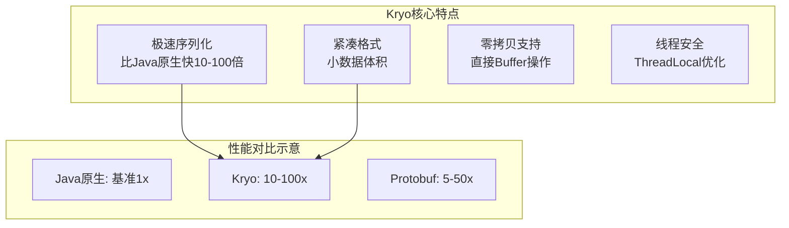
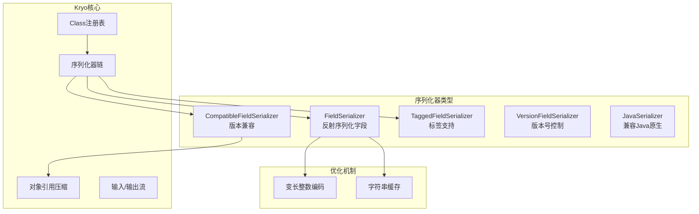
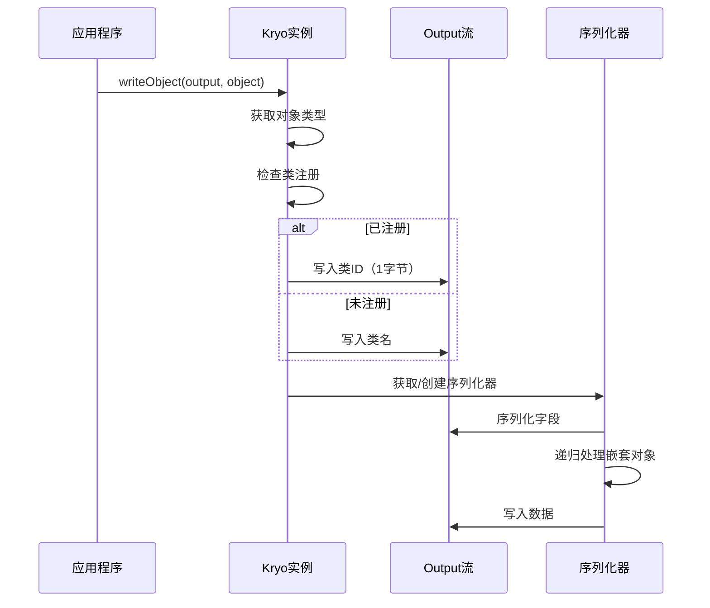

# Kryo高性能序列化

## 概述与核心概念

Kryo是一个快速、高效的Java对象图形序列化框架，专为Java虚拟机（JVM）环境设计。它专注于提供极致的序列化性能，在速度和压缩率上都优于Java原生序列化和大多数其他Java序列化方案。

Kryo由Esoteric Software开发，广泛应用于游戏开发、分布式系统、缓存系统等领域，特别是在需要高速传输Java对象的场景中表现出色。



### 核心特性

| 特性 | 说明 |
|-----|-----|
| 高性能 | 序列化速度极快，接近手写序列化 |
| 零配置 | 无需实现Serializable接口 |
| 小体积 | 序列化后数据紧凑 |
| 线程安全 | ThreadLocal实现高效并发 |
| 可扩展 | 支持自定义序列化器 |
| 跨版本兼容 | 支持字段增删的向后兼容 |

## 架构与原理

### Kryo序列化架构



### 序列化流程



## 代码示例

### Maven依赖

```xml
<dependencies>
    <dependency>
        <groupId>com.esotericsoftware</groupId>
        <artifactId>kryo</artifactId>
        <version>5.5.0</version>
    </dependency>
    
    <!-- 替代实现（Kryo的线程安全包装） -->
    <dependency>
        <groupId>com.esotericsoftware</groupId>
        <artifactId>kryonet</artifactId>
        <version>2.22</version>
    </dependency>
</dependencies>
```

### 基础使用示例

```java
import com.esotericsoftware.kryo.*;
import com.esotericsoftware.kryo.io.*;
import com.esotericsoftware.kryo.serializers.*;

import java.io.*;
import java.util.*;

/**
 * Kryo基础使用示例
 */
public class KryoBasicExample {
    
    // 简单POJO
    public static class User {
        private String name;
        private int age;
        private String email;
        
        public User() {}
        
        public User(String name, int age, String email) {
            this.name = name;
            this.age = age;
            this.email = email;
        }
        
        // Getters and Setters
        public String getName() { return name; }
        public void setName(String name) { this.name = name; }
        public int getAge() { return age; }
        public void setAge(int age) { this.age = age; }
        public String getEmail() { return email; }
        public void setEmail(String email) { this.email = email; }
        
        @Override
        public String toString() {
            return String.format("User{name='%s', age=%d, email='%s'}", name, age, email);
        }
    }
    
    /**
     * 基础序列化与反序列化
     */
    public static void basicSerialization() {
        Kryo kryo = new Kryo();
        kryo.register(User.class);  // 可选但推荐，提升性能
        
        User user = new User("张三", 25, "zhangsan@example.com");
        
        // 序列化到字节数组
        Output output = new Output(1024);
        kryo.writeObject(output, user);
        byte[] bytes = output.toBytes();
        output.close();
        
        System.out.println("序列化后大小: " + bytes.length + " bytes");
        
        // 反序列化
        Input input = new Input(bytes);
        User deserializedUser = kryo.readObject(input, User.class);
        input.close();
        
        System.out.println("反序列化: " + deserializedUser);
    }
    
    /**
     * 序列化到文件
     */
    public static void fileSerialization() throws IOException {
        Kryo kryo = new Kryo();
        kryo.register(User.class);
        
        // 写入文件
        try (Output output = new Output(new FileOutputStream("user.bin"))) {
            User user = new User("李四", 30, "lisi@example.com");
            kryo.writeObject(output, user);
        }
        
        // 从文件读取
        try (Input input = new Input(new FileInputStream("user.bin"))) {
            User user = kryo.readObject(input, User.class);
            System.out.println("从文件读取: " + user);
        }
        
        new File("user.bin").delete();
    }
    
    /**
     * 复杂对象序列化
     */
    public static void complexObject() {
        Kryo kryo = new Kryo();
        kryo.register(User.class);
        kryo.register(ArrayList.class);
        kryo.register(HashMap.class);
        
        // 复杂数据结构
        Map<String, Object> data = new HashMap<>();
        data.put("users", Arrays.asList(
            new User("张三", 25, "zhangsan@example.com"),
            new User("李四", 30, "lisi@example.com"),
            new User("王五", 28, "wangwu@example.com")
        ));
        data.put("total", 3);
        data.put("timestamp", System.currentTimeMillis());
        
        Output output = new Output(1024);
        kryo.writeObject(output, data);
        byte[] bytes = output.toBytes();
        output.close();
        
        System.out.println("复杂对象大小: " + bytes.length + " bytes");
        
        Input input = new Input(bytes);
        @SuppressWarnings("unchecked")
        Map<String, Object> deserialized = kryo.readObject(input, HashMap.class);
        input.close();
        
        @SuppressWarnings("unchecked")
        List<User> users = (List<User>) deserialized.get("users");
        System.out.println("用户数: " + users.size());
        for (User user : users) {
            System.out.println("  - " + user);
        }
    }
    
    /**
     * 线程安全的Kryo使用
     */
    public static void threadSafeUsage() {
        // Kryo不是线程安全的，通常使用ThreadLocal
        ThreadLocal<Kryo> kryoThreadLocal = ThreadLocal.withInitial(() -> {
            Kryo kryo = new Kryo();
            kryo.register(User.class);
            return kryo;
        });
        
        // 多线程测试
        Runnable task = () -> {
            Kryo kryo = kryoThreadLocal.get();
            User user = new User(Thread.currentThread().getName(), 25, "test@test.com");
            
            Output output = new Output(1024);
            kryo.writeObject(output, user);
            byte[] bytes = output.toBytes();
            output.close();
            
            Input input = new Input(bytes);
            User result = kryo.readObject(input, User.class);
            input.close();
            
            System.out.println("Thread " + Thread.currentThread().getName() + ": " + result);
        };
        
        // 启动多个线程
        Thread[] threads = new Thread[5];
        for (int i = 0; i < 5; i++) {
            threads[i] = new Thread(task);
            threads[i].start();
        }
        
        for (Thread thread : threads) {
            try {
                thread.join();
            } catch (InterruptedException e) {
                e.printStackTrace();
            }
        }
    }
    
    /**
     * 使用KryoPool管理Kryo实例
     */
    public static void kryoPoolUsage() {
        KryoPool pool = new KryoPool.Builder(() -> {
            Kryo kryo = new Kryo();
            kryo.register(User.class);
            return kryo;
        }).build();
        
        // 从池获取Kryo
        Kryo kryo = pool.borrow();
        try {
            User user = new User("池用户", 25, "pool@example.com");
            
            Output output = new Output(1024);
            kryo.writeObject(output, user);
            byte[] bytes = output.toBytes();
            output.close();
            
            System.out.println("Pool usage, size: " + bytes.length + " bytes");
        } finally {
            pool.release(kryo);  // 归还到池
        }
    }
    
    /**
     * 深度拷贝（利用序列化）
     */
    public static void deepCopy() {
        Kryo kryo = new Kryo();
        kryo.register(User.class);
        
        User original = new User("原始", 25, "original@example.com");
        
        // 深度拷贝
        User copy = kryo.copy(original);
        
        System.out.println("原始对象: " + original);
        System.out.println("拷贝对象: " + copy);
        System.out.println("是否为同一对象: " + (original == copy));
        System.out.println("内容是否相等: " + original.toString().equals(copy.toString()));
    }
    
    /**
     * 与Java序列化对比
     */
    public static void compareWithJava() throws Exception {
        User user = new User("对比测试", 25, "compare@example.com");
        final int ITERATIONS = 100000;
        
        // Java序列化预热
        for (int i = 0; i < 1000; i++) {
            javaSerialize(user);
        }
        
        // Java序列化测试
        long start = System.nanoTime();
        for (int i = 0; i < ITERATIONS; i++) {
            javaSerialize(user);
        }
        long javaTime = System.nanoTime() - start;
        
        // Kryo预热
        Kryo kryo = new Kryo();
        kryo.register(User.class);
        for (int i = 0; i < 1000; i++) {
            kryoSerialize(kryo, user);
        }
        
        // Kryo序列化测试
        start = System.nanoTime();
        for (int i = 0; i < ITERATIONS; i++) {
            kryoSerialize(kryo, user);
        }
        long kryoTime = System.nanoTime() - start;
        
        // 对比结果
        byte[] javaBytes = javaSerialize(user);
        byte[] kryoBytes = kryoSerialize(kryo, user);
        
        System.out.println("\n=== 与Java序列化对比 ===");
        System.out.println("数据大小:");
        System.out.println("  Java序列化: " + javaBytes.length + " bytes");
        System.out.println("  Kryo序列化: " + kryoBytes.length + " bytes");
        System.out.println("  空间节省: " + (100 - kryoBytes.length * 100 / javaBytes.length) + "%");
        
        System.out.println("\n序列化 " + ITERATIONS + " 次耗时:");
        System.out.println("  Java序列化: " + (javaTime / 1_000_000) + " ms");
        System.out.println("  Kryo序列化: " + (kryoTime / 1_000_000) + " ms");
        System.out.println("  性能提升: " + (javaTime / kryoTime) + "x");
    }
    
    private static byte[] javaSerialize(User user) throws Exception {
        ByteArrayOutputStream baos = new ByteArrayOutputStream();
        try (ObjectOutputStream oos = new ObjectOutputStream(baos)) {
            oos.writeObject(user);
        }
        return baos.toByteArray();
    }
    
    private static byte[] kryoSerialize(Kryo kryo, User user) {
        Output output = new Output(1024);
        kryo.writeObject(output, user);
        byte[] bytes = output.toBytes();
        output.close();
        return bytes;
    }
    
    public static void main(String[] args) throws Exception {
        basicSerialization();
        fileSerialization();
        complexObject();
        threadSafeUsage();
        kryoPoolUsage();
        deepCopy();
        compareWithJava();
    }
}
```

### 高级特性与版本兼容

```java
import com.esotericsoftware.kryo.*;
import com.esotericsoftware.kryo.io.*;
import com.esotericsoftware.kryo.serializers.*;

import java.util.*;

/**
 * Kryo高级特性和版本兼容示例
 */
public class KryoAdvancedExample {
    
    /**
     * 使用CompatibleFieldSerializer实现版本兼容
     */
    public static class CompatibleUser {
        // V1字段
        private String name;
        private int age;
        
        // V2新增字段
        private String email;
        
        public CompatibleUser() {}
        
        public CompatibleUser(String name, int age) {
            this.name = name;
            this.age = age;
        }
        
        public CompatibleUser(String name, int age, String email) {
            this(name, age);
            this.email = email;
        }
        
        @Override
        public String toString() {
            return String.format("CompatibleUser{name='%s', age=%d, email='%s'}", 
                name, age, email);
        }
    }
    
    /**
     * CompatibleFieldSerializer示例
     */
    public static void compatibleSerializer() {
        Kryo kryo = new Kryo();
        
        // 使用CompatibleFieldSerializer支持字段增删
        kryo.register(CompatibleUser.class, new CompatibleFieldSerializer<>(kryo, CompatibleUser.class));
        
        // 序列化V1数据（无email字段）
        CompatibleUser v1User = new CompatibleUser("V1用户", 25);
        
        Output output = new Output(1024);
        kryo.writeObject(output, v1User);
        byte[] v1Bytes = output.toBytes();
        output.close();
        
        System.out.println("V1数据大小: " + v1Bytes.length + " bytes");
        
        // 使用V2 Schema读取（有email字段）
        Input input = new Input(v1Bytes);
        CompatibleUser v2User = kryo.readObject(input, CompatibleUser.class);
        input.close();
        
        System.out.println("V2读取V1数据: " + v2User);
        System.out.println("email字段自动为null: " + (v2User.email == null));
    }
    
    /**
     * 使用TaggedFieldSerializer（带字段标签）
     */
    @DefaultSerializer(TaggedFieldSerializer.class)
    public static class TaggedUser {
        @Tag(0) private String name;
        @Tag(1) private int age;
        @Tag(2) private String email;
        @Tag(3) private transient String password;  // transient字段不序列化
        
        public TaggedUser() {}
        
        public TaggedUser(String name, int age, String email, String password) {
            this.name = name;
            this.age = age;
            this.email = email;
            this.password = password;
        }
        
        @Override
        public String toString() {
            return String.format("TaggedUser{name='%s', age=%d, email='%s', password='%s'}", 
                name, age, email, password);
        }
    }
    
    public static void taggedFieldSerializer() {
        Kryo kryo = new Kryo();
        
        TaggedUser user = new TaggedUser("张三", 25, "zhangsan@example.com", "secret123");
        
        Output output = new Output(1024);
        kryo.writeObject(output, user);
        byte[] bytes = output.toBytes();
        output.close();
        
        System.out.println("序列化后大小: " + bytes.length + " bytes");
        
        Input input = new Input(bytes);
        TaggedUser deserialized = kryo.readObject(input, TaggedUser.class);
        input.close();
        
        System.out.println("反序列化: " + deserialized);
        System.out.println("password字段(transient): " + deserialized.password);
    }
    
    /**
     * 自定义序列化器
     */
    public static class CustomObject {
        private int id;
        private String data;
        
        public CustomObject() {}
        
        public CustomObject(int id, String data) {
            this.id = id;
            this.data = data;
        }
        
        @Override
        public String toString() {
            return String.format("CustomObject{id=%d, data='%s'}", id, data);
        }
    }
    
    public static class CustomSerializer extends Serializer<CustomObject> {
        @Override
        public void write(Kryo kryo, Output output, CustomObject object) {
            // 自定义序列化逻辑
            output.writeInt(object.id);
            // 数据加密后再序列化
            output.writeString(encrypt(object.data));
        }
        
        @Override
        public CustomObject read(Kryo kryo, Input input, Class<CustomObject> type) {
            CustomObject obj = new CustomObject();
            obj.id = input.readInt();
            // 数据解密
            obj.data = decrypt(input.readString());
            return obj;
        }
        
        private String encrypt(String data) {
            // 简单示例：Base64编码
            return Base64.getEncoder().encodeToString(data.getBytes());
        }
        
        private String decrypt(String data) {
            return new String(Base64.getDecoder().decode(data));
        }
    }
    
    public static void customSerializer() {
        Kryo kryo = new Kryo();
        kryo.register(CustomObject.class, new CustomSerializer());
        
        CustomObject obj = new CustomObject(123, "敏感数据");
        
        Output output = new Output(1024);
        kryo.writeObject(output, obj);
        byte[] bytes = output.toBytes();
        output.close();
        
        System.out.println("自定义序列化后: " + bytes.length + " bytes");
        
        Input input = new Input(bytes);
        CustomObject deserialized = kryo.readObject(input, CustomObject.class);
        input.close();
        
        System.out.println("反序列化: " + deserialized);
    }
    
    /**
     * 引用追踪（处理循环引用）
     */
    public static class Node {
        private int value;
        private Node next;
        
        public Node() {}
        
        public Node(int value) {
            this.value = value;
        }
        
        public void setNext(Node next) {
            this.next = next;
        }
    }
    
    public static void referenceTracking() {
        Kryo kryo = new Kryo();
        kryo.setReferences(true);  // 启用引用追踪
        
        // 创建循环链表
        Node node1 = new Node(1);
        Node node2 = new Node(2);
        Node node3 = new Node(3);
        
        node1.setNext(node2);
        node2.setNext(node3);
        node3.setNext(node1);  // 循环引用
        
        Output output = new Output(1024);
        kryo.writeObject(output, node1);
        byte[] bytes = output.toBytes();
        output.close();
        
        System.out.println("循环引用对象大小: " + bytes.length + " bytes");
        
        Input input = new Input(bytes);
        Node deserialized = kryo.readObject(input, Node.class);
        input.close();
        
        System.out.println("反序列化循环引用: " + (deserialized.next.next.next == deserialized));
    }
    
    /**
     * 使用压缩序列化
     */
    public static void compressionExample() {
        Kryo kryo = new Kryo();
        
        // 创建大量重复数据
        List<String> data = new ArrayList<>();
        for (int i = 0; i < 1000; i++) {
            data.add("重复的字符串数据_" + (i % 10));
        }
        
        // 普通序列化
        Output normalOutput = new Output(1024 * 100);
        kryo.writeObject(normalOutput, data);
        byte[] normalBytes = normalOutput.toBytes();
        normalOutput.close();
        
        // 使用Deflate压缩序列化
        Output compressedOutput = new Output(1024 * 100);
        DeflateSerializer serializer = new DeflateSerializer(
            new CollectionSerializer(kryo));
        serializer.write(kryo, compressedOutput, data);
        byte[] compressedBytes = compressedOutput.toBytes();
        compressedOutput.close();
        
        System.out.println("普通序列化: " + normalBytes.length + " bytes");
        System.out.println("压缩序列化: " + compressedBytes.length + " bytes");
        System.out.println("压缩率: " + (100 - compressedBytes.length * 100 / normalBytes.length) + "%");
    }
    
    public static void main(String[] args) {
        compatibleSerializer();
        taggedFieldSerializer();
        customSerializer();
        referenceTracking();
        compressionExample();
    }
}
```

## 优缺点分析

| 优势 | 劣势 |
|-----|-----|
| 极速序列化性能 | 仅支持Java语言 |
| 紧凑的数据格式 | 无跨语言支持 |
| 无需实现Serializable | 需要手动注册类 |
| 支持对象图和循环引用 | 配置较复杂 |
| 灵活的版本兼容方案 | 安全性需要关注 |

## 应用场景

1. **分布式缓存**：Redis、Memcached的Java值序列化
2. **RPC框架**：Dubbo、Motan等使用Kryo作为序列化方案
3. **消息队列**：Kafka消息的高效序列化
4. **游戏服务器**：实时游戏的网络通信
5. **大数据处理**：Spark Shuffle数据传输

## 总结

Kryo是Java生态中性能最优的序列化方案之一，特别适合：
- 纯Java系统内部通信
- 对性能有极致要求的场景
- 需要序列化复杂对象图

使用建议：
- 生产环境务必注册类，提升性能并保障安全
- 使用ThreadLocal或KryoPool管理实例
- 需要版本兼容时使用CompatibleFieldSerializer
- 注意Kryo的安全性，避免反序列化漏洞
