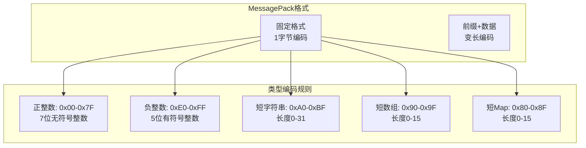

# MessagePack

## 概述与核心概念

MessagePack是一种高效的二进制序列化格式，号称"像JSON一样简单，像二进制一样快速"。它由Furuhashi Sadayuki于2008年创建，设计理念是在保持数据可读性的同时，实现比JSON更小的数据体积和更快的序列化速度。

MessagePack采用类型-长度-数据的紧凑编码方式，无需Schema即可序列化数据，这使得它成为JSON的理想替代方案，特别适合需要高性能的网络通信和数据存储场景。

```mermaid
flowchart TB
    subgraph JSON["JSON格式"]
        J1["{\"name\":\"Alice\",\"age\":25}"]
        J2["27 bytes (文本)"]
    end
    
    subgraph MessagePack["MessagePack格式"]
        M1["0x82 0xa4name 0xa5Alice 0xa3age 0x19"]
        M2["14 bytes (二进制)"]
    end
    
    subgraph 优势["核心优势"]
        Size["体积更小"]
        Speed["速度更快"]
        Compatible["与JSON兼容"]
    end
    
    J1 -.->|编码| M1
    J2 -.->|压缩约50%| M2
    M2 --> Size
    M2 --> Speed
    J1 --> Compatible
```

### 核心特性

| 特性 | 说明 |
|-----|-----|
| 二进制格式 | 紧凑高效，体积小 |
| 无Schema | 自描述，无需预定义结构 |
| JSON兼容 | 可直接与JSON互相转换 |
| 多语言支持 | 50+编程语言实现 |
| 流式处理 | 支持增量解析大文件 |
| 类型丰富 | 支持扩展类型系统 |

## 编码格式详解

### 基本类型编码



### 格式对比示例

**数据：** `{"compact": true, "schema": 0}`

| 格式 | 字节表示 | 大小 |
|-----|---------|-----|
| JSON | `{"compact":true,"schema":0}` | 27 bytes |
| MessagePack | `0x82 0xa7 0x63 0x6f 0x6d 0x70 0x61 0x63 0x74 0xc3 0xa6 0x73 0x63 0x68 0x65 0x6d 0x61 0x00` | 18 bytes |

### 类型系统

| 类型 | 格式标记 | 说明 |
|-----|---------|-----|
| Positive FixInt | 0x00 - 0x7F | 0-127的整数 |
| FixMap | 0x80 - 0x8F | 最多15个元素的map |
| FixArray | 0x90 - 0x9F | 最多15个元素的数组 |
| FixStr | 0xA0 - 0xBF | 最多31字节的字符串 |
| Nil | 0xC0 | null |
| False | 0xC2 | false |
| True | 0xC3 | true |
| Bin8/16/32 | 0xC4-C6 | 二进制数据 |
| Float32/64 | 0xCA-CB | 浮点数 |
| Uint8/16/32/64 | 0xCC-CF | 无符号整数 |
| Int8/16/32/64 | 0xD0-D3 | 有符号整数 |
| Str8/16/32 | 0xD9-DB | 字符串 |
| Array16/32 | 0xDC-DD | 数组 |
| Map16/32 | 0xDE-DF | Map |
| FixExt1-16 | 0xD4-D8 | 固定大小扩展类型 |
| Ext8/16/32 | 0xC7-C9 | 变长扩展类型 |

## 代码示例

### Java MessagePack使用

#### Maven依赖

```xml
<dependencies>
    <!-- MessagePack核心库 -->
    <dependency>
        <groupId>org.msgpack</groupId>
        <artifactId>msgpack-core</artifactId>
        <version>0.9.6</version>
    </dependency>
    
    <!-- Jackson集成（推荐） -->
    <dependency>
        <groupId>org.msgpack</groupId>
        <artifactId>jackson-dataformat-msgpack</artifactId>
        <version>0.9.6</version>
    </dependency>
</dependencies>
```

#### Java代码示例

```java
import org.msgpack.core.*;
import org.msgpack.jackson.dataformat.*;
import com.fasterxml.jackson.databind.*;
import com.fasterxml.jackson.core.*;

import java.io.*;
import java.util.*;

/**
 * MessagePack Java使用示例
 */
public class MessagePackExample {
    
    /**
     * 基础序列化与反序列化
     */
    public static void basicUsage() throws IOException {
        // 创建Packer
        ByteArrayOutputStream out = new ByteArrayOutputStream();
        MessagePacker packer = MessagePack.newDefaultPacker(out);
        
        // 打包数据
        packer.packMapHeader(3);  // Map有3个键值对
        
        packer.packString("name");
        packer.packString("张三");
        
        packer.packString("age");
        packer.packInt(25);
        
        packer.packString("active");
        packer.packBoolean(true);
        
        packer.close();
        
        byte[] packed = out.toByteArray();
        System.out.println("MessagePack大小: " + packed.length + " bytes");
        
        // 解包
        MessageUnpacker unpacker = MessagePack.newDefaultUnpacker(packed);
        
        int mapSize = unpacker.unpackMapHeader();
        System.out.println("Map大小: " + mapSize);
        
        for (int i = 0; i < mapSize; i++) {
            String key = unpacker.unpackString();
            
            switch (key) {
                case "name":
                    System.out.println("Name: " + unpacker.unpackString());
                    break;
                case "age":
                    System.out.println("Age: " + unpacker.unpackInt());
                    break;
                case "active":
                    System.out.println("Active: " + unpacker.unpackBoolean());
                    break;
            }
        }
        
        unpacker.close();
    }
    
    /**
     * 使用Jackson集成（推荐）
     */
    public static void jacksonIntegration() throws IOException {
        // 创建ObjectMapper
        ObjectMapper mapper = new ObjectMapper(new MessagePackFactory());
        
        // 定义POJO
        class User {
            public String name;
            public int age;
            public List<String> hobbies;
            public Map<String, String> metadata;
            
            public User() {}
            
            public User(String name, int age) {
                this.name = name;
                this.age = age;
            }
            
            @Override
            public String toString() {
                return String.format("User{name='%s', age=%d}", name, age);
            }
        }
        
        // 创建对象
        User user = new User("张三", 25);
        user.hobbies = Arrays.asList("编程", "阅读", "游泳");
        user.metadata = new HashMap<>();
        user.metadata.put("city", "北京");
        user.metadata.put("department", "技术部");
        
        // 序列化
        byte[] packed = mapper.writeValueAsBytes(user);
        System.out.println("Jackson序列化大小: " + packed.length + " bytes");
        
        // 反序列化
        User unpacked = mapper.readValue(packed, User.class);
        System.out.println("反序列化: " + unpacked);
        
        // 与JSON对比
        ObjectMapper jsonMapper = new ObjectMapper();
        String json = jsonMapper.writeValueAsString(user);
        System.out.println("JSON大小: " + json.getBytes().length + " bytes");
    }
    
    /**
     * 复杂数据结构处理
     */
    public static void complexData() throws IOException {
        // 创建复杂嵌套结构
        Map<String, Object> data = new HashMap<>();
        data.put("users", Arrays.asList(
            createUserMap("张三", 25, Arrays.asList("编程", "阅读")),
            createUserMap("李四", 30, Arrays.asList("旅游", "摄影")),
            createUserMap("王五", 28, Arrays.asList("音乐", "电影"))
        ));
        data.put("total", 3);
        data.put("timestamp", System.currentTimeMillis());
        
        // 使用Jackson序列化
        ObjectMapper mapper = new ObjectMapper(new MessagePackFactory());
        byte[] packed = mapper.writeValueAsBytes(data);
        
        System.out.println("复杂结构大小: " + packed.length + " bytes");
        
        // 反序列化为Map
        @SuppressWarnings("unchecked")
        Map<String, Object> unpacked = mapper.readValue(packed, Map.class);
        
        @SuppressWarnings("unchecked")
        List<Map<String, Object>> users = (List<Map<String, Object>>) unpacked.get("users");
        System.out.println("用户数量: " + users.size());
        
        for (Map<String, Object> user : users) {
            System.out.println("  - " + user.get("name") + ", " + user.get("age"));
        }
    }
    
    private static Map<String, Object> createUserMap(String name, int age, List<String> hobbies) {
        Map<String, Object> user = new HashMap<>();
        user.put("name", name);
        user.put("age", age);
        user.put("hobbies", hobbies);
        return user;
    }
    
    /**
     * 流式处理大文件
     */
    public static void streamingProcess() throws IOException {
        // 写入大量数据
        File file = new File("data.msgpack");
        
        try (MessagePacker packer = MessagePack.newDefaultPacker(
                new FileOutputStream(file))) {
            
            for (int i = 0; i < 10000; i++) {
                packer.packArrayHeader(3);
                packer.packInt(i);
                packer.packString("user" + i);
                packer.packDouble(Math.random() * 100);
            }
        }
        
        System.out.println("写入完成，文件大小: " + file.length() + " bytes");
        
        // 流式读取
        try (MessageUnpacker unpacker = MessagePack.newDefaultUnpacker(
                new FileInputStream(file))) {
            
            int count = 0;
            while (unpacker.hasNext()) {
                unpacker.unpackArrayHeader();  // 跳过数组头
                int id = unpacker.unpackInt();
                String name = unpacker.unpackString();
                double score = unpacker.unpackDouble();
                
                if (count < 3) {
                    System.out.println("Record " + count + ": " + id + ", " + name + ", " + score);
                }
                count++;
            }
            
            System.out.println("总记录数: " + count);
        }
        
        file.delete();
    }
    
    /**
     * 扩展类型使用
     */
    public static void extensionType() throws IOException {
        // 使用扩展类型存储自定义数据
        ByteArrayOutputStream out = new ByteArrayOutputStream();
        
        try (MessagePacker packer = MessagePack.newDefaultPacker(out)) {
            // 打包扩展类型 (类型ID=1, 数据为时间戳)
            long timestamp = System.currentTimeMillis();
            byte[] timestampBytes = longToBytes(timestamp);
            packer.packExtensionTypeHeader((byte) 1, timestampBytes.length);
            packer.writePayload(timestampBytes);
        }
        
        byte[] packed = out.toByteArray();
        
        // 解包
        try (MessageUnpacker unpacker = MessagePack.newDefaultUnpacker(packed)) {
            ExtensionTypeHeader header = unpacker.unpackExtensionTypeHeader();
            System.out.println("扩展类型ID: " + header.getType());
            
            byte[] data = new byte[header.getLength()];
            unpacker.readPayload(data);
            long timestamp = bytesToLong(data);
            System.out.println("时间戳: " + timestamp);
        }
    }
    
    private static byte[] longToBytes(long value) {
        return new byte[] {
            (byte) (value >> 56), (byte) (value >> 48),
            (byte) (value >> 40), (byte) (value >> 32),
            (byte) (value >> 24), (byte) (value >> 16),
            (byte) (value >> 8), (byte) value
        };
    }
    
    private static long bytesToLong(byte[] bytes) {
        return ((long) (bytes[0] & 0xFF) << 56) |
               ((long) (bytes[1] & 0xFF) << 48) |
               ((long) (bytes[2] & 0xFF) << 40) |
               ((long) (bytes[3] & 0xFF) << 32) |
               ((long) (bytes[4] & 0xFF) << 24) |
               ((long) (bytes[5] & 0xFF) << 16) |
               ((long) (bytes[6] & 0xFF) << 8) |
               ((long) (bytes[7] & 0xFF));
    }
    
    /**
     * 性能测试
     */
    public static void performanceTest() throws IOException {
        final int ITERATIONS = 100000;
        
        // 测试数据
        Map<String, Object> data = new HashMap<>();
        data.put("name", "张三");
        data.put("age", 25);
        data.put("active", true);
        data.put("score", 95.5);
        data.put("tags", Arrays.asList("java", "python", "go"));
        
        ObjectMapper msgpackMapper = new ObjectMapper(new MessagePackFactory());
        ObjectMapper jsonMapper = new ObjectMapper();
        
        // 预热
        for (int i = 0; i < 1000; i++) {
            msgpackMapper.writeValueAsBytes(data);
        }
        
        // MessagePack序列化测试
        long start = System.nanoTime();
        for (int i = 0; i < ITERATIONS; i++) {
            msgpackMapper.writeValueAsBytes(data);
        }
        long msgpackSerializeTime = System.nanoTime() - start;
        
        // JSON序列化测试
        start = System.nanoTime();
        for (int i = 0; i < ITERATIONS; i++) {
            jsonMapper.writeValueAsBytes(data);
        }
        long jsonSerializeTime = System.nanoTime() - start;
        
        // 准备反序列化数据
        byte[] msgpackData = msgpackMapper.writeValueAsBytes(data);
        byte[] jsonData = jsonMapper.writeValueAsBytes(data);
        
        // MessagePack反序列化测试
        start = System.nanoTime();
        for (int i = 0; i < ITERATIONS; i++) {
            msgpackMapper.readValue(msgpackData, Map.class);
        }
        long msgpackDeserializeTime = System.nanoTime() - start;
        
        // JSON反序列化测试
        start = System.nanoTime();
        for (int i = 0; i < ITERATIONS; i++) {
            jsonMapper.readValue(jsonData, Map.class);
        }
        long jsonDeserializeTime = System.nanoTime() - start;
        
        System.out.println("\n=== 性能测试结果 ===");
        System.out.println("数据大小对比:");
        System.out.println("  MessagePack: " + msgpackData.length + " bytes");
        System.out.println("  JSON: " + jsonData.length + " bytes");
        System.out.println("  压缩率: " + (100 - msgpackData.length * 100 / jsonData.length) + "%");
        
        System.out.println("\n序列化性能 (" + ITERATIONS + " 次):");
        System.out.println("  MessagePack: " + (msgpackSerializeTime / 1_000_000) + " ms");
        System.out.println("  JSON: " + (jsonSerializeTime / 1_000_000) + " ms");
        
        System.out.println("\n反序列化性能 (" + ITERATIONS + " 次):");
        System.out.println("  MessagePack: " + (msgpackDeserializeTime / 1_000_000) + " ms");
        System.out.println("  JSON: " + (jsonDeserializeTime / 1_000_000) + " ms");
    }
    
    public static void main(String[] args) throws IOException {
        basicUsage();
        jacksonIntegration();
        complexData();
        streamingProcess();
        extensionType();
        performanceTest();
    }
}
```

### Python MessagePack使用

```python
#!/usr/bin/env python3
"""
MessagePack Python使用示例
"""

import msgpack
import json
import time
from io import BytesIO


def basic_usage():
    """基础使用"""
    # 序列化
    data = {
        'name': '张三',
        'age': 25,
        'active': True,
        'score': 95.5,
        'tags': ['python', 'java', 'go']
    }
    
    packed = msgpack.packb(data)
    print(f"MessagePack大小: {len(packed)} bytes")
    
    # 与JSON对比
    json_data = json.dumps(data).encode()
    print(f"JSON大小: {len(json_data)} bytes")
    print(f"压缩率: {(1 - len(packed) / len(json_data)) * 100:.1f}%")
    
    # 反序列化
    unpacked = msgpack.unpackb(packed)
    print(f"反序列化: {unpacked}")


def streaming_process():
    """流式处理"""
    buf = BytesIO()
    
    # 打包器
    packer = msgpack.Packer()
    
    # 写入多个对象
    for i in range(1000):
        record = {'id': i, 'name': f'user{i}', 'value': i * 0.5}
        buf.write(packer.pack(record))
    
    # 读取
    buf.seek(0)
    unpacker = msgpack.Unpacker(buf)
    
    count = 0
    for record in unpacker:
        if count < 3:
            print(f"Record {count}: {record}")
        count += 1
    
    print(f"总记录数: {count}")


def custom_types():
    """自定义类型处理"""
    import datetime
    
    # 定义编码/解码函数
    def encode_datetime(obj):
        if isinstance(obj, datetime.datetime):
            return {'__datetime__': obj.isoformat()}
        return obj
    
    def decode_datetime(obj):
        if '__datetime__' in obj:
            return datetime.datetime.fromisoformat(obj['__datetime__'])
        return obj
    
    # 包含datetime的数据
    data = {
        'name': '张三',
        'created_at': datetime.datetime.now()
    }
    
    # 序列化
    packed = msgpack.packb(data, default=encode_datetime)
    
    # 反序列化
    unpacked = msgpack.unpackb(packed, object_hook=decode_datetime)
    print(f"反序列化: {unpacked}")
    print(f"datetime类型: {type(unpacked['created_at'])}")


def raw_binary_data():
    """处理二进制数据"""
    # 包含字节的数据
    data = {
        'filename': 'image.png',
        'content': b'\x89PNG\r\n\x1a\n\x00\x00\x00\rIHDR'
    }
    
    packed = msgpack.packb(data)
    unpacked = msgpack.unpackb(packed)
    
    print(f"原始字节: {data['content']}")
    print(f"反序列化字节: {unpacked['content']}")
    print(f"类型: {type(unpacked['content'])}")


def performance_test():
    """性能测试"""
    ITERATIONS = 100000
    
    data = {
        'name': '张三',
        'age': 25,
        'active': True,
        'score': 95.5,
        'tags': ['python', 'java', 'go'],
        'metadata': {'city': '北京', 'department': '技术部'}
    }
    
    # 预热
    for _ in range(1000):
        msgpack.packb(data)
    
    # MessagePack序列化
    start = time.time()
    for _ in range(ITERATIONS):
        msgpack.packb(data)
    msgpack_serialize_time = time.time() - start
    
    # JSON序列化
    start = time.time()
    for _ in range(ITERATIONS):
        json.dumps(data).encode()
    json_serialize_time = time.time() - start
    
    # 准备数据
    msgpack_data = msgpack.packb(data)
    json_data = json.dumps(data).encode()
    
    # MessagePack反序列化
    start = time.time()
    for _ in range(ITERATIONS):
        msgpack.unpackb(msgpack_data)
    msgpack_deserialize_time = time.time() - start
    
    # JSON反序列化
    start = time.time()
    for _ in range(ITERATIONS):
        json.loads(json_data)
    json_deserialize_time = time.time() - start
    
    print("\n=== 性能测试结果 ===")
    print(f"数据大小:")
    print(f"  MessagePack: {len(msgpack_data)} bytes")
    print(f"  JSON: {len(json_data)} bytes")
    
    print(f"\n序列化 {ITERATIONS} 次:")
    print(f"  MessagePack: {msgpack_serialize_time*1000:.2f} ms")
    print(f"  JSON: {json_serialize_time*1000:.2f} ms")
    print(f"  加速比: {json_serialize_time/msgpack_serialize_time:.2f}x")
    
    print(f"\n反序列化 {ITERATIONS} 次:")
    print(f"  MessagePack: {msgpack_deserialize_time*1000:.2f} ms")
    print(f"  JSON: {json_deserialize_time*1000:.2f} ms")
    print(f"  加速比: {json_deserialize_time/msgpack_deserialize_time:.2f}x")


def file_storage():
    """文件存储"""
    data = [
        {'id': i, 'name': f'user{i}', 'score': i * 10.5}
        for i in range(10000)
    ]
    
    # MessagePack格式存储
    with open('data.msgpack', 'wb') as f:
        msgpack.pack(data, f)
    
    # JSON格式存储
    with open('data.json', 'w', encoding='utf-8') as f:
        json.dump(data, f)
    
    import os
    msgpack_size = os.path.getsize('data.msgpack')
    json_size = os.path.getsize('data.json')
    
    print(f"MessagePack文件: {msgpack_size} bytes")
    print(f"JSON文件: {json_size} bytes")
    print(f"空间节省: {(1 - msgpack_size/json_size)*100:.1f}%")
    
    # 读取
    with open('data.msgpack', 'rb') as f:
        loaded = msgpack.unpack(f)
    
    print(f"加载记录数: {len(loaded)}")
    
    # 清理
    os.remove('data.msgpack')
    os.remove('data.json')


if __name__ == '__main__':
    basic_usage()
    streaming_process()
    custom_types()
    raw_binary_data()
    performance_test()
    file_storage()
```

## 优缺点分析

| 优势 | 劣势 |
|-----|-----|
| 体积比JSON小30-50% | 二进制格式不可读 |
| 解析速度比JSON快 | 无Schema验证 |
| 无需预定义结构 | 不支持Schema演进 |
| 与JSON无缝互转 | 复杂类型支持有限 |
| 多语言支持丰富 | 默认不支持日期等类型 |

## 应用场景

1. **API通信**：替代JSON的REST API
2. **缓存存储**：Redis等缓存的二进制值
3. **日志收集**：高效的日志序列化
4. **实时通信**：WebSocket消息格式
5. **配置文件**：紧凑的配置存储

## 总结

MessagePack是JSON的理想二进制替代方案，特别适合需要：
- 减少网络传输开销
- 提升序列化性能
- 保持动态类型灵活性

在不需要Schema约束的场景下，MessagePack是比Protobuf/Avro更简单的选择。
