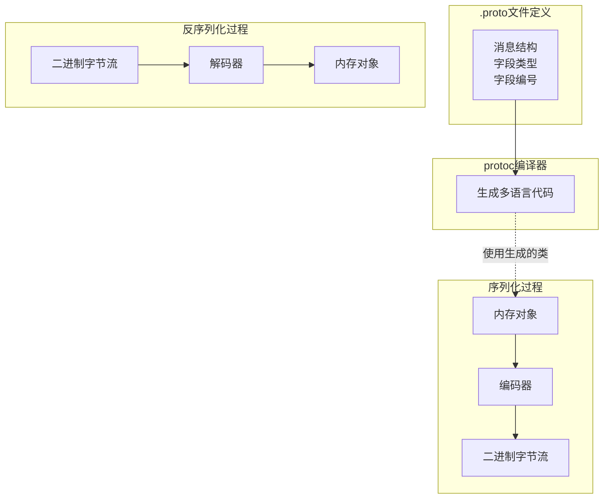
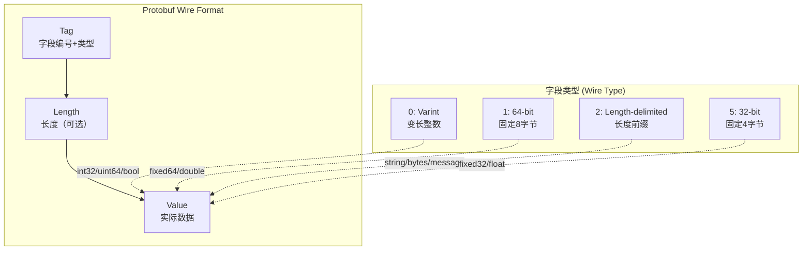
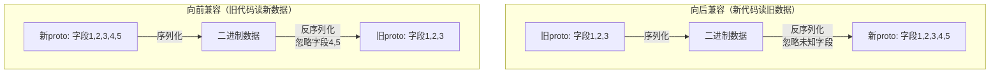

# Protobuf协议

## 概述与核心概念

Protocol Buffers（简称Protobuf）是Google开发的一种语言中立、平台中立、可扩展的序列化结构化数据的方法，用于通信协议、数据存储等场景。相比XML和JSON，Protobuf更小、更快、更简单。

Protobuf最初于2001年在Google内部开发使用，2008年开源。目前已成为分布式系统中最流行的序列化方案之一，被广泛应用于gRPC、etcd、Kubernetes等著名项目。



### 核心优势

| 特性 | Protobuf | JSON | XML |
|-----|----------|------|-----|
| 数据大小 | 小（二进制） | 中（文本） | 大（文本+标签） |
| 解析速度 | 极快 | 快 | 慢 |
| 可读性 | 差（二进制） | 好 | 好 |
| 模式定义 | 强制（.proto） | 无 | Schema/XSD |
| 版本兼容 | 优秀 | 无 | 一般 |
| 语言支持 | 多语言 | 通用 | 通用 |

## 架构与原理

### Protobuf编码原理



### Varint编码机制

Varint是Protobuf的核心编码方式，用于编码变长整数，小数字使用更少的字节。

```
数值: 300
二进制: 0000 0001 0010 1100
Varint: 1010 1100 0000 0010
        │└─ 取低7位 ─┘│└─ 取低7位 ─┘
        └─ 后续还有字节 └─ 最高位0表示结束
        
解码: 
  1010 1100 → 去掉最高位 → 010 1100
  0000 0010 → 去掉最高位 → 000 0010
  组合: 000 0010 + 010 1100 = 0001 0010 1100 = 300
```

## Protobuf 3语法详解

### 基础定义文件

```protobuf
syntax = "proto3";

// 包名定义
package tutorial;

// 生成代码选项
option go_package = "github.com/example/tutorial";
option java_package = "com.example.tutorial";
option java_multiple_files = true;
option java_outer_classname = "AddressBookProtos";
option csharp_namespace = "Tutorial";
option objc_class_prefix = "TUT";

// 引入其他proto文件
import "google/protobuf/timestamp.proto";
import "google/protobuf/any.proto";
import "google/protobuf/empty.proto";

// 定义消息
message Person {
    // 字段格式: 类型 名称 = 字段编号;
    string name = 1;
    int32 id = 2;
    string email = 3;
    
    // 枚举类型
    enum PhoneType {
        MOBILE = 0;
        HOME = 1;
        WORK = 2;
    }
    
    // 嵌套消息
    message PhoneNumber {
        string number = 1;
        PhoneType type = 2;
    }
    
    // 重复字段（数组/列表）
    repeated PhoneNumber phones = 4;
    
    // 时间戳字段
    google.protobuf.Timestamp last_updated = 5;
    
    // Oneof：多选一字段
    oneof contact {
        string phone = 6;
        string email_address = 7;
    }
    
    // Map类型
    map<string, string> attributes = 8;
    
    // 保留字段（向后兼容）
    reserved 9, 10, 15;
    reserved "foo", "bar";
}

// 复杂消息示例
message AddressBook {
    repeated Person people = 1;
    int32 version = 2;
    string owner = 3;
}

// 定义服务（用于gRPC）
service AddressBookService {
    rpc GetPerson(GetPersonRequest) returns (Person);
    rpc ListPeople(ListPeopleRequest) returns (ListPeopleResponse);
    rpc StreamPeople(StreamPeopleRequest) returns (stream Person);
}

message GetPersonRequest {
    int32 person_id = 1;
}

message ListPeopleRequest {
    int32 page = 1;
    int32 page_size = 2;
}

message ListPeopleResponse {
    repeated Person people = 1;
    int32 total = 2;
}

message StreamPeopleRequest {
    string filter = 1;
}
```

### 标量类型映射表

| Protobuf类型 | Go类型 | Java类型 | Python类型 | C++类型 | 说明 |
|-------------|-------|---------|-----------|--------|-----|
| double | float64 | double | float | double | 64位浮点 |
| float | float32 | float | float | float | 32位浮点 |
| int32 | int32 | int | int | int32 | 变长编码，负数效率低 |
| int64 | int64 | long | int/long | int64 | 变长编码，负数效率低 |
| uint32 | uint32 | int | int/long | uint32 | 变长编码 |
| uint64 | uint64 | long | int/long | uint64 | 变长编码 |
| sint32 | int32 | int | int | int32 | ZigZag编码，适合负数 |
| sint64 | int64 | long | int/long | int64 | ZigZag编码，适合负数 |
| fixed32 | uint32 | int | int/long | uint32 | 固定4字节 |
| fixed64 | uint64 | long | int/long | uint64 | 固定8字节 |
| sfixed32 | int32 | int | int | int32 | 固定4字节，有符号 |
| sfixed64 | int64 | long | int/long | int64 | 固定8字节，有符号 |
| bool | bool | boolean | bool | bool | 布尔值 |
| string | string | String | str | string | UTF-8文本 |
| bytes | []byte | ByteString | bytes | string | 原始字节 |

## 代码示例

### Java Protobuf使用

#### Maven依赖配置

```xml
<dependencies>
    <dependency>
        <groupId>com.google.protobuf</groupId>
        <artifactId>protobuf-java</artifactId>
        <version>3.24.0</version>
    </dependency>
    <dependency>
        <groupId>com.google.protobuf</groupId>
        <artifactId>protobuf-java-util</artifactId>
        <version>3.24.0</version>
    </dependency>
</dependencies>

<build>
    <extensions>
        <extension>
            <groupId>kr.motd.maven</groupId>
            <artifactId>os-maven-plugin</artifactId>
            <version>1.7.1</version>
        </extension>
    </extensions>
    <plugins>
        <plugin>
            <groupId>org.xolstice.maven.plugins</groupId>
            <artifactId>protobuf-maven-plugin</artifactId>
            <version>0.6.1</version>
            <configuration>
                <protocArtifact>com.google.protobuf:protoc:3.24.0:exe:${os.detected.classifier}</protocArtifact>
            </configuration>
            <executions>
                <execution>
                    <goals>
                        <goal>compile</goal>
                    </goals>
                </execution>
            </executions>
        </plugin>
    </plugins>
</build>
```

#### Java代码示例

```java
import com.google.protobuf.*;
import com.google.protobuf.util.*;
import tutorial.AddressBookProtos.*;

import java.io.*;
import java.util.*;

/**
 * Protobuf Java使用示例
 */
public class ProtobufExample {
    
    /**
     * 创建Person对象
     */
    public static Person createPerson() {
        // 创建PhoneNumber
        Person.PhoneNumber phone1 = Person.PhoneNumber.newBuilder()
            .setNumber("13800138000")
            .setType(Person.PhoneType.MOBILE)
            .build();
            
        Person.PhoneNumber phone2 = Person.PhoneNumber.newBuilder()
            .setNumber("010-12345678")
            .setType(Person.PhoneType.HOME)
            .build();
        
        // 创建Person
        return Person.newBuilder()
            .setName("张三")
            .setId(1001)
            .setEmail("zhangsan@example.com")
            .addPhones(phone1)
            .addPhones(phone2)
            .putAttributes("department", "技术部")
            .putAttributes("level", "P7")
            .setLastUpdated(Timestamps.fromMillis(System.currentTimeMillis()))
            .build();
    }
    
    /**
     * 序列化与反序列化
     */
    public static void serializationDemo() throws Exception {
        Person person = createPerson();
        
        // 序列化为字节数组
        byte[] bytes = person.toByteArray();
        System.out.println("序列化后大小: " + bytes.length + " bytes");
        
        // 反序列化
        Person parsedPerson = Person.parseFrom(bytes);
        System.out.println("反序列化: " + parsedPerson.getName());
        
        // 序列化到文件
        try (FileOutputStream fos = new FileOutputStream("person.bin")) {
            person.writeTo(fos);
        }
        
        // 从文件反序列化
        try (FileInputStream fis = new FileInputStream("person.bin")) {
            Person filePerson = Person.parseFrom(fis);
            System.out.println("从文件读取: " + filePerson.getName());
        }
    }
    
    /**
     * 与JSON互转
     */
    public static void jsonConversion() throws Exception {
        Person person = createPerson();
        
        // Protobuf转JSON
        String json = JsonFormat.printer().print(person);
        System.out.println("JSON格式:");
        System.out.println(json);
        
        // JSON转Protobuf
        Person.Builder personBuilder = Person.newBuilder();
        JsonFormat.parser().merge(json, personBuilder);
        Person parsedFromJson = personBuilder.build();
        System.out.println("从JSON解析: " + parsedFromJson.getName());
    }
    
    /**
     * 动态构建（反射）
     */
    public static void dynamicBuild() throws Exception {
        // 获取描述符
        Descriptors.Descriptor personDescriptor = Person.getDescriptor();
        
        // 动态构建消息
        DynamicMessage.Builder builder = DynamicMessage.newBuilder(personDescriptor);
        builder.setField(personDescriptor.findFieldByName("name"), "李四");
        builder.setField(personDescriptor.findFieldByName("id"), 1002);
        
        DynamicMessage dynamicPerson = builder.build();
        
        // 序列化
        byte[] bytes = dynamicPerson.toByteArray();
        
        // 反序列化
        DynamicMessage parsed = DynamicMessage.parseFrom(personDescriptor, bytes);
        System.out.println("动态构建: " + parsed.getField(personDescriptor.findFieldByName("name")));
    }
    
    /**
     * 合并消息（字段级更新）
     */
    public static void mergeDemo() {
        Person person1 = Person.newBuilder()
            .setName("张三")
            .setId(1001)
            .setEmail("zhangsan@example.com")
            .build();
            
        Person person2 = Person.newBuilder()
            .setName("张三(已更新)")
            .addPhones(
                Person.PhoneNumber.newBuilder()
                    .setNumber("13900139000")
                    .build()
            )
            .build();
        
        // 合并：person2的非默认值字段覆盖person1
        Person merged = person1.toBuilder().mergeFrom(person2).build();
        
        System.out.println("合并后名称: " + merged.getName());
        System.out.println("合并后ID: " + merged.getId());  // 保持1001
        System.out.println("合并后电话数: " + merged.getPhonesCount());
    }
    
    /**
     * Oneof字段处理
     */
    public static void oneofDemo() {
        Person person1 = Person.newBuilder()
            .setName("张三")
            .setPhone("13800138000")  // 设置oneof字段1
            .build();
            
        Person person2 = Person.newBuilder()
            .setName("李四")
            .setEmailAddress("lisi@example.com")  // 设置oneof字段2，自动清除phone
            .build();
        
        System.out.println("person1联系类型: " + person1.getContactCase());
        System.out.println("person2联系类型: " + person2.getContactCase());
    }
    
    /**
     * 性能测试
     */
    public static void performanceTest() {
        final int ITERATIONS = 100000;
        
        // 创建测试数据
        Person person = createPerson();
        
        // 测试序列化性能
        long start = System.nanoTime();
        for (int i = 0; i < ITERATIONS; i++) {
            byte[] bytes = person.toByteArray();
        }
        long serializeTime = System.nanoTime() - start;
        
        // 测试反序列化性能
        byte[] bytes = person.toByteArray();
        start = System.nanoTime();
        for (int i = 0; i < ITERATIONS; i++) {
            try {
                Person.parseFrom(bytes);
            } catch (InvalidProtocolBufferException e) {
                e.printStackTrace();
            }
        }
        long deserializeTime = System.nanoTime() - start;
        
        System.out.println("=== 性能测试结果 ===");
        System.out.println("序列化 " + ITERATIONS + " 次: " + (serializeTime / 1_000_000) + " ms");
        System.out.println("反序列化 " + ITERATIONS + " 次: " + (deserializeTime / 1_000_000) + " ms");
        System.out.println("单条序列化: " + (serializeTime / ITERATIONS) + " ns");
        System.out.println("单条大小: " + bytes.length + " bytes");
    }
    
    public static void main(String[] args) throws Exception {
        serializationDemo();
        jsonConversion();
        mergeDemo();
        oneofDemo();
        performanceTest();
    }
}
```

### Go Protobuf使用

```go
package main

import (
    "fmt"
    "google.golang.org/protobuf/proto"
    "google.golang.org/protobuf/types/known/timestamppb"
    "log"
    "os"
    "time"
    
    tutorial "example/gen/go/tutorial"
)

func createPerson() *tutorial.Person {
    return &tutorial.Person{
        Name:  "张三",
        Id:    1001,
        Email: "zhangsan@example.com",
        Phones: []*tutorial.Person_PhoneNumber{
            {
                Number: "13800138000",
                Type:   tutorial.Person_MOBILE,
            },
            {
                Number: "010-12345678",
                Type:   tutorial.Person_HOME,
            },
        },
        Attributes: map[string]string{
            "department": "技术部",
            "level":      "P7",
        },
        LastUpdated: timestamppb.New(time.Now()),
        Contact: &tutorial.Person_Phone{
            Phone: "13800138000",
        },
    }
}

func serializationDemo() {
    person := createPerson()
    
    // 序列化
    bytes, err := proto.Marshal(person)
    if err != nil {
        log.Fatal(err)
    }
    fmt.Printf("序列化后大小: %d bytes\n", len(bytes))
    
    // 反序列化
    parsedPerson := &tutorial.Person{}
    if err := proto.Unmarshal(bytes, parsedPerson); err != nil {
        log.Fatal(err)
    }
    fmt.Printf("反序列化: %s\n", parsedPerson.GetName())
    
    // 写入文件
    if err := os.WriteFile("person.bin", bytes, 0644); err != nil {
        log.Fatal(err)
    }
    
    // 从文件读取
    fileBytes, err := os.ReadFile("person.bin")
    if err != nil {
        log.Fatal(err)
    }
    
    filePerson := &tutorial.Person{}
    if err := proto.Unmarshal(fileBytes, filePerson); err != nil {
        log.Fatal(err)
    }
    fmt.Printf("从文件读取: %s\n", filePerson.GetName())
}

func fieldAccessDemo() {
    person := createPerson()
    
    // 访问字段
    fmt.Printf("Name: %s\n", person.GetName())
    fmt.Printf("ID: %d\n", person.GetId())
    
    // 遍历重复字段
    for _, phone := range person.GetPhones() {
        fmt.Printf("Phone: %s, Type: %v\n", phone.GetNumber(), phone.GetType())
    }
    
    // 访问map
    for key, value := range person.GetAttributes() {
        fmt.Printf("Attribute %s: %s\n", key, value)
    }
    
    // 访问oneof
    switch person.Contact.(type) {
    case *tutorial.Person_Phone:
        fmt.Printf("Contact by phone: %s\n", person.GetPhone())
    case *tutorial.Person_EmailAddress:
        fmt.Printf("Contact by email: %s\n", person.GetEmailAddress())
    }
}

func cloneAndMergeDemo() {
    person1 := &tutorial.Person{
        Name:  "张三",
        Id:    1001,
        Email: "zhangsan@example.com",
    }
    
    person2 := &tutorial.Person{
        Name: "张三(已更新)",
        Phones: []*tutorial.Person_PhoneNumber{
            {
                Number: "13900139000",
                Type:   tutorial.Person_MOBILE,
            },
        },
    }
    
    // 克隆
    clone := proto.Clone(person1).(*tutorial.Person)
    fmt.Printf("克隆: %s\n", clone.GetName())
    
    // 合并
    merged := &tutorial.Person{}
    proto.Merge(merged, person1)
    proto.Merge(merged, person2)
    
    fmt.Printf("合并后名称: %s\n", merged.GetName())
    fmt.Printf("合并后ID: %d\n", merged.GetId())
}

func sizeAndEqualityDemo() {
    person1 := createPerson()
    person2 := createPerson()
    
    // 计算序列化大小
    size := proto.Size(person1)
    fmt.Printf("序列化大小: %d bytes\n", size)
    
    // 相等性比较
    equal := proto.Equal(person1, person2)
    fmt.Printf("对象相等: %v\n", equal)
}

func main() {
    serializationDemo()
    fieldAccessDemo()
    cloneAndMergeDemo()
    sizeAndEqualityDemo()
}
```

### Python Protobuf使用

```python
#!/usr/bin/env python3
"""
Protobuf Python使用示例
"""

import tutorial_pb2
import tutorial_pb2_grpc
from google.protobuf import json_format
from google.protobuf.timestamp_pb2 import Timestamp
from google.protobuf.struct_pb2 import Struct
import time


def create_person():
    """创建Person对象"""
    person = tutorial_pb2.Person()
    person.name = "张三"
    person.id = 1001
    person.email = "zhangsan@example.com"
    
    # 添加phone
    phone1 = person.phones.add()
    phone1.number = "13800138000"
    phone1.type = tutorial_pb2.Person.MOBILE
    
    phone2 = person.phones.add()
    phone2.number = "010-12345678"
    phone2.type = tutorial_pb2.Person.HOME
    
    # 设置timestamp
    person.last_updated.GetCurrentTime()
    
    # 设置map
    person.attributes["department"] = "技术部"
    person.attributes["level"] = "P7"
    
    # 设置oneof
    person.phone = "13800138000"
    
    return person


def serialization_demo():
    """序列化与反序列化示例"""
    person = create_person()
    
    # 序列化为字节
    serialized = person.SerializeToString()
    print(f"序列化后大小: {len(serialized)} bytes")
    
    # 反序列化
    parsed_person = tutorial_pb2.Person()
    parsed_person.ParseFromString(serialized)
    print(f"反序列化: {parsed_person.name}")
    
    # 写入文件
    with open("person.bin", "wb") as f:
        f.write(serialized)
    
    # 从文件读取
    with open("person.bin", "rb") as f:
        file_bytes = f.read()
    
    file_person = tutorial_pb2.Person()
    file_person.ParseFromString(file_bytes)
    print(f"从文件读取: {file_person.name}")


def json_conversion():
    """JSON转换示例"""
    person = create_person()
    
    # 转JSON
    json_str = json_format.MessageToJson(person)
    print(f"JSON格式:\n{json_str}")
    
    # 从JSON解析
    parsed_from_json = tutorial_pb2.Person()
    json_format.Parse(json_str, parsed_from_json)
    print(f"从JSON解析: {parsed_from_json.name}")


def reflection_demo():
    """反射示例"""
    person = create_person()
    
    # 获取描述符
    descriptor = tutorial_pb2.Person.DESCRIPTOR
    
    print(f"消息名称: {descriptor.name}")
    print(f"字段数: {len(descriptor.fields)}")
    
    # 遍历字段
    for field in descriptor.fields:
        value = getattr(person, field.name)
        print(f"  {field.name}: {value}")


def merge_demo():
    """合并示例"""
    person1 = tutorial_pb2.Person()
    person1.name = "张三"
    person1.id = 1001
    person1.email = "zhangsan@example.com"
    
    person2 = tutorial_pb2.Person()
    person2.name = "张三(已更新)"
    phone = person2.phones.add()
    phone.number = "13900139000"
    
    # 合并
    merged = tutorial_pb2.Person()
    merged.CopyFrom(person1)
    merged.MergeFrom(person2)
    
    print(f"合并后名称: {merged.name}")
    print(f"合并后ID: {merged.id}")
    print(f"合并后电话数: {len(merged.phones)}")


def performance_test():
    """性能测试"""
    import time
    
    ITERATIONS = 100000
    person = create_person()
    
    # 测试序列化
    start = time.time()
    for _ in range(ITERATIONS):
        serialized = person.SerializeToString()
    serialize_time = time.time() - start
    
    serialized = person.SerializeToString()
    
    # 测试反序列化
    start = time.time()
    for _ in range(ITERATIONS):
        parsed = tutorial_pb2.Person()
        parsed.ParseFromString(serialized)
    deserialize_time = time.time() - start
    
    print("\n=== 性能测试结果 ===")
    print(f"序列化 {ITERATIONS} 次: {serialize_time*1000:.2f} ms")
    print(f"反序列化 {ITERATIONS} 次: {deserialize_time*1000:.2f} ms")
    print(f"单条序列化: {serialize_time/ITERATIONS*1e6:.2f} μs")
    print(f"单条大小: {len(serialized)} bytes")


if __name__ == "__main__":
    serialization_demo()
    json_conversion()
    reflection_demo()
    merge_demo()
    performance_test()
```

## 版本兼容性机制



### 版本演化规则

| 操作 | 是否安全 | 说明 |
|-----|---------|-----|
| 添加新字段 | ✓ 安全 | 使用新字段编号 |
| 删除字段 | ✗ 不推荐 | 使用`reserved`保留 |
| 修改字段编号 | ✗ 危险 | 破坏兼容性 |
| 修改字段类型 | △ 谨慎 | 可能破坏兼容性 |
| 修改字段名 | ✓ 安全 | 不影响二进制 |
| 添加`deprecated` | ✓ 安全 | 标记弃用 |

## 优缺点分析

| 优势 | 劣势 |
|-----|-----|
| 二进制编码，体积小 | 二进制格式不可读 |
| 解析速度快 | 需要编译生成代码 |
| 强类型定义 | 学习曲线较陡 |
| 优秀的版本兼容性 | 文本格式不如JSON灵活 |
| 多语言支持 | 动态语言支持相对弱 |
| 代码生成，开发效率高 | 需要.proto文件管理 |

## 应用场景

1. **RPC通信**：gRPC的默认序列化格式
2. **数据存储**：高效持久化结构化数据
3. **配置文件**：类型安全的配置管理
4. **消息队列**：Kafka、Pulsar等的消息格式
5. **缓存数据**：Redis等缓存的二进制存储

## 总结

Protocol Buffers以其高效的二进制编码、强类型定义和优秀的版本兼容性，成为分布式系统中数据序列化的首选方案。掌握Protobuf的编码原理和最佳实践，对于设计高性能的分布式系统至关重要。

关键要点：
- 选择合适的字段类型（如sint32用于负数）
- 合理规划字段编号，使用reserved关键字
- 利用版本兼容性规则平滑升级
- 结合gRPC构建高性能服务
