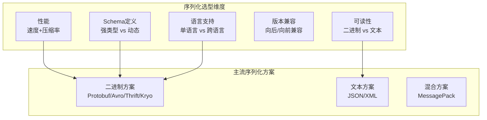
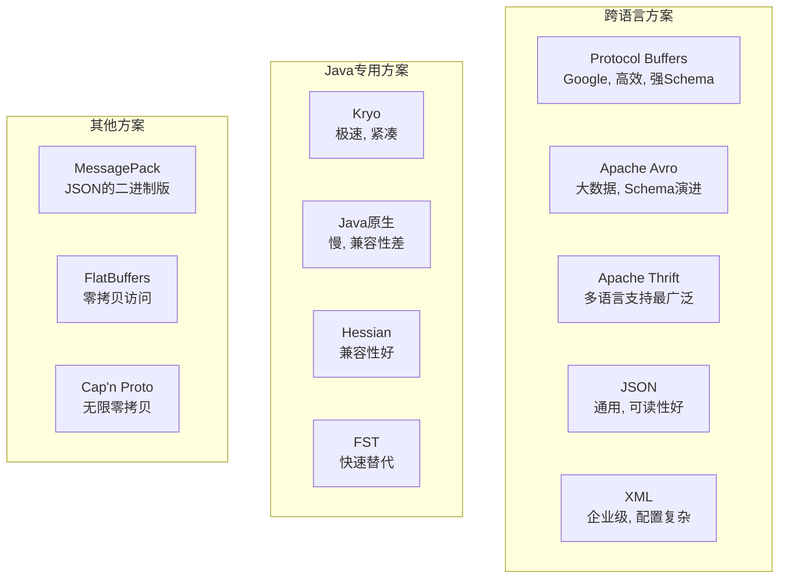
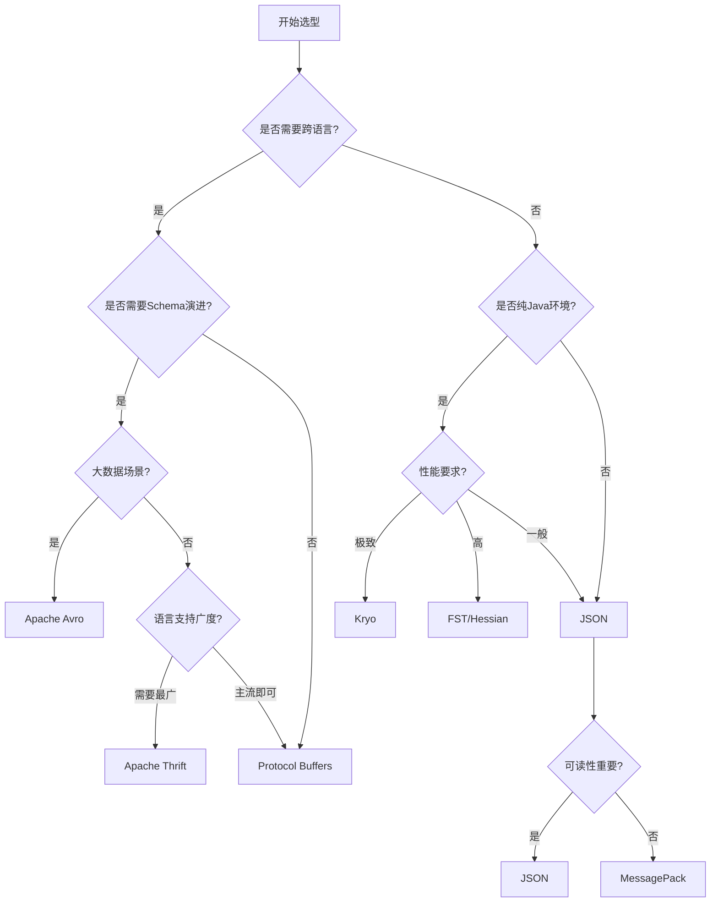
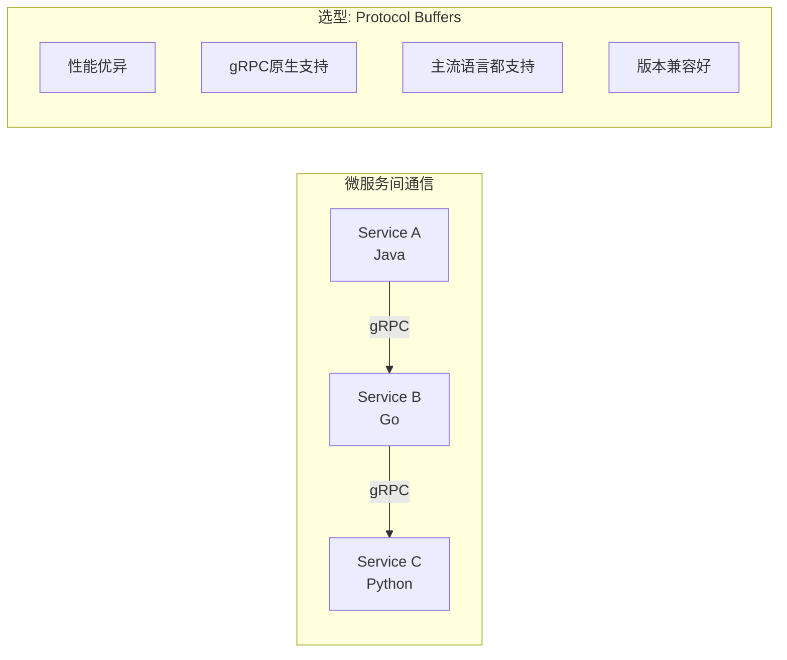
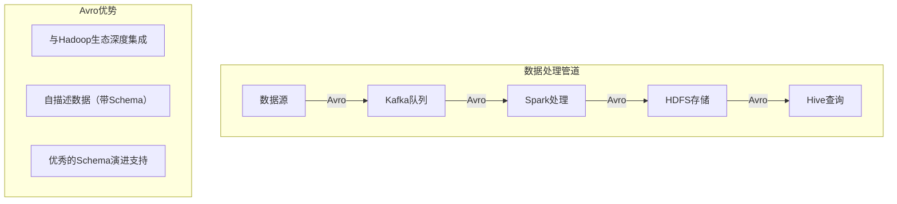
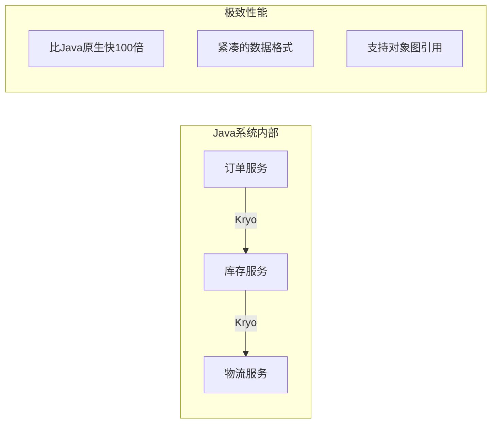
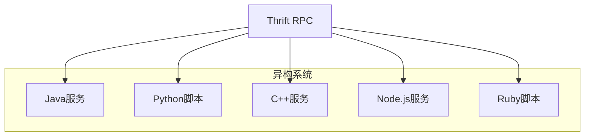
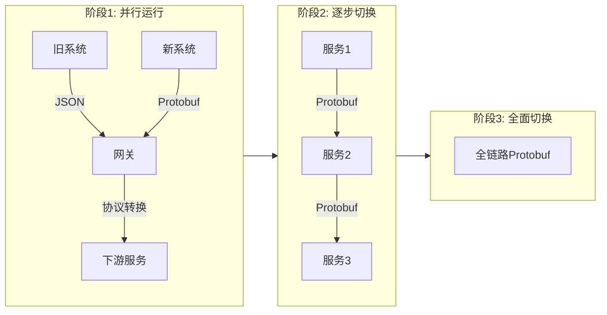
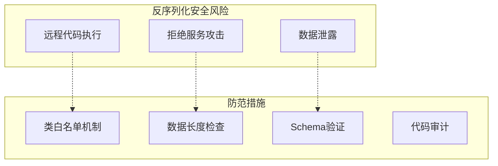

# 序列化选型指南

## 概述与核心概念

在分布式系统中，序列化是数据在网络中传输或在存储介质中持久化的基础。选择合适的序列化方案直接影响系统的性能、可维护性和跨语言兼容性。本指南将帮助开发者根据具体场景选择最适合的序列化技术。



## 序列化方案全景图



## 选型决策树



## 详细对比分析

### 1. 性能对比

| 方案 | 序列化速度 | 反序列化速度 | 数据大小 | 内存占用 |
|-----|-----------|------------|---------|---------|
| Kryo | ★★★★★ | ★★★★★ | ★★★★☆ | 低 |
| Protobuf | ★★★★★ | ★★★★★ | ★★★★★ | 低 |
| Avro | ★★★★☆ | ★★★★☆ | ★★★★☆ | 中 |
| Thrift | ★★★★☆ | ★★★★☆ | ★★★★☆ | 中 |
| MessagePack | ★★★★☆ | ★★★★☆ | ★★★☆☆ | 低 |
| JSON | ★★★☆☆ | ★★★☆☆ | ★★☆☆☆ | 低 |
| Java原生 | ★☆☆☆☆ | ★☆☆☆☆ | ★☆☆☆☆ | 高 |

### 2. 功能特性对比

| 特性 | Protobuf | Avro | Thrift | Kryo | MessagePack | JSON |
|-----|----------|------|--------|------|------------|------|
| 跨语言支持 | ★★★★☆ | ★★★★☆ | ★★★★★ | ★☆☆☆☆ | ★★★★★ | ★★★★★ |
| Schema演进 | ★★★★★ | ★★★★★ | ★★★☆☆ | ★★★☆☆ | ★★☆☆☆ | ★★☆☆☆ |
| RPC集成 | ★★★★★ | ★★★☆☆ | ★★★★★ | ★☆☆☆☆ | ★☆☆☆☆ | ★★☆☆☆ |
| 可读性 | ★☆☆☆☆ | ★☆☆☆☆ | ★☆☆☆☆ | ★☆☆☆☆ | ★☆☆☆☆ | ★★★★★ |
| 动态类型 | ★★☆☆☆ | ★★★★★ | ★★★☆☆ | ★★★★★ | ★★★★★ | ★★★★★ |
| 大数据生态 | ★★★☆☆ | ★★★★★ | ★★☆☆☆ | ★☆☆☆☆ | ★★☆☆☆ | ★★★☆☆ |

### 3. 适用场景矩阵

| 场景 | 推荐方案 | 备选方案 |
|-----|---------|---------|
| 微服务RPC通信 | Protobuf (gRPC) | Thrift |
| 大数据存储/处理 | Avro | Protobuf |
| 异构语言系统 | Thrift | Protobuf |
| Java内部通信 | Kryo | FST |
| 缓存序列化 | Kryo | Protobuf |
| 配置文件 | JSON/YAML | TOML |
| 日志收集 | MessagePack | JSON |
| 前端API通信 | JSON | MessagePack |
| 游戏服务器 | Protobuf | FlatBuffers |
| 物联网通信 | Protobuf | MessagePack |

## 场景化选型建议

### 场景一：微服务架构



**推荐方案：** Protocol Buffers + gRPC

**理由：**
- gRPC是云原生时代的主流选择
- Protobuf性能优异，序列化后体积小
- 强类型Schema，便于团队协作
- 原生支持流式通信

**配置建议：**
```protobuf
// 定义服务接口
syntax = "proto3";

service OrderService {
    rpc CreateOrder(CreateOrderRequest) returns (Order);
    rpc GetOrder(GetOrderRequest) returns (Order);
    rpc StreamOrders(StreamOrdersRequest) returns (stream Order);
}
```

### 场景二：大数据处理



**推荐方案：** Apache Avro

**理由：**
- 与Hadoop、Spark、Kafka等无缝集成
- Schema随数据存储，便于数据治理
- 支持Schema演进，便于长期数据存储

### 场景三：Java内部服务通信



**推荐方案：** Kryo

**理由：**
- Java生态中序列化性能最优
- 无需实现Serializable接口
- 支持复杂对象图

**配置建议：**
```java
// 使用ThreadLocal保证线程安全
private static final ThreadLocal<Kryo> kryoHolder = ThreadLocal.withInitial(() -> {
    Kryo kryo = new Kryo();
    kryo.register(Order.class);
    kryo.register(Product.class);
    return kryo;
});
```

### 场景四：跨语言异构系统



**推荐方案：** Apache Thrift

**理由：**
- 支持28+种编程语言
- 内置RPC框架
- 老牌稳定方案

## 迁移与兼容性策略

### 渐进式迁移方案



### 版本兼容性检查清单

| 操作 | 是否向后兼容 | 是否向前兼容 |
|-----|------------|------------|
| 添加字段（带默认值） | ✓ | ✓ |
| 删除字段 | ✗ | ✗（用reserved保留） |
| 修改字段类型 | △ | △ |
| 修改字段编号 | ✗ | ✗ |
| 修改字段名 | ✓（Protobuf） | ✓ |
| 枚举添加值 | ✓ | ✗ |

## 性能优化最佳实践

### 1. 序列化缓存

```java
// 使用对象池减少序列化器创建开销
private static final KryoPool kryoPool = new KryoPool.Builder(() -> {
    Kryo kryo = new Kryo();
    kryo.register(User.class);
    return kryo;
}).build();
```

### 2. 零拷贝技术

```java
// Netty中直接使用ByteBuf避免内存拷贝
ByteBuf buffer = Unpooled.buffer();
protobufMessage.writeTo(new ByteBufOutputStream(buffer));
```

### 3. 压缩策略

| 场景 | 压缩方案 | 压缩率 |
|-----|---------|-------|
| 文本数据 | GZIP/LZ4 | 60-80% |
| 结构化二进制 | Snappy/Zstd | 20-50% |
| 已压缩数据 | 不压缩 | - |

## 安全注意事项

### 反序列化漏洞防范



### 各方案安全建议

| 方案 | 安全风险 | 防范建议 |
|-----|---------|---------|
| Java原生 | 极高（RCE漏洞） | 完全避免使用 |
| Kryo | 中（类加载漏洞） | 使用ClassResolver白名单 |
| Protobuf | 低 | 验证字段范围 |
| JSON | 低 | 限制嵌套深度 |

## 总结

序列化选型没有银弹，需要根据具体场景权衡：

1. **跨语言场景**：优先选择Protobuf或Thrift
2. **大数据场景**：Apache Avro是最佳选择
3. **Java内部通信**：Kryo提供极致性能
4. **前后端通信**：JSON简单直接，MessagePack提供更好性能
5. **遗留系统迁移**：考虑渐进式方案，使用网关做协议转换

关键原则：
- 在架构设计早期确定序列化方案
- 优先考虑Schema演进能力
- 重视安全，避免反序列化漏洞
- 建立性能基准，持续监控优化
