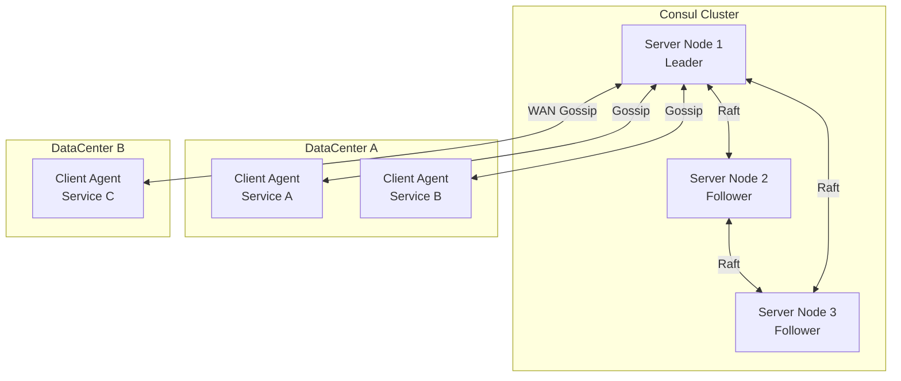
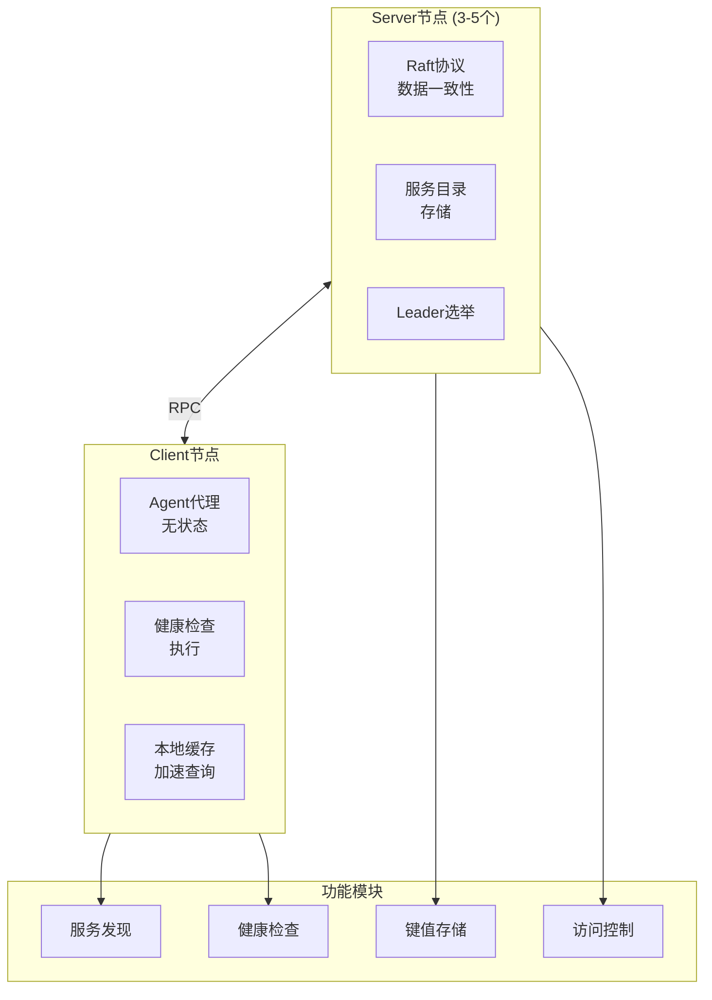
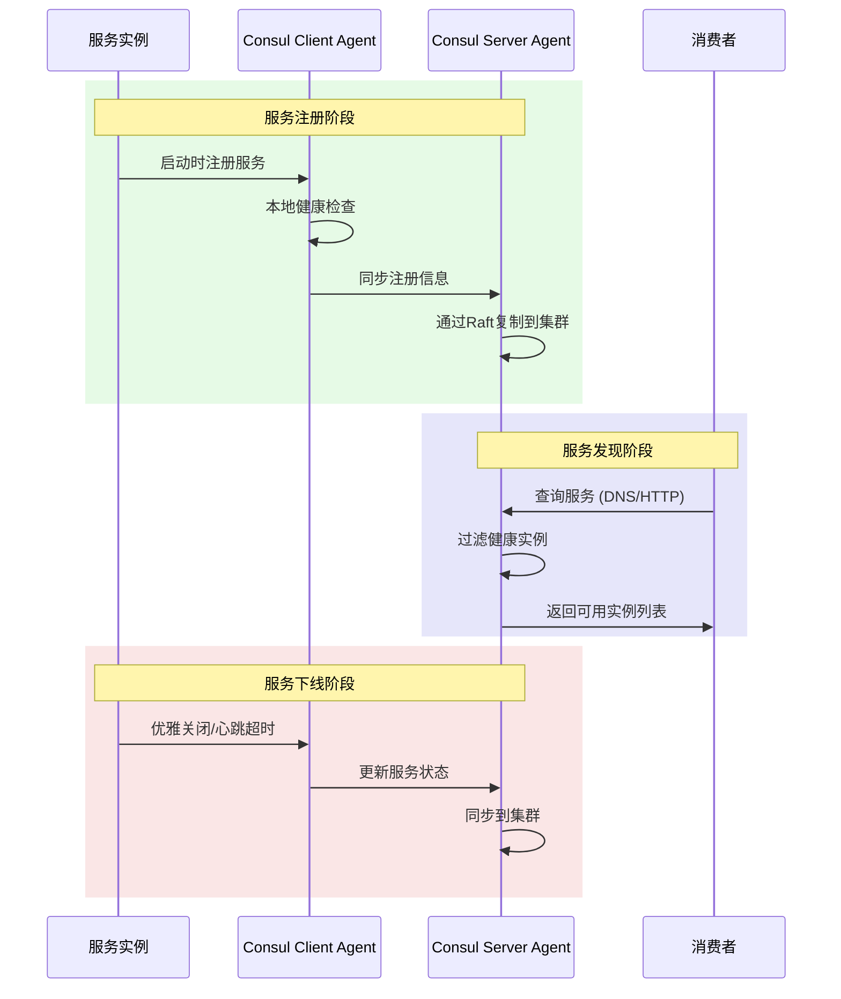
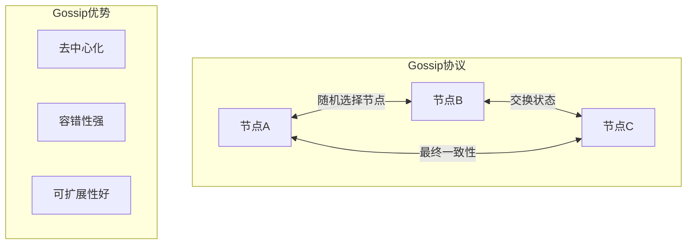
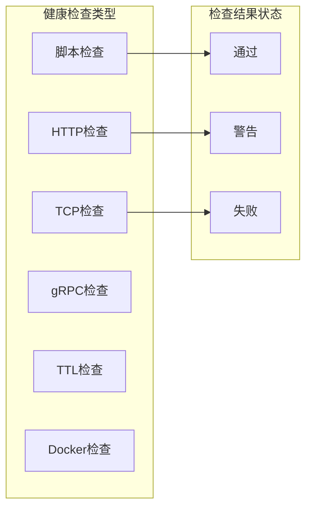

# Consul服务发现

## 概述与核心概念

Consul是HashiCorp公司开发的一款支持多数据中心、分布式高可用的服务发现、配置和服务编排工具。它提供了服务发现、健康检查、键值存储、安全服务通信等核心功能，是构建现代化微服务架构的重要基础设施组件。

Consul于2014年发布，采用Go语言编写，以其简单易用、功能全面而广受好评。它不仅提供服务发现，还内置了健康检查、KV存储、安全通信等功能，是一个完整的服务网格解决方案。



### 核心特性

| 特性 | 说明 |
|-----|-----|
| 服务发现 | 支持DNS和HTTP API两种方式 |
| 健康检查 | 支持多种健康检查机制 |
| KV存储 | 提供分布式键值存储 |
| 安全通信 | 支持mTLS安全通信 |
| 多数据中心 | 原生支持跨数据中心部署 |
| 服务网格 | 内置Service Mesh功能 |

## 架构与工作原理

### Consul架构组件



### 服务注册与发现流程



### Gossip协议

Consul使用Gossip协议实现节点间通信：

- **LAN Gossip**：同一数据中心内节点间的通信
- **WAN Gossip**：不同数据中心间的通信



## 核心功能详解

### 1. 服务注册

**服务定义（Service Definition）：**

```hcl
# /etc/consul.d/web.json
{
    "service": {
        "name": "web",
        "tags": ["rails"],
        "port": 80,
        "check": {
            "name": "HTTP API on port 80",
            "http": "http://localhost:80/health",
            "interval": "10s",
            "timeout": "1s"
        },
        "connect": {
            "sidecar_service": {}
        }
    }
}
```

**多种注册方式：**

| 注册方式 | 适用场景 | 说明 |
|---------|---------|-----|
| 配置文件 | 静态服务 | 服务启动时注册 |
| HTTP API | 动态服务 | 程序主动注册 |
| 服务发现集成 | K8s/Docker | 自动同步 |

### 2. 健康检查

Consul支持多种健康检查机制：



**健康检查配置示例：**

```hcl
{
    "check": {
        "id": "api",
        "name": "HTTP API",
        "http": "http://localhost:5000/health",
        "method": "GET",
        "header": {"x-foo": ["bar"]},
        "interval": "10s",
        "timeout": "1s"
    }
}
```

### 3. KV存储

Consul提供分布式键值存储：

```bash
# 写入KV
consul kv put config/database/host db.example.com
consul kv put config/database/port 5432

# 读取KV
consul kv get config/database/host

# 删除KV
consul kv delete config/database/host

# 列出前缀
consul kv get -recurse config/
```

## 代码示例

### Java集成（Spring Cloud Consul）

#### Maven依赖

```xml
<dependencies>
    <dependency>
        <groupId>org.springframework.cloud</groupId>
        <artifactId>spring-cloud-starter-consul-discovery</artifactId>
    </dependency>
    <dependency>
        <groupId>org.springframework.cloud</groupId>
        <artifactId>spring-cloud-starter-consul-config</artifactId>
    </dependency>
    <dependency>
        <groupId>org.springframework.boot</groupId>
        <artifactId>spring-boot-starter-actuator</artifactId>
    </dependency>
</dependencies>
```

#### 配置文件（bootstrap.yml）

```yaml
spring:
  application:
    name: order-service
  cloud:
    consul:
      host: localhost
      port: 8500
      discovery:
        enabled: true
        service-name: ${spring.application.name}
        health-check-interval: 10s
        health-check-path: /actuator/health
        tags:
          - version=1.0
          - profile=production
        metadata:
          team: platform
          region: cn-north-1
      config:
        enabled: true
        format: yaml
        prefix: config
        default-context: application
        profile-separator: '::'

# 健康检查端点
management:
  endpoints:
    web:
      exposure:
        include: health,info,metrics
  endpoint:
    health:
      show-details: always
```

#### 服务注册与发现代码

```java
import org.springframework.beans.factory.annotation.Autowired;
import org.springframework.cloud.client.ServiceInstance;
import org.springframework.cloud.client.discovery.DiscoveryClient;
import org.springframework.cloud.client.loadbalancer.LoadBalanced;
import org.springframework.context.annotation.Bean;
import org.springframework.web.bind.annotation.*;
import org.springframework.web.client.RestTemplate;

import java.util.List;

/**
 * Consul服务集成示例
 */
@RestController
@RequestMapping("/orders")
public class OrderController {
    
    @Autowired
    private DiscoveryClient discoveryClient;
    
    @LoadBalanced
    @Bean
    public RestTemplate loadBalancedRestTemplate() {
        return new RestTemplate();
    }
    
    @Autowired
    private RestTemplate restTemplate;
    
    /**
     * 使用DiscoveryClient手动发现服务
     */
    @GetMapping("/services/{serviceName}")
    public List<ServiceInstance> getServiceInstances(@PathVariable String serviceName) {
        return discoveryClient.getInstances(serviceName);
    }
    
    /**
     * 通过LoadBalancer调用服务
     */
    @GetMapping("/{orderId}/user")
    public String getOrderUser(@PathVariable Long orderId) {
        // 通过服务名调用，Ribbon会自动负载均衡
        String userServiceUrl = "http://user-service/users/" + orderId;
        return restTemplate.getForObject(userServiceUrl, String.class);
    }
    
    /**
     * 获取所有服务
     */
    @GetMapping("/services")
    public List<String> getServices() {
        return discoveryClient.getServices();
    }
}
```

#### 配置中心使用

```java
import org.springframework.beans.factory.annotation.Value;
import org.springframework.cloud.context.config.annotation.RefreshScope;
import org.springframework.web.bind.annotation.GetMapping;
import org.springframework.web.bind.annotation.RestController;

/**
 * Consul配置中心示例
 */
@RestController
@RefreshScope  // 支持配置热更新
public class ConfigController {
    
    @Value("${database.host:localhost}")
    private String dbHost;
    
    @Value("${database.port:5432}")
    private int dbPort;
    
    @Value("${feature.flag:false}")
    private boolean featureFlag;
    
    @GetMapping("/config")
    public String getConfig() {
        return String.format("DB Host: %s, Port: %d, Feature: %s", 
            dbHost, dbPort, featureFlag);
    }
}
```

### Go集成（consul/api）

```go
package main

import (
    "fmt"
    "log"
    "time"
    
    "github.com/hashicorp/consul/api"
)

// ConsulClient Consul客户端封装
type ConsulClient struct {
    client *api.Client
}

// NewConsulClient 创建Consul客户端
func NewConsulClient(addr string) (*ConsulClient, error) {
    config := api.DefaultConfig()
    config.Address = addr
    
    client, err := api.NewClient(config)
    if err != nil {
        return nil, err
    }
    
    return &ConsulClient{client: client}, nil
}

// RegisterService 注册服务
func (c *ConsulClient) RegisterService(serviceID, serviceName string, 
    port int, tags []string) error {
    
    registration := &api.AgentServiceRegistration{
        ID:      serviceID,
        Name:    serviceName,
        Port:    port,
        Tags:    tags,
        Check: &api.AgentServiceCheck{
            HTTP:     fmt.Sprintf("http://localhost:%d/health", port),
            Interval: "10s",
            Timeout:  "5s",
        },
    }
    
    return c.client.Agent().ServiceRegister(registration)
}

// DeregisterService 注销服务
func (c *ConsulClient) DeregisterService(serviceID string) error {
    return c.client.Agent().ServiceDeregister(serviceID)
}

// DiscoverService 发现服务
func (c *ConsulClient) DiscoverService(serviceName string) ([]*api.ServiceEntry, error) {
    entries, _, err := c.client.Health().Service(serviceName, "", true, nil)
    return entries, err
}

// PutKV 写入KV
func (c *ConsulClient) PutKV(key string, value []byte) error {
    kv := c.client.KV()
    p := &api.KVPair{Key: key, Value: value}
    _, err := kv.Put(p, nil)
    return err
}

// GetKV 读取KV
func (c *ConsulClient) GetKV(key string) ([]byte, error) {
    kv := c.client.KV()
    pair, _, err := kv.Get(key, nil)
    if err != nil {
        return nil, err
    }
    if pair == nil {
        return nil, fmt.Errorf("key not found: %s", key)
    }
    return pair.Value, nil
}

func main() {
    // 创建客户端
    client, err := NewConsulClient("localhost:8500")
    if err != nil {
        log.Fatal(err)
    }
    
    // 注册服务
    err = client.RegisterService(
        "order-service-1",
        "order-service",
        8080,
        []string{"v1", "production"},
    )
    if err != nil {
        log.Fatal(err)
    }
    log.Println("Service registered")
    
    // 写入配置
    err = client.PutKV("config/order-service/db_host", []byte("db.example.com"))
    if err != nil {
        log.Fatal(err)
    }
    
    // 读取配置
    value, err := client.GetKV("config/order-service/db_host")
    if err != nil {
        log.Fatal(err)
    }
    log.Printf("Config value: %s", string(value))
    
    // 发现服务
    entries, err := client.DiscoverService("order-service")
    if err != nil {
        log.Fatal(err)
    }
    
    for _, entry := range entries {
        log.Printf("Service: %s at %s:%d", 
            entry.Service.Service,
            entry.Service.Address,
            entry.Service.Port)
    }
    
    // 保持运行
    time.Sleep(5 * time.Minute)
    
    // 注销服务
    client.DeregisterService("order-service-1")
    log.Println("Service deregistered")
}
```

### Python集成（python-consul）

```python
#!/usr/bin/env python3
"""
Consul Python集成示例
"""

import consul
import socket
import atexit


class ConsulService:
    """Consul服务管理"""
    
    def __init__(self, host='localhost', port=8500):
        self.c = consul.Consul(host=host, port=port)
        self.service_id = None
    
    def register(self, name, port, tags=None, check_interval='10s'):
        """注册服务"""
        self.service_id = f"{name}-{socket.gethostname()}-{port}"
        
        check = consul.Check.http(
            url=f"http://localhost:{port}/health",
            interval=check_interval
        )
        
        self.c.agent.service.register(
            name=name,
            service_id=self.service_id,
            port=port,
            tags=tags or [],
            check=check
        )
        
        # 程序退出时自动注销
        atexit.register(self.deregister)
        
        print(f"Service registered: {self.service_id}")
        return self.service_id
    
    def deregister(self):
        """注销服务"""
        if self.service_id:
            self.c.agent.service.deregister(self.service_id)
            print(f"Service deregistered: {self.service_id}")
    
    def discover(self, service_name):
        """发现服务"""
        index, services = self.c.health.service(service_name)
        healthy_instances = []
        
        for svc in services:
            service = svc['Service']
            checks = svc['Checks']
            
            # 检查健康状态
            is_healthy = all(c['Status'] == 'passing' for c in checks)
            
            if is_healthy:
                healthy_instances.append({
                    'id': service['ID'],
                    'name': service['Service'],
                    'address': service['Address'] or 'localhost',
                    'port': service['Port'],
                    'tags': service['Tags']
                })
        
        return healthy_instances


class ConsulKV:
    """Consul KV存储操作"""
    
    def __init__(self, host='localhost', port=8500):
        self.c = consul.Consul(host=host, port=port)
    
    def put(self, key, value):
        """写入KV"""
        return self.c.kv.put(key, value)
    
    def get(self, key):
        """读取KV"""
        index, data = self.c.kv.get(key)
        if data:
            return data['Value']
        return None
    
    def delete(self, key):
        """删除KV"""
        return self.c.kv.delete(key)
    
    def list(self, prefix=''):
        """列出所有KV"""
        index, data = self.c.kv.get(prefix, recurse=True)
        if data:
            return {item['Key']: item['Value'] for item in data}
        return {}


def example_usage():
    """使用示例"""
    # 服务注册
    service = ConsulService()
    service.register(
        name='python-service',
        port=5000,
        tags=['v1', 'python']
    )
    
    # KV操作
    kv = ConsulKV()
    kv.put('config/python-service/debug', 'true')
    kv.put('config/python-service/timeout', '30')
    
    value = kv.get('config/python-service/debug')
    print(f"Debug mode: {value}")
    
    # 服务发现
    instances = service.discover('order-service')
    print(f"Found {len(instances)} instances")
    for inst in instances:
        print(f"  - {inst['address']}:{inst['port']}")


if __name__ == '__main__':
    example_usage()
```

## 优缺点分析

| 优势 | 劣势 |
|-----|-----|
| 功能全面（服务发现+配置+网格） | 资源占用较高 |
| 多数据中心原生支持 | 节点数多时Gossip开销大 |
| 健康检查机制完善 | 对网络延迟敏感 |
| 友好的Web UI | 数据存储有限制（基于Raft） |
| 丰富的生态集成 | 需要额外学习成本 |

## 应用场景

1. **微服务架构**：服务注册与发现
2. **配置中心**：分布式配置管理
3. **服务网格**：安全的服务间通信
4. **健康监控**：服务健康检查与故障转移

## 总结

Consul是功能最全面的服务发现方案之一，特别适合：
- 需要服务发现、配置中心、服务网格一站式解决方案
- 多数据中心部署场景
- 对服务健康检查要求高

在生产环境使用时，建议：
- Server节点部署3或5个，保证高可用
- 合理设置健康检查间隔，避免过度消耗
- 使用ACL进行访问控制
- 监控Consul集群状态
