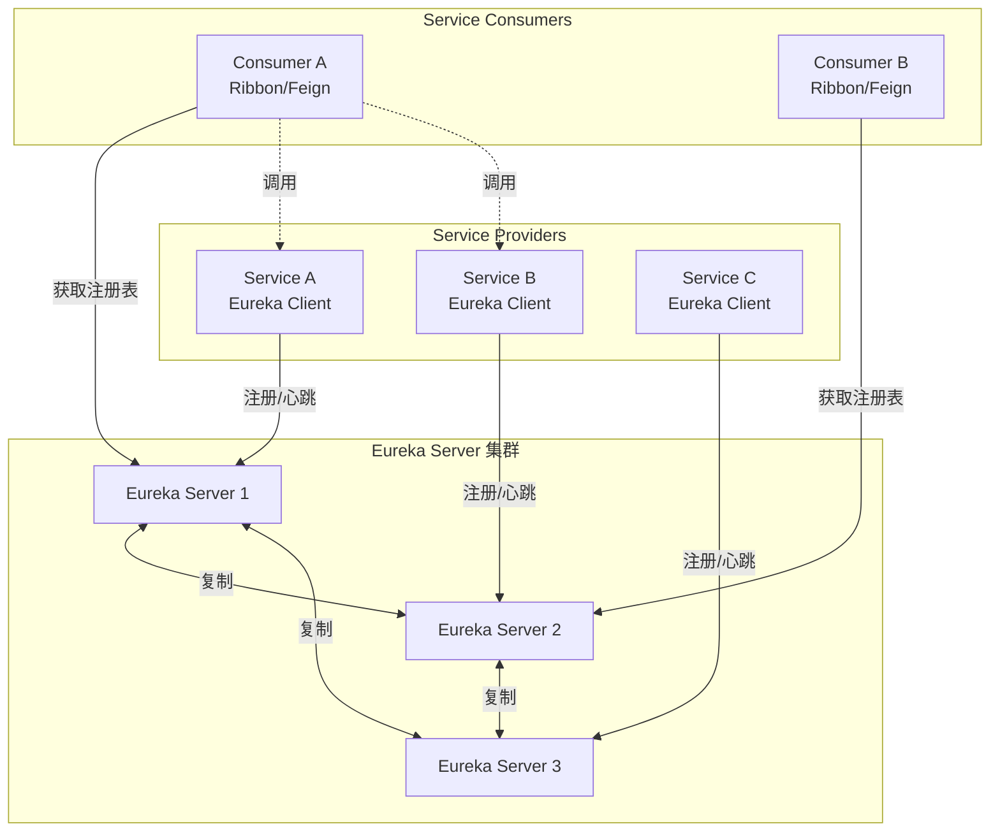
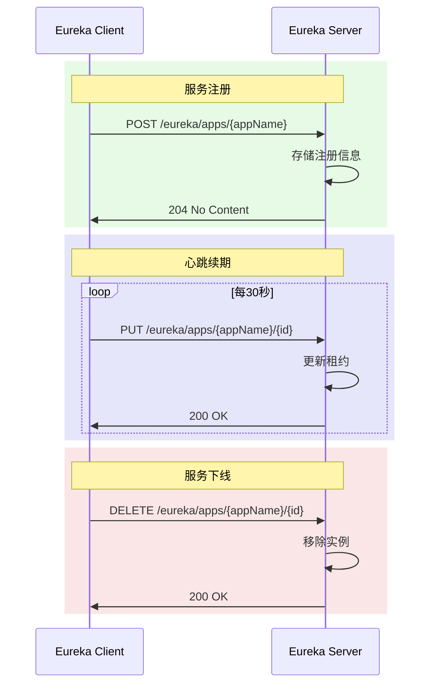
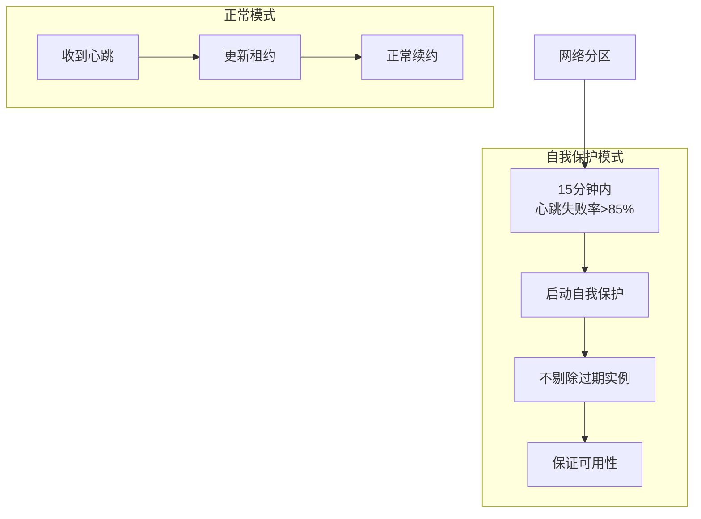

# Eureka服务注册

## 概述与核心概念

Netflix Eureka是Netflix开源的服务发现组件，专为AWS云环境设计，现已成为Spring Cloud生态中的核心组件。Eureka采用C-S架构，包含Eureka Server（服务注册中心）和Eureka Client（服务提供者/消费者）。

Eureka的设计理念是优先保证可用性（AP原则），在分布式环境下即使出现网络分区，也能继续提供服务发现功能，这与ZooKeeper、etcd等CP系统形成对比。



### 核心特性

| 特性 | 说明 |
|-----|-----|
| AP架构 | 优先保证可用性 |
| 自我保护 | 网络分区时保护注册信息 |
| 客户端缓存 | 本地缓存服务列表 |
| 心跳检测 | 客户端主动上报健康状态 |
| Spring Cloud集成 | 与Spring生态深度集成 |

## 架构设计

### 服务注册与发现流程



### 自我保护机制



## 代码示例

### Eureka Server配置

```yaml
# application.yml
server:
  port: 8761

spring:
  application:
    name: eureka-server

eureka:
  instance:
    hostname: localhost
  client:
    register-with-eureka: false  # 不向自己注册
    fetch-registry: false        # 不从自己获取注册表
    service-url:
      defaultZone: http://${eureka.instance.hostname}:${server.port}/eureka/
  server:
    enable-self-preservation: true      # 开启自我保护
    eviction-interval-timer-in-ms: 60000 # 剔除间隔
```

### 高可用Eureka Server集群

```yaml
# peer1配置
server:
  port: 8761
spring:
  application:
    name: eureka-server
  profiles:
    active: peer1

eureka:
  instance:
    hostname: peer1
  client:
    service-url:
      defaultZone: http://peer2:8762/eureka/,http://peer3:8763/eureka/

---
# peer2配置
server:
  port: 8762
spring:
  profiles: peer2

eureka:
  instance:
    hostname: peer2
  client:
    service-url:
      defaultZone: http://peer1:8761/eureka/,http://peer3:8763/eureka/
```

### Eureka Client配置

```yaml
# application.yml
spring:
  application:
    name: order-service

eureka:
  client:
    service-url:
      defaultZone: http://localhost:8761/eureka/
  instance:
    prefer-ip-address: true
    lease-renewal-interval-in-seconds: 30    # 心跳间隔
    lease-expiration-duration-in-seconds: 90 # 过期时间
```

### Java代码示例

```java
import org.springframework.cloud.client.ServiceInstance;
import org.springframework.cloud.client.discovery.DiscoveryClient;
import org.springframework.cloud.client.loadbalancer.LoadBalanced;
import org.springframework.context.annotation.Bean;
import org.springframework.web.bind.annotation.*;
import org.springframework.web.client.RestTemplate;

import java.util.List;

/**
 * Eureka服务发现示例
 */
@RestController
@RequestMapping("/api")
public class EurekaClientController {

    private final DiscoveryClient discoveryClient;

    @LoadBalanced
    @Bean
    public RestTemplate restTemplate() {
        return new RestTemplate();
    }

    private final RestTemplate restTemplate;

    public EurekaClientController(DiscoveryClient discoveryClient,
                                   RestTemplate restTemplate) {
        this.discoveryClient = discoveryClient;
        this.restTemplate = restTemplate;
    }

    /**
     * 获取服务实例
     */
    @GetMapping("/instances/{serviceName}")
    public List<ServiceInstance> getInstances(@PathVariable String serviceName) {
        return discoveryClient.getInstances(serviceName);
    }

    /**
     * 获取所有服务
     */
    @GetMapping("/services")
    public List<String> getServices() {
        return discoveryClient.getServices();
    }

    /**
     * 使用Ribbon负载均衡调用
     */
    @GetMapping("/order/{orderId}/user")
    public String getOrderUser(@PathVariable Long orderId) {
        // 使用服务名调用，Ribbon自动负载均衡
        String url = "http://user-service/users/" + orderId;
        return restTemplate.getForObject(url, String.class);
    }
}
```

## 优缺点分析

| 优势 | 劣势 |
|-----|-----|
| 与Spring Cloud无缝集成 | 仅支持Java生态 |
| 自我保护机制 | 已停止维护（Netflix版） |
| 客户端缓存提高可用性 | 不适合大规模集群 |
| 配置简单 | 功能相对简单 |

## 总结

Eureka是Spring Cloud服务发现的经典方案，虽然Netflix已停止维护原版，但Spring Cloud社区继续维护。对于新项目，可考虑Nacos或Consul作为替代。
