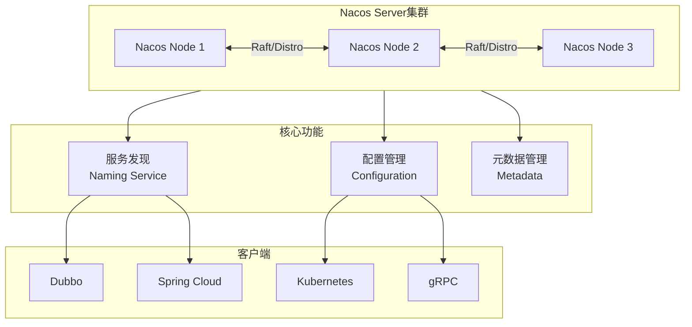

# Nacos服务治理

## 概述与核心概念

Nacos（Dynamic Naming and Configuration Service）是阿里巴巴开源的动态服务发现、配置管理和服务管理平台。它集成了服务注册发现、配置管理、服务元数据管理等功能，是构建现代化微服务架构的一站式解决方案。

Nacos支持几乎所有主流类型的服务发现（Kubernetes、gRPC、Dubbo、Spring Cloud等），并支持多种配置管理策略（动态配置、灰度发布、配置监听等）。



### 核心特性

| 特性 | 说明 |
|-----|-----|
| 服务发现 | 支持DNS和RPC方式 |
| 配置管理 | 动态配置，实时推送 |
| 动态DNS | 支持权重路由 |
| 服务健康 | 多种健康检查方式 |
| 元数据管理 | 服务分组、版本管理 |

## 代码示例

### 服务注册与发现

```yaml
# application.yml
spring:
  application:
    name: order-service
  cloud:
    nacos:
      discovery:
        server-addr: localhost:8848
        namespace: dev
        group: DEFAULT_GROUP
        metadata:
          version: 1.0
          region: cn-north
```

### 配置管理

```yaml
# bootstrap.yml
spring:
  application:
    name: order-service
  cloud:
    nacos:
      config:
        server-addr: localhost:8848
        file-extension: yaml
        namespace: dev
        group: DEFAULT_GROUP
        refresh-enabled: true
```

### Java代码示例

```java
import com.alibaba.cloud.nacos.NacosDiscoveryProperties;
import org.springframework.beans.factory.annotation.Value;
import org.springframework.cloud.context.config.annotation.RefreshScope;
import org.springframework.web.bind.annotation.*;

import java.util.Map;

/**
 * Nacos服务与配置示例
 */
@RestController
@RequestMapping("/nacos")
@RefreshScope  // 配置自动刷新
public class NacosController {

    @Value("${config.timeout:5000}")
    private int timeout;

    private final NacosDiscoveryProperties discoveryProperties;

    public NacosController(NacosDiscoveryProperties discoveryProperties) {
        this.discoveryProperties = discoveryProperties;
    }

    /**
     * 获取配置
     */
    @GetMapping("/config")
    public String getConfig() {
        return "Timeout: " + timeout;
    }

    /**
     * 获取服务信息
     */
    @GetMapping("/service")
    public Map<String, String> getServiceInfo() {
        return discoveryProperties.getMetadata();
    }
}
```

## 优缺点分析

| 优势 | 劣势 |
|-----|-----|
| 功能全面（服务+配置） | 相对年轻，生态不如Consul |
| 阿里生态支持 | 部分功能与Spring Cloud深度绑定 |
| 中文文档完善 | 社区版与企业版有差异 |
| 性能优秀 | |

## 总结

Nacos是功能最全面的服务治理方案，特别适合：

- 阿里技术栈（Dubbo、Spring Cloud Alibaba）
- 需要服务发现和配置管理一体化
- 中文环境下的微服务架构
