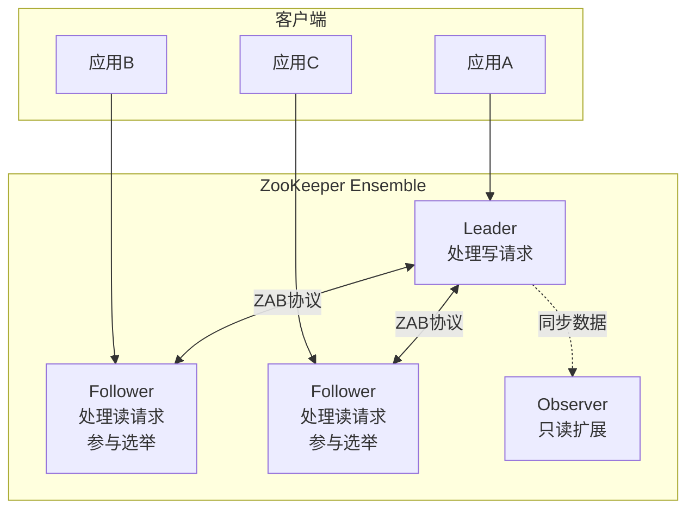
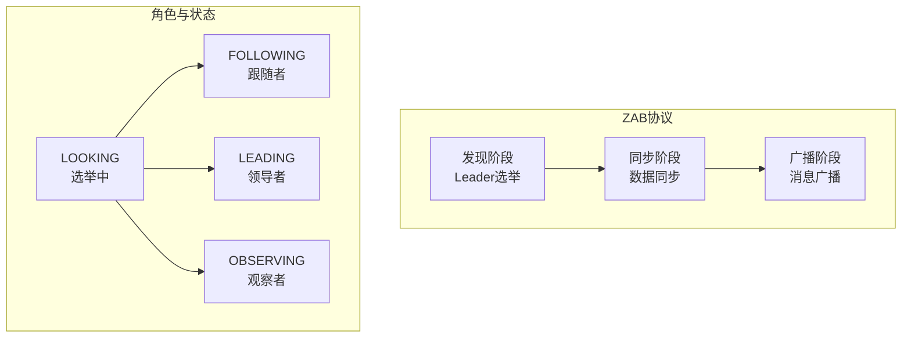
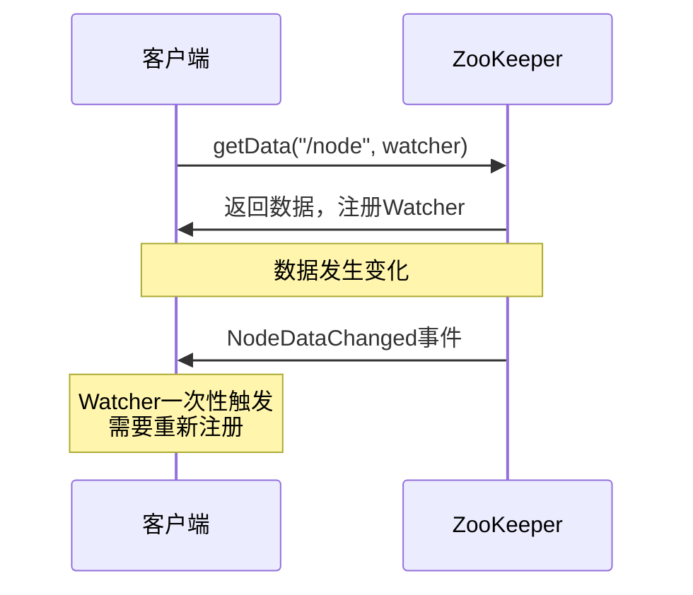
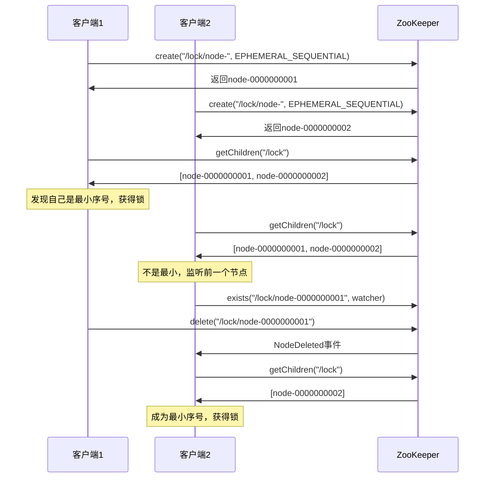

# ZooKeeper深度分析

## 概述与核心概念

Apache ZooKeeper是一个开源的分布式协调服务，由Apache Hadoop的子项目发展而来，现已成为Apache顶级项目。它为分布式应用提供一致性、可靠性的协调服务，解决了分布式系统中常见的数据发布/订阅、负载均衡、命名服务、分布式锁、集群管理等问题。

ZooKeeper的设计目标是将那些复杂且容易出错的分布式一致性服务封装起来，提供简单易用的接口，让分布式应用可以专注于业务逻辑。



### 核心特性

| 特性 | 说明 |
|-----|-----|
| 顺序一致性 | 来自同一客户端的更新按发送顺序应用 |
| 原子性 | 更新操作要么全部成功，要么全部失败 |
| 单一视图 | 所有客户端看到相同的数据视图 |
| 可靠性 | 更新一旦成功，数据将被持久化 |
| 实时性 | 在一定时间范围内，客户端能读到最新数据 |

## 架构与工作原理

### ZAB协议（ZooKeeper Atomic Broadcast）



**ZAB协议流程：**

1. **崩溃恢复阶段**：选举Leader，同步数据
2. **消息广播阶段**：Leader接收写请求，广播给Follower

### 数据模型

```mermaid
flowchart TB
    subgraph ZNodeTree["ZNode树形结构"]
        Root[/]
        App1[/app1]
        App2[/app2]
        Config1[/app1/config]
        Config2[/app2/config]
        Lock1[/app1/lock]
        Workers[/app2/workers]
        Worker1[/app2/workers/w1]
        Worker2[/app2/workers/w2]
    end

    Root --> App1
    Root --> App2
    App1 --> Config1
    App1 --> Lock1
    App2 --> Config2
    App2 --> Workers
    Workers --> Worker1
    Workers --> Worker2
```

**ZNode类型：**

| 类型 | 说明 |
|-----|-----|
| 持久节点（PERSISTENT） | 客户端断开仍然存在 |
| 临时节点（EPHEMERAL） | 客户端会话结束自动删除 |
| 持久顺序节点（PERSISTENT_SEQUENTIAL） | 持久节点+顺序编号 |
| 临时顺序节点（EPHEMERAL_SEQUENTIAL） | 临时节点+顺序编号 |
| 容器节点（CONTAINER） | 子节点为空时自动删除 |
| TTL节点（PERSISTENT_WITH_TTL） | 带过期时间的持久节点 |

## 核心功能详解

### 1. Watcher机制



**Watcher特点：**

- 一次性触发
- 轻量级
- 异步通知

### 2. 分布式锁实现



## 代码示例

### Java集成（Curator）

#### Maven依赖

```xml
<dependencies>
    <dependency>
        <groupId>org.apache.curator</groupId>
        <artifactId>curator-recipes</artifactId>
        <version>5.5.0</version>
    </dependency>
    <dependency>
        <groupId>org.apache.curator</groupId>
        <artifactId>curator-framework</artifactId>
        <version>5.5.0</version>
    </dependency>
</dependencies>
```

#### Java代码示例

```java
import org.apache.curator.framework.*;
import org.apache.curator.framework.recipes.cache.*;
import org.apache.curator.framework.recipes.locks.*;
import org.apache.curator.framework.recipes.leader.*;
import org.apache.curator.retry.*;
import org.apache.zookeeper.CreateMode;
import org.apache.zookeeper.data.Stat;

import java.util.*;
import java.util.concurrent.*;

/**
 * ZooKeeper客户端示例（使用Curator）
 */
public class ZooKeeperExample {

    private final CuratorFramework client;

    public ZooKeeperExample(String connectionString) {
        // 创建客户端
        this.client = CuratorFrameworkFactory.builder()
            .connectString(connectionString)
            .sessionTimeoutMs(5000)
            .connectionTimeoutMs(3000)
            .retryPolicy(new ExponentialBackoffRetry(1000, 3))
            .namespace("myapp")
            .build();

        this.client.start();
    }

    /**
     * 基本CRUD操作
     */
    public void basicOperations() throws Exception {
        String path = "/config/database";
        String data = "localhost:3306";

        // 创建持久节点
        String createdPath = client.create()
            .creatingParentsIfNeeded()
            .withMode(CreateMode.PERSISTENT)
            .forPath(path, data.getBytes());
        System.out.println("Created: " + createdPath);

        // 读取数据
        byte[] bytes = client.getData().forPath(path);
        System.out.println("Data: " + new String(bytes));

        // 更新数据
        Stat stat = client.setData()
            .withVersion(-1)  // 不检查版本
            .forPath(path, "newhost:3306".getBytes());
        System.out.println("Updated, new version: " + stat.getVersion());

        // 读取新版本
        bytes = client.getData().forPath(path);
        System.out.println("New data: " + new String(bytes));

        // 删除节点
        client.delete()
            .guaranteed()  // 保证删除成功
            .deletingChildrenIfNeeded()
            .forPath(path);
        System.out.println("Deleted");
    }

    /**
     * 临时节点与租约
     */
    public void ephemeralNodes() throws Exception {
        // 创建临时节点（会话结束自动删除）
        String path = "/services/instance1";
        String data = "192.168.1.100:8080";

        String created = client.create()
            .creatingParentsIfNeeded()
            .withMode(CreateMode.EPHEMERAL)
            .forPath(path, data.getBytes());

        System.out.println("Ephemeral node created: " + created);

        // 创建临时顺序节点
        String seqPath = "/locks/lock-";
        String seqCreated = client.create()
            .creatingParentsIfNeeded()
            .withMode(CreateMode.EPHEMERAL_SEQUENTIAL)
            .forPath(seqPath, "data".getBytes());

        System.out.println("Sequential node created: " + seqCreated);
    }

    /**
     * NodeCache监听节点变化
     */
    public void nodeCacheDemo() throws Exception {
        String path = "/config/app";

        // 创建节点
        client.create().creatingParentsIfNeeded().forPath(path, "v1".getBytes());

        // 创建NodeCache
        NodeCache cache = new NodeCache(client, path);
        cache.start(true);  // 立即缓存数据

        // 添加监听器
        cache.getListenable().addListener(() -> {
            ChildData currentData = cache.getCurrentData();
            if (currentData != null) {
                System.out.println("Node changed: " + new String(currentData.getData()));
            } else {
                System.out.println("Node deleted");
            }
        });

        // 修改数据触发监听
        client.setData().forPath(path, "v2".getBytes());
        Thread.sleep(100);

        client.setData().forPath(path, "v3".getBytes());
        Thread.sleep(100);

        cache.close();
    }

    /**
     * PathChildrenCache监听子节点
     */
    public void pathChildrenCacheDemo() throws Exception {
        String path = "/workers";
        client.create().creatingParentsIfNeeded().forPath(path);

        // 创建PathChildrenCache
        PathChildrenCache cache = new PathChildrenCache(client, path, true);
        cache.start(PathChildrenCache.StartMode.POST_INITIALIZED_EVENT);

        // 添加监听器
        cache.getListenable().addListener((client, event) -> {
            switch (event.getType()) {
                case CHILD_ADDED:
                    System.out.println("Child added: " + event.getData().getPath());
                    break;
                case CHILD_UPDATED:
                    System.out.println("Child updated: " + event.getData().getPath());
                    break;
                case CHILD_REMOVED:
                    System.out.println("Child removed: " + event.getData().getPath());
                    break;
                default:
                    break;
            }
        });

        // 添加子节点
        client.create().withMode(CreateMode.EPHEMERAL).forPath(path + "/worker1", "active".getBytes());
        Thread.sleep(100);

        client.create().withMode(CreateMode.EPHEMERAL).forPath(path + "/worker2", "active".getBytes());
        Thread.sleep(100);

        client.delete().forPath(path + "/worker1");
        Thread.sleep(100);

        cache.close();
    }

    /**
     * 分布式锁
     */
    public void distributedLock() throws Exception {
        // 创建锁
        InterProcessMutex lock = new InterProcessMutex(client, "/locks/resource1");

        ExecutorService executor = Executors.newFixedThreadPool(3);

        for (int i = 0; i < 3; i++) {
            final int threadNum = i;
            executor.submit(() -> {
                try {
                    System.out.println("Thread " + threadNum + " trying to acquire lock...");

                    // 获取锁（带超时）
                    if (lock.acquire(10, TimeUnit.SECONDS)) {
                        try {
                            System.out.println("Thread " + threadNum + " acquired lock");
                            Thread.sleep(2000);  // 模拟业务操作
                        } finally {
                            lock.release();
                            System.out.println("Thread " + threadNum + " released lock");
                        }
                    } else {
                        System.out.println("Thread " + threadNum + " failed to acquire lock");
                    }
                } catch (Exception e) {
                    e.printStackTrace();
                }
            });
        }

        executor.shutdown();
        executor.awaitTermination(30, TimeUnit.SECONDS);
    }

    /**
     * 可重入读写锁
     */
    public void readWriteLock() throws Exception {
        InterProcessReadWriteLock rwlock = new InterProcessReadWriteLock(client, "/rwlocks/resource");

        // 读锁
        InterProcessMutex readLock = rwlock.readLock();
        // 写锁
        InterProcessMutex writeLock = rwlock.writeLock();

        // 多个线程可以获取读锁
        readLock.acquire();
        System.out.println("Read lock acquired");
        // 读取数据...
        readLock.release();

        // 写锁独占
        writeLock.acquire();
        System.out.println("Write lock acquired");
        // 写入数据...
        writeLock.release();
    }

    /**
     * Leader选举
     */
    public void leaderElection() throws Exception {
        LeaderSelectorListener listener = new LeaderSelectorListenerAdapter() {
            @Override
            public void takeLeadership(CuratorFramework client) throws Exception {
                System.out.println("成为Leader，执行业务逻辑...");
                Thread.sleep(5000);  // 模拟Leader工作
                System.out.println("释放Leader角色");
            }
        };

        LeaderSelector selector = new LeaderSelector(client, "/election/leader", listener);
        selector.autoRequeue();  // 自动重新参与选举
        selector.start();

        Thread.sleep(20000);
        selector.close();
    }

    /**
     * 分布式计数器
     */
    public void distributedAtomicLong() throws Exception {
        DistributedAtomicLong counter = new DistributedAtomicLong(
            client, "/counters/mycounter",
            new RetryNTimes(3, 1000)
        );

        // 初始化
        counter.forceSet(0L);

        // 递增
        for (int i = 0; i < 10; i++) {
            AtomicValue<Long> value = counter.increment();
            if (value.succeeded()) {
                System.out.println("Counter: " + value.postValue());
            }
        }
    }

    /**
     * 服务注册与发现
     */
    public void serviceRegistry() throws Exception {
        String serviceName = "order-service";
        String instanceId = UUID.randomUUID().toString();
        String address = "192.168.1.100:8080";

        // 注册服务（使用临时节点）
        String path = "/services/" + serviceName + "/" + instanceId;
        client.create()
            .creatingParentsIfNeeded()
            .withMode(CreateMode.EPHEMERAL)
            .forPath(path, address.getBytes());

        System.out.println("Service registered: " + path);

        // 发现服务
        List<String> instances = client.getChildren().forPath("/services/" + serviceName);
        System.out.println("Discovered " + instances.size() + " instances:");

        for (String id : instances) {
            byte[] data = client.getData().forPath("/services/" + serviceName + "/" + id);
            System.out.println("  " + id + " -> " + new String(data));
        }
    }

    public void close() {
        client.close();
    }

    public static void main(String[] args) throws Exception {
        ZooKeeperExample example = new ZooKeeperExample("localhost:2181");

        example.basicOperations();
        example.ephemeralNodes();
        example.nodeCacheDemo();
        example.pathChildrenCacheDemo();
        example.distributedLock();
        example.readWriteLock();
        example.leaderElection();
        example.distributedAtomicLong();
        example.serviceRegistry();

        example.close();
    }
}
```

## 优缺点分析

| 优势 | 劣势 |
|-----|-----|
| 成熟稳定，经过大规模验证 | Java技术栈，生态相对封闭 |
| 功能丰富（锁/选举/队列） | 运维复杂度高 |
| 强一致性保证 | 写入性能受限于单Leader |
| 丰富的客户端生态 | 节点数增加时性能下降 |
| 临时节点机制优秀 | 会话管理复杂 |

## 应用场景

1. **配置管理**：集中式配置存储和推送
2. **服务注册**：基于临时节点的服务注册
3. **分布式锁**：顺序临时节点实现公平锁
4. **Master选举**：LeaderSelector实现
5. **集群管理**：集群成员发现和状态管理

## 总结

ZooKeeper是分布式协调服务的经典实现，虽然新兴方案（如etcd）在某些场景有优势，但ZooKeeper凭借丰富的功能和成熟的生态，仍在许多企业系统中扮演重要角色。

使用建议：

- 利用Curator简化开发
- 合理设置会话超时时间
- 避免在ZNode中存储大量数据
- 注意Watcher的一次性特性
