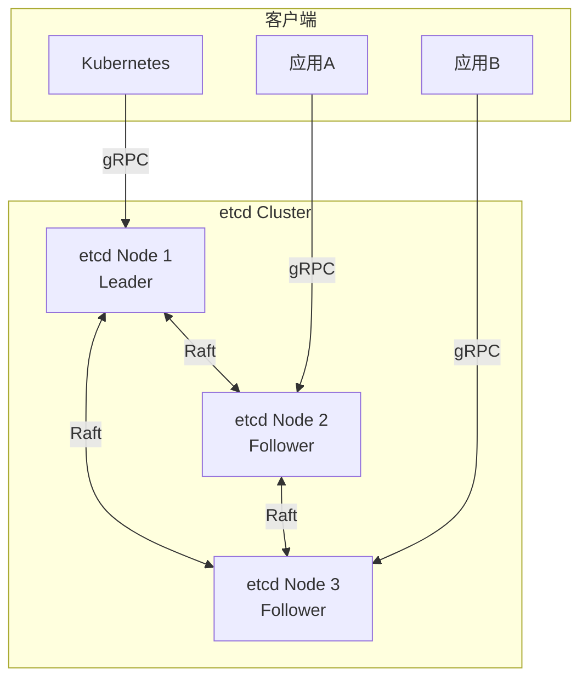
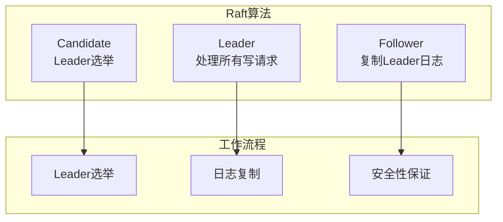
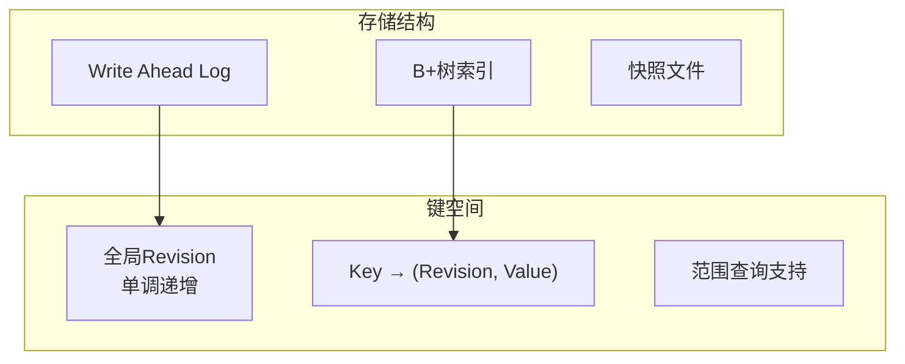
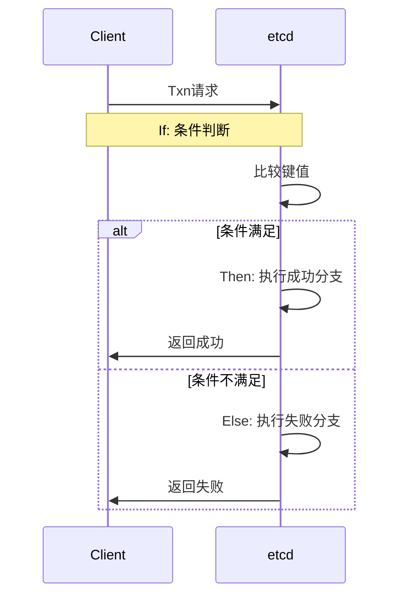

# etcd详解

## 概述与核心概念

etcd是一个高可用的分布式键值存储系统，由CoreOS开发，现已成为CNCF（云原生计算基金会）的孵化项目。etcd使用Go语言编写，基于Raft一致性算法实现数据复制，为分布式系统提供可靠的配置管理、服务发现和分布式协调功能。

etcd的名字源于Unix的/etc目录和distributed的"d"，寓意为分布式系统的配置目录。它是Kubernetes的核心组件，负责存储集群的所有配置数据和状态信息。



### 核心特性

| 特性 | 说明 |
|-----|-----|
| 简单 | 使用标准的HTTP/JSON或gRPC API |
| 安全 | 支持TLS证书认证和通信加密 |
| 快速 | 基准测试10000+写入/秒 |
| 可靠 | 使用Raft算法实现分布式一致性 |
| 观察者模式 | 支持监听数据变化（Watch） |
| 租约机制 | 支持键值对的自动过期 |

## 架构与工作原理

### Raft一致性算法



**Raft核心概念：**

| 概念 | 说明 |
|-----|-----|
| Term | 任期号，单调递增 |
| Log Entry | 日志条目，包含操作指令 |
| Commit Index | 已提交的日志索引 |
| Apply Index | 已应用到状态机的索引 |

### 数据模型



## 核心API与操作

### 基本操作

```bash
# 写入数据
etcdctl put /mykey "hello world"

# 读取数据
etcdctl get /mykey

# 带版本读取
etcdctl get /mykey --rev=4

# 删除数据
etcdctl del /mykey

# 范围查询
etcdctl get /mykey --prefix

# 监听变化
etcdctl watch /mykey

# 事务操作
etcdctl txn -i

# 租约（自动过期）
etcdctl lease grant 100  # 100秒租约
etcdctl put /key1 "value" --lease=123456
```

### 事务操作



## 代码示例

### Java集成（jetcd）

#### Maven依赖

```xml
<dependency>
    <groupId>io.etcd</groupId>
    <artifactId>jetcd-core</artifactId>
    <version>0.7.6</version>
</dependency>
```

#### Java代码示例

```java
import io.etcd.jetcd.*;
import io.etcd.jetcd.kv.*;
import io.etcd.jetcd.lease.*;
import io.etcd.jetcd.lock.*;
import io.etcd.jetcd.watch.*;
import io.etcd.jetcd.options.*;

import java.nio.charset.StandardCharsets;
import java.util.concurrent.*;

/**
 * etcd Java客户端示例
 */
public class EtcdClientExample {
    
    private final Client client;
    private final KV kvClient;
    private final Lease leaseClient;
    
    public EtcdClientExample(String endpoints) {
        this.client = Client.builder()
            .endpoints(endpoints)
            .build();
        this.kvClient = client.getKVClient();
        this.leaseClient = client.getLeaseClient();
    }
    
    /**
     * 基本KV操作
     */
    public void basicOperations() throws Exception {
        ByteSequence key = ByteSequence.from("/config/app/name", StandardCharsets.UTF_8);
        ByteSequence value = ByteSequence.from("myapp", StandardCharsets.UTF_8);
        
        // 写入
        kvClient.put(key, value).get();
        System.out.println("Put completed");
        
        // 读取
        GetResponse response = kvClient.get(key).get();
        response.getKvs().forEach(kv -> {
            System.out.println("Key: " + kv.getKey().toString(StandardCharsets.UTF_8));
            System.out.println("Value: " + kv.getValue().toString(StandardCharsets.UTF_8));
            System.out.println("Version: " + kv.getVersion());
            System.out.println("ModRevision: " + kv.getModRevision());
        });
        
        // 删除
        kvClient.delete(key).get();
        System.out.println("Delete completed");
    }
    
    /**
     * 带租约的键值（自动过期）
     */
    public void leaseOperations() throws Exception {
        // 创建60秒租约
        LeaseGrantResponse leaseGrantResponse = leaseClient.grant(60).get();
        long leaseId = leaseGrantResponse.getID();
        System.out.println("Lease granted: " + leaseId);
        
        // 绑定键值到租约
        ByteSequence key = ByteSequence.from("/service/instance1", StandardCharsets.UTF_8);
        ByteSequence value = ByteSequence.from("192.168.1.100:8080", StandardCharsets.UTF_8);
        
        PutOption putOption = PutOption.newBuilder()
            .withLeaseId(leaseId)
            .build();
        
        kvClient.put(key, value, putOption).get();
        System.out.println("Key with lease set");
        
        // 保持租约存活（心跳）
        ScheduledExecutorService executor = Executors.newSingleThreadScheduledExecutor();
        executor.scheduleAtFixedRate(() -> {
            try {
                leaseClient.keepAliveOnce(leaseId).get();
                System.out.println("Lease kept alive");
            } catch (Exception e) {
                e.printStackTrace();
            }
        }, 10, 10, TimeUnit.SECONDS);
        
        // 20秒后撤销租约
        Thread.sleep(20000);
        leaseClient.revoke(leaseId).get();
        System.out.println("Lease revoked");
        
        executor.shutdown();
    }
    
    /**
     * Watch监听变化
     */
    public void watchOperations() throws Exception {
        ByteSequence key = ByteSequence.from("/config/app", StandardCharsets.UTF_8);
        
        // 创建Watcher
        Watch watchClient = client.getWatchClient();
        Watcher watcher = watchClient.watch(key, response -> {
            for (WatchEvent event : response.getEvents()) {
                System.out.println("Event type: " + event.getEventType());
                System.out.println("Key: " + event.getKeyValue().getKey().toString(StandardCharsets.UTF_8));
                System.out.println("Value: " + event.getKeyValue().getValue().toString(StandardCharsets.UTF_8));
            }
        });
        
        // 模拟数据变化
        Thread.sleep(1000);
        kvClient.put(key, ByteSequence.from("value1", StandardCharsets.UTF_8)).get();
        
        Thread.sleep(1000);
        kvClient.put(key, ByteSequence.from("value2", StandardCharsets.UTF_8)).get();
        
        Thread.sleep(1000);
        kvClient.delete(key).get();
        
        Thread.sleep(1000);
        watcher.close();
    }
    
    /**
     * 事务操作
     */
    public void transactionOperations() throws Exception {
        ByteSequence key = ByteSequence.from("/counter", StandardCharsets.UTF_8);
        ByteSequence value = ByteSequence.from("0", StandardCharsets.UTF_8);
        
        // 初始化
        kvClient.put(key, value).get();
        
        // CAS事务：如果值为0，则设为1
        Txn txn = kvClient.txn();
        
        Cmp cmp = new Cmp(key, Cmp.Op.EQUAL, CmpTarget.value(ByteSequence.from("0", StandardCharsets.UTF_8)));
        
        CompletableFuture<TxnResponse> future = txn
            .If(cmp)
            .Then(Op.put(key, ByteSequence.from("1", StandardCharsets.UTF_8), PutOption.DEFAULT))
            .Else(Op.get(key, GetOption.DEFAULT))
            .commit();
        
        TxnResponse response = future.get();
        System.out.println("Transaction succeeded: " + response.isSucceeded());
    }
    
    /**
     * 分布式锁
     */
    public void distributedLock() throws Exception {
        Lock lockClient = client.getLockClient();
        
        // 创建租约
        LeaseGrantResponse lease = leaseClient.grant(10).get();
        
        // 获取锁
        String lockName = "/locks/my-resource";
        LockResponse lockResponse = lockClient.lock(
            ByteSequence.from(lockName, StandardCharsets.UTF_8), 
            lease.getID()
        ).get();
        
        System.out.println("Lock acquired: " + lockResponse.getKey().toString(StandardCharsets.UTF_8));
        
        // 执行业务逻辑
        System.out.println("Doing critical work...");
        Thread.sleep(5000);
        
        // 释放锁
        lockClient.unlock(lockResponse.getKey()).get();
        System.out.println("Lock released");
        
        // 撤销租约
        leaseClient.revoke(lease.getID()).get();
    }
    
    /**
     * 服务发现模式
     */
    public void serviceDiscovery() throws Exception {
        // 注册服务
        String serviceName = "order-service";
        String instanceId = "order-1";
        String address = "192.168.1.100:8080";
        
        ByteSequence serviceKey = ByteSequence.from(
            "/services/" + serviceName + "/" + instanceId, 
            StandardCharsets.UTF_8
        );
        ByteSequence serviceValue = ByteSequence.from(address, StandardCharsets.UTF_8);
        
        // 使用租约自动过期
        LeaseGrantResponse lease = leaseClient.grant(30).get();
        PutOption option = PutOption.newBuilder().withLeaseId(lease.getID()).build();
        kvClient.put(serviceKey, serviceValue, option).get();
        
        // 启动心跳保持
        keepAlive(lease.getID());
        
        // 发现服务
        ByteSequence prefix = ByteSequence.from("/services/" + serviceName + "/", StandardCharsets.UTF_8);
        GetOption getOption = GetOption.newBuilder().isPrefix(true).build();
        
        GetResponse response = kvClient.get(prefix, getOption).get();
        System.out.println("Discovered " + response.getCount() + " instances:");
        
        response.getKvs().forEach(kv -> {
            System.out.println("  " + kv.getKey().toString(StandardCharsets.UTF_8) + 
                             " -> " + kv.getValue().toString(StandardCharsets.UTF_8));
        });
    }
    
    private void keepAlive(long leaseId) {
        Executors.newSingleThreadExecutor().submit(() -> {
            leaseClient.keepAlive(leaseId, new StreamObserver<LeaseKeepAliveResponse>() {
                @Override
                public void onNext(LeaseKeepAliveResponse response) {
                    System.out.println("Lease " + response.getID() + " kept alive");
                }
                
                @Override
                public void onError(Throwable t) {
                    t.printStackTrace();
                }
                
                @Override
                public void onCompleted() {
                    System.out.println("Keep alive completed");
                }
            });
        });
    }
    
    public void close() {
        client.close();
    }
    
    public static void main(String[] args) throws Exception {
        EtcdClientExample example = new EtcdClientExample("http://localhost:2379");
        
        example.basicOperations();
        example.leaseOperations();
        example.watchOperations();
        example.transactionOperations();
        example.distributedLock();
        example.serviceDiscovery();
        
        example.close();
    }
}
```

### Go集成（clientv3）

```go
package main

import (
    "context"
    "fmt"
    "log"
    "time"
    
    clientv3 "go.etcd.io/etcd/client/v3"
    "go.etcd.io/etcd/client/v3/concurrency"
)

// EtcdClient etcd客户端封装
type EtcdClient struct {
    client *clientv3.Client
}

// NewEtcdClient 创建etcd客户端
func NewEtcdClient(endpoints []string) (*EtcdClient, error) {
    cli, err := clientv3.New(clientv3.Config{
        Endpoints:   endpoints,
        DialTimeout: 5 * time.Second,
    })
    if err != nil {
        return nil, err
    }
    
    return &EtcdClient{client: cli}, nil
}

// Put 写入键值
func (c *EtcdClient) Put(ctx context.Context, key, value string) error {
    _, err := c.client.Put(ctx, key, value)
    return err
}

// Get 读取键值
func (c *EtcdClient) Get(ctx context.Context, key string) (string, error) {
    resp, err := c.client.Get(ctx, key)
    if err != nil {
        return "", err
    }
    
    if len(resp.Kvs) == 0 {
        return "", fmt.Errorf("key not found: %s", key)
    }
    
    return string(resp.Kvs[0].Value), nil
}

// Delete 删除键值
func (c *EtcdClient) Delete(ctx context.Context, key string) error {
    _, err := c.client.Delete(ctx, key)
    return err
}

// Watch 监听键值变化
func (c *EtcdClient) Watch(ctx context.Context, key string) clientv3.WatchChan {
    return c.client.Watch(ctx, key)
}

// LeaseGrant 创建租约
func (c *EtcdClient) LeaseGrant(ctx context.Context, ttl int64) (clientv3.LeaseID, error) {
    resp, err := c.client.Grant(ctx, ttl)
    if err != nil {
        return 0, err
    }
    return resp.ID, nil
}

// PutWithLease 带租约的写入
func (c *EtcdClient) PutWithLease(ctx context.Context, key, value string, leaseID clientv3.LeaseID) error {
    _, err := c.client.Put(ctx, key, value, clientv3.WithLease(leaseID))
    return err
}

// KeepAlive 保持租约
func (c *EtcdClient) KeepAlive(ctx context.Context, leaseID clientv3.LeaseID) (<-chan *clientv3.LeaseKeepAliveResponse, error) {
    return c.client.KeepAlive(ctx, leaseID)
}

// Txn CAS事务
func (c *EtcdClient) Txn(ctx context.Context, key string, expectedValue, newValue string) (bool, error) {
    resp, err := c.client.Txn(ctx).
        If(clientv3.Compare(clientv3.Value(key), "=", expectedValue)).
        Then(clientv3.OpPut(key, newValue)).
        Else(clientv3.OpGet(key)).
        Commit()
    
    if err != nil {
        return false, err
    }
    
    return resp.Succeeded, nil
}

// DistributedLock 分布式锁
func (c *EtcdClient) DistributedLock(ctx context.Context, lockName string, ttl int) (*concurrency.Mutex, *concurrency.Session, error) {
    // 创建会话
    s, err := concurrency.NewSession(c.client, concurrency.WithTTL(ttl))
    if err != nil {
        return nil, nil, err
    }
    
    // 创建互斥锁
    mutex := concurrency.NewMutex(s, lockName)
    
    // 获取锁
    if err := mutex.Lock(ctx); err != nil {
        s.Close()
        return nil, nil, err
    }
    
    return mutex, s, nil
}

// ServiceRegister 服务注册
func (c *EtcdClient) ServiceRegister(ctx context.Context, serviceName, instanceID, address string, ttl int64) (clientv3.LeaseID, error) {
    // 创建租约
    leaseID, err := c.LeaseGrant(ctx, ttl)
    if err != nil {
        return 0, err
    }
    
    // 注册服务
    key := fmt.Sprintf("/services/%s/%s", serviceName, instanceID)
    if err := c.PutWithLease(ctx, key, address, leaseID); err != nil {
        return 0, err
    }
    
    // 启动心跳
    go func() {
        ch, err := c.KeepAlive(ctx, leaseID)
        if err != nil {
            log.Printf("KeepAlive error: %v", err)
            return
        }
        
        for {
            select {
            case resp := <-ch:
                if resp == nil {
                    log.Println("KeepAlive channel closed")
                    return
                }
            case <-ctx.Done():
                return
            }
        }
    }()
    
    return leaseID, nil
}

// ServiceDiscover 服务发现
func (c *EtcdClient) ServiceDiscover(ctx context.Context, serviceName string) (map[string]string, error) {
    prefix := fmt.Sprintf("/services/%s/", serviceName)
    resp, err := c.client.Get(ctx, prefix, clientv3.WithPrefix())
    if err != nil {
        return nil, err
    }
    
    instances := make(map[string]string)
    for _, kv := range resp.Kvs {
        instances[string(kv.Key)] = string(kv.Value)
    }
    
    return instances, nil
}

// Close 关闭连接
func (c *EtcdClient) Close() error {
    return c.client.Close()
}

func main() {
    client, err := NewEtcdClient([]string{"localhost:2379"})
    if err != nil {
        log.Fatal(err)
    }
    defer client.Close()
    
    ctx := context.Background()
    
    // 基本操作
    if err := client.Put(ctx, "/test/key1", "value1"); err != nil {
        log.Fatal(err)
    }
    
    value, err := client.Get(ctx, "/test/key1")
    if err != nil {
        log.Fatal(err)
    }
    log.Printf("Got value: %s", value)
    
    // 租约操作
    leaseID, err := client.LeaseGrant(ctx, 60)
    if err != nil {
        log.Fatal(err)
    }
    
    if err := client.PutWithLease(ctx, "/service/instance1", "192.168.1.100:8080", leaseID); err != nil {
        log.Fatal(err)
    }
    
    // 分布式锁
    mutex, session, err := client.DistributedLock(ctx, "/locks/resource1", 10)
    if err != nil {
        log.Fatal(err)
    }
    
    log.Println("Lock acquired")
    time.Sleep(5 * time.Second)
    
    if err := mutex.Unlock(ctx); err != nil {
        log.Printf("Unlock error: %v", err)
    }
    session.Close()
    log.Println("Lock released")
    
    // 服务注册
    leaseID, err = client.ServiceRegister(ctx, "order-service", "instance-1", "localhost:8080", 30)
    if err != nil {
        log.Fatal(err)
    }
    log.Printf("Service registered with lease: %d", leaseID)
    
    // 服务发现
    instances, err := client.ServiceDiscover(ctx, "order-service")
    if err != nil {
        log.Fatal(err)
    }
    
    log.Printf("Discovered %d instances", len(instances))
    for k, v := range instances {
        log.Printf("  %s -> %s", k, v)
    }
    
    time.Sleep(30 * time.Second)
}
```

## 优缺点分析

| 优势 | 劣势 |
|-----|-----|
| 简单可靠的一致性 | 集群节点数受限（建议3/5/7） |
| 高性能读写 | 不适合海量数据存储 |
| Watch机制优秀 | 纯KV，功能单一 |
| Kubernetes原生支持 | 需要额外实现服务发现 |
| 强一致性保证 | 跨地域部署性能下降 |

## 应用场景

1. **配置管理**：应用配置的集中存储和动态更新
2. **服务注册**：基于租约的服务注册与发现
3. **领导选举**：分布式系统的Master选举
4. **分布式锁**：基于租约的锁实现
5. **集群协调**：分布式系统的元数据存储

## 总结

etcd是分布式系统中最重要的基础设施组件之一，特别适合：
- Kubernetes生态系统
- 需要强一致性的配置管理
- 分布式协调场景

核心使用原则：
- 保持Key的层级结构清晰
- 合理使用租约机制管理临时数据
- 监听机制优于轮询
- 注意Key的数量和大小限制
