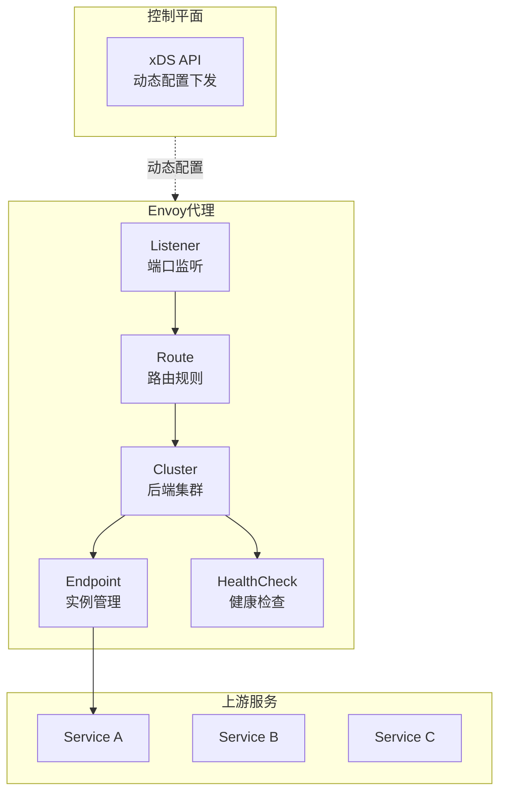

# Envoy代理

## 概述与核心概念

Envoy是Lyft公司于2016年开源的高性能C++分布式代理，专为大规模微服务架构设计。Envoy采用单进程、多线程架构，以性能为核心设计目标，提供代理、负载均衡、服务发现、健康检查等现代网络功能。

Envoy是云原生计算基金会（CNCF）毕业项目，是Istio、AWS App Mesh等服务网格的数据平面标准组件。



### 核心特性

| 特性 | 说明 |
|-----|-----|
| 动态配置 | 无需重启的热更新 |
| xDS协议 | 动态服务发现 |
| 可观测性 | 丰富的统计和追踪 |
| 多协议 | HTTP/HTTP2/gRPC/TCP |
| 服务网格 | Istio标准数据平面 |

## 架构设计

### Envoy配置结构

```mermaid
flowchart TB
    subgraph Bootstrap["Bootstrap配置"]
        Node[Node信息]
        Admin[Admin接口]
        DCD[动态配置源
        xDS服务器]
    end

    subgraph Static["静态配置"]
        ListenerS[Listener]
        ClusterS[Cluster]
    end

    subgraph Dynamic["动态配置"|xDS]
        LDS[LDS
        Listener Discovery]
        RDS[RDS
        Route Discovery]
        CDS[CDS
        Cluster Discovery]
        EDS[EDS
        Endpoint Discovery]
    end

    Bootstrap --> DCD
    DCD --> LDS --> RDS
    DCD --> CDS --> EDS
```

## 配置示例

### 基础配置

```yaml
# envoy.yaml
static_resources:
  listeners:
    - name: listener_0
      address:
        socket_address:
          address: 0.0.0.0
          port_value: 80
      filter_chains:
        - filters:
            - name: envoy.filters.network.http_connection_manager
              typed_config:
                "@type": type.googleapis.com/envoy.extensions.filters.network.http_connection_manager.v3.HttpConnectionManager
                stat_prefix: ingress_http
                route_config:
                  name: local_route
                  virtual_hosts:
                    - name: backend
                      domains: ["*"]
                      routes:
                        - match:
                            prefix: "/service1"
                          route:
                            cluster: service1_cluster
                        - match:
                            prefix: "/service2"
                          route:
                            cluster: service2_cluster
                http_filters:
                  - name: envoy.filters.http.router
                    typed_config:
                      "@type": type.googleapis.com/envoy.extensions.filters.http.router.v3.Router

  clusters:
    - name: service1_cluster
      connect_timeout: 0.25s
      type: STRICT_DNS
      lb_policy: ROUND_ROBIN
      load_assignment:
        cluster_name: service1_cluster
        endpoints:
          - lb_endpoints:
              - endpoint:
                  address:
                    socket_address:
                      address: service1
                      port_value: 8080

    - name: service2_cluster
      connect_timeout: 0.25s
      type: STRICT_DNS
      lb_policy: LEAST_REQUEST
      load_assignment:
        cluster_name: service2_cluster
        endpoints:
          - lb_endpoints:
              - endpoint:
                  address:
                    socket_address:
                      address: service2
                      port_value: 8080

admin:
  address:
    socket_address:
      address: 0.0.0.0
      port_value: 9901
```

### 负载均衡配置

```yaml
clusters:
  - name: backend_cluster
    lb_policy: RING_HASH  # 一致性哈希
    ring_hash_lb_config:
      minimum_ring_size: 1024
      maximum_ring_size: 8388608

  - name: backend_cluster
    lb_policy: LEAST_REQUEST  # 最少请求
    least_request_lb_config:
      choice_count: 2

  - name: backend_cluster
    lb_policy: RANDOM  # 随机

  - name: backend_cluster
    lb_policy: MAGLEV  # Maglev一致性哈希
```

### 健康检查

```yaml
clusters:
  - name: backend_cluster
    health_checks:
      - timeout: 1s
        interval: 5s
        unhealthy_threshold: 3
        healthy_threshold: 2
        http_health_check:
          path: /health
          expected_statuses:
            start: 200
            end: 299
```

## 优缺点分析

| 优势 | 劣势 |
|-----|-----|
| 动态配置无需重启 | 配置复杂 |
| 现代C++性能优秀 | 学习曲线陡峭 |
| 云原生标准 | 资源占用相对较高 |
| 可观测性强 | |
| 服务网格原生支持 | |

## 应用场景

1. **服务网格**：Istio数据平面
2. **API网关**：边缘代理
3. **gRPC代理**：gRPC负载均衡
4. **多协议代理**：HTTP/2, gRPC, TCP

## 总结

Envoy是现代云原生架构的首选代理，特别适合：

- 服务网格场景
- 需要动态配置
- 多协议支持
- 云原生环境

建议：

- 与Istio结合使用
- 利用xDS动态配置
- 重视可观测性配置
