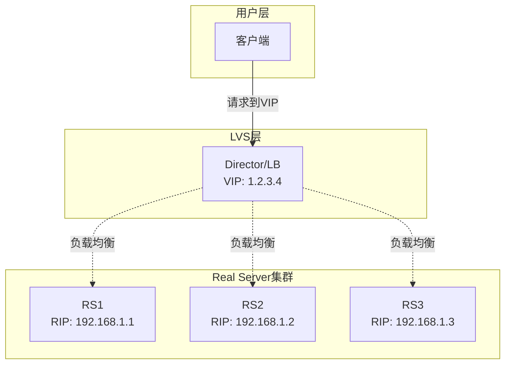
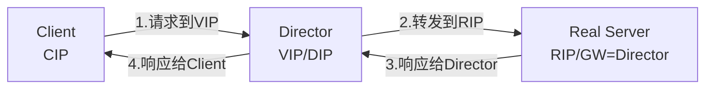
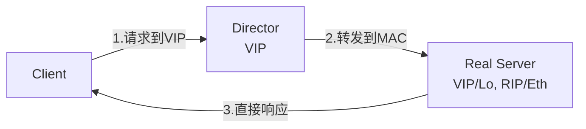
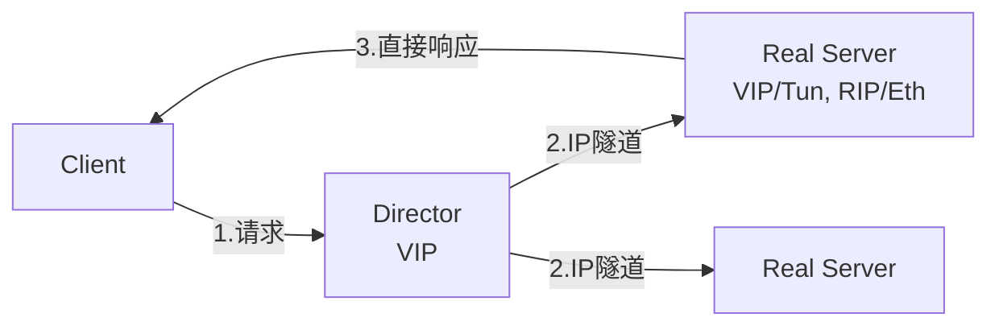
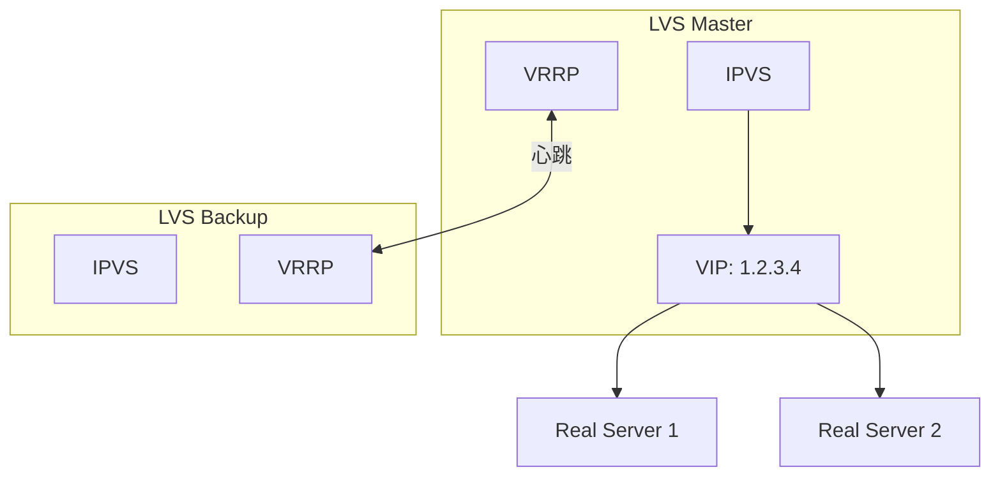

# LVS四层负载

## 概述与核心概念

LVS（Linux Virtual Server，Linux虚拟服务器）是由章文嵩博士于1998年创建的开源项目，现已成为Linux内核的一部分。LVS工作在网络层（OSI第4层），通过IP负载均衡技术将请求分发到多台服务器，构建高性能、高可用的服务器集群。

LVS作为内核级别的负载均衡方案，具有极高的性能和极低的延迟，是目前性能最好的负载均衡方案之一。



### 核心特性

| 特性 | 说明 |
|-----|-----|
| 高性能 | 内核级处理，百万级并发 |
| 低延迟 | 只修改数据包目标地址 |
| 高可靠 | 支持Keepalived热备 |
| 多模式 | DR/TUN/NAT/FULLNAT |
| 无单点 | 主备架构 |

## 工作模式

### 1. NAT模式（VS/NAT）



**特点：**

- Director同时作为网关
- RealServer网关指向Director
- 支持端口映射
- Director可能成为瓶颈

### 2. DR模式（VS/DR）



**特点：**

- 性能最高
- RealServer必须配置VIP
- 响应不经过Director
- 要求在同一物理网络

### 3. TUN模式（VS/TUN）



**特点：**

- 跨机房部署
- RealServer支持IP隧道
- 响应不经过Director

## ipvsadm配置

### 基础配置命令

```bash
# 安装ipvsadm
yum install ipvsadm

# 添加Virtual Server（NAT模式）
ipvsadm -A -t 192.168.1.100:80 -s wrr

# 添加Real Server
ipvsadm -a -t 192.168.1.100:80 -r 192.168.1.10:80 -m -w 1
ipvsadm -a -t 192.168.1.100:80 -r 192.168.1.11:80 -m -w 1

# 添加Virtual Server（DR模式）
ipvsadm -A -t 192.168.1.100:80 -s wlc
ipvsadm -a -t 192.168.1.100:80 -r 192.168.1.10:80 -g
ipvsadm -a -t 192.168.1.100:80 -r 192.168.1.11:80 -g

# 查看配置
ipvsadm -Ln

# 保存配置
ipvsadm-save > /etc/sysconfig/ipvsadm
```

### 调度算法

| 算法 | 缩写 | 说明 |
|-----|-----|-----|
| 轮询 | rr | 依次分配 |
| 加权轮询 | wrr | 按权重分配 |
| 最少连接 | lc | 分配最少连接的服务器 |
| 加权最少连接 | wlc | 默认算法 |
| 源地址哈希 | sh | 同一IP分配到同一服务器 |
| 目标地址哈希 | dh | |

## Keepalived高可用



### Keepalived配置

```conf
# /etc/keepalived/keepalived.conf

global_defs {
    router_id LVS_MASTER
}

vrrp_instance VI_1 {
    state MASTER
    interface eth0
    virtual_router_id 51
    priority 100
    advert_int 1

    authentication {
        auth_type PASS
        auth_pass 1111
    }

    virtual_ipaddress {
        192.168.1.100/24
    }
}

virtual_server 192.168.1.100 80 {
    delay_loop 6
    lb_algo wlc
    lb_kind DR
    protocol TCP

    real_server 192.168.1.10 80 {
        weight 1
        TCP_CHECK {
            connect_timeout 3
            nb_get_retry 3
            delay_before_retry 3
        }
    }

    real_server 192.168.1.11 80 {
        weight 1
        TCP_CHECK {
            connect_timeout 3
            nb_get_retry 3
            delay_before_retry 3
        }
    }
}
```

## 优缺点分析

| 优势 | 劣势 |
|-----|-----|
| 极致性能 | 配置复杂 |
| 内核级处理 | 不支持七层处理 |
| 稳定性高 | 需要专业知识 |
| 资源占用极低 | 运维成本高 |

## 应用场景

1. **高并发入口**：百万级QPS场景
2. **数据库中间件**：MySQL代理前端
3. **CDN边缘节点**：四层负载分发
4. **金融交易系统**：极致性能要求

## 总结

LVS是四层负载均衡的性能之王，适合：

- 对性能有极致要求
- 海量并发连接
- 七层处理需求少
- 有专业运维团队

选型建议：

- 百万级QPS：LVS
- 十万级QPS：Nginx
- 需要七层处理：Nginx/Envoy
