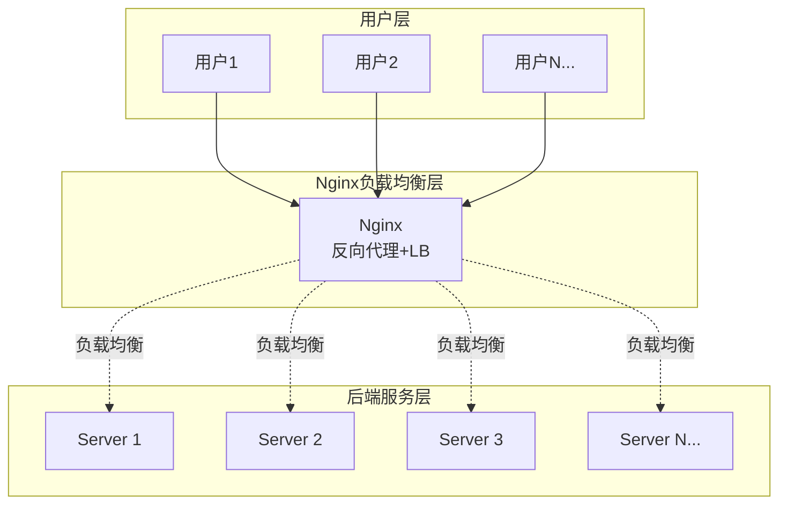

# Nginx负载均衡

## 概述与核心概念

Nginx是一款高性能的HTTP和反向代理服务器，由俄罗斯程序员Igor Sysoev于2004年开发。它以其高并发、低内存占用、配置简单等特点，成为最流行的Web服务器和负载均衡器之一。

Nginx采用事件驱动架构，能够高效处理数万并发连接。在负载均衡场景中，Nginx工作在OSI模型的第7层（应用层），支持基于HTTP内容的智能路由。



### 核心特性

| 特性 | 说明 |
|-----|-----|
| 高并发 | 支持10万+并发连接 |
| 低内存 | 每个连接内存占用少 |
| 热部署 | 配置修改无需重启 |
| 多协议 | HTTP/HTTPS/TCP/UDP |
| 健康检查 | 主动检测后端服务 |

## 负载均衡配置

### 基础配置

```nginx
# upstream定义后端服务器组
upstream backend {
    server 192.168.1.10:8080 weight=5;
    server 192.168.1.11:8080 weight=5;
    server 192.168.1.12:8080 backup;
}

server {
    listen 80;
    server_name api.example.com;
    
    location / {
        proxy_pass http://backend;
        proxy_set_header Host $host;
        proxy_set_header X-Real-IP $remote_addr;
    }
}
```

### 负载均衡算法

| 算法 | 指令 | 说明 |
|-----|-----|-----|
| 轮询 | round_robin | 默认算法，按顺序分配 |
| 权重 | weight | 根据权重分配 |
| IP哈希 | ip_hash | 同一IP固定后端 |
| 最少连接 | least_conn | 分配到连接最少的服务器 |
| 一致性哈希 | hash | 基于key的哈希 |

```nginx
# IP哈希
upstream backend {
    ip_hash;
    server 192.168.1.10:8080;
    server 192.168.1.11:8080;
}

# 最少连接
upstream backend {
    least_conn;
    server 192.168.1.10:8080;
    server 192.168.1.11:8080;
}

# 一致性哈希
upstream backend {
    hash $request_uri consistent;
    server 192.168.1.10:8080;
    server 192.168.1.11:8080;
}
```

### 健康检查

```nginx
upstream backend {
    server 192.168.1.10:8080;
    server 192.168.1.11:8080;
    
    # 主动健康检查（需要nginx plus或第三方模块）
    check interval=3000 rise=2 fall=3 timeout=1000 type=http;
    check_http_send "GET /health HTTP/1.0\r\n\r\n";
    check_http_expect_alive http_2xx http_3xx;
}
```

## 高级配置

### SSL/TLS终端

```nginx
server {
    listen 443 ssl http2;
    server_name api.example.com;
    
    ssl_certificate /etc/nginx/ssl/cert.pem;
    ssl_certificate_key /etc/nginx/ssl/key.pem;
    ssl_protocols TLSv1.2 TLSv1.3;
    ssl_ciphers HIGH:!aNULL:!MD5;
    
    location / {
        proxy_pass http://backend;
    }
}

# HTTP重定向到HTTPS
server {
    listen 80;
    server_name api.example.com;
    return 301 https://$server_name$request_uri;
}
```

### 限流配置

```nginx
# 定义限流区域
limit_req_zone $binary_remote_addr zone=one:10m rate=10r/s;

server {
    location /api/ {
        limit_req zone=one burst=20 nodelay;
        proxy_pass http://backend;
    }
}
```

## 优缺点分析

| 优势 | 劣势 |
|-----|-----|
| 性能极高 | 配置语法复杂 |
| 资源占用低 | 动态 upstream 需第三方模块 |
| 功能丰富 | 商业版功能更完善 |
| 社区活跃 | |

## 应用场景

1. **Web服务器**：静态资源服务
2. **反向代理**：后端应用代理
3. **负载均衡**：多服务器流量分发
4. **缓存服务器**：静态内容缓存
5. **SSL终端**：统一证书管理

## 总结

Nginx是应用层负载均衡的首选方案，特别适合：
- 需要处理大量HTTP请求
- SSL终端卸载
- 静态内容加速
- 七层路由需求
