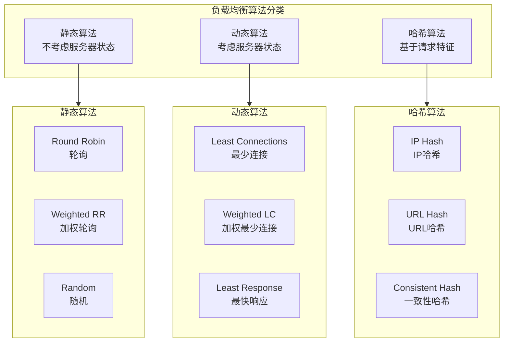
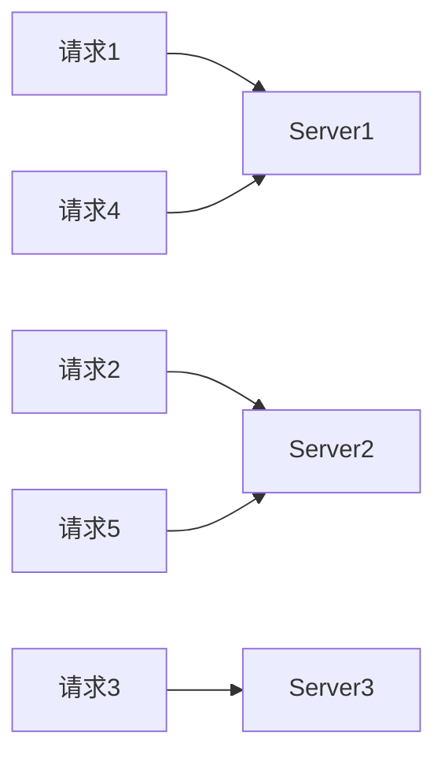
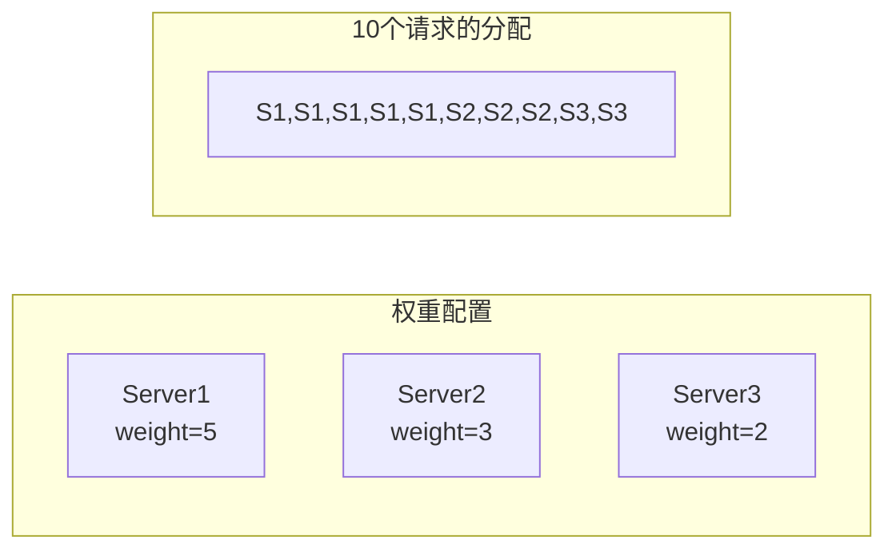
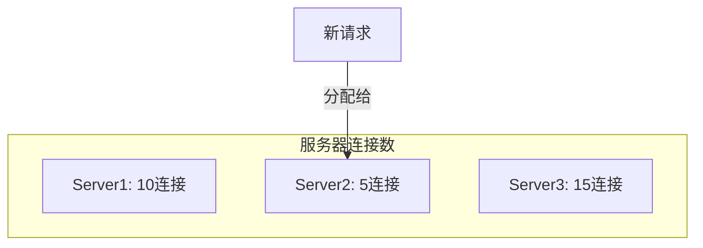
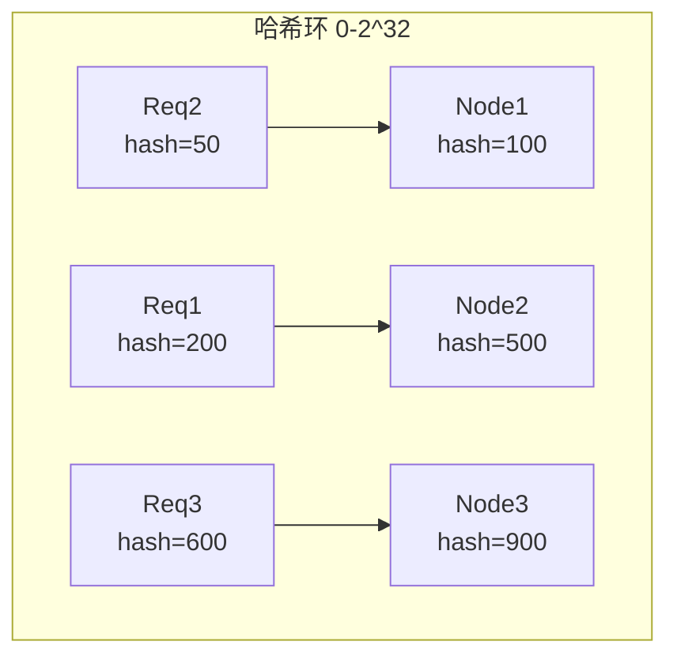
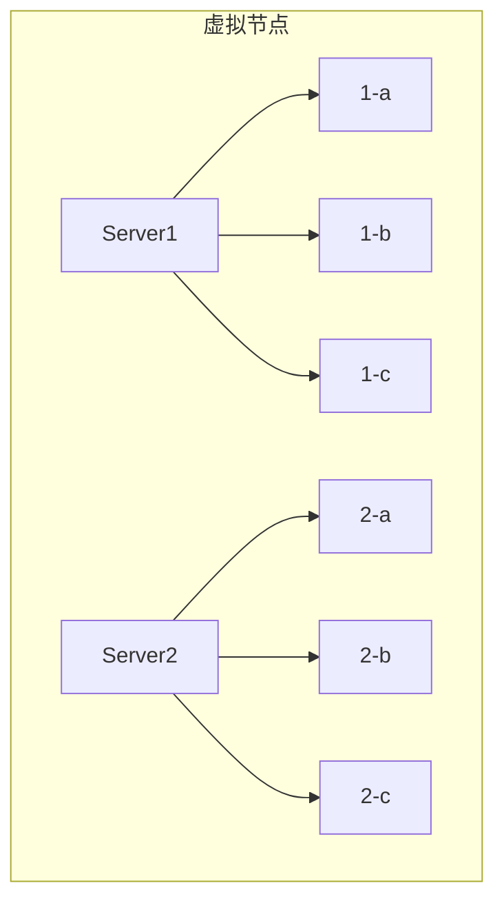
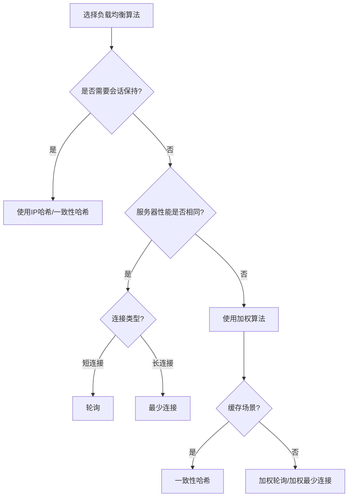

# 负载均衡算法详解

## 概述与核心概念

负载均衡算法是决定如何将请求分发到后端服务器的关键机制。不同的算法适用于不同的场景，理解这些算法的原理和特性对于构建高性能、高可用的分布式系统至关重要。



## 轮询算法（Round Robin）

### 原理

按顺序依次将请求分配到每台服务器，循环往复。



### 特点

| 优点 | 缺点 |
|-----|-----|
| 实现简单 | 不考虑服务器性能差异 |
| 均匀分布 | 不考虑服务器负载 |
| 无状态 | 长连接场景下不够灵活 |

### 适用场景

- 服务器性能相同
- 请求处理时间相近
- 短连接服务

## 加权轮询（Weighted Round Robin）

### 原理

根据服务器权重按比例分配请求。



### 平滑加权轮询算法

```java
/**
 * 平滑加权轮询实现
 */
public class SmoothWeightedRoundRobin {

    private List<Server> servers;
    private int totalWeight;

    class Server {
        String name;
        int weight;
        int currentWeight;

        Server(String name, int weight) {
            this.name = name;
            this.weight = weight;
            this.currentWeight = 0;
        }
    }

    public synchronized Server select() {
        Server best = null;
        int total = 0;

        for (Server server : servers) {
            server.currentWeight += server.weight;
            total += server.weight;

            if (best == null || server.currentWeight > best.currentWeight) {
                best = server;
            }
        }

        if (best != null) {
            best.currentWeight -= total;
        }

        return best;
    }
}
```

## 最少连接（Least Connections）

### 原理

将请求分配给当前连接数最少的服务器。



### 特点

| 优点 | 缺点 |
|-----|-----|
| 考虑实际负载 | 需要维护连接计数 |
| 适合长连接 | 连接数不代表实际负载 |
| 动态调整 | |

## 一致性哈希（Consistent Hashing）

### 原理

将服务器和请求映射到哈希环，顺时针找到最近的服务器。



### 虚拟节点

为了解决数据倾斜问题，引入虚拟节点：



### Java实现

```java
import java.security.MessageDigest;
import java.security.NoSuchAlgorithmException;
import java.util.*;

/**
 * 一致性哈希实现
 */
public class ConsistentHash<T> {

    private final int numberOfReplicas;  // 虚拟节点数
    private final SortedMap<Long, T> circle = new TreeMap<>();
    private MessageDigest md5;

    public ConsistentHash(int numberOfReplicas, Collection<T> nodes) {
        this.numberOfReplicas = numberOfReplicas;
        try {
            this.md5 = MessageDigest.getInstance("MD5");
        } catch (NoSuchAlgorithmException e) {
            throw new RuntimeException(e);
        }

        for (T node : nodes) {
            add(node);
        }
    }

    public void add(T node) {
        for (int i = 0; i < numberOfReplicas; i++) {
            circle.put(hash(node.toString() + i), node);
        }
    }

    public void remove(T node) {
        for (int i = 0; i < numberOfReplicas; i++) {
            circle.remove(hash(node.toString() + i));
        }
    }

    public T get(Object key) {
        if (circle.isEmpty()) {
            return null;
        }

        long hash = hash(key.toString());

        if (!circle.containsKey(hash)) {
            SortedMap<Long, T> tailMap = circle.tailMap(hash);
            hash = tailMap.isEmpty() ? circle.firstKey() : tailMap.firstKey();
        }

        return circle.get(hash);
    }

    private long hash(String key) {
        md5.reset();
        md5.update(key.getBytes());
        byte[] digest = md5.digest();

        long h = 0;
        for (int i = 0; i < 4; i++) {
            h <<= 8;
            h |= (digest[i] & 0xFF);
        }
        return h;
    }
}
```

## 算法对比总结

| 算法 | 复杂度 | 适用场景 | 优缺点 |
|-----|-------|---------|-------|
| 轮询 | O(1) | 同构服务 | 简单均匀，无状态 |
| 加权轮询 | O(1) | 异构服务 | 支持权重，需预配置 |
| 最少连接 | O(N) | 长连接 | 动态调整，开销大 |
| IP哈希 | O(1) | 会话保持 | 固定分配，不易均衡 |
| 一致性哈希 | O(logN) | 缓存场景 | 增删节点影响小 |
| 随机 | O(1) | 简单场景 | 实现简单，分布可能不均 |

## 选型指南



## 总结

- **简单场景**：轮询或随机
- **异构服务器**：加权轮询
- **长连接服务**：最少连接
- **会话保持**：IP哈希
- **缓存系统**：一致性哈希
