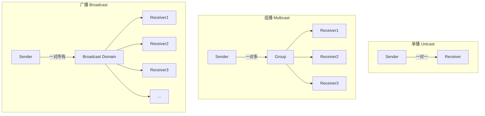
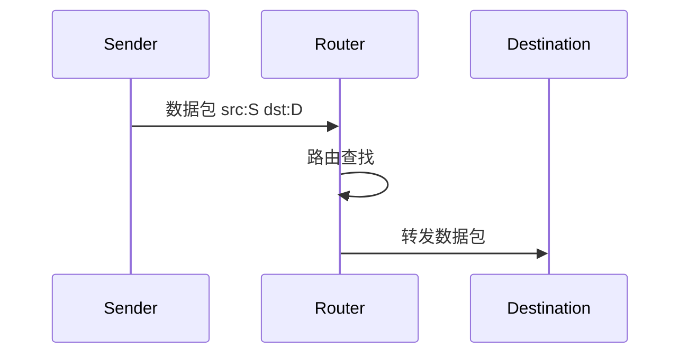
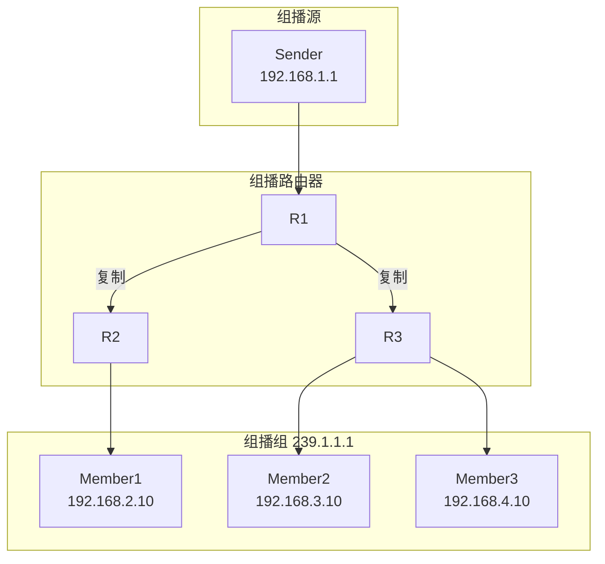
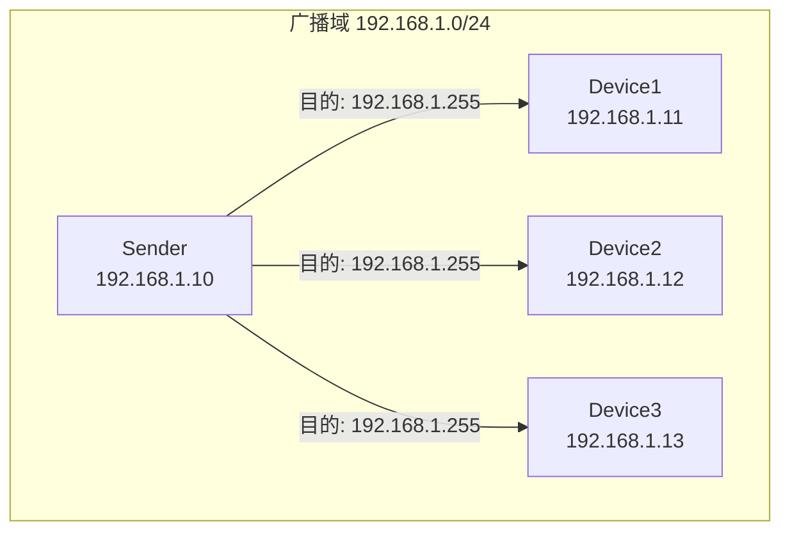

# 单播-组播-广播

## 概述与核心概念

在计算机网络中，根据数据传输的目标范围，通信模式可分为单播（Unicast）、组播（Multicast）和广播（Broadcast）三种基本类型。这三种模式各有特点，适用于不同的应用场景。



### 对比分析

| 特性 | 单播 | 组播 | 广播 |
|-----|-----|------|-----|
| 目标范围 | 一对一 | 一对多（组） | 一对所有 |
| 网络负载 | 高（多份复制） | 低（一份复制） | 高（全网络） |
| 安全性 | 高 | 中 | 低 |
| 适用场景 | 点对点通信 | 多媒体/金融行情 | 局域网发现 |
| 路由支持 | 全支持 | 需特殊支持 | 局域网内 |

## 单播（Unicast）

### 工作原理

单播是最常见的通信方式，数据包从单一源地址发送到单一目标地址。



### 代码示例

```java
import java.io.*;
import java.net.*;

/**
 * 单播通信示例
 */
public class UnicastExample {

    // 单播服务器
    static class UnicastServer {
        public static void main(String[] args) throws IOException {
            ServerSocket serverSocket = new ServerSocket(8080);
            System.out.println("Unicast Server listening on port 8080");

            while (true) {
                Socket clientSocket = serverSocket.accept();
                System.out.println("Client connected: " + clientSocket.getInetAddress());

                // 处理单个客户端
                new Thread(() -> handleClient(clientSocket)).start();
            }
        }

        static void handleClient(Socket socket) {
            try (BufferedReader in = new BufferedReader(
                    new InputStreamReader(socket.getInputStream()));
                 PrintWriter out = new PrintWriter(socket.getOutputStream(), true)) {

                String message;
                while ((message = in.readLine()) != null) {
                    System.out.println("Received: " + message);
                    out.println("Echo: " + message);
                }
            } catch (IOException e) {
                e.printStackTrace();
            }
        }
    }

    // 单播客户端
    static class UnicastClient {
        public static void main(String[] args) throws IOException {
            Socket socket = new Socket("localhost", 8080);

            PrintWriter out = new PrintWriter(socket.getOutputStream(), true);
            BufferedReader in = new BufferedReader(
                new InputStreamReader(socket.getInputStream()));

            out.println("Hello Server");
            String response = in.readLine();
            System.out.println("Server: " + response);

            socket.close();
        }
    }
}
```

## 组播（Multicast）

### 工作原理

组播是一对多的通信方式，数据包同时发送给特定组内的所有成员。



### IP组播地址

| 地址范围 | 用途 |
|---------|-----|
| 224.0.0.0 - 224.0.0.255 | 本地链路组播 |
| 224.0.1.0 - 238.255.255.255 | 全局组播 |
| 239.0.0.0 - 239.255.255.255 | 管理范围组播 |

### 代码示例

```java
import java.io.*;
import java.net.*;

/**
 * 组播通信示例
 */
public class MulticastExample {

    private static final String MULTICAST_GROUP = "239.1.1.1";
    private static final int PORT = 5000;

    // 组播发送者
    static class MulticastSender {
        public static void main(String[] args) throws IOException {
            DatagramSocket socket = new DatagramSocket();
            InetAddress group = InetAddress.getByName(MULTICAST_GROUP);

            String message = "Multicast message at " + System.currentTimeMillis();
            byte[] buffer = message.getBytes();

            DatagramPacket packet = new DatagramPacket(
                buffer, buffer.length, group, PORT);

            // 发送组播包
            socket.send(packet);
            System.out.println("Sent: " + message);

            socket.close();
        }
    }

    // 组播接收者
    static class MulticastReceiver {
        public static void main(String[] args) throws IOException {
            MulticastSocket socket = new MulticastSocket(PORT);
            InetAddress group = InetAddress.getByName(MULTICAST_GROUP);

            // 加入组播组
            socket.joinGroup(group);
            System.out.println("Joined multicast group: " + MULTICAST_GROUP);

            byte[] buffer = new byte[1024];

            while (true) {
                DatagramPacket packet = new DatagramPacket(buffer, buffer.length);
                socket.receive(packet);

                String received = new String(packet.getData(), 0, packet.getLength());
                System.out.println("Received from " + packet.getAddress() + ": " + received);
            }
        }
    }
}
```

## 广播（Broadcast）

### 工作原理

广播是将数据包发送到本地网络中的所有设备。



### 广播类型

| 类型 | 地址 | 说明 |
|-----|-----|-----|
| 有限广播 | 255.255.255.255 | 仅本地网络 |
| 直接广播 | 192.168.1.255 | 特定子网 |

### 代码示例

```java
import java.net.*;

/**
 * 广播通信示例
 */
public class BroadcastExample {

    private static final int PORT = 8888;

    // 广播发送者
    static class BroadcastSender {
        public static void main(String[] args) throws Exception {
            DatagramSocket socket = new DatagramSocket();
            socket.setBroadcast(true);

            String message = "Broadcast message";
            byte[] buffer = message.getBytes();

            // 发送到广播地址
            DatagramPacket packet = new DatagramPacket(
                buffer, buffer.length,
                InetAddress.getByName("255.255.255.255"), PORT);

            socket.send(packet);
            System.out.println("Broadcast sent");

            socket.close();
        }
    }

    // 广播接收者
    static class BroadcastReceiver {
        public static void main(String[] args) throws Exception {
            DatagramSocket socket = new DatagramSocket(PORT);

            byte[] buffer = new byte[1024];
            DatagramPacket packet = new DatagramPacket(buffer, buffer.length);

            System.out.println("Waiting for broadcast...");
            socket.receive(packet);

            String received = new String(packet.getData(), 0, packet.getLength());
            System.out.println("Received broadcast: " + received);
            System.out.println("From: " + packet.getAddress());

            socket.close();
        }
    }
}
```

## 应用场景

| 模式 | 典型应用 |
|-----|---------|
| 单播 | HTTP请求、数据库连接、RPC调用 |
| 组播 | 视频会议、股票行情、在线直播 |
| 广播 | ARP请求、DHCP发现、局域网服务发现 |

## 总结

- **单播**：点对点通信，最常用
- **组播**：一对多高效传输，节省带宽
- **广播**：局域网全范围通信，需谨慎使用
