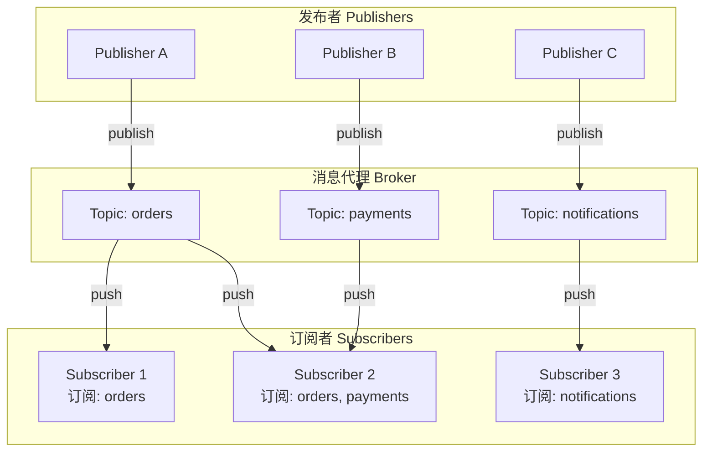
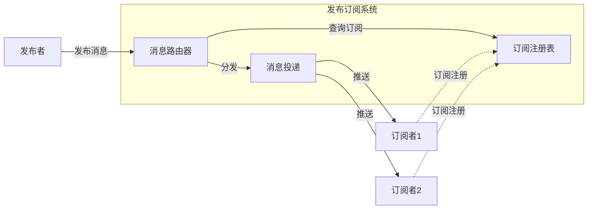

# 发布订阅模式

## 概述与核心概念

发布订阅（Pub/Sub）是一种消息通信模式，发送者（发布者）不会将消息直接发送给特定的接收者（订阅者），而是通过一个中间代理（Broker）将消息发布到不同的主题（Topic）上，订阅了相应主题的接收者会收到消息。



### 核心特性

| 特性 | 说明 |
|-----|-----|
| 解耦 | 发布者和订阅者不直接依赖 |
| 可扩展 | 动态添加发布者和订阅者 |
| 灵活路由 | 基于主题的灵活消息路由 |
| 异步通信 | 非阻塞的消息传递 |

## 架构模型

### 基本实现



## 代码示例

### Java实现

```java
import java.util.*;
import java.util.concurrent.*;

/**
 * 发布订阅模式实现
 */
public class PubSubExample {

    /**
     * 消息类
     */
    static class Message {
        private final String topic;
        private final String content;
        private final long timestamp;

        public Message(String topic, String content) {
            this.topic = topic;
            this.content = content;
            this.timestamp = System.currentTimeMillis();
        }

        public String getTopic() { return topic; }
        public String getContent() { return content; }
        public long getTimestamp() { return timestamp; }
    }

    /**
     * 订阅者接口
     */
    interface Subscriber {
        void onMessage(Message message);
        String getId();
    }

    /**
     * 消息代理
     */
    static class MessageBroker {
        private final Map<String, Set<Subscriber>> topicSubscribers = new ConcurrentHashMap<>();
        private final ExecutorService executor = Executors.newCachedThreadPool();

        // 订阅主题
        public void subscribe(String topic, Subscriber subscriber) {
            topicSubscribers.computeIfAbsent(topic, k -> ConcurrentHashMap.newKeySet())
                           .add(subscriber);
            System.out.println(subscriber.getId() + " subscribed to " + topic);
        }

        // 取消订阅
        public void unsubscribe(String topic, Subscriber subscriber) {
            Set<Subscriber> subscribers = topicSubscribers.get(topic);
            if (subscribers != null) {
                subscribers.remove(subscriber);
            }
        }

        // 发布消息
        public void publish(String topic, String content) {
            Message message = new Message(topic, content);
            Set<Subscriber> subscribers = topicSubscribers.get(topic);

            if (subscribers != null) {
                for (Subscriber subscriber : subscribers) {
                    // 异步投递
                    executor.submit(() -> subscriber.onMessage(message));
                }
            }
        }

        public void shutdown() {
            executor.shutdown();
        }
    }

    /**
     * 具体订阅者
     */
    static class ConcreteSubscriber implements Subscriber {
        private final String id;

        public ConcreteSubscriber(String id) {
            this.id = id;
        }

        @Override
        public void onMessage(Message message) {
            System.out.printf("[%s] Received: topic=%s, content=%s%n",
                id, message.getTopic(), message.getContent());
        }

        @Override
        public String getId() {
            return id;
        }
    }

    public static void main(String[] args) throws InterruptedException {
        MessageBroker broker = new MessageBroker();

        // 创建订阅者
        Subscriber sub1 = new ConcreteSubscriber("Subscriber-1");
        Subscriber sub2 = new ConcreteSubscriber("Subscriber-2");
        Subscriber sub3 = new ConcreteSubscriber("Subscriber-3");

        // 订阅主题
        broker.subscribe("orders", sub1);
        broker.subscribe("orders", sub2);
        broker.subscribe("payments", sub2);
        broker.subscribe("notifications", sub3);

        // 发布消息
        broker.publish("orders", "New order: #1001");
        broker.publish("orders", "New order: #1002");
        broker.publish("payments", "Payment received: $100");
        broker.publish("notifications", "System maintenance scheduled");

        Thread.sleep(1000);
        broker.shutdown();
    }
}
```

### Go实现

```go
package main

import (
    "fmt"
    "sync"
    "time"
)

// Message 消息结构
type Message struct {
    Topic     string
    Content   string
    Timestamp int64
}

// Subscriber 订阅者接口
type Subscriber interface {
    OnMessage(msg Message)
    GetID() string
}

// Broker 消息代理
type Broker struct {
    subscribers map[string]map[string]Subscriber
    mu          sync.RWMutex
}

// NewBroker 创建Broker
func NewBroker() *Broker {
    return &Broker{
        subscribers: make(map[string]map[string]Subscriber),
    }
}

// Subscribe 订阅主题
func (b *Broker) Subscribe(topic string, sub Subscriber) {
    b.mu.Lock()
    defer b.mu.Unlock()

    if b.subscribers[topic] == nil {
        b.subscribers[topic] = make(map[string]Subscriber)
    }
    b.subscribers[topic][sub.GetID()] = sub
    fmt.Printf("%s subscribed to %s\n", sub.GetID(), topic)
}

// Publish 发布消息
func (b *Broker) Publish(topic, content string) {
    msg := Message{
        Topic:     topic,
        Content:   content,
        Timestamp: time.Now().Unix(),
    }

    b.mu.RLock()
    subs := b.subscribers[topic]
    b.mu.RUnlock()

    for _, sub := range subs {
        go sub.OnMessage(msg) // 异步投递
    }
}

// ConcreteSubscriber 具体订阅者
type ConcreteSubscriber struct {
    ID string
}

func (s *ConcreteSubscriber) OnMessage(msg Message) {
    fmt.Printf("[%s] Received: topic=%s, content=%s\n",
        s.ID, msg.Topic, msg.Content)
}

func (s *ConcreteSubscriber) GetID() string {
    return s.ID
}

func main() {
    broker := NewBroker()

    // 创建订阅者
    sub1 := &ConcreteSubscriber{ID: "Subscriber-1"}
    sub2 := &ConcreteSubscriber{ID: "Subscriber-2"}
    sub3 := &ConcreteSubscriber{ID: "Subscriber-3"}

    // 订阅
    broker.Subscribe("orders", sub1)
    broker.Subscribe("orders", sub2)
    broker.Subscribe("payments", sub2)
    broker.Subscribe("notifications", sub3)

    // 发布
    broker.Publish("orders", "New order: #1001")
    broker.Publish("payments", "Payment received: $100")

    time.Sleep(time.Second)
}
```

## 应用场景

| 场景 | 说明 |
|-----|-----|
| 消息队列 | Kafka, RabbitMQ |
| 实时通知 | 即时消息推送 |
| 事件驱动 | 微服务事件总线 |
| 日志聚合 | 分布式日志收集 |
| 配置中心 | 配置变更推送 |

## 优缺点分析

| 优势 | 劣势 |
|-----|-----|
| 完全解耦 | 消息可能丢失 |
| 易于扩展 | 顺序难以保证 |
| 灵活路由 | 调试困难 |
| 异步性能 | 系统复杂度增加 |

## 总结

发布订阅是构建松耦合系统的核心模式，广泛应用于消息队列、事件驱动架构中。选择合适的消息中间件（Kafka/RabbitMQ/Redis PubSub）可以大大简化实现。
