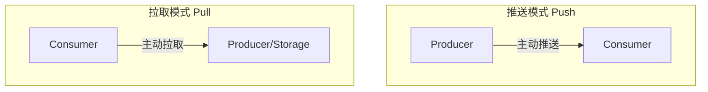
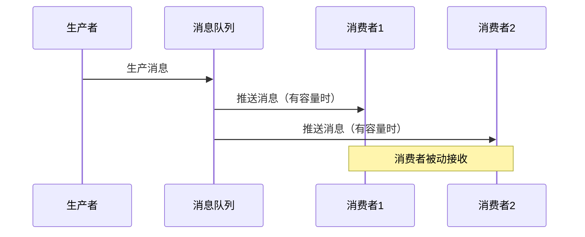
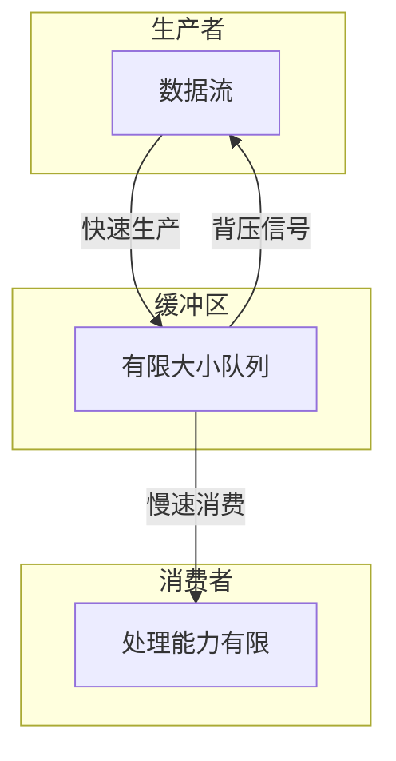
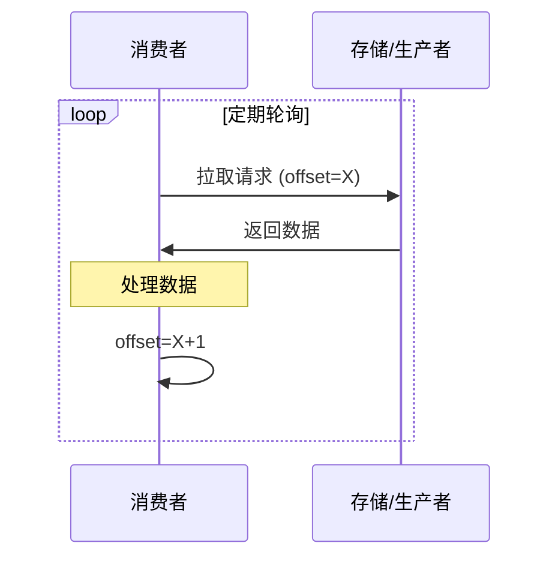
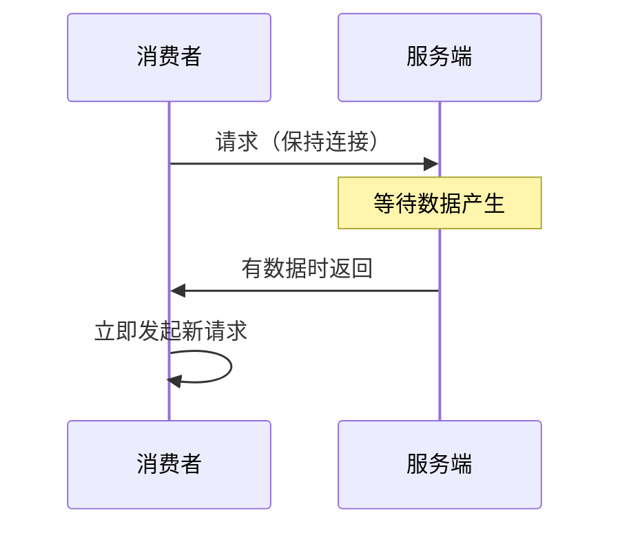

# 推拉模式对比

## 概述与核心概念

在分布式系统中，数据传输主要有两种基本模式：推送（Push）和拉取（Pull）。理解这两种模式的差异和适用场景，对于设计高效的数据传输系统至关重要。



### 核心对比

| 特性 | 推送模式 | 拉取模式 |
|-----|---------|---------|
| 控制方 | 生产者控制 | 消费者控制 |
| 实时性 | 高（实时推送） | 取决于轮询频率 |
| 资源消耗 | 消费者被动接收 | 消费者主动控制 |
| 扩展性 | 需要背压机制 | 天然支持 |
| 复杂度 | 需要管理连接 | 实现简单 |

## 推送模式（Push）

### 工作原理



### 背压机制

当消费者处理速度跟不上生产速度时，需要背压机制：



### 代码示例

```java
import java.util.concurrent.*;
import java.util.concurrent.Flow.*;

/**
 * 推送模式示例 - 使用Reactive Streams
 */
public class PushPatternExample {

    static class NumberPublisher implements Publisher<Integer> {
        private final int maxNumbers;

        public NumberPublisher(int maxNumbers) {
            this.maxNumbers = maxNumbers;
        }

        @Override
        public void subscribe(Subscriber<? super Integer> subscriber) {
            subscriber.onSubscribe(new Subscription() {
                private int count = 0;
                private boolean cancelled = false;
                private int demand = 0;

                @Override
                public void request(long n) {
                    demand += n;
                    while (demand > 0 && count < maxNumbers && !cancelled) {
                        subscriber.onNext(++count);
                        demand--;
                    }
                    if (count >= maxNumbers) {
                        subscriber.onComplete();
                    }
                }

                @Override
                public void cancel() {
                    cancelled = true;
                }
            });
        }
    }

    public static void main(String[] args) throws InterruptedException {
        NumberPublisher publisher = new NumberPublisher(100);

        publisher.subscribe(new Subscriber<Integer>() {
            private Subscription subscription;
            private int count = 0;

            @Override
            public void onSubscribe(Subscription subscription) {
                this.subscription = subscription;
                subscription.request(10); // 请求10条
            }

            @Override
            public void onNext(Integer number) {
                System.out.println("Received: " + number);
                if (++count % 10 == 0) {
                    subscription.request(10); // 再请求10条
                }
            }

            @Override
            public void onError(Throwable t) {
                t.printStackTrace();
            }

            @Override
            public void onComplete() {
                System.out.println("Completed");
            }
        });

        Thread.sleep(1000);
    }
}
```

## 拉取模式（Pull）

### 工作原理



### 代码示例

```java
import java.util.*;

/**
 * 拉取模式示例 - 类似Kafka消费者
 */
public class PullPatternExample {

    static class MessageLog {
        private final List<String> messages = new ArrayList<>();

        public void produce(String message) {
            messages.add(message);
        }

        // 消费者拉取数据
        public List<String> pull(int offset, int maxRecords) {
            List<String> result = new ArrayList<>();
            for (int i = offset; i < Math.min(offset + maxRecords, messages.size()); i++) {
                result.add(messages.get(i));
            }
            return result;
        }

        public int size() {
            return messages.size();
        }
    }

    static class PullConsumer {
        private final MessageLog log;
        private int offset = 0;

        public PullConsumer(MessageLog log) {
            this.log = log;
        }

        public void poll() {
            List<String> records = log.pull(offset, 10);
            for (String record : records) {
                System.out.println("Consumed: " + record);
                offset++;
            }
            if (records.isEmpty()) {
                System.out.println("No new records, current offset: " + offset);
            }
        }
    }

    public static void main(String[] args) throws InterruptedException {
        MessageLog log = new MessageLog();
        PullConsumer consumer = new PullConsumer(log);

        // 生产一些消息
        for (int i = 0; i < 25; i++) {
            log.produce("Message-" + i);
        }

        // 消费者拉取
        System.out.println("=== First poll ===");
        consumer.poll();

        System.out.println("\n=== Second poll ===");
        consumer.poll();

        System.out.println("\n=== Third poll ===");
        consumer.poll();
    }
}
```

## 推拉结合模式

### 长轮询（Long Polling）



### WebSocket推送

```java
// WebSocket服务器推送
@ServerEndpoint("/ws/push")
public class PushServer {

    private static Set<Session> sessions = ConcurrentHashMap.newKeySet();

    @OnOpen
    public void onOpen(Session session) {
        sessions.add(session);
    }

    public static void pushToAll(String message) {
        for (Session session : sessions) {
            try {
                session.getBasicRemote().sendText(message);
            } catch (IOException e) {
                e.printStackTrace();
            }
        }
    }
}
```

## 选型对比

| 场景 | 推荐模式 | 说明 |
|-----|---------|-----|
| 实时通知 | Push | WebSocket, SSE |
| 日志收集 | Pull | 消费者控制速率 |
| 消息队列 | Push+Pull | 如Kafka拉取，RocketMQ推送 |
| 配置中心 | Push | 实时推送变更 |
| 大数据处理 | Pull | 批量拉取更高效 |

## 总结

| 维度 | 推送 | 拉取 |
|-----|-----|-----|
| 实时性 | ★★★★★ | ★★★☆☆ |
| 可控性 | ★★★☆☆ | ★★★★★ |
| 复杂度 | ★★★★☆ | ★★☆☆☆ |
| 扩展性 | ★★★☆☆ | ★★★★★ |

实际系统中常采用混合模式，如Kafka消费者主动拉取，但支持长轮询减少延迟。
