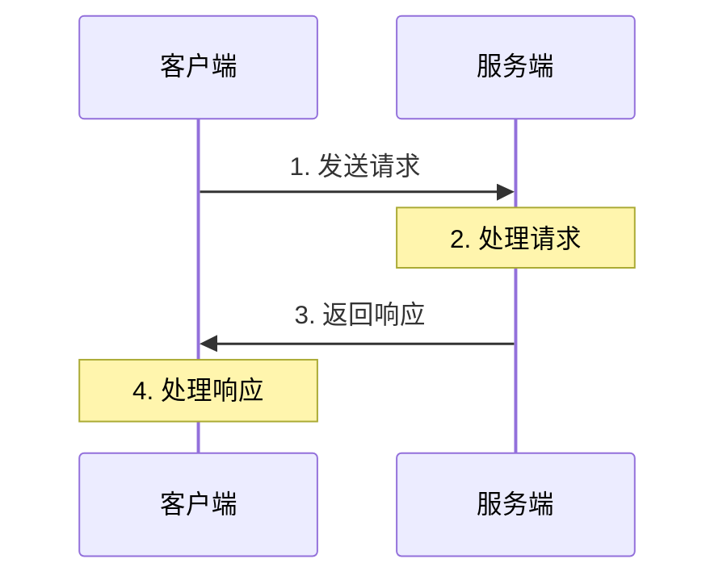
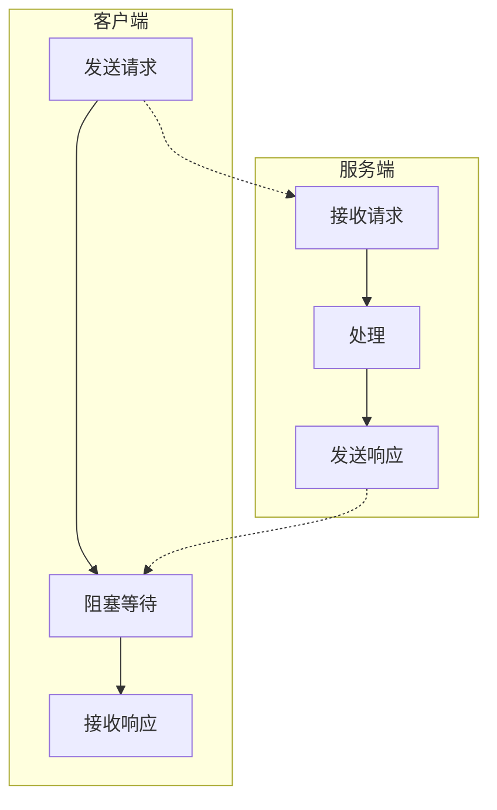
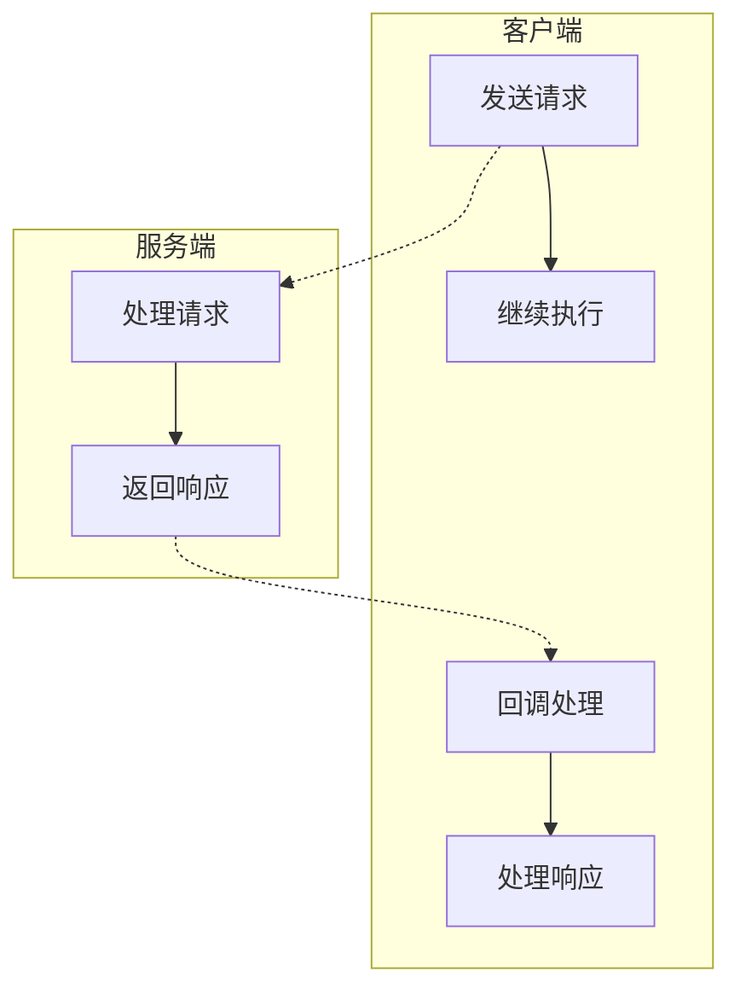
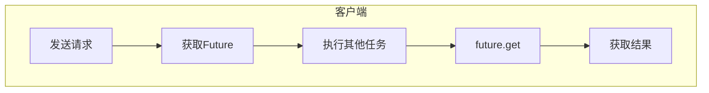
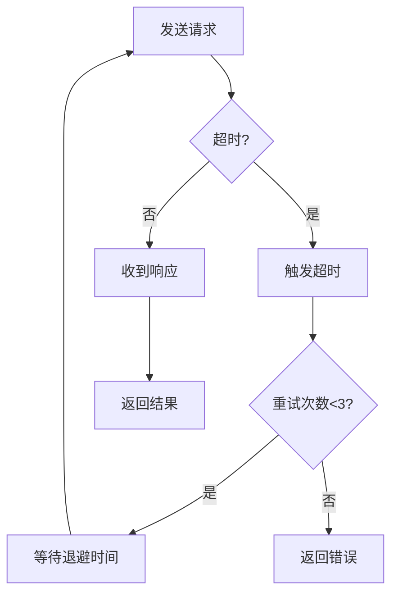

# 请求响应模式

## 概述与核心概念

请求-响应（Request-Response）是最基本、最常用的网络通信模式。客户端向服务器发送请求，服务器处理请求后返回响应。这种模式是同步通信的基础，广泛应用于HTTP、RPC等场景。



### 核心特征

| 特征 | 说明 |
|-----|-----|
| 同步性 | 客户端等待响应 |
| 一对一 | 每个请求对应一个响应 |
| 超时机制 | 防止无限等待 |
| 幂等性 | 重试时需考虑 |

## 实现模式

### 1. 同步阻塞模式



### 2. 异步回调模式



### 3. Future/Promise模式



## 代码示例

### Java实现

```java
import java.util.concurrent.*;

/**
 * 请求响应模式示例
 */
public class RequestResponseExample {

    /**
     * 同步请求
     */
    public String syncRequest(String request) throws Exception {
        // 模拟网络调用
        Thread.sleep(100);
        return "Response for: " + request;
    }

    /**
     * Future异步请求
     */
    public Future<String> asyncRequest(String request) {
        ExecutorService executor = Executors.newSingleThreadExecutor();
        return executor.submit(() -> {
            Thread.sleep(100);
            return "Async Response for: " + request;
        });
    }

    /**
     * CompletableFuture异步请求
     */
    public CompletableFuture<String> completableRequest(String request) {
        return CompletableFuture.supplyAsync(() -> {
            try {
                Thread.sleep(100);
            } catch (InterruptedException e) {
                e.printStackTrace();
            }
            return "Completable Response for: " + request;
        });
    }

    public static void main(String[] args) throws Exception {
        RequestResponseExample example = new RequestResponseExample();

        // 同步调用
        System.out.println("=== 同步调用 ===");
        String syncResult = example.syncRequest("Test1");
        System.out.println(syncResult);

        // Future异步调用
        System.out.println("\n=== Future异步调用 ===");
        Future<String> future = example.asyncRequest("Test2");
        System.out.println("Doing other work...");
        String asyncResult = future.get(1, TimeUnit.SECONDS);
        System.out.println(asyncResult);

        // CompletableFuture
        System.out.println("\n=== CompletableFuture ===");
        example.completableRequest("Test3")
            .thenAccept(System.out::println)
            .get();
    }
}
```

### Go实现

```go
package main

import (
    "context"
    "fmt"
    "time"
)

// Request 请求结构
type Request struct {
    ID      string
    Payload string
}

// Response 响应结构
type Response struct {
    ID      string
    Result  string
    Error   error
}

// Server 服务端
type Server struct{}

// Process 处理请求
func (s *Server) Process(req Request) Response {
    // 模拟处理时间
    time.Sleep(100 * time.Millisecond)

    return Response{
        ID:     req.ID,
        Result: "Processed: " + req.Payload,
    }
}

// SyncCall 同步调用
func SyncCall(server *Server, req Request) Response {
    return server.Process(req)
}

// AsyncCall 异步调用
func AsyncCall(server *Server, req Request) <-chan Response {
    ch := make(chan Response, 1)
    go func() {
        ch <- server.Process(req)
        close(ch)
    }()
    return ch
}

// CallWithTimeout 带超时的调用
func CallWithTimeout(server *Server, req Request, timeout time.Duration) (Response, error) {
    ctx, cancel := context.WithTimeout(context.Background(), timeout)
    defer cancel()

    ch := make(chan Response, 1)
    go func() {
        ch <- server.Process(req)
    }()

    select {
    case resp := <-ch:
        return resp, nil
    case <-ctx.Done():
        return Response{}, ctx.Err()
    }
}

func main() {
    server := &Server{}
    req := Request{ID: "1", Payload: "Test"}

    // 同步调用
    fmt.Println("=== 同步调用 ===")
    resp := SyncCall(server, req)
    fmt.Println(resp.Result)

    // 异步调用
    fmt.Println("\n=== 异步调用 ===")
    ch := AsyncCall(server, req)
    fmt.Println("Doing other work...")
    resp = <-ch
    fmt.Println(resp.Result)

    // 带超时调用
    fmt.Println("\n=== 带超时调用 ===")
    resp, err := CallWithTimeout(server, req, 200*time.Millisecond)
    if err != nil {
        fmt.Println("Timeout:", err)
    } else {
        fmt.Println(resp.Result)
    }
}
```

## 超时与重试策略



### 实现示例

```java
public String requestWithRetry(String request, int maxRetries) {
    int retries = 0;
    while (retries < maxRetries) {
        try {
            return syncRequestWithTimeout(request, 1000);
        } catch (TimeoutException e) {
            retries++;
            if (retries >= maxRetries) {
                throw new RuntimeException("Max retries exceeded");
            }
            // 指数退避
            long backoff = (long) Math.pow(2, retries) * 100;
            Thread.sleep(backoff);
        }
    }
    return null;
}
```

## 应用场景

| 场景 | 协议/技术 |
|-----|----------|
| Web API | HTTP/REST |
| 微服务调用 | gRPC, Dubbo |
| 数据库操作 | JDBC, ORM |
| 缓存操作 | Redis, Memcached |

## 总结

请求响应是最基础的通信模式，关键点：

- 合理设置超时时间
- 实现重试和退避策略
- 考虑幂等性设计
- 异步化提高吞吐量
