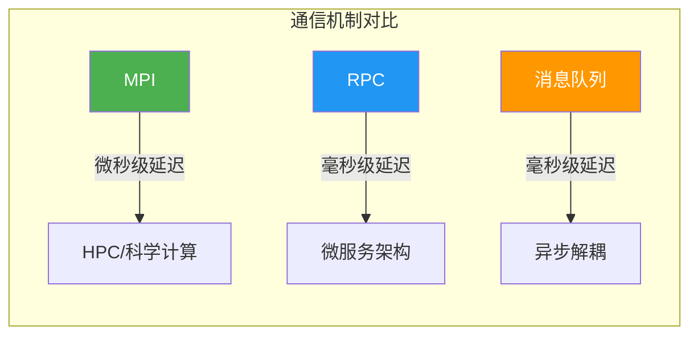
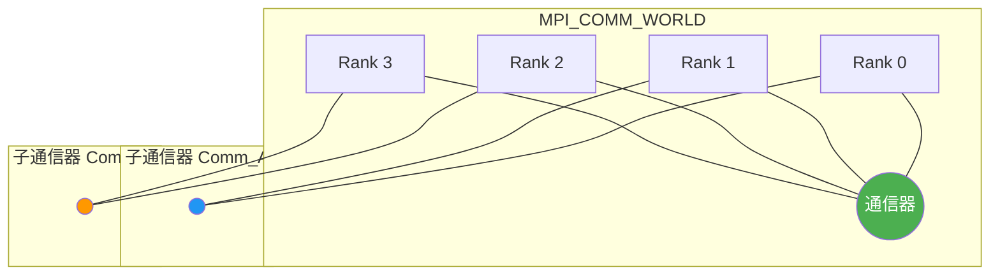
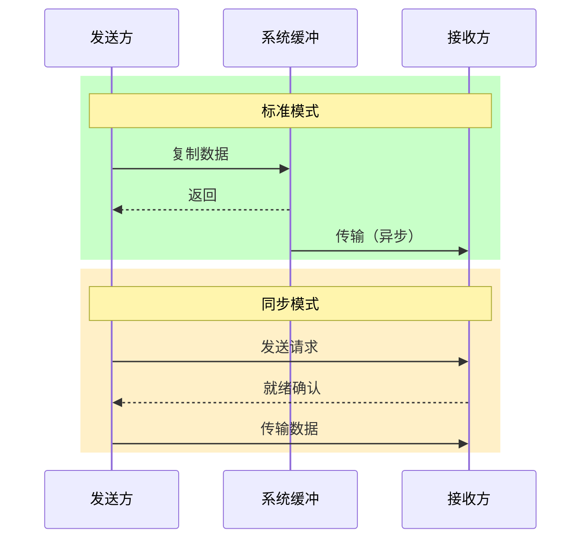
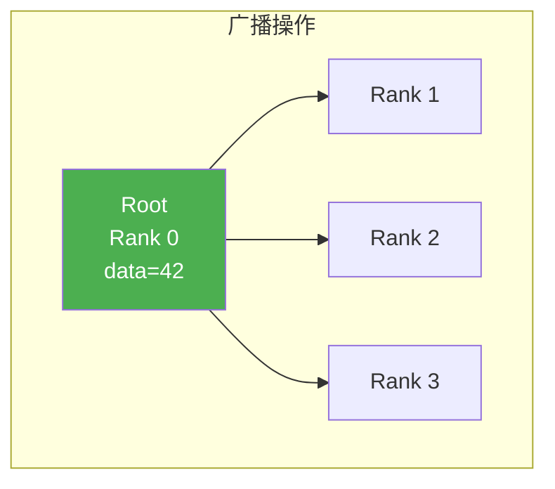
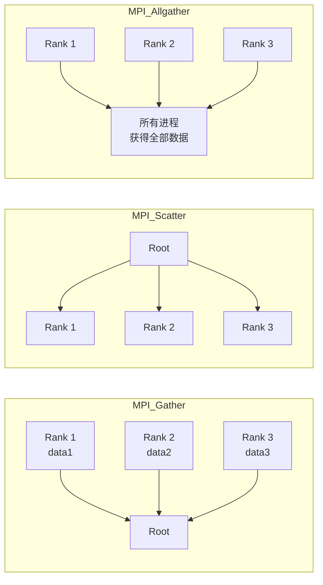
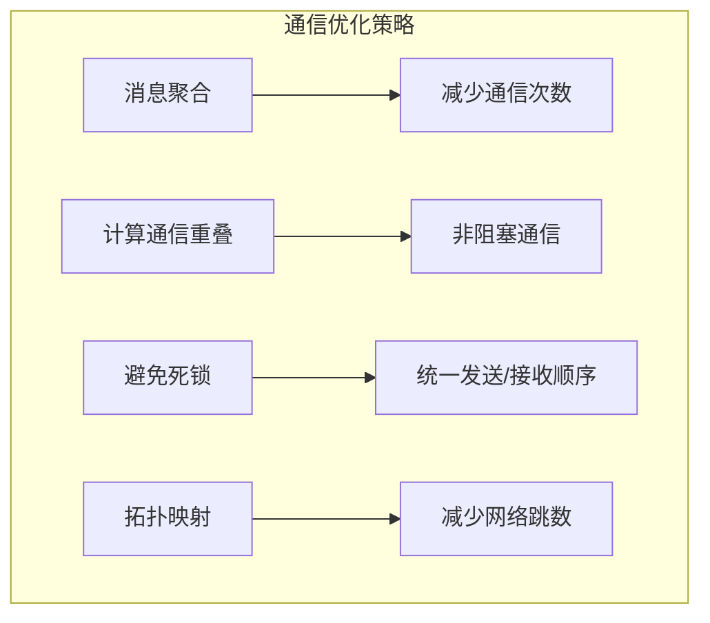
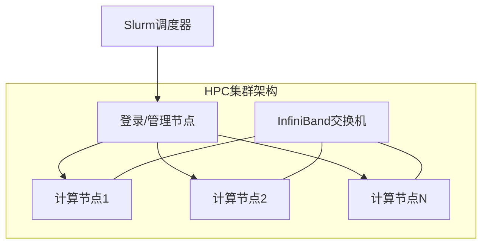

# MPI（Message Passing Interface）详解

> 高性能计算（HPC）领域的事实标准，提供跨节点的显式消息传递机制

---

## 📋 目录

- [1. MPI概述](#1-mpi概述)
- [2. MPI核心概念](#2-mpi核心概念)
- [3. 点对点通信](#3-点对点通信)
- [4. 集合通信](#4-集合通信)
- [5. MPI高级特性](#5-mpi高级特性)
- [6. MPI性能优化](#6-mpi性能优化)
- [7. MPI实践案例](#7-mpi实践案例)
- [8. MPI与分布式系统](#8-mpi与分布式系统)

---

## 1. MPI概述

### 1.1 什么是MPI

MPI（Message Passing Interface）是**标准化消息传递库规范**，定义了并行进程间通信的接口标准。

**发展历程**：

| 版本 | 年份 | 主要特性 |
|:---|:---:|:---|
| MPI-1.0 | 1994 | 基本点对点通信、集合通信、数据类型 |
| MPI-2.0 | 1997 | 并行I/O、动态进程管理、单边通信 |
| MPI-3.0 | 2012 | 非阻塞集合通信、邻域集合、扩展One-Sided |
| MPI-4.0 | 2021 | 持久通信、分区通信、错误处理增强 |

**主流实现**：

- **OpenMPI**：开源、模块化设计，学术和工业界广泛使用
- **MPICH**：由Argonne国家实验室开发，众多商业实现的基石
- **Intel MPI**：针对Intel架构深度优化，性能卓越
- **MVAPICH**：针对InfiniBand网络优化

### 1.2 MPI vs 其他通信机制



| 特性 | MPI | RPC | 消息队列 |
|:---|:---|:---|:---|
| **耦合度** | 紧耦合 | 中耦合 | 松耦合 |
| **延迟** | 微秒级（μs） | 毫秒级（ms） | 毫秒级（ms） |
| **拓扑感知** | ✅ 支持 | ❌ 不支持 | ❌ 不支持 |
| **适用场景** | HPC、科学计算 | 微服务调用 | 异步解耦 |
| **进程模型** | SPMD/MPMD | 请求-响应 | 发布-订阅 |
| **容错性** | 弱（检查点重启） | 中（重试机制） | 强（持久化） |

---

## 2. MPI核心概念

### 2.1 通信器（Communicator）

通信器定义了一组可以相互通信的进程集合。



**关键概念**：

- **MPI_COMM_WORLD**：包含所有进程的默认通信器
- **Rank**：进程在通信器中的唯一标识（0到n-1）
- **子通信器**：通过 `MPI_Comm_split` 创建，用于进程分组

```c
// 按颜色分割通信器，创建子组
int color = rank % 2;  // 偶数rank为组0，奇数为组1
MPI_Comm sub_comm;
MPI_Comm_split(MPI_COMM_WORLD, color, rank, &sub_comm);

// 获取子通信器中的rank
int sub_rank, sub_size;
MPI_Comm_rank(sub_comm, &sub_rank);
MPI_Comm_size(sub_comm, &sub_size);
```

### 2.2 进程模型

**SPMD（Single Program Multiple Data）**：

```c
// 所有进程执行相同程序，但处理不同数据
#include <mpi.h>
#include <stdio.h>

int main(int argc, char** argv) {
    MPI_Init(&argc, &argv);

    int rank, size;
    MPI_Comm_rank(MPI_COMM_WORLD, &rank);
    MPI_Comm_size(MPI_COMM_WORLD, &size);

    // 每个进程处理不同的数据分片
    int local_data = rank * 10;
    printf("Rank %d/%d: local_data = %d\n", rank, size, local_data);

    MPI_Finalize();
    return 0;
}
```

---

## 3. 点对点通信

### 3.1 标准发送/接收

```c
// 标准阻塞通信
MPI_Send(const void* buf, int count, MPI_Datatype datatype,
         int dest, int tag, MPI_Comm comm);

MPI_Recv(void* buf, int count, MPI_Datatype datatype,
         int source, int tag, MPI_Comm comm, MPI_Status* status);
```

**参数说明**：

| 参数 | 说明 |
|:---|:---|
| `buf` | 发送/接收缓冲区 |
| `count` | 元素数量 |
| `datatype` | MPI数据类型（MPI_INT, MPI_DOUBLE等） |
| `dest/source` | 目标/源进程rank |
| `tag` | 消息标签，用于区分不同类型的消息 |
| `comm` | 通信器 |

```c
// 点对点通信示例：进程0发送数据给进程1
#include <mpi.h>
#include <stdio.h>

int main(int argc, char** argv) {
    MPI_Init(&argc, &argv);

    int rank;
    MPI_Comm_rank(MPI_COMM_WORLD, &rank);

    int data = 100;
    MPI_Status status;

    if (rank == 0) {
        data = 42;
        MPI_Send(&data, 1, MPI_INT, 1, 0, MPI_COMM_WORLD);
        printf("Rank 0: 发送数据 %d 给 Rank 1\n", data);
    } else if (rank == 1) {
        MPI_Recv(&data, 1, MPI_INT, 0, 0, MPI_COMM_WORLD, &status);
        printf("Rank 1: 接收到数据 %d 来自 Rank 0\n", data);
    }

    MPI_Finalize();
    return 0;
}
```

### 3.2 通信模式

| 模式 | 函数 | 特点 |
|:---|:---|:---|
| **标准模式** | `MPI_Send` | 系统选择缓冲或同步 |
| **同步模式** | `MPI_Ssend` | 等待接收方就绪确认 |
| **缓冲模式** | `MPI_Bsend` | 用户缓冲区，立即返回 |
| **就绪模式** | `MPI_Rsend` | 要求接收方已准备好 |



### 3.3 非阻塞通信

非阻塞通信允许**计算与通信重叠**，显著提升性能。

```c
// 非阻塞发送/接收
MPI_Isend(const void* buf, int count, MPI_Datatype datatype,
          int dest, int tag, MPI_Comm comm, MPI_Request* request);

MPI_Irecv(void* buf, int count, MPI_Datatype datatype,
          int source, int tag, MPI_Comm comm, MPI_Request* request);

// 等待完成
MPI_Wait(MPI_Request* request, MPI_Status* status);
MPI_Test(MPI_Request* request, int* flag, MPI_Status* status);
```

```c
// 非阻塞通信示例：计算与通信重叠
#include <mpi.h>
#include <stdio.h>
#include <unistd.h>

#define DATA_SIZE 1000000

int main(int argc, char** argv) {
    MPI_Init(&argc, &argv);

    int rank, size;
    MPI_Comm_rank(MPI_COMM_WORLD, &rank);
    MPI_Comm_size(MPI_COMM_WORLD, &size);

    double data[DATA_SIZE];
    MPI_Request request;
    MPI_Status status;

    if (rank == 0) {
        // 初始化数据
        for (int i = 0; i < DATA_SIZE; i++) data[i] = i * 0.1;

        // 非阻塞发送
        MPI_Isend(data, DATA_SIZE, MPI_DOUBLE, 1, 0, MPI_COMM_WORLD, &request);

        // 在数据传输期间执行计算
        double sum = 0;
        for (int i = 0; i < DATA_SIZE; i++) sum += data[i];
        printf("Rank 0: 计算和=%.2f\n", sum);

        // 确保发送完成
        MPI_Wait(&request, &status);
        printf("Rank 0: 发送完成\n");

    } else if (rank == 1) {
        // 非阻塞接收
        MPI_Irecv(data, DATA_SIZE, MPI_DOUBLE, 0, 0, MPI_COMM_WORLD, &request);

        // 在等待期间执行其他工作
        printf("Rank 1: 执行其他任务...\n");

        // 等待接收完成
        MPI_Wait(&request, &status);
        printf("Rank 1: 接收完成，data[0]=%.2f\n", data[0]);
    }

    MPI_Finalize();
    return 0;
}
```

---

## 4. 集合通信

### 4.1 屏障同步

```c
MPI_Barrier(MPI_Comm comm);
```

所有进程到达屏障后才能继续执行，用于同步。

### 4.2 广播

```c
MPI_Bcast(void* buffer, int count, MPI_Datatype datatype,
          int root, MPI_Comm comm);
```



### 4.3 归约操作

```c
MPI_Reduce(const void* sendbuf, void* recvbuf, int count,
           MPI_Datatype datatype, MPI_Op op, int root, MPI_Comm comm);
```

**预定义操作**：

| 操作 | 说明 |
|:---|:---|
| `MPI_SUM` | 求和 |
| `MPI_MAX` | 最大值 |
| `MPI_MIN` | 最小值 |
| `MPI_PROD` | 乘积 |
| `MPI_LAND` | 逻辑与 |
| `MPI_BAND` | 按位与 |

```c
// 全局求和示例
#include <mpi.h>
#include <stdio.h>

int main(int argc, char** argv) {
    MPI_Init(&argc, &argv);

    int rank;
    MPI_Comm_rank(MPI_COMM_WORLD, &rank);

    int local_value = rank + 1;  // 每个进程贡献rank+1
    int global_sum;

    // 将所有local_value求和到root进程
    MPI_Reduce(&local_value, &global_sum, 1, MPI_INT, MPI_SUM, 0, MPI_COMM_WORLD);

    if (rank == 0) {
        printf("全局求和结果: %d\n", global_sum);  // 1+2+3+...+n
    }

    // 全局归约到所有进程
    int all_sum;
    MPI_Allreduce(&local_value, &all_sum, 1, MPI_INT, MPI_SUM, MPI_COMM_WORLD);
    printf("Rank %d: Allreduce结果=%d\n", rank, all_sum);

    MPI_Finalize();
    return 0;
}
```

### 4.4 全局操作对比



---

## 5. MPI高级特性

### 5.1 派生数据类型

用于传输非连续或结构化数据。

```c
// 连续类型
MPI_Type_contiguous(int count, MPI_Datatype oldtype, MPI_Datatype* newtype);

// 向量类型（等间距数据）
MPI_Type_vector(int count, int blocklength, int stride,
                MPI_Datatype oldtype, MPI_Datatype* newtype);

// 结构体类型
MPI_Type_create_struct(int count, int array_of_blocklengths[],
                       MPI_Aint array_of_displacements[],
                       MPI_Datatype array_of_types[],
                       MPI_Datatype* newtype);
```

```c
// 结构体传输示例
typedef struct {
    int id;
    double x, y, z;
    char name[20];
} Particle;

void create_particle_type(MPI_Datatype* particle_type) {
    Particle p;
    int blocklengths[4] = {1, 3, 20};
    MPI_Datatype types[4] = {MPI_INT, MPI_DOUBLE, MPI_CHAR};
    MPI_Aint displacements[4];

    MPI_Get_address(&p.id, &displacements[0]);
    MPI_Get_address(&p.x, &displacements[1]);
    MPI_Get_address(&p.name, &displacements[2]);

    // 计算相对位移
    MPI_Aint base = displacements[0];
    for (int i = 0; i < 3; i++) displacements[i] -= base;

    MPI_Type_create_struct(3, blocklengths, displacements, types, particle_type);
    MPI_Type_commit(particle_type);
}
```

### 5.2 单边通信（RMA）

单边通信允许进程直接访问其他进程的内存，无需对方参与。

```c
// 创建窗口
MPI_Win_create(void* base, MPI_Aint size, int disp_unit,
               MPI_Info info, MPI_Comm comm, MPI_Win* win);

// 远程内存操作
MPI_Put(const void* origin_addr, int origin_count, MPI_Datatype origin_datatype,
        int target_rank, MPI_Aint target_disp, int target_count,
        MPI_Datatype target_datatype, MPI_Win win);

MPI_Get(void* origin_addr, int origin_count, MPI_Datatype origin_datatype,
        int target_rank, MPI_Aint target_disp, int target_count,
        MPI_Datatype target_datatype, MPI_Win win);

MPI_Accumulate(const void* origin_addr, int origin_count,
               MPI_Datatype origin_datatype, int target_rank,
               MPI_Aint target_disp, int target_count,
               MPI_Datatype target_datatype, MPI_Op op, MPI_Win win);
```

```c
// RMA示例：进程0向进程1的窗口写入数据
#include <mpi.h>
#include <stdio.h>

int main(int argc, char** argv) {
    MPI_Init(&argc, &argv);

    int rank;
    MPI_Comm_rank(MPI_COMM_WORLD, &rank);

    int local_data = 0;
    MPI_Win win;

    // 创建窗口暴露local_data
    MPI_Win_create(&local_data, sizeof(int), sizeof(int),
                   MPI_INFO_NULL, MPI_COMM_WORLD, &win);

    MPI_Win_fence(0, win);  // 同步开始

    if (rank == 0) {
        int value = 42;
        // 将value写入进程1的窗口
        MPI_Put(&value, 1, MPI_INT, 1, 0, 1, MPI_INT, win);
        printf("Rank 0: 发送数据 %d 到 Rank 1\n", value);
    }

    MPI_Win_fence(0, win);  // 同步完成

    printf("Rank %d: local_data = %d\n", rank, local_data);

    MPI_Win_free(&win);
    MPI_Finalize();
    return 0;
}
```

### 5.3 动态进程管理

```c
// 派生新进程
MPI_Comm_spawn(const char* command, char* argv[], int maxprocs,
               MPI_Info info, int root, MPI_Comm comm,
               MPI_Comm* intercomm, int array_of_errcodes[]);

// 发布/查找服务名
MPI_Publish_name(const char* service_name, MPI_Info info, const char* port_name);
MPI_Lookup_name(const char* service_name, MPI_Info info, char* port_name);
```

---

## 6. MPI性能优化

### 6.1 通信优化策略



**消息聚合**：

```c
// 优化前：多次小消息
for (int i = 0; i < 1000; i++) {
    MPI_Send(&small_data[i], 1, MPI_INT, dest, i, comm);
}

// 优化后：一次大消息
MPI_Send(small_data, 1000, MPI_INT, dest, 0, comm);
```

**避免死锁**：

```c
// 危险：可能导致死锁
if (rank == 0) {
    MPI_Send(buf, count, MPI_INT, 1, 0, comm);
    MPI_Recv(buf, count, MPI_INT, 1, 0, comm, &status);
} else if (rank == 1) {
    MPI_Send(buf, count, MPI_INT, 0, 0, comm);  // 互相等待！
    MPI_Recv(buf, count, MPI_INT, 0, 0, comm, &status);
}

// 安全：使用非阻塞或调整顺序
if (rank == 0) {
    MPI_Send(buf, count, MPI_INT, 1, 0, comm);
    MPI_Recv(buf, count, MPI_INT, 1, 0, comm, &status);
} else if (rank == 1) {
    MPI_Recv(buf, count, MPI_INT, 0, 0, comm, &status);  // 先接收
    MPI_Send(buf, count, MPI_INT, 0, 0, comm);           // 后发送
}
```

### 6.2 拓扑映射

```c
// 创建笛卡尔拓扑
int dims[2] = {0, 0};
int periods[2] = {1, 1};  // 周期性边界
MPI_Dims_create(size, 2, dims);  // 自动分解进程数

MPI_Comm cart_comm;
MPI_Cart_create(MPI_COMM_WORLD, 2, dims, periods, 1, &cart_comm);

// 获取邻居
int rank;
MPI_Comm_rank(cart_comm, &rank);

int coords[2];
MPI_Cart_coords(cart_comm, rank, 2, coords);

int left, right, up, down;
MPI_Cart_shift(cart_comm, 0, 1, &up, &down);
MPI_Cart_shift(cart_comm, 1, 1, &left, &right);

printf("Rank %d (%d,%d): neighbors L=%d R=%d U=%d D=%d\n",
       rank, coords[0], coords[1], left, right, up, down);
```

---

## 7. MPI实践案例

### 7.1 并行矩阵乘法（Cannon算法）

```c
#include <mpi.h>
#include <stdio.h>
#include <stdlib.h>

#define N 1024  // 矩阵维度
#define BLOCK_SIZE (N / dims[0])

void cannon_matrix_multiply(double* A, double* B, double* C, int n) {
    int rank, size;
    MPI_Comm_rank(MPI_COMM_WORLD, &rank);
    MPI_Comm_size(MPI_COMM_WORLD, &size);

    // 创建2D笛卡尔拓扑
    int dims[2] = {0, 0};
    MPI_Dims_create(size, 2, dims);

    int periods[2] = {1, 1};
    MPI_Comm cart_comm;
    MPI_Cart_create(MPI_COMM_WORLD, 2, dims, periods, 0, &cart_comm);

    int coords[2];
    MPI_Cart_coords(cart_comm, rank, 2, coords);

    // 获取左右上下邻居
    int left, right, up, down;
    MPI_Cart_shift(cart_comm, 1, coords[0], &left, &right);  // A矩阵左移
    MPI_Cart_shift(cart_comm, 0, coords[1], &up, &down);     // B矩阵上移

    // 本地矩阵块
    double* local_A = malloc(BLOCK_SIZE * BLOCK_SIZE * sizeof(double));
    double* local_B = malloc(BLOCK_SIZE * BLOCK_SIZE * sizeof(double));
    double* local_C = calloc(BLOCK_SIZE * BLOCK_SIZE, sizeof(double));

    // 初始化本地矩阵块...

    // Cannon算法主循环
    for (int step = 0; step < dims[0]; step++) {
        // 计算局部矩阵乘积
        for (int i = 0; i < BLOCK_SIZE; i++) {
            for (int j = 0; j < BLOCK_SIZE; j++) {
                for (int k = 0; k < BLOCK_SIZE; k++) {
                    local_C[i * BLOCK_SIZE + j] +=
                        local_A[i * BLOCK_SIZE + k] * local_B[k * BLOCK_SIZE + j];
                }
            }
        }

        // 循环移位
        MPI_Sendrecv_replace(local_A, BLOCK_SIZE * BLOCK_SIZE, MPI_DOUBLE,
                             left, 0, right, 0, cart_comm, MPI_STATUS_IGNORE);
        MPI_Sendrecv_replace(local_B, BLOCK_SIZE * BLOCK_SIZE, MPI_DOUBLE,
                             up, 0, down, 0, cart_comm, MPI_STATUS_IGNORE);
    }

    // 收集结果...

    free(local_A); free(local_B); free(local_C);
    MPI_Comm_free(&cart_comm);
}

int main(int argc, char** argv) {
    MPI_Init(&argc, &argv);

    double* A = NULL, * B = NULL, * C = NULL;

    // 根进程初始化矩阵
    int rank;
    MPI_Comm_rank(MPI_COMM_WORLD, &rank);
    if (rank == 0) {
        A = malloc(N * N * sizeof(double));
        B = malloc(N * N * sizeof(double));
        C = calloc(N * N, sizeof(double));
        // 初始化A、B...
    }

    double start = MPI_Wtime();
    cannon_matrix_multiply(A, B, C, N);
    double end = MPI_Wtime();

    if (rank == 0) {
        printf("并行矩阵乘法耗时: %.3f 秒\n", end - start);
        free(A); free(B); free(C);
    }

    MPI_Finalize();
    return 0;
}
```

### 7.2 并行排序：归并排序的MPI实现

```c
#include <mpi.h>
#include <stdio.h>
#include <stdlib.h>
#include <string.h>

void merge(int* arr, int left, int mid, int right) {
    int n1 = mid - left + 1;
    int n2 = right - mid;

    int* L = malloc(n1 * sizeof(int));
    int* R = malloc(n2 * sizeof(int));

    memcpy(L, &arr[left], n1 * sizeof(int));
    memcpy(R, &arr[mid + 1], n2 * sizeof(int));

    int i = 0, j = 0, k = left;
    while (i < n1 && j < n2) {
        if (L[i] <= R[j]) arr[k++] = L[i++];
        else arr[k++] = R[j++];
    }

    while (i < n1) arr[k++] = L[i++];
    while (j < n2) arr[k++] = R[j++];

    free(L); free(R);
}

void parallel_merge_sort(int* local_data, int local_n, int rank, int size) {
    // 本地排序
    qsort(local_data, local_n, sizeof(int),
          (int(*)(const void*, const void*))strcmp);

    // 归并阶段
    int step = 1;
    while (step < size) {
        if (rank % (2 * step) == 0) {
            int partner = rank + step;
            if (partner < size) {
                int partner_n;
                MPI_Recv(&partner_n, 1, MPI_INT, partner, 0,
                        MPI_COMM_WORLD, MPI_STATUS_IGNORE);

                int* partner_data = malloc(partner_n * sizeof(int));
                MPI_Recv(partner_data, partner_n, MPI_INT, partner, 1,
                        MPI_COMM_WORLD, MPI_STATUS_IGNORE);

                // 合并
                int* merged = malloc((local_n + partner_n) * sizeof(int));
                memcpy(merged, local_data, local_n * sizeof(int));
                merge(merged, 0, local_n - 1, local_n + partner_n - 1);

                free(local_data);
                local_data = merged;
                local_n += partner_n;
            }
        } else {
            int partner = rank - step;
            MPI_Send(&local_n, 1, MPI_INT, partner, 0, MPI_COMM_WORLD);
            MPI_Send(local_data, local_n, MPI_INT, partner, 1, MPI_COMM_WORLD);
            break;
        }
        step *= 2;
    }
}

int main(int argc, char** argv) {
    MPI_Init(&argc, &argv);

    int rank, size;
    MPI_Comm_rank(MPI_COMM_WORLD, &rank);
    MPI_Comm_size(MPI_COMM_WORLD, &size);

    const int N = 1000000;
    int* data = NULL;
    int local_n = N / size;
    int* local_data = malloc(local_n * sizeof(int));

    if (rank == 0) {
        data = malloc(N * sizeof(int));
        for (int i = 0; i < N; i++) data[i] = rand() % N;
    }

    double start = MPI_Wtime();

    // 分发数据
    MPI_Scatter(data, local_n, MPI_INT, local_data, local_n, MPI_INT, 0, MPI_COMM_WORLD);

    // 并行归并排序
    parallel_merge_sort(local_data, local_n, rank, size);

    double end = MPI_Wtime();

    if (rank == 0) {
        printf("并行排序耗时: %.3f 秒\n", end - start);
        free(data);
    }

    free(local_data);
    MPI_Finalize();
    return 0;
}
```

---

## 8. MPI与分布式系统

### 8.1 在集群中的应用



**与Slurm集成**：

```bash
# Slurm提交MPI作业
sbatch << 'EOF'
#!/bin/bash
#SBATCH --job-name=mpi_job
#SBATCH --nodes=4
#SBATCH --ntasks-per-node=16
#SBATCH --time=01:00:00
#SBATCH --partition=compute

# 加载MPI环境
module load openmpi/4.1.1

# 运行MPI程序
mpirun ./my_mpi_program
EOF
```

**InfiniBand网络优化**：

```bash
# 指定使用InfiniBand网络
mpirun --mca btl openib,self,sm ./program

# 绑定到特定NUMA节点
mpirun --bind-to core --map-by ppr:8:socket ./program
```

**CUDA-aware MPI**（GPU直接通信）：

```c
#include <mpi.h>
#include <cuda_runtime.h>

int main(int argc, char** argv) {
    MPI_Init(&argc, &argv);

    int rank;
    MPI_Comm_rank(MPI_COMM_WORLD, &rank);

    // 在GPU上分配内存
    double* d_data;
    cudaMalloc(&d_data, size * sizeof(double));

    // CUDA-aware MPI：直接传输GPU内存
    if (rank == 0) {
        // 初始化GPU数据...
        MPI_Send(d_data, size, MPI_DOUBLE, 1, 0, MPI_COMM_WORLD);
    } else {
        MPI_Recv(d_data, size, MPI_DOUBLE, 0, 0, MPI_COMM_WORLD, MPI_STATUS_IGNORE);
    }

    cudaFree(d_data);
    MPI_Finalize();
    return 0;
}
```

### 8.2 MPI vs MapReduce

| 维度 | MPI | MapReduce |
|:---|:---|:---|
| **编程模型** | 显式消息传递 | 函数式编程（map/reduce） |
| **通信模式** | 任意点对点、集合通信 | 仅shuffle阶段通信 |
| **容错** | 检查点重启 | 自动任务重试 |
| **适用数据** | 中小规模、内存驻留 | 大规模、磁盘驻留 |
| **延迟敏感度** | 极低（微秒级） | 较高（秒级） |
| **典型应用** | CFD、分子动力学、天气预报 | 日志分析、ETL、机器学习 |

---

## 参考资料

1. **标准文档**：MPI Forum. "MPI: A Message-Passing Interface Standard" Version 4.0, 2021
2. **经典教材**：Pacheco, P. "Parallel Programming with MPI", Morgan Kaufmann, 1996
3. **性能优化**：Gabriel et al. "Open MPI: Goals, Concept, and Design of a Next Generation MPI Implementation", EuroPVM/MPI 2004

## 相关主题

- [分布式RPC深度分析](./rpc/分布式RPC深度分析.md) - 对比RPC与MPI的差异
- [负载均衡算法详解](./04-load-balancing/负载均衡算法详解.md) - HPC负载均衡策略
- [边缘计算架构](../新技术趋势/边缘计算架构.md) - 边缘HPC场景

---

**文档版本**：v1.0
**最后更新**：2026-04-04
**作者**：分布式计算知识库团队
