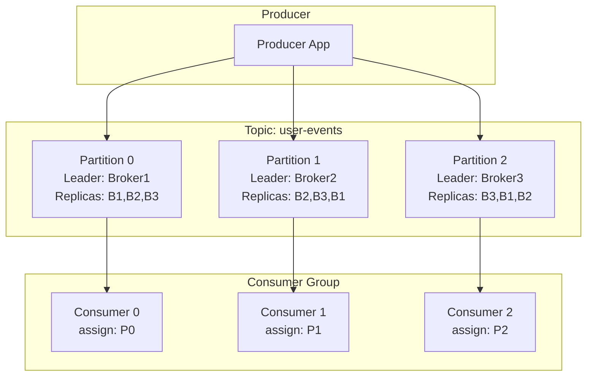
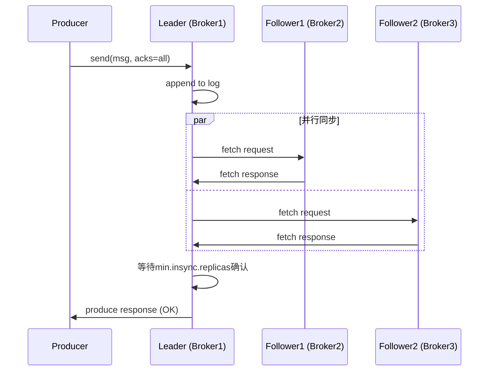
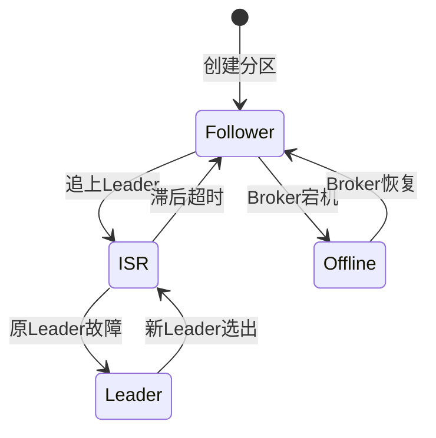
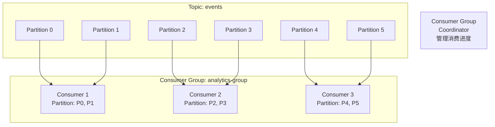
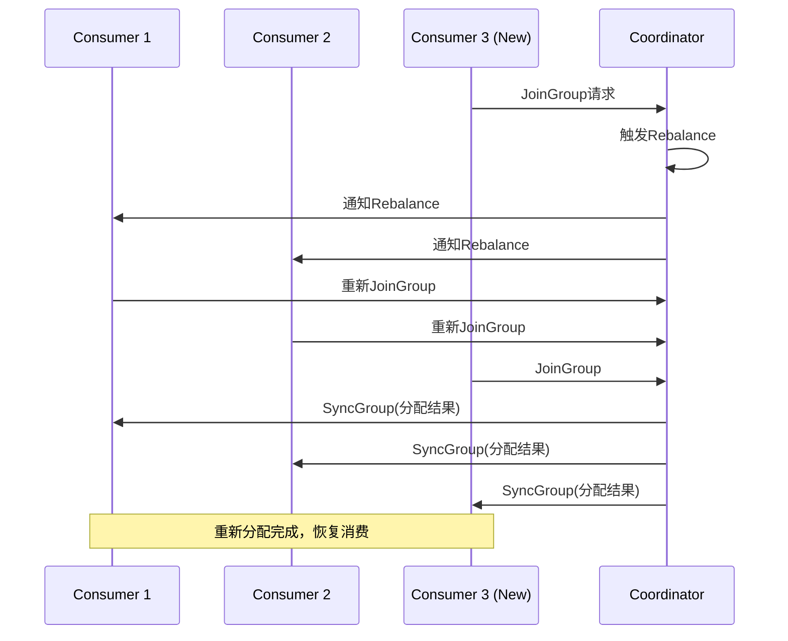
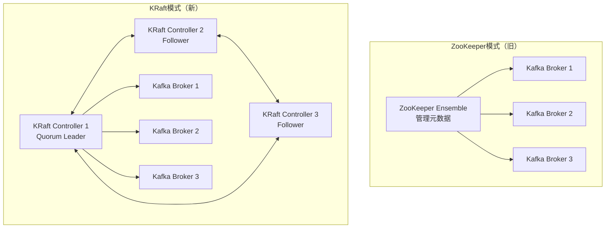

# Kafka架构深度分析

**文档版本**：v1.0
**创建时间**：2026年4月
**最后更新**：2026年4月
**状态**：✅ 已完成

---

## 📋 执行摘要

Apache Kafka是一个分布式流处理平台，以其高吞吐量、低延迟和持久化存储特性成为现代数据管道的核心组件。本文档深入分析Kafka的分区与副本机制、ISR协议、消费者组分配策略，以及KRaft无ZooKeeper架构，为分布式系统设计提供参考。

---

## 一、核心概念

### 1.1 定义与原理

Kafka采用**发布-订阅（Pub-Sub）**模型，将数据组织为**Topic**，每个Topic分为多个**Partition**以实现水平扩展。生产者将消息追加到分区末尾，消费者从分区读取数据，通过**Offset**（位移）追踪消费进度。

**核心设计原则**：
- **顺序写入磁盘**：利用磁盘顺序I/O性能，吞吐量接近内存
- **零拷贝（Zero-Copy）**：通过`sendfile`系统调用减少数据拷贝
- **批量处理**：压缩消息批次，减少网络往返

### 1.2 关键特性

| 特性 | 描述 |
|------|------|
| **高吞吐** | 单机可达百万级消息/秒 |
| **持久化** | 数据持久化到磁盘，支持多副本冗余 |
| **水平扩展** | 通过增加Broker和Partition线性扩展 |
| **流处理** | 内置Kafka Streams和Kafka Connect |
| **生态丰富** | 与Spark、Flink、Storm等深度集成 |

### 1.3 适用场景

| 场景 | 适用性 | 说明 |
|------|--------|------|
| 日志收集 | ⭐⭐⭐⭐⭐ | ELK栈的核心组件，收集分布式系统日志 |
| 流式处理 | ⭐⭐⭐⭐⭐ | 实时ETL、实时监控、事件驱动架构 |
| 消息系统 | ⭐⭐⭐⭐ | 替代传统MQ，适合高吞吐场景 |
| 事件溯源 | ⭐⭐⭐⭐⭐ | 记录系统状态变更事件 |
| 指标监控 | ⭐⭐⭐⭐ | 采集和传输系统指标数据 |

---

## 二、分区（Partition）与副本

### 2.1 分区架构设计



**分区核心机制**：

1. **数据分布**：消息按Key哈希或轮询分配到不同分区
2. **顺序保证**：同一分区内消息严格有序，不同分区无序
3. **并行消费**：分区数决定消费者组的并行度上限

### 2.2 副本机制（Replication）

Kafka通过副本实现高可用，每个分区配置**replication.factor**副本数：

```
┌─────────────────────────────────────────────────────────┐
│                  Topic: orders                          │
├─────────────┬─────────────┬─────────────┬───────────────┤
│   Offset    │  Partition0 │  Partition1 │  Partition2   │
├─────────────┼─────────────┼─────────────┼───────────────┤
│     0       │    msg1     │    msg4     │    msg7       │
│     1       │    msg2     │    msg5     │    msg8       │
│     2       │    msg3     │    msg6     │    msg9       │
├─────────────┼─────────────┼─────────────┼───────────────┤
│   Leader    │   Broker1   │   Broker2   │   Broker3     │
│  Replica1   │   Broker2   │   Broker3   │   Broker1     │
│  Replica2   │   Broker3   │   Broker1   │   Broker2     │
└─────────────┴─────────────┴─────────────┴───────────────┘
```

**副本角色**：

| 角色 | 职责 | 选举条件 |
|------|------|----------|
| **Leader** | 处理所有读写请求 | ISR中选举，优先同步副本 |
| **Follower** | 从Leader拉取数据同步 | 自动同步，可能落后 |
| **Observer** | 只读副本，不参与选举 | 扩展读能力，不投票 |

### 2.3 数据同步流程



**关键配置参数**：

```properties
# 副本相关配置
replication.factor=3              # 副本数
min.insync.replicas=2             # 最小同步副本数
unclean.leader.election.enable=false  # 禁止非同步副本当选Leader

# 生产者确认级别
acks=all                          # 等待所有ISR副本确认
```

---

## 三、ISR（In-Sync Replicas）机制

### 3.1 ISR定义与作用

**ISR（In-Sync Replicas）** 是与Leader保持同步的副本集合，只有ISR中的副本有资格参与Leader选举。

**ISR动态维护**：
- 副本进入ISR：Follower落后Leader不超过`replica.lag.time.max.ms`（默认10秒）
- 副本踢出ISR：Follower同步滞后或失联超过阈值



### 3.2 HW与LEO机制

```
┌────────────────────────────────────────────────────────────┐
│                    Partition: orders-0                     │
├────────────────────────────────────────────────────────────┤
│  Offset:  0   1   2   3   4   5   6   7   8   9   10      │
│  Leader: [M0][M1][M2][M3][M4][M5][M6]                     │
│           ↑                  ↑        ↑                    │
│          HW(5)              LEO(7)   待写入               │
├────────────────────────────────────────────────────────────┤
│  Replica1:[M0][M1][M2][M3][M4][M5]←同步中                 │
│           ↑              ↑                                 │
│          HW(5)          LEO(6)                            │
├────────────────────────────────────────────────────────────┤
│  Replica2:[M0][M1][M2][M3][M4]←滞后                       │
│           ↑      ↑                                         │
│          HW(5)  LEO(5)                                    │
└────────────────────────────────────────────────────────────┘
```

**关键概念**：

| 概念 | 全称 | 定义 |
|------|------|------|
| **LEO** | Log End Offset | 副本最后一条消息的偏移量+1 |
| **HW** | High Watermark | ISR中最小的LEO，消费者可见的最大偏移 |
| **AR** | Assigned Replicas | 该分区的所有副本集合 |
| **OSR** | Out-of-Sync Replicas | 落后副本，不在ISR中 |

**数据可见性保证**：
- 消费者只能读取到 **HW** 之前的消息
- 已提交消息（HW之前）不会丢失（只要ISR中有一个存活副本）
- 未提交消息（HW之后）可能丢失

### 3.3 Leader选举与故障恢复

**选举流程**：

1. **Controller检测**：Controller监控Broker健康状态
2. **ISR判断**：优先从ISR中选择新Leader
3. **数据一致性**：新Leader的LEO成为新的HW
4. **副本同步**：其他副本截断到HW后重新同步

```java
// 伪代码：Leader选举逻辑
public void electLeader(Partition partition) {
    List<Replica> isr = partition.getISR();
    if (isr.isEmpty()) {
        if (uncleanLeaderElectionEnabled) {
            // 危险：从所有副本选举，可能丢数据
            isr = partition.getAllReplicas();
        } else {
            throw new NoReplicaOnlineException();
        }
    }
    
    // 选择最"新"的副本作为Leader
    Replica newLeader = isr.stream()
        .max(Comparator.comparing(Replica::getLogEndOffset))
        .orElseThrow();
    
    partition.setLeader(newLeader);
}
```

---

## 四、消费者组与分区分配

### 4.1 消费者组架构



**消费者组核心机制**：

- **Group Coordinator**：Broker端协调者，管理消费者组成员
- **__consumer_offsets**：内置Topic，存储消费位移
- **Rebalance**：消费者变动时重新分配分区

### 4.2 分区分配策略

Kafka提供5种分区分配策略：

| 策略 | 适用场景 | 特点 |
|------|----------|------|
| **Range** | 默认策略 | 按Topic范围分配，可能不均 |
| **RoundRobin** | 消费者性能相近 | 轮询分配，最均匀 |
| **Sticky** | 减少Rebalance开销 | 尽量保持现有分配 |
| **CooperativeSticky** | Kafka 2.4+推荐 | 渐进式Rebalance |
| **PartitionAssignor** | 自定义需求 | 实现自定义逻辑 |

**Range分配示例**：

```
Topic: T1 (P0, P1, P2), T2 (P0, P1, P2)
Consumers: C1, C2

分配结果：
- C1: T1-P0, T1-P1, T2-P0, T2-P1
- C2: T1-P2, T2-P2

问题：分区数不能整除消费者数时，分配不均
```

**RoundRobin分配示例**：

```
Partitions: P0, P1, P2, P3, P4, P5
Consumers: C1, C2, C3

分配结果：
- C1: P0, P3
- C2: P1, P4
- C3: P2, P5

优点：绝对均匀
缺点：消费者订阅不同Topic时复杂
```

### 4.3 Rebalance机制



**Rebalance触发条件**：
- 新消费者加入组
- 消费者主动离开组
- 消费者心跳超时（被认为死亡）
- 消费者提交位移超时
- 订阅Topic的分区数变化

**Rebalance优化建议**：

```java
// 避免不必要的Rebalance
properties.put("session.timeout.ms", 10000);        // 会话超时
properties.put("heartbeat.interval.ms", 3000);      // 心跳间隔（< 1/3 session.timeout）
properties.put("max.poll.interval.ms", 300000);     // 最大poll间隔

// 使用Cooperative Rebalance
properties.put("partition.assignment.strategy", 
    "org.apache.kafka.clients.consumer.CooperativeStickyAssignor");
```

### 4.4 位移提交机制

**提交模式对比**：

| 模式 | 配置 | 特点 | 风险 |
|------|------|------|------|
| 自动提交 | `enable.auto.commit=true` | 定期自动提交 | 可能重复消费或丢失 |
| 同步提交 | `commitSync()` | 阻塞直到成功 | 吞吐量降低 |
| 异步提交 | `commitAsync()` | 非阻塞，高性能 | 可能提交失败 |
| 精确提交 | 事务或手动 | 处理完一条提交 | 实现复杂 |

**精确一次性消费**：

```java
// Kafka 0.11+ 支持事务
producer.initTransactions();

try {
    producer.beginTransaction();
    
    for (ConsumerRecord<String, String> record : records) {
        // 处理消息
        process(record);
        
        // 发送输出到目标Topic
        producer.send(new ProducerRecord<>("output", record.value()));
    }
    
    // 提交消费位移（作为事务的一部分）
    producer.sendOffsetsToTransaction(
        consumer.position(consumer.assignment()),
        consumer.groupMetadata()
    );
    
    producer.commitTransaction();
} catch (Exception e) {
    producer.abortTransaction();
}
```

---

## 五、KRaft模式（无ZooKeeper）

### 5.1 KRaft架构演进



**KRaft核心改进**：

| 方面 | ZooKeeper模式 | KRaft模式 |
|------|---------------|-----------|
| 元数据存储 | 外部ZooKeeper | 内置Raft协议 |
| 部署复杂度 | 需维护两套系统 | 单一Kafka集群 |
| 扩展性 | 受限于ZooKeeper | 可扩展到百万级分区 |
| 故障恢复 | 依赖ZooKeeper选举 | 内置快速选举 |
| 性能瓶颈 | ZK写入成为瓶颈 | 批量元数据写入 |

### 5.2 Raft共识协议

KRaft使用**Raft算法**管理元数据一致性：

```
┌──────────────────────────────────────────────────────────┐
│                 Raft Quorum (3 Controllers)              │
├──────────────────────────────────────────────────────────┤
│                                                          │
│   ┌──────────┐      ┌──────────┐      ┌──────────┐     │
│   │ Controller1 │◄──►│ Controller2 │◄──►│ Controller3 │     │
│   │  (Leader)   │      │  (Follower) │      │  (Follower) │     │
│   └────┬─────┘      └──────────┘      └──────────┘     │
│        │                                                 │
│        │ 复制日志                                         │
│        ▼                                                 │
│   ┌──────────┐                                          │
│   │  Metadata Log                                        │
│   │  - Topic创建                                         │
│   │  - Partition分配                                     │
│   │  - ISR变更                                           │
│   │  - Config更新                                        │
│   └──────────┘                                          │
└──────────────────────────────────────────────────────────┘
```

**Raft关键概念**：

| 概念 | 说明 |
|------|------|
| **Term** | 任期，每轮选举递增 |
| **Leader** | 处理所有客户端请求，复制日志到Follower |
| **Follower** | 接收并持久化Leader的日志条目 |
| **Candidate** | 选举期间的角色，争取成为Leader |
| **Commit Index** | 已提交的最大日志索引 |

**元数据日志**：

```
Log Offset | Record Type        | Content
-----------+--------------------+--------------------------------
0          | KRaftVersion       | version=0
1          | RegisterBroker     | brokerId=1, host=broker1:9092
2          | CreateTopic        | topic=orders, partitions=3
3          | PartitionChange    | partition=orders-0, leader=1, isr=[1,2]
4          | CreateTopic        | topic=payments, partitions=6
5          | BrokerRegistration | brokerId=2, host=broker2:9092
...        | ...                | ...
```

### 5.3 KRaft部署配置

```properties
# server.properties - KRaft模式配置

# 节点角色
process.roles=broker,controller
node.id=1

# Controller Quorum
controller.quorum.voters=1@localhost:9093,2@localhost:9093,3@localhost:9093

# 监听配置
listeners=PLAINTEXT://:9092,CONTROLLER://:9093
listener.security.protocol.map=CONTROLLER:PLAINTEXT,PLAINTEXT:PLAINTEXT
inter.broker.listener.name=PLAINTEXT
controller.listener.names=CONTROLLER

# 日志目录
log.dirs=/tmp/kraft-logs

# 自动生成集群ID（首次部署）
# kafka-storage.sh random-uuid
# kafka-storage.sh format -t <uuid> -c server.properties
```

---

## 六、与RabbitMQ/RocketMQ对比

### 6.1 架构对比矩阵

| 维度 | Kafka | RabbitMQ | RocketMQ |
|------|-------|----------|----------|
| **架构模型** | 日志存储（Pull） | 队列路由（Push） | 队列存储（Pull） |
| **开发语言** | Scala/Java | Erlang | Java |
| **一致性协议** | ISR + Raft(KRaft) | 镜像队列 | 主从同步 |
| **消息持久化** | 磁盘顺序写 | 内存+磁盘 | 磁盘顺序写 |
| **消息追溯** | 支持（Offset回溯） | 有限支持 | 支持（时间戳） |
| **消息过滤** | 客户端过滤 | Broker端路由 | 服务端Tag过滤 |
| **延迟消息** | 不支持（需外部实现） | 支持 | 支持（18级延迟） |
| **事务消息** | 支持 | 支持 | 支持 |
| **消息顺序** | 分区有序 | 队列有序 | 队列有序 |
| **死信队列** | 不支持 | 支持 | 支持 |

### 6.2 性能对比

| 指标 | Kafka | RabbitMQ | RocketMQ |
|------|-------|----------|----------|
| **单机吞吐量** | 100万+ TPS | 5-10万 TPS | 10万+ TPS |
| **消息延迟** | 毫秒级（ms） | 微秒级（μs） | 毫秒级（ms） |
| **消息堆积能力** | 极强（磁盘存储） | 一般（内存限制） | 强（磁盘存储） |
| **水平扩展** | 优秀（加Broker） | 一般（加节点复杂） | 优秀 |
| **社区活跃度** | 极高 | 高 | 高（阿里主导） |

### 6.3 选型决策树

```
业务需求分析
│
├─ 实时流处理/大数据管道？
│  ├─ 是 → Kafka（高吞吐、日志存储、流处理生态）
│  └─ 否 → 继续
│
├─ 复杂路由/企业级消息？
│  ├─ 是 → RabbitMQ（AMQP、灵活路由、低延迟）
│  └─ 否 → 继续
│
├─ 金融级可靠/事务消息？
│  ├─ 是 → RocketMQ（事务、延迟、顺序消息）
│  └─ 否 → 继续
│
└─ 云原生/多租户？
   ├─ 是 → Apache Pulsar（分层存储、多租户）
   └─ 否 → 根据团队熟悉度选择
```

### 6.4 适用场景详细对比

**选择Kafka的场景**：
- 日志收集与聚合（ELK栈）
- 事件溯源与CQRS
- 流式ETL与实时分析
- 高吞吐消息缓冲（>10万TPS）
- 需要消息回溯消费

**选择RabbitMQ的场景**：
- 复杂消息路由（Topic、Direct、Fanout）
- 微服务异步通信
- 需要延迟消息和优先级队列
- 对延迟敏感（<1ms）
- 需要死信队列和消息TTL

**选择RocketMQ的场景**：
- 金融级事务消息
- 定时/延迟消息（18级）
- 严格顺序消息
- 阿里云生态集成

---

## 七、实践指南

### 7.1 部署配置

**生产环境推荐配置**：

```properties
# broker.properties - 生产环境配置

# ========== 网络配置 ==========
num.network.threads=8
num.io.threads=16
socket.send.buffer.bytes=102400
socket.receive.buffer.bytes=102400
socket.request.max.bytes=104857600

# ========== 日志配置 ==========
num.partitions=12
default.replication.factor=3
min.insync.replicas=2
log.retention.hours=168
log.segment.bytes=1073741824
log.retention.check.interval.ms=300000

# ========== 复制配置 ==========
replica.socket.timeout.ms=30000
replica.socket.receive.buffer.bytes=65536
replica.fetch.max.bytes=52428800

# ========== 事务配置 ==========
transaction.state.log.replication.factor=3
transaction.state.log.min.isr=2
transaction.state.log.num.partitions=50
```

### 7.2 最佳实践

**1. Topic设计原则**

```
分区数计算：
分区数 = max(期望吞吐量/单分区吞吐量, 消费者数)

建议：
- 分区数设为Broker数的倍数
- 单个Topic分区数不超过200（避免元数据膨胀）
- 集群总分区数不超过10万（KRaft可支持百万）
```

**2. 生产者优化**

```java
Properties props = new Properties();
// 批量发送
props.put("batch.size", 16384);           // 16KB批量
props.put("linger.ms", 5);                // 最多等待5ms
props.put("compression.type", "lz4");     // 压缩算法

// 可靠性配置
props.put("acks", "all");
props.put("retries", 3);
props.put("enable.idempotence", "true");  // 幂等生产者
props.put("max.in.flight.requests", 5);   // 允许5个未确认请求
```

**3. 消费者优化**

```java
Properties props = new Properties();
// 拉取优化
props.put("fetch.min.bytes", 1);
props.put("fetch.max.bytes", 52428800);   // 50MB
props.put("fetch.max.wait.ms", 500);

// 并行处理
props.put("max.poll.records", 500);       // 单次poll最大记录数

// 位移提交策略
props.put("enable.auto.commit", "false"); // 手动提交更可控
```

### 7.3 常见问题

**Q1: 如何保证消息不丢失？**

A: 三层次保证：
- **生产者**：`acks=all` + `enable.idempotence=true` + 失败重试
- **Broker**：`replication.factor=3` + `min.insync.replicas=2` + `unclean.leader.election=false`
- **消费者**：处理完成后再提交位移 + 幂等消费设计

**Q2: 如何解决Rebalance频繁问题？**

A: 
1. 增加`session.timeout.ms`和`heartbeat.interval.ms`
2. 减少单批次处理时间（`max.poll.records`）
3. 使用`CooperativeStickyAssignor`策略
4. 避免消费者频繁启停

**Q3: Kafka能否替代传统数据库？**

A: Kafka是消息队列/流平台，不是数据库：
- ✅ 适合：日志存储、事件流、消息缓冲
- ❌ 不适合：复杂查询、随机读、事务性更新
- 💡 可结合：Kafka + 数据库（CDC模式）

**Q4: KRaft模式何时使用？**

A: 推荐场景：
- 新集群部署（Kafka 3.0+）
- 大规模集群（>1000分区）
- 简化运维（去除ZooKeeper依赖）
- ⚠️ 注意：Kafka 3.3+ KRaft才GA（生产可用）

---

## 八、与其他主题的关联

### 8.1 上游依赖

- [CAP理论与一致性模型](../../01-fundamentals/distributed-systems/cap-theorem.md)
- [Raft共识算法](../../01-fundamentals/consensus/raft.md)
- [分布式事务](../../02-architecture/distributed-transaction.md)

### 8.2 下游应用

- [流处理引擎（Flink/Spark）](../stream-processing/flink-architecture.md)
- [事件驱动架构](../../02-architecture/event-driven-architecture.md)
- [CDC数据同步](../../04-data-pipeline/cdc-patterns.md)

### 8.3 相关概念

| 概念 | 关系 | 说明 |
|------|------|------|
| ZooKeeper | 替代 | KRaft模式取代ZK管理元数据 |
| Pulsar | 对比 | 云原生消息队列，分层存储 |
| Redis Stream | 轻量替代 | 简单场景可用Redis实现 |

---

## 九、参考资源

### 9.1 官方文档

1. [Apache Kafka官方文档](https://kafka.apache.org/documentation/) - 最权威参考
2. [Kafka Improvement Proposals (KIP)](https://cwiki.apache.org/confluence/display/KAFKA/Kafka+Improvement+Proposals) - 设计提案

### 9.2 经典论文

1. [Kafka: a Distributed Messaging System for Log Processing](https://docs.google.com/document/d/1KD8E7fU6XhVdNfD6v5s8y8-8w8w8w8w/edit) - LinkedIn原始论文
2. [The Log: What every software engineer should know](https://engineering.linkedin.com/distributed-systems/log-what-every-software-engineer-should-know-about-real-time-datas-unifying) - Jay Kreps经典文章

### 9.3 开源项目

1. [Confluent Platform](https://www.confluent.io/) - Kafka商业发行版
2. [Strimzi](https://strimzi.io/) - Kubernetes上的Kafka
3. [Kafdrop](https://github.com/obsidiandynamics/kafdrop) - Kafka管理UI

### 9.4 学习资料

1. 《Kafka权威指南》 - Neha Narkhede等
2. 《深入理解Kafka：核心设计与实践原理》 - 朱忠华
3. [Kafka Summit](https://kafkasummit.org/) - 年度技术大会

---

**维护者**：分布式计算工作流项目团队
**最后更新**：2026年4月
