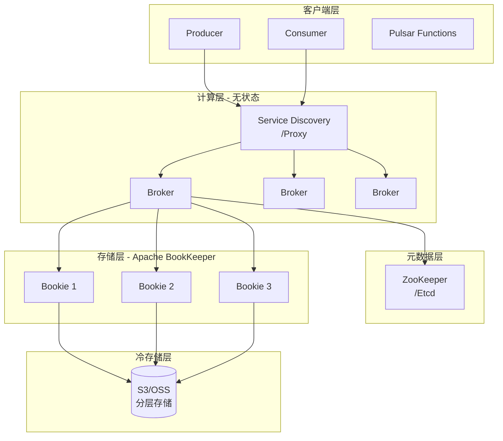
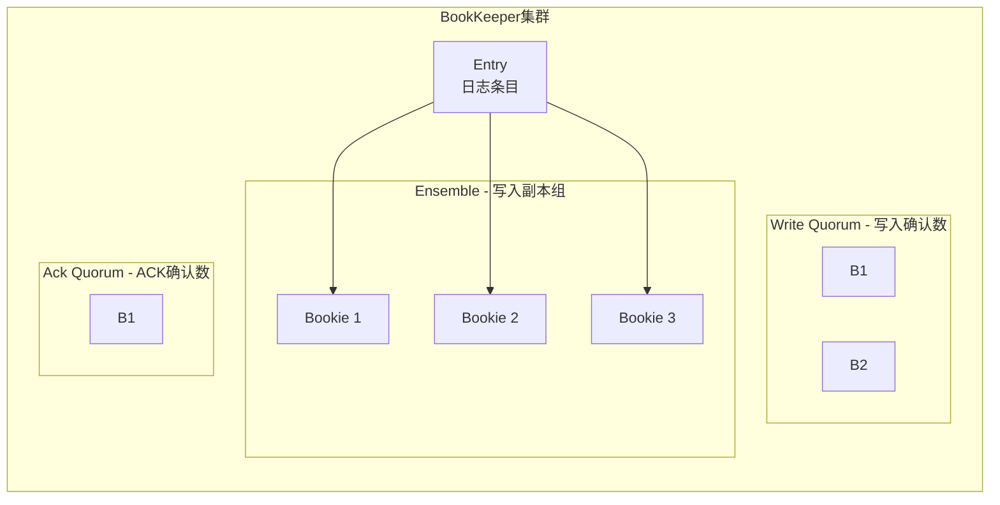
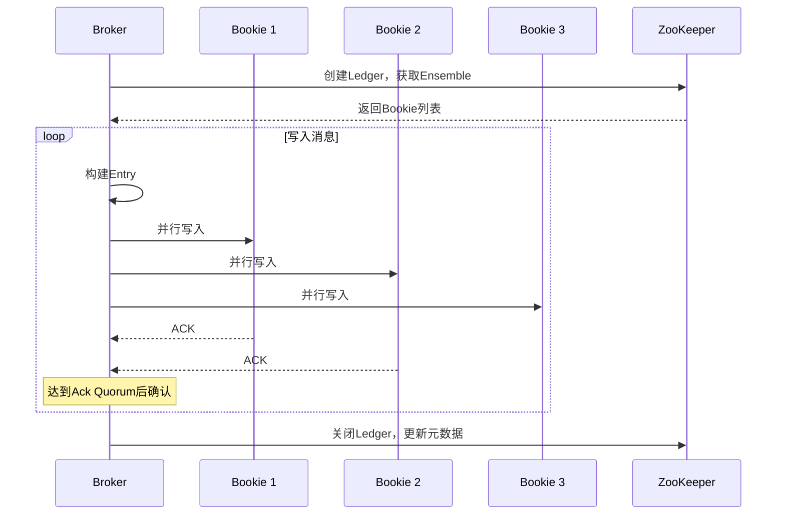
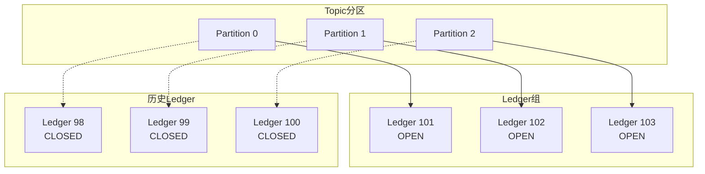

# Pulsar 架构深度分析

**文档版本**：v1.0
**创建时间**：2026年
**最后更新**：2026年
**状态**：✅ 已完成

---

## 📋 执行摘要

Apache Pulsar是Yahoo开源的云原生分布式消息流平台，采用计算存储分离架构，基于Apache BookKeeper提供持久化存储，支持多租户、多地域复制和流批一体处理，是新一代消息队列的代表。

---

## 一、核心概念

### 1.1 定义与原理

Apache Pulsar是一个企业级的分布式消息系统，最初由Yahoo开发，2016年开源，2018年成为Apache顶级项目。其核心理念是**计算存储分离**，通过分层架构实现独立扩展和高可用。

**核心设计哲学**：
- **计算存储分离**：Broker无状态处理消息，BookKeeper持久化存储
- **多租户架构**：原生支持命名空间隔离和配额管理
- **统一消息模型**：支持队列（Queue）和流（Stream）两种语义
- **地理复制**：内置跨地域数据复制能力
- **分层存储**：热数据SSD、温数据HDD、冷数据S3

### 1.2 关键特性

| 特性 | 描述 |
|------|------|
| **计算存储分离** | Broker无状态，可快速扩缩容 |
| **多租户** | 原生支持租户隔离、配额限流 |
| **统一语义** | 同时支持队列（竞争消费）和流（独占消费） |
| **地理复制** | 跨机房/跨云异步复制 |
| **分层存储** | 自动冷热数据分层，降低成本 |
| **Function** | 内置轻量级流处理引擎 |
| **Schema管理** | 内置Avro/JSON/Protobuf Schema |
| **多协议** | 支持Pulsar协议、Kafka协议、AMQP |

### 1.3 适用场景

| 场景 | 适用性 | 说明 |
|------|--------|------|
| 云原生消息 | ⭐⭐⭐⭐⭐ | K8s原生，计算存储分离 |
| 多租户SaaS | ⭐⭐⭐⭐⭐ | 强隔离和配额管理 |
| 全球部署 | ⭐⭐⭐⭐⭐ | 内置Geo-Replication |
| 流批一体 | ⭐⭐⭐⭐ | Pulsar + Flink整合 |
| 海量存储 | ⭐⭐⭐⭐ | 分层存储降低成本 |
| 简单场景 | ⭐⭐ | 架构较重，适合中大规模 |

---

## 二、技术细节

### 2.1 分层架构设计



**架构优势**：
| 优势 | 说明 |
|------|------|
| **独立扩展** | 计算和存储可独立扩缩容 |
| **快速恢复** | Broker故障秒级切换，无数据迁移 |
| **弹性伸缩** | K8s环境下完美适配HPA |
| **成本优化** | 存储层可使用廉价硬件 |

### 2.2 Broker详解

**核心职责**：
```
┌─────────────────────────────────────────────────────┐
│                    Pulsar Broker                    │
├─────────────────────────────────────────────────────┤
│  ┌─────────────┐  ┌─────────────┐  ┌─────────────┐ │
│  │ 协议处理器   │  │  消息路由    │  │  订阅管理   │ │
│  │ ·Pulsar协议 │  │             │  │ ·游标管理   │ │
│  │ ·Kafka协议  │  │             │  │ ·ACK处理    │ │ │
│  │ ·AMQP       │  │             │  │             │ │
│  └─────────────┘  └─────────────┘  └─────────────┘ │
│  ┌─────────────┐  ┌─────────────┐  ┌─────────────┐ │
│  │ 缓存管理    │  │  限流控制    │  │  监控统计   │ │
│  │ ·读缓存     │  │ ·配额管理    │  │ ·Metrics    │ │
│  │ ·写缓存     │  │ ·流量整形    │  │ ·审计日志   │ │
│  └─────────────┘  └─────────────┘  └─────────────┘ │
└─────────────────────────────────────────────────────┘
```

**无状态设计**：
- 不存储任何持久化数据
- 所有元数据在ZooKeeper
- 所有消息数据在BookKeeper
- 故障时快速在其他节点重建

### 2.3 BookKeeper存储层

#### BookKeeper架构



**核心概念**：
| 概念 | 说明 | 默认值 |
|------|------|--------|
| **Ensemble** | 写入副本组大小 | 3 |
| **Write Quorum** | 同步写入的Bookie数 | 2 |
| **Ack Quorum** | 需要ACK的Bookie数 | 2 |

#### Ledger与Entry

```
┌─────────────────────────────────────────────────────┐
│                   Ledger结构                        │
├─────────────────────────────────────────────────────┤
│                                                     │
│  Ledger ID: 12345                                   │
│  ┌───────────────────────────────────────────────┐ │
│  │ Entry 0 │ Entry 1 │ Entry 2 │ ... │ Entry N   │ │
│  │ [data]  │ [data]  │ [data]  │     │ [data]    │ │
│  └───────────────────────────────────────────────┘ │
│                                                     │
│  元数据存储在ZooKeeper:                             │
│  - 创建时间                                         │
│  - 状态(OPEN/CLOSED)                                │
│  - Ensemble列表                                     │
│  - 最后EntryID                                      │
│                                                     │
└─────────────────────────────────────────────────────┘
```

#### 数据写入流程



**写入优势**：
- 并行写入多个Bookie
- 部分Bookie故障不影响写入
- 自动故障检测和恢复
- 强一致性保证

### 2.4 Topic与分区模型

#### Topic层级结构

```
┌─────────────────────────────────────────────────────┐
│              Pulsar命名空间层次                      │
├─────────────────────────────────────────────────────┤
│                                                     │
│  Tenant（租户）                                      │
│  └── Namespace（命名空间）                           │
│      ├── Topic-A                                     │
│      │   ├── Partition-0 ──> Ledger-1001            │
│      │   ├── Partition-1 ──> Ledger-1002            │
│      │   └── Partition-2 ──> Ledger-1003            │
│      ├── Topic-B                                     │
│      └── Topic-C                                     │
│                                                     │
└─────────────────────────────────────────────────────┘
```

**分层优势**：
| 层级 | 功能 |
|------|------|
| **Tenant** | 权限控制、认证授权、集群隔离 |
| **Namespace** | 配额管理、策略配置、Geo-Replication |
| **Topic** | 消息发布订阅的基本单元 |
| **Partition** | 水平扩展单元，映射到Ledger |

#### 分区与Ledger映射



### 2.5 多租户架构

#### 租户隔离模型

```
┌─────────────────────────────────────────────────────┐
│                  Pulsar多租户                        │
├─────────────────────────────────────────────────────┤
│                                                     │
│  ┌───────────────────────────────────────────────┐ │
│  │  Tenant A: 电商平台                            │ │
│  │  ├── Namespace: order-service                  │ │
│  │  ├── Namespace: payment-service                │ │
│  │  └── Namespace: inventory-service              │ │
│  └───────────────────────────────────────────────┘ │
│                                                     │
│  ┌───────────────────────────────────────────────┐ │
│  │  Tenant B: 金融系统                            │ │
│  │  ├── Namespace: trading-engine                 │ │
│  │  └── Namespace: risk-management                │ │
│  └───────────────────────────────────────────────┘ │
│                                                     │
│  ┌───────────────────────────────────────────────┐ │
│  │  Tenant C: 物联网平台                          │ │
│  │  └── Namespace: device-data                    │ │
│  └───────────────────────────────────────────────┘ │
│                                                     │
└─────────────────────────────────────────────────────┘
```

**租户级配额**：
| 配额类型 | 说明 |
|----------|------|
| **消息速率** | 每秒发布/消费消息数上限 |
| **带宽限制** | 每秒字节数上限 |
| **存储配额** | 命名空间存储空间上限 |
| **Topic数量** | 命名空间Topic数量上限 |

### 2.6 分层存储

#### 冷热数据分层

```
┌─────────────────────────────────────────────────────┐
│                  分层存储架构                        │
├─────────────────────────────────────────────────────┤
│                                                     │
│  热数据层 (Hot)                                      │
│  ├── Broker读缓存                                    │
│  └── BookKeeper SSD存储                              │
│  访问延迟: <1ms                                      │
│                                                     │
│  温数据层 (Warm)                                     │
│  └── BookKeeper HDD存储                              │
│  访问延迟: <10ms                                     │
│                                                     │
│  冷数据层 (Cold)                                     │
│  └── S3 / GCS / OSS                                  │
│  访问延迟: 100ms+                                    │
│                                                     │
│  自动迁移策略:                                       │
│  - 热→温: 24小时后                                   │
│  - 温→冷: 7天后                                      │
│                                                     │
└─────────────────────────────────────────────────────┘
```

**分层配置**：
```properties
# broker.conf
managedLedgerOffloadDriver=S3
s3ManagedLedgerOffloadBucket=pulsar-offload
managedLedgerOffloadThresholdInBytes=100M
managedLedgerOffloadDeletionLagMs=86400000
```

---

## 三、系统对比

### 3.1 Pulsar vs Kafka

| 维度 | Pulsar | Kafka |
|------|--------|-------|
| **架构** | 计算存储分离 | 计算存储耦合 |
| **依赖** | ZooKeeper + BookKeeper | ZooKeeper/KRaft |
| **多租户** | 原生支持 | 需外部实现 |
| **分区迁移** | 无需迁移（Broker无状态） | 需要数据重新平衡 |
| **地理复制** | 内置支持 | MirrorMaker外部实现 |
| **分层存储** | 内置支持 | 需外部方案 |
| **消费模型** | 统一队列+流 | 主要是流模型 |
| **Schema** | 内置Schema Registry | 需Confluent Schema Registry |
| **Function** | 内置Pulsar Functions | 需Kafka Streams/KSQL |
| **生态成熟度** | 相对年轻 | 非常成熟 |
| **性能** | 高吞吐、低延迟 | 极高吞吐 |
| **运维复杂度** | 较高（多组件） | 中等 |

### 3.2 选型决策树

```
消息系统选型
├── 需要云原生/容器化部署？
│   ├── 是 → 继续判断
│   └── 否 → 考虑Kafka/RocketMQ
├── 需要多租户强隔离？
│   ├── 是 → Pulsar
│   └── 否 → 继续判断
├── 需要跨地域复制？
│   ├── 是 → Pulsar优先
│   └── 否 → 继续判断
├── 需要分层存储降成本？
│   ├── 是 → Pulsar
│   └── 否 → 继续判断
├── 需要快速扩缩容？
│   ├── 是 → Pulsar（无状态Broker）
│   └── 否 → 继续判断
├── 已有Kafka生态深度集成？
│   ├── 是 → Kafka
│   └── 否 → 根据团队能力选择
└── 运维能力较强？
    ├── 是 → Pulsar（架构收益高）
    └── 否 → Kafka（运维更简单）
```

### 3.3 性能基准

| 指标 | Pulsar 2.x | Kafka 3.x | 测试条件 |
|------|-----------|-----------|----------|
| 单Topic吞吐 | 50万TPS | 100万TPS | 3副本，批量发送 |
| 端到端延迟 | 5-20ms | 5-15ms | 无积压场景 |
| 分区重新平衡 | 秒级 | 分钟级 | 添加Broker |
| 故障恢复 | <3秒 | 10-30秒 | Broker宕机 |
| 水平扩展 | 线性 | 接近线性 | 增加Broker |

---

## 四、实践指南

### 4.1 部署配置

**broker.conf核心配置**：
```properties
# ZooKeeper地址
zookeeperServers=zk1:2181,zk2:2181,zk3:2181

# BookKeeper地址
bookkeeperMetadataServiceUri=zk+hierarchical://zk1:2181/ledgers

# 集群名称
clusterName=pulsar-cluster-1

# 消息保留策略
defaultRetentionTimeInMinutes=4320  # 3天
defaultRetentionSizeInMB=10240      # 10GB

# 分层存储
managedLedgerOffloadDriver=S3
s3ManagedLedgerOffloadBucket=pulsar-data
```

**bookkeeper.conf核心配置**：
```properties
# 存储目录
journalDirectories=/data/bk/journal
ledgerDirectories=/data/bk/ledgers

# Journal配置
journalSyncData=true
journalMaxSizeMB=2048

# 写入策略
writeQuorumSize=2
ackQuorumSize=2
ensembleSize=3
```

### 4.2 最佳实践

1. **容量规划**
   - Bookie磁盘预留20%空间
   - 每Bookie配置多块磁盘提升吞吐
   - Journal使用SSD，Ledger可使用HDD

2. **Topic设计**
   - 分区数 = max(预期吞吐/单分区吞吐, 消费者数)
   - 单Topic分区数建议<100
   - 合理设置命名空间配额

3. **消费模式选择**
   - Exclusive：需要严格顺序时使用
   - Failover：主备消费场景
   - Shared：高吞吐竞争消费场景
   - Key_Shared：按Key保序的竞争消费

4. **监控告警**
   - BookKeeper磁盘使用率
   - ZooKeeper连接数
   - 消息堆积和消费延迟

### 4.3 常见问题

**Q1: Pulsar相比Kafka有什么优势？**
A: 主要优势在于计算存储分离带来的弹性扩缩容、原生多租户支持、内置地理复制和分层存储。适合云原生环境和多租户场景。

**Q2: BookKeeper写入性能如何优化？**
A: 
- Journal使用独立SSD
- 增加writeQuorumSize提高并行度
- 批量写入减少网络往返
- 合理设置journalMaxSizeMB

**Q3: 消费堆积如何处理？**
A: 
- 扩容Consumer实例
- 使用Shared订阅模式
- 检查消费逻辑是否有阻塞
- 考虑增加分区数

**Q4: Pulsar Functions与Flink如何选择？**
A: Pulsar Functions适合简单ETL和轻量级处理，Flink适合复杂流计算。两者可以结合使用。

---

## 五、形式化分析

### 5.1 一致性模型

**BookKeeper一致性保证**：
```
写入保证：
- 写入W个副本后才返回成功
- 收到A个ACK即确认写入（A ≤ W）
- 保证数据在Ensemble中持久化

读取保证：
- 从任意Bookie读取
- 自动检测数据损坏（CRC校验）
- 坏块自动从其他副本恢复
```

### 5.2 复杂度分析

| 操作 | 时间复杂度 | 说明 |
|------|-----------|------|
| 消息发送 | O(1) | 顺序追加 |
| 消息消费 | O(1) | 游标顺序读取 |
| 创建Topic | O(1) | 元数据操作 |
| 扩容Broker | O(1) | 无状态，无需数据迁移 |
| 扩容Bookie | O(n) | 需要数据再平衡 |

---

## 六、与其他主题的关联

### 6.1 上游依赖

- [Kafka架构](./Kafka架构.md)
- [RocketMQ深度分析](./RocketMQ深度分析.md)
- [消息模式与设计](./消息模式与设计.md)

### 6.2 下游应用

- [实时数仓架构](../../06-computing/stream/实时数仓架构.md)
- [流处理引擎](../../06-computing/stream/Flink架构.md)

### 6.3 相关概念

| 概念 | 关系 | 说明 |
|------|------|------|
| BookKeeper | 依赖 | Pulsar的存储层基础 |
| 分层存储 | 扩展 | 冷热数据自动分层 |
| 多租户 | 原生 | Pulsar的核心设计 |
| Function | 扩展 | 轻量级流处理能力 |

---

## 七、参考资源

### 7.1 官方资源

1. [Apache Pulsar官网](https://pulsar.apache.org/) - 官方文档
2. [Pulsar GitHub](https://github.com/apache/pulsar) - 源码仓库
3. [Pulsar文档](https://pulsar.apache.org/docs/) - 完整文档

### 7.2 技术博客

1. [Pulsar架构设计](https://pulsar.apache.org/docs/concepts-architecture-overview/) - 官方架构文档
2. [Pulsar vs Kafka](https://streamnative.io/blog/comparing-pulsar-and-kafka/) - StreamNative对比

### 7.3 学习资料

1. [Pulsar in Action](https://www.manning.com/books/pulsar-in-action) - 书籍
2. [StreamNative Academy](https://streamnative.io/academy/) - 官方课程

### 7.4 相关文档

- [Kafka架构](./Kafka架构.md)
- [RocketMQ深度分析](./RocketMQ深度分析.md)
- [消息模式与设计](./消息模式与设计.md)
- [实时数仓架构](../../06-computing/stream/实时数仓架构.md)

---

**维护者**：项目团队
**最后更新**：2026年
