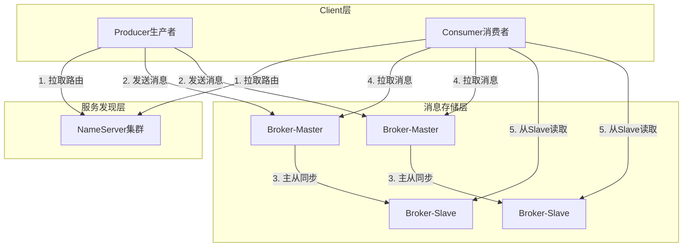
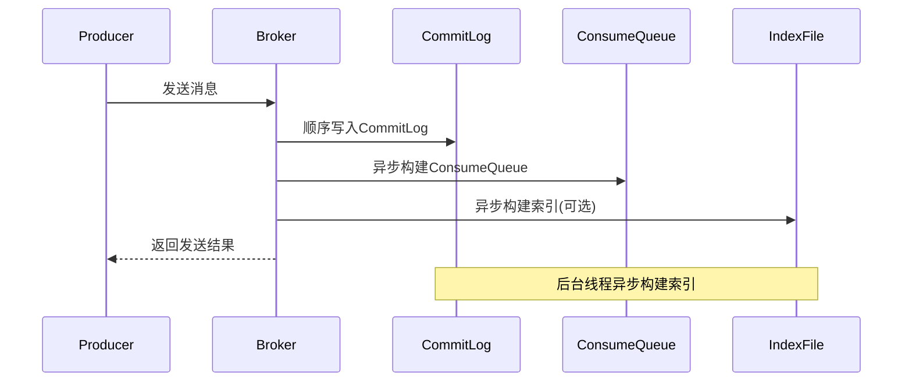

# RocketMQ 深度分析

**文档版本**：v1.0
**创建时间**：2026年
**最后更新**：2026年
**状态**：✅ 已完成

---

## 📋 执行摘要

RocketMQ是阿里巴巴开源的分布式消息中间件，采用NameServer-Broker架构设计，具备低延迟、高性能、高可靠、灵活扩展等特点，广泛应用于互联网企业的异步通信、流量削峰、数据同步等场景。

---

## 一、核心概念

### 1.1 定义与原理

RocketMQ是一款低延迟、高性能、高可靠的分布式消息中间件，基于发布-订阅模式构建。其核心设计目标是提供异步解耦能力和削峰填谷功能，支持万亿级消息堆积和流式数据处理。

**核心设计哲学**：
- **存储计算分离**：NameServer负责服务发现，Broker专注消息存储与转发
- **顺序写盘**：CommitLog顺序写入，最大化磁盘IO性能
- **内存映射**：利用mmap技术加速文件访问
- **主从复制**：支持同步/异步复制，保障数据可靠性

### 1.2 关键特性

| 特性 | 描述 |
|------|------|
| **低延迟** | 单机毫秒级消息投递延迟 |
| **高吞吐** | 单机可达十万级TPS |
| **高可靠** | 支持同步刷盘、同步复制，消息不丢失 |
| **顺序消息** | 支持分区顺序和全局顺序消息 |
| **事务消息** | 实现分布式事务的最终一致性 |
| **延迟消息** | 支持18个级别的延迟投递 |
| **消息回溯** | 支持按时间或位点消费历史消息 |
| **多协议** | 支持TCP、HTTP、MQTT协议 |

### 1.3 适用场景

| 场景 | 适用性 | 说明 |
|------|--------|------|
| 异步解耦 | ⭐⭐⭐⭐⭐ | 系统间异步通信首选 |
| 流量削峰 | ⭐⭐⭐⭐⭐ | 大促场景保护下游系统 |
| 数据同步 | ⭐⭐⭐⭐⭐ | 跨机房/跨云数据复制 |
| 日志收集 | ⭐⭐⭐⭐ | 高吞吐日志采集 |
| 实时计算 | ⭐⭐⭐ | 与Flink等配合进行流处理 |
| IoT消息 | ⭐⭐⭐ | 支持MQTT协议接入 |

---

## 二、技术细节

### 2.1 架构设计



**核心组件说明**：

| 组件 | 职责 | 部署方式 |
|------|------|----------|
| **NameServer** | 服务注册与发现、路由管理 | 无状态集群部署 |
| **Broker** | 消息存储、投递、查询 | 主从架构部署 |
| **Producer** | 消息生产者 | 嵌入式客户端 |
| **Consumer** | 消息消费者 | 嵌入式客户端 |

### 2.2 NameServer详解

**功能定位**：
- 维护Broker的路由信息（Topic到Broker的映射）
- 提供轻量级的服务发现机制
- 无状态设计，可水平扩展

**路由注册流程**：
```
1. Broker启动时向所有NameServer注册
2. 每30秒发送心跳续约
3. NameServer检测120秒未心跳则剔除
4. 客户端每30秒拉取最新路由
```

**与Zookeeper对比**：

| 维度 | NameServer | Zookeeper |
|------|------------|-----------|
| 设计目标 | 简单路由发现 | 强一致性协调 |
| 一致性 | 最终一致 | 强一致 |
| 复杂度 | 极低 | 较高 |
| 性能 | 极高（纯内存） | 较高 |
| 依赖 | 无 | 需要部署ZK集群 |

### 2.3 Broker存储架构

#### CommitLog设计

```
┌─────────────────────────────────────────────────────────────┐
│                     CommitLog结构                           │
├─────────────────────────────────────────────────────────────┤
│  ┌──────────┐  ┌──────────┐  ┌──────────┐  ┌──────────┐    │
│  │Message 1 │  │Message 2 │  │Message 3 │  │   ...    │    │
│  │(offset=0)│  │(offset=n)│  │         │  │          │    │
│  └──────────┘  └──────────┘  └──────────┘  └──────────┘    │
│       ↓              ↓              ↓                        │
│  ┌─────────────────────────────────────────────────────────┐│
│  │              磁盘文件（1GB/个）                          ││
│  └─────────────────────────────────────────────────────────┘│
└─────────────────────────────────────────────────────────────┘
```

**CommitLog特点**：
- 顺序追加写，性能接近内存
- 单文件大小默认1GB，写满滚动
- 所有Topic消息混合存储
- 使用mmap+write或FileChannel写入

#### ConsumeQueue设计

```
┌─────────────────────────────────────────────────────┐
│              ConsumeQueue索引结构                   │
├─────────────────────────────────────────────────────┤
│  TopicA/Queue0/                                     │
│  ┌─────────────────────────────────────────────────┐│
│  │ CommitLogOffset(8B) │ Size(4B) │ TagHash(8B)   ││
│  ├─────────────────────────────────────────────────┤│
│  │       0             │   100    │    0x1234     ││
│  │      100            │   150    │    0x5678     ││
│  │      250            │   200    │    0x9ABC     ││
│  └─────────────────────────────────────────────────┘│
└─────────────────────────────────────────────────────┘
```

**ConsumeQueue作用**：
- 作为CommitLog的索引，加速消息消费
- 定长条目（20字节），支持快速定位
- 按Topic-Queue维度组织
- 可完全加载到内存，随机读取性能高

#### 存储读写流程



### 2.4 事务消息

**事务消息原理**：
```
┌─────────┐         ┌─────────┐         ┌─────────┐
│ Producer│         │ Broker  │         │Consumer │
└────┬────┘         └────┬────┘         └────┬────┘
     │                   │                   │
     │ 1.发送半消息       │                   │
     │──────────────────>│                   │
     │                   │                   │
     │ 2.执行本地事务     │                   │
     │───────┐           │                   │
     │       │           │                   │
     │<──────┘           │                   │
     │                   │                   │
     │ 3.提交/回滚        │                   │
     │──────────────────>│                   │
     │                   │                   │
     │       4.回查(如需要)                  │
     │<──────────────────│                   │
     │                   │                   │
     │ 5.投递消息         │                   │
     │                   │──────────────────>│
```

**事务状态**：
| 状态 | 说明 |
|------|------|
| `HALF_MESSAGE` | 半消息，对消费者不可见 |
| `COMMIT` | 提交，消息对消费者可见 |
| `ROLLBACK` | 回滚，消息删除 |
| `UNKNOWN` | 未知，触发回查 |

**代码示例**：
```java
TransactionMQProducer producer = new TransactionMQProducer("group");
producer.setTransactionListener(new TransactionListener() {
    @Override
    public LocalTransactionState executeLocalTransaction(Message msg, Object arg) {
        try {
            // 执行本地事务
            boolean success = doLocalTransaction();
            return success ? LocalTransactionState.COMMIT_MESSAGE 
                          : LocalTransactionState.ROLLBACK_MESSAGE;
        } catch (Exception e) {
            return LocalTransactionState.UNKNOW;
        }
    }
    
    @Override
    public LocalTransactionState checkLocalTransaction(MessageExt msg) {
        // 事务回查
        boolean committed = checkTransactionStatus(msg);
        return committed ? LocalTransactionState.COMMIT_MESSAGE 
                        : LocalTransactionState.ROLLBACK_MESSAGE;
    }
});
```

### 2.5 延迟消息

**延迟级别设计**：
```java
// broker.conf中配置
messageDelayLevel = 1s 5s 10s 30s 1m 2m 3m 4m 5m 6m 7m 8m 9m 10m 20m 30m 1h 2h
// 对应级别: 1   2   3   4   5  6  7  8  9  10 11 12 13  14  15  16  17  18
```

**延迟消息实现**：
```
┌─────────────────────────────────────────────────────┐
│                  延迟消息处理流程                    │
├─────────────────────────────────────────────────────┤
│                                                     │
│  Producer ──> SCHEDULE_TOPIC_XXXX ──> CommitLog    │
│                              │                      │
│                              ▼                      │
│                      定时任务扫描(每1s)              │
│                              │                      │
│                              ▼                      │
│                    到期消息重新投递                   │
│                              │                      │
│                              ▼                      │
│                        目标Topic                     │
│                              │                      │
│                              ▼                      │
│                         Consumer                    │
│                                                     │
└─────────────────────────────────────────────────────┘
```

**延迟消息特点**：
- 使用18个固定延迟级别
- 内部使用SCHEDULE_TOPIC_XXXX存储
- 定时任务每秒扫描到期消息
- 支持任意延迟时间（需自定义Level）

---

## 三、系统对比

### 3.1 RocketMQ vs Kafka

| 维度 | RocketMQ | Kafka |
|------|----------|-------|
| **架构** | NameServer + Broker | Zookeeper/KRaft + Broker |
| **存储** | CommitLog + ConsumeQueue | Segment文件按Topic分区 |
| **协议** | 自定义协议 | 纯二进制协议 |
| **功能** | 事务消息、延迟消息、顺序消息、消息查询 | 核心功能简洁 |
| **延迟级别** | 18级固定延迟 | 需外部实现 |
| **消息查询** | 支持MessageID、Key查询 | 不支持 |
| **消息回溯** | 支持按时间/位点 | 支持按位点 |
| **消费模式** | Push/Pull | Pull为主 |
| **客户端** | Java完善，多语言较弱 | 多语言生态丰富 |
| **运维** | 控制台完善 | 依赖外部工具 |
| **性能** | 单机10万+TPS | 单机百万级TPS |
| **适用场景** | 金融级可靠性、复杂业务 | 大数据日志采集 |

### 3.2 选型决策树

```
消息队列选型
├── 需要事务消息/延迟消息？
│   ├── 是 → RocketMQ
│   └── 否 → 继续判断
├── 大数据日志采集为主？
│   ├── 是 → Kafka
│   └── 否 → 继续判断
├── 需要云原生/多租户？
│   ├── 是 → Pulsar
│   └── 否 → 继续判断
├── 需要极高性能（百万TPS）？
│   ├── 是 → Kafka
│   └── 否 → RocketMQ/RabbitMQ
└── 需要企业级功能（监控、控制台）？
    ├── 是 → RocketMQ
    └── 否 → 根据团队熟悉度选择
```

### 3.3 性能基准

| 指标 | RocketMQ 5.0 | Kafka 3.x | 测试条件 |
|------|-------------|-----------|----------|
| 单Broker吞吐 | 10万TPS | 100万TPS | 3副本同步刷盘 |
| 平均延迟 | 1-5ms | 2-10ms | 单机测试 |
| P99延迟 | <50ms | <100ms | 生产环境 |
| 消息堆积 | 无上限（磁盘限制） | 无上限（磁盘限制） | - |
| 水平扩展 | 线性扩展 | 线性扩展 | - |
| 故障恢复 | <3秒 | <10秒 | Broker宕机 |

---

## 四、实践指南

### 4.1 部署配置

**broker.conf核心配置**：
```properties
# Broker身份
brokerName=broker-a
brokerId=0  # 0表示Master，>0表示Slave

# NameServer地址
namesrvAddr=localhost:9876

# 存储路径
storePathRootDir=/data/rocketmq/store
storePathCommitLog=/data/rocketmq/commitlog

# 刷盘策略
flushDiskType=ASYNC_FLUSH  # ASYNC_FLUSH/SYNC_FLUSH

# 复制策略
brokerRole=ASYNC_MASTER  # SYNC_MASTER/ASYNC_MASTER/SLAVE

# 消息大小限制
maxMessageSize=4194304  # 4MB
```

### 4.2 最佳实践

1. **Topic规划**
   - 单Topic队列数建议8-16个
   - 避免过多Topic（<1000）
   - Topic命名规范：业务域_功能_类型

2. **消息发送**
   - 同步发送用于关键业务
   - 异步发送用于高吞吐场景
   - 单向发送用于日志采集

3. **消费端优化**
   - 消费线程数 = 队列数 × 单队列线程数
   - 批量消费提升吞吐
   - 做好幂等处理

4. **监控告警**
   - 监控堆积消息数
   - 监控消费延迟时间
   - 监控Broker磁盘使用率

### 4.3 常见问题

**Q1: 消息发送失败如何处理？**
A: 实现重试机制，默认同步发送重试2次，异步发送重试2次。关键业务建议：
```java
producer.setRetryTimesWhenSendFailed(3);
producer.setRetryTimesWhenSendAsyncFailed(3);
```

**Q2: 消息消费积压严重怎么办？**
A: 
- 扩容Consumer实例（不超过队列数）
- 增加消费线程数
- 优化消费逻辑，减少单条处理时间
- 开启批量消费模式

**Q3: 如何保证消息顺序？**
A: 使用MessageQueueSelector选择队列：
```java
SendResult sendResult = producer.send(msg, new MessageQueueSelector() {
    @Override
    public MessageQueue select(List<MessageQueue> mqs, Message msg, Object arg) {
        Long id = (Long) arg;
        long index = id % mqs.size();
        return mqs.get((int) index);
    }
}, orderId);
```

**Q4: Broker磁盘满了怎么办？**
A: 
- 调整文件保留时间：`fileReservedTime=48`
- 手动删除过期CommitLog
- 扩容磁盘或增加Broker节点

---

## 五、形式化分析

### 5.1 消息可靠性模型

**可靠性承诺**：
| 模式 | 生产者 | Broker | 消费者 | 整体保证 |
|------|--------|--------|--------|----------|
| 最多一次 | 异步发送不重试 | 不刷盘 | 先ACK后处理 | At Most Once |
| 至少一次 | 同步发送+重试 | 同步刷盘 | 先处理后ACK | At Least Once |
| 恰好一次 | 事务消息 | 同步刷盘+复制 | 幂等消费 | Exactly Once |

### 5.2 存储性能分析

**CommitLog顺序写性能**：
```
磁盘顺序写吞吐：~600MB/s（HDD），~3GB/s（SSD）
单条消息平均大小：1KB
理论单Broker吞吐：60万/s（HDD），300万/s（SSD）
实际生产环境：10万/s（考虑复制、刷盘策略）
```

**复杂度分析**：
| 操作 | 时间复杂度 | 空间复杂度 |
|------|-----------|-----------|
| 消息发送 | O(1) | O(1) |
| 消息消费 | O(1) | O(1) |
| 消息查询（By ID） | O(log n) | O(1) |
| 消息查询（By Key） | O(n) | O(n) |

---

## 六、与其他主题的关联

### 6.1 上游依赖

- [Kafka架构](./Kafka架构.md)
- [Pulsar架构](./Pulsar架构.md)
- [消息模式与设计](./消息模式与设计.md)

### 6.2 下游应用

- [实时数仓架构](../../06-computing/stream/实时数仓架构.md)
- [分布式事务](../distributed-transaction/分布式事务.md)

### 6.3 相关概念

| 概念 | 关系 | 说明 |
|------|------|------|
| 事务消息 | 扩展 | RocketMQ特色的分布式事务方案 |
| 延迟消息 | 扩展 | 内置的定时消息能力 |
| 顺序消息 | 扩展 | 分区顺序和全局顺序保证 |
| NameServer | 简化 | 轻量级替代Zookeeper的方案 |

---

## 七、参考资源

### 7.1 官方资源

1. [Apache RocketMQ官网](https://rocketmq.apache.org/) - 官方文档和下载
2. [RocketMQ GitHub](https://github.com/apache/rocketmq) - 源码仓库
3. [RocketMQ 5.0文档](https://rocketmq.apache.org/docs/) - 最新版本文档

### 7.2 论文与博客

1. [RocketMQ设计原理](https://mp.weixin.qq.com/s/r39ySn7yrl09lWfQV3pUyg) - 阿里技术团队
2. [消息队列设计精要](https://tech.meituan.com/2016/07/01/mq-design.html) - 美团技术团队

### 7.3 学习资料

1. [RocketMQ实战与原理解析](https://book.douban.com/subject/30224272/) - 书籍
2. [云原生消息队列RocketMQ](https://www.aliyun.com/product/rocketmq) - 阿里云托管服务

### 7.4 相关文档

- [Kafka架构](./Kafka架构.md)
- [Pulsar架构](./Pulsar架构.md)
- [消息模式与设计](./消息模式与设计.md)
- [实时数仓架构](../../06-computing/stream/实时数仓架构.md)

---

**维护者**：项目团队
**最后更新**：2026年
